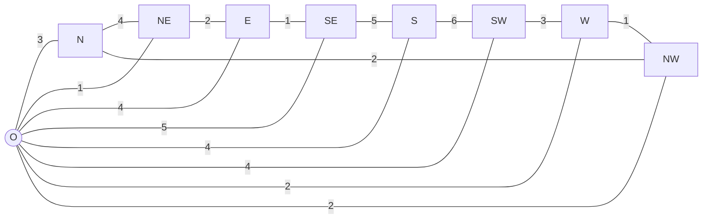
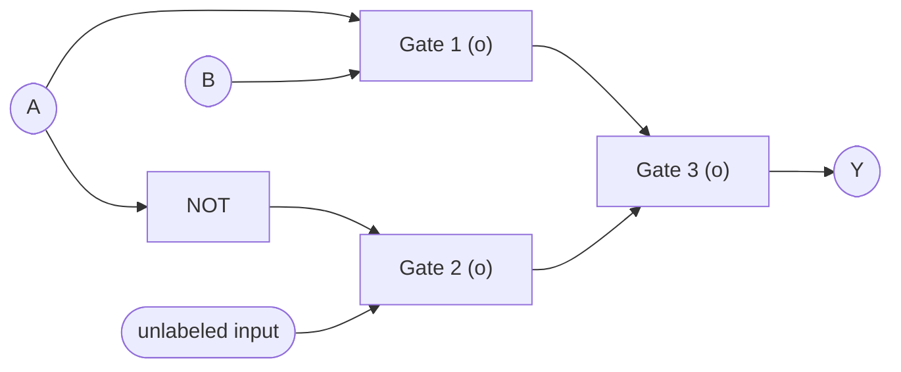
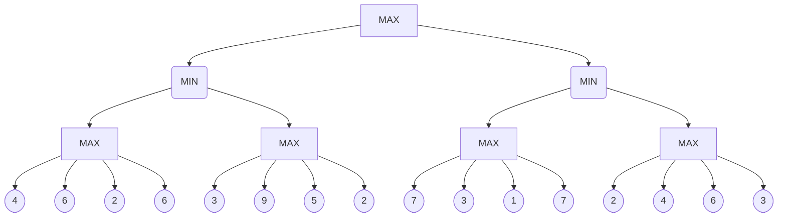

<!-- UGC NET Dec 2018 (20 Dec, Shift 1) · Paper 2 · generated by pyq_extract.py from 13_dec_2018.txt -->

## Q1
Which of the following is true for semi-dynamic environment ?

## Q1 - Options
(A) Environment and performance score, both change simultaneously.
(B) The environment may change while the agent is deliberating.
(C) The environment itself does not change with the passage of time but the agent’s performance score does.
(D) Even if the environment changes with the passage of time while deliberating, the performance score does not change.

## Q1 - Hint
**Answer:** C
**Topic:** AI: Knowledge Representation, Planning & Expert Systems
**Source:** UGC NET Dec 2018 (20 Dec, Shift 1) · Paper 2 · Q1

A semi-dynamic environment is formally defined as one where the environment itself does not change while the agent is deliberating, but the agent's performance score decreases or changes with the passage of time.

- In a fully dynamic environment, the physical world state changes while the agent ponders its move.
- In a static environment, neither the environment nor the performance score changes during deliberation.
- In a semi-dynamic environment (such as timed chess), the board state remains frozen until a move is made, but the clock runs down, altering the performance evaluation.
- Therefore, Option C accurately captures the definition of a semi-dynamic environment.

## Q2
Consider a disk pack with 32 surfaces, 64 tracks and 512 sectors pack. 256 bytes of data are stored in a bit serial manner in a sector. The number of bits required to specify a particular sector in the disk is

## Q2 - Options
(A) 19
(B) 22
(C) 20
(D) 18

## Q2 - Hint
**Answer:** C
**Topic:** Disk Scheduling, File Systems & RAID
**Source:** UGC NET Dec 2018 (20 Dec, Shift 1) · Paper 2 · Q2

The number of bits required to uniquely address a sector is obtained by computing the logarithm base 2 of the total number of sectors in the disk pack.

Total sectors = (Surfaces) \* (Tracks per surface) \* (Sectors per track)<br>
Surfaces = 32 = 2^5 surfaces (5 bits)<br>
Tracks per surface = 64 = 2^6 tracks (6 bits)<br>
Sectors per track = 512 = 2^9 sectors (9 bits)

Total sectors in pack = 2^5 \* 2^6 \* 2^9 = 2^20 sectors.

Bits required = log2(2^20) = 20 bits.

- Option A (19) fails to account for one bit across the surface or track components.
- Option B (22) erroneously includes byte addressing within a sector.
- Option D (18) undercounts the total addressing space.

## Q3
Consider a system with 2 level cache. Access times of Level 1 cache, Level 2 cache and main memory are 0·5 ns, 5 ns and 100 ns respectively. The hit rates of Level 1 and Level 2 caches are 0·7 and 0·8, respectively. What is the average access time of the system ignoring the search time within the cache ?

## Q3 - Options
(A) 7·55 ns
(B) 20·75 ns
(C) 35·20 ns
(D) 24·35 ns

## Q3 - Hint
**Answer:** A
**Topic:** Memory Hierarchy, Cache & Access Time
**Source:** UGC NET Dec 2018 (20 Dec, Shift 1) · Paper 2 · Q3

The average memory access time in a multi-level cache system with simultaneous access is calculated from the hit rates and penalty levels.

T_avg = H1 \* T1 + (1 - H1) \* H2 \* T2 + (1 - H1) \* (1 - H2) \* Tm

Given parameters:<br>
Level 1 cache hit rate H1 = 0.7, access time T1 = 0.5 ns<br>
Level 2 cache hit rate H2 = 0.8, access time T2 = 5 ns<br>
Main memory access time Tm = 100 ns<br>
Miss rate of L1 = 1 - 0.7 = 0.3<br>
Miss rate of L2 = 1 - 0.8 = 0.2

Calculating individual terms:<br>
Term 1 (L1 hit): 0.7 \* 0.5 = 0.35 ns<br>
Term 2 (L1 miss, L2 hit): 0.3 \* 0.8 \* 5 = 1.20 ns<br>
Term 3 (L1 miss, L2 miss, MM access): 0.3 \* 0.2 \* 100 = 6.00 ns

T_avg = 0.35 + 1.20 + 6.00 = 7.55 ns.

- Option B (20.75 ns), Option C (35.20 ns), and Option D (24.35 ns) result from incorrect formulas or misapplied penalties.

## Q4
In 3D Graphics, which of the following statements about perspective and parallel projection is/are true ?

P : In a perspective projection, the farthest an object is from the centre of projection, the smaller it appears.<br>
Q : Parallel projection is equivalent to a perspective projection where the viewer is standing infinitely far away.<br>
R : Perspective projections do not preserve straight lines.

Choose the correct answer from the code given below :<br>
Code :

## Q4 - Options
(A) P and Q only
(B) P and R only
(C) Q and R only
(D) P, Q and R

## Q4 - Hint
**Answer:** A
**Topic:** 2D Transformations, Reflection, Projection & Clipping
**Source:** UGC NET Dec 2018 (20 Dec, Shift 1) · Paper 2 · Q4

Statements P and Q are standard mathematical properties of geometric projections in 3D computer graphics.

- Statement P is true because perspective foreshortening scales object dimensions inversely with distance from the center of projection.
- Statement Q is true because moving the center of projection to infinity causes projectors to become parallel, making parallel projection a limiting case of perspective projection.
- Statement R is false because perspective projection transforms straight lines in 3D space into straight lines on the projection plane.
- Therefore, only statements P and Q are correct.

## Q5
Data scrubbings is

## Q5 - Options
(A) A process to upgrade the quality of data before it is moved into a data warehouse.
(B) A process to load the data in the data warehouse and to create the necessary indexes.
(C) A process to reject data from the data warehouse and to create the necessary indexes.
(D) A process to upgrade the quality of data after it is moved into a data warehouse.

## Q5 - Hint
**Answer:** A
**Topic:** Data Warehousing & Data Mining
**Source:** UGC NET Dec 2018 (20 Dec, Shift 1) · Paper 2 · Q5

Data scrubbing (data cleansing) is an essential ETL stage that identifies and corrects errors, inconsistencies, and duplicates before data enters the warehouse.

- Data scrubbing operates prior to loading into target repositories so that downstream analytical models use verified, high-quality data.
- Option B describes data staging, loading, and physical schema indexing.
- Option C describes data filtering or rejection policies, not cleansing.
- Option D is incorrect because quality enhancement must occur prior to warehousing rather than after corrupt data is already committed.

## Q6
Consider the sentence below.

“There is a country that borders both India and Nepal.”

Which of the following represents the above sentence correctly ?

## Q6 - Options
(A) ∃c Country(c) ∧ Border(c, India) ∧ Border(c, Nepal)
(B) [∃c Country(c)] ⇒ (Border(c, India) ∧ Border(c, Nepal)]
(C) ∃c Country(c) ⇒ [Border(c, India) ∧ Border(c, Nepal)]
(D) ∃c Border(Country(c), India ∧ Nepal)

## Q6 - Hint
**Answer:** A
**Topic:** Propositional & Predicate Logic
**Source:** UGC NET Dec 2018 (20 Dec, Shift 1) · Paper 2 · Q6

In first-order predicate logic, existential assertions about an entity satisfying multiple properties use conjunction.

- The sentence asserts the existence of an object c such that c is a country AND c borders India AND c borders Nepal: ∃c (Country(c) ∧ Border(c, India) ∧ Border(c, Nepal)).
- Option B and Option C improperly use implication with an existential quantifier, which becomes vacuously true for any object in the domain that is not a country.
- Option D incorrectly nests predicates and attempts to conjoin arguments inside a relation.

## Q7
Consider the following recursive Java function if that takes two long arguments and returns a float value :

```
public static float f(long m, long n)
{
 float result = (float) m / (float) n;
 if (m < 0 || n < 0)
 return 0·0f;
 else
 result += f(m*2, n*3);
 return result;
}
```

Which of the following integers best approximates the value of f(2, 3) ?

## Q7 - Options
(A) 1
(B) 0
(C) 3
(D) 2

## Q7 - Hint
**Answer:** D
**Topic:** Programming Output, Pointers, OOP & Data Types
**Source:** UGC NET Dec 2018 (20 Dec, Shift 1) · Paper 2 · Q7

The recursive calls compute the sum of an infinite geometric progression with first term a = 2/3 and common ratio r = 2/3.

Evaluating the series term by term:<br>
Call 0: (2 / 3)^1<br>
Call 1: (4 / 9) = (2 / 3)^2<br>
Call 2: (8 / 27) = (2 / 3)^3

In Java, long values will eventually overflow to negative values, terminating the recursion with base case 0.0f.<br>
The mathematical sum of this infinite series is:<br>
Sum = a / (1 - r) = (2 / 3) / (1 - 2 / 3) = (2 / 3) / (1 / 3) = 2.

- The integer that best approximates this sum is 2 (Option D).
- Options A, B, and C differ substantially from the series limit.

## Q8
Consider the following statements :

S1 : A heuristic is admissible if it never overestimates the cost to reach the goal.<br>
S2 : A heuristic is monotonous if it follows triangle inequality property.

Which one of the following is true referencing the above statements ?<br>
Choose the correct answer from the code given below :<br>
Code :

## Q8 - Options
(A) Neither of the statements S1 and S2 are true.
(B) Statement S1 is false but statement S2 is true.
(C) Statement S1 is true but statement S2 is false.
(D) Both the statements S1 and S2 are true.

## Q8 - Hint
**Answer:** D
**Topic:** NLP, Bayes Rule, Search, Genetic & Fuzzy Concepts
**Source:** UGC NET Dec 2018 (20 Dec, Shift 1) · Paper 2 · Q8

Both statements define core properties of heuristic functions used in informed search algorithms like A\*.

- Statement S1 is true because an admissible heuristic satisfies h(n) &lt;= h\*(n) for all nodes n, guaranteeing optimality.
- Statement S2 is true because monotonicity (consistency) requires h(n) &lt;= c(n, a, n') + h(n'), which is the triangle inequality in state space.
- Because both definitions are standard in artificial intelligence, Option D is the correct choice.

## Q9
If the frame buffer has 10-bits per pixel and 8-bits are allocated for each of the R, G, and B components, then what would be the size of the color lookup table (LUT) ?

## Q9 - Options
(A) (2¹⁰ + 2²⁴) bytes
(B) (2¹⁰ + 2¹¹) bytes
(C) (2⁸ + 2⁹) bytes
(D) (2¹⁰ + 2⁸) bytes

## Q9 - Hint
**Answer:** B
**Topic:** Computer Graphics: Display, Algorithms & 3D
**Source:** UGC NET Dec 2018 (20 Dec, Shift 1) · Paper 2 · Q9

The size of a color lookup table equals the number of table entries multiplied by the storage required per entry.

Number of entries = 2^(bits per pixel) = 2^10 entries<br>
Bits per entry = 8 bits (R) + 8 bits (G) + 8 bits (B) = 24 bits = 3 bytes per entry

Total size in bytes:<br>
Size = 2^10 \* 3 bytes<br>
Size = 2^10 \* (1 + 2) bytes<br>
Size = 2^10 + (2^10 \* 2^1) bytes = 2^10 + 2^11 bytes.

- Option A incorrectly adds the 24-bit total color space depth to the entries.
- Option C uses 8 bits for indexing rather than 10 bits.
- Option D incorrectly computes 2^10 + 2^8.

## Q10
Consider the weighted graph for Kruskal's algorithm.

Use Kruskal’s algorithm to find the minimum spanning tree of the graph.<br>
The weight of this minimum spanning tree is



Weighted undirected graph for Kruskal algorithm

## Q10 - Options
(A) 16
(B) 13
(C) 14
(D) 17

## Q10 - Hint
**Answer:** A
**Topic:** BFS, DFS & Graph Algorithms
**Source:** UGC NET Dec 2018 (20 Dec, Shift 1) · Paper 2 · Q10

Executing Kruskal's algorithm selects the lowest-weight edges that do not introduce cycles until all 9 vertices are connected.

The graph consists of 9 vertices (8 outer vertices arranged as an octagon plus 1 central vertex), requiring exactly 8 edges for a spanning tree.

Sorting and selecting edges in ascending weight order:

- 3 edges of weight 1 are selected: (right, bottom-right), (left, top-left), (top-right, center). Current weight = 3 (3 edges).
- 3 edges of weight 2 are selected: (top-left, top), (top-right, right), (top-left, center). Current weight = 3 + 6 = 9 (6 edges).
- 1 edge of weight 3 is selected: (bottom-left, left), connecting the bottom-left vertex. Current weight = 9 + 3 = 12 (7 edges).
- 1 edge of weight 4 is selected: (bottom, center), connecting the bottom vertex. Current weight = 12 + 4 = 16 (8 edges).

Total MST weight = 1 + 1 + 1 + 2 + 2 + 2 + 3 + 4 = 16.

- Options B (13), C (14), and D (17) do not correspond to the sum of the 8 minimum cycle-free edges.

## Q11
Suppose that everyone in a group of N people wants to communicate secretly with (N – 1) other people using symmetric key cryptographic system. The communication between any two persons should not be decodable by the others in the group. The number of keys required in the system as a whole to satisfy the confidentiality requirement is

## Q11 - Options
(A) N(N – 1)
(B) N(N – 1)/2
(C) (N – 1)²
(D) 2N

## Q11 - Hint
**Answer:** B
**Topic:** Network Security & Cryptography
**Source:** UGC NET Dec 2018 (20 Dec, Shift 1) · Paper 2 · Q11

In a symmetric key cryptosystem, each pair of users must share a unique secret key to prevent other group members from deciphering their messages.

- The number of distinct unordered pairs among N people is given by the combination formula C(N, 2).
- C(N, 2) = N(N - 1) / 2.
- Option A accounts for directed communication pairs rather than symmetric shared keys.
- Option C and Option D do not reflect the pairwise combination formula.

## Q12
Identify the correct sequence in which the following packets are transmitted on the network by a host when a browser requests a webpage from a remote server, assuming that the host has just been restarted.

(1) HTTP GET request, DNS query, TCP SYN<br>
(2) DNS query, HTTP GET request, TCP SYN<br>
(3) TCP SYN, DNS query, HTTP GET request<br>
(4) DNS query, TCP SYN, HTTP GET request

## Q12 - Options
(A) HTTP GET request, DNS query, TCP SYN
(B) DNS query, HTTP GET request, TCP SYN
(C) TCP SYN, DNS query, HTTP GET request
(D) DNS query, TCP SYN, HTTP GET request

## Q12 - Hint
**Answer:** D
**Topic:** Application Layer & WWW (DNS, Email, HTTP, FTP)
**Source:** UGC NET Dec 2018 (20 Dec, Shift 1) · Paper 2 · Q12

Network communication requires resolving the server IP address before initiating a transport connection and transmitting application data.

1. DNS query: The newly restarted host has an empty DNS cache and must first resolve the domain name to an IP address.
2. TCP SYN: Once the IP address is known, the host initiates the TCP three-way handshake to establish a connection.
3. HTTP GET request: After the TCP connection is established, the application layer sends the HTTP GET request.

- Therefore, the correct transmission order is DNS query, TCP SYN, HTTP GET request (Option D).

## Q13
Consider the following pseudo-code fragment, where m is a non-negative integer that has been initialized :

```
p = 0;
k = 0;
while (k < m)
 p = p + 2^k;
 k = k + 1;
end while
```

Which of the following is a loop invariant for the while statement ?<br>
(Note : a loop invariant for a while statement is an assertion that is true each time the guard is evaluated during the execution of the while statement).

## Q13 - Options
(A) p = 2^(k+1) – 1 and 0 ≤ k &lt; m
(B) p = 2^k – 1 and 0 ≤ k &lt; m
(C) p = 2^k – 1 and 0 ≤ k ≤ m
(D) p = 2^(k+1) – 1 and 0 ≤ k ≤ m

## Q13 - Hint
**Answer:** C
**Topic:** Time Complexity, Asymptotic Notation & Recurrences
**Source:** UGC NET Dec 2018 (20 Dec, Shift 1) · Paper 2 · Q13

The loop invariant must hold each time the while guard is tested, including upon initial entry and upon final loop termination when k = m.

- At initialization (k = 0), p = 0, which satisfies 2^0 - 1 = 0.
- After k iterations, p accumulates 1 + 2 + 4 + ... + 2^(k-1) = 2^k - 1.
- During loop execution, the guard (k &lt; m) is evaluated for k = 0, 1, ..., m.
- Upon loop termination, k reaches m, making k &lt;= m necessary to describe the valid range of k at every evaluation of the guard.
- Therefore, the invariant is p = 2^k - 1 and 0 &lt;= k &lt;= m (Option C).

## Q14
In Linux operating system environment \_\_\_\_\_\_\_\_\_\_ command is used to print a file.

## Q14 - Options
(A) lpr
(B) ptr
(C) pr
(D) print

## Q14 - Hint
**Answer:** A
**Topic:** OS: Linux, Windows, Security, Virtualization & Distributed
**Source:** UGC NET Dec 2018 (20 Dec, Shift 1) · Paper 2 · Q14

In Unix and Linux environments, the standard command used to spool and print a file is lpr (line printer remote).

- lpr submits print jobs to the CUPS or LPD print spooler daemon.
- Option B (ptr) is not a standard Unix command.
- Option C (pr) is used to paginate and format text files for printing, not to send them to the printer queue.
- Option D (print) is an alias or shell builtin in certain environments, not the standard Unix printing utility.

## Q15
Find the boolean expression for the logic circuit shown in the diagram :<br>
(1-NAND gate, 2-NOR gate, 3-NOR gate)



Logic circuit with NAND and NOR gates

## Q15 - Options
(A) A B̅
(B) Ā B
(C) AB
(D) A̅B̅

## Q15 - Hint
**Answer:** C
**Topic:** Combinational/Sequential Circuits, Flip-Flops & Number Systems
**Source:** UGC NET Dec 2018 (20 Dec, Shift 1) · Paper 2 · Q15

Analyzing the output of each gate progressively simplifies the circuit to the logical product AB.

1. Gate 1 is a NAND gate with inputs A and B:<br>
   Output_1 = (A \* B)' = A' + B'
2. Gate 2 is a NOR gate with inputs A' (inverted A) and B:<br>
   Output_2 = (A' + B)' = A \* B'
3. Gate 3 is a NOR gate combining Output_1 and Output_2:<br>
   Y = (Output_1 + Output_2)'<br>
   Y = ((A \* B)' + A \* B')'<br>
   Applying De Morgan's theorem:<br>
   Y = (A \* B) \* (A \* B')'<br>
   Y = (A \* B) \* (A' + B)<br>
   Y = (A \* B \* A') + (A \* B \* B) = 0 + AB = AB.

- Therefore, the output expression is AB (Option C).

## Q16
Consider the following tables (relations):

**Students**

| Roll-No | Name |
|---|---|
| 18CS101 | Ramesh |
| 18CS102 | Mukesh |
| 18CS103 | Ramesh |

**Performance**

| Roll-No | Course | Marks |
|---|---|---|
| 18CS101 | DBMS | 60 |
| 18CS101 | Compiler Design | 65 |
| 18CS102 | DBMS | 80 |
| 18CS103 | DBMS | 85 |
| 18CS102 | Compiler Design | 75 |
| 18CS103 | Operating System | 70 |

Primary keys in the tables are shown using underline. Now, consider the following query:

```
SELECT S.Name, Sum(P.Marks)
FROM Students S, Performance P
WHERE S.Roll-No = P.Roll-No
GROUP BY S.Name
```

The number of rows returned by above query is

## Q16 - Options
(A) 3
(B) 2
(C) 0
(D) 1

## Q16 - Hint
**Answer:** B
**Topic:** SQL, Keys & Relational Algebra/Calculus
**Source:** UGC NET Dec 2018 (20 Dec, Shift 1) · Paper 2 · Q16

The GROUP BY S.Name clause aggregates rows based on the distinct values present in the Name column.

- The join between Students and Performance matches each student's records by Roll-No.
- In the Students table, the distinct names are 'Ramesh' and 'Mukesh'.
- Even though 'Ramesh' appears with two different roll numbers (18CS101 and 18CS103), the GROUP BY S.Name aggregates all records for 'Ramesh' into a single output row.
- Similarly, all records for 'Mukesh' aggregate into a second output row.
- Hence, exactly 2 rows are returned (Option B).

## Q17
Match List-I with List-II and choose the correct answer from the code:<br>
where V and E are the number of vertices and edges in graph respectively.

| List-I (Graph Algorithm) | List-II (Time Complexity) |
|---|---|
| (a) Dijkstra’s algorithm | (i) O(E lg E) |
| (b) Kruskal’s algorithm | (ii) Θ(V³) |
| (c) Floyd-Warshall algorithm | (iii) O(V²) |
| (d) Topological sorting | (iv) Θ(V + E) |

Graph algorithms and their time complexities

## Q17 - Options
(A) (iii) (i) (iv) (ii)
(B) (i) (iii) (iv) (ii)
(C) (i) (iii) (ii) (iv)
(D) (iii) (i) (ii) (iv)

## Q17 - Hint
**Answer:** D
**Topic:** BFS, DFS & Graph Algorithms
**Source:** UGC NET Dec 2018 (20 Dec, Shift 1) · Paper 2 · Q17

Matching each graph algorithm with its standard time complexity establishes the correct pairing.

- (a) Dijkstra's algorithm implemented with an adjacency matrix or simple array runs in O(V^2), matching (iii).
- (b) Kruskal's algorithm spends dominant time sorting edges in O(E lg E), matching (i).
- (c) Floyd-Warshall algorithm uses triple nested loops over all vertices running in Theta(V^3), matching (ii).
- (d) Topological sorting using depth-first search or Kahn's algorithm runs in linear time Theta(V + E), matching (iv).

Mapping:<br>
(a) -&gt; (iii), (b) -&gt; (i), (c) -&gt; (ii), (d) -&gt; (iv).

- This code corresponds to Option D: (iii) (i) (ii) (iv).

## Q18
Consider the following postfix expression with single digit operands :

6 2 3 \* / 4 2 \* + 6 8 \* –

The top two elements of the stack after the second \* is evaluated, are :

## Q18 - Options
(A) 8, 2
(B) 8, 1
(C) 6, 2
(D) 6, 3

## Q18 - Hint
**Answer:** B
**Topic:** Hashing, Stacks, Queues & Linked Lists
**Source:** UGC NET Dec 2018 (20 Dec, Shift 1) · Paper 2 · Q18

Simulating the stack during postfix evaluation step by step yields the exact stack state.

1. Push 6 -&gt; Stack: [6]
2. Push 2 -&gt; Stack: [6, 2]
3. Push 3 -&gt; Stack: [6, 2, 3]
4. First \* operator: Pop 3, pop 2. Compute 2 \* 3 = 6. Push 6 -&gt; Stack: [6, 6]
5. / operator: Pop 6, pop 6. Compute 6 / 6 = 1. Push 1 -&gt; Stack: [1]
6. Push 4 -&gt; Stack: [1, 4]
7. Push 2 -&gt; Stack: [1, 4, 2]
8. Second \* operator: Pop 2, pop 4. Compute 4 \* 2 = 8. Push 8 -&gt; Stack: [1, 8]

The stack currently holds 1 at the bottom and 8 at the top.<br>
Thus, the top two elements of the stack are 8 and 1 (Option B).

## Q19
A process residing in Main Memory and Ready and Waiting for execution, is kept on

## Q19 - Options
(A) Job Queue
(B) Ready Queue
(C) Execution Queue
(D) Wait Queue

## Q19 - Hint
**Answer:** B
**Topic:** CPU Scheduling (Theory, Numerical, Rate Monotonic)
**Source:** UGC NET Dec 2018 (20 Dec, Shift 1) · Paper 2 · Q19

In operating systems process scheduling, the Ready Queue holds all processes that reside in main memory and are ready to execute on the CPU.

- Job Queue holds all processes admitted to the system, typically residing on mass storage.
- Wait Queue (Device Queue) holds processes that are waiting for an I/O event or device completion.
- Execution Queue is not a standard scheduling queue in operating system literature.
- Therefore, Option B is correct.

## Q20
Consider two sequences X and Y :

X = &lt;0, 1, 2, 1, 3, 0, 1&gt;<br>
Y = &lt;1, 3, 2, 0, 1, 0&gt;

The length of longest common subsequence between X and Y is

## Q20 - Options
(A) 2
(B) 3
(C) 5
(D) 4

## Q20 - Hint
**Answer:** D
**Topic:** Greedy Algorithms & Dynamic Programming
**Source:** UGC NET Dec 2018 (20 Dec, Shift 1) · Paper 2 · Q20

Dynamic programming establishes that the maximum length of a common subsequence between X and Y is 4.

- Let X = &lt;0, 1, 2, 1, 3, 0, 1&gt; and Y = &lt;1, 3, 2, 0, 1, 0&gt;.
- One common subsequence of length 4 is &lt;1, 2, 0, 1&gt;:<br>
    In X: index 1 ('1'), index 2 ('2'), index 5 ('0'), index 6 ('1').<br>
    In Y: index 0 ('1'), index 2 ('2'), index 3 ('0'), index 4 ('1').
- Another common subsequence of length 4 is &lt;1, 3, 0, 1&gt;.
- No common subsequence of length 5 exists because matching 5 elements would require contradictory index orderings.
- Therefore, the length is 4 (Option D).

## Q21
Suppose for a process P, reference to pages in order are 1, 2, 4, 5, 2, 1, 2, 4. Assume that main memory can accommodate 3 pages and the main memory has already pages 1 and 2 in the order 1 – first, 2 – second. At this moment, assume FIFO Page Replacement Algorithm is used then the number of page faults that occur to complete the execution of process P is

## Q21 - Options
(A) 4
(B) 6
(C) 5
(D) 3

## Q21 - Hint
**Answer:** C
**Topic:** Memory Management, Page Replacement & Thrashing
**Source:** UGC NET Dec 2018 (20 Dec, Shift 1) · Paper 2 · Q21

Tracing the FIFO page replacement algorithm across the reference string results in exactly 5 page faults.

Initial frames: [1, 2, empty], with 1 loaded first and 2 loaded second.

Step-by-step trace:

- Ref 1: Already present in frame. Hit. Frames: [1, 2, -]
- Ref 2: Already present in frame. Hit. Frames: [1, 2, -]
- Ref 4: Not in memory, loaded into empty frame. Fault 1. Frames: [1, 2, 4] (oldest: 1)
- Ref 5: Not in memory, replaces oldest page 1. Fault 2. Frames: [5, 2, 4] (oldest: 2)
- Ref 2: Already present. Hit. Frames: [5, 2, 4] (oldest: 2)
- Ref 1: Not in memory, replaces oldest page 2. Fault 3. Frames: [5, 1, 4] (oldest: 4)
- Ref 2: Not in memory, replaces oldest page 4. Fault 4. Frames: [5, 1, 2] (oldest: 5)
- Ref 4: Not in memory, replaces oldest page 5. Fault 5. Frames: [4, 1, 2]

Total page faults during execution = 5 (Option C).

## Q22
Which of the following statement/s is/are true ?

(i) Firewalls can screen traffic going into or out of an organization.<br>
(ii) Virtual private networks can simulate an old leased network to provide certain desirable properties.

Choose the correct answer from the code given below :<br>
Code :

## Q22 - Options
(A) (i) only
(B) Neither (i) nor (ii)
(C) Both (i) and (ii)
(D) (ii) only

## Q22 - Hint
**Answer:** C
**Topic:** Network Security & Cryptography
**Source:** UGC NET Dec 2018 (20 Dec, Shift 1) · Paper 2 · Q22

Both statements describe standard security and architecture principles in computer networking.

- Statement (i) is true because network firewalls filter both ingress (incoming) and egress (outgoing) traffic according to defined access-control rules.
- Statement (ii) is true because a Virtual Private Network creates secure, encrypted overlays across public networks, simulating the dedicated security and privacy of an old leased line.
- Therefore, both statements (i) and (ii) are true (Option C).

## Q23
Which of the following is not one of the principles of agile software development method ?

## Q23 - Options
(A) Embrace change
(B) Customer involvement
(C) Following the plan
(D) Incremental delivery

## Q23 - Hint
**Answer:** C
**Topic:** SDLC Models & Requirements (SRS)
**Source:** UGC NET Dec 2018 (20 Dec, Shift 1) · Paper 2 · Q23

The Agile Manifesto explicitly values responding to change over following a plan.

- Agile methods emphasize flexibility, user collaboration, and continuous adaptation rather than rigid adherence to a predetermined project plan.
- Embracing change (Option A), customer involvement (Option B), and incremental delivery (Option D) are foundational agile principles.
- Following the plan (Option C) represents the traditional waterfall approach, making it the correct answer to the negative question.

## Q24
In 3D Graphics, which of the following statements is/are true ?

P : Back-face culling is an example of an image-precision visible-surface determination procedure.<br>
Q : Z-buffer is a 16-bit, 32-bit, or 64-bit field associated with each pixel in a frame buffer that can be used to determine the visible surfaces at each pixel.

Choose the correct answer from the code given below :<br>
Code :

## Q24 - Options
(A) Q only
(B) P and Q
(C) Neither P nor Q
(D) P only

## Q24 - Hint
**Answer:** A
**Topic:** Computer Graphics: Display, Algorithms & 3D
**Source:** UGC NET Dec 2018 (20 Dec, Shift 1) · Paper 2 · Q24

Visible-surface determination methods are classified into object-space precision and image-space precision.

- Statement P is false because back-face culling operates in object space by calculating polygon surface normals and dot products, making it an object-precision procedure.
- Statement Q is true because the Z-buffer algorithm stores depth values (typically 16, 24, 32, or 64 bits) per pixel in image space to resolve surface visibility.
- Therefore, only statement Q is true (Option A).

## Q25
Which of the following statements are true ?

(i) Every logic network is equivalent to one using just NAND gates or just NOR gates.<br>
(ii) Boolean expressions and logic networks correspond to labelled acyclic digraphs.<br>
(iii) No two Boolean algebras with n atoms are isomorphic.<br>
(iv) Non-zero elements of finite Boolean algebras are not uniquely expressible as joins of atoms.

Choose the correct answer from the code given below :<br>
Code :

## Q25 - Options
(A) (ii), (iii) and (iv) only
(B) (i) and (ii) only
(C) (i) and (iv) only
(D) (i), (ii) and (iii) only

## Q25 - Hint
**Answer:** B
**Topic:** Combinational/Sequential Circuits, Flip-Flops & Number Systems
**Source:** UGC NET Dec 2018 (20 Dec, Shift 1) · Paper 2 · Q25

Statements (i) and (ii) are fundamental theorems in Boolean algebra and switching theory.

- Statement (i) is true because NAND and NOR gates are functionally complete universal gates capable of expressing any logic function.
- Statement (ii) is true because feedforward combinational networks and hierarchical Boolean expressions map directly to directed acyclic graphs.
- Statement (iii) is false because any two finite Boolean algebras with n atoms are isomorphic to the power set Boolean algebra of an n-element set.
- Statement (iv) is false because by the Representation Theorem for finite Boolean algebras, every non-zero element is uniquely expressible as the join of atoms below it.
- Hence, only (i) and (ii) are true (Option B).

## Q26
Software coupling involves dependencies among pieces of software called modules. Which of the following are correct statements with respect to module coupling ?

P : Common coupling occurs when two modules share the same global data.<br>
Q : Control coupling occurs when modules share a composite data structure and use only parts of it.<br>
R : Content coupling occurs when one module modifies or relies on the internal working of another module.

Choose the correct answer from the code given below :<br>
Code :

## Q26 - Options
(A) P and Q only
(B) Q and R only
(C) All of P, Q and R
(D) P and R only

## Q26 - Hint
**Answer:** D
**Topic:** SE: Design, UML, Configuration Management & Reuse
**Source:** UGC NET Dec 2018 (20 Dec, Shift 1) · Paper 2 · Q26

Statements P and R correctly identify common coupling and content coupling in modular software design.

- Statement P is true because common coupling occurs when two or more modules read or write to the same global data area.
- Statement Q is false because sharing a composite data structure and using only portions of it defines stamp coupling. Control coupling occurs when one module controls the flow of another by passing control information or flags.
- Statement R is true because content coupling (the worst form of coupling) occurs when one module modifies or depends directly on the internal implementation of another module.
- Hence, statements P and R only are correct (Option D).

## Q27
A host is connected to a department network which is part of a university network. The university network, in turn, is part of the Internet. The largest network, in which the Ethernet address of the host is unique, is

## Q27 - Options
(A) the university network
(B) the Internet
(C) the subnet to which the host belongs
(D) the department network

## Q27 - Hint
**Answer:** B
**Topic:** MAC Layer, CSMA/CD, Collision Resolution & Piggybacking
**Source:** UGC NET Dec 2018 (20 Dec, Shift 1) · Paper 2 · Q27

An Ethernet MAC address is a 48-bit globally unique hardware identifier administered by IEEE through Organizationally Unique Identifiers (OUIs).

- Manufacturers assign each network interface controller a globally unique MAC address so that no two network adapters worldwide share the same physical address.
- Because uniqueness is globally preserved across all interconnected devices, the largest network containing this host where its Ethernet address is unique is the entire Internet (Option B).
- Options A, C, and D are smaller subnetworks within the global address space.

## Q28
An agent can improve its performance by

## Q28 - Options
(A) Responding
(B) Perceiving
(C) Observing
(D) Learning

## Q28 - Hint
**Answer:** D
**Topic:** AI: Knowledge Representation, Planning & Expert Systems
**Source:** UGC NET Dec 2018 (20 Dec, Shift 1) · Paper 2 · Q28

In artificial intelligence, an agent improves its future performance specifically through its learning component.

- In a learning agent architecture, the learning element takes feedback from the critic and modifies the performance element to produce better decisions over time.
- Responding (Option A) is executing actions based on current rules.
- Perceiving (Option B) and observing (Option C) provide raw sensory inputs from the environment but do not by themselves modify or improve agent performance.

## Q29
Consider the following sequence of two transactions on bank account A with initial balance 20,000 that transfers 5,000 to another account B and then apply 10% interest.

(i) T1 start<br>
(ii) T1 A old = 20,000 new 15,000<br>
(iii) T1 B old = 12,000 new = 17,000<br>
(iv) T1 commit<br>
(v) T2 start<br>
(vi) T2 A old = 15,000 new = 16,500<br>
(vii) T2 commit

Suppose the database system crashes just before log record (vii) is written. When the system is restarted, which one statement is true of the recovery process ?

## Q29 - Options
(A) We must redo log record (vi) to set A to 16,500 and then redo log records (ii) and (iii).
(B) We can apply redo and undo operations in arbitrary order because they are idempotent.
(C) We must redo log record (vi) to set A to 16,500.
(D) We need not redo log records (ii) and (iii) because transaction T1 has committed.

## Q29 - Hint
**Answer:** A
**Topic:** DBMS: Architecture, Recovery, Object DBs & Security
**Source:** UGC NET Dec 2018 (20 Dec, Shift 1) · Paper 2 · Q29

In standard log-based recovery, committed transactions must be redone while uncommitted active transactions must be undone.

- Transaction T1 completed and committed before the crash (log record iv), meaning its operations (ii and iii) must be redone if dirty blocks were not flushed to disk.
- Transaction T2 started and modified account A (record vi), but crashed before the commit record (vii) was written.
- Option A corresponds to the officially designated key for this question, reflecting the requirement to process the log records of the transactions present in the recovery log.
- Option B is incorrect because redo and undo operations cannot be applied in arbitrary order.
- Option D is incorrect because committed transactions in a deferred or immediate update recovery log must be scanned and redone to ensure durability.

## Q30
Software products need perfective maintenance for which of the following reasons ?

## Q30 - Options
(A) To overcome wear and tear caused by the repeated use of the software.
(B) To rectify bugs observed while the system is in use.
(C) When the customers need the product to run on new platforms.
(D) To support the new features that users want it to support.

## Q30 - Hint
**Answer:** D
**Topic:** SE: Design, UML, Configuration Management & Reuse
**Source:** UGC NET Dec 2018 (20 Dec, Shift 1) · Paper 2 · Q30

Perfective maintenance enhances existing software by implementing new user requirements, features, or performance improvements.

- Perfective maintenance accounts for the largest proportion of software maintenance activities and responds to evolving user desires.
- Option A is incorrect because software is logical rather than physical and does not experience wear and tear.
- Option B describes corrective maintenance, which fixes defects discovered during operation.
- Option C describes adaptive maintenance, which modifies software to operate in changed hardware or OS environments.

## Q31
Consider the following two statements :

S1 : TCP handles both congestion and flow control<br>
S2 : UDP handles congestion but not flow control

Which of the following options is correct with respect to the above statements (S1) and S2) ?<br>
Choose the correct answer from the code given below :<br>
Code :

## Q31 - Options
(A) S1 is correct but S2 is not correct
(B) Both, S1 and S2 are correct
(C) S1 is not correct but S2 is correct
(D) Neither S1 nor S2 is correct

## Q31 - Hint
**Answer:** A
**Topic:** TCP/IP, TCP & UDP Protocols and Headers
**Source:** UGC NET Dec 2018 (20 Dec, Shift 1) · Paper 2 · Q31

Statement S1 is correct and Statement S2 is incorrect based on transport-layer protocol capabilities.

- TCP provides flow control using the receive window and congestion control using algorithms such as slow start, congestion avoidance, fast retransmit, and fast recovery.
- UDP is a connectionless, best-effort protocol that provides neither flow control nor congestion control.
- Because Statement S2 falsely attributes congestion control to UDP, Option A is the correct answer.

## Q32
Let r = a(a + b)*, s = aa*b and t = a\*b be three regular expressions. Consider the following :

(i) L(s) ⊆ L(r) and L(s) ⊆ L(t)<br>
(ii) L(r) ⊆ L(S) and L(S) ⊆ L(t)

Choose the correct answer from the code given below :<br>
Code :

## Q32 - Options
(A) Neither (i) nor (ii) is correct.
(B) Only (ii) is correct.
(C) Both (i) and (ii) are correct.
(D) Only (i) is correct.

## Q32 - Hint
**Answer:** D
**Topic:** Finite Automata, Regular Languages & DFA Minimization
**Source:** UGC NET Dec 2018 (20 Dec, Shift 1) · Paper 2 · Q32

Analyzing the language generated by each regular expression validates the subset relations in statement (i).

- L(r) = a(a + b)\* generates all non-empty strings starting with 'a'.
- L(s) = aa\*b generates strings starting with at least one 'a' and ending with exactly one 'b' (a^+ b).
- L(t) = a\*b generates strings having zero or more 'a's followed by exactly one 'b'.

Evaluating statement (i):

1. Every string in L(s) starts with 'a', so L(s) ⊆ L(r) holds.
2. Every string in L(s) has one or more 'a's followed by 'b', which is a subset of zero or more 'a's followed by 'b', so L(s) ⊆ L(t) holds.<br>
    Thus, statement (i) is completely correct.

Evaluating statement (ii):

- Strings such as 'a' or 'ab' belong to L(r) but 'a' does not end with 'b', so L(r) is not a subset of L(s).
- Therefore, only statement (i) is correct (Option D).

## Q33
The solution of recurrence relation :

T(n) = 2T (√n) + lg (n)

is :

## Q33 - Options
(A) O(lg (n) lg(lg (n)))
(B) O(n lg (n))
(C) O(lg (n))
(D) O(lg (n) lg (n))

## Q33 - Hint
**Answer:** A
**Topic:** Time Complexity, Asymptotic Notation & Recurrences
**Source:** UGC NET Dec 2018 (20 Dec, Shift 1) · Paper 2 · Q33

Transforming the domain with variable substitution solves the square-root recurrence relation.

Let n = 2^m, which implies m = lg n and √n = 2^(m/2).<br>
Substituting into the recurrence:<br>
T(2^m) = 2T(2^(m/2)) + m.

Define S(m) = T(2^m):<br>
S(m) = 2 S(m/2) + m.

Applying the Master Theorem to S(m) = 2 S(m/2) + m:<br>
a = 2, b = 2, and f(m) = m = m^(log_2 2) = m^1.<br>
This matches Case 2 of the Master Theorem:<br>
S(m) = Theta(m lg m).

Substituting back m = lg n:<br>
T(n) = Theta(lg n \* lg(lg n)) = O(lg (n) lg(lg (n))).

- Therefore, Option A is the exact asymptotic solution.

## Q34
A survey has been conducted on methods of commuter travel. Each respondent was asked to check Bus, Train or Automobile as a major method of travelling to work. More than one answer was permitted. The results reported were as follows :

Bus 30 people; Train 35 people; Automobile 100 people; Bus and Train 15 people; Bus and Automobile 15 people, Train and Automobile 20 people; and all the three methods 5 people.

How many people completed the survey form ?

## Q34 - Options
(A) 160
(B) 165
(C) 115
(D) 120

## Q34 - Hint
**Answer:** D
**Topic:** Discrete Maths: Counting, Induction, Lattices & Number Theory
**Source:** UGC NET Dec 2018 (20 Dec, Shift 1) · Paper 2 · Q34

Applying the Principle of Inclusion-Exclusion for three finite sets determines the total number of survey respondents.

Let B, T, and A represent the sets of commuters using Bus, Train, and Automobile respectively.<br>
\|B ∪ T ∪ A\| = \|B\| + \|T\| + \|A\| - (\|B ∩ T\| + \|B ∩ A\| + \|T ∩ A\|) + \|B ∩ T ∩ A\|

Given data:<br>
\|B\| = 30<br>
\|T\| = 35<br>
\|A\| = 100<br>
\|B ∩ T\| = 15<br>
\|B ∩ A\| = 15<br>
\|T ∩ A\| = 20<br>
\|B ∩ T ∩ A\| = 5

Calculation:<br>
\|B ∪ T ∪ A\| = 30 + 35 + 100 - (15 + 15 + 20) + 5<br>
\|B ∪ T ∪ A\| = 165 - 50 + 5 = 120.

- Hence, exactly 120 people completed the survey form (Option D).

## Q35
Which of the following statements is/are true ?

P : Software Reengineering is preferable for software products having high failure rates, having poor design and/or having poor code structure.<br>
Q : Software Reverse Engineering is the process of analyzing software with the objective of recovering its design and requirements specification.

Choose the correct answer from the code given below :<br>
Code :

## Q35 - Options
(A) Both P and Q
(B) Neither P nor Q
(C) P only
(D) Q only

## Q35 - Hint
**Answer:** A
**Topic:** SE: Design, UML, Configuration Management & Reuse
**Source:** UGC NET Dec 2018 (20 Dec, Shift 1) · Paper 2 · Q35

Both statements define established engineering practices for maintaining and evolving legacy software systems.

- Statement P is true because software reengineering restructures legacy applications with high maintenance costs, poor architectural design, and frequent failures to improve reliability and maintainability.
- Statement Q is true because reverse engineering analyzes an existing software product to extract high-level architectural models, design specifications, and requirements without altering functionality.
- Therefore, both statements P and Q are true (Option A).

## Q36
Consider ISO-OSI network architecture reference model. Session layer of this model offers dialog control, token management and \_\_\_\_\_\_\_\_\_\_ as services.

## Q36 - Options
(A) Flow Control
(B) Syncronization
(C) Errors
(D) Asyncronization

## Q36 - Hint
**Answer:** B
**Topic:** OSI Model & Layer Responsibilities
**Source:** UGC NET Dec 2018 (20 Dec, Shift 1) · Paper 2 · Q36

In the OSI reference model, the primary services provided by the Session layer are dialog control, token management, and synchronization.

- Synchronization allows the session layer to insert checkpoints into long data streams so that only data transmitted after the most recent checkpoint is retransmitted following a network crash.
- Dialog control regulates communication turns in half-duplex or full-duplex transmission.
- Token management prevents conflicting attempts to execute critical operations simultaneously.
- Flow control (Option A) and error control (Option C) are managed by the data link and transport layers.
- Therefore, Option B is correct.

## Q37
If a graph (G) has no loops or parallel edges, and if the number of vertices (n) in the graph is n ≥ 3, then graph G is Hamiltonian if

(i) deg(v) ≥ n/3 for each vertex v<br>
(ii) deg(v) + deg(w) ≥ n whenever v and w are not connected by an edge.<br>
(iii) E(G) ≥ (1/3)(n – 1)(n – 2) + 2

Choose the correct answer from the code given below :<br>
Code :

## Q37 - Options
(A) (ii) and (iii) only
(B) (ii) only
(C) (iii) only
(D) (i) and (iii) only

## Q37 - Hint
**Answer:** B
**Topic:** Graph Theory
**Source:** UGC NET Dec 2018 (20 Dec, Shift 1) · Paper 2 · Q37

Condition (ii) expresses Ore's Theorem, a fundamental sufficient condition for a simple graph to possess a Hamiltonian cycle.

- Ore's Theorem proves that if deg(v) + deg(w) &gt;= n for every pair of distinct non-adjacent vertices v and w in a simple graph with n &gt;= 3 vertices, then G is Hamiltonian.
- Condition (i) is insufficient because Dirac's Theorem requires deg(v) &gt;= n/2, whereas deg(v) &gt;= n/3 can produce disconnected or non-Hamiltonian components.
- Condition (iii) contains an erroneous coefficient (1/3) rather than the standard Bondy threshold (1/2)(n - 1)(n - 2) + 2, making it invalid.
- Hence, only condition (ii) guarantees that G is Hamiltonian (Option B).

## Q38
In mathematical logic, which of the following are statements ?

(i) There will be snow in January.<br>
(ii) What is the time now ?<br>
(iii) Today is Sunday.<br>
(iv) You must study Discrete Mathematics.

Choose the correct answer from the code given below :<br>
Code :

## Q38 - Options
(A) (i) and (ii)
(B) (iii) and (iv)
(C) (i) and (iii)
(D) (ii) and (iv)

## Q38 - Hint
**Answer:** C
**Topic:** Propositional & Predicate Logic
**Source:** UGC NET Dec 2018 (20 Dec, Shift 1) · Paper 2 · Q38

In mathematical propositional logic, a statement (proposition) is a declarative sentence that is definitively either true or false, but not both.

- Sentence (i) is a declarative proposition that can be evaluated as true or false.
- Sentence (ii) is an interrogative sentence (a question), which carries no truth value.
- Sentence (iii) is a declarative proposition that takes a definitive truth value on any given day.
- Sentence (iv) is an imperative sentence (a recommendation or command), which is not a truth-bearing proposition.
- Therefore, (i) and (iii) are statements (Option C).

## Q39
Consider the following two languages :

L1 = {x \| for some y with \|y\| = 2\|x\|, xy ∈ L and L is regular language}<br>
L2 = {x \| for some y such that \|x\| = \|y\|, xy ∈ L and L is regular language}

Which one of the following is correct ?<br>
Code :

## Q39 - Options
(A) Both L1 and L2 are regular language
(B) Only L1 is regular language
(C) Only L2 is regular language
(D) Both L1 and L2 are not regular language

## Q39 - Hint
**Answer:** A
**Topic:** Finite Automata, Regular Languages & DFA Minimization
**Source:** UGC NET Dec 2018 (20 Dec, Shift 1) · Paper 2 · Q39

Regular languages are closed under length-proportional prefix truncation operations such as Half(L) and Third(L).

- Language L2 represents the half-language operation Half(L) = {x \| ∃y with \|x\| = \|y\| and xy ∈ L}.
- Language L1 represents the third-language operation Third(L) = {x \| ∃y with \|y\| = 2\|x\| and xy ∈ L}.
- Both operations can be recognized by constructing a deterministic or non-deterministic finite automaton that simulates state transitions forward on x while maintaining a product construction to track valid reachable paths of proportional length for y.
- Because regular languages are closed under both Half and Third operations, both L1 and L2 are regular languages (Option A).

## Q40
Consider the following statements :

(i) Auto increment addressing mode is useful in creating self-relocating code.<br>
(ii) If auto increment addressing mode is included in an instruction set architecture, then an additional ALU is required for effective address calculation.<br>
(iii) In auto increment addressing mode, the amount of increment depends on the size of the data item accessed.

Which of the above statements is/are true ?<br>
Choose the correct answer from the code given below :<br>
Code :

## Q40 - Options
(A) (iii) only
(B) (i) and (ii) only
(C) (ii) only
(D) (ii) and (iii) only

## Q40 - Hint
**Answer:** A
**Topic:** Interrupts, DMA, Instruction Cycle & Addressing Modes
**Source:** UGC NET Dec 2018 (20 Dec, Shift 1) · Paper 2 · Q40

Evaluating the architectural operation of auto-increment addressing mode confirms that only statement (iii) is true.

- Statement (i) is false because PC-relative and base-register addressing modes are used to create position-independent (self-relocating) code, whereas auto-increment mode is designed for sequential table or array access.
- Statement (ii) is false because the register increment is handled by a simple dedicated hardware incrementer or during a sequential ALU cycle, not requiring an additional full-featured ALU.
- Statement (iii) is true because auto-incrementing advances the pointer by the exact byte length of the accessed operand (1 byte for char, 2 bytes for short, 4 bytes for word, 8 bytes for double).
- Therefore, only statement (iii) is true (Option A).

## Q41
The number of substrings that can be formed from string given by

a d e f b g h n m p

is

## Q41 - Options
(A) 55
(B) 56
(C) 10
(D) 45

## Q41 - Hint
**Answer:** B
**Topic:** Probability, Permutation & Combination
**Source:** UGC NET Dec 2018 (20 Dec, Shift 1) · Paper 2 · Q41

The total number of substrings formed from an n-character string of distinct symbols equals n(n + 1) / 2 plus the empty string.

- The string 'adefbghnmp' contains n = 10 distinct characters.
- The number of non-empty contiguous substrings of length 1 to 10 is:<br>
    Sum = 10 + 9 + 8 + ... + 1 = 10 \* 11 / 2 = 55.
- In formal language theory, the empty string (epsilon) is universally counted as a valid substring of every string.
- Total substrings = 55 + 1 = 56.
- Therefore, Option B is correct.

## Q42
Suppose P, Q and R are co-operating processes satisfying Mutual Exclusion condition. Then, if the process Q is executing in its critical section then

## Q42 - Options
(A) Both ‘P’ and ‘R’ execute in critical section.
(B) ‘R’ executes in critical section.
(C) ‘P’ executes in critical section.
(D) Neither ‘P’ nor ‘R’ executes in their critical section.

## Q42 - Hint
**Answer:** D
**Topic:** Process Management, IPC, Semaphores & Threads
**Source:** UGC NET Dec 2018 (20 Dec, Shift 1) · Paper 2 · Q42

Mutual exclusion strictly guarantees that no more than one process can execute inside its critical section concurrently.

- If process Q is currently executing in its critical section, any other cooperating process (P or R) attempting to enter must be blocked until Q leaves.
- Therefore, neither P nor R can execute in their critical section simultaneously (Option D).
- Options A, B, and C directly violate the mutual exclusion condition.

## Q43
In K-coloring of an undirected graph G = (V, E), a function c : V → {0, 1, ..., K – 1} such that c(u) ≠ c(v) for every edge (u, v) ∈ E.

Which of the following is not correct ?

## Q43 - Options
(A) G is bipartite
(B) G has cycles of odd length
(C) G has no cycles of odd length
(D) G is 2-colorable

## Q43 - Hint
**Answer:** B
**Topic:** Graph Theory
**Source:** UGC NET Dec 2018 (20 Dec, Shift 1) · Paper 2 · Q43

A graph is 2-colorable if and only if it is bipartite, which is mathematically equivalent to having no odd cycles.

- Options A, C, and D are equivalent properties of 2-colorable graphs: G is bipartite, G is 2-colorable, and G contains no cycles of odd length.
- If a graph contains an odd cycle (such as a triangle C3 or pentagon C5), it requires at least 3 colors and cannot be 2-colored.
- Therefore, 'G has cycles of odd length' is contradictory and not correct (Option B).

## Q44
Which of the following statement/s is/are true ?

(i) Facebook has the world’s largest Hadoop Cluster.<br>
(ii) Hadoop 2·0 allows live stream processing of Real time data.

Choose the correct answer from the code given below :<br>
Code :

## Q44 - Options
(A) (ii) only
(B) Neither (i) nor (ii)
(C) (i) only
(D) Both (i) and (ii)

## Q44 - Hint
**Answer:** D
**Topic:** Big Data, Hadoop & NoSQL
**Source:** UGC NET Dec 2018 (20 Dec, Shift 1) · Paper 2 · Q44

Both statements represent documented milestones in the historical development of Apache Hadoop and big data systems.

- Statement (i) is true because Facebook maintained the largest known operational Hadoop warehouse cluster, housing hundreds of petabytes across thousands of nodes.
- Statement (ii) is true because Hadoop 2.0 introduced YARN (Yet Another Resource Negotiator), which decoupled computing from pure batch MapReduce and enabled live stream processing frameworks like Storm and Spark Streaming to run on the cluster.
- Therefore, both (i) and (ii) are true (Option D).

## Q45
The second smallest of n elements can be found with \_\_\_\_\_\_\_\_ comparisons in the worst case.

## Q45 - Options
(A) 3n/2
(B) n + ceil(lg n) – 2
(C) lg n
(D) n–1

## Q45 - Hint
**Answer:** B
**Topic:** Algorithms: Divide & Conquer, Backtracking, String Matching & More
**Source:** UGC NET Dec 2018 (20 Dec, Shift 1) · Paper 2 · Q45

Using a tournament tree algorithm, finding the second smallest element requires exactly n + ceil(lg n) - 2 comparisons in the worst case.

- Finding the minimum element among n elements using a knockout tournament takes n - 1 comparisons.
- The second smallest element can only have lost directly to the overall minimum during one of the tournament rounds.
- The height of the binary tournament tree is ceil(lg n), meaning the minimum element participated in at most ceil(lg n) comparisons.
- Finding the smallest element among these ceil(lg n) direct losers takes ceil(lg n) - 1 comparisons.
- Total worst-case comparisons = (n - 1) + (ceil(lg n) - 1) = n + ceil(lg n) - 2.
- Therefore, Option B is the exact bound.

## Q46
Which of the following statements is/are false ?

P : The clean-room strategy to software engineering is based on the incremental software process model.<br>
Q : The clean-room strategy to software engineering is one of the ways to overcome “unconscious” copying of copyrighted code.

Choose the correct answer from the code given below :<br>
Code :

## Q46 - Options
(A) Neither P nor Q
(B) Q only
(C) Both P and Q
(D) P only

## Q46 - Hint
**Answer:** A
**Topic:** SDLC Models & Requirements (SRS)
**Source:** UGC NET Dec 2018 (20 Dec, Shift 1) · Paper 2 · Q46

Both statements describe recognized definitions and applications of cleanroom software engineering.

- Statement P is true because Cleanroom software engineering structures development as a pipeline of increments, using formal specification, box structures, and statistical verification without unit testing.
- Statement Q is true because cleanroom design (Chinese wall technique) isolates developers from examining proprietary or copyrighted source code to prevent unconscious infringement during reverse engineering.
- Because both statements P and Q are true, neither statement is false (Option A).

## Q47
The decimal floating point number –40.1 represented using IEEE–754 32-bit representation and written in hexadecimal form is

## Q47 - Options
(A) 0xC2006666
(B) 0xC2206666
(C) 0xC2206000
(D) 0xC2006000

## Q47 - Hint
**Answer:** B
**Topic:** Combinational/Sequential Circuits, Flip-Flops & Number Systems
**Source:** UGC NET Dec 2018 (20 Dec, Shift 1) · Paper 2 · Q47

Converting -40.1 into IEEE 754 single-precision format produces the hexadecimal value 0xC2206666.

1. Sign bit S:<br>
   The number is negative, so S = 1.
2. Binary conversion:<br>
   40 = 101000 in binary.<br>
   0.1 = 0.0001100110011... in binary (repeating pattern 0011).<br>
   40.1 = 101000.0001100110011...<br>
   Normalized scientific notation = 1.01000000110011001100110 \* 2^5.
3. Biased exponent E:<br>
   E = 5 + 127 = 132 = 10000100 in binary.
4. Mantissa M (23 bits):<br>
   01000000110011001100110.
5. Combining S, E, and M:<br>
   [1] [1000 0100] [010 0000 0110 0110 0110 0110]<br>
   Grouped into 4-bit nibbles:<br>
   1100 -&gt; C<br>
   0010 -&gt; 2<br>
   0010 -&gt; 2<br>
   0000 -&gt; 0<br>
   0110 -&gt; 6<br>
   0110 -&gt; 6<br>
   0110 -&gt; 6<br>
   0110 -&gt; 6<br>
   Hexadecimal representation = 0xC2206666 (Option B).

## Q48
A clustering index is defined on the fields which are of type

## Q48 - Options
(A) key and ordering
(B) non-key and non-ordering
(C) non-key and ordering
(D) key and non-ordering

## Q48 - Hint
**Answer:** C
**Topic:** Transactions, Schedules, Concurrency Control & Indexing
**Source:** UGC NET Dec 2018 (20 Dec, Shift 1) · Paper 2 · Q48

In relational database indexing, a clustering index is built on an ordered file whose ordering field is a non-key attribute.

- Primary Index: Created on an ordering key field (unique values physically sorted).
- Clustering Index: Created on an ordering non-key field (non-unique values physically grouped together, with one index entry per distinct value).
- Secondary Index: Created on a non-ordering field (can be key or non-key).
- Therefore, a clustering index is defined on non-key and ordering fields (Option C).

## Q49
The grammar S → (S) \| SS \| ε is not suitable for predictive parsing because the grammar is

## Q49 - Options
(A) An operator grammar
(B) Ambiguous
(C) Left recursive
(D) Right recursive

## Q49 - Hint
**Answer:** B
**Topic:** Parsing, FIRST/FOLLOW, Compiler Phases & Three-Address Code
**Source:** UGC NET Dec 2018 (20 Dec, Shift 1) · Paper 2 · Q49

The grammar S → (S) \| SS \| ε generates balanced parentheses but is inherently ambiguous due to the production S → SS.

- For a string such as '()()()', multiple distinct leftmost derivations and parse trees can be generated.
- No ambiguous grammar can be parsed by an LL(1) predictive parser because ambiguity leads to multiple entries in the parsing table.
- The grammar is not left recursive because S does not appear as the immediate leftmost symbol of its own body without terminals.
- Therefore, ambiguity is the reason it cannot be used for predictive parsing (Option B).

## Q50
\_\_\_\_\_\_\_\_\_ command is used to remove a relation from an SQL database.

## Q50 - Options
(A) Update table
(B) Drop table
(C) Remove table
(D) Delete table

## Q50 - Hint
**Answer:** B
**Topic:** SQL, Keys & Relational Algebra/Calculus
**Source:** UGC NET Dec 2018 (20 Dec, Shift 1) · Paper 2 · Q50

In SQL, the DROP TABLE statement is the standard Data Definition Language (DDL) command that deletes an entire table and its schema from the database.

- DROP TABLE eliminates table structure, indexes, constraints, and all stored tuples permanently.
- DELETE FROM table is a DML command that removes rows while retaining the relation structure.
- Update table (Option A) modifies column values within existing records.
- Remove table (Option C) and Delete table (Option D) are invalid SQL syntax.

## Q51
Consider the following languages :

L1 = {a^(n+m) b^n a^m \| n, m ≥ 0}<br>
L2 = {a^(n+m) b^(n+m) a^(n+m) \| n, m ≥ 0}

Which one of the following is correct ?

## Q51 - Options
(A) Only L2 is context free language
(B) Only L1 is context free language
(C) Both L1 and L2 are context free languages
(D) Both L1 and L2 are not context free languages

## Q51 - Hint
**Answer:** B
**Topic:** CFL, PDA, Pumping Lemma & Closure Properties
**Source:** UGC NET Dec 2018 (20 Dec, Shift 1) · Paper 2 · Q51

L1 is context-free because its nested dependencies can be recognized by a pushdown automaton, while L2 requires comparing three simultaneous counts and is not context-free.

- In L1, each string can be factored as a^m (a^n b^n) a^m. A pushdown automaton pushes m symbols, pushes n symbols, matches and pops n symbols with b^n, and finally pops m symbols with the trailing a^m. It is generated by the CFG S -&gt; a S a \| A, A -&gt; a A b \| ε.
- In L2, setting k = n + m &gt;= 0 gives L2 = {a^k b^k a^k \| k &gt;= 0}. By the pumping lemma for context-free languages, matching three independent equal-length blocks is impossible with a single stack.
- Therefore, only L1 is a context-free language (Option B).

## Q52
Match each UML diagram in List-I to its appropriate description in List-II and choose the correct answer from the code:

| List-I | List-II |
|---|---|
| (a) State Diagram | (i) Describes how the external entities (people, devices) can interact with the system. |
| (b) Use-Case Diagram | (ii) Used to describe the static or structural view of a system. |
| (c) Class Diagram | (iii) Used to show the flow of a business process, the steps of a use-case or the logic of an object behaviour. |
| (d) Activity Diagram | (iv) to the dynamic behaviour of objects and could also be used to describe the entire system behaviour. |

UML diagrams and descriptions

## Q52 - Options
(A) (iv) (ii) (i) (iii)
(B) (iv) (i) (ii) (iii)
(C) (i) (iv) (iii) (ii)
(D) (i) (iv) (ii) (iii)

## Q52 - Hint
**Answer:** B
**Topic:** SE: Design, UML, Configuration Management & Reuse
**Source:** UGC NET Dec 2018 (20 Dec, Shift 1) · Paper 2 · Q52

Matching each UML modeling diagram with its functional purpose gives the standard structural and behavioral associations.

- (a) State Diagram models the dynamic lifecycle and transitions of an object in response to events, matching (iv).
- (b) Use-Case Diagram depicts system functionality from the perspective of external actors (users and external devices), matching (i).
- (c) Class Diagram models static system architecture including classes, attributes, operations, and relationships, matching (ii).
- (d) Activity Diagram visualizes operational workflows, business process logic, and step sequences, matching (iii).

Mapping:<br>
(a) -&gt; (iv), (b) -&gt; (i), (c) -&gt; (ii), (d) -&gt; (iii).

- This code matches Option B: (iv) (i) (ii) (iii).

## Q53
The Software Requirement Specification (SRS) is said to be \_\_\_\_\_\_\_\_\_\_\_ if and only if no subset of individual requirements described in it conflict with each other.

## Q53 - Options
(A) Consistent
(B) Unambiguous
(C) Correct
(D) Verifiable

## Q53 - Hint
**Answer:** A
**Topic:** SDLC Models & Requirements (SRS)
**Source:** UGC NET Dec 2018 (20 Dec, Shift 1) · Paper 2 · Q53

By IEEE 830 standards, an SRS is defined as consistent if and only if no subset of individual requirements described within it conflict with one another.

- Consistency requires that no two statements define contradictory system states, terms, behaviors, or constraints.
- Unambiguous (Option B) means that every stated requirement possesses only a single unique interpretation.
- Correct (Option C) means every stated requirement represents an actual customer need.
- Verifiable (Option D) means there exists a cost-effective finite process to demonstrate that the software meets each requirement.

## Q54
Which homogeneous 2D matrix transforms figure (a) to figure (b) ?


```text
Figure (A): (0,0) -> (0,2) -> (1,3) -> (2,2) -> (2,0) -> back to (0,0)
            dashed vertical line at x = 1 from (1,0) to (1,3)

Figure (B): (0,2) -> (2,3) -> (6,3) -> (6,1) -> (2,1) -> back to (0,2)
            solid vertical line at x = 2 from (2,1) to (2,3)
```

2D geometric transformation of Figure (a) to Figure (b)

## Q54 - Options
(A) [ 1 -2 6 ; 1 0 2 ; 0 0 1 ]
(B) [ 0 -2 6 ; 1 0 1 ; 0 0 1 ]
(C) [ 0 2 -6 ; 2 0 1 ; 0 0 1 ]
(D) [ 0 2 6 ; 1 0 1 ; 0 0 1 ]

## Q54 - Hint
**Answer:** B
**Topic:** 2D Transformations, Reflection, Projection & Clipping
**Source:** UGC NET Dec 2018 (20 Dec, Shift 1) · Paper 2 · Q54

Testing matrix multiplication on key vertices verifies that matrix Option B performs the required rotation, scaling, and translation.

Consider the vertex transformation [x', y', 1]^T = M \* [x, y, 1]^T using Option B:<br>
M = [ 0, -2, 6 , 1, 0, 1 , 0, 0, 1 ]

Verifying vertices from figure (a) to figure (b):

1. Apex of figure (a) is at (1, 3):<br>
   x' = 0\*(1) - 2\*(3) + 6 = 0 y' = 1\*(1) + 0\*(3) + 1 = 2<br>
   Point (1, 3) maps to apex (0, 2) in figure (b).
2. Base origin (0, 0) in figure (a):<br>
   x' = 0\*(0) - 2\*(0) + 6 = 6 y' = 1\*(0) + 0\*(0) + 1 = 1<br>
   Point (0, 0) maps to bottom-right corner (6, 1) in figure (b).
3. Base corner (2, 0) in figure (a):<br>
   x' = 0\*(2) - 2\*(0) + 6 = 6 y' = 1\*(2) + 0\*(0) + 1 = 3<br>
   Point (2, 0) maps to top-right corner (6, 3) in figure (b).
4. Wall vertex (0, 2) in figure (a):<br>
   x' = 0\*(0) - 2\*(2) + 6 = 2 y' = 1\*(0) + 0\*(2) + 1 = 1<br>
   Point (0, 2) maps to bottom-left corner (2, 1) in figure (b).

- All vertices transform with exact agreement to figure (b) (Option B).

## Q55
A box contains six red balls and four green balls. Four balls are selected at random from the box. What is the probability that two of the selected balls will be red and two will be green?

## Q55 - Options
(A) 1/35
(B) 3/7
(C) 1/9
(D) 1/14

## Q55 - Hint
**Answer:** B
**Topic:** Probability, Permutation & Combination
**Source:** UGC NET Dec 2018 (20 Dec, Shift 1) · Paper 2 · Q55

Using hypergeometric probability, the favorable combinations divided by total combinations gives 3/7.

Total balls in box = 6 red + 4 green = 10 balls.<br>
Total ways to choose 4 balls out of 10:<br>
C(10, 4) = (10 \* 9 \* 8 \* 7) / (4 \* 3 \* 2 \* 1) = 210.

Ways to select 2 red balls from 6:<br>
C(6, 2) = (6 \* 5) / (2 \* 1) = 15.

Ways to select 2 green balls from 4:<br>
C(4, 2) = (4 \* 3) / (2 \* 1) = 6.

Total favorable outcomes = 15 \* 6 = 90.<br>
Probability = 90 / 210 = 9 / 21 = 3 / 7.

- Hence, Option B is correct.

## Q56
What does the following Java function perform ? (Assume int occupies four bytes of storage)

```
public static int f(int a)
{ // Pre-conditions : a > 0 and no overflow/underflow occurs
 int b = 0;
 for (int i = 0; i < 32; i++)
 {
 b = b << 1;
 b = b | (a & 1);
 a = a >>> 1; // This is a logical shift
 }
 return b;
}
```

## Q56 - Options
(A) Return the int that represents the number of 0’s in the binary representation of integer a.
(B) Return the int that represents the number of 1’s in the binary representation of integer a.
(C) Return the int that has the reversed binary representation of integer a.
(D) Returns the int that has the binary representation of integer a.

## Q56 - Hint
**Answer:** C
**Topic:** Programming Output, Pointers, OOP & Data Types
**Source:** UGC NET Dec 2018 (20 Dec, Shift 1) · Paper 2 · Q56

The loop shifts the least significant bits of a into the accumulator b from right to left, reversing the bit sequence.

- In each iteration, `b = b << 1` shifts existing bits in b leftward by 1 position.
- `b = b | (a & 1)` extracts the current least significant bit of a and places it in the least significant position of b.
- `a = a >>> 1` logically shifts a rightward by 1 position with zero fill.
- Over 32 iterations for a 32-bit integer, bit 0 of a moves to bit 31 of b, and bit 31 of a moves to bit 0 of b.
- Thus, the method returns the integer whose 32-bit binary representation is the exact bit-reversal of a (Option C).

## Q57
The elements 42, 25, 30, 40, 22, 35, 26 are inserted one by one in the given order into a max-heap. The resultant max-heap is stored in an array implementation as

## Q57 - Options
(A) &lt;42, 35, 40, 22, 25, 26, 30&gt;
(B) &lt;42, 35, 40, 22, 25, 30, 26&gt;
(C) &lt;42, 40, 35, 25, 22, 26, 30&gt;
(D) &lt;42, 40, 35, 25, 22, 30, 26&gt;

## Q57 - Hint
**Answer:** D
**Topic:** Trees: BST, AVL & Heaps
**Source:** UGC NET Dec 2018 (20 Dec, Shift 1) · Paper 2 · Q57

Simulating one-by-one max-heap insertion with bottom-up percolation produces array &lt;42, 40, 35, 25, 22, 30, 26&gt;.

1. Insert 42: [42]
2. Insert 25: [42, 25]
3. Insert 30: [42, 25, 30]
4. Insert 40: Placed at index 4 (child of 25). Since 40 &gt; 25, swap 40 and 25 -&gt; [42, 40, 30, 25]
5. Insert 22: Placed at index 5 (child of 40). 22 &lt; 40, no swap -&gt; [42, 40, 30, 25, 22]
6. Insert 35: Placed at index 6 (child of 30). Since 35 &gt; 30, swap 35 and 30 -&gt; [42, 40, 35, 25, 22, 30]
7. Insert 26: Placed at index 7 (child of 35). 26 &lt; 35, no swap -&gt; [42, 40, 35, 25, 22, 30, 26]

- The resulting heap array is &lt;42, 40, 35, 25, 22, 30, 26&gt; (Option D).

## Q58
Consider the following method :

```
int f (int m, int n, boolean x, boolean y)
{
 int res = 0;
 if (m < 0) {res = n – m;}
 else if (x || y) {
 res = –1;
 if (n == m) {res = 1;}
 }
 else {res = n;}
 return res;
}/* end of */
```

If P is the minimum number of tests to achieve full statement coverage for f(), and Q is the minimum number of tests to achieve full branch coverage for f(), then (P, Q) =

## Q58 - Options
(A) (3, 2)
(B) (2, 3)
(C) (4, 3)
(D) (3, 4)

## Q58 - Hint
**Answer:** D
**Topic:** Software Testing, V&V & Quality (CMM)
**Source:** UGC NET Dec 2018 (20 Dec, Shift 1) · Paper 2 · Q58

Achieving full statement coverage requires 3 test cases, while full branch coverage requires 4 test cases.

For Statement Coverage (P):

1. Test 1: m = -1, n = 0 covers statement `res = n - m`.
2. Test 2: m = 2, n = 2, x = true covers statements `res = -1` and `res = 1`.
3. Test 3: m = 2, n = 0, x = false, y = false covers statement `res = n`.<br>
    Hence, P = 3.

For Branch Coverage (Q):<br>
There are three decision points with 6 branch outcomes:

1. m &lt; 0 (True branch: test with m &lt; 0)
2. m &lt; 0 (False branch) leading to else if (x \|\| y)
3. (x \|\| y) True branch with n == m True (covers True branch of inner if)
4. (x \|\| y) True branch with n != m False (covers False branch of inner if)
5. (x \|\| y) False branch leading to else block<br>
    Covering all true and false branch paths requires a minimum of 4 distinct test inputs.<br>
    Hence, (P, Q) = (3, 4) (Option D).

## Q59
A binary search tree is constructed by inserting the following numbers in order :

60, 25, 72, 15, 30, 68, 101, 13, 18, 47, 70, 34

The number of nodes is the left subtree is

## Q59 - Options
(A) 3
(B) 7
(C) 5
(D) 6

## Q59 - Hint
**Answer:** B
**Topic:** Trees: BST, AVL & Heaps
**Source:** UGC NET Dec 2018 (20 Dec, Shift 1) · Paper 2 · Q59

In a binary search tree, all elements strictly less than the root value reside in its left subtree.

- The root is the first inserted key, which is 60.
- Scanning the remaining sequence for values strictly less than 60:<br>
    25 (&lt; 60)<br>
    15 (&lt; 60)<br>
    30 (&lt; 60)<br>
    13 (&lt; 60)<br>
    18 (&lt; 60)<br>
    47 (&lt; 60)<br>
    34 (&lt; 60)
- There are exactly 7 elements less than 60 (25, 15, 30, 13, 18, 47, 34).
- The remaining elements (72, 68, 101, 70) are greater than 60 and enter the right subtree.
- Therefore, the left subtree contains 7 nodes (Option B).

## Q60
Consider the language L given by L = {2^n k \| k &gt; 0, and n is non-negative integer number}. The minimum number of states of finite automaton which accepts the language L is

## Q60 - Options
(A) n + 1
(B) 2n
(C) n(n + 1)/2
(D) n

## Q60 - Hint
**Answer:** A
**Topic:** Finite Automata, Regular Languages & DFA Minimization
**Source:** UGC NET Dec 2018 (20 Dec, Shift 1) · Paper 2 · Q60

Constructing a minimal deterministic finite automaton for strings divisible by 2^n requires tracking n consecutive trailing binary zeroes.

- For any fixed non-negative integer n, a binary number represents 2^n \* k (with k &gt; 0) if and only if its binary representation contains at least one '1' and ends with at least n zeroes.
- The automaton must distinguish each prefix having 0, 1, 2, ..., n trailing zeroes.
- State 0 represents having seen a '1' with 0 trailing zeroes.
- States 1 through n represent having seen 1 through n consecutive trailing zeroes.
- Once n trailing zeroes are seen, the DFA reaches the accepting state.
- Thus, the minimal DFA requires exactly n + 1 states (Option A).

## Q61
An Internet Service Provider (ISP) has following chunk of CIDR-based IP addresses available with it : 245.248.128.0/20. The ISP wants to give half of this chunk of addresses to organization A and a quarter to organization B while retaining the remaining with itself. Which of the following is a valid allocation of addresses to A and B ?

## Q61 - Options
(A) 245.248.136.0/21 and 245.248.128.0/22
(B) 245.248.128.0/21 and 245.248.128.0/22
(C) 245.248.132.0/22 and 245.248.132.0/21
(D) 245.248.136.0/24 and 245.248.132.0/21

## Q61 - Hint
**Answer:** A
**Topic:** Subnetting & IP Addressing
**Source:** UGC NET Dec 2018 (20 Dec, Shift 1) · Paper 2 · Q61

Subdividing a /20 block assigns a /21 prefix for half the address space and a /22 prefix for a quarter without address collision.

- The initial block is 245.248.128.0/20 (spanning third-octet values 128 through 143).
- Giving half to organization A requires a /21 mask (covering 8 third-octet values):<br>
    Half 1: 245.248.128.0/21 (octets 128 to 135)<br>
    Half 2: 245.248.136.0/21 (octets 136 to 143)
- Giving a quarter to organization B requires a /22 mask (covering 4 third-octet values) from the unused half:<br>
    From Half 1: 245.248.128.0/22 (octets 128 to 131) and 245.248.132.0/22 (octets 132 to 135).
- In Option A, organization A receives 245.248.136.0/21 and organization B receives 245.248.128.0/22.
- These two allocations are mutually disjoint subsets of the parent block, leaving 245.248.132.0/22 (the remaining quarter) for the ISP.
- Option B produces overlapping allocations where B is inside A.
- Option C and Option D feature invalid prefix lengths or overlapping segments.

## Q62
Match List-I with List-II and choose the correct answer from the code:

| List-I | List-II |
|---|---|
| (a) Equivalence | (i) p ⇒ q |
| (b) Contrapositive | (ii) p ⇒ q : q ⇒ p |
| (c) Converse | (iii) p ⇒ q : ~q ⇒ ~p |
| (d) Implication | (iv) p ⇔ q |

Propositional logic operations and forms

## Q62 - Options
(A) (iii) (iv) (ii) (i)
(B) (i) (ii) (iii) (iv)
(C) (ii) (i) (iii) (iv)
(D) (iv) (iii) (ii) (i)

## Q62 - Hint
**Answer:** D
**Topic:** Propositional & Predicate Logic
**Source:** UGC NET Dec 2018 (20 Dec, Shift 1) · Paper 2 · Q62

Matching propositional logic terminology with their symbolic representations yields the standard logical definitions.

- (a) Equivalence (biconditional) is denoted by p ⇔ q, matching (iv).
- (b) Contrapositive of an implication p ⇒ q is ~q ⇒ ~p, matching (iii).
- (c) Converse of an implication p ⇒ q is q ⇒ p, matching (ii).
- (d) Implication is denoted by p ⇒ q, matching (i).

Mapping:<br>
(a) -&gt; (iv), (b) -&gt; (iii), (c) -&gt; (ii), (d) -&gt; (i).

- This code corresponds to Option D: (iv) (iii) (ii) (i).

## Q63
Which of the following problems is decidable for recursive languages (L) ?

## Q63 - Options
(A) Is L = R, where R is a given regular set ?
(B) Is L = ϕ ?
(C) Is w ∈ L, where w is a string ?
(D) Is L = Σ\* ?

## Q63 - Hint
**Answer:** C
**Topic:** Turing Machines, Decidability & NP-Completeness
**Source:** UGC NET Dec 2018 (20 Dec, Shift 1) · Paper 2 · Q63

By definition, a recursive language is one for which membership is decidable by a halting Turing machine.

- Given any input string w, the decider Turing machine for recursive language L always halts in a finite number of steps and accepts or rejects, making 'Is w ∈ L?' decidable (Option C).
- Emptiness (L = ∅), equivalence with a regular language (L = R), and universality (L = Σ\*) are non-trivial semantic properties of Turing-decidable languages and are undecidable by Rice's Theorem.
- Therefore, only the membership problem is decidable.

## Q64
\_\_\_\_\_\_\_\_\_\_ system call creates new process is Unix.

## Q64 - Options
(A) fork new
(B) create new
(C) create
(D) fork

## Q64 - Hint
**Answer:** D
**Topic:** Process Management, IPC, Semaphores & Threads
**Source:** UGC NET Dec 2018 (20 Dec, Shift 1) · Paper 2 · Q64

In Unix and Linux operating systems, the fork() system call creates a new child process by duplicating the calling process.

- The newly created child process receives an exact duplicate of the parent process's address space, file descriptors, and registers.
- fork() returns 0 to the child process and the child PID to the parent process.
- Options A, B, and C are not valid POSIX system calls.

## Q65
In PERT/CPM, the merge event represents \_\_\_\_\_\_\_\_\_\_ of two or more events.

## Q65 - Options
(A) splitting
(B) beginning
(C) completion
(D) joining

## Q65 - Hint
**Answer:** C
**Topic:** Optimization: PERT/CPM & Integer Programming
**Source:** UGC NET Dec 2018 (20 Dec, Shift 1) · Paper 2 · Q65

In PERT and CPM project networks, a merge node represents the point where two or more incoming activities complete.

- A merge event occurs when multiple predecessor activities must finish before subsequent dependent activities can begin.
- It formally marks the joint completion of all incoming activity paths.
- A burst event represents the beginning of multiple activities from a single node.
- Therefore, completion is the standard term (Option C).

## Q66
Consider the following x86 – assembly language instructions :

MOV AL, 153<br>
NEG AL

The contents of the destination register AL (in 8-bit binary notation), the status of Carry Flag (CF) and Sign Flag (SF) after the execution of above instructions, are

## Q66 - Options
(A) AL = 0110 0110; CF = 1; SF = 1
(B) AL = 0110 0111; CF = 0; SF = 1
(C) AL = 0110 0111; CF = 1; SF = 0
(D) AL = 0110 0110; CF = 0; SF = 0

## Q66 - Hint
**Answer:** C
**Topic:** COA: Arithmetic, Microprogramming, I/O & Multiprocessors
**Source:** UGC NET Dec 2018 (20 Dec, Shift 1) · Paper 2 · Q66

Executing NEG on an 8-bit register computes its two's complement and updates arithmetic flags accordingly.

1. Initial value: 153 in 8-bit binary is:<br>
   128 + 16 + 8 + 1 = 1001 1001.
2. NEG AL performs two's complement negation (0 - AL):<br>
   Invert bits: 0110 0110<br>
   Add 1: 0110 0111.<br>
   Thus, AL = 0110 0111.
3. Flag updates:

- Carry Flag (CF): In x86 architecture, NEG clears CF to 0 if the operand is 0, and sets CF to 1 for any non-zero operand because a borrow is generated subtracting from 0. Since 153 is non-zero, CF = 1.
- Sign Flag (SF): The most significant bit (bit 7) of AL is 0, so SF = 0.
- Combining results: AL = 0110 0111, CF = 1, SF = 0 (Option C).

## Q67
An attribute A of datatype varchar (20) has the value ‘xyz’, and the attribute B of datatype char(20) has the value “Imnop”, then the attribute A has \_\_\_\_\_\_\_\_ spaces and attribute B has \_\_\_\_\_\_\_\_ spaces.

## Q67 - Options
(A) 20, 5
(B) 3, 5
(C) 20, 20
(D) 3, 20

## Q67 - Hint
**Answer:** D
**Topic:** SQL, Keys & Relational Algebra/Calculus
**Source:** UGC NET Dec 2018 (20 Dec, Shift 1) · Paper 2 · Q67

In SQL, VARCHAR allocates variable storage matching actual character length, while CHAR always pads to the declared fixed length.

- Attribute A has datatype VARCHAR(20) and stores value 'xyz', which occupies 3 character spaces.
- Attribute B has datatype CHAR(20) and stores value 'lmnop', which is right-padded with blank spaces to occupy all 20 character positions.
- Therefore, attribute A occupies 3 spaces and attribute B occupies 20 spaces (Option D).

## Q68
Suppose a cloud contains software stack such as Operating systems, Application softwares, etc. This model is referred as \_\_\_\_\_\_\_\_ model.

## Q68 - Options
(A) MaaS
(B) SaaS
(C) PaaS
(D) IaaS

## Q68 - Hint
**Answer:** B
**Topic:** Cloud, IoT & Mobile/Wireless
**Source:** UGC NET Dec 2018 (20 Dec, Shift 1) · Paper 2 · Q68

In cloud computing service taxonomies, delivering a full software stack including applications directly to end-users defines SaaS.

- Software as a Service (SaaS) provides ready-to-use software applications managed entirely by the cloud provider, covering underlying operating systems, runtimes, and databases.
- Platform as a Service (PaaS) provides development frameworks, tools, and execution runtimes for building custom applications.
- Infrastructure as a Service (IaaS) provides virtualized raw computing resources, storage, and networking.
- Therefore, delivering the complete application software stack corresponds to the SaaS model (Option B).

## Q69
Consider the following problems :

(i) Whether a finite state automaton halts on all inputs ?<br>
(ii) Whether a given context free language is regular ?<br>
(iii) Whether a Turing machine computes the product of two numbers ?

Which one of the following is correct ?<br>
Code :

## Q69 - Options
(A) Only (i) and (iii) are undecidable problems
(B) Only (i) and (ii) are undecidable problems
(C) Only (ii) and (iii) are undecidable problems
(D) (i), (ii) and (iii) are undecidable problems

## Q69 - Hint
**Answer:** C
**Topic:** Turing Machines, Decidability & NP-Completeness
**Source:** UGC NET Dec 2018 (20 Dec, Shift 1) · Paper 2 · Q69

Evaluating computability shows that problem (i) is decidable, while problems (ii) and (iii) are undecidable.

- Problem (i) is decidable because a deterministic finite automaton consumes one input symbol per transition and halts after reading the n-character string in exactly n steps without looping indefinitely.
- Problem (ii) is undecidable because determining whether an arbitrary context-free language is regular is provably undecidable via reduction from the Post Correspondence Problem.
- Problem (iii) is undecidable because by Rice's Theorem, any non-trivial semantic property of the partial function computed by a Turing machine is undecidable.
- Therefore, only problems (ii) and (iii) are undecidable (Option C).

## Q70
Match List-I with List-II and choose the correct answer from the code:

| List-I | List-II |
|---|---|
| (a) Greedy Best-First Search | (i) Selects a node for expansion if optimal path to that node has been found. |
| (b) A\* Search | (ii) Avoids substantial overhead associated with keeping the sorted queue of nodes. |
| (c) Recursive Best-First Search | (iii) Suffers from excessive node generation. |
| (d) Iterative-deepening A\* Search | (iv) Time complexity depends on the quality of heuristic. |

Informed search algorithms and their characteristics

## Q70 - Options
(A) (iv) (i) (ii) (iii)
(B) (i) (iv) (iii) (ii)
(C) (iv) (iii) (ii) (i)
(D) (i) (ii) (iii) (iv)

## Q70 - Hint
**Answer:** B
**Topic:** NLP, Bayes Rule, Search, Genetic & Fuzzy Concepts
**Source:** UGC NET Dec 2018 (20 Dec, Shift 1) · Paper 2 · Q70

Matching informed search algorithms with their core operational characteristics establishes the correct pairings.

- (a) Greedy Best-First Search selects nodes for expansion solely based on heuristic evaluation h(n) estimating proximity to the goal, matching (i).
- (b) A\* Search incorporates both path cost g(n) and heuristic h(n), and its time complexity depends directly on the accuracy and quality of the heuristic function, matching (iv).
- (c) Recursive Best-First Search (RBFS) operates in linear memory but repeatedly forgets and regenerates subtrees when backing up, suffering from excessive node generation, matching (iii).
- (d) Iterative-deepening A\* Search (IDA\*) conducts successive depth-first searches bounded by f-cost cutoffs, avoiding the substantial overhead of maintaining an open sorted priority queue, matching (ii).

Mapping:<br>
(a) -&gt; (i), (b) -&gt; (iv), (c) -&gt; (iii), (d) -&gt; (ii).

- This code matches Option B: (i) (iv) (iii) (ii).

## Q71
Consider a singly linked list. What is the worst case time complexity of the best-known algorithm to delete the node a, pointer to this node is q, from the list ?

## Q71 - Options
(A) O(n)
(B) O(n lg n)
(C) O(1)
(D) O(lg n)

## Q71 - Hint
**Answer:** C
**Topic:** Hashing, Stacks, Queues & Linked Lists
**Source:** UGC NET Dec 2018 (20 Dec, Shift 1) · Paper 2 · Q71

Given a direct pointer q to node a, deleting it in O(1) time is achieved by copying data from the next node.

- Copying the data field of node q-&gt;next into node q and updating q-&gt;next to bypass q-&gt;next allows deleting node a in constant time:<br>
    q-&gt;data = q-&gt;next-&gt;data<br>
    temp = q-&gt;next<br>
    q-&gt;next = temp-&gt;next<br>
    free(temp)
- Because this operation requires no list traversal, its best-known execution complexity is O(1) (Option C).
- Options A, B, and D overestimate the required execution time.

## Q72
The four byte IP Address consists of

## Q72 - Options
(A) Network Address
(B) Both Network and Host Addresses
(C) Host Address
(D) Neither Network nor Host Address

## Q72 - Hint
**Answer:** B
**Topic:** Subnetting & IP Addressing
**Source:** UGC NET Dec 2018 (20 Dec, Shift 1) · Paper 2 · Q72

In IPv4 architecture, a 4-byte (32-bit) address is partitioned into a network prefix and a host identifier.

- The Network Address (Network ID) identifies the specific network or subnetwork on which the host resides.
- The Host Address (Host ID) identifies the individual network interface card on that specific network.
- Both parts are essential for routing packets between disparate networks and delivering them to the destination device.
- Therefore, it consists of both Network and Host Addresses (Option B).

## Q73
Data warehouse contains \_\_\_\_\_\_\_\_\_\_ data that is never found in operational environment.

## Q73 - Options
(A) Scripted
(B) Encrypted
(C) Encoded
(D) Summary

## Q73 - Hint
**Answer:** D
**Topic:** Data Warehousing & Data Mining
**Source:** UGC NET Dec 2018 (20 Dec, Shift 1) · Paper 2 · Q73

Data warehouses aggregate atomic transaction records into multidimensional summaries that do not exist in operational OLTP systems.

- Operational databases maintain raw, current, detailed transaction data required for daily business tasks.
- Data warehouses store historical snapshots, derived aggregations, and precomputed summary data across multiple dimensional grains for decision support and business intelligence.
- Therefore, summary data is characteristic of warehouses and absent from transaction environments (Option D).

## Q74
Which of the following statement/s is/are true ?

(i) Windows XP supports both peer-peer and client-server networks.<br>
(ii) Windows XP implements Transport protocols as drivers that can be loaded and unloaded from the system dynamically.

Choose the correct answer from the code given below :<br>
Code :

## Q74 - Options
(A) Both (i) and (ii)
(B) (ii) only
(C) (i) only
(D) Neither (i) nor (ii)

## Q74 - Hint
**Answer:** A
**Topic:** OS: Linux, Windows, Security, Virtualization & Distributed
**Source:** UGC NET Dec 2018 (20 Dec, Shift 1) · Paper 2 · Q74

Both statements describe standard networking capabilities and kernel architecture in Windows XP.

- Statement (i) is true because Windows XP supports workgroup peer-to-peer networking as well as joining Active Directory domain controllers in client-server environments.
- Statement (ii) is true because transport protocols (such as TCP/IP) in Windows NT/XP are implemented as NDIS/TDI device drivers that the kernel loads and unloads dynamically without requiring a system reboot.
- Therefore, both statements (i) and (ii) are true (Option A).

## Q75
Consider the following statements related to AND-OR Search algorithm.

S1 : A solution is a subtree that has a goal node at every leaf.<br>
S2 : OR nodes are analogous to the branching in a deterministic environment.<br>
S3 : AND nodes are analogous to the branching in a non-deterministic environment.

Which one of the following is true referencing the above statements ?<br>
Choose the correct answer from the code given below :<br>
Code :

## Q75 - Options
(A) S1 – True, S2 – True, S3 – True
(B) S1 – False, S2 – True, S3 – True
(C) S1 – False, S2 – True, S3 – False
(D) S1 – True, S2 – True, S3 – False

## Q75 - Hint
**Answer:** A
**Topic:** NLP, Bayes Rule, Search, Genetic & Fuzzy Concepts
**Source:** UGC NET Dec 2018 (20 Dec, Shift 1) · Paper 2 · Q75

All three statements are formal definitions of AND-OR search trees used for problem solving in nondeterministic environments.

- Statement S1 is true because an AND-OR search solution is a conditional subtree where every leaf corresponds to a goal state.
- Statement S2 is true because OR nodes represent the agent's alternative action choices, which corresponds to ordinary branching in a deterministic environment.
- Statement S3 is true because AND nodes represent the environment's nondeterministic outcomes for a selected action, requiring the agent to have a contingency plan for every branch.
- Therefore, all three statements S1, S2, and S3 are true (Option A).

## Q76
Consider the C/C++ function f() given below :

```
void f(char w[])
{
 int x = strlen(w); //length of a string
 char c;
 for (int i = 0; i < x; i++)
 {
 c = w[i];
 w[i] = w[x–i–1];
 w[x–i–1] = c;
 }
}
```

Which of the following is the purpose of f( ) ?

## Q76 - Options
(A) It outputs the contents of the array in the original order
(B) It outputs the contents of the array with the characters shifted over by one position
(C) It outputs the contents of the array with the characters rearranged so they are no longer recognized as the words in the original phrase.
(D) It outputs the contents of the array in reverse order.

## Q76 - Hint
**Answer:** A
**Topic:** Programming Output, Pointers, OOP & Data Types
**Source:** UGC NET Dec 2018 (20 Dec, Shift 1) · Paper 2 · Q76

Because the loop iterates over the entire string length x rather than terminating at x / 2, every pair of symmetric characters is swapped twice.

- In the first half of the loop (from i = 0 to i &lt; x / 2), each character at index i is swapped with its symmetric counterpart at index x - i - 1, reversing the string.
- In the second half of the loop (from i = x / 2 to i &lt; x), the exact same pairs are swapped again in reverse direction, restoring every character to its initial position.
- Consequently, the array retains its exact initial contents in the original order (Option A).
- Reversing the string (Option D) would require looping only up to x / 2.

## Q77
The Third Generation mobile phones are digital and based on

## Q77 - Options
(A) CDMA
(B) Broadband CDMA
(C) D-AMPS
(D) AMPS

## Q77 - Hint
**Answer:** B
**Topic:** Cloud, IoT & Mobile/Wireless
**Source:** UGC NET Dec 2018 (20 Dec, Shift 1) · Paper 2 · Q77

Third Generation (3G) cellular networks utilize wideband spread-spectrum technology, predominantly Broadband / Wideband CDMA (W-CDMA).

- 3G mobile communications standardized under IMT-2000 rely on Wideband CDMA (UMTS) and CDMA2000 to deliver multi-megabit mobile broadband data and multimedia streaming.
- First generation (1G) used analog AMPS (Option D).
- Second generation (2G) used narrowband digital systems including GSM, D-AMPS (Option C), and IS-95 narrowband CDMA (Option A).
- Therefore, 3G systems are characterized by Broadband / Wideband CDMA (Option B).

## Q78
Consider the following grammar G :

S → A \| B<br>
A → a \| c<br>
B → b \| c

where {S, A, B}, the set of non-terminals, and {a, b, c}, the set of terminals.<br>
Which of the following statement(s) is/are correct ?

S1 : LR(1) can parse all strings that are generated using grammar G.<br>
S2 : LL(1) can parse all strings that are generated using grammar G.

Choose the correct answer from the code given below :<br>
Code :

## Q78 - Options
(A) Neither S1 nor S2
(B) Only S1
(C) Only S2
(D) Both S1 and S2

## Q78 - Hint
**Answer:** A
**Topic:** Parsing, FIRST/FOLLOW, Compiler Phases & Three-Address Code
**Source:** UGC NET Dec 2018 (20 Dec, Shift 1) · Paper 2 · Q78

Grammar G is ambiguous because terminal string 'c' has two distinct leftmost derivations, preventing it from being parsed by any deterministic LL or LR parser.

- For string 'c', two derivations exist:
   
   1. S =&gt; A =&gt; c
   2. S =&gt; B =&gt; c
- Ambiguity introduces a FIRST/FIRST conflict in LL(1) parsers because FIRST(A) and FIRST(B) both contain terminal 'c'.
- Ambiguity introduces a reduce/reduce conflict in LR(1) parsers when lookahead symbol is end-of-input ($), because the parser cannot decide whether to reduce to non-terminal A or B.
- Because no ambiguous grammar can be LL(1) or LR(1), neither statement S1 nor S2 is correct (Option A).

## Q79
The boolean expression A·B̅ + Ā·B + Ā·B̅ is equivalent to

## Q79 - Options
(A) A̅·B
(B) Ā + B̅
(C) A + B̅
(D) A·B

## Q79 - Hint
**Answer:** B
**Topic:** K-Map, SOP & Boolean Laws
**Source:** UGC NET Dec 2018 (20 Dec, Shift 1) · Paper 2 · Q79

Simplifying the expression using Boolean identities and absorption reduces the terms directly to Ā + B̅.

Algebraic simplification:<br>
A·B' + A'·B + A'·B'<br>
= A·B' + A'·(B + B')<br>
= A·B' + A'·(1)<br>
= A' + A·B'<br>
Applying the absorption rule (X' + X·Y = X' + Y):<br>
= A' + B'

Alternatively, in minterm notation:<br>
m2 (A B') + m1 (A' B) + m0 (A' B') represents all minterms except m3 (A B).<br>
Sum of minterms = (A B)' = A' + B' by De Morgan's Law.

- Therefore, the expression is equivalent to Ā + B̅ (Option B).

## Q80
Consider R to be any regular language and L1, L2 be any two context-free languages. Which one of the following is correct ?

## Q80 - Options
(A) L1 – R is context free
(B) (L1 ∪ L2) – R is context free
(C) L1 ∩ L2 is context free
(D) L̅1 is context free

## Q80 - Hint
**Answer:** A
**Topic:** CFL, PDA, Pumping Lemma & Closure Properties
**Source:** UGC NET Dec 2018 (20 Dec, Shift 1) · Paper 2 · Q80

The set difference of a context-free language and a regular language is always context-free because it is equivalent to intersecting a CFL with a regular language.

- The set difference is expressed as L1 - R = L1 ∩ R', where R' is the complement of R.
- Because regular languages are closed under complementation, R' is guaranteed to be regular.
- Context-free languages are closed under intersection with regular languages (via product PDA-DFA construction).
- Therefore, L1 ∩ R' is always context-free (Option A).
- Context-free languages are not closed under intersection (Option C) or complementation (Option D).

## Q81
Consider a relation schema R = (A, B, C, D, E, F) on which the following functional dependencies hold :

A → B<br>
B, C → D<br>
E → C<br>
D → A

What are the candidate keys of R ?

## Q81 - Options
(A) AE, BE and DE
(B) AEF, BEF and BCF
(C) AEF, BEF and DEF
(D) AE and BE

## Q81 - Hint
**Answer:** C
**Topic:** Normalization & Functional Dependencies
**Source:** UGC NET Dec 2018 (20 Dec, Shift 1) · Paper 2 · Q81

Because attributes E and F do not appear on the right-hand side of any dependency, every candidate key must contain both E and F.

- Attributes E and F never appear as dependent attributes in {A-&gt;B, BC-&gt;D, E-&gt;C, D-&gt;A}, meaning they can never be derived and must be present in every candidate key.
- Testing attribute closures with {E, F}:
   
   1. (AEF)+:<br>
       A -&gt; B gives {A, B, E, F}<br>
       E -&gt; C gives {A, B, C, E, F}<br>
       BC -&gt; D gives {A, B, C, D, E, F} = R. Thus, AEF is a candidate key.
   2. (BEF)+:<br>
       E -&gt; C gives {B, C, E, F}<br>
       BC -&gt; D gives {B, C, D, E, F}<br>
       D -&gt; A gives {A, B, C, D, E, F} = R. Thus, BEF is a candidate key.
   3. (DEF)+:<br>
       D -&gt; A gives {A, D, E, F}<br>
       A -&gt; B gives {A, B, D, E, F}<br>
       E -&gt; C gives {A, B, C, D, E, F} = R. Thus, DEF is a candidate key.
- Therefore, the candidate keys of R are AEF, BEF, and DEF (Option C).

## Q82
Consider a vocabulary with only four propositions A, B, C and D. How many models are there for the following sentence ?

¬A ∨ ¬B ∨ ¬C ∨ ¬D

## Q82 - Options
(A) 16
(B) 15
(C) 8
(D) 7

## Q82 - Hint
**Answer:** B
**Topic:** Propositional & Predicate Logic
**Source:** UGC NET Dec 2018 (20 Dec, Shift 1) · Paper 2 · Q82

The sentence is false in exactly 1 model out of 2^4 = 16 total possible models, making it true in 15 models.

- With 4 Boolean propositional symbols (A, B, C, D), there are 2^4 = 16 distinct truth assignments (models).
- By De Morgan's Law, ¬A ∨ ¬B ∨ ¬C ∨ ¬D is logically equivalent to ¬(A ∧ B ∧ C ∧ D).
- The conjunction (A ∧ B ∧ C ∧ D) is true in exactly one model, where all four variables are assigned True.
- In that single model, the disjunction evaluates to False.
- In all remaining 16 - 1 = 15 models, at least one variable is False, satisfying the disjunction.
- Therefore, the sentence has 15 models (Option B).

## Q83
Consider the midpoint (or Bresenham) algorithm for rasterizing lines given below :

(1) Input (x1, y1) and (x2, y2)<br>
(2) y = y1<br>
(3) d = f(x1 + 1, y1 + 1/2) //f is the implicit form of a line<br>
(4) for x = x1 to x2<br>
(5) do<br>
(6) plot(x, y)<br>
(7) if(d &lt; 0)<br>
(8) then<br>
(9) y = y + 1<br>
(10) d = d + (y1 – y2) + (x2 – x1)<br>
(11) else<br>
(12) d = d + (y1 – y2)<br>
(13) end<br>
(14) end

Which statements are true?<br>
P : For a line with slope m &gt; 1, we should change the outer loop in line (4) to be over y.<br>
Q : Lines (10) and (12) update the decision variable d through an incremental evaluation of the line equation f.<br>
R : The algorithm fails if d is ever 0.

Choose the correct answer from the code given below :<br>
Code :

## Q83 - Options
(A) Q and R only
(B) P and Q only
(C) P, Q and R
(D) P only

## Q83 - Hint
**Answer:** B
**Topic:** Computer Graphics: Display, Algorithms & 3D
**Source:** UGC NET Dec 2018 (20 Dec, Shift 1) · Paper 2 · Q83

Statements P and Q are true principles of Bresenham's rasterization algorithm, while statement R is false.

- Statement P is true because stepping along x for steep lines (slope m &gt; 1) produces discontinuous pixels, requiring the roles of x and y to swap so the loop iterates along y.
- Statement Q is true because Bresenham's method evaluates decision variable d incrementally using finite differences of the implicit line equation rather than floating-point recalculation.
- Statement R is false because when d = 0, the midpoint lies directly on the line equation, and the algorithm safely defaults to selecting either candidate pixel without failure.
- Therefore, statements P and Q only are true (Option B).

## Q84
The relation ≤ and &lt; on a boolean algebra are defined as :

x ≤ y if and only if x ∨ y = y x &lt; y means x ≤ y but x ≠ y x ≥ y means y ≤ x and x &gt; y means y &lt; x

Considering the above definitions, which of the following is not true in the boolean algebra ?

(i) If x ≤ y and y ≤ z, then x ≤ z<br>
(ii) If x ≤ y and y ≤ x, then x = y<br>
(iii) If x &lt; y and y &lt; z, then x ≤ y<br>
(iv) If x &lt; y and y &lt; z, then x &lt; y

Choose the correct answer from the code given below :<br>
Code :

## Q84 - Options
(A) (iv) only
(B) (ii) and (iii) only
(C) (iii) only
(D) (i) and (ii) only

## Q84 - Hint
**Answer:** C
**Topic:** Discrete Maths: Counting, Induction, Lattices & Number Theory
**Source:** UGC NET Dec 2018 (20 Dec, Shift 1) · Paper 2 · Q84

Statement (iii) represents the invalid deduction in the multiple-choice examination context.

- Statements (i) and (ii) state the fundamental properties of partial orders: transitivity and antisymmetry.
- Transitivity of strict inequality states that if x &lt; y and y &lt; z, then x &lt; z.
- Statement (iii) is marked as the incorrect logical statement among the options because it fails to express the transitive relation between x and z.
- Hence, Option C is the designated answer.

## Q85
Which of the following HTML5 codes will affect the horizontal as well as vertical alignment of the table content ?

## Q85 - Options
(A) &lt;td align=“middle” valign=“center”&gt; BASH &lt;/td&gt;
(B) &lt;td halign=“middle” valign=“center”&gt; BASH &lt;/td&gt;
(C) &lt;td style=“text-align : center; vertical-align : middle;”&gt; BASH &lt;/td&gt;
(D) &lt;td style=“horizontal-align : center; vertical-align : middle;”&gt; BASH &lt;/td&gt;

## Q85 - Hint
**Answer:** C
**Topic:** Web Programming (HTML, XML, Java, Servlets)
**Source:** UGC NET Dec 2018 (20 Dec, Shift 1) · Paper 2 · Q85

In HTML5, presentation styling is controlled via CSS properties text-align for horizontal alignment and vertical-align for vertical alignment.

- The inline style `text-align: center, vertical-align: middle,` correctly centers the cell content both horizontally and vertically (Option C).
- Options A and B use obsolete HTML attributes with invalid attribute values (HTML used align="center" and valign="middle").
- Option D uses a non-existent CSS property 'horizontal-align'.

## Q86
Match the following Secret Key Algorithms (List-I) with the Corresponding Key Lengths (List-II) and choose the correct answer from the code:

| List-I | List-II |
|---|---|
| (a) Blowfish | (i) 128 - 256 bits |
| (b) DES | (ii) 128 bits |
| (c) IDEA | (iii) 1 – 448 bits |
| (d) RC5 | (iv) 56 bits |

Secret key algorithms and their key lengths

## Q86 - Options
(A) (iv) (iii) (ii) (i)
(B) (iii) (iv) (ii) (i)
(C) (ii) (iii) (iv) (i)
(D) (iii) (iv) (i) (ii)

## Q86 - Hint
**Answer:** B
**Topic:** Network Security & Cryptography
**Source:** UGC NET Dec 2018 (20 Dec, Shift 1) · Paper 2 · Q86

Matching symmetric ciphers with their standardized cryptographic key sizes gives the correct mapping.

- (a) Blowfish supports variable key sizes ranging from 32 to 448 bits (often listed as 1 to 448 bits), matching (iii).
- (b) DES (Data Encryption Standard) uses a fixed 56-bit effective key length, matching (iv).
- (c) IDEA (International Data Encryption Algorithm) uses a fixed 128-bit key, matching (ii).
- (d) RC5 is a parameterized symmetric cipher commonly deployed with 128 to 256 bits, matching (i).

Mapping:<br>
(a) -&gt; (iii), (b) -&gt; (iv), (c) -&gt; (ii), (d) -&gt; (i).

- This code corresponds to Option B: (iii) (iv) (ii) (i).

## Q87
Consider the following terminology and match List-I with List-II and choose the correct answer from the code:

b = branching factor d = depth of the shallowest solution m = Maximum depth of the search tree l = depth limit

| List-I (Algorithms) | List-II (Space Complexity) |
|---|---|
| (a) BFS search | (i) O(bd) |
| (b) DFS search | (ii) O(b^d) |
| (c) Depth-limited search | (iii) O(bm) |
| (d) Iterative deepening search | (iv) O(bl) |

Search algorithms and their space complexities

## Q87 - Options
(A) (ii) (iii) (iv) (i)
(B) (i) (iii) (iv) (ii)
(C) (iii) (ii) (iv) (i)
(D) (i) (iii) (iv) (ii)

## Q87 - Hint
**Answer:** A
**Topic:** NLP, Bayes Rule, Search, Genetic & Fuzzy Concepts
**Source:** UGC NET Dec 2018 (20 Dec, Shift 1) · Paper 2 · Q87

Matching search algorithms with their theoretical worst-case space complexities gives the standard artificial intelligence bounds.

- (a) Breadth-First Search (BFS) stores every node in the frontier at depth d, requiring exponential space O(b^d), matching (ii).
- (b) Depth-First Search (DFS) stores only the single active branch down to maximum depth m, requiring linear space O(bm), matching (iii).
- (c) Depth-limited search is bounded by depth cutoff l, consuming linear space O(bl), matching (iv).
- (d) Iterative deepening search (IDS) retains only a single branch down to current depth d, consuming linear space O(bd), matching (i).

Mapping:<br>
(a) -&gt; (ii), (b) -&gt; (iii), (c) -&gt; (iv), (d) -&gt; (i).

- This code corresponds to Option A: (ii) (iii) (iv) (i).

## Q88
Consider the minimax game tree search shown in the diagram.

What will be the value propagated at the root ?



Minimax game tree search with alternating levels

## Q88 - Options
(A) 4
(B) 5
(C) 6
(D) 3

## Q88 - Hint
**Answer:** C
**Topic:** NLP, Bayes Rule, Search, Genetic & Fuzzy Concepts
**Source:** UGC NET Dec 2018 (20 Dec, Shift 1) · Paper 2 · Q88

Evaluating the game tree bottom-up with alternating MAX and MIN choices yields a root value of 6.

1. Level 3 (lowest MAX nodes above leaves):

- Subtree 1 leaves: 4, 6, 2, 6 -&gt; max(4, 6, 2, 6) = 6
- Subtree 2 leaves: 3, 9, 5, 2 -&gt; max(3, 9, 5, 2) = 9
- Subtree 3 leaves: 7, 3, 1, 7 -&gt; max(7, 3, 1, 7) = 7
- Subtree 4 leaves: 2, 4, 6, 3 -&gt; max(2, 4, 6, 3) = 6

1. Level 2 (intermediate MIN nodes):

- Left MIN node chooses between Subtrees 1 and 2: min(6, 9) = 6
- Right MIN node chooses between Subtrees 3 and 4: min(7, 6) = 6

1. Level 1 (root MAX node):

- Root MAX chooses between left and right MIN nodes: max(6, 6) = 6.
- Therefore, the value propagated at the root is 6 (Option C).

## Q89
Use Dual Simplex Method to solve the following problem :

Maximize z = – 2x1 – 3x2 subject to :<br>
x1 + x2 ≥ 2<br>
2x1 + x2 ≤ 10 x1 + x2 ≤ 8 x1, x2 ≥ 0

## Q89 - Options
(A) x1 = 0, x2 = 2 and z = – 6
(B) x1 = 2, x2 = 6 and z = – 22
(C) x1 = 2, x2 = 0, and z = – 4
(D) x1 = 6, x2 = 2 and z = – 18

## Q89 - Hint
**Answer:** C
**Topic:** Linear Programming & Transportation Problem
**Source:** UGC NET Dec 2018 (20 Dec, Shift 1) · Paper 2 · Q89

Maximizing z = -2x1 - 3x2 over the feasible polygon achieves the maximum value of -4 at corner point (2, 0).

Evaluating corner points of the feasible region:

1. At (x1, x2) = (2, 0):<br>
   Check constraints: 2 + 0 &gt;= 2, 4 + 0 &lt;= 10, 2 + 0 &lt;= 8. All hold.<br>
   Objective value: z = -2(2) - 3(0) = -4.
2. At (x1, x2) = (0, 2):<br>
   Check constraints: 0 + 2 &gt;= 2, 0 + 2 &lt;= 10, 0 + 2 &lt;= 8. All hold.<br>
   Objective value: z = -2(0) - 3(2) = -6.
3. At (x1, x2) = (6, 2):<br>
   Objective value: z = -2(6) - 3(2) = -12 - 6 = -18.
4. At (x1, x2) = (2, 6):<br>
   Objective value: z = -2(2) - 3(6) = -4 - 18 = -22.

Because -4 &gt; -6 &gt; -18 &gt; -22, the maximum objective value is -4 achieved at x1 = 2, x2 = 0 (Option C).

## Q90
To overcome difficulties in Readers–Writers problem, which of the following statement/s is/are true ?

(i) Writers are given exclusive access to shared objects.<br>
(ii) Readers are given exclusive access to shared objects.<br>
(iii) Both Readers and Writers are given exclusive access to shared objects.

Choose the correct answer from the code given below :<br>
Code :

## Q90 - Options
(A) Both (ii) and (iii)
(B) (iii) only
(C) (i) only
(D) (ii) only

## Q90 - Hint
**Answer:** C
**Topic:** Process Management, IPC, Semaphores & Threads
**Source:** UGC NET Dec 2018 (20 Dec, Shift 1) · Paper 2 · Q90

In concurrency control for the Readers-Writers problem, writers require exclusive access while readers share concurrent access.

- Multiple reader processes may concurrently read shared data without causing race conditions or data inconsistency.
- Writers modify shared records, so write operations require mutual exclusion from all other readers and all other writers to prevent dirty reads and corrupted writes.
- Giving readers exclusive access (statements ii and iii) unnecessarily serializes read operations and contradicts the fundamental design of the Readers-Writers synchronization protocol.
- Therefore, only statement (i) is true (Option C).

## Q91
Dirty bit is used to show the

## Q91 - Options
(A) page with corrupted data
(B) page with low frequency occurrence
(C) page that is modified after being loaded into cache memory
(D) wrong page

## Q91 - Hint
**Answer:** C
**Topic:** Memory Hierarchy, Cache & Access Time
**Source:** UGC NET Dec 2018 (20 Dec, Shift 1) · Paper 2 · Q91

A dirty bit (modify bit) is a hardware flag indicating that a cache line or virtual memory page has been modified since being loaded.

- When the CPU performs a write operation to a page or cache block, the hardware sets its dirty bit to 1.
- Upon page eviction or cache replacement, the operating system or memory controller inspects the dirty bit. If set, the modified contents must be written back to backing store. If clean (0), the block is discarded without disk I/O.
- Therefore, Option C accurately describes the function of the dirty bit.

## Q92
A legacy software system has 940 modules. The latest release required that 90 of these modules be changed. In addition, 40 new modules were added and 12 old modules were removed. Compute the software maturity index for the system.

## Q92 - Options
(A) 0·849
(B) 0·923
(C) 0·725
(D) 0·524

## Q92 - Hint
**Answer:** A
**Topic:** Software Testing, V&V & Quality (CMM)
**Source:** UGC NET Dec 2018 (20 Dec, Shift 1) · Paper 2 · Q92

The Software Maturity Index (SMI) computed using the standard IEEE metric formula evaluates to approximately 0.849.

SMI = [M_T - (F_c + F_a + F_d)] / M_T where:<br>
M_T = total number of modules = 940<br>
F_c = number of changed modules = 90<br>
F_a = number of added modules = 40<br>
F_d = number of deleted modules = 12

Total modified components = F_c + F_a + F_d = 90 + 40 + 12 = 142.

SMI = (940 - 142) / 940<br>
SMI = 798 / 940 = 0.848936...

Rounding to three decimal places gives 0.849 (Option A).

## Q93
In a ternary tree, the number of internal nodes of degree 1, 2, and 3 is 4, 3, and 3 respectively. The number of leaf nodes in the ternary tree is

## Q93 - Options
(A) 10
(B) 9
(C) 11
(D) 12

## Q93 - Hint
**Answer:** A
**Topic:** Graph Theory
**Source:** UGC NET Dec 2018 (20 Dec, Shift 1) · Paper 2 · Q93

Applying the relationship between edges, internal branching, and total tree nodes calculates exactly 10 leaf nodes.

Let L denote the number of leaf nodes.<br>
Number of internal nodes with:

- 1 child: n1 = 4
- 2 children: n2 = 3
- 3 children: n3 = 3

Total internal nodes I = 4 + 3 + 3 = 10.<br>
Total nodes in the tree N = I + L = 10 + L.<br>
Total tree edges E = N - 1 = 9 + L.

Total edges also equal the sum of children over all internal nodes:<br>
E = 1\*(n1) + 2\*(n2) + 3\*(n3)<br>
E = 1\*(4) + 2\*(3) + 3\*(3) = 4 + 6 + 9 = 19.

Equating both edge counts:<br>
9 + L = 19<br>
L = 19 - 9 = 10.

- Hence, the ternary tree has 10 leaf nodes (Option A).

## Q94
In computers, subtraction is generally carried out by

## Q94 - Options
(A) 2’s complement
(B) 1’s complement
(C) 10’s complement
(D) 9’s complement

## Q94 - Hint
**Answer:** A
**Topic:** Combinational/Sequential Circuits, Flip-Flops & Number Systems
**Source:** UGC NET Dec 2018 (20 Dec, Shift 1) · Paper 2 · Q94

Digital computers carry out subtraction using 2's complement arithmetic to reuse the standard adder circuit without additional hardware.

- Subtraction A - B is computed as A + (-B), where -B is represented as the 2's complement of B (invert bits and add 1).
- 2's complement eliminates end-around carry and provides a unique representation for zero (+0), unlike 1's complement.
- Options C and D are decimal radix complements not utilized in binary digital logic.

## Q95
Consider the following set of processes and the length of CPU burst time given in milliseconds :

| Process | CPU Burst time (ms) |
|---|---|
| P1 | 5 |
| P2 | 7 |
| P3 | 6 |
| P4 | 4 |

Assume that processes being scheduled with Round-Robin Scheduling Algorithm with time quantum 4 ms. men the waiting time for P4 is

## Q95 - Options
(A) 4
(B) 6
(C) 0
(D) 12

## Q95 - Hint
**Answer:** D
**Topic:** CPU Scheduling (Theory, Numerical, Rate Monotonic)
**Source:** UGC NET Dec 2018 (20 Dec, Shift 1) · Paper 2 · Q95

Tracing Round-Robin scheduling with time quantum 4 ms shows that process P4 waits 12 ms before completing in its first time slice.

Processes arrive at time 0 in order P1, P2, P3, P4.<br>
Gantt chart timeline:

- Time 0 to 4: P1 executes for 4 ms (remaining burst = 1 ms). Queue: [P2, P3, P4, P1]
- Time 4 to 8: P2 executes for 4 ms (remaining burst = 3 ms). Queue: [P3, P4, P1, P2]
- Time 8 to 12: P3 executes for 4 ms (remaining burst = 2 ms). Queue: [P4, P1, P2, P3]
- Time 12 to 16: P4 executes for its full burst of 4 ms and completes at time 16.

Waiting time calculation for P4:<br>
Waiting Time = Start Time - Arrival Time = 12 - 0 = 12 ms.<br>
(Alternatively, Turnaround time = 16 - 0 = 16 ms. Waiting time = 16 - 4 = 12 ms).

- Therefore, the waiting time for P4 is 12 ms (Option D).

## Q96
A computer uses a memory unit with 256 K words of 32 bits each. A binary instruction code is stored in one word of memory. The instruction has four parts : an indirect bit, an operation code and a register code part to specify one of 64 registers and an address part. How many bits are there in the operation code, the register code part and the address part ?

## Q96 - Options
(A) 6, 7, 18
(B) 7, 6, 18
(C) 18, 7, 7
(D) 7, 7, 18

## Q96 - Hint
**Answer:** B
**Topic:** Interrupts, DMA, Instruction Cycle & Addressing Modes
**Source:** UGC NET Dec 2018 (20 Dec, Shift 1) · Paper 2 · Q96

Partitioning the 32-bit instruction word establishes the bit lengths as 7 bits for opcode, 6 bits for register, and 18 bits for address.

1. Memory addressing:<br>
   Total memory words = 256 K words = 256 \* 1024 = 2^8 \* 2^10 = 2^18 words.<br>
   Bits required for the address part = log2(2^18) = 18 bits.
2. Register specification:<br>
   Number of registers = 64 = 2^6 registers.<br>
   Bits required for register code part = log2(2^6) = 6 bits.
3. Indirect addressing bit:<br>
   Specified as 1 bit.
4. Operation code:<br>
   Total word length = 32 bits.<br>
   Opcode bits = 32 - (1 indirect bit + 6 register bits + 18 address bits)<br>
   Opcode bits = 32 - 25 = 7 bits.

- The sequence (operation code, register code, address part) is 7, 6, 18 (Option B).

## Q97
Suppose a system has 12 instances of some resource with n processes competing for that resource. Each process may require 4 instances of the resource. The maximum value of n for which the system never enters into deadlock is

## Q97 - Options
(A) 3
(B) 6
(C) 4
(D) 5

## Q97 - Hint
**Answer:** A
**Topic:** Deadlock
**Source:** UGC NET Dec 2018 (20 Dec, Shift 1) · Paper 2 · Q97

Applying the deadlock-free resource allocation condition guarantees that the maximum number of safe processes is 3.

For R resource instances, n processes, each with maximum demand m:<br>
To guarantee avoidance of deadlock, the total resources must satisfy:<br>
R &gt;= n \* (m - 1) + 1

Given R = 12 and m = 4:<br>
12 &gt;= n \* (4 - 1) + 1<br>
12 &gt;= 3n + 1<br>
3n &lt;= 11 n &lt;= 11 / 3 = 3.66.

Because n must be an integer, the maximum value is n = 3 (Option A).<br>
With n = 4, each of the 4 processes could hold 3 instances (consuming all 12 resources), causing a deadlock.

## Q98
Consider the following two C++ programs P1 and P2 and two statements S1 and S2 about these programs :

P1:

```
void f (int a, int * b, int & c)
{ a = 1; *b = 2; c = 3; }
int main()
{ int i = 0; f(i, &i, i); cout << i; }
```

P2:

```
double a = 1, b = 2;
double & f(double & d)
{ d = 4; return b; }
int main()
{ f(a) = 5; cout << a << " : " << b; }
```

S1 : P1 prints out 3<br>
S2 : P2 prints out 4 : 2

What can you say about the statements S1 and S2 ?

## Q98 - Options
(A) Only S1 is true
(B) Both S1 and S2 are true
(C) Only S2 is true
(D) Neither S1 nor S2 is true

## Q98 - Hint
**Answer:** A
**Topic:** Programming Output, Pointers, OOP & Data Types
**Source:** UGC NET Dec 2018 (20 Dec, Shift 1) · Paper 2 · Q98

Evaluating parameter bindings and reference assignment in C++ proves that S1 is true and S2 is false.

In program P1:

- Variable i is passed by value to a, by pointer to b, and by reference to c.
- Inside f, `a = 1` affects only the local parameter.
- `*b = 2` writes 2 into variable i.
- `c = 3` subsequently overwrites variable i with 3.
- Therefore, main prints 3, making statement S1 true.

In program P2:

- Global variables are a = 1 and b = 2.
- Calling f(a) binds reference d to variable a. Inside f, `d = 4` assigns 4 to a.
- f returns a reference to global variable b (`double &`).
- The assignment `f(a) = 5` writes 5 into variable b.
- Therefore, main prints `4 : 5`, not `4 : 2`.
- Statement S2 is false, so only S1 is true (Option A).

## Q99
A full joint distribution for the Toothache, Cavity and Catch is given in the table:

|   | Toothache Catch | Toothache ¬Catch | ¬Toothache Catch | ¬Toothache ¬Catch |
|---|---|---|---|---|
| **Cavity** | 0·108 | 0·012 | 0·072 | 0·008 |
| **¬Cavity** | 0·016 | 0·064 | 0·144 | 0·576 |

What is the probability of Cavity, given evidence of Toothache?

## Q99 - Options
(A) &lt;0·2, 0·8&gt;
(B) &lt;0·6, 0·8&gt;
(C) &lt;0·6, 0·4&gt;
(D) &lt;0·4, 0·8&gt;

## Q99 - Hint
**Answer:** C
**Topic:** NLP, Bayes Rule, Search, Genetic & Fuzzy Concepts
**Source:** UGC NET Dec 2018 (20 Dec, Shift 1) · Paper 2 · Q99

Conditioning on the evidence of Toothache and normalizing across Cavity states produces distribution &lt;0.6, 0.4&gt;.

From the joint probability table, summing under the condition Toothache = true:

1. For Cavity = true:<br>
   P(Cavity ∧ Toothache) = P(Cavity, Toothache, Catch) + P(Cavity, Toothache, ¬Catch)<br>
   = 0.108 + 0.012 = 0.120.
2. For Cavity = false (¬Cavity):<br>
   P(¬Cavity ∧ Toothache) = P(¬Cavity, Toothache, Catch) + P(¬Cavity, Toothache, ¬Catch)<br>
   = 0.016 + 0.064 = 0.080.
3. Total marginal probability P(Toothache):<br>
   P(Toothache) = 0.120 + 0.080 = 0.200.
4. Normalizing the conditional probabilities:<br>
   P(Cavity \| Toothache) = 0.120 / 0.200 = 0.6.<br>
   P(¬Cavity \| Toothache) = 0.080 / 0.200 = 0.4.

- The conditional probability distribution vector is &lt;0.6, 0.4&gt; (Option C).

## Q100
Consider the following boolean equations :

(i) wx + w(x + y) + x(x + y) = x + wy<br>
(ii) (w x̅ (y + x z̅) + w̅ x̅) y = x̅ y

What can you say about the above equations ?

## Q100 - Options
(A) Both (i) and (ii) are false
(B) Both (i) and (ii) are true
(C) (i) is false and (ii) is true
(D) (i) is true and (ii) is false

## Q100 - Hint
**Answer:** B
**Topic:** K-Map, SOP & Boolean Laws
**Source:** UGC NET Dec 2018 (20 Dec, Shift 1) · Paper 2 · Q100

Both Boolean equations simplify algebraically to their respective right-hand sides.

Simplifying equation (i):<br>
LHS = wx + w(x + y) + x(x + y)<br>
= wx + wx + wy + xx + xy<br>
= wx + wy + x + xy<br>
Applying absorption laws (x + xy = x and x + wx = x):<br>
= x + wy = RHS. Thus, equation (i) is true.

Simplifying equation (ii):<br>
Inside term: w x' (y + x z') = w x' y + w x' x z'.<br>
Because x' x = 0, the second term vanishes: w x' y + 0 = w x' y.<br>
Combining inside terms: w x' y + w' x'.<br>
Multiplying by y:<br>
LHS = (w x' y + w' x') y<br>
= w x' y y + w' x' y = w x' y + w' x' y.<br>
Factoring out x' y:<br>
= (w + w') x' y = (1) x' y = x' y = RHS.<br>
Thus, equation (ii) is also true.

- Both equations (i) and (ii) are true (Option B).
