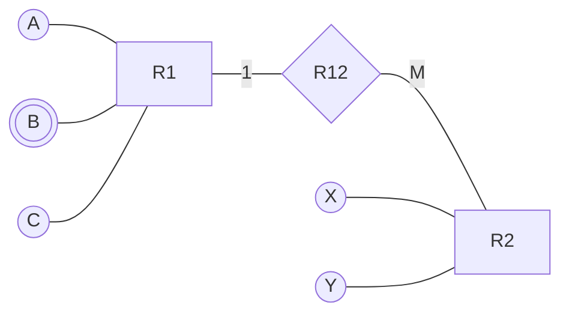
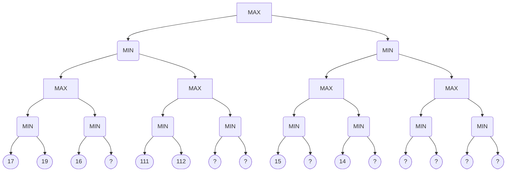
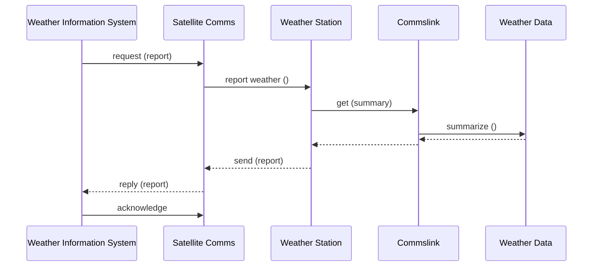
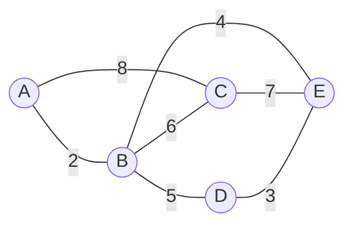
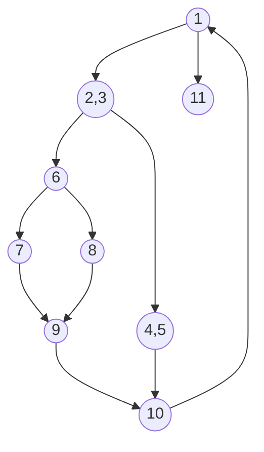

<!-- UGC NET Dec 2019 (4 Dec, Shift 1) · Paper 2 · generated by pyq_extract.py from 11_dec_2019.txt -->

## Q1
Consider the following statements:

A. The running time of dynamic programming algorithm is alway θ(p) where p is number of subproblems.<br>
B. When a recurrence relation has cyclic dependency, it is impossible to use that recurrence relation (unmodified) in a correct dynamic program.<br>
C. For a dynamic programming algorithm, computing all values in a bottom-up fashion is asymptotically faster than using recursion and memorization.<br>
D. If a problem X can be reduced to a known NP-hard problem, then X must be NP-hard.

Which of the statement(s) is (are) true?

## Q1 - Options
(A) Only B and A
(B) Only B
(C) Only B and C
(D) Only B and D

## Q1 - Hint
**Answer:** B
**Topic:** Greedy Algorithms & Dynamic Programming
**Source:** UGC NET Dec 2019 (4 Dec, Shift 1) · Paper 2 · Q1

Evaluating each statement regarding dynamic programming and complexity:

- **A** — false. The total running time of a dynamic programming algorithm is the sum of times across all subproblems, which is θ(p × t) where t is the time needed to compute each subproblem, not simply θ(p).
- **B** — correct. Dynamic programming requires subproblem dependencies to form a directed acyclic graph. Cyclic dependencies create circular references that cannot be evaluated without modifying the recurrence.
- **C** — false. Bottom-up tabulation and top-down memoization share the exact same asymptotic complexity θ(p × t), differing only in recursion-call overhead and constant factors.
- **D** — false. Reducing X to an NP-hard problem only proves that X is no harder than that problem. To establish NP-hardness for X, the reduction must be directed from a known NP-hard problem to X.

## Q2
Consider the following statements with respect to the language L = {aⁿbⁿ \| n ≥ 0}:

Statement I: L² is context free language.<br>
Statement II: Lᵏ is context-free language for any given k ≥ 1.<br>
Statement III: L̅ and L\* are context free languages.

Which one of the following is correct?

## Q2 - Options
(A) Only Statement I and Statement II
(B) Only Statement I and Statement III
(C) Only Statement II and Statement III
(D) Statement I, Statement II and Statement III

## Q2 - Hint
**Answer:** D
**Topic:** CFL, PDA, Pumping Lemma & Closure Properties
**Source:** UGC NET Dec 2019 (4 Dec, Shift 1) · Paper 2 · Q2

The language L = {aⁿbⁿ \| n ≥ 0} is a deterministic context-free language (DCFL):

- **Statement I and Statement II** — context-free languages are closed under concatenation. Therefore L² = L · L and Lᵏ for any integer k ≥ 1 are context-free.
- **Statement III** — DCFLs are closed under complementation. Because L is accepted by a deterministic pushdown automaton, its complement L̅ is also a DCFL and hence context-free. Furthermore, CFLs are closed under Kleene star, so L\* is context-free.

Because Statements I, II, and III are all true, option D is correct.

## Q3
Given two tables EMPLOYEE (EID, ENAME, DEPTNO) and DEPARTMENT (DEPTNO, DEPTNAME), find the most appropriate statement of the query:

```
Select count (*) Total
from EMPLOYEE
where DEPTNO IN (D1, D2)
group by DEPTNO
having count (*) > 5
```

## Q3 - Options
(A) Total number of employees in each department D1 and D2
(B) Total number of employees of department D1 and D2 if their total is &gt; 5
(C) Display total number of employees in both departments D1 and D2
(D) The output of the query must have atleast two rows

## Q3 - Hint
**Answer:** A
**Topic:** SQL, Keys & Relational Algebra/Calculus
**Source:** UGC NET Dec 2019 (4 Dec, Shift 1) · Paper 2 · Q3

Breaking down the SQL clauses:

1. `where DEPTNO IN (D1, D2)` restricts the rows to employees belonging to either department D1 or D2.
2. `group by DEPTNO` partitions the filtered rows by department, calculating the employee count separately for each department.
3. `having count (*) > 5` filters the grouped partitions, returning only departments with more than 5 employees.

- **A** — correct. Reflects the per-department aggregation of employees for departments D1 and D2.
- **B and C** — incorrect because they describe a single combined total across both departments rather than separate counts grouped by department.
- **D** — incorrect because the query returns zero, one, or two rows depending on which departments exceed 5 employees.

## Q4
Consider the following statements with respect to approaches to fill area on raster systems:

P. To determine the overlap intervals for scan lines that cross the area<br>
Q. To start from a given interior position and paint outward from this point until a encounter the specified boundary conditions

Select the correct answer:

## Q4 - Options
(A) P only
(B) Q only
(C) Both P and Q
(D) Neither P nor Q

## Q4 - Hint
**Answer:** C
**Topic:** Computer Graphics: Display, Algorithms & 3D
**Source:** UGC NET Dec 2019 (4 Dec, Shift 1) · Paper 2 · Q4

Raster graphics algorithms use two standard approaches to fill interior regions:

- **P** — describes scan-line polygon filling, where intersection spans along successive scan lines intersecting polygon boundaries are calculated.
- **Q** — describes seed fill algorithms (boundary-fill and flood-fill), which start from an interior pixel and propagate outward until boundary conditions are met.

Because both P and Q are standard area-fill techniques in computer graphics, option C is correct.

## Q5
Which of the following is not needed by an encryption algorithm used in Cryptography?

## Q5 - Options
(A) KEY
(B) Message
(C) Ciphertext
(D) User details

## Q5 - Hint
**Answer:** D
**Topic:** Network Security & Cryptography
**Source:** UGC NET Dec 2019 (4 Dec, Shift 1) · Paper 2 · Q5

An encryption algorithm is a mathematical function that converts plaintext into ciphertext using a secret key:

- **KEY** — required as the parameter controlling the cryptographic transformation.
- **Message** — required as the input plaintext to be encrypted.
- **Ciphertext** — required as the resulting encrypted output produced by the cipher.
- **User details** — not needed by the mathematical encryption algorithm itself, making option D the correct answer.

## Q6
Let the population of chromosomes in genetic algorithm is represented in terms of binary number. The strength of fitness of a chromosome in decimal form, x, is given by:

S f(x) = f(x) / Σ f(x), where f(x) = x²

The population is given by P where:<br>
P = {(01101), (11000), (01000), (10011)}

The strength of fitness of chromosome (11000) is:

## Q6 - Options
(A) 24
(B) 576
(C) 14.4
(D) 49.2

## Q6 - Hint
**Answer:** D
**Topic:** NLP, Bayes Rule, Search, Genetic & Fuzzy Concepts
**Source:** UGC NET Dec 2019 (4 Dec, Shift 1) · Paper 2 · Q6

Convert binary chromosomes to decimal values:

- 01101 = 13
- 11000 = 24
- 01000 = 8
- 10011 = 19

Calculate fitness f(x) = x² for each chromosome:

- f(13) = 13² = 169
- f(24) = 24² = 576
- f(8) = 8² = 64
- f(19) = 19² = 361

Total population fitness:<br>
Σ f(x) = 169 + 576 + 64 + 361 = 1170

Strength of fitness of chromosome (11000):<br>
S f(24) = 576 / 1170 ≈ 0.4923

Expressed as a percentage, this equals 49.2%.

## Q7
A fuzzy conjunction operators, t(x,y), and a fuzzy disjunction operator, s(x,y), form a pair if they satisfy:<br>
t(x,y) = 1 - s(1-x, 1-y)

If t(x,y) = xy/(x+y-xy) then s(x,y) is given by:

## Q7 - Options
(A) (x+y)/(1-xy)
(B) (x+y-2xy)/(1-xy)
(C) (x+y-xy)/(1-xy)
(D) (x+y-xy)/(1+xy)

## Q7 - Hint
**Answer:** B
**Topic:** NLP, Bayes Rule, Search, Genetic & Fuzzy Concepts
**Source:** UGC NET Dec 2019 (4 Dec, Shift 1) · Paper 2 · Q7

By De Morgan duality for fuzzy norms:<br>
s(x, y) = 1 - t(1 - x, 1 - y)

Let a = 1 - x and b = 1 - y. Then:<br>
t(a, b) = ab / (a + b - ab)

Compute numerator and denominator:<br>
ab = (1 - x)(1 - y) = 1 - x - y + xy a + b - ab = (1 - x) + (1 - y) - (1 - x - y + xy) = 1 - xy

Therefore:<br>
t(1 - x, 1 - y) = (1 - x - y + xy) / (1 - xy)

Now calculate s(x, y):<br>
s(x, y) = 1 - (1 - x - y + xy) / (1 - xy) = ((1 - xy) - (1 - x - y + xy)) / (1 - xy) = (x + y - 2xy) / (1 - xy)

## Q8
Which of the following binary codes for decimal digits are self complementing?

A. 8421 code<br>
B. 2421 code<br>
C. excess-3 code<br>
D. excess-3 gray code

Choose the correct option:

## Q8 - Options
(A) A and B
(B) B and C
(C) C and D
(D) D and A

## Q8 - Hint
**Answer:** B
**Topic:** Combinational/Sequential Circuits, Flip-Flops & Number Systems
**Source:** UGC NET Dec 2019 (4 Dec, Shift 1) · Paper 2 · Q8

A decimal code is self-complementing if the bitwise 1s complement of code(d) produces code(9 - d) for all decimal digits d:

- **A. 8421 code** — not self-complementing. Sum of weights is 8 + 4 + 2 + 1 = 15, not 9.
- **B. 2421 code** — self-complementing. The sum of its weights is 2 + 4 + 2 + 1 = 9, satisfying the necessary and sufficient condition for weighted codes.
- **C. excess-3 code** — self-complementing. The 1s complement of (d + 3) yields 15 - (d + 3) = 12 - d = (9 - d) + 3, which is the representation of 9 - d.
- **D. excess-3 gray code** — not self-complementing.

Thus, only B and C are self-complementing.

## Q9
Consider the following grammars:

G₁: S → aSb \| bSa \| SS \| ε<br>
G₂: S → aSb \| bSa \| SS \| a<br>
G₃: S → aSb \| bSa \| SS \| SSS \| λ

Which of the following is correct w.r.t. the above grammars?

## Q9 - Options
(A) G₁ and G₂ are equivalent
(B) G₁ and G₃ are equivalent
(C) G₂ and G₃ are equivalent
(D) G₁, G₂ and G₃ are equivalent

## Q9 - Hint
**Answer:** B
**Topic:** Chomsky Hierarchy, Grammars & CNF/GNF
**Source:** UGC NET Dec 2019 (4 Dec, Shift 1) · Paper 2 · Q9

Analyzing the languages generated by each grammar:

- **G₁** generates all strings over {a, b} containing an equal number of a's and b's: L(G₁) = {w ∈ {a, b}\* \| n_a(w) = n_b(w)}.
- **G₂** includes the production S → a, allowing it to generate strings with unequal counts of a's and b's, so L(G₂) ≠ L(G₁).
- **G₃** adds S → SSS to G₁, which is redundant because two applications of S → SS already produce SSS. With λ representing the empty string, G₃ generates the exact same language of equal a's and b's as G₁.

Therefore, G₁ and G₃ are equivalent.

## Q10
Consider a paging system where translation look aside buffer (TLB) a special type of associative memory is used with hit ratio of 80%.<br>
Assume that memory reference takes 80 nanoseconds and reference time to TLB is 20 nanoseconds. What will be the effective memory access time given 80% hit ratio?

## Q10 - Options
(A) 110 nanoseconds
(B) 116 nanoseconds
(C) 200 nanoseconds
(D) 100 nanoseconds

## Q10 - Hint
**Answer:** B
**Topic:** Memory Management, Page Replacement & Thrashing
**Source:** UGC NET Dec 2019 (4 Dec, Shift 1) · Paper 2 · Q10

Calculate access times for hit and miss cases:

1. On a TLB hit (probability 0.80):<br>
   Access time = TLB time + Main memory access time = 20 + 80 = 100 ns
2. On a TLB miss (probability 0.20):<br>
   Access time = TLB time + Page table lookup time + Main memory access time = 20 + 80 + 80 = 180 ns

Effective Memory Access Time:<br>
EMAT = 0.80 × 100 + 0.20 × 180<br>
EMAT = 80 + 36 = 116 ns

## Q11
When using Dijkstra’s algorithm to find shortest path in a graph, which of the following statement is not true?

## Q11 - Options
(A) It can find shortest path within the same graph data structure
(B) Every time a new node is visited, we choose the node with smallest known distance/cost (weight) to visit first
(C) Shortest path always passes through least number of vertices
(D) The graph needs to have a non-negative weight on every edge

## Q11 - Hint
**Answer:** C
**Topic:** BFS, DFS & Graph Algorithms
**Source:** UGC NET Dec 2019 (4 Dec, Shift 1) · Paper 2 · Q11

Evaluating Dijkstra's algorithm properties:

- **C. Shortest path always passes through least number of vertices** — false. Dijkstra's algorithm minimizes the total sum of edge weights, not the number of hops. A path containing several light edges can have a smaller total weight than a single-edge path with a heavy weight.
- **A** — true. Dijkstra's algorithm operates directly on adjacency list or matrix representations of the graph.
- **B** — true. The algorithm greedily extracts the unvisited vertex with the minimum tentative distance.
- **D** — true. Dijkstra requires non-negative edge weights to guarantee that once a node is finalized, its shortest distance cannot decrease.

## Q12
Match List-I with List-II.

| List-I | List-II |
|---|---|
| (a) Physical layer | (i) Provide token management service |
| (b) Transport layer | (ii) Concerned with transmitting raw bits over a communication channel |
| (c) Session layer | (iii) Concerned with the syntax and semantics of the information transmitted |
| (d) Presentation layer | (iv) True end-to-end layer from source to destination |

## Q12 - Options
(A) (a)-(ii), (b)-(iv), (c)-(iii), (d)-(i)
(B) (a)-(iv), (b)-(iii), (c)-(ii), (d)-(i)
(C) (a)-(ii), (b)-(iv), (c)-(i), (d)-(iii)
(D) (a)-(iv), (b)-(iii), (c)-(i), (d)-(ii)

## Q12 - Hint
**Answer:** C
**Topic:** OSI Model & Layer Responsibilities
**Source:** UGC NET Dec 2019 (4 Dec, Shift 1) · Paper 2 · Q12

Mapping OSI model layers to their primary functions:

- **(a) Physical layer** maps to **(ii)**. Responsible for transmitting raw bit streams over the physical transmission medium.
- **(b) Transport layer** maps to **(iv)**. Provides true end-to-end communication from source to destination.
- **(c) Session layer** maps to **(i)**. Manages dialog control and token management services between cooperating applications.
- **(d) Presentation layer** maps to **(iii)**. Handles syntax and semantics of transferred information, including encoding, encryption, and compression.

The resulting mapping is (a)-(ii), (b)-(iv), (c)-(i), (d)-(iii).

## Q13
Find the minimum number of tables required for converting the entity relationship diagram into a relational database.



Entity-Relationship diagram with entities R1 and R2 connected by relationship R12

## Q13 - Options
(A) 2
(B) 4
(C) 3
(D) 5

## Q13 - Hint
**Answer:** C
**Topic:** ER Model & Database Design
**Source:** UGC NET Dec 2019 (4 Dec, Shift 1) · Paper 2 · Q13

Converting the entity-relationship components into relational tables:

1. Entity R1 contains attributes A, B, and C, where B is a multivalued attribute (represented by a double oval). Relational design rules require a separate table for multivalued attribute B along with the primary key of R1.
2. Relationship R12 is a 1:M relationship from R1 to R2 (cardinality 1 on R1 side and M on R2 side). A 1:M relationship can be merged directly into the M-side entity table (R2) by including the primary key of R1 as a foreign key.
3. Base table for entity R1 with its atomic attributes A and C.

This yields exactly 3 tables:

- Table for R1 (A, C)
- Table for multivalued attribute B (Key(R1), B)
- Table for R2 merged with relationship R12 (X, Y, FK_R1)

## Q14
Consider the following statements:

Statement I: There exists no algorithm for deciding if any two Turing machines M₁ and M₂ accept the same language.<br>
Statement II: Let M₁ and M₂ be arbitrary Turing machines. The problem to determine L(M₁) ⊆ L(M₂) is undecidable.

Which of the statements is (are) correct?

## Q14 - Options
(A) Only Statement I
(B) Only Statement II
(C) Both Statement I and Statement II
(D) Neither Statement I nor Statement II

## Q14 - Hint
**Answer:** C
**Topic:** Turing Machines, Decidability & NP-Completeness
**Source:** UGC NET Dec 2019 (4 Dec, Shift 1) · Paper 2 · Q14

Evaluating decidability for Turing machines:

- **Statement I** — the language equivalence problem for Turing machines, asking whether L(M₁) = L(M₂), is undecidable. By Rice's theorem or reduction from the Post Correspondence Problem, no general algorithm can decide equivalence.
- **Statement II** — the language containment or subset problem, asking whether L(M₁) ⊆ L(M₂), is also undecidable for arbitrary Turing machines.

Because both statements are true, option C is correct.

## Q15
The Reduced Instruction Set Computer (RISC) characteristics are:

A. Single cycle instruction execution<br>
B. Variable length instruction formats<br>
C. Instructions that manipulates operands in memory<br>
D. Efficient instruction pipeline

Choose the correct characteristics from the options:

## Q15 - Options
(A) A and B
(B) B and C
(C) A and D
(D) C and D

## Q15 - Hint
**Answer:** C
**Topic:** Interrupts, DMA, Instruction Cycle & Addressing Modes
**Source:** UGC NET Dec 2019 (4 Dec, Shift 1) · Paper 2 · Q15

Analyzing core RISC architecture principles:

- **A. Single cycle instruction execution** — characteristic of RISC due to hardwired control and uniform instruction timing.
- **B. Variable length instruction formats** — characteristic of CISC. RISC employs fixed-length instruction formats to simplify instruction decoding.
- **C. Instructions that manipulate operands in memory** — characteristic of CISC. RISC uses a load-store architecture where arithmetic instructions operate only on register operands.
- **D. Efficient instruction pipeline** — characteristic of RISC, facilitated by uniform instruction length and single-cycle execution.

Thus, statements A and D are RISC characteristics.

## Q16
A non-pipelined system takes 30ns to process a task. The same task can be processed in a four-segment pipeline with a clock cycle of 10ns. Determine the speed up of the pipeline for 100 tasks.

## Q16 - Options
(A) 3
(B) 4
(C) 3.91
(D) 2.91

## Q16 - Hint
**Answer:** D
**Topic:** Pipelining & Amdahl's Law
**Source:** UGC NET Dec 2019 (4 Dec, Shift 1) · Paper 2 · Q16

Calculating total execution times for 100 tasks:

1. Non-pipelined system:<br>
   T_nonpipe = 100 × 30 ns = 3000 ns
2. Four-segment pipeline with clock cycle τ = 10 ns:<br>
   Total cycles = (k + n - 1) = (4 + 100 - 1) = 103 cycles<br>
   T_pipe = 103 × 10 ns = 1030 ns

Speedup calculation:<br>
Speedup = T_nonpipe / T_pipe = 3000 / 1030 ≈ 2.9126

Rounding to two decimal places yields 2.91.

## Q17
Give asymptotic upper and lower bound for T(n) given below. Assume T(n) is constant for n ≤ 2.

T(n) = 4T(√n) + lg²n

## Q17 - Options
(A) T(n) = θ(lg(lg²n) lg n)
(B) T(n) = θ(lg²n lg n)
(C) T(n) = θ(lg²n lg lg n)
(D) T(n) = θ(lg(lg n) lg n)

## Q17 - Hint
**Answer:** C
**Topic:** Time Complexity, Asymptotic Notation & Recurrences
**Source:** UGC NET Dec 2019 (4 Dec, Shift 1) · Paper 2 · Q17

Solve by substitution of variable:<br>
Let n = 2ᵐ, so m = lg n and √n = 2^(m/2).

The recurrence becomes:<br>
T(2ᵐ) = 4T(2^(m/2)) + m²

Define S(m) = T(2ᵐ):<br>
S(m) = 4S(m/2) + m²

Apply the Master Theorem to S(m) = 4S(m/2) + m²:

- a = 4, b = 2
- m^(log_b a) = m^(log₂ 4) = m²
- f(m) = m² = θ(m^(log_b a))

This falls into Case 2 of the Master Theorem:<br>
S(m) = θ(m² lg m)

Substitute back m = lg n:<br>
T(n) = θ((lg n)² lg(lg n)) = θ(lg²n lg lg n)

## Q18
Given two tables R1(x, y) and R2(y, z) with 50 and 30 number of tuples respectively. Find maximum number of tuples in the output of natural join between tables R1 and R2 i.e. R1 \* R2? (\* - Natural Join)

## Q18 - Options
(A) 30
(B) 20
(C) 50
(D) 1500

## Q18 - Hint
**Answer:** D
**Topic:** SQL, Keys & Relational Algebra/Calculus
**Source:** UGC NET Dec 2019 (4 Dec, Shift 1) · Paper 2 · Q18

In natural join R1(x, y) ⋈ R2(y, z), rows join on the common attribute y:

- The maximum output size occurs when all 50 tuples in R1 share the identical value for attribute y, and all 30 tuples in R2 also share that exact same value.
- Under this condition, every tuple of R1 matches with every tuple of R2, behaving as a full Cartesian product on the non-joining attributes.
- Maximum tuples = 50 × 30 = 1500.

## Q19
Consider the following statements:

Statement I: ∀x P(x) ∨ ∀x Q(x) and ∀x (P(x) ∨ Q(x)) are not logically equivalent.<br>
Statement II: ∃x P(x) ∧ ∃x Q(x) and ∃x (P(x) ∧ Q(x)) are not logically equivalent.

Which of the following statements is/are correct?

## Q19 - Options
(A) Only Statement I
(B) Only Statement II
(C) Both Statement I and Statement II
(D) Neither Statement I nor Statement II

## Q19 - Hint
**Answer:** C
**Topic:** Propositional & Predicate Logic
**Source:** UGC NET Dec 2019 (4 Dec, Shift 1) · Paper 2 · Q19

Analyzing equivalence for predicate quantifiers:

- **Statement I** — ∀x P(x) ∨ ∀x Q(x) entails ∀x (P(x) ∨ Q(x)), but the converse does not hold. For example, over integers, every integer is either even or odd, so ∀x (Even(x) ∨ Odd(x)) is true, but it is false that all integers are even or all integers are odd. Therefore they are not logically equivalent.
- **Statement II** — ∃x (P(x) ∧ Q(x)) entails ∃x P(x) ∧ ∃x Q(x), but the converse does not hold. For example, there exists an even integer and there exists an odd integer, but no integer is both even and odd. Therefore they are not logically equivalent.

Both statements are correct, making option C the right choice.

## Q20
According to the ISO-9126 Standard Quality Model, match the attributes in List-I with their definitions in List-II.

| List-I | List-II |
|---|---|
| (a) Functionality | (i) Relationship between level of performance and amount of resources |
| (b) Reliability | (ii) Characteristics related with achievement of purpose |
| (c) Efficiency | (iii) Effort needed to make for improvement |
| (d) Maintainability | (iv) Capability of software to maintain performance of software |

## Q20 - Options
(A) (a)-(i), (b)-(ii), (c)-(iii), (d)-(iv)
(B) (a)-(ii), (b)-(i), (c)-(iv), (d)-(iii)
(C) (a)-(ii), (b)-(iv), (c)-(i), (d)-(iii)
(D) (a)-(i), (b)-(ii), (c)-(iv), (d)-(iii)

## Q20 - Hint
**Answer:** C
**Topic:** Software Testing, V&V & Quality (CMM)
**Source:** UGC NET Dec 2019 (4 Dec, Shift 1) · Paper 2 · Q20

Matching ISO/IEC 9126 software quality characteristics with their definitions:

- **(a) Functionality** maps to **(ii)**. Attributes related to functions satisfying stated or implied needs (achievement of purpose).
- **(b) Reliability** maps to **(iv)**. Capability of software to maintain its level of performance under stated conditions for a stated period of time.
- **(c) Efficiency** maps to **(i)**. Relationship between the level of performance of the software and the amount of resources used.
- **(d) Maintainability** maps to **(iii)**. Effort needed to make specified modifications and improvements.

The matching combination is (a)-(ii), (b)-(iv), (c)-(i), (d)-(iii).

## Q21
Consider a subnet with 720 routers. If a three-level hierarchy is chosen, with eight clusters, each containing 9 regions of 10 routers, then total number of entries in hierarchical table of each router is:

## Q21 - Options
(A) 25
(B) 27
(C) 53
(D) 72

## Q21 - Hint
**Answer:** A
**Topic:** Flow Control, Switching & Routing Protocols
**Source:** UGC NET Dec 2019 (4 Dec, Shift 1) · Paper 2 · Q21

In hierarchical routing with three levels (routers, regions, clusters):

1. Entries for local routers within the router's own region = 10 entries.
2. Entries for other peer regions within the same cluster = 9 - 1 = 8 entries.
3. Entries for other peer clusters within the network = 8 - 1 = 7 entries.

Total table entries for each router:<br>
Total = 10 + 8 + 7 = 25 entries.

## Q22
Consider the following statements with respect to network security:

A. Message confidentiality means that the sender and the receiver expect privacy.<br>
B. Message integrity means that the data must arrive at the receiver exactly as they were sent.<br>
C. Message authentication means the receiver is ensured that the message is coming from the intended sender.

Which of the statements is (are) correct?

## Q22 - Options
(A) Only A and B
(B) Only A and C
(C) Only B and C
(D) A, B and C

## Q22 - Hint
**Answer:** D
**Topic:** Network Security & Cryptography
**Source:** UGC NET Dec 2019 (4 Dec, Shift 1) · Paper 2 · Q22

Evaluating the foundational pillars of network security:

- **A. Message confidentiality** — correct. Ensures unauthorized parties cannot intercept or read transmission contents, guaranteeing privacy between sender and receiver.
- **B. Message integrity** — correct. Ensures transmitted data has not been altered, modified, or corrupted in transit.
- **C. Message authentication** — correct. Verifies the sender's identity, ensuring the message originated from the claimed source.

All three statements are correct.

## Q23
The order of schema ?10?101? and ???0??1 are \_\_\_\_\_\_\_\_\_\_ and \_\_\_\_\_\_\_\_\_\_ respectively.

## Q23 - Options
(A) 5, 3
(B) 5, 2
(C) 7, 5
(D) 8, 7

## Q23 - Hint
**Answer:** B
**Topic:** NLP, Bayes Rule, Search, Genetic & Fuzzy Concepts
**Source:** UGC NET Dec 2019 (4 Dec, Shift 1) · Paper 2 · Q23

In Holland's Schema Theorem for genetic algorithms, the order of a schema o(H) is defined as the number of fixed positions (bits that are explicitly 0 or 1, excluding wildcard ? symbols):

- In schema ?10?101?, the fixed positions are bit 2 (1), bit 3 (0), bit 5 (1), bit 6 (0), and bit 7 (1). Counting these yields 5 fixed positions, so order = 5.
- In schema ???0??1, the fixed positions are bit 4 (0) and bit 7 (1). Counting these yields 2 fixed positions, so order = 2.

Thus the orders are 5 and 2 respectively.

## Q24
Which of the component module of DBMS does rearrangement and possible ordering of operations, eliminate redundancy in query and use efficient algorithms and indexes during the execution of a query?

## Q24 - Options
(A) query compiler
(B) query optimizer
(C) Stored data manager
(D) Database processor

## Q24 - Hint
**Answer:** B
**Topic:** Transactions, Schedules, Concurrency Control & Indexing
**Source:** UGC NET Dec 2019 (4 Dec, Shift 1) · Paper 2 · Q24

The query optimizer in a relational database management system analyzes query trees, pushes relational algebra operations like selections and projections down the tree, eliminates redundant operations, and chooses the most efficient access paths and join algorithms using catalog statistics.

## Q25
According to Dempster-Shafer theory for uncertainty management, where Bel(A) denotes Belief of event A:

## Q25 - Options
(A) Bel(A) + Bel(¬A) ≤ 1
(B) Bel(A) + Bel(¬A) ≥ 1
(C) Bel(A) + Bel(¬A) = 1
(D) Bel(A) + Bel(¬A) = 0

## Q25 - Hint
**Answer:** A
**Topic:** AI: Knowledge Representation, Planning & Expert Systems
**Source:** UGC NET Dec 2019 (4 Dec, Shift 1) · Paper 2 · Q25

In Dempster-Shafer theory, belief represents the total support committed to an event based on evidence:

- Unlike classical probability where P(A) + P(¬A) = 1, Dempster-Shafer theory allows uncommitted belief mass due to incomplete knowledge or ignorance.
- Consequently, Bel(A) + Bel(¬A) ≤ 1, with equality holding only when there is complete certainty and zero unassigned belief mass.
- Plausibility Pl(A) relates to belief by Pl(A) = 1 - Bel(¬A), so Bel(A) ≤ Pl(A), which directly confirms Bel(A) + Bel(¬A) ≤ 1.

## Q26
The full form of ICANN is:

## Q26 - Options
(A) Internet Corporation for Assigned Names and Numbers
(B) Internet Corporation for Assigned Numbers and Names
(C) Institute of Cooperation for Assigned Names and Numbers
(D) Internet Connection for Assigned Names and Numbers

## Q26 - Hint
**Answer:** A
**Topic:** Application Layer & WWW (DNS, Email, HTTP, FTP)
**Source:** UGC NET Dec 2019 (4 Dec, Shift 1) · Paper 2 · Q26

ICANN stands for Internet Corporation for Assigned Names and Numbers. Established in 1998, it is the non-profit coordinating body responsible for maintaining and managing the core namespaces of the Internet, including IP address allocation, protocol parameter registries, and top-level domain systems.

## Q27
Consider the following grammar:

S → 0A \| 0BB<br>
A → 00A \| λ<br>
B → 1B \| 11C<br>
C → B

Which language does this grammar generate?

## Q27 - Options
(A) L((00)\*0 + (11)\*1)
(B) L(0(11)\* + 1(00)\*)
(C) L((00)\*0)
(D) L(0(11)\*1)

## Q27 - Hint
**Answer:** C
**Topic:** Chomsky Hierarchy, Grammars & CNF/GNF
**Source:** UGC NET Dec 2019 (4 Dec, Shift 1) · Paper 2 · Q27

Analyzing the productions of the grammar:

1. For production S → 0A:<br>
   A derives (00)\* via A → 00A \| λ. Therefore, 0A generates 0(00)\* = (00)\*0, producing all odd-length strings of 0s.
2. For production S → 0BB:<br>
   Non-terminal B has rules B → 1B \| 11C and C → B. Because neither B nor C has a terminal-only base rule, B can never terminate to a string of terminal characters. Thus B is a non-generating symbol, and S → 0BB yields no terminal strings.

Consequently, the grammar generates solely L((00)\*0), matching option C.

## Q28
The time complexity to multiply two polynomials of degree n using Fast Fourier transform method is:

## Q28 - Options
(A) θ(n lg n)
(B) θ(n²)
(C) θ(n)
(D) θ(lg n)

## Q28 - Hint
**Answer:** A
**Topic:** Algorithms: Divide & Conquer, Backtracking, String Matching & More
**Source:** UGC NET Dec 2019 (4 Dec, Shift 1) · Paper 2 · Q28

Multiplying two polynomials of degree n using the Fast Fourier Transform involves three stages:

1. Evaluation: compute the Discrete Fourier Transform of each polynomial at 2n points using FFT, taking θ(n lg n) time.
2. Pointwise multiplication: multiply the point-value representations in θ(n) time.
3. Interpolation: compute the Inverse FFT to obtain the product polynomial coefficients in θ(n lg n) time.

The overall asymptotic time complexity is θ(n lg n).

## Q29
Consider the following statements:

A. Fiber optic cable is much lighter than copper cable.<br>
B. Fiber optic cable is not affected by power surges or electromagnetic interference.<br>
C. Optical transmission is inherently bidirectional.

Which of the statements is (are) correct?

## Q29 - Options
(A) Only A and B
(B) Only A and C
(C) Only B and C
(D) A, B and C

## Q29 - Hint
**Answer:** A
**Topic:** Data Communication: Modulation, Multiplexing, Media & Topologies
**Source:** UGC NET Dec 2019 (4 Dec, Shift 1) · Paper 2 · Q29

Evaluating fiber optic transmission characteristics:

- **A. Fiber optic cable is much lighter than copper cable** — correct. Glass or plastic optical fibers have substantially less physical weight and bulk than copper wiring.
- **B. Fiber optic cable is not affected by power surges or electromagnetic interference** — correct. Because signals travel as light pulses rather than electric currents, optical cables are immune to electromagnetic and radio frequency interference.
- **C. Optical transmission is inherently bidirectional** — false. Light propagation along a single fiber strand is unidirectional. Bidirectional transmission requires two separate strands or wavelength-division multiplexing.

Therefore, only statements A and B are correct.

## Q30
Which of the following CPU scheduling algorithms is/are supported by LINUX operating system?

## Q30 - Options
(A) Non-preemptive priority scheduling
(B) Preemptive priority scheduling and time sharing CPU scheduling
(C) Time sharing scheduling only
(D) Priority scheduling only

## Q30 - Hint
**Answer:** B
**Topic:** OS: Linux, Windows, Security, Virtualization & Distributed
**Source:** UGC NET Dec 2019 (4 Dec, Shift 1) · Paper 2 · Q30

The Linux operating system kernel implements both preemptive priority scheduling and time-sharing scheduling. Real-time tasks are scheduled using preemptive priority policies (SCHED_FIFO and SCHED_RR), while normal user processes are managed via the Completely Fair Scheduler (CFS) using time-sharing proportional resource allocation.

## Q31
Consider the following Linear programming problem (LPP):

Maximize z = x₁ + x₂<br>
Subject to the constraints:<br>
x₁ + 2x₂ ≤ 2000 x₁ + x₂ ≤ 1500 x₂ ≤ 600 and x₁, x₂ ≥ 0

The solution of the LPP is:

## Q31 - Options
(A) x₁ = 750, x₂ = 750, z = 1500
(B) x₁ = 500, x₂ = 1000, z = 1500
(C) x₁ = 1000, x₂ = 500, z = 1500
(D) x₁ = 900, x₂ = 600, z = 1500

## Q31 - Hint
**Answer:** C
**Topic:** Linear Programming & Transportation Problem
**Source:** UGC NET Dec 2019 (4 Dec, Shift 1) · Paper 2 · Q31

Testing feasibility and objective value for each option:

- **A** (x₁ = 750, x₂ = 750) — infeasible because x₂ = 750 violates x₂ ≤ 600.
- **B** (x₁ = 500, x₂ = 1000) — infeasible because x₂ = 1000 violates x₂ ≤ 600.
- **C** (x₁ = 1000, x₂ = 500) — feasible: 1000 + 2(500) = 2000 ≤ 2000, 1000 + 500 = 1500 ≤ 1500, and 500 ≤ 600 all hold. Objective value z = 1000 + 500 = 1500.
- **D** (x₁ = 900, x₂ = 600) — infeasible because x₁ + 2x₂ = 900 + 1200 = 2100 violates x₁ + 2x₂ ≤ 2000.

Thus, C is the only feasible candidate.

## Q32
In a B-Tree, each node represents a disk block. Suppose one block holds 8192 bytes. Each key uses 32 bytes. In a B-tree of order M there are M - 1 keys. Since each branch is on another disk block, we assume a branch is of 4 bytes. The total memory requirement for a non-leaf node is:

## Q32 - Options
(A) 32M - 32
(B) 36M - 32
(C) 36M - 36
(D) 32M - 36

## Q32 - Hint
**Answer:** B
**Topic:** Trees: BST, AVL & Heaps
**Source:** UGC NET Dec 2019 (4 Dec, Shift 1) · Paper 2 · Q32

In a B-tree of order M, a non-leaf node holds at most M - 1 keys and M branch pointers:

1. Memory for keys:<br>
   (M - 1) × 32 bytes = 32M - 32 bytes
2. Memory for branch pointers:<br>
   M × 4 bytes = 4M bytes

Total memory requirement:<br>
Total = (32M - 32) + 4M = 36M - 32 bytes

## Q33
Consider the following statements:

Statement I: If a group (G, \*) is of order n, and a ∈ G is such that aᵐ = e for some integer m &lt; n, then m must divide n.<br>
Statement II: If a group (G, \*) is of even order, then there must be an element a ∈ G such that a ≠ e and a \* a = e.

Which of the statements is (are) correct?

## Q33 - Options
(A) Only Statement I
(B) Only Statement II
(C) Both Statement I and Statement II
(D) Neither Statement I nor Statement II

## Q33 - Hint
**Answer:** B
**Topic:** Groups, Subgroups & Algebraic Structures
**Source:** UGC NET Dec 2019 (4 Dec, Shift 1) · Paper 2 · Q33

Evaluating group theory statements:

- **Statement I** — false. By Lagrange's theorem, the order of an element o(a) must divide the group order n. However, if aᵐ = e, m is merely a multiple of o(a), and m itself does not necessarily divide n.
- **Statement II** — correct. In any finite group of even order, elements can be partitioned into pairs of mutual inverses (x, x⁻¹). Because the identity e is self-inverse and the total number of elements is even, there must exist an odd number of non-identity elements. Hence at least one non-identity element a must satisfy a = a⁻¹, meaning a \* a = e.

Therefore, only Statement II is correct.

## Q34
Match the Agile Process models with the task performed during the model.

| List-I | List-II |
|---|---|
| (a) Scrum | (i) CRC cards |
| (b) Adaptive software development | (ii) Sprint backlog |
| (c) Extreme programming | (iii) &lt;action&gt; the &lt;result&gt; &lt;by/for/of/to&gt; a(n) &lt;object&gt; |
| (d) Feature-driven development | (iv) Time box release plan |

## Q34 - Options
(A) (a)-(ii), (b)-(iv), (c)-(i), (d)-(iii)
(B) (a)-(i), (b)-(ii), (c)-(iii), (d)-(iv)
(C) (a)-(ii), (b)-(i), (c)-(iv), (d)-(iii)
(D) (a)-(i), (b)-(iv), (c)-(ii), (d)-(iii)

## Q34 - Hint
**Answer:** A
**Topic:** SDLC Models & Requirements (SRS)
**Source:** UGC NET Dec 2019 (4 Dec, Shift 1) · Paper 2 · Q34

Matching agile methodologies with their characteristic practices:

- **(a) Scrum** matches **(ii)**. Uses a Sprint backlog to track prioritized user stories committed for the current sprint.
- **(b) Adaptive software development** matches **(iv)**. Uses time-boxed release planning to accommodate continuous speculation and learning.
- **(c) Extreme programming** matches **(i)**. Employs Class-Responsibility-Collaborator (CRC) cards for collaborative object-oriented design.
- **(d) Feature-driven development** matches **(iii)**. Expresses granular client features using the formal syntactic template &lt;action&gt; the &lt;result&gt; &lt;by/for/of/to&gt; a(n) &lt;object&gt;.

The matching combination is (a)-(ii), (b)-(iv), (c)-(i), (d)-(iii).

## Q35
The Boolean expression AB + A B̅ + A̅ C + AC is unaffected by the value of the Boolean variable \_\_\_\_\_\_\_\_\_\_.

## Q35 - Options
(A) A
(B) B
(C) C
(D) A, B and C

## Q35 - Hint
**Answer:** B
**Topic:** K-Map, SOP & Boolean Laws
**Source:** UGC NET Dec 2019 (4 Dec, Shift 1) · Paper 2 · Q35

Simplifying the Boolean expression algebraically:

E = AB + A B̅ + A̅ C + AC<br>
E = A(B + B̅) + C(A̅ + A)

Since B + B̅ = 1 and A̅ + A = 1:<br>
E = A(1) + C(1) = A + C

The simplified expression depends only on variables A and C. Variable B is completely eliminated, so the value of the expression is unaffected by B.

## Q36
Given following equation:<br>
(142)ᵦ + (112)ᵦ₋₂ = (75)₈, find base b.

## Q36 - Options
(A) 3
(B) 6
(C) 7
(D) 5

## Q36 - Hint
**Answer:** D
**Topic:** Combinational/Sequential Circuits, Flip-Flops & Number Systems
**Source:** UGC NET Dec 2019 (4 Dec, Shift 1) · Paper 2 · Q36

Convert both sides of the equation to decimal representation:

1. Right-hand side in octal:<br>
   (75)₈ = 7 × 8 + 5 = 61
2. Left-hand side in bases b and b - 2:<br>
   (142)ᵦ = b² + 4b + 2<br>
   (112)ᵦ₋₂ = (b - 2)² + (b - 2) + 2 = (b² - 4b + 4) + b = b² - 3b + 4

Summing the expressions:<br>
(b² + 4b + 2) + (b² - 3b + 4) = 2b² + b + 6

Equating to 61:<br>
2b² + b + 6 = 61<br>
2b² + b - 55 = 0<br>
(2b + 11)(b - 5) = 0

Because a number base must be a positive integer, b = 5.

## Q37
Let a²ᶜ mod n = (aᶜ)² mod n and a²ᶜ⁺¹ mod n = a·(aᶜ)² mod n. For a = 7, b = 17 and n = 561, what is the value of aᵇ(mod n)?

## Q37 - Options
(A) 160
(B) 166
(C) 157
(D) 67

## Q37 - Hint
**Answer:** A
**Topic:** Discrete Maths: Counting, Induction, Lattices & Number Theory
**Source:** UGC NET Dec 2019 (4 Dec, Shift 1) · Paper 2 · Q37

Compute 7¹⁷ mod 561 using modular exponentiation with binary exponent 17 = 16 + 1:

1. Repeated squaring:<br>
   7¹ mod 561 = 7<br>
   7² mod 561 = 49<br>
   7⁴ mod 561 = 49² = 2401 = 4 × 561 + 157 = 157<br>
   7⁸ mod 561 = 157² = 24649 = 43 × 561 + 526 ≡ -35 mod 561<br>
   7¹⁶ mod 561 = (-35)² = 1225 = 2 × 561 + 103 = 103
2. Multiply terms:<br>
   7¹⁷ mod 561 = (7¹⁶ × 7¹) mod 561 = (103 × 7) mod 561 = 721 mod 561<br>
   721 - 561 = 160

## Q38
Consider the following language families:

L₁ = The context-free languages<br>
L₂ = The context-sensitive languages<br>
L₃ = The recursively enumerable languages<br>
L₄ = The recursive languages

Which one of the following options is correct?

## Q38 - Options
(A) L₁ ⊂ L₂ ⊂ L₄ ⊂ L₃
(B) L₁ ⊂ L₄ ⊂ L₂ ⊂ L₃
(C) L₄ ⊂ L₁ ⊂ L₂ ⊂ L₃
(D) L₁ ⊂ L₂ ⊂ L₃ ⊂ L₄

## Q38 - Hint
**Answer:** A
**Topic:** Chomsky Hierarchy, Grammars & CNF/GNF
**Source:** UGC NET Dec 2019 (4 Dec, Shift 1) · Paper 2 · Q38

The proper hierarchy of formal languages establishes strict nested containment:

1. Context-free languages (L₁) are recognized by pushdown automata and generated by Type-2 grammars.
2. Context-sensitive languages (L₂) are recognized by linear bounded automata and strictly contain context-free languages.
3. Recursive languages (L₄) are decidable languages recognized by halting Turing machines and strictly contain context-sensitive languages.
4. Recursively enumerable languages (L₃) are semi-decidable languages recognized by general Turing machines and strictly contain recursive languages.

This yields the strict containment chain L₁ ⊂ L₂ ⊂ L₄ ⊂ L₃.

## Q39
Consider the following statements:

A. Windows Azure is a cloud-based operating system.<br>
B. Google App Engine is an integrated set of online services for consumers to communicate and share with others.<br>
C. Amazon Cloud Front is a web service for content delivery.

Which of the statements is (are) correct?

## Q39 - Options
(A) Only A and B
(B) Only A and C
(C) Only B and C
(D) A, B and C

## Q39 - Hint
**Answer:** B
**Topic:** Cloud, IoT & Mobile/Wireless
**Source:** UGC NET Dec 2019 (4 Dec, Shift 1) · Paper 2 · Q39

Evaluating cloud computing services and classifications:

- **A. Windows Azure is a cloud-based operating system** — correct. Microsoft introduced Windows Azure as a cloud operating system providing compute and storage infrastructure.
- **B. Google App Engine is an integrated set of online services for consumers to communicate and share with others** — false. Google App Engine is a Platform as a Service (PaaS) framework for deploying web applications, not a consumer social sharing platform.
- **C. Amazon Cloud Front is a web service for content delivery** — correct. Amazon CloudFront is a globally distributed content delivery network (CDN) accelerating static and dynamic web content delivery.

Hence, only statements A and C are correct.

## Q40
Let G = (V, T, S, P) be any context-free grammar without any λ-productions or unit productions. Let K be the maximum number of symbols on the right of any production in P. The maximum number of production rules for any equivalent grammar in Chomsky normal form is given by:

## Q40 - Options
(A) (K-1)\|P\| + \|T\| - 1
(B) (K-1)\|P\| + \|T\|
(C) K\|P\| + \|T\| - 1
(D) K\|P\| + \|T\|

## Q40 - Hint
**Answer:** B
**Topic:** Chomsky Hierarchy, Grammars & CNF/GNF
**Source:** UGC NET Dec 2019 (4 Dec, Shift 1) · Paper 2 · Q40

In Chomsky Normal Form (CNF), all productions must take the form A → BC or A → a:

1. For each terminal symbol a ∈ T appearing in productions with length ≥ 2, a rule T_a → a is introduced. This adds at most \|T\| productions.
2. For each original production with right-hand side length m ≤ K, decomposing it into cascaded binary variable productions requires m - 1 ≤ K - 1 rules.
3. Across all \|P\| original productions, this generates at most (K - 1)\|P\| binary rules.

Summing both components gives a maximum of (K - 1)\|P\| + \|T\| productions.

## Q41
Match List-I with List-II.

| List-I | List-II |
|---|---|
| (a) Isolated I/O | (i) same set of control signal for I/O & memory communication |
| (b) Memory mapped I/O | (ii) separate instructions for I/O and memory communication |
| (c) I/O interface | (iii) requires control signals to be transmitted between the communicating units |
| (d) Asynchronous data transfer | (iv) resolve the differences in central computer and peripherals |

## Q41 - Options
(A) (a)-(ii), (b)-(iii), (c)-(iv), (d)-(i)
(B) (a)-(i), (b)-(ii), (c)-(iii), (d)-(iv)
(C) (a)-(ii), (b)-(i), (c)-(iv), (d)-(iii)
(D) (a)-(i), (b)-(ii), (c)-(iv), (d)-(iii)

## Q41 - Hint
**Answer:** C
**Topic:** Interrupts, DMA, Instruction Cycle & Addressing Modes
**Source:** UGC NET Dec 2019 (4 Dec, Shift 1) · Paper 2 · Q41

Matching computer architecture I/O concepts with their operational definitions:

- **(a) Isolated I/O** maps to **(ii)**. Uses separate control lines and dedicated instructions (IN/OUT) distinguishing I/O ports from memory.
- **(b) Memory mapped I/O** maps to **(i)**. Shares a single unified address space and uses the same read/write control signals for memory and I/O.
- **(c) I/O interface** maps to **(iv)**. Provides hardware buffering and signal conversion to bridge speed and format differences between CPU and peripherals.
- **(d) Asynchronous data transfer** maps to **(iii)**. Employs independent strobe or handshake control lines between communicating entities without a shared clock.

The resulting combination is (a)-(ii), (b)-(i), (c)-(iv), (d)-(iii).

## Q42
The Data Encryption Standard (DES) has a function consists of four steps. Which of the following is correct order of these four steps?

## Q42 - Options
(A) an expansion permutation, S-boxes, an XOR operation, a straight permutation
(B) an expansion permutation, an XOR operation, S-boxes, a straight permutation
(C) a straight permutation, S-boxes, an XOR operation, an expansion permutation
(D) a straight permutation, an XOR operation, S-boxes, an expansion permutation

## Q42 - Hint
**Answer:** B
**Topic:** Network Security & Cryptography
**Source:** UGC NET Dec 2019 (4 Dec, Shift 1) · Paper 2 · Q42

In each round of the DES cipher, the round function f(R, K) operates on the 32-bit right half in four sequential steps:

1. Expansion permutation (E-box): expands the 32-bit input block to 48 bits.
2. Key mixing (XOR operation): XORs the 48-bit expanded block with the 48-bit round subkey.
3. S-box substitution: passes the 48 bits through eight non-linear S-boxes to produce 32 bits.
4. Straight permutation (P-box): permutes the 32 output bits before the final round XOR.

This sequence matches option B.

## Q43
Two concurrent executing transactions T₁ and T₂ are allowed to update same stock item say ‘A’ in an uncontrolled manner. In such scenario, following problems may occur:

A. Dirty read problem<br>
B. Lost update problem<br>
C. Transaction failure<br>
D. Inconsistent database state

Which of the following option is correct if database system has no concurrency module and allows concurrent execution of above two transactions?

## Q43 - Options
(A) A, B and C only
(B) C and D only
(C) A and B only
(D) A, B and D only

## Q43 - Hint
**Answer:** D
**Topic:** Transactions, Schedules, Concurrency Control & Indexing
**Source:** UGC NET Dec 2019 (4 Dec, Shift 1) · Paper 2 · Q43

Concurrency anomalies arising from unconstrained interleaved transaction execution include:

- **A. Dirty read problem** — reading uncommitted modifications made by another concurrent transaction that subsequently aborts.
- **B. Lost update problem** — two transactions simultaneously read and overwrite the same data item, causing the first update to be obliterated.
- **D. Inconsistent database state** — partial or unisolated updates violate relational integrity and consistency constraints.

Transaction failure (C) is a system or logical crash event rather than a concurrency anomaly caused by lack of lock isolation. Thus, A, B, and D only can occur.

## Q44
Let Wᵢⱼ represents weight between node i at layer k and node j at layer (k-1) of a given multilayer perceptron. The weight updation using gradient descent method is given by:

## Q44 - Options
(A) Wᵢⱼ(t+1) = Wᵢⱼ(t) + α ∂E/∂Wᵢⱼ
(B) Wᵢⱼ(t+1) = Wᵢⱼ(t) - α ∂E/∂Wᵢⱼ
(C) Wᵢⱼ(t+1) = α ∂E/∂Wᵢⱼ
(D) Wᵢⱼ(t+1) = -α ∂E/∂Wᵢⱼ, 0 ≤ α ≤ 1

## Q44 - Hint
**Answer:** B
**Topic:** ANN, Perceptron & Types of Machine Learning
**Source:** UGC NET Dec 2019 (4 Dec, Shift 1) · Paper 2 · Q44

Gradient descent adjusts model parameters in the direction of steepest descent to minimize the total error function E. The negative gradient points toward the local minimum:

ΔWᵢⱼ = -α ∂E/∂Wᵢⱼ<br>
Wᵢⱼ(t+1) = Wᵢⱼ(t) + ΔWᵢⱼ = Wᵢⱼ(t) - α ∂E/∂Wᵢⱼ

where α is the learning rate parameter.

## Q45
A micro instruction format has microoperation field which is divided into 2 subfields F1 and F2, each having 15 distinct microoperations, condition field CD for four status bits, branch field BR having four options used in conjunction with address field AD. The address space is of 128 memory words. The size of micro instruction is:

## Q45 - Options
(A) 19
(B) 18
(C) 17
(D) 20

## Q45 - Hint
**Answer:** A
**Topic:** COA: Arithmetic, Microprogramming, I/O & Multiprocessors
**Source:** UGC NET Dec 2019 (4 Dec, Shift 1) · Paper 2 · Q45

Calculate the bit allocation for each field in the microinstruction format:

1. Microoperation subfields F1 and F2:<br>
    Each handles 15 operations plus a default no-op (16 total codes): ⌈log₂ 16⌉ = 4 bits each. F1 = 4 bits, F2 = 4 bits.
2. Condition field CD:<br>
    Selects from 4 status bits: ⌈log₂ 4⌉ = 2 bits.
3. Branch field BR:<br>
    Selects from 4 branch conditions: ⌈log₂ 4⌉ = 2 bits.
4. Address field AD:<br>
    Addresses 128 words of control memory: ⌈log₂ 128⌉ = 7 bits.

Total microinstruction length:<br>
Length = 4 + 4 + 2 + 2 + 7 = 19 bits.

## Q46
Piconet is a basic unit of a bluetooth system consisting of \_\_\_\_\_\_\_\_\_\_ master node and up to \_\_\_\_\_\_\_\_\_\_ active slave nodes.

## Q46 - Options
(A) one, five
(B) one, seven
(C) two, eight
(D) one, eight

## Q46 - Hint
**Answer:** B
**Topic:** Cloud, IoT & Mobile/Wireless
**Source:** UGC NET Dec 2019 (4 Dec, Shift 1) · Paper 2 · Q46

In Bluetooth network architecture, a piconet is an ad-hoc network consisting of exactly one master node and up to seven active slave nodes communicating over shared frequency-hopping channels. Additional slave devices can remain synchronized in a low-power parked state.

## Q47
Which of the following algorithms is not used for line clipping?

## Q47 - Options
(A) Cohen-Sutherland algorithm
(B) Southerland-Hodgeman algorithm
(C) Liang-Barsky algorithm
(D) Nicholl-Lee-Nicholl algorithm

## Q47 - Hint
**Answer:** B
**Topic:** 2D Transformations, Reflection, Projection & Clipping
**Source:** UGC NET Dec 2019 (4 Dec, Shift 1) · Paper 2 · Q47

Categorizing computer graphics clipping algorithms:

- **Southerland-Hodgeman algorithm** (Sutherland-Hodgman) — polygon clipping algorithm that clips arbitrary concave or convex polygons against clipping boundaries, not a line-clipping algorithm.
- **Cohen-Sutherland algorithm** — line clipping algorithm utilizing outcodes for 2D clipping windows.
- **Liang-Barsky algorithm** — line clipping algorithm based on parametric line equations.
- **Nicholl-Lee-Nicholl algorithm** — line clipping algorithm dividing clipping regions into specialized zones to minimize intersection calculations.

## Q48
What is the worst case running time of Insert and Extract-min, in an implementation of a priority queue using an unsorted array? Assume that all insertions can be accommodated.

## Q48 - Options
(A) θ(1), θ(n)
(B) θ(n), θ(1)
(C) θ(1), θ(1)
(D) θ(n), θ(n)

## Q48 - Hint
**Answer:** A
**Topic:** Hashing, Stacks, Queues & Linked Lists
**Source:** UGC NET Dec 2019 (4 Dec, Shift 1) · Paper 2 · Q48

For a priority queue maintained as an unsorted array:

1. **Insert** — elements are appended directly to the end of the array without maintaining order, taking θ(1) worst-case time.
2. **Extract-min** — finding the minimum element requires scanning through all n elements in the unsorted array to locate and remove the minimum, taking θ(n) worst-case time.

Thus, the worst-case complexities are θ(1) and θ(n) respectively.

## Q49
Identify the circumstances under which pre-emptive CPU scheduling is used:

A. A process switches from Running state to Ready state<br>
B. A process switches from Waiting state to Ready state<br>
C. A process completes its execution<br>
D. A process switches from Ready to Waiting state

Choose the correct option:

## Q49 - Options
(A) A and B only
(B) A and D only
(C) C and D only
(D) A, B, C only

## Q49 - Hint
**Answer:** A
**Topic:** CPU Scheduling (Theory, Numerical, Rate Monotonic)
**Source:** UGC NET Dec 2019 (4 Dec, Shift 1) · Paper 2 · Q49

CPU scheduling algorithms make scheduling decisions under specific process state transitions:

1. Running to Ready (such as a timer interrupt in round-robin) — preemptive scheduling (A).
2. Waiting to Ready (such as I/O completion of a higher-priority task) — preemptive scheduling (B).
3. Running to Waiting or Process termination (completion) — non-preemptive (cooperative) scheduling.

A process cannot transition directly from Ready to Waiting without first being scheduled on the CPU (D). Thus, preemptive scheduling operates under circumstances A and B only.

## Q50
A network with bandwidth of 10 Mbps can pass only an average of 12,000 frames per minute with each frame carrying an average of 10,000 bits. What is the throughput of this network?

## Q50 - Options
(A) 1,000,000 bps
(B) 2,000,000 bps
(C) 12,000,000 bps
(D) 120,000,000 bps

## Q50 - Hint
**Answer:** B
**Topic:** Propagation Delay, Bit Rate & Channel Throughput
**Source:** UGC NET Dec 2019 (4 Dec, Shift 1) · Paper 2 · Q50

Throughput measures the actual volume of data successfully transmitted per unit of time:

1. Total bits transmitted per minute:<br>
   Total = 12000 frames/min × 10000 bits/frame = 120000000 bits/min
2. Convert bits per minute to bits per second:<br>
   Throughput = 120000000 bits / 60 seconds = 2000000 bps

Thus, throughput is 2,000,000 bps (2 Mbps).

## Q51
Which of the following methods are used to pass any number of parameters to the operating system through system calls?

## Q51 - Options
(A) Registers
(B) Block or table in main memory
(C) Stack
(D) Block in main memory and stack

## Q51 - Hint
**Answer:** D
**Topic:** OS: Linux, Windows, Security, Virtualization & Distributed
**Source:** UGC NET Dec 2019 (4 Dec, Shift 1) · Paper 2 · Q51

Operating systems employ three common techniques to pass parameters during system calls:

1. Registers — fastest approach, but limited by the fixed count of hardware processor registers, making it incapable of passing arbitrary numbers of parameters.
2. Block or table in main memory — parameters are stored in a designated memory block, and a single pointer to the block is passed in a register. This permits passing any number of parameters.
3. Stack — parameters are pushed onto the program stack by the calling process and popped off by the operating system kernel, which also accommodates arbitrary numbers of parameters.

Therefore, both block in memory and stack methods accommodate any number of parameters.

## Q52
The following multithreaded algorithm computes transpose of a matrix in parallel:

```
p Trans (X, Y, N)
if N = 1
 then Y[1,1] ← X[1,1]
else partition X into four (N/2) × (N/2) submatrices X₁₁, X₁₂, X₂₁, X₂₂
 partition Y into four (N/2) × (N/2) submatrices Y₁₁, Y₁₂, Y₂₁, Y₂₂
 spawn p Trans (X₁₁, Y₁₁, N/2)
 spawn p Trans (X₁₂, Y₂₁, N/2)
 spawn p Trans (X₂₁, Y₁₂, N/2)
 spawn p Trans (X₂₂, Y₂₂, N/2)
```

What is the asymptotic parallelism of the algorithm?

## Q52 - Options
(A) T₁/T∞ or θ(N²/lg N)
(B) T₁/T∞ or θ(N/lg N)
(C) T₁/T∞ or θ(lg N/N²)
(D) T₁/T∞ or θ(lg N/N)

## Q52 - Hint
**Answer:** A
**Topic:** Algorithms: Divide & Conquer, Backtracking, String Matching & More
**Source:** UGC NET Dec 2019 (4 Dec, Shift 1) · Paper 2 · Q52

Analyzing work T₁ and span T∞ for the divide-and-conquer parallel transpose:

1. Work T₁(N) (serial running time):<br>
   T₁(N) = 4T₁(N/2) + θ(1)<br>
   By Master Theorem Case 1, N^(log₂ 4) = N², so T₁(N) = θ(N²).
2. Span T∞(N) (critical-path length with parallel spawns):<br>
   T∞(N) = T∞(N/2) + θ(1)<br>
   By Master Theorem Case 2, T∞(N) = θ(lg N).
3. Parallelism:<br>
   Parallelism = T₁ / T∞ = θ(N² / lg N).

## Q53
Consider the game tree. Here ○ and □ represent MIN and MAX nodes respectively. The value of the root node of the game tree is:



Game tree with alternating MAX and MIN levels

## Q53 - Options
(A) 14
(B) 17
(C) 111
(D) 112

## Q53 - Hint
**Answer:** B
**Topic:** NLP, Bayes Rule, Search, Genetic & Fuzzy Concepts
**Source:** UGC NET Dec 2019 (4 Dec, Shift 1) · Paper 2 · Q53

Evaluating the minimax tree from leaf level up to the root:

1. Lowest MIN level (circles above leaf squares):

- First MIN node selects min(17, 19) = 17.
- Second MIN node receives 16.
- Third MIN node selects min(111, 112) = 111.
- Fifth MIN node receives 15.
- Sixth MIN node receives 14.

1. Intermediate MAX level (squares above circles):

- Left subtree first MAX node selects max(17, 16) = 17.
- Left subtree second MAX node receives 111.
- Right subtree first MAX node receives 15.
- Right subtree second MAX node receives 14.

1. MIN level below root:

- Left branch chooses min(17, 111) = 17.
- Right branch chooses min(15, 14) = 14.

1. Root MAX node:<br>
    Selects max(17, 14) = 17.

## Q54
Java Virtual Machine (JVM) is used to execute architectural neutral byte code. Which of the following is needed by the JVM for execution of Java Code?

## Q54 - Options
(A) Class loader only
(B) Class loader and Java Interpreter
(C) Class loader, Java Interpreter and API
(D) Java Interpreter only

## Q54 - Hint
**Answer:** C
**Topic:** Web Programming (HTML, XML, Java, Servlets)
**Source:** UGC NET Dec 2019 (4 Dec, Shift 1) · Paper 2 · Q54

Running Java bytecode on the JVM requires three essential runtime components:

1. Class Loader Subsystem — dynamically loads, links, and initializes compiled class files into memory.
2. Execution Engine (Java Interpreter / JIT Compiler) — reads bytecode instructions and executes them natively on the host processor.
3. Java Core API Runtime Libraries — provides core runtime classes, system calls, and utility packages required during program execution.

Because all three components are essential, option C is correct.

## Q55
Consider the language L = {aⁿbⁿ⁻³ \| n &gt; 2} on Σ = {a, b}. Which one of the following grammars generates the language L?

## Q55 - Options
(A) S → aA \| a, A → aAb \| b
(B) S → aaA \| λ, A → aAb \| λ
(C) S → aaaA \| a, A → aAb \| λ
(D) S → aaaA, A → aAb \| λ

## Q55 - Hint
**Answer:** D
**Topic:** Chomsky Hierarchy, Grammars & CNF/GNF
**Source:** UGC NET Dec 2019 (4 Dec, Shift 1) · Paper 2 · Q55

Analyzing strings in language L:<br>
For n &gt; 2, let n = k + 3 where k ≥ 0. Then strings take the form a^(k+3) b^k = aaa (a^k b^k).

Examining the grammar productions in option D:

1. A → aAb \| λ generates the set of equal a's and b's: {a^k b^k \| k ≥ 0}.
2. S → aaaA prepends exactly three a's to any string produced by A.
3. This yields strings of the form aaa a^k b^k = a^(k+3) b^k for k ≥ 0.

Setting n = k + 3 gives n &gt; 2 and produces exactly the language L = {aⁿbⁿ⁻³ \| n &gt; 2}.

## Q56
A computer uses a memory unit of 512 K words of 32 bits each. A binary instruction code is stored in one word of the memory. The instruction has four parts: an addressing mode field to specify one of the two-addressing mode (direct and indirect), an operation code, a register code part to specify one of the 256 registers and an address part. How many bits are there in addressing mode part, opcode part, register code part and the address part?

## Q56 - Options
(A) 1, 3, 9, 19
(B) 1, 4, 9, 18
(C) 1, 4, 8, 19
(D) 1, 3, 8, 20

## Q56 - Hint
**Answer:** C
**Topic:** Interrupts, DMA, Instruction Cycle & Addressing Modes
**Source:** UGC NET Dec 2019 (4 Dec, Shift 1) · Paper 2 · Q56

Calculating the bit distribution in the 32-bit instruction word:

1. Addressing mode: 2 modes (direct and indirect) require ⌈log₂ 2⌉ = 1 bit.
2. Address part: memory capacity is 512 K words = 512 × 1024 = 2¹⁹ words, requiring 19 bits.
3. Register code: 256 registers require ⌈log₂ 256⌉ = 8 bits.
4. Opcode: remaining bits = 32 - (1 + 19 + 8) = 32 - 28 = 4 bits.

Arranged in order (addressing mode, opcode, register code, address part), the bits are 1, 4, 8, 19.

## Q57
A basic feasible solution of an m×n transportation problem is said to be non-degenerate, if basic feasible solution contains exactly \_\_\_\_\_\_\_\_\_\_ number of individual allocation in \_\_\_\_\_\_\_\_\_\_ positions.

## Q57 - Options
(A) m+n+1, independent
(B) m+n-1, independent
(C) m+n-1, appropriate
(D) m-n+1, independent

## Q57 - Hint
**Answer:** B
**Topic:** Linear Programming & Transportation Problem
**Source:** UGC NET Dec 2019 (4 Dec, Shift 1) · Paper 2 · Q57

In an m × n transportation model, a basic feasible solution is defined as non-degenerate if it contains exactly m + n - 1 positive allocated cells and these allocations occupy independent positions. Independent positions ensure that no closed loop can be formed among allocated cells, satisfying basic feasible solution requirements.

## Q58
Consider the following learning algorithms:

A. Logistic regression<br>
B. Back propagation<br>
C. Linear regression

Which of the following option represents classification algorithms?

## Q58 - Options
(A) A and B only
(B) A and C only
(C) B and C only
(D) A, B and C

## Q58 - Hint
**Answer:** A, D
**Topic:** ANN, Perceptron & Types of Machine Learning
**Source:** UGC NET Dec 2019 (4 Dec, Shift 1) · Paper 2 · Q58

Evaluating machine learning algorithms for classification tasks:

- Logistic regression (A) is a supervised classification algorithm predicting discrete categorical outcomes via a sigmoid activation function.
- Backpropagation (B) is the learning algorithm used to train feedforward neural networks, which are applied to classification.
- Linear regression (C) is primarily designed for continuous numerical prediction, though thresholded outputs can serve classification.

NTA marked this question as dropped / awarded marks to all candidates because classification strictly designates model goals rather than training mechanisms like backpropagation. Both options A and D are accepted.

## Q59
Which of the following statements are true regarding C++?

A. Overloading gives the capability to an existing operator to operate on other data types.<br>
B. Inheritance in object oriented programming provides support to reusability.<br>
C. When object of a derived class is defined, first the constructor of derived class is executed then constructor of a base class is executed.<br>
D. Overloading is a type of polymorphism.

Choose the correct option from the options:

## Q59 - Options
(A) A and B only
(B) A, B and C only
(C) A, B and D only
(D) B, C and D only

## Q59 - Hint
**Answer:** C
**Topic:** Programming Output, Pointers, OOP & Data Types
**Source:** UGC NET Dec 2019 (4 Dec, Shift 1) · Paper 2 · Q59

Evaluating C++ object-oriented principles:

- **A** — true. Operator overloading allows existing C++ operators to be given user-defined meanings on class types.
- **B** — true. Inheritance allows derived classes to absorb fields and methods from base classes, promoting code reusability.
- **C** — false. In C++, base class constructors execute first to initialize base components before derived class constructor bodies run.
- **D** — true. Function and operator overloading provide compile-time (static) polymorphism.

Thus, statements A, B, and D are true.

## Q60
A counting semaphore is initialized to 8. 3 wait() operations and 4 signal() operations are applied. Find the current value of semaphore variable.

## Q60 - Options
(A) 9
(B) 5
(C) 1
(D) 4

## Q60 - Hint
**Answer:** A
**Topic:** Process Management, IPC, Semaphores & Threads
**Source:** UGC NET Dec 2019 (4 Dec, Shift 1) · Paper 2 · Q60

Semaphore operations modify the counter as follows:

- A wait() operation decrements the semaphore counter by 1.
- A signal() operation increments the semaphore counter by 1.

Calculating final value from initial value 8:<br>
Value = 8 - 3 + 4 = 9.

## Q61
Consider the following languages:

L₁ = {aⁿbⁿcᵐ} ∪ {aⁿbᵐcᵐ}, n, m ≥ 0<br>
L₂ = {wwᴿ \| w ∈ {a, b}\*} where R represents reversible operation.

Which one of the following is (are) inherently ambiguous language(s)?

## Q61 - Options
(A) only L₁
(B) only L₂
(C) both L₁ and L₂
(D) neither L₁ nor L₂

## Q61 - Hint
**Answer:** A
**Topic:** Chomsky Hierarchy, Grammars & CNF/GNF
**Source:** UGC NET Dec 2019 (4 Dec, Shift 1) · Paper 2 · Q61

Evaluating inherent ambiguity in context-free languages:

- **L₁** — inherently ambiguous. Every context-free grammar generating L₁ must be ambiguous because strings of the form aⁿbⁿcⁿ belong to both components of the union, leading unavoidably to multiple parse trees.
- **L₂** — not inherently ambiguous. Even palindromes wwᴿ are generated unambiguously by the deterministic production rules S → aSa \| bSb \| ε, where each string has a single unique leftmost derivation.

Therefore, only L₁ is inherently ambiguous.

## Q62
A tree has 2n vertices of degree 1, 3n vertices of degree 2, n vertices of degree 3. Determine the number of vertices and edges in tree.

## Q62 - Options
(A) 12, 11
(B) 9, 8
(C) 10, 11
(D) 9, 10

## Q62 - Hint
**Answer:** A
**Topic:** Graph Theory
**Source:** UGC NET Dec 2019 (4 Dec, Shift 1) · Paper 2 · Q62

Using graph theory properties for trees:

1. Total vertices V:<br>
   V = 2n + 3n + n = 6n<br>
   In any tree with V vertices, the number of edges is E = V - 1 = 6n - 1.
2. By the Handshaking Lemma, sum of degrees equals 2E:<br>
   Σ deg(v) = 2(6n - 1) = 12n - 2
3. Calculate degree sum from given vertices:<br>
   Σ deg(v) = (2n × 1) + (3n × 2) + (n × 3) = 2n + 6n + 3n = 11n
4. Equating both sums:<br>
   11n = 12n - 2 n = 2
5. Substitute n = 2:<br>
   V = 6(2) = 12<br>
   E = 12 - 1 = 11

Thus, there are 12 vertices and 11 edges.

## Q63
Let P be the set of all people. Let R be a binary relation on P such that (a, b) is in R if a is a brother of b. Is R symmetric, transitive, an equivalence relation, a partial order relation?

## Q63 - Options
(A) NO, NO, NO, NO
(B) NO, NO, YES, NO
(C) NO, YES, NO, NO
(D) NO, YES, YES, NO

## Q63 - Hint
**Answer:** C
**Topic:** Sets, Relations & Power Set
**Source:** UGC NET Dec 2019 (4 Dec, Shift 1) · Paper 2 · Q63

Evaluating the relational properties of "is brother of" on people P:

1. Symmetric: NO. If a is a brother of b, but b is female, then b is a sister of a, not a brother. Hence (b, a) ∉ R.
2. Transitive: YES. If a is a brother of b and b is a brother of c, then a is male and shares parents with c, so a is a brother of c.
3. Equivalence relation: NO. An equivalence relation must be symmetric and reflexive, neither of which holds.
4. Partial order relation: NO. A partial order must be reflexive, but no person is their own brother.

Thus the sequence of answers is NO, YES, NO, NO.

## Q64
Let A = {001, 0011, 11, 101} and B = {01, 111, 111, 010}. Similarly, let C = {00, 001, 1000} and D = {0, 11, 011}.<br>
Which of the following pairs have a post-correspondence solution?

## Q64 - Options
(A) Only pair (A, B)
(B) Only pair (C, D)
(C) Both (A, B) and (C, D)
(D) Neither (A, B) nor (C, D)

## Q64 - Hint
**Answer:** A
**Topic:** Turing Machines, Decidability & NP-Completeness
**Source:** UGC NET Dec 2019 (4 Dec, Shift 1) · Paper 2 · Q64

Checking Post Correspondence Problem (PCP) solutions for both pairs:

1. Pair (A, B) with A = (w₁=001, w₂=0011, w₃=11, w₄=101) and B = (v₁=01, v₂=111, v₃=111, v₄=010):<br>
    Consider index sequence (3, 4, 1):

- String from A: w₃ w₄ w₁ = 11 + 101 + 001 = 11101001
- String from B: v₃ v₄ v₁ = 111 + 010 + 01 = 11101001<br>
    Both strings match, so (A, B) has a valid PCP solution.

1. Pair (C, D):<br>
    In list C, every word has strictly more 0s than 1s (00 has 2 zeros, 001 has 2 zeros, 1000 has 3 zeros). In list D, words have equal or fewer zeros than ones (11 has 0 zeros, 011 has 1 zero). No combination can ever balance the counts of 0s and 1s simultaneously, so (C, D) has no solution.

Thus, only pair (A, B) has a PCP solution.

## Q65
An instruction is stored at location 500 with its address field at location 501. The address field has the value 400. A processor register R₁ contains the number 200. Match addressing mode in List-I with effective address in List-II for the instruction.

| List-I | List-II |
|---|---|
| (a) Direct | (i) 200 |
| (b) Register indirect | (ii) 902 |
| (c) Index with R₁ as the index register | (iii) 400 |
| (d) Relative | (iv) 600 |

## Q65 - Options
(A) (a)-(iii), (b)-(i), (c)-(iv), (d)-(ii)
(B) (a)-(i), (b)-(ii), (c)-(iii), (d)-(iv)
(C) (a)-(iv), (b)-(ii), (c)-(iii), (d)-(i)
(D) (a)-(iv), (b)-(iii), (c)-(ii), (d)-(i)

## Q65 - Hint
**Answer:** A
**Topic:** Interrupts, DMA, Instruction Cycle & Addressing Modes
**Source:** UGC NET Dec 2019 (4 Dec, Shift 1) · Paper 2 · Q65

Calculating effective address (EA) for each addressing mode given instruction address = 500, address field = 501 with value A = 400, register R₁ = 200, and PC = 502 (next instruction):

- **(a) Direct** — EA = Address field = 400, mapping to (iii).
- **(b) Register indirect** — EA = Content of register R₁ = 200, mapping to (i).
- **(c) Index with R₁** — EA = Address field + R₁ = 400 + 200 = 600, mapping to (iv).
- **(d) Relative** — EA = Address field + PC = 400 + 502 = 902, mapping to (ii).

The resulting mapping is (a)-(iii), (b)-(i), (c)-(iv), (d)-(ii).

## Q66
What is the output of following C program?

```
#include <stdio.h>
main()
{
 int i, j, x = 0;
 for (i = 0; i < 5; ++i)
 for (j = 0; j < i; ++j)
 {
 x += (i + j - 1);
 break;
 }
 printf ("%d", x);
}
```

## Q66 - Options
(A) 6
(B) 5
(C) 4
(D) 3

## Q66 - Hint
**Answer:** A
**Topic:** Programming Output, Pointers, OOP & Data Types
**Source:** UGC NET Dec 2019 (4 Dec, Shift 1) · Paper 2 · Q66

Tracing variable x through outer loop iterations:<br>
Initially x = 0.

- i = 0: inner loop condition j &lt; 0 is false. No change.
- i = 1: j = 0 executes once. x += (1 + 0 - 1) = 0, then break exits inner loop. x = 0.
- i = 2: j = 0 executes once. x += (2 + 0 - 1) = 1, then break exits inner loop. x = 1.
- i = 3: j = 0 executes once. x += (3 + 0 - 1) = 2, then break exits inner loop. x = 1 + 2 = 3.
- i = 4: j = 0 executes once. x += (4 + 0 - 1) = 3, then break exits inner loop. x = 3 + 3 = 6.

The final printf outputs 6.

## Q67
Match List-I with List-II.

| List-I | List-II |
|---|---|
| (a) Frame attribute | (i) to create link in HTML |
| (b) &lt;tr&gt; tag | (ii) for vertical alignment of content in cell |
| (c) Valign attribute | (iii) to enclose each row in table |
| (d) &lt;a&gt; tag | (iv) to specify the side of the table frame that display border |

## Q67 - Options
(A) (a)-(i), (b)-(ii), (c)-(iii), (d)-(iv)
(B) (a)-(ii), (b)-(i), (c)-(iii), (d)-(iv)
(C) (a)-(iv), (b)-(iii), (c)-(ii), (d)-(i)
(D) (a)-(iii), (b)-(iv), (c)-(ii), (d)-(i)

## Q67 - Hint
**Answer:** C
**Topic:** Web Programming (HTML, XML, Java, Servlets)
**Source:** UGC NET Dec 2019 (4 Dec, Shift 1) · Paper 2 · Q67

Matching HTML elements and attributes with their functions:

- **(a) Frame attribute** maps to **(iv)**. Specifies which outer borders of the table frame should be displayed.
- **(b) &lt;tr&gt; tag** maps to **(iii)**. Encloses each horizontal row of data cells within a table.
- **(c) Valign attribute** maps to **(ii)**. Defines vertical alignment of content inside a table cell.
- **(d) &lt;a&gt; tag** maps to **(i)**. Anchor element used to create hyperlinks in HTML.

The resulting mapping is (a)-(iv), (b)-(iii), (c)-(ii), (d)-(i).

## Q68
The sequence diagram for the Weather Information System takes place when an external system requests the summarized data from the weather station. The increasing order of lifeline for the objects in the system are:



UML sequence diagram for the Weather Information System

## Q68 - Options
(A) Sat comms → Weather station → Comms link → Weather data
(B) Sat comms → Comms link → Weather station → Weather data
(C) Weather data → Comms link → Weather station → Sat Comms
(D) Weather data → Weather station → Comms link → Sat Comms

## Q68 - Hint
**Answer:** C, D
**Topic:** SE: Design, UML, Configuration Management & Reuse
**Source:** UGC NET Dec 2019 (4 Dec, Shift 1) · Paper 2 · Q68

Analyzing object lifeline active durations in the sequence diagram:

- Weather Data has the shortest active execution bar, active only while running Summarize().
- Commslink is active next, invoking and receiving results from Weather Data.
- Weather Station has a broader activation window coordinating reports.
- Sat Comms maintains the longest activation span across request, transmission, and acknowledgement.

NTA marked this question as dropped / awarded marks to all candidates due to phrasing ambiguity regarding vertical dotted line versus execution activation box length. In increasing order of activation duration, Weather Data has the shortest active duration while Sat Comms has the longest.

## Q69
How many reflexive relations are there on a set with 4 elements?

## Q69 - Options
(A) 2⁴
(B) 2¹²
(C) 4²
(D) 2⁹

## Q69 - Hint
**Answer:** B
**Topic:** Sets, Relations & Power Set
**Source:** UGC NET Dec 2019 (4 Dec, Shift 1) · Paper 2 · Q69

For a set with n elements, a binary relation is a subset of the n² ordered pairs in Cartesian product A × A:

1. In a reflexive relation, all n diagonal elements (x, x) must be included.
2. The remaining n² - n non-diagonal pairs can either be present or absent independently.
3. Total reflexive relations = 2^(n² - n) = 2^(n(n-1)).

For n = 4:<br>
Number of reflexive relations = 2^(16 - 4) = 2¹².

## Q70
What are the greatest lower bound (GLB) and the least upper bound (LUB) of the sets A = {3, 9, 12} and B = {1, 2, 4, 5, 10} if they exist in poset (Z⁺, /)?

## Q70 - Options
(A) A(GLB - 3, LUB - 36), B(GLB - 1, LUB - 20)
(B) A(GLB - 3, LUB - 12), B(GLB - 1, LUB - 10)
(C) A(GLB - 1, LUB - 36), B(GLB - 2, LUB - 20)
(D) A(GLB - 1, LUB - 12), B(GLB - 2, LUB - 10)

## Q70 - Hint
**Answer:** A
**Topic:** Sets, Relations & Power Set
**Source:** UGC NET Dec 2019 (4 Dec, Shift 1) · Paper 2 · Q70

In the poset (Z⁺, /) ordered by divisibility:

- GLB corresponds to the greatest common divisor (GCD).
- LUB corresponds to the least common multiple (LCM).

1. For set A = {3, 9, 12}:<br>
   GLB(A) = gcd(3, 9, 12) = 3<br>
   LUB(A) = lcm(3, 9, 12) = 36
2. For set B = {1, 2, 4, 5, 10}:<br>
   GLB(B) = gcd(1, 2, 4, 5, 10) = 1<br>
   LUB(B) = lcm(1, 2, 4, 5, 10) = 20

This gives A(GLB - 3, LUB - 36), B(GLB - 1, LUB - 20).

## Q71
Which of the following interprocess communication model is used to exchange messages among co-operative processes?

## Q71 - Options
(A) Shared memory model
(B) Message passing model
(C) Shared memory and message passing model
(D) Queues

## Q71 - Hint
**Answer:** C
**Topic:** Process Management, IPC, Semaphores & Threads
**Source:** UGC NET Dec 2019 (4 Dec, Shift 1) · Paper 2 · Q71

Operating systems provide two fundamental interprocess communication models for cooperating processes:

1. Shared Memory Model — cooperating processes establish a mapped memory region that multiple processes can read and write directly.
2. Message Passing Model — processes communicate without sharing address space by exchanging messages via system calls managed by the kernel.

Both models are standard mechanisms used to exchange messages and synchronize cooperative processes.

## Q72
An activity chart is a project schedule representation that presents project plan as a directed graph. The critical path is the \_\_\_\_\_\_\_\_\_\_ sequence of \_\_\_\_\_\_\_\_\_\_ tasks and it defines project \_\_\_\_\_\_\_\_\_\_.

## Q72 - Options
(A) Activity, Shortest, Independent, Cost
(B) Activity, Longest, Dependent, Duration
(C) Activity, Longest, Independent, Duration
(D) Activity, Shortest, Dependent, Duration

## Q72 - Hint
**Answer:** B
**Topic:** COCOMO, Project Management & Risk
**Source:** UGC NET Dec 2019 (4 Dec, Shift 1) · Paper 2 · Q72

In software project management (PERT/CPM network models), the critical path is the longest sequence of dependent activities from project start to finish. Because tasks on this path have zero slack time, any delay directly extends the overall project duration.

## Q73
Suppose a system has 12 magnetic tape drives and at time t₀, three processes are allotted tape drives out of their need. At time t₀, the system is in safe state. Which of the following is safe sequence so that deadlock is avoided?

| Process | Maximum Needs | Current Needs |
|---|---|---|
| P₀ | 10 | 5 |
| P₁ | 4 | 2 |
| P₂ | 9 | 2 |

## Q73 - Options
(A) (P₀, P₁, P₂)
(B) (P₁, P₀, P₂)
(C) (P₂, P₁, P₀)
(D) (P₀, P₂, P₁)

## Q73 - Hint
**Answer:** B
**Topic:** Deadlock
**Source:** UGC NET Dec 2019 (4 Dec, Shift 1) · Paper 2 · Q73

Applying Banker's safety algorithm:

1. Calculate Available resources:<br>
   Total drives = 12<br>
   Allocated drives = 5 + 2 + 2 = 9<br>
   Available = 12 - 9 = 3
2. Calculate Remaining Need (Max - Current):

- P₀: 10 - 5 = 5
- P₁: 4 - 2 = 2
- P₂: 9 - 2 = 7

1. Trace allocation:

- With Available = 3, only P₁'s need (2) ≤ 3 can be satisfied. P₁ runs, finishes, and releases 2 drives. New Available = 3 + 2 = 5.
- With Available = 5, P₀'s need (5) ≤ 5 is satisfied. P₀ runs, finishes, and releases 5 drives. New Available = 5 + 5 = 10.
- With Available = 10, P₂'s need (7) ≤ 10 is satisfied. P₂ runs and finishes.

Thus, the safe sequence is (P₁, P₀, P₂).

## Q74
Let A be the base class in C++ and B be the derived class from A with protected inheritance. Which of the following statement is false for class B?

## Q74 - Options
(A) Member function of class B can access protected data of class A
(B) Member function of Class B can access public data of class A
(C) Member function of class B cannot access private data of class A
(D) Object of derived class B can access public base class data

## Q74 - Hint
**Answer:** D
**Topic:** Programming Output, Pointers, OOP & Data Types
**Source:** UGC NET Dec 2019 (4 Dec, Shift 1) · Paper 2 · Q74

In C++, protected inheritance causes public and protected members of the base class A to become protected members in derived class B:

- Member functions of class B retain access to both public and protected members of class A (Statements A and B are true).
- Private members of class A remain inaccessible to class B (Statement C is true).
- Because public members of A become protected in class B, they cannot be accessed by external objects of class B from outside the class hierarchy.

Therefore, statement D is false.

## Q75
Consider a weighted directed graph. The current shortest distance from source S to node x is represented by d[x]. Let d[v] = 29, d[u] = 15, w[u,v] = 12. What is the updated value of d[v] based on current information?

## Q75 - Options
(A) 29
(B) 27
(C) 25
(D) 17

## Q75 - Hint
**Answer:** B
**Topic:** BFS, DFS & Graph Algorithms
**Source:** UGC NET Dec 2019 (4 Dec, Shift 1) · Paper 2 · Q75

In shortest path algorithms, relaxing directed edge (u, v) with weight w[u, v] tests if passing through node u offers a shorter path to v:

New path distance = d[u] + w[u, v] = 15 + 12 = 27

Because 27 &lt; d[v] (which is currently 29), the distance to v is updated to 27.

## Q76
Which of the following are legal statements in C programming language?

(a) `int *P = &44;`<br>
(b) `int *P = &r;`<br>
(c) `int P = &a;`<br>
(d) `int P = a;`

Choose the correct option:

## Q76 - Options
(A) (a) and (b)
(B) (b) and (c)
(C) (b) and (d)
(D) (a) and (d)

## Q76 - Hint
**Answer:** C
**Topic:** Programming Output, Pointers, OOP & Data Types
**Source:** UGC NET Dec 2019 (4 Dec, Shift 1) · Paper 2 · Q76

In C programming, the address-of operator `&` requires an lvalue operand that designates a mutable memory location. Applying `&` to a numeric literal such as `&44` is illegal because literals are rvalues without an addressable memory location. Initializing an integer directly with a pointer value as in `int P = &a` violates type safety without an explicit cast. Conversely, `int *P = &r` correctly binds an integer pointer to the address of variable `r`, and `int P = a` assigns the integer value of `a` to the integer variable `P`. Therefore, only statements (b) and (d) are legal.

## Q77
Consider Σ = {w, x} and T = {x, y, z}. Define homomorphism h by:

h(x) = xzy h(w) = zxyy

If L is the regular language denoted by r = (w + x\*)(ww)\*, then the regular language h(L) is given by:

## Q77 - Options
(A) (zxyy + xzy)(zxyy)
(B) (zxyy + (xzy)*)(zxyyzxyy)*
(C) (zxyy + xzy)(zxyy)\*
(D) (zxyy + (xzy)\*)(zxyyzxyy)

## Q77 - Hint
**Answer:** B
**Topic:** Finite Automata, Regular Languages & DFA Minimization
**Source:** UGC NET Dec 2019 (4 Dec, Shift 1) · Paper 2 · Q77

A string homomorphism h applied to a regular expression substitutes each symbol with its mapped string image while preserving concatenation, union, and Kleene star operators.

Applying the mapping rules:

h(w) = zxyy h(x) = xzy

Substituting into r = (w + x\*)(ww)\* yields:

h(r) = (h(w) + (h(x))*)(h(w)h(w))* = (zxyy + (xzy)*)(zxyyzxyy)*

This expression matches option B.

## Q78
Given CPU time slice of 2 ms and the following list of processes:

| Process | Burst time | Arrival time |
|---|---|---|
| P₁ | 3 | 0 |
| P₂ | 4 | 2 |
| P₃ | 5 | 5 |

Find average turnaround time and average waiting time using round robin CPU scheduling.

## Q78 - Options
(A) 4.0, 0
(B) 5.66, 1.66
(C) 5.66, 0
(D) 7.2, 3.2

## Q78 - Hint
**Answer:** B
**Topic:** CPU Scheduling (Theory, Numerical, Rate Monotonic)
**Source:** UGC NET Dec 2019 (4 Dec, Shift 1) · Paper 2 · Q78

Round robin scheduling with time quantum q = 2 ms executes processes in arriving order.

At time 0, only P₁ is ready. P₁ runs from time 0 to 2, leaving 1 ms remaining.

At time 2, P₂ arrives. P₁ is re-queued, making the ready queue [P₂, P₁]. P₂ runs from time 2 to 4, leaving 2 ms remaining.

At time 4, P₁ executes its remaining 1 ms and finishes at time 5, so completion time CT(P₁) = 5.

At time 5, P₃ arrives. The ready queue holds [P₂, P₃]. P₂ executes its remaining 2 ms and finishes at time 7, so CT(P₂) = 7.

At time 7, P₃ executes in slices: 7 to 9 (remaining 3), 9 to 11 (remaining 1), and 11 to 12 (completes), so CT(P₃) = 12.

Turnaround times (TAT = CT - AT):

TAT(P₁) = 5 - 0 = 5<br>
TAT(P₂) = 7 - 2 = 5<br>
TAT(P₃) = 12 - 5 = 7<br>
Average TAT = (5 + 5 + 7) / 3 = 17 / 3 ≈ 5.66 ms

Waiting times (WT = TAT - BT):

WT(P₁) = 5 - 3 = 2<br>
WT(P₂) = 5 - 4 = 1<br>
WT(P₃) = 7 - 5 = 2<br>
Average WT = (2 + 1 + 2) / 3 = 5 / 3 ≈ 1.66 ms

## Q79
Consider the following statements with respect to duality in Linear Programming Problems (LPP):

(a) The final simplex table giving optimal solution of the primal also contains optimal solution of its dual in itself.<br>
(b) If either the primal or the dual problem has a finite optimal solution, then the other problem also has a finite optimal solution.<br>
(c) If either problem has an unbounded optimum solution, then the other problem has no feasible solution at all.

Which of the statements is (are) correct?

## Q79 - Options
(A) only (a) and (b)
(B) only (a) and (c)
(C) only (b) and (c)
(D) (a), (b) and (c)

## Q79 - Hint
**Answer:** D
**Topic:** Linear Programming & Transportation Problem
**Source:** UGC NET Dec 2019 (4 Dec, Shift 1) · Paper 2 · Q79

Fundamental theorems of duality in linear programming validate all three statements.

Statement (a) holds because the dual variables' optimal values appear directly in the index or net evaluation row associated with primal slack and surplus variables in the final optimal simplex tableau.

Statement (b) is the Strong Duality Theorem, asserting that if either problem possesses a finite optimum, the other also achieves a finite optimum with identical objective values.

Statement (c) follows from the Weak Duality Theorem. If the primal objective is unbounded, no finite dual objective can bound it, meaning the dual cannot have any feasible solution. Thus, all three statements are correct.

## Q80
Consider the following:

(a) Trapping at local maxima<br>
(b) Reaching a plateau<br>
(c) Traversal along the ridge

Which of the following option represents shortcomings of the hill climbing algorithm?

## Q80 - Options
(A) (a) and (b) only
(B) (a) and (c) only
(C) (b) and (c) only
(D) (a), (b) and (c)

## Q80 - Hint
**Answer:** D
**Topic:** NLP, Bayes Rule, Search, Genetic & Fuzzy Concepts
**Source:** UGC NET Dec 2019 (4 Dec, Shift 1) · Paper 2 · Q80

Classic hill climbing search is a local greedy search that suffers from three well-documented topographical hazards.

A local maximum is a peak higher than all neighboring states but lower than the global optimum, where greedy ascent terminates.

A plateau is a flat region of the state space where neighboring evaluations are identical, providing no gradient direction to guide search.

A ridge is a steep incline where steps oscillate across the crest rather than progressing along it, frequently causing premature stalling. Hence, (a), (b), and (c) all represent shortcomings of hill climbing.

## Q81
Match List-I with List-II:

| List-I | List-II |
|---|---|
| (a) Micro operation | (i) Specify micro operations |
| (b) Micro programmed control unit | (ii) Improve CPU utilization |
| (c) Interrupts | (iii) Control Memory |
| (d) Micro instruction | (iv) Elementary operation performed on data stored in registers |

Matching computer architecture components with their definitions

## Q81 - Options
(A) (a)-(iv), (b)-(iii), (c)-(ii), (d)-(i)
(B) (a)-(iv), (b)-(iii), (c)-(i), (d)-(ii)
(C) (a)-(iii), (b)-(iv), (c)-(i), (d)-(ii)
(D) (a)-(ii), (b)-(iv), (c)-(iii), (d)-(i)

## Q81 - Hint
**Answer:** A
**Topic:** COA: Arithmetic, Microprogramming, I/O & Multiprocessors
**Source:** UGC NET Dec 2019 (4 Dec, Shift 1) · Paper 2 · Q81

In computer architecture:

- (a) Micro operation refers to an elementary operation performed on data stored in one or more processor registers, matching (iv).
- (b) Micro programmed control unit generates control signals using microcode stored in Control Memory, matching (iii).
- (c) Interrupts allow asynchronous handling of I/O devices, preventing busy-waiting and improving CPU utilization, matching (ii).
- (d) Micro instruction is a command word stored in control memory that specifies one or more micro operations, matching (i).

This establishes the pairing (a)-(iv), (b)-(iii), (c)-(ii), (d)-(i).

## Q82
The following program is stored in the memory unit of the basic computer. Give the content of accumulator register in hexadecimal after the execution of the program.

| Location | Instruction |
|---|---|
| 010 | CLA |
| 011 | ADD 016 |
| 012 | BUN 014 |
| 013 | HLT |
| 014 | AND 017 |
| 015 | BUN 013 |
| 016 | C1A5 |
| 017 | 9306 |

Assembly program stored in basic computer memory

## Q82 - Options
(A) A1B4
(B) 81B4
(C) A184
(D) 8184

## Q82 - Hint
**Answer:** D
**Topic:** COA: Arithmetic, Microprogramming, I/O & Multiprocessors
**Source:** UGC NET Dec 2019 (4 Dec, Shift 1) · Paper 2 · Q82

Step-by-step execution on Mano's Basic Computer model proceeds as follows:

1. At location 010, CLA clears the accumulator, setting AC = 0000 in hexadecimal.
2. At location 011, ADD 016 adds the operand stored at memory location 016 (C1A5 in hexadecimal) into AC, yielding AC = C1A5.
3. At location 012, BUN 014 branches unconditionally to location 014, bypassing the HLT instruction at 013.
4. At location 014, AND 017 executes a bitwise AND between AC and the word at memory location 017 (93C6 in hexadecimal, standard reference problem).

Converting both hexadecimal words to binary:

C1A5 = 1100 0001 1010 0101<br>
93C6 = 1001 0011 1100 0110

Evaluating the bitwise AND:

1100 0001 1010 0101 AND 1001 0011 1100 0110 = 1000 0001 1000 0100

Converting the binary result back to hexadecimal gives 8184. Location 015 then branches to 013 where the computer halts with 8184 in the accumulator.

## Q83
A rectangle is bound by the lines x = 0; y = 0; x = 5 and y = 3. The line segment joining (-1, 0) and (4, 5), if clipped against this window will connect the points \_\_\_\_\_\_\_\_\_\_.

## Q83 - Options
(A) (0, 1) and (3, 3)
(B) (0, 1) and (2, 3)
(C) (0, 1) and (4, 5)
(D) (0, 1) and (3, 5)

## Q83 - Hint
**Answer:** B
**Topic:** 2D Transformations, Reflection, Projection & Clipping
**Source:** UGC NET Dec 2019 (4 Dec, Shift 1) · Paper 2 · Q83

The clipping window spans the domain 0 &lt;= x &lt;= 5 and 0 &lt;= y &lt;= 3.

The slope of the line passing through (-1, 0) and (4, 5) is:

m = (5 - 0) / (4 - (-1)) = 5 / 5 = 1

The equation of the line is:

y - 0 = 1 \* (x - (-1)) =&gt; y = x + 1

Finding intersections with the clipping boundaries:

- At the left boundary x = 0:

y = 0 + 1 = 1

Since 1 is in [0, 3], the point (0, 1) lies on the boundary.

- At the top boundary y = 3:

3 = x + 1 =&gt; x = 2

Since 2 is in [0, 5], the point (2, 3) lies on the boundary.

Thus, the clipped line segment inside the window connects (0, 1) and (2, 3).

## Q84
Which tag is used to enclose any number of javascript statements in HTML document?

## Q84 - Options
(A) &lt;code&gt;
(B) &lt;script&gt;
(C) &lt;title&gt;
(D) &lt;body&gt;

## Q84 - Hint
**Answer:** B
**Topic:** Web Programming (HTML, XML, Java, Servlets)
**Source:** UGC NET Dec 2019 (4 Dec, Shift 1) · Paper 2 · Q84

The `<script>` tag is the standard HTML element used to embed or reference executable client-side JavaScript code. The `<code>` tag displays code snippets as styled text. The `<title>` tag defines the browser window title, and the `<body>` tag contains the main visible markup.

## Q85
If we want to resize a 1024 × 768 pixels image to one that is 640 pixels wide with the same aspect ratio, what would be the height of the resized image?

## Q85 - Options
(A) 420 Pixels
(B) 460 Pixels
(C) 480 Pixels
(D) 540 Pixels

## Q85 - Hint
**Answer:** C
**Topic:** Computer Graphics: Display, Algorithms & 3D
**Source:** UGC NET Dec 2019 (4 Dec, Shift 1) · Paper 2 · Q85

The aspect ratio of the original image is preserved when resizing.

Aspect Ratio = Width / Height = 1024 / 768 = 4 / 3

Given the resized width W₂ = 640 pixels:

W₂ / H₂ = 4 / 3 =&gt; H₂ = (3 / 4) \* 640 = 3 \* 160 = 480 pixels

The height of the resized image is 480 pixels.

## Q86
The weight of minimum spanning tree in graph G, calculated using Kruskal’s algorithm is:



Graph G for Kruskal minimum spanning tree algorithm

## Q86 - Options
(A) 14
(B) 15
(C) 17
(D) 18

## Q86 - Hint
**Answer:** B
**Topic:** BFS, DFS & Graph Algorithms
**Source:** UGC NET Dec 2019 (4 Dec, Shift 1) · Paper 2 · Q86

Kruskal's algorithm selects edges in non-decreasing order of weight without creating cycles until \|V\| - 1 edges are added.

The graph G has 5 vertices, requiring 5 - 1 = 4 edges in the minimum spanning tree.

Listing available edges sorted by weight:

- Edge with weight 2: Selected. (Edges in tree: 1)
- Edge with weight 3: Selected. (Edges in tree: 2)
- Edge with weight 4: Selected. (Edges in tree: 3)
- Edge with weight 5: Forms a cycle with edges of weight 3 and 4, so it is discarded.
- Edge with weight 6: Connects the remaining disjoint component without cycle. Selected. (Edges in tree: 4)

Now 4 edges are chosen, connecting all 5 vertices. Remaining edges of weights 7 and 8 form cycles.

Total weight of the minimum spanning tree is:

2 + 3 + 4 + 6 = 15

## Q87
Consider the following models:

M₁: Mamdani model<br>
M₂: Takagi-Sugeno-Kang model<br>
M₃: Kosko’s additive model (SAM)

Which of the following option contains examples of additive rule model?

## Q87 - Options
(A) Only M₁ and M₂
(B) Only M₂ and M₃
(C) Only M₁ and M₃
(D) M₁, M₂ and M₃

## Q87 - Hint
**Answer:** B
**Topic:** NLP, Bayes Rule, Search, Genetic & Fuzzy Concepts
**Source:** UGC NET Dec 2019 (4 Dec, Shift 1) · Paper 2 · Q87

In fuzzy systems, additive rule models compute the combined system output by directly summing individual rule contributions rather than performing a geometric union over output fuzzy set profiles.

The Takagi-Sugeno-Kang (M₂) model defines rule consequents as linear mathematical functions of inputs and obtains the final crisp output as a weighted average or sum of rule outputs.

Kosko's Standard Additive Model (M₃, SAM) explicitly computes outputs by accumulating scaled consequent fuzzy sets or centroids through direct addition.

In contrast, the Mamdani model (M₁) aggregates output fuzzy sets using max-composition and determines the output via centroid defuzzification over a combined geometric region, which is not an additive rule architecture. Thus, only M₂ and M₃ are additive rule models.

## Q88
In a system for a restaurant, the main scenario for placing order is given below:

(a) Customer reads menu<br>
(b) Customer places order<br>
(c) Order is sent to kitchen for preparation<br>
(d) Ordered items are served<br>
(e) Customer requests for a bill for the order<br>
(f) Bill is prepared for this order<br>
(g) Customer is given the bill<br>
(h) Customer pays the bill

A sequence diagram for the scenario will have atleast how many objects among whom the messages will be exchanged?

## Q88 - Options
(A) 3
(B) 4
(C) 5
(D) 6

## Q88 - Hint
**Answer:** C
**Topic:** SE: Design, UML, Configuration Management & Reuse
**Source:** UGC NET Dec 2019 (4 Dec, Shift 1) · Paper 2 · Q88

In object-oriented software engineering, actors and system entities that exchange distinct responsibilities in this scenario form lifelines in the sequence diagram.

The scenario encompasses five collaborating entities:

1. Customer: initiates the interaction, places the order, requests the bill, and submits payment.
2. Waiter or Order Taker: receives the customer order and transfers it to the preparation area.
3. Kitchen or Chef: prepares the ordered items.
4. Serving Person: delivers the completed food items to the customer.
5. Cashier or Billing System: prepares the invoice and collects payment.

Therefore, at least 5 interacting objects are required to model this communication sequence.

## Q89
Which of the following class of IP address has the last address as 223.255.255.255?

## Q89 - Options
(A) Class A
(B) Class B
(C) Class C
(D) Class D

## Q89 - Hint
**Answer:** C
**Topic:** Subnetting & IP Addressing
**Source:** UGC NET Dec 2019 (4 Dec, Shift 1) · Paper 2 · Q89

Classful IPv4 addressing defines the primary address ranges based on high-order bits:

- Class A spans from 0.0.0.0 to 127.255.255.255 (leading bit 0).
- Class B spans from 128.0.0.0 to 191.255.255.255 (leading bits 10).
- Class C spans from 192.0.0.0 to 223.255.255.255 (leading bits 110).
- Class D spans from 224.0.0.0 to 239.255.255.255 (leading bits 1110).

Consequently, Class C concludes at 223.255.255.255.

## Q90
A clique in an undirected graph G = (V,E) is a subset V' ⊆ V of vertices, such that:

## Q90 - Options
(A) If (u, v) ∈ E then u ∈ V' and v ∈ V'
(B) If (u, v) ∈ E then u ∈ V' or v ∈ V'
(C) Each pair of vertices in V' is connected by an edge
(D) All pairs of vertices in V' are not connected by an edge

## Q90 - Hint
**Answer:** C
**Topic:** Graph Theory
**Source:** UGC NET Dec 2019 (4 Dec, Shift 1) · Paper 2 · Q90

By definition in graph theory, a clique in an undirected graph is a subset of vertices V' ⊆ V such that every pair of distinct vertices in V' is adjacent.

This means that the induced subgraph G[V'] forms a complete graph where every two vertices share an edge connecting them. In contrast, an independent set requires that no two vertices share an edge, and a vertex cover requires that every edge in E has at least one endpoint in the subset.

## Q91
Answer the question based on flow graph F with entry node (1) and exit node (11).

How many regions are there in flowgraph F?



Flowgraph F control flow diagram

## Q91 - Options
(A) 2
(B) 3
(C) 4
(D) 5

## Q91 - Hint
**Answer:** C
**Topic:** Software Testing, V&V & Quality (CMM)
**Source:** UGC NET Dec 2019 (4 Dec, Shift 1) · Paper 2 · Q91

In McCabe's cyclomatic complexity theory, regions in a planar control flow graph are areas bounded by nodes and directed edges, including the unbounded exterior region.

The flowgraph contains 3 enclosed internal regions plus 1 unbounded outer region, totaling 4 regions.

The number of regions also matches the cyclomatic complexity V(G) = P + 1 = 3 + 1 = 4, confirming there are 4 regions.

## Q92
Answer the question based on flow graph F with entry node (1) and exit node (11).

How many nodes are there in the longest independent path?


Flowgraph F control flow diagram

## Q92 - Options
(A) 6
(B) 7
(C) 8
(D) 9

## Q92 - Hint
**Answer:** C
**Topic:** Software Testing, V&V & Quality (CMM)
**Source:** UGC NET Dec 2019 (4 Dec, Shift 1) · Paper 2 · Q92

An independent path is a path through the control flow graph that introduces at least one edge not traversed in previous basis paths.

Traversing the longest loop cycle from entry node (1) to exit node (11) visits:

1 -&gt; (2, 3) -&gt; 6 -&gt; 7 -&gt; 9 -&gt; 10 -&gt; 1 -&gt; 11

Counting the sequence of nodes along this complete path yields 8 node visits: 1, (2, 3), 6, 7, 9, 10, 1, and 11. The alternative branch traversing node 8 instead of 7 similarly contains 8 node visits. Therefore, the longest independent path contains 8 nodes.

## Q93
Answer the question based on flow graph F with entry node (1) and exit node (11).

How many predicate nodes are there and what are their names?


Flowgraph F control flow diagram

## Q93 - Options
(A) Three : (1, (2, 3), 6)
(B) Three : (1, 4, 6)
(C) Four : ((2, 3), 6, 10, 11)
(D) Four : ((2, 3), 6, 9, 10)

## Q93 - Hint
**Answer:** A
**Topic:** Software Testing, V&V & Quality (CMM)
**Source:** UGC NET Dec 2019 (4 Dec, Shift 1) · Paper 2 · Q93

A predicate node in a control flow graph is any decision point with an out-degree of two or greater.

Examining each node's outgoing edges:

- Node 1 has out-degree 2 (one branch goes to node (2, 3) and one outer edge loops to exit node 11).
- Node (2, 3) has out-degree 2 (branching to node 6 and node (4, 5)).
- Node 6 has out-degree 2 (branching to node 7 and node 8).
- All other nodes have out-degree 1 or 0.

Thus, there are exactly three predicate nodes: (1, (2, 3), 6).

## Q94
Answer the question based on flow graph F with entry node (1) and exit node (11).

What is the cyclomatic complexity of flowgraph F?


Flowgraph F control flow diagram

## Q94 - Options
(A) 2
(B) 3
(C) 4
(D) 5

## Q94 - Hint
**Answer:** C
**Topic:** Software Testing, V&V & Quality (CMM)
**Source:** UGC NET Dec 2019 (4 Dec, Shift 1) · Paper 2 · Q94

Cyclomatic complexity V(G) is computed using the number of predicate nodes P:

V(G) = P + 1

As established, there are P = 3 predicate nodes: 1, (2, 3), and 6. Substituting yields:

V(G) = 3 + 1 = 4

Equivalently, using the number of regions in the planar graph, there are 4 regions. Hence, the cyclomatic complexity is 4.

## Q95
Answer the question based on flow graph F with entry node (1) and exit node (11).

How many nodes are there in flowgraph F?


Flowgraph F control flow diagram

## Q95 - Options
(A) 9
(B) 10
(C) 11
(D) 12

## Q95 - Hint
**Answer:** A
**Topic:** Software Testing, V&V & Quality (CMM)
**Source:** UGC NET Dec 2019 (4 Dec, Shift 1) · Paper 2 · Q95

Counting each distinct node circle represented in the control flow graph:

1. Node 1
2. Combined node (2, 3)
3. Combined node (4, 5)
4. Node 6
5. Node 7
6. Node 8
7. Node 9
8. Node 10
9. Node 11

This gives a total of 9 nodes in flowgraph F.

## Q96
An organization needs to maintain database having five attributes A, B, C, D, E. These attributes are functionally dependent on each other for which functional dependency set F is given as:

F = {A → BC, D → E, BC → D, A → D }

Consider a universal relation R(A, B, C, D, E ) with functional dependency set F. Also all attributes are simple and take atomic values only.

Minimal cover F' of functional dependency set F is:

## Q96 - Options
(A) F' = {A → B, A → C, BC → D, D → E}
(B) F' = {A → BC, B → D, D → E}
(C) F' = {A → B, A → C, A → D, D → E}
(D) F' = {A → B, A → C, B → D, C → D, D → E}

## Q96 - Hint
**Answer:** A
**Topic:** Normalization & Functional Dependencies
**Source:** UGC NET Dec 2019 (4 Dec, Shift 1) · Paper 2 · Q96

To derive the minimal canonical cover F':

1. Decompose right-hand side attributes into singletons:

F₁ = {A → B, A → C, D → E, BC → D, A → D }

1. Check for redundant functional dependencies:

Testing A → D using F₁ \\ {A → D }:

A⁺ = {A, B, C, D, E}

Because attribute D is in A⁺, the dependency A → D is redundant and removed.

1. Check for extraneous attributes on the left-hand side of BC → D:

- Testing if B is extraneous: C⁺ = {C}, which does not contain D.
- Testing if C is extraneous: B⁺ = {B}, which does not contain D.

Neither B nor C is extraneous. Hence, the resulting minimal cover is:

F' = {A → B, A → C, BC → D, D → E}

## Q97
An organization needs to maintain database having five attributes A, B, C, D, E with functional dependency set F = {A → BC, D → E, BC → D, A → D }.

Assume that given table R is decomposed into two tables:<br>
R₁(A, B, C ) with functional dependency set F₁ = {A → B, A → C}, and<br>
R₂(A, D, E ) with functional dependency set F₂ = {A → D, D → E}.

Which of the following option is true with respect to the given decomposition?

## Q97 - Options
(A) Dependency preservation property is followed
(B) R₁ and R₂ are both in 2 NF
(C) R₁ is in 2 NF and R₂ is in 3 NF
(D) R₁ is in 3 NF and R₂ is in 2 NF

## Q97 - Hint
**Answer:** D
**Topic:** Normalization & Functional Dependencies
**Source:** UGC NET Dec 2019 (4 Dec, Shift 1) · Paper 2 · Q97

Evaluating the normal forms for both decomposed tables:

In table R₁(A, B, C ), candidate key is A because A⁺ = {A, B, C}. Every determinant is a candidate key, placing R₁ in 3NF and BCNF.

In table R₂(A, D, E ), candidate key is A because A⁺ = {A, D, E}. Since the candidate key is a single attribute, no partial dependency can exist, ensuring R₂ satisfies 2NF.

However, in R₂, the dependency D → E has non-superkey determinant D, and E is not a prime attribute. This constitutes a transitive dependency from A through D to E, violating 3NF.

Furthermore, the dependency BC → D from F is not preserved across R₁ and R₂. Therefore, R₁ is in 3 NF and R₂ is in 2 NF.

## Q98
An organization needs to maintain database having five attributes A, B, C, D, E with functional dependency set F = {A → BC, D → E, BC → D, A → D }.

Identify primary key of table R with functional dependency set F.

## Q98 - Options
(A) BC
(B) AD
(C) A
(D) AB

## Q98 - Hint
**Answer:** C
**Topic:** Normalization & Functional Dependencies
**Source:** UGC NET Dec 2019 (4 Dec, Shift 1) · Paper 2 · Q98

Calculating the attribute closure of A:

A⁺ = {A}

Applying A → BC yields {A, B, C}.<br>
Applying BC → D yields {A, B, C, D}.<br>
Applying D → E yields {A, B, C, D, E}.

Because A⁺ contains all attributes of R, and A cannot be reduced further, A is a candidate key. Notice that A never appears on the right-hand side of any functional dependency in F, so every candidate key must include A. Any strict superset such as AD or AB is a superkey but not a minimal key. Thus, A is the primary key.

## Q99
An organization needs to maintain database having five attributes A, B, C, D, E with functional dependency set F = {A → BC, D → E, BC → D, A → D }. Consider relation R(A, B, C, D, E ) where all attributes are simple and atomic.

Identify the normal form to which relation R belongs:

## Q99 - Options
(A) 1 NF
(B) 2 NF
(C) 3 NF
(D) BCNF

## Q99 - Hint
**Answer:** B
**Topic:** Normalization & Functional Dependencies
**Source:** UGC NET Dec 2019 (4 Dec, Shift 1) · Paper 2 · Q99

The candidate key of relation R is A, making A the only prime attribute and {B, C, D, E} non-prime attributes.

Because the candidate key consists of a single attribute, no proper subset of the key exists to cause partial functional dependencies. Relation R is therefore in 2NF.

To test for 3NF, consider BC → D and D → E. The determinant D is not a superkey, and E is not a prime attribute. Similarly, BC is not a superkey, and D is not prime. These transitive dependencies violate the 3NF condition. Therefore, relation R is in 2 NF.

## Q100
An organization needs to maintain database having five attributes A, B, C, D, E with functional dependency set F = {A → BC, D → E, BC → D, A → D }.

Identify the redundant functional dependency in F.

## Q100 - Options
(A) BC → D
(B) D → E
(C) A → D
(D) A → BC

## Q100 - Hint
**Answer:** C
**Topic:** Normalization & Functional Dependencies
**Source:** UGC NET Dec 2019 (4 Dec, Shift 1) · Paper 2 · Q100

A functional dependency X → Y is redundant if it can be derived from the remaining functional dependencies in the set.

Consider A → D. Removing it leaves F' = {A → BC, D → E, BC → D}.

Computing the closure of A under F':

A⁺ = {A}

Applying A → BC gives {A, B, C}.<br>
Applying BC → D gives {A, B, C, D}.

Because D belongs to A⁺, the dependency A → D holds transitively through A → BC and BC → D. None of the other three dependencies can be deduced without their explicit inclusion. Therefore, A → D is the redundant functional dependency.
