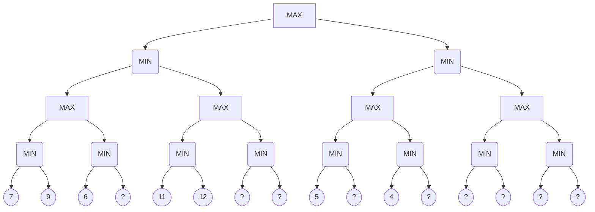

<!-- UGC NET Jun 2019 (24 Jun, Shift 1) · Paper 2 · generated by pyq_extract.py from 12_jun_2019.txt -->

## Q1
Consider a disk system with 100 cylinders. The requests to access the cylinders occur in the following sequence:<br>
4, 34, 10, 7, 19, 73, 2, 15, 6, 20

Assuming that the head is currently at cylinder 50, what is the time taken to satisfy all requests if it takes 1 ms to move from the cylinder to adjacent one and the shortest seek time first policy is used?

## Q1 - Options
(A) 357 ms
(B) 238 ms
(C) 276 ms
(D) 119 ms

## Q1 - Hint
**Answer:** D
**Topic:** Disk Scheduling, File Systems & RAID
**Source:** UGC NET Jun 2019 (24 Jun, Shift 1) · Paper 2 · Q1

Shortest Seek Time First (SSTF) always services the pending request closest to the current head position.

Beginning at cylinder 50, the closest request is 34 (distance 16).<br>
From 34, the sequence moves greedily through remaining closer tracks:<br>
34 -&gt; 20 -&gt; 19 -&gt; 15 -&gt; 10 -&gt; 7 -&gt; 6 -&gt; 4 -&gt; 2.<br>
The total movement from 50 down to 2 is:<br>
50 - 2 = 48 cylinders.

From cylinder 2, the only remaining request is 73.<br>
The seek distance from 2 to 73 is:<br>
73 - 2 = 71 cylinders.

Total seek time is:<br>
(48 + 71) \* 1 ms = 119 ms.

## Q2
On translating the expression given below into quadruple representation, how many operations are required?<br>
(i*j) + (e + f) \* (a*b + c)

## Q2 - Options
(A) 5
(B) 6
(C) 3
(D) 7

## Q2 - Hint
**Answer:** B
**Topic:** Parsing, FIRST/FOLLOW, Compiler Phases & Three-Address Code
**Source:** UGC NET Jun 2019 (24 Jun, Shift 1) · Paper 2 · Q2

A quadruple representation specifies an operation using four fields: operator, argument 1, argument 2, and result.

Translating the arithmetic expression step by step generates six distinct operations:

1. t1 = i \* j
2. t2 = e + f
3. t3 = a \* b
4. t4 = t3 + c
5. t5 = t2 \* t4
6. t6 = t1 + t5

Each line corresponds to exactly one quadruple record, yielding 6 operations in total.

## Q3
A fully connected network topology is a topology in which there is a direct link between all pairs of nodes. Given a fully connected network with n nodes, the number of direct links as a function of n can be expressed as

## Q3 - Options
(A) n(n+1)/2
(B) (n+1)/2
(C) n/2
(D) n(n-1)/2

## Q3 - Hint
**Answer:** D
**Topic:** Data Communication: Modulation, Multiplexing, Media & Topologies
**Source:** UGC NET Jun 2019 (24 Jun, Shift 1) · Paper 2 · Q3

In a fully connected (mesh) network topology, every node has an undirected point-to-point link to every other node without self-connections.

The number of unique pairs of nodes that can be chosen from n distinct nodes is given by the combination formula:<br>
C(n, 2) = n(n - 1) / 2.

- **A. n(n+1)/2** — incorrect because it includes n self-loops.
- **B. (n+1)/2** — incorrect linear formula.
- **C. n/2** — incorrect count representing only n/2 disconnected pairs.
- **D. n(n-1)/2** — correct total number of links.

## Q4
The value of the derivative of Sigmoid function given by f(x) = 1/(1 + e^(-2x))<br>
at x = 0 is

## Q4 - Options
(A) 0
(B) 1/2
(C) 1/4
(D) ∞

## Q4 - Hint
**Answer:** B
**Topic:** ANN, Perceptron & Types of Machine Learning
**Source:** UGC NET Jun 2019 (24 Jun, Shift 1) · Paper 2 · Q4

Differentiating the given sigmoid function f(x) = (1 + e^(-2x))^(-1) using the chain rule gives:<br>
f'(x) = -1 \* (1 + e^(-2x))^(-2) \* (-2 \* e^(-2x))<br>
f'(x) = 2 \* e^(-2x) / (1 + e^(-2x))^2.

Evaluating this derivative at x = 0:<br>
e^0 = 1 f'(0) = (2 \* 1) / (1 + 1)^2 = 2 / 4 = 1/2.

Notice that for a general logistic sigmoid sigma(z) with scale factor k, the derivative at origin is k / 4, which yields 2 / 4 = 1/2.

## Q5
Which of the following statements is/are true?

P: An XML document with correct syntax as specified by W3C is called "Well Formed".<br>
Q: An XML documented validated against a DTD is both "Well formed" and "Valid".<br>
R: &lt;?xml version="1.0" encoding="UTF-8"&gt; is syntactly correct declaration for the version of an XML document.

Select the correct answer from the options given below:

## Q5 - Options
(A) P and Q only
(B) P and R only
(C) Q and R only
(D) All of P, Q and R

## Q5 - Hint
**Answer:** A
**Topic:** Web Programming (HTML, XML, Java, Servlets)
**Source:** UGC NET Jun 2019 (24 Jun, Shift 1) · Paper 2 · Q5

Evaluating the statements regarding XML specifications:

- **P** is true because any XML document adhering to fundamental W3C syntax rules (proper nesting, matching tags, unique root element) is classified as well-formed.
- **Q** is true because an XML document validated against a Document Type Definition (DTD) must be well-formed before it can satisfy validity constraints.
- **R** is false because an XML declaration is a processing instruction that must terminate with `?>` rather than just `>`. The valid syntax requires `<?xml version="1.0" encoding="UTF-8"?>`.

## Q6
Suppose that a computer program takes 100 seconds of execution time on a computer with multiplication operation responsible for 80 seconds of this time. How much do you have to improve the speed of multiplication operation if you are asked to execute this program four times faster?

## Q6 - Options
(A) 14 times faster
(B) 15 times faster
(C) 16 times faster
(D) 17 times faster

## Q6 - Hint
**Answer:** C
**Topic:** Pipelining & Amdahl's Law
**Source:** UGC NET Jun 2019 (24 Jun, Shift 1) · Paper 2 · Q6

Amdahl's law defines the overall execution time after improving an individual component.

The original total runtime is 100 seconds, where:<br>
Unaffected time = 100 - 80 = 20 seconds.<br>
Multiplication time = 80 seconds.

To run 4 times faster, the target execution time is:<br>
100 / 4 = 25 seconds.

Subtracting the unaffected 20 seconds leaves the time allowed for multiplication:<br>
25 - 20 = 5 seconds.

The required speedup factor k for multiplication is:<br>
80 / 5 = 16 times faster.

## Q7
Software products need adaptive maintenance for which of the following reasons?

## Q7 - Options
(A) To rectify bugs observed while the system is in use
(B) When the customers need the product to run on new platforms
(C) To support the new features that users want it to support
(D) To overcome wear and tear caused by the repeated use of the software

## Q7 - Hint
**Answer:** B
**Topic:** SE: Design, UML, Configuration Management & Reuse
**Source:** UGC NET Jun 2019 (24 Jun, Shift 1) · Paper 2 · Q7

Software maintenance is categorized into four standard types based on the triggering cause:

- **A. Corrective maintenance** — rectifies latent faults and bugs discovered during production use.
- **B. Adaptive maintenance** — modifies software to accommodate changes in its external operating environment, such as new operating systems, hardware platforms, or external libraries.
- **C. Perfective maintenance** — enhances software by adding new functional requirements requested by users.
- **D. Physical wear and tear** — does not apply to software artifacts, which do not deteriorate mechanically.

## Q8
What will be the number of states when a MOD-2 counter is followed by a MOD-5 counter?

## Q8 - Options
(A) 5
(B) 10
(C) 15
(D) 20

## Q8 - Hint
**Answer:** B
**Topic:** Combinational/Sequential Circuits, Flip-Flops & Number Systems
**Source:** UGC NET Jun 2019 (24 Jun, Shift 1) · Paper 2 · Q8

When two synchronous or asynchronous counters are cascaded in series, the overall modulus of the composite counter is the product of their individual moduli.

Here, the modulus equals:<br>
Modulus = M1 \* M2 = 2 \* 5 = 10.

A counter of modulus N passes through exactly N unique states before recycling back to its initial count.

## Q9
Suppose that the register A and the register K have the bit configuration. Only the three leftmost bits of A are compared with memory words because K has 1's in these positions. Because of its organization, this type of memory is uniquely suited to parallel searches by data association. This type of memory is known as

## Q9 - Options
(A) RAM
(B) ROM
(C) content addressable memory
(D) secondary memory

## Q9 - Hint
**Answer:** C
**Topic:** Memory Hierarchy, Cache & Access Time
**Source:** UGC NET Jun 2019 (24 Jun, Shift 1) · Paper 2 · Q9

Content Addressable Memory (CAM), also known as associative memory, accesses data words simultaneously based on their bit patterns rather than explicit physical addresses.

In CAM architectures, an argument register (A) contains the search key, and a mask register (K) enables specific bit positions containing 1's to participate in parallel comparison against all stored words simultaneously.

## Q10
In the TCP/IP model, encryption and decryption are functions of \_\_\_\_\_\_ layer.

## Q10 - Options
(A) data link
(B) network
(C) transport
(D) application

## Q10 - Hint
**Answer:** D
**Topic:** OSI Model & Layer Responsibilities
**Source:** UGC NET Jun 2019 (24 Jun, Shift 1) · Paper 2 · Q10

In the standard TCP/IP protocol suite, the Application layer absorbs the responsibilities of the OSI Session and Presentation layers.

Data encryption, decryption, compression, and format conversions are handled either directly within application protocols or through security sublayers like TLS and SSL operating at the application level.

## Q11
The RSA encryption algorithm also works in reverse, that is, you can encrypt a message with the private key and decrypt it using the public key. This property is used in

## Q11 - Options
(A) intrusion detection systems
(B) digital signatures
(C) data compression
(D) certification

## Q11 - Hint
**Answer:** B
**Topic:** Network Security & Cryptography
**Source:** UGC NET Jun 2019 (24 Jun, Shift 1) · Paper 2 · Q11

In asymmetric cryptography using RSA, encrypting a message digest with the sender's private key creates a digital signature.

Because the corresponding public key is accessible to anyone, any receiver can decrypt the signature to verify authentication and message integrity, while proving non-repudiation since only the private key owner could produce that ciphertext.

## Q12
The STRIPS representation is

## Q12 - Options
(A) a feature-centric representation
(B) an action-centric representation
(C) a combination of feature-centric and action-centric representations
(D) a hierarchical feature-centric representation

## Q12 - Hint
**Answer:** B
**Topic:** AI: Knowledge Representation, Planning & Expert Systems
**Source:** UGC NET Jun 2019 (24 Jun, Shift 1) · Paper 2 · Q12

STRIPS (Stanford Research Institute Problem Solver) represents automated planning problems using an action-centric paradigm.

Actions are formalized as individual operators characterized by explicit preconditions, add effects, and delete effects that directly define how states transform.

## Q13
Match List-I with List-II:

| List-I | List-II |
|---|---|
| (a) Greedy best-first | (i) Minimal cost (p) + h(p) |
| (b) Lowest cost-first | (ii) Minimal h(p) |
| (c) A\* algorithm | (iii) Minimal cost (p) |

## Q13 - Options
(A) (a)-(i); (b)-(ii); (c)-(iii)
(B) (a)-(iii); (b)-(ii); (c)-(i)
(C) (a)-(i); (b)-(iii); (c)-(ii)
(D) (a)-(ii); (b)-(iii); (c)-(i)

## Q13 - Hint
**Answer:** D
**Topic:** NLP, Bayes Rule, Search, Genetic & Fuzzy Concepts
**Source:** UGC NET Jun 2019 (24 Jun, Shift 1) · Paper 2 · Q13

Evaluation functions in informed search algorithms determine which path p is expanded first:

(a)-(ii), (b)-(iii), (c)-(i)

- **(a) Greedy best-first** — expands nodes solely based on the estimated distance to goal, minimizing h(p).
- **(b) Lowest cost-first** — expands paths solely based on the accumulated path cost so far, minimizing cost(p).
- **(c) A* algorithm*\* — balances actual path cost and estimated heuristic cost, minimizing cost(p) + h(p).

## Q14
Which of the following is application of depth-first search?

## Q14 - Options
(A) Only topological sort
(B) Only strongly connected components
(C) Both topological sort and strongly connected components
(D) Neither topological sort nor strongly connected components

## Q14 - Hint
**Answer:** C
**Topic:** BFS, DFS & Graph Algorithms
**Source:** UGC NET Jun 2019 (24 Jun, Shift 1) · Paper 2 · Q14

Depth-First Search (DFS) provides structural traversal properties used across advanced graph algorithms:

1. Topological Sorting produces a linear ordering of vertices in a Directed Acyclic Graph (DAG) by recording vertices in reverse order of their DFS completion times.
2. Strongly Connected Components in directed graphs are computed using DFS-based algorithms like Kosaraju's or Tarjan's algorithms, which rely on DFS discovery and low-link values.

Both algorithms are foundational applications of DFS.

## Q15
What is the name of the protocol that allows a client to send a broadcast message with its MAC address and receive an IP address in reply?

## Q15 - Options
(A) ARP
(B) DNS
(C) RARP
(D) ICMP

## Q15 - Hint
**Answer:** C
**Topic:** Subnetting & IP Addressing
**Source:** UGC NET Jun 2019 (24 Jun, Shift 1) · Paper 2 · Q15

Address resolution protocols manage mappings between data link physical addresses and network IP addresses:

- **A. ARP** — resolves a known IP address to an unknown MAC address.
- **B. DNS** — resolves host domain names to IP addresses.
- **C. RARP** — enables a diskless host to broadcast its physical hardware MAC address to request an assigned IP address.
- **D. ICMP** — provides operational diagnostics and network error reporting.

## Q16
How many states are there in a minimum state automata equivalent to regular expression given below?<br>
Regular expression is a\*b(a+b)

## Q16 - Options
(A) 1
(B) 2
(C) 3
(D) 4

## Q16 - Hint
**Answer:** D
**Topic:** Finite Automata, Regular Languages & DFA Minimization
**Source:** UGC NET Jun 2019 (24 Jun, Shift 1) · Paper 2 · Q16

The regular expression a\*b(a+b) describes all strings over {a, b} containing zero or more a's followed by exactly one b and then exactly one further symbol.

Analyzing the Myhill-Nerode equivalence classes for this language reveals 4 distinct states:

1. State q0 (start) — reads any number of a's and transitions on b to q1.
2. State q1 — has consumed a\*b and transitions on a or b to final state q2.
3. State q2 (accepting) — has accepted a\*b(a+b) — any further input transitions to the dead state q3.
4. State q3 (dead state) — sinks all subsequent symbols since no string in the language can exceed length \|a\*b\| + 1.

A fully specified minimum state DFA requires exactly 4 states.

## Q17
Consider an LPP given as<br>
Max Z = 2x₁ - x₂ + 2x₃ subject to the constraints<br>
2x₁ + x₂ ≤ 10 x₁ + 2x₂ - 2x₃ ≤ 20 x₁ + 2x₃ ≤ 5 x₁, x₂, x₃ ≥ 0

What shall be the solution of the LPP after applying first iteration of the Simplex Method?

## Q17 - Options
(A) x₁ = 5/2, x₂ = 0, x₃ = 0, Z = 5
(B) x₁ = 0, x₂ = 0, x₃ = 5/2, Z = 5
(C) x₁ = 0, x₂ = 5/2, x₃ = 0, Z = -5/2
(D) x₁ = 0, x₂ = 0, x₃ = 10, Z = 20

## Q17 - Hint
**Answer:** B
**Topic:** Linear Programming & Transportation Problem
**Source:** UGC NET Jun 2019 (24 Jun, Shift 1) · Paper 2 · Q17

In the initial Simplex tableau, slack variables s1, s2, and s3 form the basic feasible solution:<br>
s1 = 10, s2 = 20, s3 = 5, with Z = 0.

The net evaluation row (C_j - Z_j) gives coefficients [2, -1, 2] for [x1, x2, x3].<br>
Breaking the tie between x1 and x3 by choosing x3 as the entering variable:

- Row 1: coefficient 0 (no positive ratio).
- Row 2: coefficient -2 (negative, no ratio).
- Row 3: 5 / 2 = 2.5.

Thus, s3 leaves the basis and x3 enters with value 5/2 = 2.5.<br>
The non-basic variables remain zero:<br>
x1 = 0, x2 = 0, x3 = 5/2, yielding Z = 2(5/2) = 5.

## Q18
In relational database management, which of the following is/are property/properties of candidate key?

P: Uniqueness<br>
Q: Irreducibility

## Q18 - Options
(A) P only
(B) Q only
(C) Both P and Q
(D) Neither P nor Q

## Q18 - Hint
**Answer:** C
**Topic:** SQL, Keys & Relational Algebra/Calculus
**Source:** UGC NET Jun 2019 (24 Jun, Shift 1) · Paper 2 · Q18

A candidate key is formally defined in relational database theory by two essential conditions:

- **P. Uniqueness** — no two distinct tuples in any valid relation state can contain identical values for the candidate key attribute set.
- **Q. Irreducibility (Minimality)** — no proper subset of the candidate key possesses the uniqueness property — removing any attribute destroys its uniqueness.

Both conditions must hold simultaneously.

## Q19
Match List-I with List-II:

| List-I | List-II |
|---|---|
| (a) p → q | (i) ¬(q → ¬p) |
| (b) p ∨ q | (ii) p ∧ ¬q |
| (c) p ∧ q | (iii) ¬p → q |
| (d) ¬(p → q) | (iv) ¬p ∨ q |

## Q19 - Options
(A) (a)-(ii); (b)-(iii); (c)-(i); (d)-(iv)
(B) (a)-(ii); (b)-(i); (c)-(iii); (d)-(iv)
(C) (a)-(iv); (b)-(i); (c)-(iii); (d)-(ii)
(D) (a)-(iv); (b)-(iii); (c)-(i); (d)-(ii)

## Q19 - Hint
**Answer:** D
**Topic:** Propositional & Predicate Logic
**Source:** UGC NET Jun 2019 (24 Jun, Shift 1) · Paper 2 · Q19

Evaluating propositional equivalences step by step:

(a)-(iv), (b)-(iii), (c)-(i), (d)-(ii)

- **(a) p -&gt; q** — equates to ¬p ∨ q by material implication, matching (iv).
- **(b) p ∨ q** — equates to ¬p -&gt; q since ¬(¬p) ∨ q simplifies to p ∨ q, matching (iii).
- **(c) p ∧ q** — negating q -&gt; ¬p yields ¬(¬q ∨ ¬p), which by De Morgan's law is p ∧ q, matching (i).
- **(d) ¬(p -&gt; q)** — negating material implication ¬(¬p ∨ q) yields p ∧ ¬q, matching (ii).

## Q20
The ability to inject packets into the Internet with a false source address is known as

## Q20 - Options
(A) Man-in-the-middle attack
(B) IP phishing
(C) IP sniffing
(D) IP spoofing

## Q20 - Hint
**Answer:** D
**Topic:** Network Security & Cryptography
**Source:** UGC NET Jun 2019 (24 Jun, Shift 1) · Paper 2 · Q20

IP spoofing refers to the creation and transmission of Internet Protocol packets with forged source IP addresses.

Attackers use IP spoofing to disguise their identity, impersonate authorized systems, or conduct reflected denial-of-service amplification attacks.

- **A. Man-in-the-middle attack** — intercepts and alters communication between two unwitting parties.
- **B. Phishing** — deceives victims into revealing sensitive credentials.
- **C. Sniffing** — passively monitors network packet traffic.

## Q21
A relation has two attributes Employee_id and Manager_id, where Employee_id is a primary key and manager_id is a foreign key referencing Employee_id with on-delete cascade:

On deleting the tuple (20, 40), the set of other tuples that must be deleted to maintain the referential integrity of table is

| Employee_id | Manager_id |
|---|---|
| 20 | 40 |
| 25 | 40 |
| 30 | 35 |
| 35 | 20 |
| 40 | 45 |
| 45 | 25 |

## Q21 - Options
(A) (30, 35) only
(B) (30, 35) and (35, 20) only
(C) (35, 20) only
(D) (40, 45) and (25, 40) only

## Q21 - Hint
**Answer:** B
**Topic:** SQL, Keys & Relational Algebra/Calculus
**Source:** UGC NET Jun 2019 (24 Jun, Shift 1) · Paper 2 · Q21

Evaluating the ON DELETE CASCADE constraint step by step:

1. Deleting tuple (20, 40) removes Employee_id = 20.
2. Any tuple with Manager_id = 20 must cascade-delete — tuple (35, 20) is therefore deleted.
3. Deleting (35, 20) in turn removes Employee_id = 35.
4. Any tuple with Manager_id = 35 must cascade-delete — tuple (30, 35) is therefore deleted.
5. Employee_id = 30 has no referencing manager rows, terminating the cascade.

Thus, the additional tuples deleted are (35, 20) and (30, 35).

## Q22
Consider the following C-code fragment running on a 32-bit x86 machine:

```
typedef struct {
  union {
    unsigned char a;
    unsigned short b;
  } U;
  unsigned char c;
} S;

S B[10];
S *p = &B[4];
S *q = &B[5];
p -> U.b = 0x1234; /* structure S takes 32-bits */
```

If M is the value of q - p and N is the value of ((int) &(p -&gt; c)) - ((int)p), then (M, N) is

## Q22 - Options
(A) (1, 1)
(B) (3, 2)
(C) (1, 2)
(D) (4, 4)

## Q22 - Hint
**Answer:** C
**Topic:** Programming Output, Pointers, OOP & Data Types
**Source:** UGC NET Jun 2019 (24 Jun, Shift 1) · Paper 2 · Q22

Analyzing both values based on C pointer arithmetic and memory layout:

1. Pointer subtraction (q - p) computes the difference in array index units between pointers of the same type:<br>
   Index(B[5]) - Index(B[4]) = 5 - 4 = 1.<br>
   Therefore, M = 1.
2. Struct S takes 32 bits (4 bytes). Inside S, union U contains a 2-byte unsigned short and a 1-byte char, requiring 2-byte alignment and occupying bytes 0 and 1.<br>
   Member c is placed at byte offset 2.<br>
   Subtracting byte addresses ((int)&(p-&gt;c) - (int)p) yields the byte offset 2.<br>
   Therefore, N = 2.

Together, (M, N) = (1, 2).

## Q23
Shift-reduce parser consists of<br>
(a) input buffer<br>
(b) stack<br>
(c) parse table

Choose the correct option from those give below:

## Q23 - Options
(A) (a) and (b) only
(B) (a) and (c) only
(C) (c) only
(D) (a), (b) and (c)

## Q23 - Hint
**Answer:** D
**Topic:** Parsing, FIRST/FOLLOW, Compiler Phases & Three-Address Code
**Source:** UGC NET Jun 2019 (24 Jun, Shift 1) · Paper 2 · Q23

A shift-reduce bottom-up parser operates using three integral components:

- **(a) Input buffer** — stores the remaining input string terminated by an end marker ($).
- **(b) Stack** — maintains the shift-reduce state symbols and handles grammar reductions.
- **(c) Parse table** — guides the parser actions (shift, reduce, accept, error) and state transitions via ACTION and GOTO tables.

All three components are required.

## Q24
Consider the following C++ function f():

```
unsigned int f(unsigned int n) {
  unsigned int b = 0;
  while (n) {
    b += n & 1;
    n >>= 1;
  }
  return b;
}
```

The function f() returns the int that represents the ***P*** in the binary representation of positive integer n, where P is

## Q24 - Options
(A) number of 0's
(B) number of bits
(C) number of consecutive 1's
(D) number of 1's

## Q24 - Hint
**Answer:** D
**Topic:** Programming Output, Pointers, OOP & Data Types
**Source:** UGC NET Jun 2019 (24 Jun, Shift 1) · Paper 2 · Q24

The loop repeatedly inspects the lowest-order bit of n:

- The bitwise expression `n & 1` evaluates to 1 when the least significant bit is set, and 0 when clear.
- Variable b accumulates this bit value on each iteration.
- The shift operator `n >>= 1` shifts the integer right by one bit position.

The process repeats until all bits are shifted out (n becomes 0), returning the population count (total count of 1's) in the binary expansion.

## Q25
Match List-I with List-II:

| List-I | List-II |
|---|---|
| (a) Disk | (i) Thread |
| (b) CPU | (ii) Signal |
| (c) Memory | (iii) File system |
| (d) Interrupt | (iv) Virtual address space |

## Q25 - Options
(A) (a)-(i); (b)-(ii); (c)-(iii); (d)-(iv)
(B) (a)-(iii); (b)-(i); (c)-(iv); (d)-(ii)
(C) (a)-(ii); (b)-(i); (c)-(iv); (d)-(iii)
(D) (a)-(ii); (b)-(iv); (c)-(iii); (d)-(i)

## Q25 - Hint
**Answer:** B
**Topic:** OS: Linux, Windows, Security, Virtualization & Distributed
**Source:** UGC NET Jun 2019 (24 Jun, Shift 1) · Paper 2 · Q25

Operating systems map core hardware resources to foundational software abstractions:

(a)-(iii), (b)-(i), (c)-(iv), (d)-(ii)

- **(a) Disk** — abstracted as a persistent hierarchical File system, matching (iii).
- **(b) CPU** — virtualized as execution contexts known as Threads, matching (i).
- **(c) Memory** — virtualized as an isolated Virtual address space, matching (iv).
- **(d) Interrupt** — represented in software as an asynchronous Signal, matching (ii).

## Q26
Which data structure is used by the compiler for managing variables and their attributes?

## Q26 - Options
(A) Binary tree
(B) Link list
(C) Symbol table
(D) Parse table

## Q26 - Hint
**Answer:** C
**Topic:** Parsing, FIRST/FOLLOW, Compiler Phases & Three-Address Code
**Source:** UGC NET Jun 2019 (24 Jun, Shift 1) · Paper 2 · Q26

A symbol table is a central data structure created and maintained by compilers to store identifier records.

It tracks variable names, data types, scope levels, memory offsets, and binding attributes across lexical analysis, syntax analysis, semantic checking, and code generation phases.

- **A. Binary tree** — can be an underlying implementation for a symbol table, but is not the conceptual data structure itself.
- **B. Link list** — another possible implementation mechanism for symbol tables.
- **D. Parse table** — guides the syntax analyzer in choosing grammar production rules.

## Q27
A computer has six tape drives with n processes competing for them. Each process may need two drives. What is the maximum value of n for the system to be deadlock free?

## Q27 - Options
(A) 5
(B) 4
(C) 3
(D) 6

## Q27 - Hint
**Answer:** A
**Topic:** Deadlock
**Source:** UGC NET Jun 2019 (24 Jun, Shift 1) · Paper 2 · Q27

Deadlock avoidance requires that the total available resources exceed the sum of peak demands minus one for each process.

Let R = 6 tape drives and each process have a maximum demand of 2 drives.<br>
In the worst-case allocation without deadlock, every process holds (2 - 1) = 1 drive, and at least 1 spare drive remains to satisfy one process:<br>
R &gt;= n \* (Max - 1) + 1<br>
6 &gt;= n \* (2 - 1) + 1<br>
6 &gt;= n + 1 n &lt;= 5.

Thus, the system is guaranteed deadlock-free for up to 5 processes.

## Q28
You need 500 subnets, each with about 100 usable host addresses per subnet. What network mask will you assign using a class B network address?

## Q28 - Options
(A) 255-255-255-252
(B) 255-255-255-128
(C) 255-255-255-0
(D) 255-255-254-0

## Q28 - Hint
**Answer:** B
**Topic:** Subnetting & IP Addressing
**Source:** UGC NET Jun 2019 (24 Jun, Shift 1) · Paper 2 · Q28

A Class B network provides 16 host bits with a default /16 mask.

Determining required bit allocations:

1. 500 subnets require s subnet bits where 2^s &gt;= 500, giving s = 9 bits (2^9 = 512 subnets).
2. 100 usable hosts require h host bits where 2^h - 2 &gt;= 100, giving h = 7 bits (2^7 - 2 = 126 hosts).<br>
    Total bits s + h = 9 + 7 = 16 bits.

Adding 9 subnet bits to the 16 network bits produces a /25 mask:<br>
First three octets = 255.255.255<br>
Fourth octet = 10000000 in binary = 128.<br>
Resulting mask is 255-255-255-128.

## Q29
Consider a raster system with resolution 640 by 480. What size is frame buffer (in bytes) for this system to store 12 bits per pixel?

## Q29 - Options
(A) 450 kilobytes
(B) 500 kilobytes
(C) 350 kilobytes
(D) 400 kilobytes

## Q29 - Hint
**Answer:** A
**Topic:** Computer Graphics: Display, Algorithms & 3D
**Source:** UGC NET Jun 2019 (24 Jun, Shift 1) · Paper 2 · Q29

Calculating total frame buffer capacity from screen dimensions and color depth:

Total pixels = 640 \* 480 = 307,200 pixels.<br>
Each pixel requires 12 bits of storage.<br>
Total bit capacity = 307,200 \* 12 = 3,686,400 bits.

Converting to bytes:<br>
3,686,400 / 8 = 460,800 bytes.

Converting to kilobytes (using 1024 bytes per kilobyte):<br>
460,800 / 1024 = 450 kilobytes.

## Q30
In the context of software testing, which of the following statements is/are NOT correct?

P: A minimal test set that achieves 100% path coverage will also achieve 100% statement coverage.<br>
Q: A minimal test set that achieves 100% path coverage will generally detect more faults than one that achieves 100% statement coverage.<br>
R: A minimal test set that achieves 100% statement coverage will generally detect more faults than one that achieves 100% branch coverage.

## Q30 - Options
(A) R only
(B) Q only
(C) P and Q only
(D) Q and R only

## Q30 - Hint
**Answer:** A
**Topic:** Software Testing, V&V & Quality (CMM)
**Source:** UGC NET Jun 2019 (24 Jun, Shift 1) · Paper 2 · Q30

Evaluating the structural test coverage hierarchy:

- **P** is correct because Path Coverage subsumes Branch Coverage and Statement Coverage. Exercising all paths guarantees executing all statements.
- **Q** is correct because path testing explores execution sequences and variable interactions that simple statement execution misses.
- **R** is NOT correct because statement coverage is strictly weaker than branch coverage. Branch coverage tests both true and false decision outcomes, detecting more faults than statement coverage.

Only statement R is incorrect.

## Q31
Consider that a process has been allocated 3 frames and has a sequence of page referencing as 1, 2, 1, 3, 7, 4, 5, 6, 3, 1.<br>
What shall be the difference in page faults for the above string using the algorithms of LRU and optimal page replacement for referencing the string?

## Q31 - Options
(A) 2
(B) 0
(C) 1
(D) 3

## Q31 - Hint
**Answer:** A
**Topic:** Memory Management, Page Replacement & Thrashing
**Source:** UGC NET Jun 2019 (24 Jun, Shift 1) · Paper 2 · Q31

Tracing page faults across 3 frames for the reference string:<br>
1, 2, 1, 3, 7, 4, 5, 6, 3, 1.

LRU replacement:

- 1, 2 (faults 1, 2 — frames [1, 2])
- 1 (hit — order [2, 1])
- 3 (fault 3 — frames [2, 1, 3])
- 7 (fault 4 — replaces 2 -&gt; [1, 3, 7])
- 4 (fault 5 — replaces 1 -&gt; [3, 7, 4])
- 5 (fault 6 — replaces 3 -&gt; [7, 4, 5])
- 6 (fault 7 — replaces 7 -&gt; [4, 5, 6])
- 3 (fault 8 — replaces 4 -&gt; [5, 6, 3])
- 1 (fault 9 — replaces 5 -&gt; [6, 3, 1])<br>
    Total LRU page faults = 9.

Optimal replacement:

- 1, 2 (faults 1, 2 — frames [1, 2])
- 1 (hit — frames [1, 2])
- 3 (fault 3 — frames [1, 2, 3])
- 7 (fault 4 — replaces 2, which is never referenced again -&gt; [1, 3, 7])
- 4 (fault 5 — replaces 7 -&gt; [1, 3, 4])
- 5 (fault 6 — replaces 4 -&gt; [1, 3, 5])
- 6 (fault 7 — replaces 5 -&gt; [1, 3, 6])
- 3 (hit — in frame)
- 1 (hit — in frame)<br>
    Total Optimal page faults = 7.

Difference in page faults = 9 - 7 = 2.

## Q32
A processor can support a maximum memory of 4 GB where memory is word addressable and a word is 2 bytes. What will be the size of the address bus of the processor?

## Q32 - Options
(A) Atleast 28 bits
(B) Atleast 2 bytes
(C) Atleast 31 bits
(D) Minimum 4 bytes

## Q32 - Hint
**Answer:** C
**Topic:** Memory Hierarchy, Cache & Access Time
**Source:** UGC NET Jun 2019 (24 Jun, Shift 1) · Paper 2 · Q32

Calculating addressable memory units from total memory size and word length:

Total memory size = 4 GB = 4 \* 2^30 bytes = 2^32 bytes.<br>
Word size = 2 bytes = 2^1 bytes.

Total number of addressable words is:<br>
2^32 / 2^1 = 2^31 words.

Addressing 2^31 distinct memory locations requires an address bus with a width of:<br>
log2(2^31) = 31 bits.

## Q33
Which of the following are the primary objectives of risk monitoring in software project tracking?

P: To assess whether predicted risks do, in fact, occur<br>
Q: To ensure that risk aversion steps defined for the risk are being properly applied<br>
R: To collect information that can be used for future risk analysis

## Q33 - Options
(A) Only P and Q
(B) Only P and R
(C) Only Q and R
(D) All of P, Q, R

## Q33 - Hint
**Answer:** D
**Topic:** COCOMO, Project Management & Risk
**Source:** UGC NET Jun 2019 (24 Jun, Shift 1) · Paper 2 · Q33

In software project management (RMMM framework), risk monitoring performs three core tasks throughout project execution:

- **P** tracks whether identified and predicted risk conditions materialize in practice.
- **Q** verifies that defined risk mitigation and contingency steps are enacted appropriately.
- **R** gathers observational metrics to refine risk management practices in subsequent project cycles.

All three statements constitute primary objectives of risk monitoring.

## Q34
With respect to relational algebra, which of the following operations are included from mathematical set theory?<br>
(a) Join<br>
(b) Intersection<br>
(c) Cartisian product<br>
(d) Project

## Q34 - Options
(A) (a) and (d)
(B) (b) and (c)
(C) (c) and (d)
(D) (b) and (d)

## Q34 - Hint
**Answer:** B
**Topic:** SQL, Keys & Relational Algebra/Calculus
**Source:** UGC NET Jun 2019 (24 Jun, Shift 1) · Paper 2 · Q34

Relational algebra divides operators into set-theoretic operations and specialized relational operations:

1. Set-theoretic operations borrowed directly from mathematical set theory include Union, Intersection, Set Difference, and Cartesian Product.
2. Specialized relational operations include Select, Project, Join, and Division.

Among the choices, (b) Intersection and (c) Cartesian product come from mathematical set theory.

## Q35
The M components in MVC are responsible for

## Q35 - Options
(A) user interface
(B) security of the system
(C) business logic and domain objects
(D) translating between user interface actions/events and operations on the domain objects

## Q35 - Hint
**Answer:** C
**Topic:** SE: Design, UML, Configuration Management & Reuse
**Source:** UGC NET Jun 2019 (24 Jun, Shift 1) · Paper 2 · Q35

In Model-View-Controller (MVC) software architecture, duties are divided into three distinct roles:

- **Model (M)** — encapsulates domain data objects, persistence rules, and core business logic.
- **View (V)** — renders presentation elements and manages user interface displays.
- **Controller (C)** — processes user input events and directs interactions between Model and View.

## Q36
For a statement<br>
A language L ⊆ Σ\* is recursive if there exists some turing machine M.<br>
Which of the following conditions is satisfied for any string ω?

## Q36 - Options
(A) If ω ∈ L, then M accepts ω and M will not halt
(B) If ω ∉ L, then M accepts ω and M will halt by reaching at final state
(C) If ω ∉ L, then M halts without reaching to acceptable state
(D) If ω ∈ L, then M halts without reaching to an acceptable state

## Q36 - Hint
**Answer:** C
**Topic:** Turing Machines, Decidability & NP-Completeness
**Source:** UGC NET Jun 2019 (24 Jun, Shift 1) · Paper 2 · Q36

A language L is recursive (Turing decidable) if and only if there exists a total Turing machine M that halts on every input string ω:

- When ω ∈ L, M halts in an accepting state.
- When ω ∉ L, M halts in a non-accepting (rejecting) state.

Option C correctly states that when ω ∉ L, M halts without reaching an accepting state.

- **A** is incorrect because a decider for a recursive language must halt on every input.
- **B** is incorrect because strings not in L cannot be accepted.
- **D** is incorrect because valid strings must halt in an accepting state.

## Q37
Which of the following statements is/are true?

P: In software engineering, defects that are discovered earlier are more expensive to fix.<br>
Q: A software design is said to be a good design, if the components are strongly cohesive and weakly coupled.

Select the correct answer from the options given below:

## Q37 - Options
(A) P only
(B) Q only
(C) P and Q
(D) Neither P nor Q

## Q37 - Hint
**Answer:** B
**Topic:** SE: Design, UML, Configuration Management & Reuse
**Source:** UGC NET Jun 2019 (24 Jun, Shift 1) · Paper 2 · Q37

Evaluating software engineering principles:

- **P** is false because the cost of fixing software defects escalates exponentially in later stages (Boehm's cost of change curve). Defects caught during requirements or design are much cheaper to resolve than defects found during post-release deployment.
- **Q** is true because high cohesion (modules have single, focused responsibilities) and weak/loose coupling (modules maintain minimal interdependencies) are standard hallmarks of modular, maintainable software design.

## Q38
Which of the following key constraints is required for functioning of foreign key in the context of relational databases?

## Q38 - Options
(A) Unique key
(B) Primary key
(C) Candidate key
(D) Check key

## Q38 - Hint
**Answer:** B
**Topic:** SQL, Keys & Relational Algebra/Calculus
**Source:** UGC NET Jun 2019 (24 Jun, Shift 1) · Paper 2 · Q38

In relational databases, referential integrity mandates that a foreign key column references a unique identifier in the parent table.

The primary key serves as the standard required constraint that guarantees both uniqueness and non-nullability, providing an unambiguous reference point that prevents orphaned records across related tables.

## Q39
Consider the following:<br>
(a) Evolution<br>
(b) Selection<br>
(c) Reproduction<br>
(d) Mutation

Which of the following are found in genetic algorithms?

## Q39 - Options
(A) (b), (c) and (d) only
(B) (b) and (d) only
(C) (a), (b), (c) and (d)
(D) (a), (b) and (d) only

## Q39 - Hint
**Answer:** C
**Topic:** NLP, Bayes Rule, Search, Genetic & Fuzzy Concepts
**Source:** UGC NET Jun 2019 (24 Jun, Shift 1) · Paper 2 · Q39

Genetic algorithms model Darwinian natural evolution to solve complex optimization problems:

- **(a) Evolution** — represents the generational adaptation of candidate solution populations.
- **(b) Selection** — identifies the fittest chromosomes to survive and mate.
- **(c) Reproduction (Crossover)** — recombines genetic material between pairs of parents to create offspring.
- **(d) Mutation** — introduces stochastic perturbations in alleles to preserve population diversity.

All four components are integral to genetic algorithms.

## Q40
Find the zero-one matrix of the transitive closure of the relation given by the matrix A:<br>
A = [1 0 1; 0 1 0; 1 1 0]

## Q40 - Options
(A) [1 1 1; 0 1 0; 1 1 1]
(B) [1 0 1; 0 1 0; 1 1 0]
(C) [1 0 1; 0 1 0; 1 0 1]
(D) [1 1 1; 0 1 0; 1 0 1]

## Q40 - Hint
**Answer:** A
**Topic:** Sets, Relations & Power Set
**Source:** UGC NET Jun 2019 (24 Jun, Shift 1) · Paper 2 · Q40

Analyzing reachability paths between vertices {1, 2, 3} for matrix A:

Direct edges:<br>
1 -&gt; 1, 1 -&gt; 3<br>
2 -&gt; 2<br>
3 -&gt; 1, 3 -&gt; 2

Determining transitive reachability:

- From node 1: reaches 1 directly, 3 directly, and 2 via path 1 -&gt; 3 -&gt; 2. Reachable set is {1, 2, 3}, giving row [1, 1, 1].
- From node 2: only reaches itself {2}, giving row [0, 1, 0].
- From node 3: reaches 1 and 2 directly, and reaches 3 via path 3 -&gt; 1 -&gt; 3. Reachable set is {1, 2, 3}, giving row [1, 1, 1].

The resulting transitive closure matrix is [1 1 1 — 0 1 0 — 1 1 1].

## Q41
Which type of addressing mode, less number of memory references are required?

## Q41 - Options
(A) Immediate
(B) Implied
(C) Register
(D) Indexed

## Q41 - Hint
**Answer:** A
**Topic:** Interrupts, DMA, Instruction Cycle & Addressing Modes
**Source:** UGC NET Jun 2019 (24 Jun, Shift 1) · Paper 2 · Q41

Addressing modes dictate where instruction operands are located:

In Immediate addressing mode, the operand is stored directly within the instruction word itself. Once the instruction is fetched, no subsequent memory access cycle is needed to retrieve the operand value.

- **A. Immediate** — requires zero separate operand memory references because the constant is embedded in the instruction.
- **D. Indexed** — computes effective address by adding an index register to a base value, requiring subsequent memory access cycles.

## Q42
Consider the game tree given below:<br>
Here ○ and □ represents MIN and MAX nodes respectively.<br>
The value of the root node of the game tree is



Game tree with alternating MIN and MAX nodes

## Q42 - Options
(A) 4
(B) 7
(C) 11
(D) 12

## Q42 - Hint
**Answer:** B
**Topic:** NLP, Bayes Rule, Search, Genetic & Fuzzy Concepts
**Source:** UGC NET Jun 2019 (24 Jun, Shift 1) · Paper 2 · Q42

Evaluating the minimax tree from bottom to top:

1. At the lowest MIN level, each circular node selects the minimum of its square leaf children:<br>
   First branch: min(7, 9) = 7<br>
   Second branch: value 6<br>
   Third branch: min(11, 12) = 11
2. At the next level up (MAX), square nodes take the maximum of their child MIN nodes:<br>
   Left subtree: max(7, 6) = 7<br>
   Middle subtree: max(11, ...) = 11
3. At the MIN level below the root, the left branch takes min(7, 11) = 7.
4. At the root (MAX), comparing the subtrees evaluates to 7.

## Q43
Hadoop (a big data tool) works with number of related tools. Choose from the following, the common tools included into Hadoop:

## Q43 - Options
(A) MySQL, Google API and Map reduce
(B) Map reduce, Scala and Hummer
(C) Map reduce, H Base and Hive
(D) Map reduce, Hummer and Heron

## Q43 - Hint
**Answer:** C
**Topic:** Big Data, Hadoop & NoSQL
**Source:** UGC NET Jun 2019 (24 Jun, Shift 1) · Paper 2 · Q43

The Apache Hadoop ecosystem contains complementary modules designed for distributed big data storage and processing:

- **MapReduce** — the primary computational engine for parallel batch processing across commodity clusters.
- **HBase** — a distributed, scalable NoSQL column-oriented store that sits on top of HDFS.
- **Hive** — a data warehouse infrastructure providing SQL-like queries (HiveQL) over distributed files.

MySQL, Scala, Hummer, and Heron are not core components of the Hadoop framework.

## Q44
How can the decision algorithm be constructed for deciding whether context-free language L is finite?<br>
(a) By constructing redundant CFG G in CNF generating language L<br>
(b) By constructing non-redundant CFG G in CNF generating language L<br>
(c) By constructing non-redundant CFG G in CNF generating language L - {ε} (ε stands for null)

Which of the following is correct?

## Q44 - Options
(A) (a) only
(B) (b) only
(C) (c) only
(D) None of (a), (b) and (c)

## Q44 - Hint
**Answer:** C
**Topic:** CFL, PDA, Pumping Lemma & Closure Properties
**Source:** UGC NET Jun 2019 (24 Jun, Shift 1) · Paper 2 · Q44

In formal language theory, testing finiteness of a context-free language involves analyzing cycles in grammar variable derivations:

1. Chomsky Normal Form (CNF) requires productions of the form A -&gt; BC or A -&gt; a, which by definition cannot produce the empty string epsilon. The transformed grammar therefore generates L - {epsilon}.
2. Eliminating useless and unreachable symbols produces a non-redundant grammar where every symbol participates in producing a terminal word.
3. The algorithm checks whether any non-terminal can derive a sentential form containing itself (a cycle). If a cycle exists, the language is infinite — otherwise it is finite.

Thus, the procedure operates by constructing a non-redundant CFG G in CNF generating L - {epsilon}.

## Q45
Consider the following steps:<br>
S₁: Characterize the structure of an optimal solution<br>
S₂: Compute the value of an optimal solution in bottom-up fashion

Which of the step(s) is/are common to both dynamic programming and greedy algorithms?

## Q45 - Options
(A) Only S₁
(B) Only S₂
(C) Both S₁ and S₂
(D) Neither S₁ nor S₂

## Q45 - Hint
**Answer:** A
**Topic:** Greedy Algorithms & Dynamic Programming
**Source:** UGC NET Jun 2019 (24 Jun, Shift 1) · Paper 2 · Q45

Comparing algorithm design paradigms:

- **S1 (Characterize optimal solution structure)** is required by both dynamic programming and greedy algorithms because both require the problem to exhibit optimal substructure.
- **S2 (Bottom-up computation)** is unique to dynamic programming, which solves and stores overlapping subproblems from the base cases upward. Greedy algorithms instead make top-down iterative choices without solving subproblems bottom-up.

Therefore, only step S1 is common to both.

## Q46
A fuzzy conjunction operator denoted as t(x, y) and a fuzzy disjunction operator denoted as s(x, y) form a dual pair if they satisfy the condition:

## Q46 - Options
(A) t(x, y) = 1 - s(x, y)
(B) t(x, y) = s(1-x, 1-y)
(C) t(x, y) = 1 - s(1-x, 1-y)
(D) t(x, y) = s(1+x, 1+y)

## Q46 - Hint
**Answer:** C
**Topic:** NLP, Bayes Rule, Search, Genetic & Fuzzy Concepts
**Source:** UGC NET Jun 2019 (24 Jun, Shift 1) · Paper 2 · Q46

In fuzzy set theory, t-norms (fuzzy conjunction) and s-norms (fuzzy disjunction) form dual pairs under generalized De Morgan's laws with respect to the standard fuzzy complement c(a) = 1 - a.

The duality relation is defined as:<br>
c(t(x, y)) = s(c(x), c(y))<br>
1 - t(x, y) = s(1 - x, 1 - y)<br>
t(x, y) = 1 - s(1 - x, 1 - y).

## Q47
You are designing a link layer protocol for a link with bandwidth of 1 Gbps (10⁹ bits/second) over a fiber link with length of 800 km. Assume the speed of light in this medium is 200000 km/second. What is the propagation delay in this link?

## Q47 - Options
(A) 1 millisecond
(B) 2 milliseconds
(C) 3 milliseconds
(D) 4 milliseconds

## Q47 - Hint
**Answer:** D
**Topic:** Propagation Delay, Bit Rate & Channel Throughput
**Source:** UGC NET Jun 2019 (24 Jun, Shift 1) · Paper 2 · Q47

Propagation delay measures the time required for a signal bit to travel across the physical medium:

Distance d = 800 km.<br>
Propagation speed v = 200,000 km/second.

Propagation delay = d / v:<br>
800 / 200,000 = 8 / 2,000 = 4 / 1,000 seconds = 4 milliseconds.

Bandwidth determines transmission delay, not propagation delay.

## Q48
How many cards must be selected from a standard deck of 52 cards to guarantee that at least three hearts are present among them?

## Q48 - Options
(A) 10
(B) 13
(C) 17
(D) 42

## Q48 - Hint
**Answer:** D
**Topic:** Discrete Maths: Counting, Induction, Lattices & Number Theory
**Source:** UGC NET Jun 2019 (24 Jun, Shift 1) · Paper 2 · Q48

Using worst-case analysis via the Pigeonhole Principle:

A standard deck of 52 cards contains:<br>
13 hearts<br>
39 non-heart cards (spades, clubs, diamonds).

To guarantee drawing at least 3 hearts, consider the worst-case distribution where all non-heart cards are drawn before any additional hearts are selected:<br>
39 non-hearts + 3 hearts = 42 cards total.

Selecting 42 cards ensures that at least 3 cards must be hearts.

## Q49
At a particular time of computation, the value of a counting semaphore is 7. Then 20 P (wait) operations and 15 V (signal) operations are completed on this semaphore. What is the resulting value of the semaphore?

## Q49 - Options
(A) 28
(B) 12
(C) 2
(D) 42

## Q49 - Hint
**Answer:** C
**Topic:** Process Management, IPC, Semaphores & Threads
**Source:** UGC NET Jun 2019 (24 Jun, Shift 1) · Paper 2 · Q49

Counting semaphores modify their counter value according to the completed synchronization primitives:

- Each P (wait) operation decrements the semaphore counter by 1.
- Each V (signal) operation increments the semaphore counter by 1.

Initial value = 7.<br>
Net change = -20 (from P operations) + 15 (from V operations) = -5.

Final semaphore value = 7 - 5 = 2.

## Q50
Software validation mainly checks for inconsistencies between

## Q50 - Options
(A) use cases and user requirements
(B) implementation and system design blueprints
(C) detailed specifications and user requirements
(D) functional specifications and use cases

## Q50 - Hint
**Answer:** C
**Topic:** Software Testing, V&V & Quality (CMM)
**Source:** UGC NET Jun 2019 (24 Jun, Shift 1) · Paper 2 · Q50

Software validation ensures that the software product satisfies its intended use and user expectations:

While verification checks consistency between implementation and technical design blueprints ("building the product right"), validation evaluates the system against the customer's actual operational needs ("building the right product").

It primarily uncovers inconsistencies and gaps between detailed system specifications and genuine user requirements.

## Q51
How many ways are there to place 8 indistinguishable balls into four distinguishable bins?

## Q51 - Options
(A) 70
(B) 165
(C) ⁸C₄
(D) ⁸P₄

## Q51 - Hint
**Answer:** B
**Topic:** Probability, Permutation & Combination
**Source:** UGC NET Jun 2019 (24 Jun, Shift 1) · Paper 2 · Q51

Placing n indistinguishable items into k distinguishable categories is solved by the stars and bars method.

The number of ways equals:<br>
C(n + k - 1, k - 1) = C(n + k - 1, n).

With n = 8 balls and k = 4 bins:<br>
C(8 + 4 - 1, 4 - 1) = C(11, 3)<br>
C(11, 3) = (11 \* 10 \* 9) / (3 \* 2 \* 1) = 990 / 6 = 165.

## Q52
Which of the following is principal conjunctive normal form for [(p ∨ q) ∧ ¬p → ¬q]?

## Q52 - Options
(A) p ∨ ¬q
(B) p ∨ q
(C) ¬p ∨ q
(D) ¬p ∨ ¬q

## Q52 - Hint
**Answer:** A
**Topic:** Propositional & Predicate Logic
**Source:** UGC NET Jun 2019 (24 Jun, Shift 1) · Paper 2 · Q52

Simplifying the propositional formula step by step:

1. Evaluate the antecedent [(p ∨ q) ∧ ¬p]:<br>
   (p ∧ ¬p) ∨ (q ∧ ¬p) = F ∨ (¬p ∧ q) = ¬p ∧ q.
2. Rewrite the implication [¬p ∧ q] -&gt; ¬q using the equivalence A -&gt; B ≡ ¬A ∨ B:<br>
   ¬(¬p ∧ q) ∨ ¬q<br>
   Applying De Morgan's law:<br>
   (p ∨ ¬q) ∨ ¬q = p ∨ ¬q.

This expression is a single maxterm containing both literals p and q, which is its Principal Conjunctive Normal Form (PCNF).

## Q53
Consider the poset ({3, 5, 9, 15, 24, 45}, \|).<br>
Which of the following is correct for the given poset?

## Q53 - Options
(A) There exists a greatest element and a least element
(B) There exists a greatest element but not a least element
(C) There exists a least element but not a greatest element
(D) There does not exist a greatest element and a least element

## Q53 - Hint
**Answer:** D
**Topic:** Sets, Relations & Power Set
**Source:** UGC NET Jun 2019 (24 Jun, Shift 1) · Paper 2 · Q53

In a partially ordered set (poset) ordered by divisibility a \| b:

- A least element must divide every element in the set. Here, 3 does not divide 5, and 5 does not divide 3, so no element divides all others. Hence, no least element exists (minimal elements are 3 and 5).
- A greatest element must be a multiple of every element in the set. The maximal elements are 24 and 45. Neither divides the other, so no unique upper bound exists in the set.

Therefore, neither a greatest element nor a least element exists.

## Q54
Which of the following problems is/are decidable problem(s) (recursively enumerable) on turing machine M?<br>
(a) G is a CFG with L(G) = φ<br>
(b) There exist two TMs M₁ and M₂ such that L(M) ⊆ {L(M₁) ∪ L(M₂)} = language of all TMs<br>
(c) M is a TM that accepts ω using at most 2^{\|ω\|} cells of tape

## Q54 - Options
(A) (a) and (b) only
(B) (a) only
(C) (a), (b) and (c)
(D) (c) only

## Q54 - Hint
**Answer:** B
**Topic:** Turing Machines, Decidability & NP-Completeness
**Source:** UGC NET Jun 2019 (24 Jun, Shift 1) · Paper 2 · Q54

Analyzing decidability across the given problems:

- **(a) Emptiness of a Context-Free Grammar (L(G) = φ)** is decidable. The standard marking algorithm systematically checks whether any sequence of grammar productions can derive terminal strings from the start variable.
- **(b)** Language containment and universality properties for general Turing machines are undecidable by Rice's theorem.
- **(c)** While tape-bounded acceptance is decidable when formulated for linear bounded automata, general unbounded Turing machine decision problems are undecidable.

Only problem (a) is decidable.

## Q55
How many address lines and data lines are required to provide a memory capacity of 16K × 16?

## Q55 - Options
(A) 10, 4
(B) 16, 16
(C) 14, 16
(D) 4, 16

## Q55 - Hint
**Answer:** C
**Topic:** Memory Hierarchy, Cache & Access Time
**Source:** UGC NET Jun 2019 (24 Jun, Shift 1) · Paper 2 · Q55

Evaluating memory bus widths from the given capacity specification 16K x 16:

1. The second term gives the word size (data bus width):<br>
   Each word stores 16 bits, requiring 16 data lines.
2. The first term gives the total number of words:<br>
   16K words = 16 \* 1024 = 2^4 \* 2^10 = 2^14 words.<br>
   Addressing 2^14 separate locations requires 14 address lines.

Thus, 14 address lines and 16 data lines are required.

## Q56
In relational databases, if relation R is in BCNF, then which of the following is true about relation R?

## Q56 - Options
(A) R is in 4NF
(B) R is not in 1NF
(C) R is in 2NF and not in 3NF
(D) R is in 2NF and 3NF

## Q56 - Hint
**Answer:** D
**Topic:** Normalization & Functional Dependencies
**Source:** UGC NET Jun 2019 (24 Jun, Shift 1) · Paper 2 · Q56

Relational normal forms follow a strict containment hierarchy:

1NF ⊇ 2NF ⊇ 3NF ⊇ BCNF ⊇ 4NF ⊇ 5NF.

Boyce-Codd Normal Form (BCNF) is a stricter variant of Third Normal Form that requires every determinant in a functional dependency to be a superkey. Any relation in BCNF is guaranteed to satisfy all conditions for 3NF, 2NF, and 1NF.

It does not automatically satisfy 4NF, which requires resolving multivalued dependencies.

## Q57
Match List-I with List-II:<br>
where L₁: Regular language<br>
L₂: Context-free language<br>
L₃: Recursive language<br>
L₄: Recursively enumerable language

| List-I | List-II |
|---|---|
| (a) L̄₃ ∪ L₄ | (i) Context-free language |
| (b) L̄₂ ∪ L₃ | (ii) Recursively enumerable language |
| (c) L₁\* ∩ L₂ | (iii) Recursive language |

## Q57 - Options
(A) (a)-(ii); (b)-(i); (c)-(iii)
(B) (a)-(ii); (b)-(iii); (c)-(i)
(C) (a)-(iii); (b)-(i); (c)-(ii)
(D) (a)-(i); (b)-(ii); (c)-(iii)

## Q57 - Hint
**Answer:** B
**Topic:** Turing Machines, Decidability & NP-Completeness
**Source:** UGC NET Jun 2019 (24 Jun, Shift 1) · Paper 2 · Q57

Analyzing closure properties across Chomsky hierarchy levels:

(a)-(ii), (b)-(iii), (c)-(i)

- **(a) L̄₃ ∪ L₄** — recursive languages are closed under complement, so L̄₃ is recursive and hence recursively enumerable (RE). The union of two RE languages is RE, matching (ii).
- **(b) L̄₂ ∪ L₃** — every context-free language is recursive. The complement of a CFL is recursive, and the union of two recursive languages is recursive, matching (iii).
- **(c) L₁* ∩ L₂*\* — regular languages are closed under Kleene star, so L₁\* is regular. The intersection of a context-free language with a regular language is context-free, matching (i).

## Q58
K-mean clustering algorithm has clustered the given 8 observations into 3 clusters after 1st iteration as follows:<br>
C1: {(3, 3), (5, 5), (7, 7)}<br>
C2: {(0, 6), (6, 0), (3, 0)}<br>
C3: {(8, 8), (4, 4)}

What will be the Manhattan distance for observation (4, 4) from cluster centroid C1 in second iteration?

## Q58 - Options
(A) 2
(B) √2
(C) 0
(D) 18

## Q58 - Hint
**Answer:** A
**Topic:** Data Warehousing & Data Mining
**Source:** UGC NET Jun 2019 (24 Jun, Shift 1) · Paper 2 · Q58

Calculating the centroid of cluster C1 and Manhattan distance:

1. Cluster C1 contains {(3, 3), (5, 5), (7, 7)}.<br>
   The centroid coordinates are the mean of these points:<br>
   x_c1 = (3 + 5 + 7) / 3 = 15 / 3 = 5 y_c1 = (3 + 5 + 7) / 3 = 15 / 3 = 5<br>
   Centroid C1 = (5, 5).
2. The Manhattan (L1) distance from point (4, 4) to centroid (5, 5) is:<br>
   \|x1 - x2\| + \|y1 - y2\| = \|4 - 5\| + \|4 - 5\| = 1 + 1 = 2.

## Q59
Reinforcement learning can be formalized in terms of \_\_\_\_\_\_ in which the agent initially only knows the set of possible \_\_\_\_\_\_ and the set of possible actions.

## Q59 - Options
(A) Markov decision processes, objects
(B) Hidden states, objects
(C) Markov decision processes, states
(D) objects, states

## Q59 - Hint
**Answer:** C
**Topic:** ANN, Perceptron & Types of Machine Learning
**Source:** UGC NET Jun 2019 (24 Jun, Shift 1) · Paper 2 · Q59

Reinforcement learning models agent-environment interactions through the formal framework of Markov Decision Processes (MDPs).

An MDP is formally defined by states, actions, transition dynamics, and rewards. In an unknown environment, the learning agent starts knowing only the set of possible states and the set of executable actions, discovering transition models and reward values through trial-and-error exploration.

## Q60
There are many sorting algorithms based on comparison. The running time of heapsort algorithm is O(n lg n). Like P, but unlike Q, heapsort sorts in place where (P, Q) is equal to

## Q60 - Options
(A) Merge sort, Quick sort
(B) Quick sort, insertion sort
(C) Insertion sort, Quick sort
(D) Insertion sort, Merge sort

## Q60 - Hint
**Answer:** D
**Topic:** Sorting Algorithms & Sorting Complexity
**Source:** UGC NET Jun 2019 (24 Jun, Shift 1) · Paper 2 · Q60

In-place sorting algorithms sort elements without requiring extra auxiliary storage proportional to the input size (requiring O(1) auxiliary space):

- Heapsort is strictly an in-place comparison sort.
- Insertion sort operates in-place using O(1) auxiliary memory, matching property P.
- Merge sort requires O(n) auxiliary array space for merging, meaning it is not in-place, matching property Q.

Hence, like Insertion sort, but unlike Merge sort, heapsort sorts in place.

## Q61
Consider the Euler’s phi function given by φ(n) = n ∏(1 - 1/p)<br>
where p runs over all the primes dividing n. What is the value of φ(45)?

## Q61 - Options
(A) 3
(B) 12
(C) 6
(D) 24

## Q61 - Hint
**Answer:** D
**Topic:** Discrete Maths: Counting, Induction, Lattices & Number Theory
**Source:** UGC NET Jun 2019 (24 Jun, Shift 1) · Paper 2 · Q61

Computing Euler's totient function for n = 45:

Prime factorization of 45 is:<br>
45 = 3^2 \* 5.<br>
The distinct prime factors dividing 45 are p = 3 and p = 5.

Applying Euler's product formula:<br>
phi(45) = 45 \* (1 - 1/3) \* (1 - 1/5)<br>
phi(45) = 45 \* (2/3) \* (4/5)<br>
phi(45) = 45 \* (8/15) = 3 \* 8 = 24.

## Q62
Consider the following properties with respect to a flow network G = (V, E), in which a flow is a real-valued function f : V × V → R:<br>
P₁: For all u, v ∈ V, f(u, v) = -f(v, u)<br>
P₂: ∑ᵤ ∈ V f(u, v) = 0 for all u ∈ V

Which one of the following is/are correct?

## Q62 - Options
(A) Only P₁
(B) Only P₂
(C) Both P₁ and P₂
(D) Neither P₁ nor P₂

## Q62 - Hint
**Answer:** A
**Topic:** BFS, DFS & Graph Algorithms
**Source:** UGC NET Jun 2019 (24 Jun, Shift 1) · Paper 2 · Q62

Evaluating network flow properties:

- **P1 (Skew symmetry)** states that f(u, v) = -f(v, u) for all vertex pairs, which is a standard defining property of network flows.
- **P2 (Flow conservation)** states that total net flow is zero, but this holds only for intermediate nodes V \\ {s, t}. Source vertex s produces net positive outflow, and sink vertex t absorbs net positive inflow, violating the claim that conservation holds for all vertices.

Therefore, only property P1 is correct.

## Q63
For a magnetic disk with concentric circular tracks, the seek latency is not linearly proportional to the seek distance due to

## Q63 - Options
(A) non-uniform distribution of requests
(B) arm starting or stopping inertia
(C) higher capacity of tracks on the periphery of the platter
(D) use of unfair arm scheduling policies

## Q63 - Hint
**Answer:** B
**Topic:** Disk Scheduling, File Systems & RAID
**Source:** UGC NET Jun 2019 (24 Jun, Shift 1) · Paper 2 · Q63

Seek time accounts for the mechanical movement of the disk head arm across cylinder tracks.

The physical arm assembly must accelerate from rest, cruise across intermediate tracks, decelerate, and settle precisely onto the target track. Because of arm starting and stopping inertia, mechanical latency follows a non-linear trajectory (proportional to the square root of seek distance for short distances) rather than a linear rate.

## Q64
The fault can be easily diagnosed in the micro-program control unit using diagnostic tools by maintaining the contents of

## Q64 - Options
(A) flags and counters
(B) registers and counters
(C) flags and registers
(D) flags, registers and counters

## Q64 - Hint
**Answer:** D
**Topic:** COA: Arithmetic, Microprogramming, I/O & Multiprocessors
**Source:** UGC NET Jun 2019 (24 Jun, Shift 1) · Paper 2 · Q64

In microprogrammed control units, microinstructions dictate hardware sequencing and micro-operations.

Diagnostic tools locate faults during execution by capturing the comprehensive architectural state:

- Condition flags reflect micro-branching criteria.
- Internal registers (such as the Control Address Register and Control Data Register) reflect execution pointers.
- Step counters track sequencing and loop bounds.

Maintaining all three components enables complete trace diagnosis.

## Q65
Replacing the expression 4 \* 2.14 by 8.56 is known as

## Q65 - Options
(A) constant folding
(B) induction variable
(C) strength reduction
(D) code reduction

## Q65 - Hint
**Answer:** A
**Topic:** Compilers: Semantic Analysis, Run-time & Optimization
**Source:** UGC NET Jun 2019 (24 Jun, Shift 1) · Paper 2 · Q65

Compiler optimizations simplify code constructs during intermediate code generation:

- **A. Constant folding** — computes arithmetic expressions with known constant operands at compile time, substituting 8.56 in place of 4 \* 2.14.
- **B. Induction variable elimination** — simplifies variables that increment by fixed steps inside loops.
- **C. Strength reduction** — substitutes computationally expensive operations with cheaper alternatives, such as replacing multiplication by addition.
- **D. Code reduction** — generic term for eliminating redundant instructions.

## Q66
Suppose that a connected planar graph has six vertices, each of degree four. Into how many regions is the plane divided by a planar representation of this graph?

## Q66 - Options
(A) 6
(B) 8
(C) 12
(D) 20

## Q66 - Hint
**Answer:** B
**Topic:** Graph Theory
**Source:** UGC NET Jun 2019 (24 Jun, Shift 1) · Paper 2 · Q66

Applying Euler's planar graph formula V - E + R = 2:

1. The graph has V = 6 vertices, each of degree 4.<br>
   By the Handshaking lemma, the sum of vertex degrees equals 2E:<br>
   6 \* 4 = 2E<br>
   24 = 2E<br>
   E = 12 edges.
2. Substituting into Euler's formula:<br>
   6 - 12 + R = 2<br>
   -6 + R = 2<br>
   R = 8 regions.

## Q67
For which values of m and n does the complete bipartite graph K\_{m,n} have a Hamilton circuit?

## Q67 - Options
(A) m ≠ n, m, n ≥ 2
(B) m ≠ n, m, n ≥ 3
(C) m = n, m, n ≥ 2
(D) m = n, m, n ≥ 3

## Q67 - Hint
**Answer:** C
**Topic:** Graph Theory
**Source:** UGC NET Jun 2019 (24 Jun, Shift 1) · Paper 2 · Q67

In any bipartite graph, every edge alternates between the two disjoint vertex subsets V1 and V2.

A Hamiltonian circuit visits every vertex exactly once before returning to the start vertex. Because the circuit must alternate between partitions at every step, both subsets must have an equal number of vertices (m = n).

Furthermore, to form a simple cycle containing distinct vertices, each partition must contain at least 2 vertices (m, n &gt;= 2).

## Q68
How many different Boolean functions of degree n are there?

## Q68 - Options
(A) 2^(2^n)
(B) (2²)^n
(C) 2^(2^n) - 1
(D) 2^n

## Q68 - Hint
**Answer:** A
**Topic:** K-Map, SOP & Boolean Laws
**Source:** UGC NET Jun 2019 (24 Jun, Shift 1) · Paper 2 · Q68

A Boolean function of degree n maps n binary input variables to a single binary output:<br>
f: {0, 1}^n -&gt; {0, 1}.

The domain contains 2^n possible input combinations.<br>
For each of these 2^n inputs, the function can choose between 2 output values (0 or 1).

By the product rule, the total number of distinct Boolean functions is:<br>
2^(2^n).

## Q69
Consider the following statements regarding 2D transforms in computer graphics:<br>
S1: [1 0; 0 -1] is a 2×2 matrix that reflects (mirrors) any 2D point about the X-axis.<br>
S2: A 2×2 matrix which mirrors any 2D point about the X-axis, is a rotation matrix.

What can you say about the statements S1 and S2?

## Q69 - Options
(A) Both S1 and S2 are true
(B) Only S1 is true
(C) Only S2 is true
(D) Both S1 and S2 are false

## Q69 - Hint
**Answer:** B
**Topic:** 2D Transformations, Reflection, Projection & Clipping
**Source:** UGC NET Jun 2019 (24 Jun, Shift 1) · Paper 2 · Q69

Analyzing geometric transformation matrices:

- **S1** is true because reflection across the X-axis leaves x unchanged (x' = x) and inverts y (y' = -y), which corresponds precisely to the transformation matrix [1 0 — 0 -1].
- **S2** is false because a pure 2D rotation matrix has determinant +1 and preserves coordinate orientation. The reflection matrix has determinant (1)(-1) - (0)(0) = -1, representing an orientation-reversing reflection that cannot be produced by any rotation.

## Q70
Which of the following statements is/are true with regard to various layers in the Internet stack?<br>
P: At the link layer, a packet of transmitted information is called a frame.<br>
Q: At the network layer, a packet of transmitted information is called a segment.

## Q70 - Options
(A) P only
(B) Q only
(C) P and Q
(D) Neither P nor Q

## Q70 - Hint
**Answer:** A
**Topic:** OSI Model & Layer Responsibilities
**Source:** UGC NET Jun 2019 (24 Jun, Shift 1) · Paper 2 · Q70

Packet data units are named according to their architectural layer:

- **P** is true because data link layer packets encapsulated with MAC headers and trailers are called frames.
- **Q** is false because packets at the network layer are called datagrams (or IP packets). Segments are protocol data units formed at the transport layer (e.g. TCP segments).

Only statement P is true.

## Q71
Which of the following is best running time to sort n integers in the range 0 to n² - 1?

## Q71 - Options
(A) O(lg n)
(B) O(n)
(C) O(n lg n)
(D) O(n²)

## Q71 - Hint
**Answer:** B
**Topic:** Sorting Algorithms & Sorting Complexity
**Source:** UGC NET Jun 2019 (24 Jun, Shift 1) · Paper 2 · Q71

Sorting n numbers in the range 0 to n^2 - 1 can be achieved in linear time using Radix Sort:

Representing numbers in base n:<br>
Each number requires at most d = 2 digits in base n because the maximum value is n^2 - 1.

Using Counting Sort as the stable sub-routine:<br>
Each digit pass takes O(n + n) = O(n) time.<br>
With d = 2 passes, total runtime is 2 \* O(n) = O(n).

This achieves linear O(n) execution time.

## Q72
What percentage (%) of the IPv4, IP address space do all class C addresses consume?

## Q72 - Options
(A) 12.5%
(B) 25%
(C) 37.5%
(D) 50%

## Q72 - Hint
**Answer:** A
**Topic:** Subnetting & IP Addressing
**Source:** UGC NET Jun 2019 (24 Jun, Shift 1) · Paper 2 · Q72

In classful IPv4 addressing, leading bit prefixes allocate total address space proportions:

- Class A starts with 0 (1/2 of space = 50%).
- Class B starts with 10 (1/4 of space = 25%).
- Class C starts with 110 (1/8 of space = 12.5%).
- Class D starts with 1110 (1/16 of space = 6.25%).
- Class E starts with 1111 (1/16 of space = 6.25%).

Class C networks account for 12.5% of all IPv4 addresses.

## Q73
Consider the equation (146)ᵦ + (313)ᵦ₋₂ = (246)₈. Which of the following is the value of b?

## Q73 - Options
(A) 8
(B) 7
(C) 10
(D) 16

## Q73 - Hint
**Answer:** B
**Topic:** Combinational/Sequential Circuits, Flip-Flops & Number Systems
**Source:** UGC NET Jun 2019 (24 Jun, Shift 1) · Paper 2 · Q73

Converting each positional representation into decimal:

1. Right-hand side:<br>
   (246)8 = 2 \* 8^2 + 4 \* 8 + 6 = 128 + 32 + 6 = 166.
2. Left-hand side terms:<br>
   (146)b = b^2 + 4b + 6<br>
   (313)b-2 = 3(b - 2)^2 + 1(b - 2) + 3 = 3(b^2 - 4b + 4) + b + 1 = 3b^2 - 11b + 13.
3. Equating sum to 166:<br>
   (b^2 + 4b + 6) + (3b^2 - 11b + 13) = 166<br>
   4b^2 - 7b + 19 = 166<br>
   4b^2 - 7b - 147 = 0.

Testing b = 7:<br>
4(49) - 7(7) - 147 = 196 - 49 - 147 = 0.<br>
Thus, b = 7.

## Q74
Match List-I with List-II:<br>
List-I (Software Process Models)<br>
(a) Waterfall model<br>
(b) Incremental development<br>
(c) Prototyping<br>
(d) RAD<br>
List-II (Software Systems)<br>
(i) e-business software that starts with only the basic functionalities and then moves on to more advanced features<br>
(ii) An inventory control system for a super-market to be developed within three months<br>
(iii) A virtual reality system for simulating vehicle navigation in a highway<br>
(iv) Automate the manual system for student record maintenance in a school

| List-I (Software Process Models) | List-II (Software Systems) |
|---|---|
| (a) Waterfall model | (iv) Automate the manual system for student record maintenance in a school |
| (b) Incremental development | (i) e-business software that starts with only the basic functionalities and then moves on to more advanced features |
| (c) Prototyping | (iii) A virtual reality system for simulating vehicle navigation in a highway |
| (d) RAD | (ii) An inventory control system for a super-market to be developed within three months |

## Q74 - Options
(A) (a)-(ii); (b)-(iv); (c)-(i); (d)-(iii)
(B) (a)-(i); (b)-(iii); (c)-(iv); (d)-(ii)
(C) (a)-(iii); (b)-(ii); (c)-(iv); (d)-(i)
(D) (a)-(iv); (b)-(i); (c)-(iii); (d)-(ii)

## Q74 - Hint
**Answer:** D
**Topic:** SDLC Models & Requirements (SRS)
**Source:** UGC NET Jun 2019 (24 Jun, Shift 1) · Paper 2 · Q74

Matching software development process models to ideal project scenarios:

(a)-(iv), (b)-(i), (c)-(iii), (d)-(ii)

- **(a) Waterfall model** — fits well-defined, stable systems with predictable requirements like automating an existing manual student record system, matching (iv).
- **(b) Incremental development** — suits staged delivery where core functionality ships first and advanced features follow incrementally, matching (i).
- **(c) Prototyping** — clarifies ambiguous user interaction and novel technologies through early exploratory models like virtual reality navigation, matching (iii).
- **(d) RAD** — delivers functional systems under strict, short time constraints (typically within 60 to 90 days), matching (ii).

## Q75
Software reuse is

## Q75 - Options
(A) the process of analysing software with the objective of recovering its design and specification
(B) the process of using existing software artifacts and knowledge to build new software
(C) concerned with reimplementing legacy system to make them more maintainable
(D) the process of analysing software to create a representation of a higher level of abstraction and breaking software down into its parts to see how it works

## Q75 - Hint
**Answer:** B
**Topic:** SE: Design, UML, Configuration Management & Reuse
**Source:** UGC NET Jun 2019 (24 Jun, Shift 1) · Paper 2 · Q75

Software reuse is the software engineering discipline of building new applications using pre-existing software assets, components, architectures, and design patterns rather than constructing everything from scratch.

- **A and D** describe reverse engineering.
- **C** describes software re-engineering / refactoring.

## Q76
Which of the following UNIX/Linux pipes will count the number of lines in all the files having .c and .h as their extension in the current working directory?

## Q76 - Options
(A) cat \*.ch \| wc -l
(B) cat \*.[c-h] \| wc -l
(C) cat \*.[ch] \| ls -l
(D) cat \*.[ch] \| wc -l

## Q76 - Hint
**Answer:** D
**Topic:** OS: Linux, Windows, Security, Virtualization & Distributed
**Source:** UGC NET Jun 2019 (24 Jun, Shift 1) · Paper 2 · Q76

Evaluating Unix shell wildcards and pipe operators:

- The character class glob pattern `*.[ch]` matches any file ending with either `.c` or `.h` in the current working directory.
- The `cat` command concatenates and streams the file contents to standard output.
- The pipe operator `|` redirects that output into `wc -l`, which counts the total number of lines.

`cat *.ch` looks for extension `.ch`, `*.[c-h]` matches any character from c through h, and piping into `ls -l` ignores incoming stdin stream data.

## Q77
Consider the following pseudo-code fragment in which an invariant for the loop is "m\*x^k = p^n and k ≥ 0" (here, p and n are integer variables that have been initialized):

```
/* Pre-conditions: p ≥ 1 ∧ n ≥ 0 */
/* Assume that overflow never occurs */
int x = p; int k = n; int m = 1;
while (k <> 0) {
  if (k is odd) then m = m*x;
  x = x*x;
  k = [k/2]; /* floor(k/2) */
}
```

Which of the following must be true at the end of the while loop?

## Q77 - Options
(A) x = p^n
(B) m = p^n
(C) p = x^n
(D) p = m^n

## Q77 - Hint
**Answer:** B
**Topic:** Time Complexity, Asymptotic Notation & Recurrences
**Source:** UGC NET Jun 2019 (24 Jun, Shift 1) · Paper 2 · Q77

Analyzing the loop termination condition using the established invariant:

The given loop invariant is:<br>
m \* x^k = p^n and k &gt;= 0.

The while loop terminates when the loop guard fails (k = 0).<br>
Substituting k = 0 into the invariant equation:<br>
m \* x^0 = p^n<br>
Since x^0 = 1, this simplifies directly to:<br>
m \* 1 = p^n m = p^n.

Thus, m = p^n must hold upon loop completion.

## Q78
Which of the following statements is/are true?

P: In a scripting language like JavaScript, types are typically associated with values, not variables.<br>
Q: It is not possible to show images on a web page without the &lt;img&gt; tag of HTML.

Select the correct answer from the options given below:

## Q78 - Options
(A) P only
(B) Q only
(C) Both P and Q
(D) Neither P nor Q

## Q78 - Hint
**Answer:** A
**Topic:** Web Programming (HTML, XML, Java, Servlets)
**Source:** UGC NET Jun 2019 (24 Jun, Shift 1) · Paper 2 · Q78

Evaluating programming language and web presentation principles:

- **P** is true because JavaScript is dynamically typed. Variables hold references to values of any type, and type definitions attach dynamically to the runtime values themselves.
- **Q** is false because images can be displayed without `` tags through CSS background-image properties, SVG graphics, HTML5 `<canvas>`, `<picture>`, or embedded data URIs.

Only statement P is true.

## Q79
Which of the following features is supported in the relational database model?

## Q79 - Options
(A) Complex data-types
(B) Multivalued attributes
(C) Associations with multiplicities
(D) Generalization relationships

## Q79 - Hint
**Answer:** C
**Topic:** SQL, Keys & Relational Algebra/Calculus
**Source:** UGC NET Jun 2019 (24 Jun, Shift 1) · Paper 2 · Q79

In relational data modeling:

First normal form requires attribute values to be strictly atomic, disallowing multivalued attributes and complex nested objects.<br>
Generalization and inheritance hierarchies belong to object-oriented or extended entity-relationship models.

The relational model directly represents associations between entities with defined multiplicities (one-to-one, one-to-many, and many-to-many) using primary key and foreign key constraints across relations.

## Q80
Match List-I with List-II:

| List-I | List-II |
|---|---|
| (a) Prim's algorithm | (i) O(V³ log V) |
| (b) Dijkstra's algorithm | (ii) O(VE²) |
| (c) Faster all-pairs shortest path | (iii) O(E lg V) |
| (d) Edmonds-Karp algorithm | (iv) O(V²) |

## Q80 - Options
(A) (a)-(ii); (b)-(iv); (c)-(i); (d)-(iii)
(B) (a)-(iii); (b)-(iv); (c)-(i); (d)-(ii)
(C) (a)-(ii); (b)-(i); (c)-(iv); (d)-(iii)
(D) (a)-(iii); (b)-(i); (c)-(iv); (d)-(ii)

## Q80 - Hint
**Answer:** B
**Topic:** BFS, DFS & Graph Algorithms
**Source:** UGC NET Jun 2019 (24 Jun, Shift 1) · Paper 2 · Q80

Matching graph algorithms with their standard worst-case time complexities:

(a)-(iii), (b)-(iv), (c)-(i), (d)-(ii)

- **(a) Prim's algorithm** — runs in O(E lg V) using a binary heap implementation, matching (iii).
- **(b) Dijkstra's algorithm** — runs in O(V²) when implemented with an array or adjacency matrix, matching (iv).
- **(c) Faster all-pairs shortest path** — repeated matrix squaring evaluates all-pairs shortest paths in O(V³ log V), matching (i).
- **(d) Edmonds-Karp algorithm** — implements Ford-Fulkerson via BFS in O(V E²), matching (ii).

## Q81
How many bit strings of length ten either start with a 1 bit or end with two bits 00?

## Q81 - Options
(A) 320
(B) 480
(C) 640
(D) 768

## Q81 - Hint
**Answer:** C
**Topic:** Discrete Maths: Counting, Induction, Lattices & Number Theory
**Source:** UGC NET Jun 2019 (24 Jun, Shift 1) · Paper 2 · Q81

Applying the Principle of Inclusion-Exclusion:

1. Let A be the set of 10-bit strings starting with 1:<br>
   Remaining 9 bits can take any value, so \|A\| = 2^9 = 512.
2. Let B be the set of 10-bit strings ending with 00:<br>
   Remaining 8 bits can take any value, so \|B\| = 2^8 = 256.
3. The intersection A ∩ B contains strings starting with 1 and ending with 00:<br>
   Remaining 10 - 3 = 7 bits can take any value, so \|A ∩ B\| = 2^7 = 128.

Total matching bit strings:<br>
\|A ∪ B\| = \|A\| + \|B\| - \|A ∩ B\| = 512 + 256 - 128 = 640.

## Q82
Consider double hashing of the form h(k, i) = (h₁(k) + i h₂(k)) mod m where h₁(k) = k mod m h₂(k) = 1 + (k mod n)<br>
where n = m - 1 and m = 701

For k = 123456, what is the difference between first and second probes in terms of slots?

## Q82 - Options
(A) 255
(B) 256
(C) 257
(D) 258

## Q82 - Hint
**Answer:** C
**Topic:** Hashing, Stacks, Queues & Linked Lists
**Source:** UGC NET Jun 2019 (24 Jun, Shift 1) · Paper 2 · Q82

In double hashing, the offset between successive probe locations is given by the secondary hash value h2(k):

Given:<br>
m = 701 n = m - 1 = 700 k = 123456.

The difference between the first probe (i = 0) and second probe (i = 1) equals h2(k):<br>
h2(k) = 1 + (k mod n).

Computing k mod 700:<br>
123456 / 700 = 176 with remainder 256<br>
(176 \* 700 = 123200, and 123456 - 123200 = 256).

Thus:<br>
h2(123456) = 1 + 256 = 257 slots.

## Q83
Consider the following methods:<br>
M₁: Mean of maximum<br>
M₂: Centre of area<br>
M₃: Height method

Which of the following is/are defuzzification method(s)?

## Q83 - Options
(A) Only M₁
(B) Only M₁ and M₂
(C) Only M₂ and M₃
(D) M₁, M₂ and M₃

## Q83 - Hint
**Answer:** D
**Topic:** NLP, Bayes Rule, Search, Genetic & Fuzzy Concepts
**Source:** UGC NET Jun 2019 (24 Jun, Shift 1) · Paper 2 · Q83

Defuzzification converts fuzzy membership sets produced by inference engines into crisp numerical values:

- **M1 (Mean of Maximum, MOM)** calculates the average of all domain values that reach peak membership grade.
- **M2 (Centre of Area, COA / Centroid)** calculates the geometric center of gravity across the aggregate membership curve.
- **M3 (Height method)** evaluates crisp outputs by weighting the peak heights and center locations of individual fuzzy subsets.

All three are recognized defuzzification techniques.

## Q84
Using the phong reflectance model, the strength of the specular highlight is determined by the angle between

## Q84 - Options
(A) the view vector and the normal vector
(B) the light vector and the normal vector
(C) the light vector and the reflected vector
(D) the reflected vector and the view vector

## Q84 - Hint
**Answer:** D
**Topic:** Computer Graphics: Display, Algorithms & 3D
**Source:** UGC NET Jun 2019 (24 Jun, Shift 1) · Paper 2 · Q84

The Phong illumination model calculates specular reflection using the cosine of the angle between the viewer's line of sight and the ideal reflection path:

I_spec = I_s \* k_s \* (R · V)^n

Here, R is the unit vector along the direction of ideal mirror reflection of the incident light, and V is the unit vector pointing toward the observer viewpoint.<br>
The highlight intensity depends directly on the angle between the reflected vector and the view vector.

## Q85
Let Aα₀ denotes the α-cut of a fuzzy set A at α₀. If α₁ &lt; α₂, then

## Q85 - Options
(A) Aα₁ ⊇ Aα₂
(B) Aα₁ ⊃ Aα₂
(C) Aα₁ ⊆ Aα₂
(D) Aα₁ ⊂ Aα₂

## Q85 - Hint
**Answer:** A
**Topic:** NLP, Bayes Rule, Search, Genetic & Fuzzy Concepts
**Source:** UGC NET Jun 2019 (24 Jun, Shift 1) · Paper 2 · Q85

In fuzzy set theory, the alpha-cut A_alpha consists of all elements whose membership degree is at least alpha:<br>
A_alpha = { x ∈ X \| μ\_A(x) &gt;= alpha }.

When alpha1 &lt; alpha2:<br>
Any element whose membership grade satisfies μ\_A(x) &gt;= alpha2 automatically satisfies μ\_A(x) &gt;= alpha1.<br>
Every element in A_alpha2 is therefore contained in A_alpha1.

This establishes the superset inclusion relation A_alpha1 ⊇ A_alpha2.

## Q86
What is the output of the following JAVA program?

```
public class Good {
  private int m;
  public Good(int m) { this.m = m; }
  public Boolean equals(Good n) { return n.m == m; }
  public static void main (String args []){
    Good m₁ = new Good(22);
    Good m₂ = new Good(22);
    Object s₁ = new Good(22);
    Object s₂ = new Good(22);
    System.out.println(m₁.equals(m₂));
    System.out.println(s₁.equals(s₂));
    System.out.println(m₁.equals(s₂));
    System.out.println(s₁.equals(m₁));
  }
}
```

## Q86 - Options
(A) True, True, False, False
(B) True, False, True, False
(C) True, True, False, True
(D) True, False, False, False

## Q86 - Hint
**Answer:** D
**Topic:** Programming Output, Pointers, OOP & Data Types
**Source:** UGC NET Jun 2019 (24 Jun, Shift 1) · Paper 2 · Q86

Tracing method overloading versus overriding in Java:

Class `Good` defines `public Boolean equals(Good n)`, which overloads rather than overrides `Object.equals(Object)`.

1. `m₁.equals(m₂)` — static types are both `Good`, so compiler selects `Good.equals(Good)`. Comparing 22 == 22 evaluates to `True`.
2. `s₁.equals(s₂)` — static type of s1 is `Object`. Compiler invokes `Object.equals(Object)`, which checks reference equality. Since s1 and s2 are separate instances, this evaluates to `False`.
3. `m₁.equals(s₂)` — argument s2 has static type `Object`. The compiler cannot bind to `equals(Good)`, resolving to inherited `Object.equals(Object)`. Different references yield `False`.
4. `s₁.equals(m₁)` — static type of s1 is `Object`. Invokes `Object.equals(Object)`. Different references yield `False`.

Output is True, False, False, False.

## Q87
Consider the following grammar:<br>
S → XY<br>
X → YaY \| a and Y → bbX

Which of the following statements is/are true about the above grammar?<br>
(a) Strings produced by the grammar can have consecutive three a's.<br>
(b) Every string produced by the grammar have alternate a and b.<br>
(c) Every string produced by the grammar have at least two a's.<br>
(d) Every string produced by the grammar have b's in multiple of 2.

## Q87 - Options
(A) (a) only
(B) (b) and (c) only
(C) (d) only
(D) (c) and (d) only

## Q87 - Hint
**Answer:** D
**Topic:** Chomsky Hierarchy, Grammars & CNF/GNF
**Source:** UGC NET Jun 2019 (24 Jun, Shift 1) · Paper 2 · Q87

Analyzing derivations for grammar S -&gt; XY where X -&gt; YaY \| a and Y -&gt; bbX:

- Non-terminal Y only introduces terminal b's in pairs via the rule Y -&gt; bbX. Every occurrence of b in any generated string is produced in blocks of two, guaranteeing that total b's are a multiple of 2. Thus statement (d) is true.
- Any derivation of S must terminate non-terminal symbols X and Y. Non-terminal X derives at least one a, while Y derives bbX, whose X must also derive at least one a. Every valid sentence therefore contains at least two a's. Thus statement (c) is true.
- Consecutive three a's cannot occur because Y always intervenes between recursive expansions.

Statements (c) and (d) are true.

## Q88
The parallel bus arbitration technique uses an external priority encoder and a decoder. Suppose, a parallel arbiter has 5 bus arbiters. What will be the size of priority encoder and decoder respectively?

## Q88 - Options
(A) 4×2, 2×4
(B) 2×4, 4×2
(C) 3×8, 8×3
(D) 8×3, 3×8

## Q88 - Hint
**Answer:** D
**Topic:** COA: Arithmetic, Microprogramming, I/O & Multiprocessors
**Source:** UGC NET Jun 2019 (24 Jun, Shift 1) · Paper 2 · Q88

In centralized parallel bus arbitration circuits:

1. Five bus request inputs must be encoded into a unique binary priority identifier.<br>
   Since 2² = 4 &lt; 5 &lt;= 2³ = 8, at least 3 bits are required to encode 5 lines.<br>
   The smallest standard priority encoder accommodating 5 lines is an 8-to-3 (8x3) priority encoder.
2. The external decoder takes the 3-bit priority code and decodes it back to assert one of the bus grant lines.<br>
   A 3-to-8 (3x8) decoder performs this decoding function.

Hence, the sizes are 8x3 for the encoder and 3x8 for the decoder.

## Q89
Which of the following is an example of unsupervised neural network?

## Q89 - Options
(A) Back-propagation network
(B) Hebb network
(C) Associative memory network
(D) Self-organizing feature map

## Q89 - Hint
**Answer:** D
**Topic:** ANN, Perceptron & Types of Machine Learning
**Source:** UGC NET Jun 2019 (24 Jun, Shift 1) · Paper 2 · Q89

Neural network architectures are classified by learning paradigm:

- **A. Back-propagation network** — relies on supervised learning using error backpropagation computed from target output labels.
- **B. Hebb network** — adjusts weights based on co-activation correlations.
- **C. Associative memory** — associates patterns using stored vector matrices.
- **D. Self-organizing feature map (Kohonen SOM)** — uses competitive unsupervised learning to map multi-dimensional input data onto a low-dimensional grid without supervisory feedback.

## Q90
Which of the following are NOT shared by the threads of the same process?<br>
(a) Stack<br>
(b) Registers<br>
(c) Address space<br>
(d) Message queue

## Q90 - Options
(A) (a) and (d)
(B) (b) and (c)
(C) (a) and (b)
(D) (a), (b) and (c)

## Q90 - Hint
**Answer:** C
**Topic:** Process Management, IPC, Semaphores & Threads
**Source:** UGC NET Jun 2019 (24 Jun, Shift 1) · Paper 2 · Q90

Thread-level resource isolation versus sharing in multithreaded systems:

Threads within the same process share common process resources:

- Address space (c)
- Global variables and static memory
- Operating system resources such as open file descriptors and IPC message queues (d)

Each thread maintains its own private execution state:

- Stack (a) for local activation frames and function calls
- Register set (b) including the program counter and stack pointer

Thus, stack and registers are not shared across threads.

## Q91
Consider the following two statements with respect to IPv4 in computer networking:<br>
P: The loopback (IP) address is a member of class B network.<br>
Q: The loopback (IP) address is used to send a packet from host to itself.

What can you say about the statements P and Q?

## Q91 - Options
(A) P-True; Q-False
(B) P-False; Q-True
(C) P-True; Q-True
(D) P-False; Q-False

## Q91 - Hint
**Answer:** B
**Topic:** Subnetting & IP Addressing
**Source:** UGC NET Jun 2019 (24 Jun, Shift 1) · Paper 2 · Q91

Evaluating IPv4 loopback network properties:

- **P** is false because the entire 127.0.0.0/8 address block is designated for loopback testing. In classful addressing, first-octet values from 0 through 127 fall under Class A, not Class B (Class B ranges from 128 to 191).
- **Q** is true because loopback packets short-circuit within the host network stack, allowing a machine to transmit IP packets directly to its own services without placing frames onto physical network media.

Thus, P is false and Q is true.

## Q92
Which of the following statements are DML statements?<br>
(a) Update [tablename]<br>
Set [columnname] = VALUE<br>
(b) Delete [tablename]<br>
(c) Select \* from [tablename]

## Q92 - Options
(A) (a) and (b)
(B) (a) and (d)
(C) (a), (b) and (c)
(D) (b) and (c)

## Q92 - Hint
**Answer:** C
**Topic:** SQL, Keys & Relational Algebra/Calculus
**Source:** UGC NET Jun 2019 (24 Jun, Shift 1) · Paper 2 · Q92

Data Manipulation Language (DML) commands retrieve and modify table data in relational databases:

- **(a) UPDATE** modifies existing column values within table rows.
- **(b) DELETE** removes specific tuples from a table.
- **(c) SELECT** queries and retrieves data sets from relations (classified as DML or Data Query Language sub-category).

All three statements are DML operations.

## Q93
A Web application and its support environment has not been fully fortified against attack. Web engineers estimate that the likelihood of repelling an attack is only 30 percent. The application does not contain sensitive or controversial information, so the threat probability is 25 percent. What is the integrity of the web application?

## Q93 - Options
(A) 0.625
(B) 0.725
(C) 0.775
(D) 0.825

## Q93 - Hint
**Answer:** D
**Topic:** COCOMO, Project Management & Risk
**Source:** UGC NET Jun 2019 (24 Jun, Shift 1) · Paper 2 · Q93

In software security engineering, software integrity measures the system's resilience against unauthorized attacks:

Integrity = 1 - (threat \* (1 - security))

Given parameters:<br>
Threat probability = 25% = 0.25<br>
Security (repel probability) = 30% = 0.30

Computing integrity:<br>
Integrity = 1 - (0.25 \* (1 - 0.30))<br>
Integrity = 1 - (0.25 \* 0.70)<br>
Integrity = 1 - 0.175 = 0.825.

## Q94
Consider the following statements:<br>
S₁: For any integer n &gt; 1, a^φ(n) ≡ 1 (mod n) for all a ∈ Z_n\*, where φ(n) is Euler's phi function.<br>
S₂: If p is prime, then a^p ≡ 1 (mod p) for all a ∈ Z_p\*.

Which one of the following is/are correct?

## Q94 - Options
(A) Only S₁
(B) Only S₂
(C) Both S₁ and S₂
(D) Neither S₁ nor S₂

## Q94 - Hint
**Answer:** A
**Topic:** Discrete Maths: Counting, Induction, Lattices & Number Theory
**Source:** UGC NET Jun 2019 (24 Jun, Shift 1) · Paper 2 · Q94

Evaluating modular arithmetic theorems:

- **S1** is Euler's Totient Theorem: for any integer n &gt; 1 and any integer a coprime to n (a ∈ Z_n\*), a^phi(n) ≡ 1 (mod n). This statement is correct.
- **S2** is incorrect. Fermat's Little Theorem states that if p is prime and a is not divisible by p, then a^(p-1) ≡ 1 (mod p), or a^p ≡ a (mod p). It does not assert a^p ≡ 1 (mod p).

Therefore, only statement S1 is correct.

## Q95
The minimum number of page frames that must be allocated to a running process in a virtual memory environment is determined by

## Q95 - Options
(A) page size
(B) physical size of memory
(C) the instruction set architecture
(D) number of processes in memory

## Q95 - Hint
**Answer:** C
**Topic:** Memory Management, Page Replacement & Thrashing
**Source:** UGC NET Jun 2019 (24 Jun, Shift 1) · Paper 2 · Q95

In virtual memory management, a process must hold enough physical frames in memory to complete execution of any single machine instruction without generating recurrent page faults.

Because instructions may feature multiple memory references (such as indirect addressing modes referencing instructions, pointers, and operands across separate page boundaries), the minimum number of frames required is determined by the computer's Instruction Set Architecture (ISA).

## Q96
Consider the complexity class CO - NP as the set of languages L such that L̄ ∈ NP, and the following two statements:<br>
S₁: P ⊆ CO-NP<br>
S₂: If NP ≠ CO-NP, then P ≠ NP

Which of the following is/are correct?

## Q96 - Options
(A) Only S₁
(B) Only S₂
(C) Both S₁ and S₂
(D) Neither S₁ nor S₂

## Q96 - Hint
**Answer:** C
**Topic:** Turing Machines, Decidability & NP-Completeness
**Source:** UGC NET Jun 2019 (24 Jun, Shift 1) · Paper 2 · Q96

Evaluating structural complexity class relations:

- **S1** is true because class P is closed under complement (P = co-P). Since P ⊆ NP, taking complements gives co-P ⊆ co-NP, which means P ⊆ co-NP.
- **S2** is true by contrapositive. If P = NP, then taking complements yields co-P = co-NP. Since P = co-P, this would imply NP = co-NP. By contrapositive, if NP ≠ co-NP, then P ≠ NP.

Both statements are correct.

## Q97
Consider three CPU intensive processes, which require 10, 20 and 30 units of time and arrive at times 0, 2 and 6 respectively. How many context switches are needed if the operating system implements a shortest remaining time first scheduling algorithm? Do not count the context switches at time zero and at the end.

## Q97 - Options
(A) 4
(B) 2
(C) 3
(D) 1

## Q97 - Hint
**Answer:** B
**Topic:** CPU Scheduling (Theory, Numerical, Rate Monotonic)
**Source:** UGC NET Jun 2019 (24 Jun, Shift 1) · Paper 2 · Q97

Simulating Shortest Remaining Time First (SRTF) scheduling across timeline t:

- At t = 0: P1 arrives with burst 10 and begins running.
- At t = 2: P2 arrives with burst 20. Remaining time of P1 is 8 &lt; 20, so P1 continues.
- At t = 6: P3 arrives with burst 30. Remaining time of P1 is 4 &lt; 30, so P1 continues.
- At t = 10: P1 finishes. CPU context switches to P2 (switch 1).
- At t = 30: P2 finishes. CPU context switches to P3 (switch 2).
- At t = 60: P3 finishes.

Excluding boundaries at start and end, exactly 2 context switches take place.

## Q98
Which of the following has same expressive power with regard to relational query language?<br>
(a) Relational algebra and domain relational calculus<br>
(b) Relational algebra and tuples relational calculus<br>
(c) Relational algebra and domain relational calculus restricted to safe expression<br>
(d) Relational algebra and tuples relational calculus restricted to safe expression

## Q98 - Options
(A) (a) and (b) only
(B) (c) and (d) only
(C) (a) and (c) only
(D) (b) and (d) only

## Q98 - Hint
**Answer:** B
**Topic:** SQL, Keys & Relational Algebra/Calculus
**Source:** UGC NET Jun 2019 (24 Jun, Shift 1) · Paper 2 · Q98

Codd's theorem establishes equivalence in expressive power across relational query languages:

Unrestricted relational calculi can express unsafe queries that evaluate to infinite relations.<br>
When restricted to safe expressions, Tuple Relational Calculus (TRC) and Domain Relational Calculus (DRC) possess identical expressive power to basic Relational Algebra.

Thus, statements (c) and (d) correctly identify equivalent expressive power.

## Q99
In the context of 3D computer graphics, which of the following statements is/are true?<br>
P: Orthographic transformations keep parallel lines parallel.<br>
Q: Orthographic transformations are affine transformations.

Select the correct answer from the options given below:

## Q99 - Options
(A) Both P and Q
(B) Neither P nor Q
(C) Only P
(D) Only Q

## Q99 - Hint
**Answer:** A
**Topic:** 2D Transformations, Reflection, Projection & Clipping
**Source:** UGC NET Jun 2019 (24 Jun, Shift 1) · Paper 2 · Q99

Evaluating orthographic projection characteristics in 3D computer graphics:

- **P** is true because orthographic projections project along parallel lines onto the viewing plane, preserving parallelism so that parallel lines remain parallel.
- **Q** is true because orthographic projections are linear transformations (followed by translation if needed), satisfying the definition of affine transformations that preserve lines and parallelism.

Both statements are true.

## Q100
Which of the following terms best describes Git?

## Q100 - Options
(A) Issue Tracking System
(B) Integrated Development Environment
(C) Distributed Version Control System
(D) Web-based Repository Hosting Service

## Q100 - Hint
**Answer:** C
**Topic:** SE: Design, UML, Configuration Management & Reuse
**Source:** UGC NET Jun 2019 (24 Jun, Shift 1) · Paper 2 · Q100

Git is a Distributed Version Control System (DVCS) designed to record and manage changes across file trees over time:

- **A. Issue tracking systems** — track bug reports and tasks (e.g. Jira).
- **B. Integrated development environments** — provide code authoring and debugging tools (e.g. VS Code).
- **C. Distributed Version Control System** — allows developers to maintain complete local clones of repositories and collaborate without mandatory central connection.
- **D. Hosting services** — provide remote cloud repositories (e.g. GitHub).
