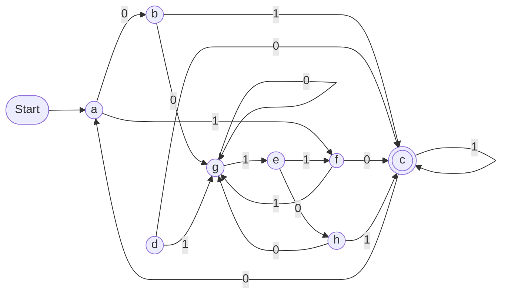
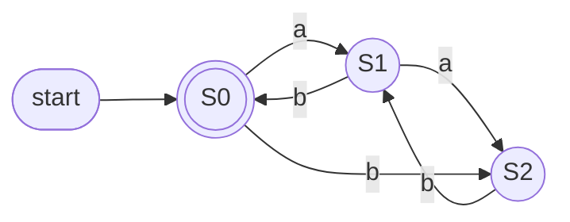
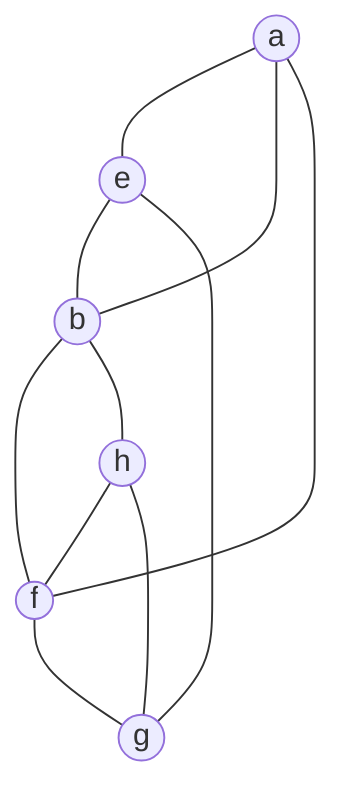
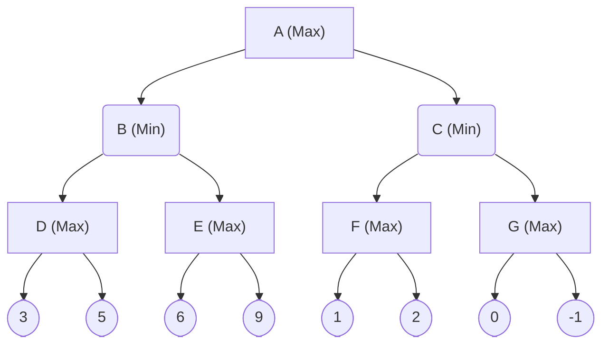

<!-- UGC NET Nov 2021 (26 Nov, Shift 2) · Paper 2 · generated by pyq_extract.py from 9_nov_2021.txt -->

## Q1
It is always important and useful to include an 'alt' attribute on an 'img' tag in HTML. Which of the reasons given below is/are correct?

A. Users who cannot see the image due to vision impairment can be given a textual description that a screen reader speaks aloud.<br>
B. If the image fails to load (slow connection, broken path, etc.), the alt text is displayed instead.<br>
C. It gives SEO (Search Engine Optimization) benefits.

Choose the correct answer from the options given below:

## Q1 - Options
(A) A only
(B) B and C only
(C) C only
(D) A, B, and C

## Q1 - Hint
**Answer:** D
**Topic:** Web Programming (HTML, XML, Java, Servlets)
**Source:** UGC NET Nov 2021 (26 Nov, Shift 2) · Paper 2 · Q1

The alt attribute serves accessibility (screen readers read it aloud for visually impaired users), graceful degradation (it is shown when the image cannot load), and SEO (search engines use it to understand and index image content). All three statements are therefore correct.

## Q2
What does the following function f() in C return?

```
int f(unsigned int N) {
    unsigned int counter = 0;
    while (N > 0) {
        counter += N & 1;
        N = N >> 1;
    }
    return counter == 1;
}
```

## Q2 - Options
(A) 1 if N is odd, otherwise 0
(B) 1 if N is a power of 2, otherwise 0
(C) 1 if the binary representation of N is all 1s, otherwise 0
(D) 1 if the binary representation of N has any 1s, otherwise 0

## Q2 - Hint
**Answer:** B
**Topic:** Programming Output, Pointers, OOP & Data Types
**Source:** UGC NET Nov 2021 (26 Nov, Shift 2) · Paper 2 · Q2

The loop adds (N & 1) to counter for every bit while right-shifting N, so counter ends up holding the number of set bits (population count) of N. counter == 1 is true exactly when N has a single 1-bit, i.e. when N is a power of 2. An odd number such as 3 has two 1-bits, so option A is wrong.

## Q3
Consider the following recursive function F() in Java that takes an integer and returns a String:

```
public static String F(int N) {
    if (N <= 0) return "-";
    return F(N - 3) + N + F(N - 2) + N;
}
```

What is the value of F(5)?

## Q3 - Options
(A) -2-25-3-135
(B) -2-25-1-3-135
(C) -1-145-2-245
(D) -2-25-3-1-135

## Q3 - Hint
**Answer:** D
**Topic:** Programming Output, Pointers, OOP & Data Types
**Source:** UGC NET Nov 2021 (26 Nov, Shift 2) · Paper 2 · Q3

The function concatenates strings: the base case returns a dash, and each non-base call returns F(N-3) then N then F(N-2) then N. Expanding, F(5) needs F(2) and F(3). F(2) evaluates to "-2-2" because both recursive calls hit the base case. F(1) evaluates to "-1-1", so F(3) becomes "-3-1-13". Substituting everything back, F(5) equals "-2-2" then 5 then "-3-1-13" then 5, giving "-2-25-3-1-135".

## Q4
Match List-I (Programming Terms) with List-II (Meaning).

| List-I | List-II |
|---|---|
| A. JNDI | I. Runtime support for running a Java program |
| B. RMI | II. The API in support of naming and directory services |
| C. JDK | III. The methods and runtime support for calling remote methods |
| D. JRE | IV. The compiler and class libraries to develop Java applications |

## Q4 - Options
(A) A-II, B-III, C-IV, D-I
(B) A-II, B-IV, C-III, D-I
(C) A-I, B-III, C-IV, D-II
(D) A-III, B-II, C-IV, D-I

## Q4 - Hint
**Answer:** A
**Topic:** Web Programming (HTML, XML, Java, Servlets)
**Source:** UGC NET Nov 2021 (26 Nov, Shift 2) · Paper 2 · Q4

JNDI (Java Naming and Directory Interface) is the API for naming and directory services (II). RMI (Remote Method Invocation) provides the mechanism for invoking methods on remote JVM objects (III). JDK bundles the compiler and class libraries to build Java applications (IV). JRE supplies the runtime support (JVM plus libraries) needed to run a Java program (I).

## Q5
Match List-I (Programming Paradigms) with List-II (Characteristics).

| List-I | List-II |
|---|---|
| A. Imperative | I. Declarative, clausal representation, theorem proving |
| B. Object-oriented | II. Side-effect-free, declarative, expression evaluation |
| C. Logic | III. Imperative, abstract data type |
| D. Functional | IV. Command-based, procedural |

## Q5 - Options
(A) A-IV, B-III, C-I, D-II
(B) A-III, B-IV, C-I, D-II
(C) A-IV, B-III, C-II, D-I
(D) A-II, B-III, C-I, D-IV

## Q5 - Hint
**Answer:** A
**Topic:** Language Design, Data Types & Paradigms
**Source:** UGC NET Nov 2021 (26 Nov, Shift 2) · Paper 2 · Q5

Imperative programming is command-based and procedural (IV). Object-oriented programming is imperative in style and organised around abstract data types/objects (III). Logic programming uses declarative clauses and resolution/theorem proving (I). Functional programming is declarative, side-effect-free and based on expression evaluation (II).

## Q6
You have eight black-and-white images taken with a 1-megapixel camera and one 8-colour image taken with an 8-megapixel camera. How much disk space in total is needed to store these images?

## Q6 - Options
(A) 1 GB
(B) 4 MB
(C) 3 MB
(D) 3 GB

## Q6 - Hint
**Answer:** B
**Topic:** Computer Graphics: Display, Algorithms & 3D
**Source:** UGC NET Nov 2021 (26 Nov, Shift 2) · Paper 2 · Q6

A black-and-white pixel needs 1 bit, so each 1-MP image is 1,000,000 bits = 125 KB, and eight of them total about 1 MB. An 8-colour image needs 3 bits per pixel, so 8 MP x 3 bits = 24,000,000 bits = about 3 MB. Total is roughly 1 MB + 3 MB = 4 MB.

## Q7
The midpoint (Bresenham) algorithm for rasterizing lines is optimized relative to the DDA algorithm in that:

A. It avoids round-off operations.<br>
B. It is incremental.<br>
C. It uses only integer arithmetic.<br>
D. All straight lines can be displayed as exactly straight.

Choose the correct answer from the options given below:

## Q7 - Options
(A) A and B only
(B) A and C only
(C) A, B, C, and D
(D) A, B, and C only

## Q7 - Hint
**Answer:** D
**Topic:** Computer Graphics: Display, Algorithms & 3D
**Source:** UGC NET Nov 2021 (26 Nov, Shift 2) · Paper 2 · Q7

Bresenham's advantages over DDA are that it is incremental, uses only integer arithmetic and avoids the floating-point rounding DDA needs (A, B, C). Statement D is false: like every raster algorithm it only produces a discrete approximation of a line, not an exact geometric straight line.

## Q8
Find the transformation matrix M that maps the square with vertices (1,1), (-1,1), (-1,-1), (1,-1) to the parallelogram with corresponding vertices (2,1), (0,1), (-2,-1), (0,-1).

## Q8 - Options
(A) [[1, 1, 0], [0, 1, 0], [0, 0, 1]]
(B) [[1, 0, 0], [1, 1, 0], [0, 0, 1]]
(C) [[1, 1, 1], [0, 1, 0], [0, 0, 1]]
(D) [[1, 1, 0], [1, 1, 0], [0, 0, 1]]

## Q8 - Hint
**Answer:** A
**Topic:** 2D Transformations, Reflection, Projection & Clipping
**Source:** UGC NET Nov 2021 (26 Nov, Shift 2) · Paper 2 · Q8

Write the homogeneous matrix with unknown top-left entries a, b, c, d. From (1,1) to (2,1): a + b = 2 and c + d = 1. From (-1,1) to (0,1): -a + b = 0, so a = b = 1; then c + d = 1 with -c + d = 1 gives c = 0, d = 1. So x = x + y, y = y, a horizontal shear: [[1,1,0],[0,1,0],[0,0,1]].

## Q9
A Bezier curve P(t) is defined by four control points in the xy-plane: P0 = (-2, 0), P1 = (-2, 4), P2 = (2, 4), P3 = (2, 0). Which statements are correct?

A. P(t) has degree 3.<br>
B. P(1/2) = (0, 3).<br>
C. P(t) may extend outside the convex hull of its control points.

Choose the correct answer from the options given below:

## Q9 - Options
(A) A and B only
(B) A and C only
(C) B and C only
(D) A, B, and C

## Q9 - Hint
**Answer:** A
**Topic:** 2D Transformations, Reflection, Projection & Clipping
**Source:** UGC NET Nov 2021 (26 Nov, Shift 2) · Paper 2 · Q9

Four control points give a cubic Bezier curve, degree 3 (A). At t = 1/2 the Bernstein weights are 1/8, 3/8, 3/8, 1/8; x = (-2 - 6 + 6 + 2)/8 = 0 and y = (0 + 12 + 12 + 0)/8 = 3, so P(1/2) = (0, 3) (B). Statement C is false: a Bezier curve always lies within the convex hull of its control points.

## Q10
Statement I: The maximum number of sides a triangle can have after being clipped to a rectangular viewport is 6.<br>
Statement II: In 3D graphics, the perspective transformation is nonlinear in z.

In light of the above statements, choose the correct answer from the options given below:

## Q10 - Options
(A) Both Statement I and Statement II are true
(B) Both Statement I and Statement II are false
(C) Statement I is true but Statement II is false
(D) Statement I is false but Statement II is true

## Q10 - Hint
**Answer:** D
**Topic:** 2D Transformations, Reflection, Projection & Clipping
**Source:** UGC NET Nov 2021 (26 Nov, Shift 2) · Paper 2 · Q10

Clipping a 3-sided polygon against a 4-sided rectangle can add at most one vertex per clipping edge, giving up to 3 + 4 = 7 sides, so Statement I (which says 6) is false. Perspective projection divides coordinates by depth z, a nonlinear operation, so Statement II is true.

## Q11
In software testing, beta testing is the testing performed by \_\_\_\_\_\_.

## Q11 - Options
(A) potential customers at the developer's location
(B) potential customers at their own locations
(C) product developers at the customer's location
(D) product developers at their own locations

## Q11 - Hint
**Answer:** B
**Topic:** Software Testing, V&V & Quality (CMM)
**Source:** UGC NET Nov 2021 (26 Nov, Shift 2) · Paper 2 · Q11

Beta testing is done by real or potential users in their own environment, outside the developer's site, after alpha testing. Testing by customers at the developer's site is alpha testing.

## Q12
In the MVC architectural pattern, the View component is responsible for:

## Q12 - Options
(A) User interface
(B) Security of the system
(C) Business logic and domain objects
(D) Translating between user interface actions/events and operations on the domain objects

## Q12 - Hint
**Answer:** A
**Topic:** SE: Design, UML, Configuration Management & Reuse
**Source:** UGC NET Nov 2021 (26 Nov, Shift 2) · Paper 2 · Q12

In Model-View-Controller the View handles presentation and user-interface rendering. Business logic and domain data belong to the Model, and translating user actions into Model operations is the Controller.

## Q13
In software engineering, what kind of notation do formal methods predominantly use?

## Q13 - Options
(A) textual
(B) diagrammatic
(C) mathematical
(D) computer code

## Q13 - Hint
**Answer:** C
**Topic:** SDLC Models & Requirements (SRS)
**Source:** UGC NET Nov 2021 (26 Nov, Shift 2) · Paper 2 · Q13

Formal methods specify and verify software using mathematically based notations (set theory, predicate logic, algebra; e.g. Z, VDM, B) that allow rigorous proof of properties. UML-style diagrams are only semi-formal.

## Q14
If every requirement stated in the Software Requirement Specification (SRS) has only one interpretation, then the SRS is said to be:

## Q14 - Options
(A) correct
(B) consistent
(C) unambiguous
(D) verifiable

## Q14 - Hint
**Answer:** C
**Topic:** SDLC Models & Requirements (SRS)
**Source:** UGC NET Nov 2021 (26 Nov, Shift 2) · Paper 2 · Q14

An SRS is unambiguous when every requirement has exactly one interpretation. Consistency means requirements do not conflict; correctness means each requirement is one the system must meet; verifiability means each can be checked.

## Q15
A system has 99.99% uptime and a mean-time-between-failure (MTBF) of 1 day. How quickly must the system repair itself to meet this availability goal?

## Q15 - Options
(A) ~9 seconds
(B) ~10 seconds
(C) ~11 seconds
(D) ~12 seconds

## Q15 - Hint
**Answer:** A
**Topic:** Software Testing, V&V & Quality (CMM)
**Source:** UGC NET Nov 2021 (26 Nov, Shift 2) · Paper 2 · Q15

Availability = MTBF / (MTBF + MTTR). With A = 0.9999 and MTBF = 86,400 s, the repair time MTTR = MTBF x (1 - A) = 86,400 x 0.0001 = 8.64 s, i.e. about 9 seconds.

## Q16
In Software Configuration Management (SCM), which kinds of files should be committed to the source control repository?

A. Code files<br>
B. Documentation files<br>
C. Output files<br>
D. Automatically generated files that are required for the system to be used

Choose the correct answer from the options given below:

## Q16 - Options
(A) A and B only
(B) B and C only
(C) C and D only
(D) D and A only

## Q16 - Hint
**Answer:** A
**Topic:** SE: Design, UML, Configuration Management & Reuse
**Source:** UGC NET Nov 2021 (26 Nov, Shift 2) · Paper 2 · Q16

Hand-authored source artefacts - code (A) and documentation (B) - belong in version control. Build outputs (C) and generated files (D) should not be committed because they are reproducible from the sources and only add merge noise and staleness.

## Q17
Match List-I (Software Process Model) with List-II (Description).

| List-I | List-II |
|---|---|
| A. Waterfall Model | I. Software can be developed incrementally |
| B. Evolutionary Model | II. Requirement compromises are inevitable |
| C. Component-based Software Engineering | III. Explicit recognition of risk |
| D. Spiral Development | IV. Inflexible partitioning of the project into stages |

## Q17 - Options
(A) A-IV, B-I, C-III, D-II
(B) A-I, B-IV, C-II, D-III
(C) A-II, B-III, C-I, D-IV
(D) A-IV, B-I, C-II, D-III

## Q17 - Hint
**Answer:** D
**Topic:** SDLC Models & Requirements (SRS)
**Source:** UGC NET Nov 2021 (26 Nov, Shift 2) · Paper 2 · Q17

Waterfall rigidly partitions the project into sequential stages (IV). The Evolutionary model builds software incrementally through iterations (I). Component-based development reuses pre-built components, so requirement compromises are inevitable (II). The Spiral model performs explicit risk analysis at each cycle (III).

## Q18
Identify the correct order (lower to higher) of the five levels of the Capability Maturity Model used to measure the maturity of an organisation's software process.

A. Defined<br>
B. Optimizing<br>
C. Initial<br>
D. Managed<br>
E. Repeatable

Choose the correct answer from the options given below:

## Q18 - Options
(A) C, A, E, D, B
(B) C, E, A, B, D
(C) C, B, D, E, A
(D) C, E, A, D, B

## Q18 - Hint
**Answer:** D
**Topic:** Software Testing, V&V & Quality (CMM)
**Source:** UGC NET Nov 2021 (26 Nov, Shift 2) · Paper 2 · Q18

The Capability Maturity Model rises through five stages: Initial (ad hoc, chaotic process), Repeatable (basic project management established), Defined (process documented and standardised across the organisation), Managed (process quantitatively measured and controlled), and Optimizing (continuous, data-driven process improvement). Mapping the given letters, the increasing order is Initial C, Repeatable E, Defined A, Managed D, Optimizing B.

## Q19
Statement I: The Cleanroom software process model incorporates the statistical quality certification of code increments as they accumulate into a system.<br>
Statement II: Cleanroom software engineering follows the classic analysis, design, code, test and debug cycle, focusing on defect removal rather than defect prevention.

In light of the above statements, choose the correct answer from the options given below:

## Q19 - Options
(A) Both Statement I and Statement II are true
(B) Both Statement I and Statement II are false
(C) Statement I is true but Statement II is false
(D) Statement I is false but Statement II is true

## Q19 - Hint
**Answer:** C
**Topic:** SDLC Models & Requirements (SRS)
**Source:** UGC NET Nov 2021 (26 Nov, Shift 2) · Paper 2 · Q19

Cleanroom does use statistical usage testing to certify each code increment (Statement I true). But its philosophy is defect prevention through formal specification and correctness verification, deliberately avoiding the traditional code-and-debug cycle, so Statement II is false.

## Q20
Assertion (A): Software developers do not do exhaustive software testing in practice.<br>
Reason (R): Even for small inputs, exhaustive testing is too computationally intensive (takes too long) to run all the tests.

In light of the above statements, choose the correct answer from the options given below:

## Q20 - Options
(A) Both A and R are true and R is the correct explanation of A
(B) Both A and R are true but R is NOT the correct explanation of A
(C) A is true but R is false
(D) A is false but R is true

## Q20 - Hint
**Answer:** A
**Topic:** Software Testing, V&V & Quality (CMM)
**Source:** UGC NET Nov 2021 (26 Nov, Shift 2) · Paper 2 · Q20

Exhaustive testing (trying every input/path) is practically impossible because the input space grows combinatorially, so testers sample instead (A true). That combinatorial blow-up is exactly why exhaustive testing is infeasible, so R is true and correctly explains A.

## Q21
Which of the following pairs are logically equivalent?

A. `not p -> (q -> r)` and `q -> (p OR r)`<br>
B. `(p -> q) -> r` and `p -> (q -> r)`<br>
C. `(p -> q) -> (r -> s)` and `(p -> r) -> (q -> s)`

Choose the correct answer from the options given below:

## Q21 - Options
(A) A only
(B) A and B only
(C) B and C only
(D) A and C only

## Q21 - Hint
**Answer:** A
**Topic:** Propositional & Predicate Logic
**Source:** UGC NET Nov 2021 (26 Nov, Shift 2) · Paper 2 · Q21

Pair A: not p -&gt; (q -&gt; r) simplifies to p OR not q OR r, and q -&gt; (p OR r) simplifies to not q OR p OR r - identical, so equivalent. Pair B fails (implication is not associative; try p = q = r = false). Pair C also fails (try p = true, q = r = s = false).

## Q22
Which statements about the floor and ceiling functions are correct?

Statement I: floor(2x) = floor(x) + floor(x + 1/2) for every real number x.<br>
Statement II: ceil(x + y) = ceil(x) + ceil(y) for all real numbers x and y.

Choose the correct answer from the options given below:

## Q22 - Options
(A) Both Statement I and Statement II are true
(B) Both Statement I and Statement II are false
(C) Statement I is true but Statement II is false
(D) Statement I is false but Statement II is true

## Q22 - Hint
**Answer:** C
**Topic:** Discrete Maths: Counting, Induction, Lattices & Number Theory
**Source:** UGC NET Nov 2021 (26 Nov, Shift 2) · Paper 2 · Q22

Statement I is the standard Hermite identity floor(2x) = floor(x) + floor(x + 1/2), valid for all real x. Statement II is false: for x = y = 0.5, ceil(1) = 1 but ceil(0.5) + ceil(0.5) = 2.

## Q23
How many ways are there to assign 5 different jobs to 4 different employees if every employee is assigned at least one job?

## Q23 - Options
(A) 1024
(B) 625
(C) 240
(D) 20

## Q23 - Hint
**Answer:** C
**Topic:** Discrete Maths: Counting, Induction, Lattices & Number Theory
**Source:** UGC NET Nov 2021 (26 Nov, Shift 2) · Paper 2 · Q23

This counts onto (surjective) functions from a 5-element set to a 4-element set: 4! x S(5,4) = 24 x 10 = 240. Equivalently: pick the employee who gets 2 jobs (4 ways), pick those 2 jobs (C(5,2) = 10), assign the remaining 3 jobs to 3 employees (3! = 6): 4 x 10 x 6 = 240.

## Q24
A warehouse stores products in bins identified by aisle, location within the aisle, and shelf. There are 50 aisles, 85 locations per aisle, and 5 shelves. What is the least number of products the company can have so that at least two products must be stored in the same bin?

## Q24 - Options
(A) 251
(B) 426
(C) 4251
(D) 21251

## Q24 - Hint
**Answer:** D
**Topic:** Discrete Maths: Counting, Induction, Lattices & Number Theory
**Source:** UGC NET Nov 2021 (26 Nov, Shift 2) · Paper 2 · Q24

Total bins = 50 x 85 x 5 = 21,250. By the pigeonhole principle, one more product than the number of bins forces two products into the same bin: 21,250 + 1 = 21,251.

## Q25
A person climbing stairs can take either one stair or two stairs at a time. In how many ways can this person climb a flight of eight stairs?

## Q25 - Options
(A) 21
(B) 24
(C) 31
(D) 34

## Q25 - Hint
**Answer:** D
**Topic:** Discrete Maths: Counting, Induction, Lattices & Number Theory
**Source:** UGC NET Nov 2021 (26 Nov, Shift 2) · Paper 2 · Q25

The last move is either a single stair (leaving f(n-1) ways to reach the previous stair) or a double stair (leaving f(n-2) ways), so f(n) = f(n-1) + f(n-2), the Fibonacci recurrence. Starting from f(1) = 1 and f(2) = 2, the values continue 3, 5, 8, 13, 21, and finally f(8) = 34.

## Q26
For which value of n is the wheel graph Wn regular?

## Q26 - Options
(A) 2
(B) 3
(C) 4
(D) 5

## Q26 - Hint
**Answer:** C
**Topic:** Graph Theory
**Source:** UGC NET Nov 2021 (26 Nov, Shift 2) · Paper 2 · Q26

A wheel Wn has a hub joined to every vertex of a cycle. Each rim vertex has degree 3 (two rim neighbours plus the hub), while the hub has degree n - 1. The graph is regular only when n - 1 = 3, i.e. n = 4 (which is K4).

## Q27
Which of the labelled graphs is/are planar?


Three undirected graphs labelled A, B and C.

## Q27 - Options
(A) A and B only
(B) B and C only
(C) A only
(D) B only

## Q27 - Hint
**Answer:** C
**Topic:** Graph Theory
**Source:** UGC NET Nov 2021 (26 Nov, Shift 2) · Paper 2 · Q27

Graph A can be redrawn with no edge crossings, so it is planar. Graphs B and C each contain a K3,3 (or K5) subdivision, which by Kuratowski's theorem makes them non-planar. Hence only A is planar.

## Q28
Match List-I (Identity) with List-II (Name).

| List-I | List-II |
|---|---|
| A. x + x = x | I. Identity Law |
| B. x + 0 = x | II. Absorption Law |
| C. x + 1 = 1 | III. Idempotent Law |
| D. x + xy = x | IV. Domination Law |

## Q28 - Options
(A) A-III, B-I, C-II, D-IV
(B) A-I, B-III, C-IV, D-II
(C) A-III, B-I, C-IV, D-II
(D) A-III, B-IV, C-I, D-II

## Q28 - Hint
**Answer:** C
**Topic:** K-Map, SOP & Boolean Laws
**Source:** UGC NET Nov 2021 (26 Nov, Shift 2) · Paper 2 · Q28

In Boolean algebra, combining a variable with itself leaves it unchanged, so x + x = x is the Idempotent law (III). Adding the additive identity leaves the value alone, so x + 0 = x is the Identity law (I). Anything combined with logical true collapses to true, so x + 1 = 1 is the Domination or null law (IV). A term that already contains the variable is swallowed, so x + xy = x is the Absorption law (II).

## Q29
Let (X, \*) be a semigroup such that for every a and b in X, if a is not equal to b then a \* b is not equal to b \* a. Which of the following equalities hold?

A. a \* a = a for every a in X.<br>
B. a \* b \* a = a for every a, b in X.<br>
C. a \* b \* c = a \* c for every a, b, c in X.

Choose the correct answer from the options given below:

## Q29 - Options
(A) A and B only
(B) A and C only
(C) B and C only
(D) A, B and C

## Q29 - Hint
**Answer:** D
**Topic:** Groups, Subgroups & Algebraic Structures
**Source:** UGC NET Nov 2021 (26 Nov, Shift 2) · Paper 2 · Q29

The contrapositive of the hypothesis says: whenever two elements commute, they must be equal. For A, a \* a commutes with a (associativity gives (a*a)*a = a*(a*a)), so a \* a = a and every element is idempotent. For B, a \* b \* a commutes with a (using idempotence a\*(a*b*a) = a*b*a = (a*b*a)\*a), so a \* b \* a = a. For C, a \* b \* c and a \* c each absorb the middle factor via B and commute, so the hypothesis forces a \* b \* c = a \* c. All three hold.

## Q30
Consider the linear program: maximize Z = 6x + 5y subject to 2x - 3y &lt;= 5, x + 3y &lt;= 11, 4x + y &lt;= 15, x &gt;= 0, y &gt;= 0. The optimal value of Z is:

## Q30 - Options
(A) 15
(B) 25
(C) 31.72
(D) 41.44

## Q30 - Hint
**Answer:** C
**Topic:** Linear Programming & Transportation Problem
**Source:** UGC NET Nov 2021 (26 Nov, Shift 2) · Paper 2 · Q30

For a linear program the optimum lies at a vertex of the feasible region, so evaluate the objective Z = 6x + 5y at every corner. The best value occurs where the constraints x + 3y = 11 and 4x + y = 15 meet, namely x = 34/11 and y = 29/11, because that point still satisfies 2x - 3y &lt;= 5. There Z = 204/11 + 145/11 = 349/11, which is approximately 31.72; other feasible corners such as (2.5, 0) and (25/7, 5/7) yield only 25 or less.

## Q31
Which of the following languages are NOT regular?

A. L = { (01)^n 0^k : n &gt; k, k &gt;= 0 }<br>
B. L = { c^n b^k a^(n+k) : n &gt;= 0, k &gt;= 0 }<br>
C. L = { 0^n 1^k : n is not equal to k }

Choose the correct answer from the options given below:

## Q31 - Options
(A) A and B only
(B) A and C only
(C) B and C only
(D) A, B and C

## Q31 - Hint
**Answer:** D
**Topic:** Finite Automata, Regular Languages & DFA Minimization
**Source:** UGC NET Nov 2021 (26 Nov, Shift 2) · Paper 2 · Q31

Each language needs an unbounded comparison of counts that a finite automaton cannot perform. A compares the number of (01) blocks with the number of trailing 0s (n &gt; k). B forces the number of a-symbols to equal the sum of the c and b counts. C forces the number of 0s to differ from the number of 1s (its complement 0^n 1^n is the classic non-regular language). All three are non-regular by the pumping lemma.

## Q32
Any string of terminals generated by the following context-free grammar (S is the start symbol):

```
S -> XY
X -> 0X | 1X | 0
Y -> Y0 | Y1 | 0
```

## Q32 - Options
(A) has at least one 1
(B) should end with 0
(C) has no consecutive 0's or 1's
(D) has at least two 0's

## Q32 - Hint
**Answer:** D
**Topic:** Chomsky Hierarchy, Grammars & CNF/GNF
**Source:** UGC NET Nov 2021 (26 Nov, Shift 2) · Paper 2 · Q32

X derives any binary string that ends in 0 (length at least 1), and Y derives any binary string that begins with 0. A string from S = XY therefore always contains the trailing 0 of the X-part and the leading 0 of the Y-part - at least two 0s. It need not contain a 1, need not end in 0, and may repeat symbols.

## Q33
Let L1 = { 0^n 1^n 0^m : n &gt;= 1, m &gt;= 1 }, L2 = { 0^n 1^m 0^m : n &gt;= 1, m &gt;= 1 }, L3 = { 0^n 1^n 0^n : n &gt;= 1 }. Which statements are correct?

A. L3 = L1 intersect L2<br>
B. L1 and L2 are context-free languages but L3 is not.<br>
C. L1 and L2 are not context-free but L3 is.<br>
D. L1 is a subset of L3.

Choose the correct answer from the options given below:

## Q33 - Options
(A) A and B only
(B) A and C only
(C) A and D only
(D) A only

## Q33 - Hint
**Answer:** A
**Topic:** CFL, PDA, Pumping Lemma & Closure Properties
**Source:** UGC NET Nov 2021 (26 Nov, Shift 2) · Paper 2 · Q33

A string in L1 has (first 0s) = (1s); a string in L2 has (1s) = (trailing 0s). A string in both has all three blocks equal, exactly L3, so A is true. L1 and L2 each need only one matched pair, so a single stack (PDA) suffices - they are context-free; L3 needs two independent matches and is not context-free, so B is true. C is false, and D is false since 0^1 1^1 0^2 is in L1 but not in L3.

## Q34
Statement I: The family of context-free languages is closed under homomorphism.<br>
Statement II: The family of context-free languages is closed under reversal.

In light of the above statements, choose the correct answer from the options given below:

## Q34 - Options
(A) Both Statement I and Statement II are true
(B) Both Statement I and Statement II are false
(C) Statement I is true but Statement II is false
(D) Statement I is false but Statement II is true

## Q34 - Hint
**Answer:** A
**Topic:** CFL, PDA, Pumping Lemma & Closure Properties
**Source:** UGC NET Nov 2021 (26 Nov, Shift 2) · Paper 2 · Q34

Context-free languages are closed under homomorphism (replace each terminal in the grammar by its image string) and under reversal (reverse the right-hand side of every production). Both statements are true.

## Q35
What is the minimum number of states in the finite automaton equivalent to the transition diagram shown?



State transition diagram of a finite automaton over input alphabet {0, 1} with start state a and accepting state c.

## Q35 - Options
(A) 3
(B) 4
(C) 5
(D) 6

## Q35 - Hint
**Answer:** C
**Topic:** Finite Automata, Regular Languages & DFA Minimization
**Source:** UGC NET Nov 2021 (26 Nov, Shift 2) · Paper 2 · Q35

Remove the unreachable/dead state, then apply state minimization by repeatedly splitting groups whose members move to different groups on some input. The reachable states collapse into 5 equivalence classes, so the minimal DFA has 5 states.

## Q36
Find a regular expression for the language accepted by the automaton shown.



A three-state finite automaton over {a, b} whose leftmost state is both the start state and the only accepting state.

## Q36 - Options
(A) (aa\*(a + b)ab)\*
(B) (a + b)ab(ab + bb + aa\*(a + b)ab)\*
(C) a*ab(ab + bb + aa*(a + b)ab)\*
(D) a\*(a + b)ab(ab + bb + aa\*(a + b)ab)\*

## Q36 - Hint
**Answer:** B
**Topic:** Finite Automata, Regular Languages & DFA Minimization
**Source:** UGC NET Nov 2021 (26 Nov, Shift 2) · Paper 2 · Q36

Trace the paths that begin and end at the start state, since it is also the only accepting state. The machine must first consume a single symbol (a + b) and then the pair ab to return to the accepting state, so every accepted string starts with (a + b)ab. After that it can repeat any loop back to the accepting state, namely ab, bb, or the longer detour aa\*(a + b)ab. Putting the mandatory prefix before the starred set of loops gives (a + b)ab(ab + bb + aa\*(a + b)ab)\*.

## Q37
What language is accepted by the pushdown automaton M = ({q0, q1, q2}, {a, b}, {a, b, z}, delta, q0, z, {q2}) with the following transitions?

```
delta(q0, a, a) = {(q0, aa)}     delta(q0, b, a) = {(q0, ba)}
delta(q0, a, b) = {(q0, ab)}     delta(q0, b, b) = {(q0, bb)}
delta(q0, a, z) = {(q0, az)}     delta(q0, b, z) = {(q0, bz)}
delta(q0, lambda, a) = {(q1, a)} delta(q0, lambda, b) = {(q1, b)}
delta(q1, a, a) = {(q1, lambda)} delta(q1, b, b) = {(q1, lambda)}
delta(q1, lambda, z) = {(q2, z)}
```

## Q37 - Options
(A) L = { w : na(w) = nb(w), w in {a, b}+ }
(B) L = { w : na(w) &lt;= nb(w), w in {a, b}+ }
(C) L = { w : nb(w) &lt;= na(w), w in {a, b}+ }
(D) L = { w w^R : w in {a, b}+ }

## Q37 - Hint
**Answer:** D
**Topic:** CFL, PDA, Pumping Lemma & Closure Properties
**Source:** UGC NET Nov 2021 (26 Nov, Shift 2) · Paper 2 · Q37

In q0 the PDA pushes every input symbol, building a stack copy of the prefix read so far. A spontaneous lambda-move switches to q1, where each further input symbol must match and pop the top of the stack. This succeeds exactly when the second half of the input is the reverse of the first half, i.e. the input is w w^R.

## Q38
Match List-I (Production Rules) with List-II (Grammar type).

| List-I | List-II |
|---|---|
| A. S -&gt; XY; X -&gt; 0; Y -&gt; 1 | I. Greibach Normal Form |
| B. S -&gt; aS \| bSS \| c | II. Context sensitive Grammar |
| C. S -&gt; AB; A -&gt; 0A \| 1A \| 0; B -&gt; 0A | III. Chomsky Normal Form |
| D. S -&gt; aAbc; Ab -&gt; bA; Ac -&gt; Bbcc; bB -&gt; Bb; aB -&gt; aa \| aaA | IV. S-Grammar |

## Q38 - Options
(A) A-III, B-I, C-IV, D-II
(B) A-III, B-II, C-I, D-IV
(C) A-III, B-IV, C-I, D-II
(D) A-IV, B-III, C-I, D-II

## Q38 - Hint
**Answer:** C
**Topic:** Chomsky Hierarchy, Grammars & CNF/GNF
**Source:** UGC NET Nov 2021 (26 Nov, Shift 2) · Paper 2 · Q38

A is in Chomsky Normal Form - every rule is "one nonterminal -&gt; two nonterminals" or "-&gt; one terminal" (III). B is an s-grammar: each right side is a terminal followed by nonterminals and every (nonterminal, terminal) pair occurs once (IV). D has multi-symbol left sides such as Ab -&gt; bA and is non-contracting, i.e. context-sensitive (II). By elimination C pairs with Greibach Normal Form, whose rules place a terminal first followed by nonterminals (I).

## Q39
Which of the following concepts can be used to identify loops?

A. Depth-first ordering<br>
B. Dominators<br>
C. Reducible graphs

Choose the correct answer from the options given below:

## Q39 - Options
(A) A and B only
(B) A and C only
(C) B and C only
(D) A, B and C

## Q39 - Hint
**Answer:** D
**Topic:** Compilers: Semantic Analysis, Run-time & Optimization
**Source:** UGC NET Nov 2021 (26 Nov, Shift 2) · Paper 2 · Q39

Loop detection in control-flow analysis uses all three: a depth-first spanning tree identifies back edges via depth-first ordering, dominator information confirms that the head of a back edge dominates its tail (a natural loop), and reducibility guarantees every retreating edge is a back edge so all loops are natural.

## Q40
Statement I: LL(1) and LR are examples of bottom-up parsers.<br>
Statement II: Recursive descent parser and SLR are examples of top-down parsers.

In light of the above statements, choose the correct answer from the options given below:

## Q40 - Options
(A) Both Statement I and Statement II are true
(B) Both Statement I and Statement II are false
(C) Statement I is true but Statement II is false
(D) Statement I is false but Statement II is true

## Q40 - Hint
**Answer:** B
**Topic:** Parsing, FIRST/FOLLOW, Compiler Phases & Three-Address Code
**Source:** UGC NET Nov 2021 (26 Nov, Shift 2) · Paper 2 · Q40

LL(1) parsing and recursive descent are top-down, while LR and SLR parsing are bottom-up. Statement I is wrong about LL(1) and Statement II is wrong about SLR, so both statements are false.

## Q41
The postfix form of the infix expression ( A + B ) \* ( C \* D - E ) \* F / G is:

## Q41 - Options
(A) AB + CD\*E - FG / \*\*
(B) AB + CD\*E - F\*\*G /
(C) AB + CD\*E - *F*G /
(D) AB + CDE\*- *F*G /

## Q41 - Hint
**Answer:** C
**Topic:** Hashing, Stacks, Queues & Linked Lists
**Source:** UGC NET Nov 2021 (26 Nov, Shift 2) · Paper 2 · Q41

Scan the expression and emit each operator immediately after both its operands, respecting precedence and left-to-right association. First A plus B becomes AB+ and C times D becomes CD\*, then subtracting E gives CD*E-. Multiplying the two parenthesised results produces AB+CD*E-*, after which multiplying by F appends another star and finally dividing by G appends a slash. The complete postfix string is therefore AB+CD*E-*F*G/.

## Q42
A double-ended queue is to be implemented using only stacks (push and pop). What is the time complexity of AddFront() and AddRear(), where m is the stack size and n is the number of elements?

## Q42 - Options
(A) O(m) and O(n)
(B) O(1) and O(n)
(C) O(n) and O(1)
(D) O(n) and O(m)

## Q42 - Hint
**Answer:** B
**Topic:** Hashing, Stacks, Queues & Linked Lists
**Source:** UGC NET Nov 2021 (26 Nov, Shift 2) · Paper 2 · Q42

If the primary stack keeps the front element on top, AddFront is a single push - O(1). AddRear must reach the bottom of that stack, so all n elements are popped to an auxiliary stack, the new element pushed, and everything moved back - O(n).

## Q43
Two balanced binary search trees hold m and n elements respectively. They can be merged into one balanced binary search tree in \_\_\_\_\_\_ time.

## Q43 - Options
(A) O(m\*n)
(B) O(m + n)
(C) O(m\*log n)
(D) O(m\*log(m + n))

## Q43 - Hint
**Answer:** B
**Topic:** Trees: BST, AVL & Heaps
**Source:** UGC NET Nov 2021 (26 Nov, Shift 2) · Paper 2 · Q43

In-order traversal of each tree yields a sorted list in O(m) and O(n). Merge the two sorted lists in O(m + n), then build a balanced BST from the merged array in O(m + n). Total O(m + n).

## Q44
A data structure must store a set of integers so that each of the following runs in O(log n) time: delete the smallest element, and insert an element only if it is not already present. Which structure can be used?

## Q44 - Options
(A) A heap can be used but not a balanced binary search tree
(B) A balanced binary search tree can be used but not a heap
(C) Both a balanced binary search tree and a heap can be used
(D) Neither a balanced binary search tree nor a heap can be used

## Q44 - Hint
**Answer:** B
**Topic:** Trees: BST, AVL & Heaps
**Source:** UGC NET Nov 2021 (26 Nov, Shift 2) · Paper 2 · Q44

A balanced BST supports find-min, delete-min, membership test and insert all in O(log n). A min-heap gives O(log n) delete-min, but checking whether a value is already present needs an O(n) scan, so it cannot do the conditional insert in O(log n).

## Q45
Consider the graph shown. Which of the following vertex sequences are valid depth-first traversals of this graph?

I. a b e g h f<br>
II. a b f e h g<br>
III. a b f h g e<br>
IV. a f g h b e



An undirected graph on vertices a, b, e, f, g and h.

## Q45 - Options
(A) I, II, and IV only
(B) I and IV only
(C) II, III, and IV only
(D) I, III, and IV only

## Q45 - Hint
**Answer:** D
**Topic:** BFS, DFS & Graph Algorithms
**Source:** UGC NET Nov 2021 (26 Nov, Shift 2) · Paper 2 · Q45

A DFS may advance only to a vertex adjacent to the current one, or backtrack to an earlier vertex on the stack. Sequences I, III and IV each follow legal edge moves and backtracks. Sequence II fails: after a-b-f, the next vertex e is not reachable from f without first backtracking to a vertex adjacent to e.

## Q46
Statement I: In an undirected graph, the number of vertices of odd degree is even.<br>
Statement II: In an undirected graph, the sum of the degrees of all vertices is even.

In light of the above statements, choose the correct answer from the options given below:

## Q46 - Options
(A) Both Statement I and Statement II are true
(B) Both Statement I and Statement II are false
(C) Statement I is true but Statement II is false
(D) Statement I is false but Statement II is true

## Q46 - Hint
**Answer:** A
**Topic:** Graph Theory
**Source:** UGC NET Nov 2021 (26 Nov, Shift 2) · Paper 2 · Q46

By the handshaking lemma the sum of all vertex degrees equals twice the number of edges, which is even (Statement II). Since the even-degree vertices contribute an even amount, the odd-degree vertices must be even in number for the total to stay even (Statement I).

## Q47
Give the increasing order of asymptotic growth of the functions f1, f2, f3, f4:

A. f1(n) = 2^n<br>
B. f2(n) = n^(3/2)<br>
C. f3(n) = n log n<br>
D. f4(n) = n^(log n)

Choose the correct answer from the options given below:

## Q47 - Options
(A) C, B, D, A
(B) C, B, A, D
(C) B, C, A, D
(D) B, C, D, A

## Q47 - Hint
**Answer:** A
**Topic:** Time Complexity, Asymptotic Notation & Recurrences
**Source:** UGC NET Nov 2021 (26 Nov, Shift 2) · Paper 2 · Q47

n log n grows slower than the polynomial n^1.5 (C &lt; B). n^(log n) is quasi-polynomial - it eventually overtakes any fixed polynomial but stays below the exponential 2^n (B &lt; D &lt; A). The order is C, B, D, A.

## Q48
The order of a leaf node in a B+ tree is the maximum number of (value, data-record-pointer) pairs it can hold. Given block size 1 KB (1024 bytes), data-record pointer 7 bytes, value field 9 bytes, and block pointer 6 bytes, what is the order of the leaf node?

## Q48 - Options
(A) 63
(B) 64
(C) 67
(D) 68

## Q48 - Hint
**Answer:** A
**Topic:** Trees: BST, AVL & Heaps
**Source:** UGC NET Nov 2021 (26 Nov, Shift 2) · Paper 2 · Q48

A B+ tree leaf holds m (value + record-pointer) pairs plus one block pointer to the next leaf: m x (9 + 7) + 6 &lt;= 1024, so 16m &lt;= 1018, m &lt;= 63.6. The order is 63.

## Q49
A hash function h(key) = key mod 7 with linear probing is used to insert the keys 44, 45, 79, 55, 91, 18, 63 into a table indexed 0 to 6. What is the final location of key 18?

## Q49 - Options
(A) 3
(B) 4
(C) 5
(D) 6

## Q49 - Hint
**Answer:** C
**Topic:** Hashing, Stacks, Queues & Linked Lists
**Source:** UGC NET Nov 2021 (26 Nov, Shift 2) · Paper 2 · Q49

Insert the keys in order using the given modulo-7 hash and resolve every collision by linear probing to the next free slot. Key 44 hashes to slot 2 and key 45 to slot 3; key 79 also hashes to 2, finds slots 2 and 3 occupied, and settles in slot 4. Key 55 takes slot 6 and key 91 takes slot 0. Now key 18 hashes to slot 4, which already holds 79, so the probe moves forward one step and places key 18 in slot 5.

## Q50
Match List-I (Standard graph algorithm) with List-II (Time complexity), where n and m are the numbers of vertices and edges.

| List-I | List-II |
|---|---|
| A. Bellman-Ford algorithm | I. O(m log n) |
| B. Kruskal algorithm | II. O(n^3) |
| C. Floyd-Warshall algorithm | III. O(n\*m) |
| D. Topological sorting | IV. O(n + m) |

## Q50 - Options
(A) A-III, B-I, C-II, D-IV
(B) A-II, B-IV, C-III, D-I
(C) A-III, B-IV, C-I, D-II
(D) A-II, B-I, C-III, D-IV

## Q50 - Hint
**Answer:** A
**Topic:** BFS, DFS & Graph Algorithms
**Source:** UGC NET Nov 2021 (26 Nov, Shift 2) · Paper 2 · Q50

Bellman-Ford relaxes every edge n-1 times: O(n\*m) (III). Kruskal sorts edges and uses union-find: O(m log n) (I). Floyd-Warshall runs three nested vertex loops: O(n^3) (II). Topological sort visits each vertex and edge once: O(n + m) (IV).

## Q51
Which type of agent deals with 'happy' and 'unhappy' states?

## Q51 - Options
(A) Utility-based agent
(B) Model-based agent
(C) Goal-based agent
(D) Learning agent

## Q51 - Hint
**Answer:** A
**Topic:** AI: Knowledge Representation, Planning & Expert Systems
**Source:** UGC NET Nov 2021 (26 Nov, Shift 2) · Paper 2 · Q51

A utility-based agent attaches a numeric utility to each state, letting it prefer states that make it 'happier', choose among competing goal-satisfying states, and trade off conflicting goals. A goal-based agent only distinguishes goal from non-goal states.

## Q52
Statement I: Breadth-first search is optimal when all step costs are equal, whereas uniform-cost search is optimal for any step cost.<br>
Statement II: When all step costs are the same, uniform-cost search expands more nodes at depth d than breadth-first search.

In light of the above statements, choose the correct answer from the options given below:

## Q52 - Options
(A) Both Statement I and Statement II are true
(B) Both Statement I and Statement II are false
(C) Statement I is true but Statement II is false
(D) Statement I is false but Statement II is true

## Q52 - Hint
**Answer:** A
**Topic:** NLP, Bayes Rule, Search, Genetic & Fuzzy Concepts
**Source:** UGC NET Nov 2021 (26 Nov, Shift 2) · Paper 2 · Q52

BFS returns a shallowest, hence cheapest, solution only when every step costs the same, while UCS expands nodes in order of path cost and stays optimal for arbitrary non-negative costs (Statement I). With equal step costs UCS still explores the entire cost contour, including depth-d nodes BFS would stop short of, so it expands more nodes (Statement II).

## Q53
For the game tree shown, compute the value backed up to the root using the alpha-beta pruning algorithm.



A three-ply game tree: root A is a MAX node, B and C are MIN nodes, D to G are MAX nodes with leaf values 3, 5, 6, 9, 1, 2, 0, -1 from left to right.

## Q53 - Options
(A) 3
(B) 5
(C) 6
(D) 9

## Q53 - Hint
**Answer:** B
**Topic:** NLP, Bayes Rule, Search, Genetic & Fuzzy Concepts
**Source:** UGC NET Nov 2021 (26 Nov, Shift 2) · Paper 2 · Q53

Evaluate left to right while carrying alpha and beta bounds. The MAX node D returns max(3, 5) = 5, so the MIN node B now has beta = 5. Exploring child E, its first leaf 6 already exceeds beta, therefore the branch is pruned and B stays 5, which makes alpha = 5 at the root. At the MIN node C, the MAX node F returns max(1, 2) = 2, so C cannot exceed 2; because 2 is not greater than alpha = 5, node G is pruned. The root finally backs up max(5, 2) = 5.

## Q54
Which of the following statements is/are FALSE?

A. Greedy best-first search is not optimal but is often efficient.<br>
B. A\* is complete and optimal provided h(n) is admissible or consistent.<br>
C. Recursive best-first search is efficient in time complexity but poor in space complexity.<br>
D. h(n) = 0 is an admissible heuristic for the 8-puzzle.

Choose the correct answer from the options given below:

## Q54 - Options
(A) A only
(B) A and D only
(C) C only
(D) C and D only

## Q54 - Hint
**Answer:** C
**Topic:** NLP, Bayes Rule, Search, Genetic & Fuzzy Concepts
**Source:** UGC NET Nov 2021 (26 Nov, Shift 2) · Paper 2 · Q54

A, B and D are true. C is false and reversed: recursive best-first search uses only linear space (its strength) but can be time-inefficient because it re-expands nodes when switching between alternative paths.

## Q55
'There is a country that borders both India and Pakistan.' Using Country(x) for 'x is a country' and Borders(x, y) for 'x and y share a border', which logical expression states this correctly?

## Q55 - Options
(A) exists c: Country(c) AND Borders(c, India) AND Borders(c, Pakistan)
(B) exists c: Country(c) =&gt; [Borders(c, India) AND Borders(c, Pakistan)]
(C) [exists c: Country(c)] =&gt; [Borders(c, India) AND Borders(c, Pakistan)]
(D) exists c: Borders(Country(c), India AND Pakistan)

## Q55 - Hint
**Answer:** A
**Topic:** Propositional & Predicate Logic
**Source:** UGC NET Nov 2021 (26 Nov, Shift 2) · Paper 2 · Q55

An existential claim uses "exists" with conjunction: there is a c that is a country and borders India and borders Pakistan. Using =&gt; under "exists" (option B) is satisfied by any non-country; option C leaves c free in the consequent; option D misuses Country as a term and conjoins objects.

## Q56
From the joint distribution, the marginal probability P(cavity) is \_\_\_\_\_\_.

Consider a domain with three Boolean variables Toothache, Cavity and Catch. The full joint distribution is the 2 x 2 x 2 table below.

| Row | toothache, catch | toothache, not-catch | not-toothache, catch | not-toothache, not-catch |
|---|---|---|---|---|
| cavity | 0.108 | 0.012 | 0.072 | 0.008 |
| not-cavity | 0.016 | 0.064 | 0.144 | 0.576 |

## Q56 - Options
(A) 0.200
(B) 0.216
(C) 0.120
(D) 0.080

## Q56 - Hint
**Answer:** A
**Topic:** NLP, Bayes Rule, Search, Genetic & Fuzzy Concepts
**Source:** UGC NET Nov 2021 (26 Nov, Shift 2) · Paper 2 · Q56

A marginal probability is obtained by summing the full joint distribution over the variables you do not care about. Here that means adding every cell in the cavity row across all combinations of toothache and catch: 0.108 + 0.012 + 0.072 + 0.008. The total comes to 0.200, so P(cavity) = 0.200.

## Q57
From the joint distribution, P(cavity \| toothache) is \_\_\_\_\_\_.

Consider a domain with three Boolean variables Toothache, Cavity and Catch. The full joint distribution is the 2 x 2 x 2 table below.

| Row | toothache, catch | toothache, not-catch | not-toothache, catch | not-toothache, not-catch |
|---|---|---|---|---|
| cavity | 0.108 | 0.012 | 0.072 | 0.008 |
| not-cavity | 0.016 | 0.064 | 0.144 | 0.576 |

## Q57 - Options
(A) 0.400
(B) 0.600
(C) 0.280
(D) 0.216

## Q57 - Hint
**Answer:** B
**Topic:** NLP, Bayes Rule, Search, Genetic & Fuzzy Concepts
**Source:** UGC NET Nov 2021 (26 Nov, Shift 2) · Paper 2 · Q57

Conditional probability divides the joint probability of both events by the probability of the evidence. Summing the cavity-and-toothache cells gives P(cavity AND toothache) = 0.108 + 0.012 = 0.120. Summing every toothache cell, over both cavity and not-cavity, gives P(toothache) = 0.108 + 0.012 + 0.016 + 0.064 = 0.200. Dividing, P(cavity given toothache) = 0.120 divided by 0.200, which equals 0.600.

## Q58
From the joint distribution, P(toothache \| cavity) is \_\_\_\_\_\_.

Consider a domain with three Boolean variables Toothache, Cavity and Catch. The full joint distribution is the 2 x 2 x 2 table below.

| Row | toothache, catch | toothache, not-catch | not-toothache, catch | not-toothache, not-catch |
|---|---|---|---|---|
| cavity | 0.108 | 0.012 | 0.072 | 0.008 |
| not-cavity | 0.016 | 0.064 | 0.144 | 0.576 |

## Q58 - Options
(A) 0.400
(B) 0.600
(C) 0.280
(D) 0.216

## Q58 - Hint
**Answer:** B
**Topic:** NLP, Bayes Rule, Search, Genetic & Fuzzy Concepts
**Source:** UGC NET Nov 2021 (26 Nov, Shift 2) · Paper 2 · Q58

Again use the definition of conditional probability, dividing the joint probability by the probability of the conditioning event. The cells where cavity and toothache are both true sum to 0.108 + 0.012 = 0.120. The marginal probability of cavity, adding its whole row, is 0.200. Therefore P(toothache given cavity) = 0.120 divided by 0.200, which equals 0.600.

## Q59
From the joint distribution, P(cavity OR toothache) is \_\_\_\_\_\_.

Consider a domain with three Boolean variables Toothache, Cavity and Catch. The full joint distribution is the 2 x 2 x 2 table below.

| Row | toothache, catch | toothache, not-catch | not-toothache, catch | not-toothache, not-catch |
|---|---|---|---|---|
| cavity | 0.108 | 0.012 | 0.072 | 0.008 |
| not-cavity | 0.016 | 0.064 | 0.144 | 0.576 |

## Q59 - Options
(A) 0.200
(B) 0.120
(C) 0.280
(D) 0.600

## Q59 - Hint
**Answer:** C
**Topic:** NLP, Bayes Rule, Search, Genetic & Fuzzy Concepts
**Source:** UGC NET Nov 2021 (26 Nov, Shift 2) · Paper 2 · Q59

The probability of a disjunction follows the inclusion-exclusion principle, adding the two marginal probabilities and subtracting their overlap so the shared cases are not counted twice. Both P(cavity) and P(toothache) equal 0.200, while their joint probability P(cavity AND toothache) equals 0.120. Hence P(cavity OR toothache) = 0.200 + 0.200 - 0.120, which equals 0.280.

## Q60
From the joint distribution, P(Cavity \| toothache OR catch) is \_\_\_\_\_\_.

Consider a domain with three Boolean variables Toothache, Cavity and Catch. The full joint distribution is the 2 x 2 x 2 table below.

| Row | toothache, catch | toothache, not-catch | not-toothache, catch | not-toothache, not-catch |
|---|---|---|---|---|
| cavity | 0.108 | 0.012 | 0.072 | 0.008 |
| not-cavity | 0.016 | 0.064 | 0.144 | 0.576 |

## Q60 - Options
(A) 0.6000
(B) 0.5384
(C) 0.8000
(D) 0.4615

## Q60 - Hint
**Answer:** D
**Topic:** NLP, Bayes Rule, Search, Genetic & Fuzzy Concepts
**Source:** UGC NET Nov 2021 (26 Nov, Shift 2) · Paper 2 · Q60

Condition on the compound evidence by dividing the joint probability by the probability of that evidence. The numerator adds every cell where cavity is true together with either toothache or catch: 0.108 + 0.012 + 0.072, which equals 0.192. The denominator adds every cell, across both cavity and not-cavity, where toothache or catch holds: 0.108 + 0.012 + 0.072 + 0.016 + 0.064 + 0.144, which equals 0.416. Dividing 0.192 by 0.416 gives approximately 0.4615.

## Q61
Which DBMS component ensures that concurrent execution of multiple operations on the database results in a consistent database state?

## Q61 - Options
(A) Logs
(B) Buffer manager
(C) File manager
(D) Transaction processing system

## Q61 - Hint
**Answer:** D
**Topic:** Transactions, Schedules, Concurrency Control & Indexing
**Source:** UGC NET Nov 2021 (26 Nov, Shift 2) · Paper 2 · Q61

The transaction processing (transaction management and concurrency-control) subsystem enforces the ACID properties, scheduling concurrent transactions so the result is equivalent to some serial order. Logs support recovery, the buffer manager moves pages, and the file manager handles disk space.

## Q62
Statement I: A relational database schema represents the logical design of the database.<br>
Statement II: The current snapshot of a relation only provides the degree of the relation.

In light of the above statements, choose the correct answer from the options given below:

## Q62 - Options
(A) Statement I is TRUE but Statement II is FALSE
(B) Statement I is FALSE but Statement II is TRUE
(C) Both Statement I and Statement II are FALSE
(D) Both Statement I and Statement II are TRUE

## Q62 - Hint
**Answer:** A
**Topic:** SQL, Keys & Relational Algebra/Calculus
**Source:** UGC NET Nov 2021 (26 Nov, Shift 2) · Paper 2 · Q62

The schema (tables, attributes, constraints) is the logical design (Statement I true). A snapshot/instance of a relation shows both its degree (number of attributes) and its cardinality (number of tuples), not the degree alone, so Statement II is false.

## Q63
A fixed-length record file is ordered on the key field and occupies B disk blocks to store R records. What is the average number of block accesses to find a record using binary search?

## Q63 - Options
(A) B / 2
(B) B + R
(C) B
(D) log2(B)

## Q63 - Hint
**Answer:** D
**Topic:** Transactions, Schedules, Concurrency Control & Indexing
**Source:** UGC NET Nov 2021 (26 Nov, Shift 2) · Paper 2 · Q63

Binary search over B ordered blocks halves the search range each step, so it needs at most ceil(log2 B) block accesses; the average access cost is therefore O(log2 B).

## Q64
Given STUDENT(Rollno, Name, courseno) and COURSE(courseno, coursename, capacity), with coursename unique. Which of the queries below find the total number of students enrolled in each course together with its coursename?

```
-- Query A
SELECT coursename, count(*) 'total' FROM STUDENT NATURAL JOIN COURSE GROUP BY coursename;

-- Query B
SELECT C.coursename, count(*) 'total' FROM STUDENT S, COURSE C WHERE S.courseno = C.courseno GROUP BY coursename;

-- Query C
SELECT coursename, count(*) 'total' FROM COURSE C WHERE courseno IN (SELECT courseno FROM STUDENT);
```

Choose the correct answer from the options given below:

## Q64 - Options
(A) A and B only
(B) C only
(C) A only
(D) B only

## Q64 - Hint
**Answer:** A
**Topic:** SQL, Keys & Relational Algebra/Calculus
**Source:** UGC NET Nov 2021 (26 Nov, Shift 2) · Paper 2 · Q64

A and B both join STUDENT with COURSE on courseno and group by coursename, so count(\*) gives the enrolment per course. C never joins with STUDENT - it only filters courses that have at least one student and counts COURSE rows, so it cannot report the number of students per course.

## Q65
STUDENT and COURSE each have 3 attributes; COURSE has 3 records and STUDENT has 5 records. The relational-algebra query R = STUDENT x COURSE is executed. Match List-I with List-II for R.

| List-I | List-II |
|---|---|
| A. Degree of table R | I. 15 |
| B. Cardinality of table R | II. NIL |
| C. Foreign key of relation STUDENT | III. 6 |
| D. Foreign key of relation COURSE | IV. Courseno |

## Q65 - Options
(A) A-III, B-I, C-IV, D-II
(B) A-I, B-III, C-IV, D-II
(C) A-I, B-IV, C-III, D-II
(D) A-I, B-III, C-II, D-IV

## Q65 - Hint
**Answer:** A
**Topic:** SQL, Keys & Relational Algebra/Calculus
**Source:** UGC NET Nov 2021 (26 Nov, Shift 2) · Paper 2 · Q65

The Cartesian product has degree 3 + 3 = 6 (III) and cardinality 3 x 5 = 15 (I). In the schema STUDENT.courseno refers to COURSE, so its foreign key is Courseno (IV); COURSE references no other table, so it has no foreign key - NIL (II).

## Q66
A B-tree indexes a database file. Search-key field = 10 bytes, block size = 1024 bytes, record pointer = 9 bytes, block pointer = 8 bytes. Let K be the order of an internal node and L the order of a leaf node. Then (K, L) = \_\_\_\_\_\_.

## Q66 - Options
(A) (57, 53)
(B) (50, 52)
(C) (60, 64)
(D) (34, 31)

## Q66 - Hint
**Answer:** A
**Topic:** Trees: BST, AVL & Heaps
**Source:** UGC NET Nov 2021 (26 Nov, Shift 2) · Paper 2 · Q66

Internal node: K block pointers and K-1 keys fit in a block: 8K + 10(K - 1) &lt;= 1024, so 18K &lt;= 1034, K = 57. Leaf node: L (key + record-pointer) entries plus one block pointer: 19L + 8 &lt;= 1024, so 19L &lt;= 1016, L = 53.

## Q67
Given R(x, y, z, w) with functional dependencies F = { x -&gt; y, z -&gt; w } and all attributes atomic.

A. R is in First Normal Form.<br>
B. R is in Second Normal Form.<br>
C. The primary key of R is xz.

Choose the correct answer from the options given below:

## Q67 - Options
(A) C only
(B) B and C only
(C) A and C only
(D) B only

## Q67 - Hint
**Answer:** C
**Topic:** Normalization & Functional Dependencies
**Source:** UGC NET Nov 2021 (26 Nov, Shift 2) · Paper 2 · Q67

Since the closure of xz is xyzw and neither x nor z alone is a superkey, the primary key is xz (C true). Atomic attributes make R 1NF (A true). But x -&gt; y and z -&gt; w are partial dependencies of non-prime attributes on part of the key, violating 2NF (B false).

## Q68
A part is either manufactured in-house, purchased from an external supplier, or both. A batchnumber is kept for manufactured parts and a supplier name for purchased parts. Which constraints must be modelled for this class/subclass structure?

## Q68 - Options
(A) Total specialization and overlapping constraints
(B) Disjoint constraint only
(C) Partial participation
(D) Partial participation and disjoint constraints

## Q68 - Hint
**Answer:** A
**Topic:** ER Model & Database Design
**Source:** UGC NET Nov 2021 (26 Nov, Shift 2) · Paper 2 · Q68

Every part is manufactured or purchased (or both), so every superclass entity belongs to at least one subclass - total specialization. A part can be both manufactured and purchased, so the subclasses can overlap - the overlapping constraint (not disjoint).

## Q69
A transaction in the ACTIVE state during concurrent execution transitions next to which state?

A. FAILED<br>
B. TERMINATED<br>
C. PARTIALLY COMMITTED<br>
D. COMMITTED<br>
E. ACTIVE

Choose the correct answer from the options given below:

## Q69 - Options
(A) A only
(B) Either A or C only
(C) C only
(D) D only

## Q69 - Hint
**Answer:** B
**Topic:** Transactions, Schedules, Concurrency Control & Indexing
**Source:** UGC NET Nov 2021 (26 Nov, Shift 2) · Paper 2 · Q69

From ACTIVE a transaction moves either to PARTIALLY COMMITTED (after its final statement executes) or to FAILED (if an error aborts it). It cannot jump straight to COMMITTED or TERMINATED.

## Q70
Which language is used to create a database schema?

## Q70 - Options
(A) DML
(B) DDL
(C) HTML
(D) XML

## Q70 - Hint
**Answer:** B
**Topic:** DBMS: Architecture, Recovery, Object DBs & Security
**Source:** UGC NET Nov 2021 (26 Nov, Shift 2) · Paper 2 · Q70

Data Definition Language (CREATE, ALTER, DROP) defines and modifies schema objects such as tables, indexes and views. DML (SELECT, INSERT, UPDATE, DELETE) manipulates the data within that schema.

## Q71
Memory access time is p nanoseconds and an extra q nanoseconds are needed to handle a page fault. If a page fault occurs once every 100 instructions, what is the effective memory access time?

## Q71 - Options
(A) p + q/100
(B) (p + q)/100
(C) p + q
(D) p/100 + q

## Q71 - Hint
**Answer:** A
**Topic:** Memory Management, Page Replacement & Thrashing
**Source:** UGC NET Nov 2021 (26 Nov, Shift 2) · Paper 2 · Q71

Every access costs p. A page fault adds q, but that happens on only 1 in 100 accesses, contributing q/100 on average. Effective access time = p + q/100.

## Q72
In a file-allocation system three schemes are used:

A. Contiguous allocation<br>
B. Indexed allocation<br>
C. Linked allocation

Which scheme(s) do NOT suffer from external fragmentation?

Choose the correct answer from the options given below:

## Q72 - Options
(A) A only
(B) B and C only
(C) A and B only
(D) C only

## Q72 - Hint
**Answer:** B
**Topic:** Disk Scheduling, File Systems & RAID
**Source:** UGC NET Nov 2021 (26 Nov, Shift 2) · Paper 2 · Q72

Contiguous allocation needs a run of consecutive free blocks, so free space breaks into unusable gaps - external fragmentation. Indexed and linked allocation place file blocks anywhere on disk, so any free block is usable and there is no external fragmentation.

## Q73
Three statements about the interrupt-handling mechanism:

A. The interrupt handler routine is not stored at a fixed address in memory.<br>
B. CPU hardware has a dedicated wire called the interrupt-request line used for handling interrupts.<br>
C. The interrupt vector contains the memory addresses of the specialized interrupt handlers.

Choose the correct answer from the options given below:

## Q73 - Options
(A) A is TRUE only
(B) Both B and C are TRUE only
(C) Both A and B are TRUE only
(D) Both A and C are TRUE only

## Q73 - Hint
**Answer:** B
**Topic:** Interrupts, DMA, Instruction Cycle & Addressing Modes
**Source:** UGC NET Nov 2021 (26 Nov, Shift 2) · Paper 2 · Q73

The CPU has an interrupt-request line it senses each instruction cycle (B true), and the interrupt vector table holds the addresses of the interrupt service routines (C true). Statement A is false: handler routines occupy fixed, known addresses that the vector points to.

## Q74
Match List-I (System Calls) with List-II (Description).

| List-I | List-II |
|---|---|
| A. fork() | I. Sends a signal from one process to a particular process |
| B. exec() | II. Indicates termination of the current process |
| C. kill() | III. Loads the specified program into memory |
| D. exit() | IV. Creates a child process |

## Q74 - Options
(A) A-II, B-III, C-IV, D-I
(B) A-IV, B-III, C-I, D-II
(C) A-IV, B-I, C-II, D-III
(D) A-IV, B-III, C-II, D-I

## Q74 - Hint
**Answer:** B
**Topic:** Process Management, IPC, Semaphores & Threads
**Source:** UGC NET Nov 2021 (26 Nov, Shift 2) · Paper 2 · Q74

fork() creates a child process (IV). exec() replaces the current process image with a new program loaded into memory (III). kill() sends a signal to a specified process (I). exit() terminates the calling process (II).

## Q75
Three processes are scheduled using preemptive shortest-job-first (shortest remaining time first) scheduling. What is the average waiting time?

| Process | Arrival Time | Burst Time |
|---|---|---|
| P1 | 0 | 8 |
| P2 | 1 | 4 |
| P3 | 2 | 9 |

## Q75 - Options
(A) 5.5
(B) 2.66
(C) 4.66
(D) 6

## Q75 - Hint
**Answer:** C
**Topic:** CPU Scheduling (Theory, Numerical, Rate Monotonic)
**Source:** UGC NET Nov 2021 (26 Nov, Shift 2) · Paper 2 · Q75

Timeline: P1 runs 0-1; P2 (shorter remaining) runs 1-5; P1 resumes 5-12; P3 runs 12-21. Completion times: P1 = 12, P2 = 5, P3 = 21. Waiting = turnaround - burst: P1 = 12 - 8 = 4, P2 = 4 - 4 = 0, P3 = 19 - 9 = 10. Average = (4 + 0 + 10) / 3 = 4.66.

## Q76
The number of bits reserved for the frame offset is:

Consider a machine with 16 GB main memory and a 32-bit virtual address space, with a page size of 4 KB. Frame size equals page size for this machine.

## Q76 - Options
(A) 12
(B) 14
(C) 32
(D) 8

## Q76 - Hint
**Answer:** A
**Topic:** Memory Management, Page Replacement & Thrashing
**Source:** UGC NET Nov 2021 (26 Nov, Shift 2) · Paper 2 · Q76

The offset must address every byte within a frame. A 4 KB frame = 2^12 bytes, so the frame offset needs 12 bits.

## Q77
The number of pages in the given virtual address space is:

Consider a machine with 16 GB main memory and a 32-bit virtual address space, with a page size of 4 KB. Frame size equals page size for this machine.

## Q77 - Options
(A) 2^10
(B) 2^20
(C) 2^30
(D) 2^12

## Q77 - Hint
**Answer:** B
**Topic:** Memory Management, Page Replacement & Thrashing
**Source:** UGC NET Nov 2021 (26 Nov, Shift 2) · Paper 2 · Q77

The number of pages in a process address space equals the total virtual address space divided by the page size, because the virtual space is partitioned into equal fixed-size pages. A 32-bit virtual address covers 2^32 bytes, and each page is 4 KB, which is 2^12 bytes. Dividing, 2^32 divided by 2^12 leaves 2^20 pages.

## Q78
The minimum number of bits needed for a physical address is:

Consider a machine with 16 GB main memory and a 32-bit virtual address space, with a page size of 4 KB. Frame size equals page size for this machine.

## Q78 - Options
(A) 28
(B) 34
(C) 24
(D) 12

## Q78 - Hint
**Answer:** B
**Topic:** Memory Management, Page Replacement & Thrashing
**Source:** UGC NET Nov 2021 (26 Nov, Shift 2) · Paper 2 · Q78

A physical address must be wide enough to name every byte of installed main memory, so the number of address bits is the base-two logarithm of the memory size. Sixteen gigabytes equals 2^4 multiplied by 2^30 bytes, which is 2^34 bytes altogether. Naming that many byte locations therefore requires exactly 34 bits.

## Q79
The size of the page table for this virtual address space, given a page-table entry of 2 bytes, is:

Consider a machine with 16 GB main memory and a 32-bit virtual address space, with a page size of 4 KB. Frame size equals page size for this machine.

## Q79 - Options
(A) 2 MB
(B) 2 KB
(C) 32 MB
(D) 12 KB

## Q79 - Hint
**Answer:** A
**Topic:** Memory Management, Page Replacement & Thrashing
**Source:** UGC NET Nov 2021 (26 Nov, Shift 2) · Paper 2 · Q79

A single-level page table stores one entry for every page in the virtual address space, so its size is the page count multiplied by the entry size. There are 2^20 pages, and each page-table entry occupies 2 bytes. Multiplying gives 2^20 times 2, which is 2^21 bytes, and that equals 2 megabytes.

## Q80
If a process of size 34 KB runs on this machine, the internal fragmentation for the process is:

Consider a machine with 16 GB main memory and a 32-bit virtual address space, with a page size of 4 KB. Frame size equals page size for this machine.

## Q80 - Options
(A) 4 KB
(B) Zero
(C) 1 KB
(D) 2 KB

## Q80 - Hint
**Answer:** D
**Topic:** Memory Management, Page Replacement & Thrashing
**Source:** UGC NET Nov 2021 (26 Nov, Shift 2) · Paper 2 · Q80

Internal fragmentation is the wasted space inside the last frame allocated to a process, because frames are allocated whole even when the process does not fill them. A 34 KB process needs the ceiling of 34 divided by 4, which is 9 pages, occupying 36 KB of frame space. The final frame holds only 2 KB of useful data, so the internal fragmentation is 36 minus 34, that is 2 KB.

## Q81
Match List-I with List-II.

| List-I | List-II |
|---|---|
| A. Odd Function | I. NAND Gate |
| B. Universal Gate | II. XOR Gate |
| C. 2421 Code | III. Amplification |
| D. Buffer | IV. Self-complementing |

## Q81 - Options
(A) A-I, B-II, C-III, D-IV
(B) A-II, B-I, C-IV, D-III
(C) A-I, B-III, C-II, D-IV
(D) A-IV, B-II, C-III, D-I

## Q81 - Hint
**Answer:** B
**Topic:** Combinational/Sequential Circuits, Flip-Flops & Number Systems
**Source:** UGC NET Nov 2021 (26 Nov, Shift 2) · Paper 2 · Q81

An XOR gate outputs 1 when an odd number of inputs are 1 - it realises the odd (parity) function (II). NAND is a universal gate (I). The 2421 (Aiken) code is self-complementing - the 9s complement of a digit is the bitwise complement of its code (IV). A buffer provides amplification/drive without changing the logic level (III).

## Q82
The octal equivalent of the hexadecimal number (D.C) in base 16 is:

## Q82 - Options
(A) (15.6) in base 8
(B) (61.6) in base 8
(C) (15.3) in base 8
(D) (61.3) in base 8

## Q82 - Hint
**Answer:** A
**Topic:** Combinational/Sequential Circuits, Flip-Flops & Number Systems
**Source:** UGC NET Nov 2021 (26 Nov, Shift 2) · Paper 2 · Q82

Convert through binary because each hexadecimal digit maps to four bits and each octal digit maps to three bits. The digits D and C expand to 1101 and 1100, giving the binary value 1101.1100. Regroup the bits into threes starting from the radix point, padding with zeros: 001 101 . 110 000. Those groups translate to the octal digits 1, 5, 6 and 0, so the answer is 15.6 in octal.

## Q83
A digital computer has a common-bus system for 8 registers of 16 bits each. How many multiplexers are needed to build the common bus, and what size must each multiplexer be?

## Q83 - Options
(A) 16, 8 x 1
(B) 8, 16 x 1
(C) 8, 8 x 1
(D) 16, 16 x 1

## Q83 - Hint
**Answer:** A
**Topic:** COA: Arithmetic, Microprogramming, I/O & Multiprocessors
**Source:** UGC NET Nov 2021 (26 Nov, Shift 2) · Paper 2 · Q83

One multiplexer produces each bus line, so 16 multiplexers are needed (one per bit). Each must select the corresponding bit from any of the 8 registers, so each is an 8-to-1 multiplexer.

## Q84
Which of the following is NOT an example of a pseudo-instruction (assembler directive)?

## Q84 - Options
(A) ORG
(B) DEC
(C) END
(D) HLT

## Q84 - Hint
**Answer:** D
**Topic:** System Software (Assemblers, Loaders, Linkers, Macros)
**Source:** UGC NET Nov 2021 (26 Nov, Shift 2) · Paper 2 · Q84

ORG, DEC and END are assembler directives that guide assembly but generate no opcode. HLT is a real machine instruction that stops the processor.

## Q85
The reverse Polish (postfix) notation of the infix expression [A \* {B + C \* (D + E)}] / {F \* (G + H)} is:

## Q85 - Options
(A) ABCDE+\*+*FGH+*/
(B) ABCDE\*++*FGH+*/
(C) ABCDE+\*+*FGH*+/
(D) ABCDE+\*\*+FGH+\*/

## Q85 - Hint
**Answer:** A
**Topic:** Hashing, Stacks, Queues & Linked Lists
**Source:** UGC NET Nov 2021 (26 Nov, Shift 2) · Paper 2 · Q85

Work outward from the innermost parentheses, writing each operator right after its two operands. First D plus E becomes DE+, then C times that group becomes CDE+*, then B plus that becomes BCDE+*+, and A times the whole thing becomes ABCDE+*+*. For the denominator, G plus H becomes GH+ and F times that becomes FGH+*. Finally the division operator is appended after both sides, producing ABCDE+*+*FGH+*/.

## Q86
Arrange the following in increasing order of complexity:

A. I/O Module<br>
B. I/O Processor<br>
C. I/O Channel<br>
D. DMA

Choose the correct answer from the options given below:

## Q86 - Options
(A) D, C, B, A
(B) C, D, A, B
(C) A, B, C, D
(D) A, D, C, B

## Q86 - Hint
**Answer:** D
**Topic:** COA: Arithmetic, Microprogramming, I/O & Multiprocessors
**Source:** UGC NET Nov 2021 (26 Nov, Shift 2) · Paper 2 · Q86

A plain I/O module is simplest; DMA adds autonomous block transfer; an I/O channel executes channel programs and manages several devices; an I/O processor is a full specialised processor offloading I/O work. Increasing order: A, D, C, B.

## Q87
The characteristics of combinational circuits are:

A. Output at any time is a function of the inputs at that time.<br>
B. They contain memory elements.<br>
C. They have no feedback paths.<br>
D. A clock triggers the circuit to obtain outputs.

Choose the correct answer from the options given below:

## Q87 - Options
(A) A and B only
(B) B and C only
(C) A and C only
(D) B and D only

## Q87 - Hint
**Answer:** C
**Topic:** Combinational/Sequential Circuits, Flip-Flops & Number Systems
**Source:** UGC NET Nov 2021 (26 Nov, Shift 2) · Paper 2 · Q87

A combinational circuit's output depends only on the present inputs (A) and it has no feedback (C). Memory elements (B) and clocking (D) characterise sequential circuits.

## Q88
The cache-coherence problem can be solved by:

A. having multiport memory<br>
B. allowing only non-shared data to be stored in cache<br>
C. using a snoopy cache controller<br>
D. using memory interleaving

Choose the correct answer from the options given below:

## Q88 - Options
(A) A and C only
(B) B and C only
(C) D and C only
(D) B and D only

## Q88 - Hint
**Answer:** B
**Topic:** Memory Hierarchy, Cache & Access Time
**Source:** UGC NET Nov 2021 (26 Nov, Shift 2) · Paper 2 · Q88

Caching only non-shared (private) data trivially avoids coherence issues (B), and a snoopy cache controller keeps shared copies consistent by watching the bus and invalidating or updating them (C). Multiport memory and interleaving only affect access bandwidth, not coherence.

## Q89
Statement I: CISC computers have a large number of addressing modes.<br>
Statement II: In RISC machines, memory access is limited to load and store instructions.

In light of the above statements, choose the correct answer from the options given below:

## Q89 - Options
(A) Both Statement I and Statement II are true
(B) Both Statement I and Statement II are false
(C) Statement I is true but Statement II is false
(D) Statement I is false but Statement II is true

## Q89 - Hint
**Answer:** A
**Topic:** Interrupts, DMA, Instruction Cycle & Addressing Modes
**Source:** UGC NET Nov 2021 (26 Nov, Shift 2) · Paper 2 · Q89

CISC designs provide many addressing modes and complex instructions (Statement I true). RISC designs are load/store architectures where only load and store touch memory and all other operations work on registers (Statement II true).

## Q90
Which of the following statements is true?

## Q90 - Options
(A) Control memory is part of the hardwired control unit
(B) Program control instructions are used to alter the sequential flow of the program
(C) The register indirect addressing mode is similar to the displacement addressing mode
(D) CPU utilization is not affected by the introduction of interrupts

## Q90 - Hint
**Answer:** B
**Topic:** Interrupts, DMA, Instruction Cycle & Addressing Modes
**Source:** UGC NET Nov 2021 (26 Nov, Shift 2) · Paper 2 · Q90

Program-control instructions (jump, branch, call, return) change the program counter and hence the sequential flow. Control memory belongs to a microprogrammed control unit; register-indirect uses the register content directly as the address (no added displacement); and interrupts do affect CPU utilization.

## Q91
Match List-I with List-II.

| List-I | List-II |
|---|---|
| A. Data Link Layer | I. True end-to-end layer |
| B. Network Layer | II. Token Management |
| C. Transport Layer | III. Produce billing information |
| D. Session Layer | IV. Piggybacking |

## Q91 - Options
(A) A-IV, B-III, C-I, D-II
(B) A-IV, B-II, C-I, D-III
(C) A-II, B-III, C-I, D-IV
(D) A-IV, B-I, C-III, D-II

## Q91 - Hint
**Answer:** A
**Topic:** OSI Model & Layer Responsibilities
**Source:** UGC NET Nov 2021 (26 Nov, Shift 2) · Paper 2 · Q91

The data link layer uses piggybacking to attach acknowledgements to outgoing frames (IV). The network layer handles routing and can produce billing/accounting information about packets (III). The transport layer provides genuine end-to-end (source-to-destination) delivery (I). The session layer provides token management for dialog control (II).

## Q92
Statement I: Telnet, FTP and HTTP are application-layer protocols.<br>
Statement II: The Iridium project was planned to launch 66 low-orbit satellites.

In light of the above statements, choose the correct answer from the options given below:

## Q92 - Options
(A) Both Statement I and Statement II are true
(B) Both Statement I and Statement II are false
(C) Statement I is true but Statement II is false
(D) Statement I is false but Statement II is true

## Q92 - Hint
**Answer:** A
**Topic:** Application Layer & WWW (DNS, Email, HTTP, FTP)
**Source:** UGC NET Nov 2021 (26 Nov, Shift 2) · Paper 2 · Q92

Telnet, FTP and HTTP all run at the application layer of the TCP/IP model (Statement I true). The Iridium satellite-phone constellation was designed around 66 low-Earth-orbit satellites (Statement II true).

## Q93
Which of the following statements is FALSE?

## Q93 - Options
(A) Packet switching leads to better utilization of bandwidth resources than circuit switching
(B) Packet switching results in less variation in the delay than circuit switching
(C) Packet switching sender and receiver can use any bit rate, format or framing method unlike circuit switching
(D) Packet switching can lead to reordering unlike circuit switching

## Q93 - Hint
**Answer:** B
**Topic:** Flow Control, Switching & Routing Protocols
**Source:** UGC NET Nov 2021 (26 Nov, Shift 2) · Paper 2 · Q93

Packet switching statistically shares links (better utilization), lets endpoints differ in rate and format, and can deliver packets out of order. But because packets queue independently at each hop, packet switching has MORE delay variation (jitter) than a dedicated circuit, so statement B is false.

## Q94
In Ethernet using Manchester coding, the bit rate is \_\_\_\_\_\_.

## Q94 - Options
(A) Half the baud rate
(B) Twice the baud rate
(C) Thrice the baud rate
(D) Same as the baud rate

## Q94 - Hint
**Answer:** A
**Topic:** Data Communication: Modulation, Multiplexing, Media & Topologies
**Source:** UGC NET Nov 2021 (26 Nov, Shift 2) · Paper 2 · Q94

Manchester encoding places a mid-bit transition, so each data bit uses two signal elements. The data (bit) rate is therefore half the signalling (baud) rate.

## Q95
A Class B address is subnetted using a 6-bit subnet number. What is the maximum number of subnets and the maximum number of hosts per subnet?

## Q95 - Options
(A) 62 subnets and 262142 hosts
(B) 64 subnets and 1024 hosts
(C) 64 subnets and 262142 hosts
(D) 62 subnets and 1022 hosts

## Q95 - Hint
**Answer:** D
**Topic:** Subnetting & IP Addressing
**Source:** UGC NET Nov 2021 (26 Nov, Shift 2) · Paper 2 · Q95

Class B has 16 host bits. Borrowing 6 for the subnet gives 2^6 - 2 = 62 usable subnets (excluding all-zeros and all-ones) and 16 - 6 = 10 host bits, i.e. 2^10 - 2 = 1022 hosts per subnet.

## Q96
In electronic mail, which protocol allows the transfer of multimedia content?

## Q96 - Options
(A) IMAP
(B) SMTP
(C) POP3
(D) MIME

## Q96 - Hint
**Answer:** D
**Topic:** Application Layer & WWW (DNS, Email, HTTP, FTP)
**Source:** UGC NET Nov 2021 (26 Nov, Shift 2) · Paper 2 · Q96

MIME (Multipurpose Internet Mail Extensions) extends email to carry non-ASCII text, images, audio, video and attachments by encoding them for transport over SMTP. IMAP and POP3 only retrieve messages; SMTP alone carries plain 7-bit text.

## Q97
A message is sent using public-key cryptography. Which statement is true?

## Q97 - Options
(A) The sender encrypts using the receiver's public key
(B) The sender encrypts using their own public key
(C) The receiver decrypts using the sender's public key
(D) The receiver decrypts using their own public key

## Q97 - Hint
**Answer:** A
**Topic:** Network Security & Cryptography
**Source:** UGC NET Nov 2021 (26 Nov, Shift 2) · Paper 2 · Q97

For confidentiality the sender encrypts with the receiver's public key, and only the receiver, holding the matching private key, can decrypt. Encrypting with the sender's key or decrypting with any public key would not keep the message secret.

## Q98
Which of the following statements are true?

A. Frequency-division multiplexing can be handled by digital circuits.<br>
B. Time-division multiplexing can be handled by analog circuits.<br>
C. Wavelength-division multiplexing is used with optical fibre to combine signals.<br>
D. Frequency-division multiplexing can be applied when the bandwidth of a link is greater than the combined bandwidth of the signals to be transmitted.

Choose the correct answer from the options given below:

## Q98 - Options
(A) A and B only
(B) C and D only
(C) A and D only
(D) B and D only

## Q98 - Hint
**Answer:** B
**Topic:** Data Communication: Modulation, Multiplexing, Media & Topologies
**Source:** UGC NET Nov 2021 (26 Nov, Shift 2) · Paper 2 · Q98

WDM combines optical signals of different wavelengths on one fibre (C true), and FDM needs a link whose bandwidth exceeds the sum of the signal bandwidths so each gets its own frequency band (D true). FDM is an analog technique (not A) and TDM is digital (not B).

## Q99
Which of the following statements are true?

A. X.25 is a connection-oriented network.<br>
B. X.25 does not support switched virtual circuits.<br>
C. Frame relay service provides acknowledgements.<br>
D. Frame relay service provides detection of transmission errors.

Choose the correct answer from the options given below:

## Q99 - Options
(A) A and D only
(B) B and D only
(C) C and D only
(D) B and C only

## Q99 - Hint
**Answer:** A
**Topic:** Data Communication: Modulation, Multiplexing, Media & Topologies
**Source:** UGC NET Nov 2021 (26 Nov, Shift 2) · Paper 2 · Q99

X.25 is connection-oriented, setting up a virtual circuit before data transfer (A true). Frame relay carries a CRC and discards frames that fail the check, so it detects transmission errors (D true) - but it does not correct them or send acknowledgements (C false), and X.25 does support switched virtual circuits (B false).

## Q100
Let G(x) be the generator polynomial used for CRC checking. The condition that G(x) must satisfy to catch all errors consisting of an odd number of inverted bits is:

## Q100 - Options
(A) (x + 1) is a factor of G(x)
(B) (x - 1) is a factor of G(x)
(C) (x^2 + 1) is a factor of G(x)
(D) (1 - x^2) is a factor of G(x)

## Q100 - Hint
**Answer:** A
**Topic:** Hamming Code, Error Detection & Bit Stuffing
**Source:** UGC NET Nov 2021 (26 Nov, Shift 2) · Paper 2 · Q100

An error pattern E(x) with an odd number of 1-terms evaluates to 1 at x = 1, so it is not divisible by (x + 1). If (x + 1) divides G(x), then G(x) cannot divide such an E(x), so the CRC remainder is non-zero and every odd-bit error is detected.
