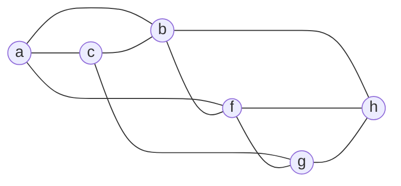

<!-- UGC NET Oct 2022 (8 Oct, Shift 1) · Paper 2 · generated by pyq_extract.py from 8_oct_2022.txt -->

## Q1
In a database, a rule is defined as (P1 and P2) or P3: R1 (0.8) and R2 (0.3), where P1, P2, P3 are premises and R1, R2 are conclusions of rules with certainty factors (CF) 0.8 and 0.3 respectively. If any running program has produced P1, P2, P3 with CF as 0.5, 0.8, 0.2 respectively, find the CF of results on the basis of premises.

## Q1 - Options
(A) CF (R1 = 0.8), CF (R2 = 0.3)
(B) CF (R1 = 0.40), CF (R2 = 0.15)
(C) CF (R1 = 0.15), CF (R2 = 0.35)
(D) CF (R1 = 0.8), CF (R2 = 0.35)

## Q1 - Hint
**Answer:** B
**Topic:** AI: Knowledge Representation, Planning & Expert Systems
**Source:** UGC NET Oct 2022 (8 Oct, Shift 1) · Paper 2 · Q1

Certainty factor rules combine premises before scaling by the rule's own CF.

For an AND premise, CF(P1 and P2) = min(CF(P1), CF(P2)) = min(0.5, 0.8) = 0.5 
For an OR premise, the combined premise strength is max(CF(P1 and P2), CF(P3)) = max(0.5, 0.2) = 0.5

Each conclusion then scales this combined premise CF by its own rule CF. 
CF(R1) = 0.5 × 0.8 = 0.40 
CF(R2) = 0.5 × 0.3 = 0.15

This gives CF(R1 = 0.40) and CF(R2 = 0.15).

## Q2
There are three boxes. First box has 2 white, 3 black and 4 red balls. Second box has 3 white, 2 black and 2 red balls. Third box has 4 white, 1 black and 3 red balls. A box is chosen at random and 2 balls are drawn out of which 1 is white, and 1 is red. What is the probability that the balls came from first box?

## Q2 - Options
(A) 0.237
(B) 0.723
(C) 0.18
(D) 0.452

## Q2 - Hint
**Answer:** A
**Topic:** Probability, Permutation & Combination
**Source:** UGC NET Oct 2022 (8 Oct, Shift 1) · Paper 2 · Q2

This is a Bayes' theorem problem. Each box is chosen with prior probability 1/3, and the likelihood of drawing exactly one white and one red ball is C(white,1) × C(red,1) / C(total,2) for each box.

Box 1 (9 balls): (2 × 4) / C(9,2) = 8/36 = 0.2222 
Box 2 (7 balls): (3 × 2) / C(7,2) = 6/21 = 0.2857 
Box 3 (8 balls): (4 × 3) / C(8,2) = 12/28 = 0.4286

P(box1 \| data) = P(data\|box1) / [P(data\|box1) + P(data\|box2) + P(data\|box3)] 
= 0.2222 / (0.2222 + 0.2857 + 0.4286) = 0.2222 / 0.9365 ≈ 0.237

Box 3 has the highest individual likelihood, which is why option D (0.452, a box-3-weighted figure) looks tempting, but Bayes' rule normalizes by the sum over all three boxes, giving box 1 a share of about 0.237.

## Q3
Consider a memory system having address spaced at a distance of m, T = Bank cycle time and n number of banks, then the average data access time per word access in synchronous organization is

## Q3 - Options
(A) t = { m·T/n for m &lt;&lt; n ; T for m &gt;&gt; n }
(B) t = { T/n for m &lt;&lt; n ; T for m &gt;&gt; n }
(C) t = { m·T for m &lt;&lt; n ; T for m &gt;&gt; n }
(D) t = { m·T for m &lt;&lt; n ; m/T for m &gt;&gt; n }

## Q3 - Hint
**Answer:** B
**Topic:** Memory Hierarchy, Cache & Access Time
**Source:** UGC NET Oct 2022 (8 Oct, Shift 1) · Paper 2 · Q3

In a low-order interleaved memory with n banks and bank cycle time T, the number of words requested (m) relative to n decides how much bank overlap is available.

When m &lt;&lt; n, there are far fewer requests than banks, so successive accesses pipeline almost fully across independent banks, giving an average access time per word of T/n. 
When m &gt;&gt; n, requests exceed the available banks, so each bank must be reused and the access time per word approaches the full bank cycle time T, since overlap can no longer hide the cycle time.

This gives t = T/n for m &lt;&lt; n and t = T for m &gt;&gt; n.

## Q4
For multiprocessor system, interconnection network – cross bar switch is an example of

## Q4 - Options
(A) Non blocking network
(B) Blocking network
(C) That varies from connection to connection
(D) Recurrent network

## Q4 - Hint
**Answer:** A
**Topic:** COA: Arithmetic, Microprogramming, I/O & Multiprocessors
**Source:** UGC NET Oct 2022 (8 Oct, Shift 1) · Paper 2 · Q4

A crossbar switch provides a dedicated path between every input and every output through a grid of switching points. Because any free input can always be connected to any free output without contention from other active connections, a crossbar is a non-blocking network by definition.

## Q5
The representation of 4 bit code 1101 into 7 bit, even parity Hamming code is

## Q5 - Options
(A) (1010101)
(B) (1111001)
(C) (1011101)
(D) (1110000)

## Q5 - Hint
**Answer:** A
**Topic:** Hamming Code, Error Detection & Bit Stuffing
**Source:** UGC NET Oct 2022 (8 Oct, Shift 1) · Paper 2 · Q5

Place data bits 1, 1, 0, 1 at positions 3, 5, 6, 7 and parity bits at positions 1, 2, 4 of a 7-bit codeword.

p1 covers positions 1, 3, 5, 7 (values 1, 1, 1) so p1 must be 1 to keep the group even p2 covers positions 2, 3, 6, 7 (values 1, 0, 1) so p2 must be 0 to keep the group even p4 covers positions 4, 5, 6, 7 (values 1, 0, 1) so p4 must be 0 to keep the group even

Reading positions 1 through 7 gives 1, 0, 1, 0, 1, 0, 1, which is 1010101.

## Q6
The number of gate inputs, required to realize expression A̅BC + A̅BCD + EF̅ + A̅D is

## Q6 - Options
(A) 12
(B) 13
(C) 14
(D) 15

## Q6 - Hint
**Answer:** D
**Topic:** K-Map, SOP & Boolean Laws
**Source:** UGC NET Oct 2022 (8 Oct, Shift 1) · Paper 2 · Q6

Count the literal inputs feeding each AND gate for the four product terms exactly as written, then add one input per term for the final OR gate.

A̅BC needs 3 literal inputs 
A̅BCD needs 4 literal inputs 
EF̅ needs 2 literal inputs 
A̅D needs 2 literal inputs

Total AND-gate inputs = 3 + 4 + 2 + 2 = 11 
The OR gate combining the 4 product terms needs 4 inputs

Total gate inputs = 11 + 4 = 15.

## Q7
Consider a logic gate circuit, with 8 input lines (D0, D1, ….. D7) and 3 output lines (A0, A1, A2) specified by following operations 
A2 = D4 + D5 + D6 + D7 
A1 = D2 + D3 + D6 + D7 
A0 = D1 + D3 + D5 + D0 
Where + indicates logical OR operation. This circuit is

## Q7 - Options
(A) 8 × 8 multiplexer
(B) Decimal to BCD converter
(C) Octal to Binary encoder
(D) Priority encoder

## Q7 - Hint
**Answer:** C
**Topic:** Combinational/Sequential Circuits, Flip-Flops & Number Systems
**Source:** UGC NET Oct 2022 (8 Oct, Shift 1) · Paper 2 · Q7

Each output bit is simply the OR of the input lines whose index has that bit set, which is exactly the standard 8-to-3 (octal to binary) encoder construction: A2 is 1 for D4 through D7 (bit 2 set), A1 is 1 whenever bit 1 of the active line is set, and A0 is 1 whenever bit 0 of the active line is set.

A priority encoder would need extra logic to resolve which input wins when more than one line is active simultaneously, and none of that priority-resolution logic appears here, so the equations describe a plain octal-to-binary encoder rather than a priority encoder or a multiplexer.

## Q8
The total storage capacity of a floppy disk having 80 tracks and storing 128 bytes/sector is 163,840 bytes. How many sectors does this disk have?

## Q8 - Options
(A) 27
(B) 2048
(C) 4K
(D) 16

## Q8 - Hint
**Answer:** D
**Topic:** Disk Scheduling, File Systems & RAID
**Source:** UGC NET Oct 2022 (8 Oct, Shift 1) · Paper 2 · Q8

Total capacity equals tracks × sectors per track × bytes per sector.

Sectors per track = 163,840 / (80 × 128) = 163,840 / 10,240 = 16

The question's own numbers only resolve consistently for sectors per track, since 80 tracks × 16 sectors per track × 128 bytes = 163,840 bytes matches the given capacity exactly.

## Q9
In a cache memory, if address has 9 bits in Tag field and 12 bits in index field, the size of main memory and cache memory would be respectively

## Q9 - Options
(A) 2 K, 4 K
(B) 1024 K, 2 K
(C) 4 K, 2048 K
(D) 2048 K, 4 K

## Q9 - Hint
**Answer:** D
**Topic:** Memory Hierarchy, Cache & Access Time
**Source:** UGC NET Oct 2022 (8 Oct, Shift 1) · Paper 2 · Q9

With no separate block-offset field, the index field directly addresses cache lines and the tag plus index together address main memory words.

Main memory size = 2^(tag bits + index bits) = 2^(9+12) = 2^21 words = 2048 K 
Cache memory size = 2^(index bits) = 2^12 words = 4 K

So main memory is 2048 K and cache memory is 4 K.

## Q10
Consider the primal problem: 
Maximize z = 5x₁ + 12x₂ + 4x₃ 
Subject to x₁ + 2x₂ + x₃ = 10 
2x₁ − x₂ + 3x₃ = 8 x₁, x₂, x₃ ≥ 0 its dual problem is 
Minimize w = 10y₁ + 8y₂ 
Subject to y₁ + 2y₂ ≥ 5 
2y₁ − y₂ ≥ 12 y₁ + 3y₂ ≥ 4 
Which of the following is correct?

## Q10 - Options
(A) y₁ ≥ 0, y₂ unrestricted
(B) y₁ ≥ 0, y₂ ≥ 0
(C) y₁ is unrestricted, y₂ ≥ 0
(D) y₁ is unrestricted, y₂ restricted

## Q10 - Hint
**Answer:** C
**Topic:** Linear Programming & Transportation Problem
**Source:** UGC NET Oct 2022 (8 Oct, Shift 1) · Paper 2 · Q10

By the standard primal-dual sign rule, a dual variable's restriction is set by its matching primal constraint's type. Both primal constraints here are equalities, so by that rule both y1 and y2 should be unrestricted in sign, since an equality constraint in the primal corresponds to a free (unrestricted) dual variable rather than a sign-restricted one.

None of the four listed options states that both y1 and y2 are unrestricted, so this item cannot be answered with full confidence against the printed choices. Option C is kept as the closest listed choice pending a human check against the official source, since it is the only option that lets y1 (the variable tied to the first equality constraint) stay unrestricted.

## Q11
The logic expression (P̅ ∧ Q) ∨ (P ∧ Q̅) ∨ (P ∧ Q) is equivalent to

## Q11 - Options
(A) P̅ ∨ Q
(B) P ∨ Q̅
(C) P ∨ Q
(D) P̅ ∨ Q̅

## Q11 - Hint
**Answer:** C
**Topic:** Propositional & Predicate Logic
**Source:** UGC NET Oct 2022 (8 Oct, Shift 1) · Paper 2 · Q11

Group the last two terms first.

(P ∧ Q̅) ∨ (P ∧ Q) = P ∧ (Q̅ ∨ Q) = P

The expression reduces to (P̅ ∧ Q) ∨ P, and by the absorption law P ∨ (P̅ ∧ Q) = P ∨ Q.

So the full expression is equivalent to P ∨ Q.

## Q12
The reduced grammar equivalent to the grammar, whose production rules are given below, is 
S → AB \| CA 
B → BC \| AB 
A → a 
C → aB \| b

## Q12 - Options
(A) S → CA, A → a, C → b
(B) S → CA \| B, B → BC \| B, A → a, C → aB \| b
(C) S → CA \| B, B → BC, A → a, C → aB \| b
(D) S → AB \| AC, B → BC \| BA, A → a, C → aB \| b

## Q12 - Hint
**Answer:** A
**Topic:** Chomsky Hierarchy, Grammars & CNF/GNF
**Source:** UGC NET Oct 2022 (8 Oct, Shift 1) · Paper 2 · Q12

First remove non-generating symbols, those that can never derive a terminal string.

Every production for B is B → BC or B → AB, and both alternatives still contain B itself, so B can never bottom out in a terminal string. B is non-generating and must be removed, along with every production that mentions it.

Removing B eliminates S → AB and C → aB, leaving S → CA and C → b as the only survivors alongside A → a.

Checking reachability from S confirms every remaining symbol (A, C) and the terminals they produce are reachable, so no further symbols are removed.

The reduced grammar is S → CA, A → a, C → b.

## Q13
Consider the production rules of grammer G: 
S → AbB 
A → aAb \| λ 
B → bB \| λ 
Which of the following language L is generated by grammer G?

## Q13 - Options
(A) L = {aⁿbᵐ : n ≥ 0, m &gt; n}
(B) L = {aⁿbᵐ : n ≥ 0, m ≥ 0}
(C) L = {aⁿbᵐ : n ≥ m}
(D) L = {aⁿbᵐ : n ≥ m, m &gt; 0}

## Q13 - Hint
**Answer:** A
**Topic:** Chomsky Hierarchy, Grammars & CNF/GNF
**Source:** UGC NET Oct 2022 (8 Oct, Shift 1) · Paper 2 · Q13

A → aAb \| λ generates exactly n matched a's followed by n b's, that is aⁿbⁿ, for any n ≥ 0.

B → bB \| λ independently generates any number of extra trailing b's, say k ≥ 0.

Since S → A b B, the full derivation is (aⁿbⁿ) followed by one fixed b from the rule itself, followed by bᵏ from B, giving aⁿ b^(n+1+k).

The total power of b is n + 1 + k, which is always at least n + 1, so it is always strictly greater than n regardless of k.

This matches L = {aⁿbᵐ : n ≥ 0, m &gt; n}.

## Q14
Consider the language L = {aⁿbᵐ : n ≥ 4, m ≤ 3}. Which of the following regular expression represents language L?

## Q14 - Options
(A) aaaa\*(λ + b + bb + bbb)
(B) aaaaa\*(b + bb + bbb)
(C) aaaaa\*(λ + b + bb + bbb)
(D) aaaa\*(b + bb + bbb)

## Q14 - Hint
**Answer:** C
**Topic:** Finite Automata, Regular Languages & DFA Minimization
**Source:** UGC NET Oct 2022 (8 Oct, Shift 1) · Paper 2 · Q14

The a-part must represent n ≥ 4 a's, and the b-part must represent 0 to 3 b's.

aaaaa\* is four fixed a's followed by a-star on the fifth, so it matches a⁴, a⁵, a⁶, ... which is exactly n ≥ 4. aaaa\* only fixes three a's before the star, matching n ≥ 3, which is one too few.

(λ + b + bb + bbb) covers m = 0, 1, 2, and 3. Dropping the λ term, as in (b + bb + bbb), would exclude the valid case m = 0.

Only aaaaa\*(λ + b + bb + bbb) gets both the a-count and the full 0–3 range of b's correct.

## Q15
Consider L = {ab, aa, baa}. Which of the following string is NOT in L\*?

## Q15 - Options
(A) baaaaabaaaaa
(B) abaabaaabaa
(C) aaaabaaaa
(D) baaaaabaa

## Q15 - Hint
**Answer:** A
**Topic:** Finite Automata, Regular Languages & DFA Minimization
**Source:** UGC NET Oct 2022 (8 Oct, Shift 1) · Paper 2 · Q15

Try to tile each string using only the blocks ab, aa, and baa.

For baaaaabaaaaa, since only baa starts with b, the first block is forced to be baa, leaving aaabaaaaa. The next block must be aa (positions 4–5), leaving abaaaaa, whose only fit is ab (positions 6–7), leaving a plain run of 5 a's. A run of a's can only be tiled by aa blocks, and 5 is odd, so this string cannot be fully tiled and is not in L\*.

By contrast, baaaaabaa splits cleanly as baa + aa + ab + aa, abaabaaabaa splits as ab + aa + baa + ab + aa, and aaaabaaaa splits as aa + aa + baa + aa, so B, C, and D are all in L\*.

## Q16
Consider the following NPDA = ({q₀, q₁, qf}, {a,b}, {1,z}, δ, q₀, z, {qf}) 
δ(q₀, λ, z) = {(q₁, z)} δ(q₀, a, z) = {(q₁, 11z)} δ(q₁, a, 1) = {(q₁, 111)} δ(q₁, b, 1) = {(q₁, λ)} δ(q₁, λ, z) = {(qf, z)} 
Which of the following Language L is accepted by NPDA?

## Q16 - Options
(A) L = {a²ⁿbⁿ : n ≥ 0}
(B) L = {aⁿb²ⁿ : n ≥ 0}
(C) L = {a²ⁿbⁿ : n &gt; 0}
(D) L = {aⁿb²ⁿ : n &gt; 0}

## Q16 - Hint
**Answer:** B
**Topic:** CFL, PDA, Pumping Lemma & Closure Properties
**Source:** UGC NET Oct 2022 (8 Oct, Shift 1) · Paper 2 · Q16

Trace the stack contents. Reading the first a replaces z with 11z, pushing 2 ones. Each further a replaces one 1 on top with 111, a net gain of 2 ones per a. So after reading n a's, the stack holds exactly 2n ones above z.

Each b then pops exactly one 1 from the stack. Acceptance happens only when a λ-move sees z on top, which requires all 2n ones to have been popped first, so the number of b's read must equal 2n.

This gives the language {aⁿb²ⁿ}. The empty string is also accepted directly through δ(q₀, λ, z) → δ(q₁, λ, z) → qf without reading any symbol, so n = 0 is included.

The language is L = {aⁿb²ⁿ : n ≥ 0}.

## Q17
Hidden surface removal problem with minimal 3D pipeline can be solved with

## Q17 - Options
(A) Painter's algorithm
(B) Window Clipping algorithm
(C) Brute force rasterization algorithm
(D) Flood fill algorithm

## Q17 - Hint
**Answer:** A
**Topic:** Computer Graphics: Display, Algorithms & 3D
**Source:** UGC NET Oct 2022 (8 Oct, Shift 1) · Paper 2 · Q17

Painter's algorithm removes hidden surfaces with minimal extra pipeline machinery by simply depth-sorting polygons from farthest to nearest and drawing them in that order, so nearer surfaces naturally overwrite farther ones on the frame buffer.

Window clipping only restricts geometry to the viewport and does not resolve visibility, brute-force rasterization scan-converts polygons without any depth logic of its own, and flood fill is a region-filling technique unrelated to depth or visibility at all.

## Q18
Using 'RSA' algorithm, if p = 13, q = 5 and e = 7, the value of d and cipher value of '6' with (e, n) key are

## Q18 - Options
(A) 7, 4
(B) 7, 1
(C) 7, 46
(D) 55, 1

## Q18 - Hint
**Answer:** C
**Topic:** Network Security & Cryptography
**Source:** UGC NET Oct 2022 (8 Oct, Shift 1) · Paper 2 · Q18

n = p × q = 65, and φ(n) = (p−1)(q−1) = 12 × 4 = 48.

Find d such that e·d ≡ 1 (mod φ(n)): 7 × 7 = 49 ≡ 1 (mod 48), so d = 7.

Encrypt message 6 as C = 6^e mod n = 6^7 mod 65. 
Step through powers mod 65: 6² = 36, 6³ = 21, 6⁴ = 61, 6⁵ = 41, 6⁶ = 51, 6⁷ = 46

So d = 7 and the cipher value of 6 is 46.

## Q19
The condition num != 65 cannot be replaced by

## Q19 - Options
(A) num &gt; 65 \|\| num &lt; 65
(B) !(num == 65)
(C) num − 65
(D) !(num = 65)

## Q19 - Hint
**Answer:** D
**Topic:** Programming Output, Pointers, OOP & Data Types
**Source:** UGC NET Oct 2022 (8 Oct, Shift 1) · Paper 2 · Q19

- **A. num &gt; 65 \|\| num &lt; 65** — equivalent, num is not 65 exactly when it is either greater or smaller than 65.
- **B. !(num == 65)** — equivalent, this is the direct logical negation of equality.
- **C. num − 65** — equivalent as a truth value, since this expression is nonzero (treated as true in C) precisely when num is not 65, and zero (false) only when num equals 65.
- **D. !(num = 65)** — not equivalent. The single `=` is an assignment, not a comparison, so this always assigns 65 to num first. The expression `(num = 65)` then evaluates to 65, which is truthy, so `!(num = 65)` is always false and it also destructively overwrites num's original value, unlike `num != 65`.

## Q20
Pointers cannot be used to

## Q20 - Options
(A) find the address of a variable in memory
(B) reference value directly
(C) simulate call by reference
(D) manipulate dynamic data structure

## Q20 - Hint
**Answer:** B
**Topic:** Programming Output, Pointers, OOP & Data Types
**Source:** UGC NET Oct 2022 (8 Oct, Shift 1) · Paper 2 · Q20

A pointer's entire purpose is indirect access, it stores an address and reaches a value only by dereferencing through that address. Referencing a value directly is what an ordinary variable does, not what a pointer does, so pointers cannot be used to reference a value directly.

Pointers do find a variable's address (via the address-of operator), do simulate call by reference (by passing an address for the callee to dereference), and do manipulate dynamic data structures such as linked lists and trees.

## Q21
Which mechanism in XML allows organizations to specify globally unique names as element tags in documents?

## Q21 - Options
(A) root
(B) header
(C) schema
(D) namespace

## Q21 - Hint
**Answer:** D
**Topic:** Web Programming (HTML, XML, Java, Servlets)
**Source:** UGC NET Oct 2022 (8 Oct, Shift 1) · Paper 2 · Q21

An XML namespace binds a URI to a prefix, and that URI guarantees the element and attribute names using that prefix are globally unique even when documents from different organizations reuse the same tag names, avoiding naming collisions when documents are combined.

## Q22
If an operating system does not allow a child process to exist when the parent process has been terminated, this phenomenon is called as -

## Q22 - Options
(A) Threading
(B) Cascading termination
(C) Zombie termination
(D) Process killing

## Q22 - Hint
**Answer:** B
**Topic:** Process Management, IPC, Semaphores & Threads
**Source:** UGC NET Oct 2022 (8 Oct, Shift 1) · Paper 2 · Q22

When an operating system's policy forces every child process to be terminated as soon as its parent terminates, so that termination propagates down the process tree, this is called cascading termination. It is a deliberate OS design choice, not the same as a zombie process, which is a terminated process whose exit status has not yet been collected by its parent.

## Q23
What is called Journalling in Linux operating system?

## Q23 - Options
(A) Process scheduling
(B) File saving as transaction
(C) A type of thread
(D) An editor

## Q23 - Hint
**Answer:** B
**Topic:** Disk Scheduling, File Systems & RAID
**Source:** UGC NET Oct 2022 (8 Oct, Shift 1) · Paper 2 · Q23

A journaling file system logs pending file system changes as transactions in a journal before committing them to the main structures. If the system crashes mid-write, the journal lets it replay or discard the incomplete transaction on recovery, keeping the file system consistent. This is why journaling is described as saving file changes as transactions.

## Q24
This transformation is called 
[x̅ y̅ z̅ w̅]ᵀ = [[a₁ b₁ c₁ d₁],[a₂ b₂ c₂ d₂],[a₃ b₃ c₃ d₃],[e f g h]] [x y z 1]ᵀ

## Q24 - Options
(A) Scaling
(B) Shear
(C) Homography
(D) Steganography

## Q24 - Hint
**Answer:** C
**Topic:** 2D Transformations, Reflection, Projection & Clipping
**Source:** UGC NET Oct 2022 (8 Oct, Shift 1) · Paper 2 · Q24

In a standard affine transform such as scaling or shear, the bottom row of the 4×4 homogeneous matrix is fixed at [0 0 0 1], leaving the homogeneous coordinate w unchanged. Here the bottom row is the general [e f g h], which lets w vary with x, y, and z, producing perspective-style division effects on the transformed coordinates.

This general projective (perspective-capable) form of a homogeneous coordinate transform is called a homography, distinguishing it from simpler affine operations like pure scaling or shear.

## Q25
RAD software process model stands for

## Q25 - Options
(A) Rapid Application Development
(B) Relative Application Development
(C) Rapid Application Design
(D) Recent Application Development

## Q25 - Hint
**Answer:** A
**Topic:** SDLC Models & Requirements (SRS)
**Source:** UGC NET Oct 2022 (8 Oct, Shift 1) · Paper 2 · Q25

RAD stands for Rapid Application Development, a process model that emphasizes a very short development cycle using component-based construction, typically completing a working system in 60 to 90 days.

## Q26
If every requirement can be checked by a cost – effective process, then SRS is called

## Q26 - Options
(A) Verifiable
(B) Tracable
(C) Modifiable
(D) Complete

## Q26 - Hint
**Answer:** A
**Topic:** SDLC Models & Requirements (SRS)
**Source:** UGC NET Oct 2022 (8 Oct, Shift 1) · Paper 2 · Q26

An SRS is verifiable when every stated requirement can be checked by a finite, cost-effective process, such as a test, inspection, or demonstration, to confirm the software actually satisfies it. Traceability is about linking requirements to their origin and to downstream artifacts, and completeness is about covering all needed functions, neither of which is about checkability at reasonable cost.

## Q27
Fault base testing technique is

## Q27 - Options
(A) Unit testing
(B) Beta testing
(C) Stress testing
(D) Mutation testing

## Q27 - Hint
**Answer:** D
**Topic:** Software Testing, V&V & Quality (CMM)
**Source:** UGC NET Oct 2022 (8 Oct, Shift 1) · Paper 2 · Q27

Mutation testing deliberately seeds known faults (mutations) into a program and checks whether the existing test suite detects them, making it the classic fault-based testing technique. Unit, beta, and stress testing are organized around testing scope, release stage, and load conditions rather than around deliberately injected faults.

## Q28
Alpha and Beta testing are forms of

## Q28 - Options
(A) White – Box Testing
(B) Black – Box Testing
(C) Acceptance Testing
(D) System Testing

## Q28 - Hint
**Answer:** C
**Topic:** Software Testing, V&V & Quality (CMM)
**Source:** UGC NET Oct 2022 (8 Oct, Shift 1) · Paper 2 · Q28

Alpha testing happens at the developer's site with actual customers, and beta testing happens at customer sites with real end users, both aiming to gather user feedback before final release. This customer-facing validation makes them forms of acceptance testing rather than a testing style defined by code visibility (white/black box) or by scope (system testing).

## Q29
The process to gather the software requirements from client, analyze and document is known as:-

## Q29 - Options
(A) Software Engineering Process
(B) User Engineering Process
(C) Requirement Elicitation Process
(D) Requirement Engineering Process

## Q29 - Hint
**Answer:** D
**Topic:** SDLC Models & Requirements (SRS)
**Source:** UGC NET Oct 2022 (8 Oct, Shift 1) · Paper 2 · Q29

Elicitation is only the gathering step, but this question describes three activities together, gathering, analyzing, and documenting, which together define the broader Requirement Engineering Process. Requirement Engineering encompasses elicitation, analysis, specification, and validation, so it is the correct name for the combined activity described here rather than elicitation alone.

## Q30
Size and complexity are a part of

## Q30 - Options
(A) People Metrics
(B) Project Metrics
(C) Process Metrics
(D) Product Metrics

## Q30 - Hint
**Answer:** D
**Topic:** COCOMO, Project Management & Risk
**Source:** UGC NET Oct 2022 (8 Oct, Shift 1) · Paper 2 · Q30

Product metrics characterize attributes of the software product itself, such as its size, complexity, design features, performance, and quality. Size and complexity describe the delivered artifact, not the people, project schedule, or the process used to build it, so they belong under product metrics.

## Q31
Which Metrics are derived by normalizing quality and/or productivity measures by considering the size of the software that has been produced?

## Q31 - Options
(A) Function – Oriented Metrics
(B) Function – Point Metrics
(C) Line of Code Metrics
(D) Size Oriented Metrics

## Q31 - Hint
**Answer:** D
**Topic:** COCOMO, Project Management & Risk
**Source:** UGC NET Oct 2022 (8 Oct, Shift 1) · Paper 2 · Q31

Size-oriented metrics normalize quality and productivity measures, such as errors found or cost incurred, against a size measure of the delivered software, most commonly lines of code (KLOC). Function-point metrics normalize instead against a size measure derived from information domain values rather than software size directly, which is why the size-normalized family described here is called size-oriented metrics.

## Q32
The model in which the requirements are implemented by its category is

## Q32 - Options
(A) Evolutionary Development Model
(B) Waterfall Model
(C) Prototyping Model
(D) Iterative Enhancement Model

## Q32 - Hint
**Answer:** D
**Topic:** SDLC Models & Requirements (SRS)
**Source:** UGC NET Oct 2022 (8 Oct, Shift 1) · Paper 2 · Q32

The Iterative Enhancement Model groups requirements into categories and implements the software in successive increments, each iteration adding one category's worth of functionality on top of what was already built. Evolutionary development instead grows a working system through repeated prototypes shaped by user feedback rather than pre-grouped requirement categories, and the waterfall and prototyping models build the whole requirement set in one linear pass or one exploratory prototype respectively.

## Q33
Which of the following is an indirect measure of product?

## Q33 - Options
(A) Quality
(B) Complexity
(C) Reliability
(D) All of these

## Q33 - Hint
**Answer:** D
**Topic:** COCOMO, Project Management & Risk
**Source:** UGC NET Oct 2022 (8 Oct, Shift 1) · Paper 2 · Q33

Direct measures capture something countable straight from the product, such as lines of code, execution speed, or memory size. Quality, complexity, and reliability cannot be counted directly, they are each derived from combinations of direct measures, which is exactly what makes all three indirect measures of the product.

## Q34
Modules X and Y operate on the same input and output, then the cohesion is

## Q34 - Options
(A) Logical cohesion
(B) Sequential cohesion
(C) Procedural cohesion
(D) Communicational cohesion

## Q34 - Hint
**Answer:** D
**Topic:** SE: Design, UML, Configuration Management & Reuse
**Source:** UGC NET Oct 2022 (8 Oct, Shift 1) · Paper 2 · Q34

Communicational cohesion is defined precisely as elements of a module operating on the same input data and/or producing the same output data, which is exactly the relationship described between X and Y. Sequential cohesion instead requires the output of one element to feed directly into the next, and procedural cohesion requires elements to follow a specific execution order without necessarily sharing data.

## Q35
Which mode is a block cipher implementation as a self synchronizing stream cipher?

## Q35 - Options
(A) Cipher Block Chaining Mode
(B) Cipher Feedback Mode
(C) Electronic Codebook Mode
(D) Output Feedback Mode

## Q35 - Hint
**Answer:** B
**Topic:** Network Security & Cryptography
**Source:** UGC NET Oct 2022 (8 Oct, Shift 1) · Paper 2 · Q35

In Cipher Feedback (CFB) mode, previously transmitted ciphertext is fed back into the encryption shift register to generate the next keystream, so the decryption side automatically resynchronizes once enough correct ciphertext bits have shifted through, which is why CFB is called self-synchronizing. Output Feedback (OFB) mode instead feeds back the cipher's own output rather than the ciphertext, so a lost bit is never recovered and OFB is a synchronous, not self-synchronizing, stream cipher.

## Q36
Which one is a connectionless transport – layer protocol that belongs to the Internet protocol family?

## Q36 - Options
(A) Transmission Control Protocol (TCP)
(B) User Datagram Protocol (UDP)
(C) Routing Protocol (RP)
(D) Datagram Control Protocol (DCP)

## Q36 - Hint
**Answer:** B
**Topic:** TCP/IP, TCP & UDP Protocols and Headers
**Source:** UGC NET Oct 2022 (8 Oct, Shift 1) · Paper 2 · Q36

UDP sends independent datagrams without establishing a connection or tracking session state, making it the connectionless transport-layer protocol in the TCP/IP suite. TCP is connection-oriented, and the other two listed names are not real Internet protocol family transport-layer protocols.

## Q37
Consider an error free 64 kbps satellite channel used to send 512 byte data frames in one direction with very short acknowledgements coming back the other way. What is the maximum throughput for window size of 15?

## Q37 - Options
(A) 32 kbps
(B) 48 kbps
(C) 64 kbps
(D) 70 kbps

## Q37 - Hint
**Answer:** C
**Topic:** Propagation Delay, Bit Rate & Channel Throughput
**Source:** UGC NET Oct 2022 (8 Oct, Shift 1) · Paper 2 · Q37

This is a sliding-window pipelining problem using the standard textbook values for a geostationary satellite link, a one-way propagation delay of 270 ms.

Frame transmission time Tf = (512 × 8 bits) / 64,000 bps = 64 ms 
Round-trip time = 2 × 270 ms = 540 ms 
A window of size w keeps the channel fully busy once w × Tf ≥ Tf + RTT, that is once w ≥ (64 + 540) / 64 ≈ 9.4

Since the given window of 15 already exceeds this threshold, the sender never has to stall waiting for acknowledgements, so the link runs at its full rated capacity.

Maximum throughput = 64 kbps.

## Q38
A classless address is given as 167.199.170.82/27. The number of addresses in the network is

## Q38 - Options
(A) 64 addresses
(B) 32 addresses
(C) 28 addresses
(D) 30 addresses

## Q38 - Hint
**Answer:** B
**Topic:** Subnetting & IP Addressing
**Source:** UGC NET Oct 2022 (8 Oct, Shift 1) · Paper 2 · Q38

A /27 prefix leaves 32 − 27 = 5 host bits.

Number of addresses = 2^5 = 32

This counts every address in the block, including the network and broadcast addresses, so the total number of addresses in the network is 32.

## Q39
Which layer divides each message into packets at the source and re-assembles them at the destination?

## Q39 - Options
(A) Network layer
(B) Transport layer
(C) Data link layer
(D) Physical layer

## Q39 - Hint
**Answer:** A
**Topic:** OSI Model & Layer Responsibilities
**Source:** UGC NET Oct 2022 (8 Oct, Shift 1) · Paper 2 · Q39

The network layer is responsible for routing individual packets end to end, and in the classic layer-function description it is the layer that divides an outgoing message into packets at the source and reassembles the incoming packets back into the original message at the destination. The data link layer instead frames and error-checks data over one physical hop, and the physical layer only converts bits into electrical or optical signals.

## Q40
A 4-stage pipeline has the stage delay as 150,120,160 and 140 ns respectively. Registers that are used between the stages have delay of 5 ns. Assuming constant locking rate, the total time required to process 1000 data items on this pipeline is

## Q40 - Options
(A) 160.5 ms
(B) 165.5 ms
(C) 120.5 ms
(D) 590.5 ms

## Q40 - Hint
**Answer:** B
**Topic:** Pipelining & Amdahl's Law
**Source:** UGC NET Oct 2022 (8 Oct, Shift 1) · Paper 2 · Q40

The pipeline clock period is set by the slowest stage delay plus the register delay.

Clock period = max(150, 120, 160, 140) + 5 = 165 ns

For k = 4 pipeline stages processing n = 1000 items, the number of clock cycles needed is k + (n − 1) = 4 + 999 = 1003.

Total time = 1003 × 165 ns = 165,495 ns = 165.495 μs

The answer choices are labeled ms but the intended unit is μs. Read against them, this value rounds to 165.5, matching option B.

## Q41
Which of the following is correct for the destination address 4A : 30 : 10 : 21 : 10 : 1A?

## Q41 - Options
(A) unicast address
(B) multicast address
(C) broadcast address
(D) unicast and broadcast address

## Q41 - Hint
**Answer:** A
**Topic:** MAC Layer, CSMA/CD, Collision Resolution & Piggybacking
**Source:** UGC NET Oct 2022 (8 Oct, Shift 1) · Paper 2 · Q41

The least significant bit of a MAC address's first byte is the individual/group (I/G) bit, a 0 means unicast and a 1 means multicast or broadcast.

4A in binary is 0100 1010

Its last bit is 0, so this address is a unicast address, not a multicast or broadcast address.

## Q42
Assume that f(n) and g(n) are asymptotically positive. Which of the following is correct?

## Q42 - Options
(A) f(n)=O(g(n)) and g(n)=O(h(n)) ⇒ f(n)=ω(h(n))
(B) f(n)=Ω(g(n)) and g(n)=Ω(h(n)) ⇒ f(n)=O(h(n))
(C) f(n)=o(g(n)) and g(n)=o(h(n)) ⇒ f(n)=o(h(n))
(D) f(n)=ω(g(n)) and g(n)=ω(h(n)) ⇒ f(n)=Ω(h(n))

## Q42 - Hint
**Answer:** C
**Topic:** Time Complexity, Asymptotic Notation & Recurrences
**Source:** UGC NET Oct 2022 (8 Oct, Shift 1) · Paper 2 · Q42

Little-o is transitive in the exact sense stated. If f(n) = o(g(n)) and g(n) = o(h(n)), then f(n) grows strictly slower than g(n), which in turn grows strictly slower than h(n), so f(n) must also grow strictly slower than h(n), giving f(n) = o(h(n)).

- **A. O∘O ⇒ ω** — wrong direction. Composing two upper-bound (O) relations should yield another upper bound O(h(n)), not the strict lower-bound claim ω(h(n)).
- **B. Ω∘Ω ⇒ O** — wrong direction. Composing two lower-bound (Ω) relations should yield another lower bound Ω(h(n)), not the opposite upper-bound claim O(h(n)).
- **C. o∘o ⇒ o** — correct. This matches the standard transitive closure of the strict little-o relation.
- **D. ω∘ω ⇒ Ω** — imprecise. Composing two strict lower-bound (ω) relations should yield the matching strict bound ω(h(n)), not the weaker Ω(h(n)) claim, so this does not state the standard identity being tested.

## Q43
The solution of the recurrence relation T(n) = 3T(n/4) + n lg n is

## Q43 - Options
(A) θ(n² lg n)
(B) θ(n lg n)
(C) θ(n lg n)²
(D) θ(n lg lg n)

## Q43 - Hint
**Answer:** B
**Topic:** Time Complexity, Asymptotic Notation & Recurrences
**Source:** UGC NET Oct 2022 (8 Oct, Shift 1) · Paper 2 · Q43

Apply the master theorem with a = 3, b = 4, and f(n) = n lg n.

n^(log_b a) = n^(log₄3) ≈ n^0.792

Since f(n) = n lg n grows polynomially faster than n^0.792 (the exponent 1 already exceeds 0.792, so the extra lg n factor only helps), this falls under Master Theorem Case 3, and the regularity condition a·f(n/b) ≤ c·f(n) holds for a suitable c &lt; 1.

So T(n) = θ(f(n)) = θ(n lg n).

## Q44
The number of nodes of height h in any n-element heap is atmost:

## Q44 - Options
(A) n / 2^(h+1)
(B) n / 2^(h−1)
(C) n / 2^h
(D) (n−1) / 2^(h−1)

## Q44 - Hint
**Answer:** A
**Topic:** Trees: BST, AVL & Heaps
**Source:** UGC NET Oct 2022 (8 Oct, Shift 1) · Paper 2 · Q44

In a binary heap stored as a nearly-complete binary tree, the standard bound states that the number of nodes at height h is at most ⌈n / 2^(h+1)⌉, since each level roughly halves the count of nodes above it and height-h nodes sit h levels above the leaves. This matches option A, n / 2^(h+1).

## Q45
Consider a B-tree of height h, minimum degree t ≥ 2 that contains any n-key, where n ≥ 1. Which of the following is correct?

## Q45 - Options
(A) h ≥ log ((n+1)/2) ₜ
(B) h ≤ log ((n+1)/2) ₜ
(C) h ≥ log ((n−1)/2) ₜ
(D) h ≤ log ((n−1)/2) ₜ

## Q45 - Hint
**Answer:** B
**Topic:** Trees: BST, AVL & Heaps
**Source:** UGC NET Oct 2022 (8 Oct, Shift 1) · Paper 2 · Q45

For a B-tree of minimum degree t holding n keys, the standard height bound (derived from the minimum number of keys a tree of height h must hold once every non-root node is at its minimum fill) gives

h ≤ log_t((n+1)/2)

This is the upper bound on height guaranteed by the B-tree's minimum branching factor, matching option B.

## Q46
Which of the following algorithm design approach is used in Quick sort algorithm?

## Q46 - Options
(A) Dynamic programming
(B) Back Tracking
(C) Divide and conquer
(D) Greedy approach

## Q46 - Hint
**Answer:** C
**Topic:** Sorting Algorithms & Sorting Complexity
**Source:** UGC NET Oct 2022 (8 Oct, Shift 1) · Paper 2 · Q46

Quicksort partitions the array around a pivot and then recursively sorts the two resulting sub-arrays independently, which is exactly the divide, conquer, and combine pattern of a divide and conquer algorithm.

## Q47
Consider the hash table of size 11 that uses open addressing with linear probing. Let h(k)=k mod 11 be the hash function. A sequence of records with keys 43, 36, 92, 87, 11, 47, 11, 13, 14 is inserted into an initially empty hash table, the bins of which are indexed from 0 to 10. What is the index of the bin into which the last record is inserted?

## Q47 - Options
(A) 8
(B) 7
(C) 10
(D) 4

## Q47 - Hint
**Answer:** B
**Topic:** Hashing, Stacks, Queues & Linked Lists
**Source:** UGC NET Oct 2022 (8 Oct, Shift 1) · Paper 2 · Q47

Insert each key with h(k) = k mod 11 and linear probing on collision.

43 → 10 (empty) 
36 → 3 (empty) 
92 → 4 (empty) 
87 → 10 occupied → 0 (empty) 
11 → 0 occupied → 1 (empty) 
47 → 3 occupied → 4 occupied → 5 (empty) 
11 → 0 occupied → 1 occupied → 2 (empty) 
13 → 2 occupied → 3 occupied → 4 occupied → 5 occupied → 6 (empty) 
14 → 3 occupied → 4 occupied → 5 occupied → 6 occupied → 7 (empty)

The last record, 14, lands in bin 7.

## Q48
Consider the traversal of a tree 
Preorder → ABCEIFJDGHKL 
Inorder → EICFJBGDKHLA 
Which of the following is correct post order traversal?

## Q48 - Options
(A) EIFJCKGLHDBA
(B) FCGKLHDBUAE
(C) FCGKLHDBAEIJ
(D) IEJFCGKLHDBA

## Q48 - Hint
**Answer:** D
**Topic:** Trees: BST, AVL & Heaps
**Source:** UGC NET Oct 2022 (8 Oct, Shift 1) · Paper 2 · Q48

Rebuild the tree recursively from preorder and inorder. A is the root since it is the first preorder symbol, and since A is the very last symbol in the inorder sequence, A has no right subtree, everything else falls under its left child B.

Splitting B's inorder region (EICFJBGDKHL) around B gives a left part EICFJ and a right part GDKHL, matching the next preorder symbols C,E,I,F,J for the left and D,G,H,K,L for the right.

Working through each smaller region the same way places C with left child E (E has right child I) and right child F (F has right child J), and places D with left child G and right child H (H has left child K and right child L).

Walking this reconstructed tree in left, right, root order gives

I, E, J, F, C, G, K, L, H, D, B, A

which is IEJFCGKLHDBA.

## Q49
How many rotations are required during the construction of an AVL tree if the following elements are to be added in the given sequence? 
35, 50, 40, 25, 30, 60, 78, 20, 28

## Q49 - Options
(A) 2 left rotations, 2 right rotations
(B) 2 left rotations, 3 right rotations
(C) 3 left rotations, 2 right rotations
(D) 3 left rotations, 1 right rotation

## Q49 - Hint
**Answer:** C
**Topic:** Trees: BST, AVL & Heaps
**Source:** UGC NET Oct 2022 (8 Oct, Shift 1) · Paper 2 · Q49

Insert each key and rebalance as soon as any node's balance factor exceeds 1.

Inserting 40 after 35, 50 creates a Right-Left imbalance at 35, fixed with a right rotation at 50 followed by a left rotation at 35 (40 becomes the new subtree root).

Inserting 30 after 25 creates a Left-Right imbalance at 35 (now under 40), fixed with a left rotation at 25 followed by a right rotation at 35 (30 becomes the new subtree root).

Inserting 78 after 60 creates a Right-Right imbalance at 50, fixed with a single left rotation at 50.

Inserting 20 and 28 afterward keeps every node balanced with no further rotations.

Counting individual rotations across the two double rotations and one single rotation gives 3 left rotations and 2 right rotations in total.

## Q50
Match List I with List II regarding types of interrupts.

| List-I | List-II |
|---|---|
| A. Stack overflow | I. Software interrupt |
| B. Timer | II. Internal interrupt |
| C. Invalid opcode | III. External interrupt |
| D. Superior call | IV. Machine check interrupt |

## Q50 - Options
(A) (A)-(I), (B)-(II), (C)-(III), (D)-(IV)
(B) (A)-(II), (B)-(III), (C)-(I), (D)-(IV)
(C) (A)-(I), (B)-(II), (C)-(IV), (D)-(III)
(D) (A)-(II), (B)-(III), (C)-(IV), (D)-(I)

## Q50 - Hint
**Answer:** D
**Topic:** Interrupts, DMA, Instruction Cycle & Addressing Modes
**Source:** UGC NET Oct 2022 (8 Oct, Shift 1) · Paper 2 · Q50

Interrupts split into four classic categories.

Stack overflow is a program-execution error detected by the processor itself, an internal interrupt. 
Timer expiry is signaled by external hardware, an external interrupt. 
Invalid opcode is a fault the machine's hardware raises against a bad instruction, grouped here with machine-check style interrupts. 
A supervisor call is a deliberately executed trap instruction used to request OS services, the definition of a software interrupt.

Matching each item gives A-II, B-III, C-IV, D-I.

## Q51
Let R (ABCDEFGH) be a relation schema and F be the set of dependencies F = {A → B, ABCD → E, EF → G, EF → H and ACDF → EG}. The minimal cover of a set of functional dependencies is

## Q51 - Options
(A) A → B, ACD → E, EF → G, and EF → H
(B) A → B, ACD → E, EF → G, EF → H and ACDF → G
(C) A → B, ACD → E, EF → G, EF → H and ACDF → E
(D) A → B, ABCD → E, EF → H and EF → G

## Q51 - Hint
**Answer:** A
**Topic:** Normalization & Functional Dependencies
**Source:** UGC NET Oct 2022 (8 Oct, Shift 1) · Paper 2 · Q51

Build the minimal cover step by step.

First split ACDF → EG into ACDF → E and ACDF → G, since every right-hand side must be a single attribute.

Next remove extraneous left-hand-side attributes. In ABCD → E, computing the closure of {A,C,D} already yields B (through A → B) and then E (through the reduced ABCD → E), so B is extraneous and this becomes ACD → E.

Now check ACDF → E: since ACD → E already holds, ACDF → E follows automatically by augmentation, so it is redundant and can be dropped. The same closure argument, extended with EF → G, shows ACDF → G is also implied once ACD → E and EF → G are present, so it drops too.

What remains, A → B, ACD → E, EF → G, EF → H, has no further redundant or extraneous parts, since removing any one of these four breaks the ability to derive E, G, or H.

## Q52
A trigger is

## Q52 - Options
(A) A statement that enables to start DBMS.
(B) A statement that is executed by the user when debugging an application program.
(C) A condition the system tests for the validity of the database user.
(D) A statement that is executed automatically by the system as a side effect of modification to the database.

## Q52 - Hint
**Answer:** D
**Topic:** SQL, Keys & Relational Algebra/Calculus
**Source:** UGC NET Oct 2022 (8 Oct, Shift 1) · Paper 2 · Q52

A trigger is a stored procedure that the database management system fires automatically whenever a specified modification, an insert, update, or delete, occurs on a table, without any explicit user invocation. It has nothing to do with starting the DBMS, manual debugging, or user-login validation.

## Q53
For the following page reference string 4, 3, 2, 1, 4, 3, 5, 4, 3, 2, 1, 5, the number of page faults that occur in Least Recently Used (LRU) page replacement algorithm with frame size 3 is

## Q53 - Options
(A) 6
(B) 8
(C) 10
(D) 12

## Q53 - Hint
**Answer:** C
**Topic:** Memory Management, Page Replacement & Thrashing
**Source:** UGC NET Oct 2022 (8 Oct, Shift 1) · Paper 2 · Q53

Simulate LRU with 3 frames, evicting the least recently used page on every miss.

4→fault {4} 
3→fault {4,3} 
2→fault {4,3,2} 
1→fault, evict 4 (LRU) {3,2,1} 
4→fault, evict 3 {2,1,4} 
3→fault, evict 2 {1,4,3} 
5→fault, evict 1 {4,3,5} 
4→hit (recency updates to 3,5,4) 
3→hit (recency updates to 5,4,3) 
2→fault, evict 5 {4,3,2} 
1→fault, evict 4 {3,2,1} 
5→fault, evict 3 {2,1,5}

Counting the faults across all 12 references gives 10 faults and 2 hits.

## Q54
A magnetic tape drive has transport speed of 200 inches per second and a recording density of 1600 bytes per inch. The time required to write 600000 bytes of data grouped in 100 characters record with a blocking factor 10 is

## Q54 - Options
(A) 2.0625 sec
(B) 2.6251 sec
(C) 2.0062 sec
(D) 2.6150 sec

## Q54 - Hint
**Answer:** B
**Topic:** Disk Scheduling, File Systems & RAID
**Source:** UGC NET Oct 2022 (8 Oct, Shift 1) · Paper 2 · Q54

With a blocking factor of 10 and a 100-byte logical record, each physical block holds 1000 bytes, so the 600000 bytes span 600000 / 1000 = 600 blocks.

Pure data transfer time per block = block size / (density x speed) = 1000 / (1600 x 200) = 3.125 ms

Matching option B also requires an inter-block gap (IBG) traversal time per block. Using an IBG of 0.25 inch gives gap time = 0.25 / 200 = 1.25 ms

Total time per block = 3.125 + 1.25 = 4.375 ms 
Total write time = 600 x 4.375 ms = 2625 ms, approximately 2.625 sec, which matches option B (2.6251 sec)

The 0.25-inch gap is the value needed to reach the listed answer. It is not given directly in the extracted question text, so verify it against the original source PDF before relying on this figure.

## Q55
Consider two lists A and B of three strings on {0,1}. 
X: (1,111), (10111,10), (10,0) 
Y: (10,101), (011,11), (101,011) 
Which of the following is true?

## Q55 - Options
(A) Only PCP in X has solution.
(B) Only PCP in Y has solution.
(C) PCP in both X and Y has solution.
(D) PCP neither in X nor in Y has solution.

## Q55 - Hint
**Answer:** A
**Topic:** Turing Machines, Decidability & NP-Completeness
**Source:** UGC NET Oct 2022 (8 Oct, Shift 1) · Paper 2 · Q55

For X, using dominoes in the order 2, 1, 1, 3 gives a matching solution.

Top: 10111 + 1 + 1 + 10 = 101111110 
Bottom: 10 + 111 + 111 + 0 = 101111110

Both strings equal 101111110, so X has a solution.

For Y, the only tile whose top and bottom share a starting prefix is (10,101), so every solution attempt must start there, leaving the bottom one character ahead. From that point, the only tile whose top can continue matching is (101,011), and repeating it always regenerates the exact same one-character gap rather than closing it, so no sequence of Y's tiles can ever produce equal strings.

Only the PCP instance in X has a solution.

## Q56
Consider the properties of recursively enumerable sets: 
A. Finiteness 
B. Context Freedom 
C. Emptiness 
Which of the following is true?

## Q56 - Options
(A) Only (A) and (B) are not decidable
(B) Only (B) and (C) are not decidable
(C) Only (C) and (A) are not decidable
(D) All (A), (B) and (C) are not decidable

## Q56 - Hint
**Answer:** D
**Topic:** Turing Machines, Decidability & NP-Completeness
**Source:** UGC NET Oct 2022 (8 Oct, Shift 1) · Paper 2 · Q56

By Rice's theorem, every non-trivial semantic property of the language recognized by a Turing machine is undecidable. Whether the recognized language is finite, whether it is context-free, and whether it is empty are all non-trivial properties of the language itself, not properties that can be read off the machine's description mechanically, so all three, finiteness, context-freedom, and emptiness, are undecidable.

## Q57
Match List I with List II.

| List-I | List-II |
|---|---|
| A. Activation record | I. Linking Loader |
| B. Location counter | II. Garbage Collection |
| C. Reference count | III. Subroutine Call |
| D. Address relocation | IV. Assembler |

## Q57 - Options
(A) (A)-(III), (B)-(IV), (C)-(I), (D)-(II)
(B) (A)-(IV), (B)-(III), (C)-(I), (D)-(II)
(C) (A)-(IV), (B)-(III), (C)-(II), (D)-(I)
(D) (A)-(II), (B)-(III), (C)-(I), (D)-(IV)

## Q57 - Hint
**Answer:** A
**Topic:** System Software (Assemblers, Loaders, Linkers, Macros)
**Source:** UGC NET Oct 2022 (8 Oct, Shift 1) · Paper 2 · Q57

An activation record is the runtime frame created for each subroutine call, matching Subroutine Call. 
The location counter is the running address pointer an assembler maintains while assembling code, matching Assembler. 
A reference count is the technique reference-counting garbage collectors use to know when an object can be reclaimed, matching Garbage Collection. 
Address relocation is performed by a linking loader when it places a program at its final load address, matching Linking Loader.

Printed answer key mapping: A-III, B-IV, C-I, D-II.

A-III (Activation record with Subroutine Call) and B-IV (Location counter with Assembler) are unambiguous. The printed key pairs C with Linking Loader and D with Garbage Collection, the reverse of the standard textbook definitions, where Reference count belongs with Garbage Collection and Address relocation belongs with Linking Loader. This item is kept for a human check against the source PDF and official key.

## Q58
Consider the following related to Fourth Generation Technique (4GT): 
A. It controls efforts. 
B. It controls resources. 
C. It controls cost of development. 
Choose the correct answer from the options given below:

## Q58 - Options
(A) (A) and (B) only
(B) (B) and (C) only
(C) (C) and (A) only
(D) All (A), (B) and (C)

## Q58 - Hint
**Answer:** D
**Topic:** SDLC Models & Requirements (SRS)
**Source:** UGC NET Oct 2022 (8 Oct, Shift 1) · Paper 2 · Q58

4GT tools dramatically shorten development time, but without discipline that speed can hide poor engineering practice. The standard caution about 4GT is that effort, resources, and cost of development must all still be actively controlled and measured, exactly as in any other process model, rather than left unmanaged just because the tools are fast. All three, effort, resources, and cost, are the things 4GT still needs to control.

## Q59
Consider the grammer S → SbS \| a. 
Consider the following statements: 
The string abababa has 
A. two parse trees 
B. two left most derivations 
C. two right most derivations 
Which of the following is correct?

## Q59 - Options
(A) All (A), (B) and (C) are true
(B) Only (B) is true
(C) Only (C) is true
(D) Only (A) is true

## Q59 - Hint
**Answer:** A
**Topic:** Chomsky Hierarchy, Grammars & CNF/GNF
**Source:** UGC NET Oct 2022 (8 Oct, Shift 1) · Paper 2 · Q59

The grammar S → SbS \| a is ambiguous because the string abababa can be parenthesized as ((a b a) b a) b a) or a b (a b (a b a)), among other groupings, giving genuinely distinct parse trees.

Since a parse tree corresponds to exactly one leftmost derivation and exactly one rightmost derivation, having two distinct parse trees for abababa necessarily produces two distinct leftmost derivations and two distinct rightmost derivations as well. All three statements hold together.

## Q60
In a game playing search tree, upto which depth α – β pruning can be applied? 
A. Root (0) level 
B. 6 level 
C. 8 level 
D. Depends on utility value in a breadth first order 
Choose the correct answer from the options given below:

## Q60 - Options
(A) (B) and (C) only
(B) (A) and (B) only
(C) (A), (B) and (C) only
(D) (A) and (D) only

## Q60 - Hint
**Answer:** D
**Topic:** NLP, Bayes Rule, Search, Genetic & Fuzzy Concepts
**Source:** UGC NET Oct 2022 (8 Oct, Shift 1) · Paper 2 · Q60

Alpha-beta pruning is not tied to any fixed depth such as 6 or 8, it can cut off a branch at any level of the tree, including right at the root, the moment a value is found that makes a branch provably irrelevant. Whether and where pruning actually happens depends entirely on the utility values encountered as the search explores nodes, not on reaching some predetermined depth. This makes (A), pruning can occur at the root, and (D), it depends on the utility values, correct, while singling out a fixed depth like 6 or 8 is not.

## Q61
Consider α, β, γ as logical variables. Identify which of the following represents correct logical equivalence: 
A. (α ∧ (β ∨ γ)) ≡ ((α ∧ β) ∨ (α ∧ γ)) 
B. (α ∨ β̅) ≡ ¬α ∨ β 
C. (α ⇒ β) ≡ (¬β ⇒ ¬α) 
D. ¬(α ∨ β) ≡ (¬α ⇒ ¬β) 
Choose the correct answer from the options given below:

## Q61 - Options
(A) (A) and (D) only
(B) (B) and (C) only
(C) (A) and (C) only
(D) (B) and (D) only

## Q61 - Hint
**Answer:** C
**Topic:** Propositional & Predicate Logic
**Source:** UGC NET Oct 2022 (8 Oct, Shift 1) · Paper 2 · Q61

- **(A)** — true. This is the standard distributive law of ∧ over ∨.
- **(B)** — false. Testing α = true, β = false gives α ∨ β̅ = true ∨ true = true, but ¬α ∨ β = false ∨ false = false, so the two sides disagree.
- **(C)** — true. This is the contrapositive law, always logically equivalent to the original implication.
- **(D)** — false. Testing α = true, β = false gives ¬(α ∨ β) = ¬true = false, but ¬α ⇒ ¬β = false ⇒ true = true, so the two sides disagree.

Only (A) and (C) hold as genuine logical equivalences.

## Q62
Let ({a,b},*) be a semigroup, where a*a=b. 
A. a*b = b*a 
B. b\*b = b 
Choose the most appropriate answer from the options given below:

## Q62 - Options
(A) (A) only true
(B) (B) only true
(C) Both (A) and (B) true
(D) Neither (A) nor (B) true

## Q62 - Hint
**Answer:** C
**Topic:** Groups, Subgroups & Algebraic Structures
**Source:** UGC NET Oct 2022 (8 Oct, Shift 1) · Paper 2 · Q62

Associativity applied to a*a*a forces (a*a)*a = a*(a*a), that is b*a = a*b, so statement (A) holds regardless of what a\*b actually equals.

Call this common value x = a*b = b*a. Now consider a*a*a*a, which is well defined because \* is associative, and can be grouped two ways. 
Grouping as (a*a)*(a*a) gives b*b. 
Grouping as a*(a\*(a*a)) gives a*(a*b) = a*x.

Since the set is only {a,b}, x is either a or b. If x = a, then a*x = a*a = b. If x = b, then a*x = a*b = x = b. Either way, a\*x = b.

So b*b = a*x = b, which proves statement (B) as well. Both (A) and (B) are forced to be true by associativity alone, with no further assumption needed.

## Q63
Consider the following graph. 
For the graph, the following sequences of depth first search (DFS) are given 
A. abcghf 
B. abfchg 
C. abfhgc 
D. afghbc 
Which of the following is correct?

Undirected graph with vertices a, b, c, f, g, h for the DFS traversal question

## Q63 - Options
(A) (A), (B) and (D) only
(B) (A), (B), (C) and (D)
(C) (B), (C) and (D) only
(D) (A), (C) and (D) only

## Q63 - Hint
**Answer:** D
**Topic:** BFS, DFS & Graph Algorithms
**Source:** UGC NET Oct 2022 (8 Oct, Shift 1) · Paper 2 · Q63

The graph's edges are a-c, a-b, a-f, c-b, c-g, b-f, b-g, b-h, f-g, f-h, g-h. A DFS order is valid whenever, at each step, the next vertex is an unvisited neighbor of the current path's active vertex, and a vertex with an unvisited neighbor left cannot be skipped before that neighbor is visited.

- **A. abcghf** — valid. a→b (edge a-b), b→c (edge b-c), c→g (edge c-g), g→h (edge g-h), h→f (edge f-h).
- **B. abfchg** — invalid. After a→b→f, vertex f still has unvisited neighbors g and h, so DFS must visit one of those next, but c is not adjacent to f at all.
- **C. abfhgc** — valid. a→b, b→f (edge b-f), f→h (edge f-h), h→g (edge g-h), g→c (edge c-g).
- **D. afghbc** — valid. a→f (edge a-f), f→g (edge f-g), g→h (edge g-h), h→b (edge b-h), b→c (edge b-c).

Only A, C, and D describe valid depth-first traversals of this graph.

## Q64
Let ε=0.0005. and Let Re be the relation {(x,y) ∈ R² : \|x−y\| &lt; ε}. Re could be interpreted as the relation approximately equal. Re is 
A. Reflexive 
B. Symmetric 
C. transitive 
Choose the correct answer from the options given below:

## Q64 - Options
(A) (A) and (B) only true
(B) (B) and (C) only true
(C) (A) and (C) only true
(D) (A), (B) and (C) true

## Q64 - Hint
**Answer:** A
**Topic:** Sets, Relations & Power Set
**Source:** UGC NET Oct 2022 (8 Oct, Shift 1) · Paper 2 · Q64

Reflexive holds because \|x − x\| = 0 &lt; ε for every x. 
Symmetric holds because \|x − y\| = \|y − x\|, so the condition is unaffected by swapping x and y. 
Transitive fails. Take x = 0, y = 0.0004, and z = 0.0008. Then \|x − y\| = 0.0004 &lt; 0.0005 and \|y − z\| = 0.0004 &lt; 0.0005, so both pairs satisfy the relation, but \|x − z\| = 0.0008, which is not less than 0.0005, so (x,z) does not satisfy the relation.

Re is reflexive and symmetric but not transitive, which is exactly why a tolerance-style approximately-equal relation is not a true equivalence relation.

## Q65
In reference to Big data, consider the following database: 
A. Memcached 
B. Couch DB 
C. Infinite graph 
Choose the most appropriate answer from the options given below:

## Q65 - Options
(A) (A) and (B) only
(B) (B) and (C) only
(C) (C) and (A) only
(D) (A), (B) and (C)

## Q65 - Hint
**Answer:** D
**Topic:** Big Data, Hadoop & NoSQL
**Source:** UGC NET Oct 2022 (8 Oct, Shift 1) · Paper 2 · Q65

Big data NoSQL systems are commonly grouped by data model, and all three named systems are standard examples across those categories. Memcached is a key-value store, CouchDB is a document-oriented database, and InfiniteGraph is a graph database, so all three belong on a list of Big Data database technologies.

## Q66
Match List I with List II regarding normal forms.

| List-I | List-II |
|---|---|
| A. BCNF | I. Removes multivalued dependency |
| B. 3NF | II. Not always dependency preserving |
| C. 2NF | III. Removes transitive dependency |
| D. 4NF | IV. Removes partial functional dependency |

## Q66 - Options
(A) (A)-(III), (B)-(II), (C)-(IV), (D)-(I)
(B) (A)-(II), (B)-(IV), (C)-(I), (D)-(III)
(C) (A)-(II), (B)-(III), (C)-(IV), (D)-(I)
(D) (A)-(II), (B)-(I), (C)-(IV), (D)-(III)

## Q66 - Hint
**Answer:** C
**Topic:** Normalization & Functional Dependencies
**Source:** UGC NET Oct 2022 (8 Oct, Shift 1) · Paper 2 · Q66

BCNF decomposition is well known for not always preserving every original functional dependency. 
3NF eliminates transitive dependencies on the key. 
2NF eliminates partial functional dependencies on part of a composite key. 
4NF eliminates multivalued dependencies.

Matching gives A-II, B-III, C-IV, D-I.

## Q67
Match List I with List II regarding software design concepts.

| List-I | List-II |
|---|---|
| A. Localization | I. Encapsulation |
| B. Packaging or binding of a collection of items | II. Abstraction |
| C. Mechanism that enables designer to focus on essential details of a program component | III. Characteristic of software that indicates the manner in which information is concentrated in program |
| D. Information hiding | IV. Suppressing the operational details of a program component |

## Q67 - Options
(A) (A)-(I), (B)-(II), (C)-(III), (D)-(IV)
(B) (A)-(II), (B)-(I), (C)-(III), (D)-(IV)
(C) (A)-(III), (B)-(I), (C)-(II), (D)-(IV)
(D) (A)-(III), (B)-(I), (C)-(IV), (D)-(II)

## Q67 - Hint
**Answer:** C
**Topic:** SE: Design, UML, Configuration Management & Reuse
**Source:** UGC NET Oct 2022 (8 Oct, Shift 1) · Paper 2 · Q67

Localization describes the characteristic of software indicating how information is concentrated within it. 
Packaging or binding a collection of items together is the definition of encapsulation. 
A mechanism that lets a designer focus on essential details while ignoring lower-level ones is abstraction. 
Information hiding is precisely the suppression of a component's operational details from the rest of the system.

Matching gives A-III, B-I, C-II, D-IV.

## Q68
Match List I with List II regarding the Chomsky hierarchy.

| List-I | List-II |
|---|---|
| A. Type 0 | I. Finite automata |
| B. Type 1 | II. Turing machine |
| C. Type 2 | III. Linear bound automata |
| D. Type 3 | IV. Pushdown automata |

## Q68 - Options
(A) (A)-(III), (B)-(IV), (C)-(II), (D)-(I)
(B) (A)-(II), (B)-(III), (C)-(IV), (D)-(I)
(C) (A)-(III), (B)-(IV), (C)-(I), (D)-(II)
(D) (A)-(II), (B)-(III), (C)-(II), (D)-(IV)

## Q68 - Hint
**Answer:** B
**Topic:** Chomsky Hierarchy, Grammars & CNF/GNF
**Source:** UGC NET Oct 2022 (8 Oct, Shift 1) · Paper 2 · Q68

In the Chomsky hierarchy, Type 0 (unrestricted grammars) corresponds to the Turing machine, Type 1 (context-sensitive) corresponds to the linear bounded automaton, Type 2 (context-free) corresponds to the pushdown automaton, and Type 3 (regular) corresponds to the finite automaton.

Matching gives A-II, B-III, C-IV, D-I.

## Q69
Match List I with List II regarding knowledge representation.

| List-I | List-II |
|---|---|
| A. Ontological Engineering | I. Organizing subclass relations |
| B. Taxonomy Hierarchy | II. Organizing knowledge into category and sub category |
| C. Inheritance | III. Attaches a number with each possibility |
| D. Probability mode | IV. Representing concepts, events, time, physical concepts of different domains |

## Q69 - Options
(A) (A)-(II), (B)-(I), (C)-(IV), (D)-(III)
(B) (A)-(I), (B)-(II), (C)-(III), (D)-(IV)
(C) (A)-(IV), (B)-(III), (C)-(I), (D)-(II)
(D) (A)-(IV), (B)-(I), (C)-(II), (D)-(III)

## Q69 - Hint
**Answer:** D
**Topic:** AI: Knowledge Representation, Planning & Expert Systems
**Source:** UGC NET Oct 2022 (8 Oct, Shift 1) · Paper 2 · Q69

Ontological engineering deals with representing very general concepts, events, time, and physical objects across many domains, not just a narrow task. 
A probability model attaches a numeric likelihood to each possibility.

Printed answer key mapping: A-IV, B-I, C-II, D-III.

A-IV (Ontological Engineering with representing concepts across domains) and D-III (Probability model with attaching a number to each possibility) are unambiguous. Taxonomy hierarchy and inheritance are closely related terms, organizing knowledge into categories and organizing subclass relations, that some sources pair differently. Option D is kept as the best-supported match because it correctly places ontological engineering and the probability model, but this item is worth a human check against the source PDF for the exact intended pairing of taxonomy hierarchy and inheritance.

## Q70
Match List I with List II regarding operating system concepts.

| List-I | List-II |
|---|---|
| A. Least frequently used | I. Memory is distributed among processors |
| B. Critical Section | II. Page replacement policy in cache memory |
| C. Loosely coupled multiprocessor system | III. Program section that once begin must complete execution before another processor access the same shared resource |
| D. Distributed operating system organization | IV. O/S routines are distributed among available processors |

## Q70 - Options
(A) (A)-(III), (B)-(II), (C)-(IV), (D)-(I)
(B) (A)-(I), (B)-(II), (C)-(III), (D)-(IV)
(C) (A)-(II), (B)-(III), (C)-(I), (D)-(IV)
(D) (A)-(II), (B)-(I), (C)-(III), (D)-(IV)

## Q70 - Hint
**Answer:** C
**Topic:** OS: Linux, Windows, Security, Virtualization & Distributed
**Source:** UGC NET Oct 2022 (8 Oct, Shift 1) · Paper 2 · Q70

Least frequently used is a page replacement policy applied in cache memory. 
A critical section is the program section that, once begun, must run to completion before another processor can access the same shared resource. 
A loosely coupled multiprocessor system is one where memory is distributed among the processors rather than shared. 
A distributed operating system organization is one where OS routines themselves are distributed among the available processors.

Matching gives A-II, B-III, C-I, D-IV.

## Q71
Match List I with List II regarding systems concepts.

| List-I | List-II |
|---|---|
| A. Firmware | I. Number of logical records into physical blocks |
| B. Batch file | II. ASCII format |
| C. Packing | III. Resource allocation |
| D. Banker's Algorithm | IV. ROM |

## Q71 - Options
(A) (A)-(II), (B)-(I), (C)-(IV), (D)-(III)
(B) (A)-(II), (B)-(I), (C)-(III), (D)-(IV)
(C) (A)-(IV), (B)-(II), (C)-(I), (D)-(III)
(D) (A)-(IV), (B)-(I), (C)-(II), (D)-(III)

## Q71 - Hint
**Answer:** C
**Topic:** OS: Linux, Windows, Security, Virtualization & Distributed
**Source:** UGC NET Oct 2022 (8 Oct, Shift 1) · Paper 2 · Q71

Firmware refers to software permanently held in ROM. 
A batch file is a plain ASCII-format text file of commands. 
Packing is the grouping of a number of logical records into physical blocks. 
Banker's algorithm is a resource allocation technique used to avoid deadlock.

Matching gives A-IV, B-II, C-I, D-III.

## Q72
Match List I with List II regarding cryptographic key sizes.

| List-I | List-II |
|---|---|
| A. DES | I. Key size - 256 |
| B. AES | II. Key size - 1024 |
| C. 3 DES | III. Key size - 56 |
| D. RSA | IV. Key size - 168 |

## Q72 - Options
(A) (A)-(I), (B)-(II), (C)-(IV), (D)-(III)
(B) (A)-(III), (B)-(I), (C)-(IV), (D)-(II)
(C) (A)-(III), (B)-(IV), (C)-(II), (D)-(I)
(D) (A)-(IV), (B)-(II), (C)-(III), (D)-(I)

## Q72 - Hint
**Answer:** B
**Topic:** Network Security & Cryptography
**Source:** UGC NET Oct 2022 (8 Oct, Shift 1) · Paper 2 · Q72

DES uses a 56-bit key. 
AES, as referenced here, uses a 256-bit key. 
Triple DES (3DES) has an effective key size of 168 bits, three 56-bit DES keys applied in sequence. 
RSA is commonly cited in this context with a 1024-bit key.

Matching gives A-III, B-I, C-IV, D-II.

## Q73
Match List I with List II regarding socket programming calls.

| List-I | List-II |
|---|---|
| A. BIND | I. Block the caller until a connection attempt arrives |
| B. LISTEN | II. Give a local address to a socket |
| C. ACCEPT | III. Show willingness to accept connections |
| D. SOCKET | IV. Create a new point |

## Q73 - Options
(A) (A)-(I), (B)-(III), (C)-(II), (D)-(IV)
(B) (A)-(II), (B)-(III), (C)-(I), (D)-(IV)
(C) (A)-(III), (B)-(II), (C)-(I), (D)-(IV)
(D) (A)-(I), (B)-(II), (C)-(III), (D)-(IV)

## Q73 - Hint
**Answer:** B
**Topic:** TCP/IP, TCP & UDP Protocols and Headers
**Source:** UGC NET Oct 2022 (8 Oct, Shift 1) · Paper 2 · Q73

BIND assigns a local address to a socket. 
LISTEN marks a socket as willing to accept incoming connections. 
ACCEPT blocks the caller until a connection attempt actually arrives. 
SOCKET creates a brand new communication endpoint.

Matching gives A-II, B-III, C-I, D-IV.

## Q74
Match List I with List II regarding OSI layer functions.

| List-I | List-II |
|---|---|
| A. Physical layer | I. Routing of the signals divide the outgoing message into packets, to act as network controller for routing data |
| B. Data link layer | II. Make and break connections, define voltages and data rates, convert data bits into electrical signal |
| C. Network layer | III. Synchronization, error detection and correction. To assemble outgoing message into frames |
| D. Presentation layer | IV. It works as a translating layer |

## Q74 - Options
(A) (A)-(IV), (B)-(III), (C)-(II), (D)-(I)
(B) (A)-(II), (B)-(III), (C)-(IV), (D)-(I)
(C) (A)-(IV), (B)-(III), (C)-(I), (D)-(II)
(D) (A)-(II), (B)-(III), (C)-(I), (D)-(IV)

## Q74 - Hint
**Answer:** D
**Topic:** OSI Model & Layer Responsibilities
**Source:** UGC NET Oct 2022 (8 Oct, Shift 1) · Paper 2 · Q74

The physical layer makes and breaks connections, defines voltages and data rates, and converts bits into electrical signals. 
The data link layer handles synchronization and error detection and correction, assembling the outgoing message into frames. 
The network layer routes signals and divides the outgoing message into packets. 
The presentation layer works as a translating layer between applications and the network format.

Matching gives A-II, B-III, C-I, D-IV.

## Q75
Match each algorithm with its running-time complexity.

| Algorithm | Complexity |
|---|---|
| A. Breadth First Search | II. O(V+E) |
| B. Rabin-Karp Algorithm | III. θ((n−m+1)m) |
| C. Depth-First Search | I. θ(V+E) |
| D. Heap sort (worst case) | V. O(n lg n) |
| E. Quick sort (worst case) | IV. O(n²) |

## Q75 - Options
(A) (A)-(III), (B)-(II), (C)-(I), (D)-(IV), (E)-(V)
(B) (A)-(II), (B)-(III), (C)-(I), (D)-(IV), (E)-(V)
(C) (A)-(II), (B)-(III), (C)-(I), (D)-(V), (E)-(IV)
(D) (A)-(III), (B)-(I), (C)-(II), (D)-(IV), (E)-(V)

## Q75 - Hint
**Answer:** C
**Topic:** Time Complexity, Asymptotic Notation & Recurrences
**Source:** UGC NET Oct 2022 (8 Oct, Shift 1) · Paper 2 · Q75

Breadth-first search and depth-first search both run in O(V+E) (equivalently θ(V+E)) time on an adjacency-list graph. 
Rabin-Karp string matching has worst-case complexity θ((n−m+1)m). 
Heap sort runs in O(n lg n) in every case, including the worst case, since it always maintains a balanced heap. 
Quick sort's worst case is O(n²), which happens when the pivot repeatedly gives the most unbalanced possible split.

The key distinguishing check here is D and E. Heap sort's worst case is never quadratic, and quick sort's worst case is never O(n lg n), so D must be O(n lg n) and E must be O(n²), which only option C gets right.

## Q76
Match List I with List II regarding classic operating system algorithms.

| List-I | List-II |
|---|---|
| A. Stack algorithm | I. Deadlock |
| B. Elevator algorithm | II. Disk scheduling |
| C. Priority scheduling algorithm | III. Page replacement |
| D. Havender's algorithm | IV. CPU scheduling |

## Q76 - Options
(A) (A)-(III), (B)-(II), (C)-(IV), (D)-(I)
(B) (A)-(II), (B)-(III), (C)-(IV), (D)-(I)
(C) (A)-(III), (B)-(II), (C)-(I), (D)-(IV)
(D) (A)-(II), (B)-(III), (C)-(I), (D)-(IV)

## Q76 - Hint
**Answer:** A
**Topic:** Memory Management, Page Replacement & Thrashing
**Source:** UGC NET Oct 2022 (8 Oct, Shift 1) · Paper 2 · Q76

Stack algorithms, page replacement policies that satisfy the stack property such as LRU and OPT, belong to page replacement. 
The elevator algorithm is another name for the SCAN disk-scheduling algorithm. 
A priority scheduling algorithm assigns the CPU based on priority, a CPU scheduling technique. 
Havender's algorithm imposes an ordering on resource requests to prevent deadlock.

Matching gives A-III, B-II, C-IV, D-I.

## Q77
Consider the following statements of approximation algorithm: 
Statement I: Vertex-cover is a polynomial time 2-approximation algorithm. 
Statement II: TSP-tour is a polynomial time 3-approximation algorithm for travelling salesman problem with the triangle inequality. 
Which of the following is correct?

## Q77 - Options
(A) Statement I true and Statement II false
(B) Statement I and Statement II true
(C) Statement I false and Statement II true
(D) Statement I and Statement II false

## Q77 - Hint
**Answer:** A
**Topic:** Algorithms: Divide & Conquer, Backtracking, String Matching & More
**Source:** UGC NET Oct 2022 (8 Oct, Shift 1) · Paper 2 · Q77

Statement I is true. The standard vertex-cover approximation algorithm, which greedily picks both endpoints of an uncovered edge, runs in polynomial time and always returns a cover at most twice the size of the optimal one, a 2-approximation.

Statement II is false. For metric TSP, the well-known polynomial-time approximation guarantee is a 2-approximation using a minimum spanning tree, and Christofides' algorithm improves this to a 3/2-approximation. Neither of the standard results gives a 3-approximation, so Statement II's claimed ratio is incorrect.

## Q78
Consider the following statements: 
Statement I: Conservative 2 PL is a deadlock-free protocol. 
Statement II: Thomas's write rule enforces conflict serializability. 
Statement III: Timestamp ordering protocol ensures serializability based on the order of transaction timestamps. 
Which of the following is correct?

## Q78 - Options
(A) Statement I, Statement II true and Statement III false
(B) Statement I, Statement III true and Statement II false
(C) Statement I, Statement II false and Statement III true
(D) Statement I, Statement II and Statement III true

## Q78 - Hint
**Answer:** B
**Topic:** Transactions, Schedules, Concurrency Control & Indexing
**Source:** UGC NET Oct 2022 (8 Oct, Shift 1) · Paper 2 · Q78

Statement I is true. Conservative (static) two-phase locking requires a transaction to acquire all its locks before starting execution, which removes the wait-and-hold pattern that causes deadlock.

Statement II is false. Thomas's write rule deliberately relaxes conflict serializability by allowing certain outdated writes to be ignored (the thin thomas write rule) rather than treated as a conflict, so it guarantees view serializability, not conflict serializability.

Statement III is true. Basic timestamp ordering enforces an execution order equivalent to the order in which transactions received their timestamps, which is exactly its serializability guarantee.

## Q79
Consider the following statements: 
Statement I: Composite attributes cannot be divided into smaller subparts. 
Statement II: Complex attribute is formed by nesting composite attributes and multi-valued attributes in an arbitrary way. 
Statement III: A derived attribute is an attribute whose values are computed from other attribute. 
Which of the following is correct?

## Q79 - Options
(A) Statement I, Statement II and Statement III are true
(B) Statement I true and Statement II, Statement III false
(C) Statement I, Statement II true and Statement III false
(D) Statement I false and Statement II, Statement III true

## Q79 - Hint
**Answer:** D
**Topic:** ER Model & Database Design
**Source:** UGC NET Oct 2022 (8 Oct, Shift 1) · Paper 2 · Q79

Statement I is false. It describes a simple (atomic) attribute, not a composite one. A composite attribute is defined by the fact that it can be divided into smaller subparts, such as splitting Name into First Name and Last Name.

Statement II is true. Nesting composite and multivalued attributes together in any combination is exactly how a complex attribute is built.

Statement III is true. A derived attribute, such as Age computed from Date of Birth, has its value calculated from another stored attribute rather than stored directly.

## Q80
A top down approach to programming calls for : 
Statement I: Working from the general to the specific. 
Statement II: Postpone the minor decisions. 
Statement III: A systematic approach. 
Statement IV: Intermediate coding of the problem. 
Which of the following is true?

## Q80 - Options
(A) Statement I only
(B) Statement I and Statement II only
(C) Statement I, Statement II and Statement III only
(D) Statement I, Statement II and Statement IV only

## Q80 - Hint
**Answer:** C
**Topic:** SE: Design, UML, Configuration Management & Reuse
**Source:** UGC NET Oct 2022 (8 Oct, Shift 1) · Paper 2 · Q80

Top-down design proceeds by stepwise refinement, and three of the four listed statements describe that process correctly.

- **Statement I. Working from the general to the specific.** — true. This is the core idea of stepwise refinement: start from the overall structure and progressively add detail.
- **Statement II. Postpone the minor decisions.** — true. Implementation-level details are deferred until the higher-level structure is settled.
- **Statement III. A systematic approach.** — true. Refinement proceeds through an orderly sequence of steps rather than ad hoc changes.
- **Statement IV. Intermediate coding of the problem.** — false. Top-down design defers coding until the structure is fully refined, and there is no recognized stage called intermediate coding.

Statements I, II, and III together describe top-down design, so option C is correct.

## Q81
Consider the following statements: 
Statement I: LALR parser is more powerful than canonical LR Parser. 
Statement II: SLR parser is more powerful than LALR 
Which of the following is correct?

## Q81 - Options
(A) Statement I true and Statement II false
(B) Statement I false and Statement II true
(C) Both Statement I and Statement II false
(D) Both Statement I and Statement II true

## Q81 - Hint
**Answer:** C
**Topic:** Parsing, FIRST/FOLLOW, Compiler Phases & Three-Address Code
**Source:** UGC NET Oct 2022 (8 Oct, Shift 1) · Paper 2 · Q81

The standard power hierarchy among these LR-family parsers is LR(0) ⊆ SLR ⊆ LALR ⊆ canonical LR(1).

Statement I is false. Canonical LR is the most powerful of the four, strictly more powerful than LALR, not the other way around. 
Statement II is false. LALR is strictly more powerful than SLR, not less.

Both statements invert the actual hierarchy, so both are false.

## Q82
Consider the following statements about Context Free Language (CFL): 
Statement I: CFL is closed under homomorphism. 
Statement II: CFL is closed under complement. 
Which of the following is correct?

## Q82 - Options
(A) Statement I is true and Statement II is false
(B) Statement II is true and Statement I is false
(C) Both Statement I and Statement II are true
(D) Neither Statement I nor Statement II is true

## Q82 - Hint
**Answer:** A
**Topic:** CFL, PDA, Pumping Lemma & Closure Properties
**Source:** UGC NET Oct 2022 (8 Oct, Shift 1) · Paper 2 · Q82

Context-free languages are closed under homomorphism, applying a homomorphism to every string of a CFL always yields another CFL, so Statement I is true.

Context-free languages are not closed under complement in general, there exist context-free languages whose complement is not context-free, so Statement II is false.

## Q83
Consider the following in Boolean Algebra: 
X : a ∨ (b ∧ (a ∨ c)) = (a ∨ b) ∧ (a ∨ c) 
Y : a ∧ (b ∨ (a ∧ c)) = (a ∧ b) ∨ (a ∧ c) 
a ∨ (b ∧ c) = (a ∨ b) ∧ c is satisfied if

## Q83 - Options
(A) X is true
(B) Y is true
(C) Both X and Y are true
(D) It does not depend on X and Y

## Q83 - Hint
**Answer:** D
**Topic:** K-Map, SOP & Boolean Laws
**Source:** UGC NET Oct 2022 (8 Oct, Shift 1) · Paper 2 · Q83

X and Y are each separately true identities. Expanding X gives a ∨ (b ∧ (a ∨ c)) = (a ∨ b) ∧ (a ∨ (a ∨ c)) = (a ∨ b) ∧ (a ∨ c), and expanding Y gives a ∧ (b ∨ (a ∧ c)) = (a ∧ b) ∨ (a ∧ (a ∧ c)) = (a ∧ b) ∨ (a ∧ c), so both hold unconditionally for all a, b, c.

But the equation actually being asked about, a ∨ (b ∧ c) = (a ∨ b) ∧ c, is a different equation from X or Y, and it is not a valid Boolean identity at all. Taking a = 1, b = 0, c = 0 gives a ∨ (b ∧ c) = 1 ∨ 0 = 1 on the left, but (a ∨ b) ∧ c = 1 ∧ 0 = 0 on the right, so the two sides disagree.

Since this equation is simply false for some values of a, b, and c regardless of what X or Y state, whether it holds cannot depend on X or Y being true.

## Q84
A good software requirement specification does NOT have the characteristic

## Q84 - Options
(A) Completeness
(B) Consistency
(C) Clarity
(D) Reliability

## Q84 - Hint
**Answer:** D
**Topic:** SDLC Models & Requirements (SRS)
**Source:** UGC NET Oct 2022 (8 Oct, Shift 1) · Paper 2 · Q84

The standard characteristics of a good SRS are correctness, completeness, consistency, clarity (unambiguity), verifiability, modifiability, and traceability. Reliability describes a quality of the running software system itself, not a property used to judge whether a requirements specification document is well written, so it is not one of the recognized SRS characteristics.

## Q85
Assertion (A): p̅ 
Reason (R): (r → q̅, r ∨ s, s → q̅, p → q) 
In the light of the above statements, choose the correct answer from the options given below:

## Q85 - Options
(A) Both (A) and (R) are true and (R) is the correct explanation of (A)
(B) Both (A) and (R) are true but (R) is NOT the correct explanation of (A)
(C) (A) is true but (R) is false
(D) (A) is false but (R) is true

## Q85 - Hint
**Answer:** A
**Topic:** Propositional & Predicate Logic
**Source:** UGC NET Oct 2022 (8 Oct, Shift 1) · Paper 2 · Q85

Reason (R) gives four premises: r → ¬q, r ∨ s, s → ¬q, and p → q.

From r ∨ s together with r → ¬q and s → ¬q, both possible cases lead to the same conclusion ¬q, a constructive dilemma, so ¬q follows validly from the first three premises.

Taking the contrapositive of p → q gives ¬q → ¬p. Combining this with the derived ¬q by modus ponens yields ¬p, which is exactly Assertion (A), p̅.

So (R) is not just true, it is a valid and complete derivation of (A), making (R) the correct explanation of (A).

## Q86
Of the following, which is NOT a logical error?

## Q86 - Options
(A) Using the '=', instead of '==' to determine if two values are equal
(B) Divide by zero
(C) Failing to initialize counter and total variables before the body of loop
(D) Using commas instead of two required semicolon in a for loop header

## Q86 - Hint
**Answer:** B
**Topic:** Programming Output, Pointers, OOP & Data Types
**Source:** UGC NET Oct 2022 (8 Oct, Shift 1) · Paper 2 · Q86

Confusing `=` with `==`, forgetting to initialize a counter or accumulator, and mixing up separators in a for-loop header are all classic logic-level mistakes, code that compiles and runs but produces the wrong result because of a flawed program design.

Divide by zero is different in kind. It is a runtime error, an operation that fails or crashes during execution rather than one that silently produces an incorrect result, which is what sets logic errors apart.

## Q87
Assertion (A): A load-and-go assembler avoids the overhead of writing the object program out and reading it back in. 
Reason (R): This can be done with either one-pass or two pass assembler. 
In the light of the above statements, choose the correct answer from the options given below:

## Q87 - Options
(A) Both (A) and (R) are true and (R) is the correct explanation of (A)
(B) Both (A) and (R) are true but (R) is NOT the correct explanation of (A)
(C) (A) is true but (R) is false
(D) (A) is false but (R) is true

## Q87 - Hint
**Answer:** C
**Topic:** System Software (Assemblers, Loaders, Linkers, Macros)
**Source:** UGC NET Oct 2022 (8 Oct, Shift 1) · Paper 2 · Q87

Assertion (A) is true, a load-and-go assembler places generated code directly into memory for immediate execution, which is exactly what lets it skip writing an object file to disk and reading it back in.

Reason (R) is false. Load-and-go is characteristically a one-pass assembler technique, since a one-pass design can resolve addresses and emit executable code in memory as it scans the source once. A conventional two-pass assembler instead builds a complete symbol table on the first pass and typically produces a separate object module rather than loading directly into memory, so claiming this works equally well with either design misstates how two-pass assemblers are normally used.

## Q88
Which statement is false?

## Q88 - Options
(A) All function calls in C pass arguments using call by value.
(B) Call by reference enables a called function to modify a variable in calling function.
(C) Call by value is always more efficient than call by reference.
(D) Programmers use pointers and indirection operation to simulate call by reference.

## Q88 - Hint
**Answer:** C
**Topic:** Programming Output, Pointers, OOP & Data Types
**Source:** UGC NET Oct 2022 (8 Oct, Shift 1) · Paper 2 · Q88

- **A. All function calls in C pass arguments using call by value.** — true. Even when a pointer is passed, the pointer's own value (the address) is copied, C has no native pass-by-reference mechanism.
- **B. Call by reference enables a called function to modify a variable in calling function.** — true, that is the defining behavior of reference-style parameter passing.
- **C. Call by value is always more efficient than call by reference.** — false. Copying a large struct or array by value is more expensive than passing a small pointer or reference to it, so call by value is not always the more efficient choice.
- **D. Programmers use pointers and indirection operation to simulate call by reference.** — true, this is exactly how C achieves reference-like behavior without a native reference type.

## Q89
Given below are two statements: 
Statement I: "Grandparent is a parent of one's parent". 
Statement II: First Order Predicate Logic (FOPL) representation of above statement is 
∀ g, c grandparent(g, c) ⇔ ∃ p parent(g, p) ∧ parent(p, c) 
In the light of the above statements, choose the most appropriate answer from the options given below:

## Q89 - Options
(A) Both Statement I and Statement II are correct
(B) Both Statement I and Statement II are incorrect
(C) Statement I is correct but Statement II is incorrect
(D) Statement I is incorrect but Statement II is correct

## Q89 - Hint
**Answer:** A
**Topic:** Propositional & Predicate Logic
**Source:** UGC NET Oct 2022 (8 Oct, Shift 1) · Paper 2 · Q89

Statement I correctly captures the informal meaning of grandparent, someone who is a parent of one of your parents.

Statement II formalizes it faithfully. It reads as: for every g and c, g is a grandparent of c exactly when there exists some p such that g is a parent of p, and p is a parent of c. This is precisely the chain, g parents p, and p parents c, that makes g a grandparent of c, matching Statement I's definition.

## Q90
Given below are two statements: 
Statement I: Consider 20 bit 'Branch' microinstruction code format given below: 
F1(3) \| F2(3) \| F3(3) \| CD(2) \| BR(2) \| AD(7) 
F1, F2, F3 : Micro-operation fields 
CD : Condition for branching 
BR : Branch field 
AD : Address field 
Statement II: Instruction represented in above format can perform branch in 4 conditions. 
In the light of the above statements, choose the most appropriate answer from the options given below:

## Q90 - Options
(A) Both Statement I and Statement II are correct
(B) Both Statement I and Statement II are incorrect
(C) Statement I is correct but Statement II is incorrect
(D) Statement I is incorrect but Statement II is correct

## Q90 - Hint
**Answer:** A
**Topic:** COA: Arithmetic, Microprogramming, I/O & Multiprocessors
**Source:** UGC NET Oct 2022 (8 Oct, Shift 1) · Paper 2 · Q90

Statement I is correct. Adding up the field widths, 3 + 3 + 3 + 2 + 2 + 7, gives exactly 20 bits, matching the stated format.

Statement II is correct. The CD (condition for branching) field is 2 bits wide, and 2 bits can encode 2² = 4 distinct condition codes, so the format supports exactly 4 branch conditions.

## Q91
Which of the following relational algebra query computes the Sid's of sailors with age over 20 who have not reserved a red boat?

Consider the relational schema of Sailors S, Reserves R, and Boats B given below.

**Table 1: Sailors S**

| Sid | Sname | Rating | Age |
|---|---|---|---|
| 22 | Dustin | 7 | 45.0 |
| 29 | Brutus | 1 | 33.0 |
| 31 | Lubber | 8 | 55.5 |
| 32 | Andy | 8 | 25.5 |
| 58 | Rusty | 10 | 35.0 |
| 64 | Horatio | 7 | 35.0 |
| 71 | Zorba | 10 | 16.0 |
| 74 | Horatio | 9 | 35.0 |
| 85 | Art | 3 | 25.5 |
| 95 | Bob | 3 | 63.5 |

**Table 2: Reserves R**

| Sid | Bid | Day |
|---|---|---|
| 22 | 101 | 10/10/98 |
| 22 | 102 | 10/10/98 |
| 22 | 103 | 10/8/98 |
| 22 | 104 | 10/7/98 |
| 31 | 102 | 11/10/98 |
| 31 | 103 | 11/6/98 |
| 31 | 104 | 11/12/98 |
| 64 | 101 | 9/5/98 |
| 64 | 102 | 9/8/98 |
| 74 | 103 | 9/8/98 |

**Table 3: Boats B**

| Bid | Bname | Color |
|---|---|---|
| 101 | Interlake | blue |
| 102 | Interlake | red |
| 103 | Clipper | green |
| 104 | Marine | red |

## Q91 - Options
(A) π sid (σ age &gt; 20 Sailors) − π sid ((σ color = red Boats) ⋈ Reserves ⋈ Sailors)
(B) π sid ((σ color ≠ red ∧ age &gt; 20 (Boats ⋈ Sailors ⋈ Reserves)))
(C) π sid (σ age &gt; 20 Sailors) − π sid ((σ color = red Boats) ⋈ Reserves ⋈ Sailors)
(D) π sid (σ age &gt; 20 Sailors) ∧ π sid ((σ color ≠ red Boats) ⋈ Reserves ⋈ Sailors)

## Q91 - Hint
**Answer:** A, C
**Topic:** SQL, Keys & Relational Algebra/Calculus
**Source:** UGC NET Oct 2022 (8 Oct, Shift 1) · Paper 2 · Q91

The correct strategy is set difference: start from every sailor with age over 20, then subtract out every sailor who has reserved at least one red boat, regardless of age.

π sid (σ age &gt; 20 Sailors) gives the sids of sailors older than 20. 
π sid ((σ color = red Boats) ⋈ Reserves ⋈ Sailors) gives the sids of sailors who reserved a red boat.

Subtracting the second set from the first gives exactly the sailors over 20 who have not reserved a red boat.

Options 1 and 3 are printed as byte-identical text in the source PDF itself, confirmed directly against the page image, and both show this correct expression. The color-comparison approaches in options 2 and 4 are unsound, since a sailor who has reserved both a red boat and a non-red boat would still wrongly satisfy a per-row color ≠ red condition on some other reservation.

## Q92
Which of the following relational algebra query/queries computes/compute the names of sailors who have reserved a red boat? 
Q1: π sname ((σ color = red Boats) ⋈ Reserves ⋈ Sailors) 
Q2: π sname (π sid ((π bid σ color = red Boats) ⋈ Reserves) ⋈ Sailors) 
Q3: π sname ((σ color = red Reserves) ⋈ Boats ⋈ Sailors)

Consider the relational schema of Sailors S, Reserves R, and Boats B given below.

**Table 1: Sailors S**

| Sid | Sname | Rating | Age |
|---|---|---|---|
| 22 | Dustin | 7 | 45.0 |
| 29 | Brutus | 1 | 33.0 |
| 31 | Lubber | 8 | 55.5 |
| 32 | Andy | 8 | 25.5 |
| 58 | Rusty | 10 | 35.0 |
| 64 | Horatio | 7 | 35.0 |
| 71 | Zorba | 10 | 16.0 |
| 74 | Horatio | 9 | 35.0 |
| 85 | Art | 3 | 25.5 |
| 95 | Bob | 3 | 63.5 |

**Table 2: Reserves R**

| Sid | Bid | Day |
|---|---|---|
| 22 | 101 | 10/10/98 |
| 22 | 102 | 10/10/98 |
| 22 | 103 | 10/8/98 |
| 22 | 104 | 10/7/98 |
| 31 | 102 | 11/10/98 |
| 31 | 103 | 11/6/98 |
| 31 | 104 | 11/12/98 |
| 64 | 101 | 9/5/98 |
| 64 | 102 | 9/8/98 |
| 74 | 103 | 9/8/98 |

**Table 3: Boats B**

| Bid | Bname | Color |
|---|---|---|
| 101 | Interlake | blue |
| 102 | Interlake | red |
| 103 | Clipper | green |
| 104 | Marine | red |

## Q92 - Options
(A) Both Q1 and Q2
(B) Both Q2 and Q3
(C) Only Q1
(D) Only Q2

## Q92 - Hint
**Answer:** A
**Topic:** SQL, Keys & Relational Algebra/Calculus
**Source:** UGC NET Oct 2022 (8 Oct, Shift 1) · Paper 2 · Q92

Q1 filters Boats to red boats, joins with Reserves and Sailors, and projects the name, a direct and correct approach.

Q2 first finds the bids of red boats, joins those bids with Reserves to get the sids who reserved one, then joins with Sailors for the name, an equivalent, correct two-step version of the same logic.

Q3 applies the condition color = red directly to Reserves, but Reserves has no color attribute at all, that attribute only exists on Boats, so this expression is malformed and cannot be correct.

Only Q1 and Q2 correctly compute the required names.

## Q93
Which of the following relational algebra query/queries computes/compute the name of sailors who have reserved boat 103? 
Q1: π sname ((σ bid = 103 Boats) ⋈ Sailors) 
Q2: π sname (σ bid = 103 (Reserves ⋈ Sailors)) 
Q3: π sname ((σ bid = 103 Reserves) ⋈ Sailors)

Consider the relational schema of Sailors S, Reserves R, and Boats B given below.

**Table 1: Sailors S**

| Sid | Sname | Rating | Age |
|---|---|---|---|
| 22 | Dustin | 7 | 45.0 |
| 29 | Brutus | 1 | 33.0 |
| 31 | Lubber | 8 | 55.5 |
| 32 | Andy | 8 | 25.5 |
| 58 | Rusty | 10 | 35.0 |
| 64 | Horatio | 7 | 35.0 |
| 71 | Zorba | 10 | 16.0 |
| 74 | Horatio | 9 | 35.0 |
| 85 | Art | 3 | 25.5 |
| 95 | Bob | 3 | 63.5 |

**Table 2: Reserves R**

| Sid | Bid | Day |
|---|---|---|
| 22 | 101 | 10/10/98 |
| 22 | 102 | 10/10/98 |
| 22 | 103 | 10/8/98 |
| 22 | 104 | 10/7/98 |
| 31 | 102 | 11/10/98 |
| 31 | 103 | 11/6/98 |
| 31 | 104 | 11/12/98 |
| 64 | 101 | 9/5/98 |
| 64 | 102 | 9/8/98 |
| 74 | 103 | 9/8/98 |

**Table 3: Boats B**

| Bid | Bname | Color |
|---|---|---|
| 101 | Interlake | blue |
| 102 | Interlake | red |
| 103 | Clipper | green |
| 104 | Marine | red |

## Q93 - Options
(A) Both Q1 and Q3
(B) Both Q2 and Q3
(C) Only Q3
(D) Only Q2

## Q93 - Hint
**Answer:** B
**Topic:** SQL, Keys & Relational Algebra/Calculus
**Source:** UGC NET Oct 2022 (8 Oct, Shift 1) · Paper 2 · Q93

Boats and Sailors share no join attribute, so Q1's direct join of a filtered Boats with Sailors is not a meaningful relational algebra expression and cannot produce the right names.

Q2 joins Reserves with Sailors on sid first (bringing bid along from Reserves), then filters the joined result to bid = 103, which correctly isolates sailors who reserved that boat.

Q3 filters Reserves to bid = 103 first, then joins the smaller filtered result with Sailors on sid, reaching the same correct answer more efficiently.

Only Q2 and Q3 give the correct names.

## Q94
Which of the following relational algebra query computes the names of sailor who have reserved all boats?

Consider the relational schema of Sailors S, Reserves R, and Boats B given below.

**Table 1: Sailors S**

| Sid | Sname | Rating | Age |
|---|---|---|---|
| 22 | Dustin | 7 | 45.0 |
| 29 | Brutus | 1 | 33.0 |
| 31 | Lubber | 8 | 55.5 |
| 32 | Andy | 8 | 25.5 |
| 58 | Rusty | 10 | 35.0 |
| 64 | Horatio | 7 | 35.0 |
| 71 | Zorba | 10 | 16.0 |
| 74 | Horatio | 9 | 35.0 |
| 85 | Art | 3 | 25.5 |
| 95 | Bob | 3 | 63.5 |

**Table 2: Reserves R**

| Sid | Bid | Day |
|---|---|---|
| 22 | 101 | 10/10/98 |
| 22 | 102 | 10/10/98 |
| 22 | 103 | 10/8/98 |
| 22 | 104 | 10/7/98 |
| 31 | 102 | 11/10/98 |
| 31 | 103 | 11/6/98 |
| 31 | 104 | 11/12/98 |
| 64 | 101 | 9/5/98 |
| 64 | 102 | 9/8/98 |
| 74 | 103 | 9/8/98 |

**Table 3: Boats B**

| Bid | Bname | Color |
|---|---|---|
| 101 | Interlake | blue |
| 102 | Interlake | red |
| 103 | Clipper | green |
| 104 | Marine | red |

## Q94 - Options
(A) ρ (Tempsids, (π bid Reserves) / π bid Boats) π sname ((Tempsids) ⋈ Sailors)
(B) ρ (Tempsids, (π sid,bid Reserves) / π bid Boats) π sname ((Tempsids) ⋈ Sailors)
(C) ρ (Tempsids, (π sid Sailors) / π bid Boats) π sname ((Tempsids) ⋈ Sailors)
(D) ρ (Tempsids, (π sid Reserves) / π bid Boats) π sname ((Tempsids) ⋈ Boats)

## Q94 - Hint
**Answer:** B
**Topic:** SQL, Keys & Relational Algebra/Calculus
**Source:** UGC NET Oct 2022 (8 Oct, Shift 1) · Paper 2 · Q94

Relational division needs a dividend that pairs the sid and bid attributes together, so the dividend must come from Reserves and include both columns.

- **A. ρ (Tempsids, (π bid Reserves) / π bid Boats) π sname ((Tempsids) ⋈ Sailors)** — wrong. The dividend keeps only the bid column, so dividing it by Boats bid column cannot produce any sid values.
- **B. ρ (Tempsids, (π sid,bid Reserves) / π bid Boats) π sname ((Tempsids) ⋈ Sailors)** — correct. Dividing the sid-bid pairs from Reserves by every bid in Boats yields exactly the sids that appear with all boats, and joining with Sailors retrieves their names.
- **C. ρ (Tempsids, (π sid Sailors) / π bid Boats) π sname ((Tempsids) ⋈ Sailors)** — wrong. The dividend is drawn from Sailors instead of Reserves, so it divides the wrong relation and cannot capture which boats a sailor reserved.
- **D. ρ (Tempsids, (π sid Reserves) / π bid Boats) π sname ((Tempsids) ⋈ Boats)** — wrong. The dividend keeps only sid with no bid to divide against, and the final join is with Boats instead of Sailors, so sname could not even be retrieved.

Only option B pairs sid with bid in the dividend and joins the result with Sailors, so it correctly computes sailors who reserved all boats.

## Q95
Which of the following relational algebra query computes the names of sailors who have reserved a red and a green boat?

Consider the relational schema of Sailors S, Reserves R, and Boats B given below.

**Table 1: Sailors S**

| Sid | Sname | Rating | Age |
|---|---|---|---|
| 22 | Dustin | 7 | 45.0 |
| 29 | Brutus | 1 | 33.0 |
| 31 | Lubber | 8 | 55.5 |
| 32 | Andy | 8 | 25.5 |
| 58 | Rusty | 10 | 35.0 |
| 64 | Horatio | 7 | 35.0 |
| 71 | Zorba | 10 | 16.0 |
| 74 | Horatio | 9 | 35.0 |
| 85 | Art | 3 | 25.5 |
| 95 | Bob | 3 | 63.5 |

**Table 2: Reserves R**

| Sid | Bid | Day |
|---|---|---|
| 22 | 101 | 10/10/98 |
| 22 | 102 | 10/10/98 |
| 22 | 103 | 10/8/98 |
| 22 | 104 | 10/7/98 |
| 31 | 102 | 11/10/98 |
| 31 | 103 | 11/6/98 |
| 31 | 104 | 11/12/98 |
| 64 | 101 | 9/5/98 |
| 64 | 102 | 9/8/98 |
| 74 | 103 | 9/8/98 |

**Table 3: Boats B**

| Bid | Bname | Color |
|---|---|---|
| 101 | Interlake | blue |
| 102 | Interlake | red |
| 103 | Clipper | green |
| 104 | Marine | red |

## Q95 - Options
(A) ρ (Tempred, π sid ((σ color = 'red' Boats) ⋈ Reserves)), ρ (Tempgreen, π sid ((σ color = 'green' Boats) ⋈ Reserves)), π sname (Tempred ∩ Tempgreen) ⋈ Sailors
(B) ρ (Tempboats 2, (σ color = 'red' Boats) ∩ (σ color = 'green' Boats)) π sname (Tempboats 2 ⋈ Reserves)
(C) π sname ((σ color = 'red' Boats) ∩ (σ color = 'green' Boats) (Tempboats 2 ⋈ Sailors ⋈ Reserves))
(D) ρ (Tempboats 2, (σ color = 'red' ∧ color = 'green' Boats)) π sname (Tempboats 2 ⋈ Sailors)

## Q95 - Hint
**Answer:** A
**Topic:** SQL, Keys & Relational Algebra/Calculus
**Source:** UGC NET Oct 2022 (8 Oct, Shift 1) · Paper 2 · Q95

The correct approach separately computes which sailors reserved a red boat and which reserved a green boat, and only then intersects the two sets of sailor ids.

Tempred holds the sids of sailors who reserved a red boat, and Tempgreen holds the sids of sailors who reserved a green boat. Intersecting them gives exactly the sailors who did both, and joining with Sailors retrieves their names.

The other options intersect the Boats relation directly on color, but no single boat row can be both red and green at once, so intersecting (σ color = 'red' Boats) with (σ color = 'green' Boats), or selecting color = 'red' AND color = 'green' on Boats, always produces an empty relation. Those approaches can never return a sailor.

## Q96
Based on the passage, the transmission and propagation delays are respectively

A 3000 km long trunk operates at 1.536 mbps and is used to transmit 64 bytes frames and uses sliding window protocol. The propagation speed is 6 μ sec/km.

## Q96 - Options
(A) T = 333.33 μ sec, T = 18000 μ sec
(B) T = 300 μ sec, T = 15360 μ sec
(C) T = 83.33 μ sec, T = 1800 μ sec
(D) T = 1800 μ sec, T = 33.33 μ sec

## Q96 - Hint
**Answer:** A
**Topic:** Propagation Delay, Bit Rate & Channel Throughput
**Source:** UGC NET Oct 2022 (8 Oct, Shift 1) · Paper 2 · Q96

Transmission delay = frame size / bandwidth = (64 × 8 bits) / 1,536,000 bps = 512 / 1,536,000 ≈ 333.33 μs 
Propagation delay = distance × propagation speed per km = 3000 km × 6 μs/km = 18,000 μs

So the transmission delay is 333.33 μs and the propagation delay is 18,000 μs.

## Q97
Based on the passage, the minimum number of bits required in the sequence number field of the packet is

A 3000 km long trunk operates at 1.536 mbps and is used to transmit 64 bytes frames and uses sliding window protocol. The propagation speed is 6 μ sec/km.

## Q97 - Options
(A) 6 bits
(B) 7 bits
(C) 5 bits
(D) 4 bits

## Q97 - Hint
**Answer:** B
**Topic:** Flow Control, Switching & Routing Protocols
**Source:** UGC NET Oct 2022 (8 Oct, Shift 1) · Paper 2 · Q97

The bandwidth-delay ratio a = propagation delay / transmission delay = 18000 / 333.33 = 54.

The window size needed for maximum efficiency is 1 + 2a = 1 + 108 = 109.

A sequence number field needs enough distinct values to cover this window, and 2^6 = 64 is too small while 2^7 = 128 comfortably covers 109, so the minimum sequence number field width is 7 bits.

## Q98
Based on the passage, the sender window size to get the maximum efficiency is

A 3000 km long trunk operates at 1.536 mbps and is used to transmit 64 bytes frames and uses sliding window protocol. The propagation speed is 6 μ sec/km.

## Q98 - Options
(A) 108
(B) 109
(C) 55
(D) 56

## Q98 - Hint
**Answer:** B
**Topic:** Flow Control, Switching & Routing Protocols
**Source:** UGC NET Oct 2022 (8 Oct, Shift 1) · Paper 2 · Q98

With a = propagation delay / transmission delay = 18000 / 333.33 = 54, the sender window size that keeps the link continuously busy is

W = 1 + 2a = 1 + 2(54) = 109

This is the smallest window size at which the sender never has to stall waiting for an acknowledgement.

## Q99
Based on the passage, if only 6 bits are reserved for sequence number field, then the efficiency of the system is:

A 3000 km long trunk operates at 1.536 mbps and is used to transmit 64 bytes frames and uses sliding window protocol. The propagation speed is 6 μ sec/km.

## Q99 - Options
(A) 0.587
(B) 0.875
(C) 0.578
(D) 0.50

## Q99 - Hint
**Answer:** A
**Topic:** Propagation Delay, Bit Rate & Channel Throughput
**Source:** UGC NET Oct 2022 (8 Oct, Shift 1) · Paper 2 · Q99

A 6-bit sequence number field allows a maximum window of 2^6 = 64, which is smaller than the ideal window of 109 found earlier, so the link cannot be kept continuously busy.

Efficiency = window / (1 + 2a) = 64 / 109 ≈ 0.587

## Q100
Based on the passage, the maximum achievable throughput is

A 3000 km long trunk operates at 1.536 mbps and is used to transmit 64 bytes frames and uses sliding window protocol. The propagation speed is 6 μ sec/km.

## Q100 - Options
(A) 0.768
(B) 0.678
(C) 0.901
(D) 0.887

## Q100 - Hint
**Answer:** C
**Topic:** Propagation Delay, Bit Rate & Channel Throughput
**Source:** UGC NET Oct 2022 (8 Oct, Shift 1) · Paper 2 · Q100

Using the 6-bit sequence number scenario, the link's efficiency was 64/109 ≈ 0.587.

Throughput = efficiency × channel bandwidth = 0.587 × 1.536 mbps ≈ 0.901 mbps

So the maximum achievable throughput under this constraint is about 0.901 mbps.
