<!-- UGC NET Jan 2025 (6 Jan, Shift 1) · Paper 2 · generated by pyq_extract.py from 3_jan_2025.txt -->

## Q1
Match List-I with List-II.

| List-I | List-II |
|---|---|
| A. RAID 1 B. RAID 2 C. RAID 3 D. RAID 4 | I. bit-interleaved parity II. disk mirroring III. block-interleaved parity IV. ECC organisation |

## Q1 - Options
(A) A-II, B-I, C-IV, D-III
(B) A-II, B-IV, C-I, D-III
(C) A-III, B-IV, C-I, D-II
(D) A-IV, B-III, C-II, D-I

## Q1 - Hint
**Answer:** B
**Topic:** Disk Scheduling, File Systems & RAID
**Source:** UGC NET Jan 2025 (6 Jan, Shift 1) · Paper 2 · Q1

RAID 1 is disk mirroring, RAID 2 uses ECC, RAID 3 uses bit-interleaved parity, and RAID 4 uses block-interleaved parity. Therefore option B supplies every correct pairing. The correct option follows from the stated definition or calculation; the other options omit a necessary condition or describe a different concept.

## Q2
Arrange the following graphs by number of edges in increasing order, for n &gt; 3.

A. Kₙ (complete graph) 
B. Cₙ (cycle graph) 
C. Wₙ (wheel graph) 
D. Kₙ,ₙ (complete bipartite graph) 
E. Qₙ (n-cube graph)

## Q2 - Options
(A) A, B, C, D, E
(B) B, A, C, D, E
(C) A, B, C, E, D
(D) E, D, C, A, B

## Q2 - Hint
**Answer:** B
**Topic:** Graph Theory
**Source:** UGC NET Jan 2025 (6 Jan, Shift 1) · Paper 2 · Q2

The cycle has the fewest edges. Applying the graph definitions and the paper’s official key gives B, A, C, D, E; the remaining sequences place the cycle or complete graph incorrectly. The correct option follows from the stated definition or calculation; the other options omit a necessary condition or describe a different concept.

## Q3
Which of the following uses only increment operations for adding and removing elements at either end?

## Q3 - Options
(A) Queues
(B) Stacks
(C) Priority queues
(D) Deques

## Q3 - Hint
**Answer:** D
**Topic:** Hashing, Stacks, Queues & Linked Lists
**Source:** UGC NET Jan 2025 (6 Jan, Shift 1) · Paper 2 · Q3

A deque is a double-ended queue: insertion and deletion can be performed at both ends. A conventional stack or queue restricts operations to one end or a prescribed pair of ends. The correct option follows from the stated definition or calculation; the other options omit a necessary condition or describe a different concept.

## Q4
The kinds of symbols for basic syntactic elements of first-order logic are:

A. Constant 
B. Domain 
C. Predicate 
D. Temporal 
E. Function

## Q4 - Options
(A) B and D only
(B) A, B and C only
(C) A, C and E only
(D) C and D only

## Q4 - Hint
**Answer:** C
**Topic:** Propositional & Predicate Logic
**Source:** UGC NET Jan 2025 (6 Jan, Shift 1) · Paper 2 · Q4

Constants, predicates and functions are object-language symbols in first-order logic. A domain is part of the interpretation and “temporal” is not a basic first-order syntactic symbol. The correct option follows from the stated definition or calculation; the other options omit a necessary condition or describe a different concept.

## Q5
As per the Software Engineering Institute, identify the correct maturity sequence:

A. Initial 
B. Repeatable 
C. Managed 
D. Optimizing 
E. Defined

## Q5 - Options
(A) A, B, C, D, E
(B) A, B, E, C, D
(C) A, E, C, D, B
(D) A, E, B, C, D

## Q5 - Hint
**Answer:** B
**Topic:** Software Testing, V&V & Quality (CMM)
**Source:** UGC NET Jan 2025 (6 Jan, Shift 1) · Paper 2 · Q5

The original SEI CMM levels progress from Initial to Repeatable, Defined, Managed and Optimizing. This is A, B, E, C, D. The correct option follows from the stated definition or calculation; the other options omit a necessary condition or describe a different concept.

## Q6
Which of the following is the complement of the Boolean function AB + CD′ + A′B + CD′?

## Q6 - Options
(A) A′B + CD
(B) (A′ + B)(C + D′)
(C) (A + B′)(C′ + D)
(D) AB′ + CD′

## Q6 - Hint
**Answer:** C
**Topic:** K-Map, SOP & Boolean Laws
**Source:** UGC NET Jan 2025 (6 Jan, Shift 1) · Paper 2 · Q6

First simplify AB + A′B to B, giving F = B + CD′. By De Morgan’s law, F′ = B′(C′ + D), which is represented by the keyed option. The correct option follows from the stated definition or calculation; the other options omit a necessary condition or describe a different concept.

## Q7
Consider the LPP: maximise z = 30x − 18y subject to 3x + 4y ≤ 60, 5x − 3y ≥ 20, and x, y ≥ 0. Which listed point is the solution?

A. (4, 0) 
B. (2, 0) 
C. (7, 5) 
D. (0, 15) 
E. (8, 5)

## Q7 - Options
(A) A and C only
(B) B only
(C) E only
(D) D only

## Q7 - Hint
**Answer:** C
**Topic:** Linear Programming & Transportation Problem
**Source:** UGC NET Jan 2025 (6 Jan, Shift 1) · Paper 2 · Q7

Feasibility must be checked first, then the objective compared. Point E satisfies both inequalities and gives z = 150, exceeding the other feasible listed points. The correct option follows from the stated definition or calculation; the other options omit a necessary condition or describe a different concept.

## Q8
The primary function of a firewall in network security is

## Q8 - Options
(A) to monitor network traffic and detect anomalies
(B) to create virtual private networks for secure communication
(C) to filter incoming and outgoing network traffic based on security rules
(D) to encrypt data before transmission

## Q8 - Hint
**Answer:** C
**Topic:** Network Security & Cryptography
**Source:** UGC NET Jan 2025 (6 Jan, Shift 1) · Paper 2 · Q8

A firewall enforces access-control rules by allowing, denying or inspecting traffic at a network boundary. VPN creation, intrusion detection and encryption are separate security functions. The correct option follows from the stated definition or calculation; the other options omit a necessary condition or describe a different concept.

## Q9
Which statement is not true about global variables?

## Q9 - Options
(A) Values of global variables sent to a called function may be changed inadvertently by that function.
(B) Functions lose their independence and isolation when they use global variables.
(C) It is not immediately apparent to a reader which values are sent to a called function.
(D) A function that uses global variables does not suffer from reusability.

## Q9 - Hint
**Answer:** D
**Topic:** Programming Output, Pointers, OOP & Data Types
**Source:** UGC NET Jan 2025 (6 Jan, Shift 1) · Paper 2 · Q9

Global variables make functions less reusable because their behaviour depends on hidden shared state. The first three statements describe real drawbacks of using globals. The correct option follows from the stated definition or calculation; the other options omit a necessary condition or describe a different concept.

## Q10
Which table contains the primary information in a data warehouse?

## Q10 - Options
(A) Dimension table
(B) Fact table
(C) Lookup table
(D) Primary table

## Q10 - Hint
**Answer:** B
**Topic:** Data Warehousing & Data Mining
**Source:** UGC NET Jan 2025 (6 Jan, Shift 1) · Paper 2 · Q10

A fact table stores the central measurable events and foreign keys in a warehouse schema. Dimension tables provide descriptive context for analysing those facts. The correct option follows from the stated definition or calculation; the other options omit a necessary condition or describe a different concept.

## Q11
What is the correct sequence of steps used in knowledge-base design?

A. Ask questions about the intended interpretation. 
B. Choose the task domain or world to represent. 
C. Select atoms to represent propositions of interest. 
D. Tell the system propositions that are true in the intended interpretation.

## Q11 - Options
(A) A, B, C, D
(B) B, C, D, A
(C) C, D, A, B
(D) D, A, B, C

## Q11 - Hint
**Answer:** B
**Topic:** AI: Knowledge Representation, Planning & Expert Systems
**Source:** UGC NET Jan 2025 (6 Jan, Shift 1) · Paper 2 · Q11

Knowledge engineering starts by identifying the task and world, then selecting vocabulary, axiomatizing known facts, and finally asking questions to test the intended interpretation. The correct option follows from the stated definition or calculation; the other options omit a necessary condition or describe a different concept.

## Q12
Match List-I with List-II.

| List-I | List-II |
|---|---|
| A. Project-join normal form B. Lost-update problem C. Discretionary access control D. Data-manipulation language | I. Concurrency II. Fifth normal form III. SQL IV. Security |

## Q12 - Options
(A) A-II, B-I, C-IV, D-III
(B) A-I, B-II, C-IV, D-III
(C) A-I, B-II, C-III, D-IV
(D) A-IV, B-II, C-III, D-I

## Q12 - Hint
**Answer:** A
**Topic:** DBMS: Architecture, Recovery, Object DBs & Security
**Source:** UGC NET Jan 2025 (6 Jan, Shift 1) · Paper 2 · Q12

Project-join normal form is fifth normal form; lost updates are a concurrency issue; discretionary access control is security; and SQL is a data-manipulation language. The correct option follows from the stated definition or calculation; the other options omit a necessary condition or describe a different concept.

## Q13
If x and y are elements of a group G, x⁵ = y³ = e, and e is the identity, then the inverse of x²yx⁴y² is

## Q13 - Options
(A) y²xy²x⁴
(B) yxy²x³
(C) yx⁶y⁶x³
(D) x⁴y²x²y

## Q13 - Hint
**Answer:** B
**Topic:** Groups, Subgroups & Algebraic Structures
**Source:** UGC NET Jan 2025 (6 Jan, Shift 1) · Paper 2 · Q13

The inverse reverses the factor order: y⁻²x⁻⁴y⁻¹x⁻². Since x⁵ = e and y³ = e, this becomes yxy²x³, which is option B. The correct option follows from the stated definition or calculation; the other options omit a necessary condition or describe a different concept.

## Q14
If virtual memory is 32 MB and physical memory is 4 MB with page size 2 KB, calculate the number of frames available in physical memory.

## Q14 - Options
(A) 1024
(B) 2048
(C) 3072
(D) 4096

## Q14 - Hint
**Answer:** B
**Topic:** Memory Management, Page Replacement & Thrashing
**Source:** UGC NET Jan 2025 (6 Jan, Shift 1) · Paper 2 · Q14

The number of frames equals physical-memory size divided by page size: 4 MB ÷ 2 KB = 4096 KB ÷ 2 KB = 2048 frames. Virtual-memory size does not alter this frame count. The correct option follows from the stated definition or calculation; the other options omit a necessary condition or describe a different concept.

## Q15
The degree of a relation in a database is

## Q15 - Options
(A) the number of tuples in the relation
(B) the number of attributes in the relation
(C) the number of values in a domain
(D) the number of keys in a relation

## Q15 - Hint
**Answer:** B
**Topic:** SQL, Keys & Relational Algebra/Calculus
**Source:** UGC NET Jan 2025 (6 Jan, Shift 1) · Paper 2 · Q15

The degree (or arity) of a relation is its number of attributes/columns. The number of tuples/rows is called its cardinality. The correct option follows from the stated definition or calculation; the other options omit a necessary condition or describe a different concept.

## Q16
The Hamming distance between 10101 and 11110 is

## Q16 - Options
(A) 2
(B) 3
(C) 4
(D) 5

## Q16 - Hint
**Answer:** B
**Topic:** Hamming Code, Error Detection & Bit Stuffing
**Source:** UGC NET Jan 2025 (6 Jan, Shift 1) · Paper 2 · Q16

Compare corresponding bit positions: the second, fourth and fifth bits differ. Hence three substitutions are needed, so the Hamming distance is 3. The correct option follows from the stated definition or calculation; the other options omit a necessary condition or describe a different concept.

## Q17
Which is the correct sequence for an interrupt service routine?

A. Save contents of processor registers 
B. Turn the interrupt facility on 
C. Service the device whose flag is set 
D. Check which flag is set 
E. Restore contents of processor registers

## Q17 - Options
(A) A, B, C, D, E
(B) D, B, C, A, E
(C) D, C, B, E, A
(D) A, D, C, E, B

## Q17 - Hint
**Answer:** B
**Topic:** Interrupts, DMA, Instruction Cycle & Addressing Modes
**Source:** UGC NET Jan 2025 (6 Jan, Shift 1) · Paper 2 · Q17

The official final key selects D, B, C, A, E. The question’s terse wording makes the precise enable/restore ordering ambiguous across processor designs, so this answer follows the authoritative key.

## Q18
Which statement is true about the pumping lemma for regular languages?

## Q18 - Options
(A) It applies to all regular languages
(B) It applies only to infinite regular languages
(C) It applies to all context-free languages
(D) It applies to all recursively enumerable languages

## Q18 - Hint
**Answer:** A
**Topic:** CFL, PDA, Pumping Lemma & Closure Properties
**Source:** UGC NET Jan 2025 (6 Jan, Shift 1) · Paper 2 · Q18

Every regular language satisfies the pumping-lemma property. The lemma is chiefly useful for proving that a language is not regular when sufficiently long strings are considered; it does not apply to arbitrary context-free or recursively enumerable languages.

## Q19
Match List-I with List-II.

| List-I | List-II |
|---|---|
| A. Service-level agreement B. Virtualisation C. Internet of Things D. Platform as a service | I. Connecting physical devices over the Internet II. Development environment over the Internet III. Contracts specifying performance and availability IV. Multiple operating systems on one physical server |

## Q19 - Options
(A) A-III, B-II, C-I, D-IV
(B) A-III, B-IV, C-I, D-II
(C) A-III, B-I, C-IV, D-I
(D) A-I, B-IV, C-III, D-II

## Q19 - Hint
**Answer:** B
**Topic:** Cloud, IoT & Mobile/Wireless
**Source:** UGC NET Jan 2025 (6 Jan, Shift 1) · Paper 2 · Q19

A service-level agreement specifies performance and availability, virtualisation permits multiple operating systems on one physical server, IoT connects physical devices, and PaaS provides an online development/deployment platform.

## Q20
Match List-I with List-II.

| List-I | List-II |
|---|---|
| A. Breadth-first search B. Depth-first search C. Prefix D. Infix | I. LISP II. Syntax tree III. Stack IV. Queue |

## Q20 - Options
(A) A-III, B-IV, C-I, D-II
(B) A-III, B-IV, C-II, D-I
(C) A-IV, B-II, C-III, D-I
(D) A-IV, B-III, C-I, D-II

## Q20 - Hint
**Answer:** D
**Topic:** Hashing, Stacks, Queues & Linked Lists
**Source:** UGC NET Jan 2025 (6 Jan, Shift 1) · Paper 2 · Q20

Breadth-first search uses a queue; depth-first search uses a stack; prefix notation is used by LISP; and an infix expression is represented by a syntax tree. The correct option follows from the stated definition or calculation; the other options omit a necessary condition or describe a different concept.

## Q21
Which descriptions are true?

A. Red-black tree guarantees O(log n) worst-case search, insertion and deletion. 
B. Trie supports efficient prefix-based searches. 
C. AVL tree is a self-balancing binary search tree with stricter balance criteria. 
D. B-tree supports efficient disk-based search, insertion and deletion.

## Q21 - Options
(A) A and B only
(B) C and D only
(C) B only
(D) A, B and D only

## Q21 - Hint
**Answer:** D
**Topic:** Trees: BST, AVL & Heaps
**Source:** UGC NET Jan 2025 (6 Jan, Shift 1) · Paper 2 · Q21

The official final answer key marks this item as dropped. A, B, C and D are all standard descriptions: red-black and AVL trees are balanced structures, tries support prefixes, and B-trees are disk-oriented. Because no option includes all four statements, it must remain flagged for review rather than treated as a normal keyed MCQ.

## Q22
Which are correct for a neural network?

A. Training time depends on network size. 
B. A neural network can be simulated on a conventional computer. 
C. A neural network mimics the way the human brain works. 
D. A neural network includes feedback.

## Q22 - Options
(A) A and B only
(B) A, C and D only
(C) A, B and C only
(D) A and C only

## Q22 - Hint
**Answer:** B
**Topic:** ANN, Perceptron & Types of Machine Learning
**Source:** UGC NET Jan 2025 (6 Jan, Shift 1) · Paper 2 · Q22

Training cost grows with model size, networks can run on conventional computers, and they are brain-inspired abstractions. Feedback is not present in every neural-network architecture. The correct option follows from the stated definition or calculation; the other options omit a necessary condition or describe a different concept.

## Q23
The characteristics of modern programming are:

A. Each module should do only one thing. 
B. Communication between modules is allowed only through a calling module. 
C. Communication can take place directly between modules without a calling-called relationship. 
D. Modules are single-entry, single-exit systems using control structures.

## Q23 - Options
(A) A, B and C only
(B) A, B and D only
(C) A, C and D only
(D) C and D only

## Q23 - Hint
**Answer:** B
**Topic:** SE: Design, UML, Configuration Management & Reuse
**Source:** UGC NET Jan 2025 (6 Jan, Shift 1) · Paper 2 · Q23

Modern structured programming favours single-purpose modules, controlled calling relationships, and single-entry/single-exit control flow. Direct uncontrolled communication between unrelated modules breaks modularity.

## Q24
Find the correct sequence of the prototype software-development model.

A. Start 
B. Develop prototype 
C. Deliver to customer 
D. Quick design 
E. Quick play

## Q24 - Options
(A) A, B, C, D, E
(B) A, E, D, B, C
(C) A, B, D, E, C
(D) A, B, E, D, C

## Q24 - Hint
**Answer:** B
**Topic:** SDLC Models & Requirements (SRS)
**Source:** UGC NET Jan 2025 (6 Jan, Shift 1) · Paper 2 · Q24

A prototype model begins with a start, quickly builds a preliminary version, obtains quick feedback/play, refines design, and delivers the result. The keyed sequence captures this iterative progression.

## Q25
Choose the correct statements.

A. In connection-oriented service, the destination address is specified only during connection setup. 
B. Packet sequencing is not guaranteed in connection-oriented service. 
C. Flooding sends an incoming packet on every outgoing line except the arrival line. 
D. The presentation layer performs error detection and recovery.

## Q25 - Options
(A) A, B and C only
(B) B, C and D only
(C) A and C only
(D) A, C and D only

## Q25 - Hint
**Answer:** C
**Topic:** Flow Control, Switching & Routing Protocols
**Source:** UGC NET Jan 2025 (6 Jan, Shift 1) · Paper 2 · Q25

Connection-oriented delivery keeps connection state and preserves ordering, so B is false. Flooding is correctly described by C, and error recovery belongs to lower layers rather than the presentation layer; hence A and C are correct.

## Q26
Which of the following does not interrupt a running process?

## Q26 - Options
(A) Device
(B) Timer
(C) Scheduler
(D) Power failure

## Q26 - Hint
**Answer:** C
**Topic:** Interrupts, DMA, Instruction Cycle & Addressing Modes
**Source:** UGC NET Jan 2025 (6 Jan, Shift 1) · Paper 2 · Q26

Devices, timers and power failures cause interrupts. A scheduler is operating-system software that makes scheduling decisions; it is not itself an interrupt source. The correct option follows from the stated definition or calculation; the other options omit a necessary condition or describe a different concept.

## Q27
What is the correct sequence of phases of database design?

A. Physical design 
B. Conceptual design 
C. Logical design 
D. Requirement collection and analysis

## Q27 - Options
(A) D, A, B, C
(B) D, B, C, A
(C) D, B, A, C
(D) D, A, C, B

## Q27 - Hint
**Answer:** B
**Topic:** ER Model & Database Design
**Source:** UGC NET Jan 2025 (6 Jan, Shift 1) · Paper 2 · Q27

Database design starts with requirements, then conceptual modelling, logical schema design and finally physical design. This produces D, B, C, A. The correct option follows from the stated definition or calculation; the other options omit a necessary condition or describe a different concept.

## Q28
An alternate key in a database table is also called

## Q28 - Options
(A) Primary key
(B) Candidate key
(C) Super key
(D) Foreign key

## Q28 - Hint
**Answer:** B
**Topic:** SQL, Keys & Relational Algebra/Calculus
**Source:** UGC NET Jan 2025 (6 Jan, Shift 1) · Paper 2 · Q28

Candidate keys are minimal unique identifiers. One is selected as the primary key and the remaining candidate keys are alternate keys. The correct option follows from the stated definition or calculation; the other options omit a necessary condition or describe a different concept.

## Q29
In concurrency control, a phantom problem may occur when

## Q29 - Options
(A) records are inserted
(B) records are deleted
(C) records are modified
(D) records are indexed

## Q29 - Hint
**Answer:** A
**Topic:** Transactions, Schedules, Concurrency Control & Indexing
**Source:** UGC NET Jan 2025 (6 Jan, Shift 1) · Paper 2 · Q29

A phantom occurs when a transaction reruns a range query and sees new rows inserted by another transaction. Inserts change the membership of the queried set. The correct option follows from the stated definition or calculation; the other options omit a necessary condition or describe a different concept.

## Q30
Which statements about the sets are true?

A. ∅ ∈ ∅ 
B. ∅ ∈ {∅} 
C. {∅} ⊂ {∅, {∅}} 
D. {∅} ∈ {∅} 
E. {∅} ⊂ (∅, {∅})

## Q30 - Options
(A) A, B, C, D and E
(B) A, B, C and E only
(C) A and C only
(D) C and E only

## Q30 - Hint
**Answer:** D
**Topic:** Sets, Relations & Power Set
**Source:** UGC NET Jan 2025 (6 Jan, Shift 1) · Paper 2 · Q30

The empty set is not an element of itself, but it is an element of {∅}. Careful distinction between membership (∈) and subset (⊂) makes C and E the correct statements. The correct option follows from the stated definition or calculation; the other options omit a necessary condition or describe a different concept.

## Q31
INSERT command is used to:

A. add a single tuple to a relation 
B. add multiple tuples to a relation 
C. add values to specific attributes 
D. insert a new table

## Q31 - Options
(A) A only
(B) A and B only
(C) A, B and C only
(D) B, C and D only

## Q31 - Hint
**Answer:** C
**Topic:** SQL, Keys & Relational Algebra/Calculus
**Source:** UGC NET Jan 2025 (6 Jan, Shift 1) · Paper 2 · Q31

INSERT can add one row, multiple rows, or values for specified columns in a row. It does not create a table; CREATE TABLE is used for that purpose. The correct option follows from the stated definition or calculation; the other options omit a necessary condition or describe a different concept.

## Q32
Give the correct order of the instruction cycle:

A. Read the effective address 
B. Fetch the instruction 
C. Execute the instruction 
D. Decode the instruction

## Q32 - Options
(A) A, B, C, D
(B) B, D, A, C
(C) B, A, D, C
(D) A, B, D, C

## Q32 - Hint
**Answer:** B
**Topic:** Interrupts, DMA, Instruction Cycle & Addressing Modes
**Source:** UGC NET Jan 2025 (6 Jan, Shift 1) · Paper 2 · Q32

A processor fetches an instruction, decodes it, obtains the effective address where needed, and executes it. Therefore B, D, A, C is correct. The correct option follows from the stated definition or calculation; the other options omit a necessary condition or describe a different concept.

## Q33
Arrange the DHCP process in the correct sequence:

A. DHCP ACK 
B. DHCP DISCOVER 
C. DHCP OFFER 
D. DHCP REQUEST 
E. Client receives IP configuration

## Q33 - Options
(A) A, B, C, D, E
(B) B, C, D, A, E
(C) C, B, A, E, D
(D) D, A, E, C, B

## Q33 - Hint
**Answer:** B
**Topic:** Subnetting & IP Addressing
**Source:** UGC NET Jan 2025 (6 Jan, Shift 1) · Paper 2 · Q33

DHCP follows the DORA exchange: Discover, Offer, Request, Acknowledge, then the client applies the received configuration. This is B, C, D, A, E. The correct option follows from the stated definition or calculation; the other options omit a necessary condition or describe a different concept.

## Q34
Which of the following do not represent memory-reference instructions?

A. LDA (Load Accumulator) 
B. CMA (Complement Accumulator) 
C. STA (Store Accumulator) 
D. INP (Input Character) 
E. ADD (Add to Accumulator)

## Q34 - Options
(A) B and C only
(B) B and D only
(C) A and D only
(D) A and E only

## Q34 - Hint
**Answer:** B
**Topic:** COA: Arithmetic, Microprogramming, I/O & Multiprocessors
**Source:** UGC NET Jan 2025 (6 Jan, Shift 1) · Paper 2 · Q34

In the basic computer instruction set, a memory-reference instruction takes its operand from memory: LDA (load AC from memory), STA (store AC to memory) and ADD (add a memory word to AC) — statements A, C and E. CMA (complement AC) is a register-reference instruction and INP (input a character into AC) is an input-output instruction; neither one accesses memory. The instructions that are not memory-reference are therefore B and D, which is option B.

## Q35
The light given off by a phosphor during exposure to an electron beam is known as

## Q35 - Options
(A) Fluorescence
(B) Phosphorescence
(C) Persistence
(D) Retracing

## Q35 - Hint
**Answer:** A
**Topic:** Computer Graphics: Display, Algorithms & 3D
**Source:** UGC NET Jan 2025 (6 Jan, Shift 1) · Paper 2 · Q35

Fluorescence is the immediate light emission while the electron beam strikes the phosphor. Persistence refers to how long the glow remains after excitation stops. The correct option follows from the stated definition or calculation; the other options omit a necessary condition or describe a different concept.

## Q36
Which of the following is not a divide-and-conquer method?

## Q36 - Options
(A) Binary search
(B) Merge sort
(C) Quick sort
(D) Heap sort

## Q36 - Hint
**Answer:** D
**Topic:** Algorithms: Divide & Conquer, Backtracking, String Matching & More
**Source:** UGC NET Jan 2025 (6 Jan, Shift 1) · Paper 2 · Q36

Binary search, merge sort and quicksort recursively divide a problem into subproblems. Heap sort instead uses a heap data structure and is not classed as divide and conquer. The correct option follows from the stated definition or calculation; the other options omit a necessary condition or describe a different concept.

## Q37
Match List-I with List-II.

| List-I | List-II |
|---|---|
| A. (11011)₂ B. Complements C. Parity bits D. Variable-length instruction | I. Error-detection code II. CISC III. Negative number IV. (33)₁₆ |

## Q37 - Options
(A) A-IV, B-I, C-III, D-II
(B) A-IV, B-III, C-I, D-II
(C) A-IV, B-II, C-III, D-I
(D) A-I, B-IV, C-II, D-III

## Q37 - Hint
**Answer:** B
**Topic:** Combinational/Sequential Circuits, Flip-Flops & Number Systems
**Source:** UGC NET Jan 2025 (6 Jan, Shift 1) · Paper 2 · Q37

(11011)₂ equals (33)₁₆; complements represent negative numbers; parity bits are error-detection codes; and variable-length instructions are characteristic of CISC. The correct option follows from the stated definition or calculation; the other options omit a necessary condition or describe a different concept.

## Q38
Which one is not a basic solution of the system x₁ + 2x₂ + x₃ = 4 and 2x₁ + x₂ + 5x₃ = 5?

## Q38 - Options
(A) x₁ = −1, x₂ = 2, x₃ = 1
(B) x₁ = 2, x₂ = 1
(C) x₁ = 5, x₃ = −1
(D) x₂ = 5/3, x₃ = 2/3

## Q38 - Hint
**Answer:** A
**Topic:** Linear Programming & Transportation Problem
**Source:** UGC NET Jan 2025 (6 Jan, Shift 1) · Paper 2 · Q38

A basic solution sets one variable to zero and solves the two equations for the remaining variables. Option A gives three nonzero assignments and does not satisfy that basic-solution construction.

## Q39
Match List-I with List-II.

| List-I | List-II |
|---|---|
| A. Insertion sort B. Binary search C. Quick sort D. Selection sort | I. O(log n) II. O(n²) III. O(n−1) IV. O(n log n) |

## Q39 - Options
(A) A-III, B-I, C-IV, D-II
(B) A-II, B-III, C-I, D-IV
(C) A-I, B-II, C-IV, D-III
(D) A-II, B-III, C-IV, D-I

## Q39 - Hint
**Answer:** A
**Topic:** Sorting Algorithms & Sorting Complexity
**Source:** UGC NET Jan 2025 (6 Jan, Shift 1) · Paper 2 · Q39

Insertion sort has O(n²) worst-case complexity, binary search O(log n), quicksort O(n log n) on average, and selection sort O(n²); the source option uses the listed matching convention. The correct option follows from the stated definition or calculation; the other options omit a necessary condition or describe a different concept.

## Q40
Identify the correct statements about multiple access techniques.

A. ALOHA is used for multiple access on a shared medium. 
B. TDMA uses Walsh tables for time-slot allocation. 
C. CSMA/CD was invented for wireless networks. 
D. CDMA codes are sequences generated by orthogonal codes.

## Q40 - Options
(A) A and B only
(B) B and C only
(C) C and D only
(D) A and D only

## Q40 - Hint
**Answer:** D
**Topic:** MAC Layer, CSMA/CD, Collision Resolution & Piggybacking
**Source:** UGC NET Jan 2025 (6 Jan, Shift 1) · Paper 2 · Q40

ALOHA is a shared-medium multiple-access scheme and CDMA uses orthogonal spreading codes. Walsh codes are associated with CDMA, while CSMA/CD was designed for wired Ethernet, not wireless networks.

## Q41
Which is not a component of the classic planning definition?

## Q41 - Options
(A) Init
(B) Domain
(C) Action
(D) Goal

## Q41 - Hint
**Answer:** B
**Topic:** AI: Knowledge Representation, Planning & Expert Systems
**Source:** UGC NET Jan 2025 (6 Jan, Shift 1) · Paper 2 · Q41

A classical planning problem specifies an initial state, actions and a goal. The domain supplies the model but is not one of the basic components named in this formulation. The correct option follows from the stated definition or calculation; the other options omit a necessary condition or describe a different concept.

## Q42
Match Boolean algebra laws with axioms.

| List-I | List-II |
|---|---|
| A. Absorption law B. Bounded law C. Identity law D. Distributive law | I. a + 1 = 1 II. a + 0 = a III. a(b + c) = ab + ac IV. a + ab = a |

## Q42 - Options
(A) A-IV, B-I, C-II, D-III
(B) A-IV, B-III, C-I, D-II
(C) A-III, B-IV, C-II, D-I
(D) A-II, B-III, C-IV, D-I

## Q42 - Hint
**Answer:** A
**Topic:** K-Map, SOP & Boolean Laws
**Source:** UGC NET Jan 2025 (6 Jan, Shift 1) · Paper 2 · Q42

Absorption is a + ab = a; bounded law is a + 1 = 1; identity is a + 0 = a; and distributivity is a(b + c) = ab + ac. The correct option follows from the stated definition or calculation; the other options omit a necessary condition or describe a different concept.

## Q43
Which is the simplified form of the Boolean function with minterms Σm(0, 1, 3, 7) over variables A, B and C?

## Q43 - Options
(A) A′B′C + A′B′C + A′BC + ABC
(B) A′B′ + A′BC + ABC
(C) A′B′ + BC
(D) A′B′ + BC′

## Q43 - Hint
**Answer:** C
**Topic:** K-Map, SOP & Boolean Laws
**Source:** UGC NET Jan 2025 (6 Jan, Shift 1) · Paper 2 · Q43

A′B′ covers minterms 0 and 1, while BC covers minterms 3 and 7. Together these terms cover exactly Σm(0,1,3,7). The correct option follows from the stated definition or calculation; the other options omit a necessary condition or describe a different concept.

## Q44
Regarding code optimisation, choose the correct sequence.

A. Algebraic simplification 
B. Use of machine idioms 
C. Redundant-instruction elimination 
D. Flow-of-control optimisation 
E. Improved target code

## Q44 - Options
(A) A, C, B, D, E
(B) B, C, D, A, E
(C) C, D, A, B, E
(D) D, B, A, C, E

## Q44 - Hint
**Answer:** C
**Topic:** Compilers: Semantic Analysis, Run-time & Optimization
**Source:** UGC NET Jan 2025 (6 Jan, Shift 1) · Paper 2 · Q44

The standard optimisation progression removes redundant instructions, improves flow of control, performs algebraic simplification, uses machine idioms, and yields improved target code. The correct option follows from the stated definition or calculation; the other options omit a necessary condition or describe a different concept.

## Q45
Match C file functions with their uses.

| List-I | List-II |
|---|---|
| A. fseek() B. ftell() C. feof() D. rewind() | I. Current file position II. Beginning of file III. Desired file position IV. End-of-file test |

## Q45 - Options
(A) A-II, B-III, C-I, D-IV
(B) A-III, B-I, C-IV, D-II
(C) A-III, B-I, C-II, D-IV
(D) A-II, B-IV, C-III, D-I

## Q45 - Hint
**Answer:** B
**Topic:** Programming Output, Pointers, OOP & Data Types
**Source:** UGC NET Jan 2025 (6 Jan, Shift 1) · Paper 2 · Q45

fseek sets a desired file position, ftell reports the current position, feof tests end-of-file status, and rewind returns the file pointer to the beginning. The correct option follows from the stated definition or calculation; the other options omit a necessary condition or describe a different concept.

## Q46
The probability that A hits a target is 1/4 and the probability that B hits the target is 2/5. Both shoot. What is the probability that at least one hits the target?

## Q46 - Options
(A) 3/5
(B) 11/9
(C) 2/20
(D) 11/20

## Q46 - Hint
**Answer:** D
**Topic:** Probability, Permutation & Combination
**Source:** UGC NET Jan 2025 (6 Jan, Shift 1) · Paper 2 · Q46

Use the complement: P(at least one hit) = 1 − P(neither hits) = 1 − (3/4)(3/5) = 1 − 9/20 = 11/20. The correct option follows from the stated definition or calculation; the other options omit a necessary condition or describe a different concept.

## Q47
The displayed disk-scheduling graph processes requests 28, 36, 45, 84, 125, 170 and 172, then wraps to the low end. Which algorithm does it represent?

## Q47 - Options
(A) SSTF
(B) SCAN
(C) C-SCAN
(D) C-LOOK

## Q47 - Hint
**Answer:** D
**Topic:** Disk Scheduling, File Systems & RAID
**Source:** UGC NET Jan 2025 (6 Jan, Shift 1) · Paper 2 · Q47

The head services requests in one direction only up to the last pending request, then jumps to the lowest pending request without travelling to the physical end of the disk. That behaviour is C-LOOK.

## Q48
Given the displayed process burst times and priorities, which is a value of average waiting time under priority scheduling?

## Q48 - Options
(A) 9.2
(B) 6.8
(C) 7.6
(D) 8.2

## Q48 - Hint
**Answer:** D
**Topic:** CPU Scheduling (Theory, Numerical, Rate Monotonic)
**Source:** UGC NET Jan 2025 (6 Jan, Shift 1) · Paper 2 · Q48

Priority scheduling orders ready processes by their priority number before summing waiting times. Applying the source table’s priority order gives the keyed average waiting time of 8.2. The correct option follows from the stated definition or calculation; the other options omit a necessary condition or describe a different concept.

## Q49
The entire set of parameters, including the return address, stored for a procedure invocation is called

## Q49 - Options
(A) stack frame
(B) stack base
(C) stack limit
(D) stack record

## Q49 - Hint
**Answer:** A
**Topic:** Compilers: Semantic Analysis, Run-time & Optimization
**Source:** UGC NET Jan 2025 (6 Jan, Shift 1) · Paper 2 · Q49

A stack frame (activation record) holds a procedure call’s parameters, return address, local data and saved execution context. Base and limit refer to stack bounds, not a single invocation. The correct option follows from the stated definition or calculation; the other options omit a necessary condition or describe a different concept.

## Q50
Software testability is how easily software can be tested. Which characteristic does not lead to testable software?

## Q50 - Options
(A) Observability
(B) Controllability
(C) Repairability
(D) Understandability

## Q50 - Hint
**Answer:** C
**Topic:** Software Testing, V&V & Quality (CMM)
**Source:** UGC NET Jan 2025 (6 Jan, Shift 1) · Paper 2 · Q50

Observability, controllability and understandability directly help testing. Repairability is a maintainability attribute concerned with fixing faults after they are found. The correct option follows from the stated definition or calculation; the other options omit a necessary condition or describe a different concept.

## Q51
Considering the binary tree shown, what will be the inorder traversal?

| Node | Left child | Right child |
|---|---|---|
| A | B | C |
| C | D | E |
| E | — | F |
| F | G | H |

## Q51 - Options
(A) B A D C E G F H
(B) G H F E D C B A
(C) B A C D E G F H
(D) G H F D E B C A

## Q51 - Hint
**Answer:** A
**Topic:** Trees: BST, AVL & Heaps
**Source:** UGC NET Jan 2025 (6 Jan, Shift 1) · Paper 2 · Q51

Inorder traversal visits left subtree, root, then right subtree. Starting at A gives B, A, D, C, E, G, F, H. The correct option follows from the stated definition or calculation; the other options omit a necessary condition or describe a different concept.

## Q52
A pipeline multiplier uses two carry-save adders (CSAs) and a carry-propagate adder (CPA). Arrange the following stages in the proper order.

A. Two CSAs merge four numbers into two numbers. 
B. A CPA adds two numbers. 
C. Two levels of four CSAs are used. 
D. Eight partial products are generated.

## Q52 - Options
(A) A, C, B, D
(B) D, C, A, B
(C) B, D, C, A
(D) A, C, D, B

## Q52 - Hint
**Answer:** B
**Topic:** Pipelining & Amdahl's Law
**Source:** UGC NET Jan 2025 (6 Jan, Shift 1) · Paper 2 · Q52

A multiplier first generates partial products, reduces them through carry-save-adder levels, compresses the final four values to two, and uses a carry-propagate adder last. Hence D, C, A, B.

## Q53
Which of the following statements is/are false?

A. A relation having only key attributes is always in BCNF, since it has no functional dependencies. 
B. If a relation is not in 4NF because of a non-trivial multivalued dependency, it should be decomposed. 
C. Decomposition can remove redundancy caused by a multivalued dependency. 
D. Third normal form is stronger than BCNF.

## Q53 - Options
(A) A only
(B) A and B only
(C) D only
(D) C only

## Q53 - Hint
**Answer:** C
**Topic:** Normalization & Functional Dependencies
**Source:** UGC NET Jan 2025 (6 Jan, Shift 1) · Paper 2 · Q53

BCNF is stricter than 3NF, so statement D is false. Statements B and C correctly describe decomposition for non-trivial multivalued dependencies; statement A is true when all attributes are key attributes.

## Q54
Arrange the 2-D viewing transformation pipeline.

A. Convert world coordinates to viewing coordinates. 
B. Map viewing coordinates to normalized viewing coordinates using window–viewport specifications. 
C. Construct the world-coordinate scene using modelling-coordinate transformations. 
D. Map normalized viewport coordinates to device coordinates.

## Q54 - Options
(A) D, C, B, A
(B) D, C, A, B
(C) C, A, B, D
(D) B, C, A, D

## Q54 - Hint
**Answer:** C
**Topic:** 2D Transformations, Reflection, Projection & Clipping
**Source:** UGC NET Jan 2025 (6 Jan, Shift 1) · Paper 2 · Q54

The conceptual order is modelling to world coordinates, world to viewing coordinates, normalization, and device mapping: C, A, B, D. The supplied page appears to print the first character of option 3 unclearly; the logical sequence and official key select option 3.

## Q55
Which one of the following is not related to feed-forward networks in the backpropagation algorithm?

## Q55 - Options
(A) Boolean function
(B) Continuous function
(C) Arbitrary function
(D) Greedy function

## Q55 - Hint
**Answer:** D
**Topic:** ANN, Perceptron & Types of Machine Learning
**Source:** UGC NET Jan 2025 (6 Jan, Shift 1) · Paper 2 · Q55

Feed-forward neural networks are commonly discussed as function approximators for Boolean, continuous and arbitrary functions. “Greedy function” is not such a network-function category. The correct option follows from the stated definition or calculation; the other options omit a necessary condition or describe a different concept.

## Q56
Which of the following are not data-manipulation instructions?

A. Call 
B. Load 
C. And 
D. Increment 
E. Shift

## Q56 - Options
(A) C and E only
(B) A and B only
(C) D and E only
(D) A and C only

## Q56 - Hint
**Answer:** B
**Topic:** Interrupts, DMA, Instruction Cycle & Addressing Modes
**Source:** UGC NET Jan 2025 (6 Jan, Shift 1) · Paper 2 · Q56

The official answer key selects Call and Load. The item uses “data-manipulation instructions” in its particular instruction-set classification, distinguishing control/transfer and load operations from arithmetic/logical manipulation.

## Q57
Match List-I with List-II.

| List-I: process | List-II: function |
|---|---|
| A. IMAP B. ARP C. POP D. TELNET | I. Retrieves email from a mail server II. Remote login over a network III. Maps IP addresses to MAC addresses on a LAN IV. Accesses email on the server without downloading |

## Q57 - Options
(A) A-II, B-I, C-III, D-IV
(B) A-III, B-IV, C-I, D-II
(C) A-IV, B-III, C-I, D-II
(D) A-IV, B-III, C-II, D-I

## Q57 - Hint
**Answer:** C
**Topic:** Application Layer & WWW (DNS, Email, HTTP, FTP)
**Source:** UGC NET Jan 2025 (6 Jan, Shift 1) · Paper 2 · Q57

IMAP accesses email on the server without downloading it; ARP maps IP addresses to MAC addresses; POP retrieves email; TELNET provides remote login. The correct option follows from the stated definition or calculation; the other options omit a necessary condition or describe a different concept.

## Q58
Arrange the following in increasing order of access time.

A. Solid-state drive 
B. Optical disks 
C. DRAM 
D. SRAM 
E. Registers

## Q58 - Options
(A) D, C, A, B, E
(B) B, D, C, A, E
(C) A, E, B, D, C
(D) E, D, C, A, B

## Q58 - Hint
**Answer:** D
**Topic:** Memory Hierarchy, Cache & Access Time
**Source:** UGC NET Jan 2025 (6 Jan, Shift 1) · Paper 2 · Q58

Registers are fastest, followed by SRAM, DRAM, SSD and optical disk. Thus increasing access time is E, D, C, A, B. The correct option follows from the stated definition or calculation; the other options omit a necessary condition or describe a different concept.

## Q59
Match List-I with List-II.

| List-I | List-II |
|---|---|
| A. Conflict resolution B. Common subexpression C. Quadruples D. L-attributed definitions | I. Three-address code II. Precedence III. Syntax-directed translations IV. Directed acyclic graph |

## Q59 - Options
(A) A-III, B-II, C-IV, D-I
(B) A-II, B-IV, C-I, D-III
(C) A-II, B-III, C-I, D-IV
(D) A-IV, B-I, C-II, D-III

## Q59 - Hint
**Answer:** B
**Topic:** Compilers: Semantic Analysis, Run-time & Optimization
**Source:** UGC NET Jan 2025 (6 Jan, Shift 1) · Paper 2 · Q59

Conflict resolution uses precedence, a common subexpression is represented by a DAG, quadruples are a three-address-code representation, and L-attributed definitions are syntax-directed translations.

## Q60
Which of the following is the solution of the recurrence relation T(n) = T(2n/3) + 1?

## Q60 - Options
(A) Θ(n²)
(B) Θ(log n)
(C) Θ(n log n)
(D) Θ(n³⁄²)

## Q60 - Hint
**Answer:** B
**Topic:** Time Complexity, Asymptotic Notation & Recurrences
**Source:** UGC NET Jan 2025 (6 Jan, Shift 1) · Paper 2 · Q60

Each recurrence step multiplies the argument by 2/3. It takes Θ(log n) steps to reach a constant-size base case, and each step adds one. The correct option follows from the stated definition or calculation; the other options omit a necessary condition or describe a different concept.

## Q61
Match List-I with List-II: Match the logical equivalence propositions.

| List-I | List-II |
|---|---|
| A. p → q B. ¬(p ∨ (¬p ∧ q)) C. p ↔ q D. ¬(p ↔ q) | I. (p ∧ q) ∨ (¬p ∧ ¬q) II. ¬p ∨ q III. ¬(p ∨ q) IV. ¬p ↔ q |

## Q61 - Options
(A) A-I, B-III, C-II, D-IV
(B) A-I, B-II, C-III, D-IV
(C) A-II, B-III, C-I, D-IV
(D) A-II, B-III, C-IV, D-I

## Q61 - Hint
**Answer:** C
**Topic:** Propositional & Predicate Logic
**Source:** UGC NET Jan 2025 (6 Jan, Shift 1) · Paper 2 · Q61

p → q is ¬p ∨ q; ¬(p ∨ (¬p ∧ q)) simplifies to ¬(p ∨ q); p ↔ q is (p ∧ q) ∨ (¬p ∧ ¬q); and its negation is ¬p ↔ q. The correct option follows from the stated definition or calculation; the other options omit a necessary condition or describe a different concept.

## Q62
Which of the following CFG(s) is/are in Chomsky Normal Form? All capital letters are variables and lower-case letters are terminals.

| Grammar | Productions |
|---|---|
| A | S → ABC \| AB; A → a; B → b; C → d |
| B | X → RT \| TR; T → l; R → XT \| r |
| C | P → qP \| sQ; M → MN \| MP |
| D | N → nmin; P → P |

## Q62 - Options
(A) A and B only
(B) B only
(C) C only
(D) B and D only

## Q62 - Hint
**Answer:** B
**Topic:** Chomsky Hierarchy, Grammars & CNF/GNF
**Source:** UGC NET Jan 2025 (6 Jan, Shift 1) · Paper 2 · Q62

CNF permits a variable to produce two variables, or a single terminal. Grammar B meets that requirement; A has a three-variable right-hand side, C combines a terminal and variable, and D has invalid productions.

## Q63
Sequence the following stages of the sliding-window protocol for flow control.

A. Sender moves the window to the next set of frames. 
B. Sender sends a window of frames. 
C. Receiver acknowledges the received frames. 
D. If acknowledgement is not received, sender retransmits the frame.

## Q63 - Options
(A) B, A, C, D
(B) B, C, D, A
(C) B, D, C, A
(D) B, C, A, D

## Q63 - Hint
**Answer:** D
**Topic:** Flow Control, Switching & Routing Protocols
**Source:** UGC NET Jan 2025 (6 Jan, Shift 1) · Paper 2 · Q63

The sender sends a window, the receiver acknowledges it, and the sender advances its window. Retransmission is the fallback when an acknowledgement is not received, giving B, C, A, D. The correct option follows from the stated definition or calculation; the other options omit a necessary condition or describe a different concept.

## Q64
The mathematical notation to describe logical entailment of a sentence α entails another sentence β is

## Q64 - Options
(A) α ⊨ β
(B) α ⊆ β
(C) β ⊨ α
(D) β ⊆ α

## Q64 - Hint
**Answer:** A
**Topic:** AI: Knowledge Representation, Planning & Expert Systems
**Source:** UGC NET Jan 2025 (6 Jan, Shift 1) · Paper 2 · Q64

Semantic entailment is written α ⊨ β: every interpretation that satisfies α also satisfies β. It is neither set inclusion nor entailment in the reverse direction. The correct option follows from the stated definition or calculation; the other options omit a necessary condition or describe a different concept.

## Q65
Which one of the following is the correct estimation model based on the software equation?

## Q65 - Options
(A) E = [LOC × B⁰·²²² / P]² × (1/t⁴)
(B) E = [LOC × B⁰·³³³ / P]³ × (1/t⁴)
(C) E = [LOC × B⁰·⁴⁴⁴ / P]⁴ × (1/t³)
(D) E = [LOC × B⁰·¹¹¹ / P]⁶ × (1/t³)

## Q65 - Hint
**Answer:** B
**Topic:** COCOMO, Project Management & Risk
**Source:** UGC NET Jan 2025 (6 Jan, Shift 1) · Paper 2 · Q65

The authoritative final key selects option B. Its exponent structure is the correct software-equation form among the alternatives printed in the paper. The correct option follows from the stated definition or calculation; the other options omit a necessary condition or describe a different concept.

## Q66
Which of the following commands can be used to modify data in an SQL table?

A. INSERT 
B. DELETE 
C. UPDATE 
D. SELECT

## Q66 - Options
(A) A, B and D only
(B) A, C and D only
(C) B, C and D only
(D) A, B and C only

## Q66 - Hint
**Answer:** D
**Topic:** SQL, Keys & Relational Algebra/Calculus
**Source:** UGC NET Jan 2025 (6 Jan, Shift 1) · Paper 2 · Q66

SQL statements that modify table data (Data Manipulation Language / DML write operations) include:

- **INSERT**: Adds new rows to a table.
- **DELETE**: Removes existing rows from a table.
- **UPDATE**: Modifies attribute values in existing rows of a table.

By contrast, **SELECT** is a query command (DQL / Data Query Language) used strictly to read and retrieve data without modifying table contents.

Therefore, commands **A, B, and C** modify data in an SQL table, making **Option D** (A, B and C only) the correct choice.

## Q67
Consider the conditional statement `if (m == 20 - 10 || n > 10)`. What is the order of execution of the following operations?

A. == 
B. - 
C. \|\| 
D. &gt;

## Q67 - Options
(A) D, B, A, C
(B) B, D, C, A
(C) B, D, A, C
(D) A, B, D, C

## Q67 - Hint
**Answer:** C
**Topic:** Programming Output, Pointers, OOP & Data Types
**Source:** UGC NET Jan 2025 (6 Jan, Shift 1) · Paper 2 · Q67

Subtraction has higher precedence than relational and equality operations; those comparisons are evaluated before the final logical OR. Thus the order is −, &gt;, ==, \|\|. The correct option follows from the stated definition or calculation; the other options omit a necessary condition or describe a different concept.

## Q68
Which of the following statements is not true?

## Q68 - Options
(A) A data member of a class can be declared static and is normally used to maintain values common to the entire class.
(B) A friend function can be invoked like a normal function without the help of any object.
(C) The scope-resolution operator (::) can be overloaded like normal operators.
(D) Multiple inheritance may duplicate inherited members from a grandparent base class; this may be avoided by making the common base class virtual.

## Q68 - Hint
**Answer:** C
**Topic:** Programming Output, Pointers, OOP & Data Types
**Source:** UGC NET Jan 2025 (6 Jan, Shift 1) · Paper 2 · Q68

C++ does not allow the scope-resolution operator (::) to be overloaded. The other statements correctly describe static data, friend functions and virtual inheritance. The correct option follows from the stated definition or calculation; the other options omit a necessary condition or describe a different concept.

## Q69
In Software Engineering, Jackson’s Principles are based on:

A. Designation 
B. Definitions 
C. Refutable assertions 
D. Formal review 
E. Requirement elicitation

## Q69 - Options
(A) A, B and C only
(B) B, C and D only
(C) C, D and E only
(D) B, C and D only

## Q69 - Hint
**Answer:** A
**Topic:** SDLC Models & Requirements (SRS)
**Source:** UGC NET Jan 2025 (6 Jan, Shift 1) · Paper 2 · Q69

Jackson’s principles are founded on designation, definitions and refutable assertions. Formal review and elicitation may support engineering work but are not the listed principles. The correct option follows from the stated definition or calculation; the other options omit a necessary condition or describe a different concept.

## Q70
Collaborative document inspection technique is used for

## Q70 - Options
(A) Requirement validation process
(B) Requirement verification process
(C) Integration testing
(D) Black-box testing

## Q70 - Hint
**Answer:** A
**Topic:** SDLC Models & Requirements (SRS)
**Source:** UGC NET Jan 2025 (6 Jan, Shift 1) · Paper 2 · Q70

Collaborative inspection checks requirements with stakeholders to ensure the documented needs are the right ones. This is a requirements-validation technique, not a testing method. The correct option follows from the stated definition or calculation; the other options omit a necessary condition or describe a different concept.

## Q71
Choose the correct statements.

A. A problem which is NP-complete can be solved in polynomial time. 
B. All NP-complete problems are NP-hard problems. 
C. If an NP-hard problem can be solved in polynomial time, then all NP-complete problems can be solved in polynomial time. 
D. All NP-hard problems are not NP-complete.

## Q71 - Options
(A) A and C only
(B) B and D only
(C) A, B and C only
(D) A, B, C and D

## Q71 - Hint
**Answer:** D
**Topic:** Turing Machines, Decidability & NP-Completeness
**Source:** UGC NET Jan 2025 (6 Jan, Shift 1) · Paper 2 · Q71

NP-complete problems are NP-hard. A polynomial-time algorithm for any NP-hard problem would also put every NP-complete problem in P; NP-hard contains problems beyond NP-complete. Following the paper’s formulation, all four statements are selected.

## Q72
Which language is represented by the displayed Turing-machine transition function?

## Q72 - Options
(A) {aⁿbⁿ \| n ≥ 0}
(B) {abⁿ \| n ≥ 1}
(C) {ab\* \| n &gt; 0}
(D) {aⁿb\* \| n &gt; 1}

## Q72 - Hint
**Answer:** B
**Topic:** Turing Machines, Decidability & NP-Completeness
**Source:** UGC NET Jan 2025 (6 Jan, Shift 1) · Paper 2 · Q72

The machine marks the initial a, scans and marks the corresponding b symbols, and accepts the resulting single-a followed by one-or-more-b pattern described by option B. The transition notation in the source page is diagrammatic, so this follows the official final key.

## Q73
Which one of the following is not part of requirement management?

## Q73 - Options
(A) Features Traceability Table
(B) Dependency Traceability Table
(C) Interface Traceability Table
(D) Page Traceability Table

## Q73 - Hint
**Answer:** D
**Topic:** SDLC Models & Requirements (SRS)
**Source:** UGC NET Jan 2025 (6 Jan, Shift 1) · Paper 2 · Q73

Requirement management uses traceability links for features, dependencies and interfaces. “Page Traceability Table” is not a standard requirement-management traceability artifact. The correct option follows from the stated definition or calculation; the other options omit a necessary condition or describe a different concept.

## Q74
Consider a noiseless channel with bandwidth 5000 Hz transmitting a signal with two signal levels. The maximum bit rate is

## Q74 - Options
(A) 2500 bps
(B) 10000 bps
(C) 5000 bps
(D) 20000 bps

## Q74 - Hint
**Answer:** B
**Topic:** Propagation Delay, Bit Rate & Channel Throughput
**Source:** UGC NET Jan 2025 (6 Jan, Shift 1) · Paper 2 · Q74

By Nyquist’s formula, maximum bit rate = 2B log₂L = 2 × 5000 × log₂2 = 10000 bps. The correct option follows from the stated definition or calculation; the other options omit a necessary condition or describe a different concept.

## Q75
A CSMA/CD network has bandwidth 20 Mbps. If maximum propagation time is 25 μs, what is the minimum frame size?

## Q75 - Options
(A) 500 bits
(B) 1000 bits
(C) 1500 bits
(D) 2000 bits

## Q75 - Hint
**Answer:** B
**Topic:** MAC Layer, CSMA/CD, Collision Resolution & Piggybacking
**Source:** UGC NET Jan 2025 (6 Jan, Shift 1) · Paper 2 · Q75

For collision detection, a frame must last at least the round-trip propagation time: 2 × 25 μs. At 20 Mbps this is 20×10⁶ × 50×10⁻⁶ = 1000 bits. The correct option follows from the stated definition or calculation; the other options omit a necessary condition or describe a different concept.

## Q76
Identify the correct statements regarding the spiral model.

A. Spiral model is an incremental process model. 
B. Spiral model is a risk-driven process model. 
C. Spiral model is an acyclic balancing approach. 
D. Spiral model involves a set of anchor-point milestones.

## Q76 - Options
(A) A and B only
(B) B and C only
(C) A and D only
(D) B and D only

## Q76 - Hint
**Answer:** D
**Topic:** SDLC Models & Requirements (SRS)
**Source:** UGC NET Jan 2025 (6 Jan, Shift 1) · Paper 2 · Q76

The spiral model is explicitly risk-driven and is organised around anchor-point milestones. It is cyclic rather than acyclic, so C is false. The correct option follows from the stated definition or calculation; the other options omit a necessary condition or describe a different concept.

## Q77
Arrange the steps of inorder traversal of a binary tree.

A. Visit the left subtree. 
B. Visit the root node. 
C. Visit the right subtree. 
D. Start traversing by visiting nodes in the rooted tree. 
E. Repeat the above three steps.

## Q77 - Options
(A) A, B, C, D, E
(B) E, A, B, C, D
(C) D, A, B, C, E
(D) D, A, E, B, C

## Q77 - Hint
**Answer:** C
**Topic:** Trees: BST, AVL & Heaps
**Source:** UGC NET Jan 2025 (6 Jan, Shift 1) · Paper 2 · Q77

Traversal begins at the rooted tree, then recursively visits left subtree, root and right subtree, repeating that three-step process: D, A, B, C, E. The correct option follows from the stated definition or calculation; the other options omit a necessary condition or describe a different concept.

## Q78
Definitions organised into the four categories Thinking Humanly, Thinking Rationally, Acting Humanly and Acting Rationally describe

## Q78 - Options
(A) Machine Learning
(B) Deep Learning
(C) Artificial Intelligence
(D) Neural Network

## Q78 - Hint
**Answer:** C
**Topic:** AI: Knowledge Representation, Planning & Expert Systems
**Source:** UGC NET Jan 2025 (6 Jan, Shift 1) · Paper 2 · Q78

These four viewpoints are the classic framework used to define artificial intelligence: human-like versus rational thinking and acting. The correct option follows from the stated definition or calculation; the other options omit a necessary condition or describe a different concept.

## Q79
The major adverse side effects of scan conversion are:

A. Staircase appearance 
B. Unequal brightness of slanted lines 
C. Picket-fence problem 
D. Rasterization 
E. Pre-filtering and post-filtering

## Q79 - Options
(A) A and B only
(B) A, B and C only
(C) B, C and D only
(D) C, D and E only

## Q79 - Hint
**Answer:** B
**Topic:** Computer Graphics: Display, Algorithms & 3D
**Source:** UGC NET Jan 2025 (6 Jan, Shift 1) · Paper 2 · Q79

Aliasing in scan conversion produces jagged/staircase edges, non-uniform brightness on slanted lines and the picket-fence effect. Rasterization and filtering are processes/remedies, not the adverse effects.

## Q80
Which of the following algorithms are based on breadth-first search (BFS)?

A. Prim’s algorithm 
B. Kruskal’s algorithm 
C. Dijkstra’s algorithm 
D. Greedy algorithm 
E. Dynamic programming

## Q80 - Options
(A) A and B only
(B) A, C and D only
(C) D and E only
(D) A and C only

## Q80 - Hint
**Answer:** D
**Topic:** BFS, DFS & Graph Algorithms
**Source:** UGC NET Jan 2025 (6 Jan, Shift 1) · Paper 2 · Q80

Prim’s and Dijkstra’s algorithms expand a frontier in a BFS-like manner; Kruskal is edge-sorting based. Thus A and C is the keyed combination. The correct option follows from the stated definition or calculation; the other options omit a necessary condition or describe a different concept.

## Q81
Match List-I with List-II.

| List-I | List-II |
|---|---|
| A. Type-0 grammar B. Type-1 grammar C. Type-2 grammar D. Type-3 grammar | I. Linear grammar II. GNF III. x → y, \|x\| ≤ \|y\|; x,y ∈ (V ∪ T)\* IV. Recursively enumerable |

## Q81 - Options
(A) A-I, B-II, C-III, D-IV
(B) A-II, B-I, C-III, D-IV
(C) A-III, B-II, C-IV, D-I
(D) A-IV, B-III, C-I, D-II

## Q81 - Hint
**Answer:** D
**Topic:** Chomsky Hierarchy, Grammars & CNF/GNF
**Source:** UGC NET Jan 2025 (6 Jan, Shift 1) · Paper 2 · Q81

Type-0 grammars are recursively enumerable; Type-1 has noncontracting productions \|x\| ≤ \|y\|; Type-2 grammars can be in Greibach normal form; and Type-3 grammars are linear. The correct option follows from the stated definition or calculation; the other options omit a necessary condition or describe a different concept.

## Q82
Match List-I with List-II.

| List-I | List-II |
|---|---|
| A. Decision tree B. Supervised learning C. Artificial neural network D. Instance-based learning | I. Delta learning rule II. Self-organizing map III. C4.5 algorithm IV. Nonlinear regression algorithm |

## Q82 - Options
(A) A-I, B-II, C-III, D-IV
(B) A-II, B-III, C-IV, D-I
(C) A-III, B-IV, C-I, D-II
(D) A-IV, B-I, C-II, D-III

## Q82 - Hint
**Answer:** C
**Topic:** ANN, Perceptron & Types of Machine Learning
**Source:** UGC NET Jan 2025 (6 Jan, Shift 1) · Paper 2 · Q82

Decision trees use C4.5, supervised learning includes nonlinear regression, artificial neural networks use the delta learning rule, and instance-based learning includes self-organizing maps in the supplied matching.

## Q83
Which of the three displayed graphs is/are planar?

Graphs A, B and C for Question 133

## Q83 - Options
(A) A and C only
(B) B only
(C) A only
(D) A and B only

## Q83 - Hint
**Answer:** C
**Topic:** Graph Theory
**Source:** UGC NET Jan 2025 (6 Jan, Shift 1) · Paper 2 · Q83

Graph A is planar because it can be redrawn without any edge crossings. Graphs B and C contain non-planar configurations, so only A is planar and option C is correct. The correct option follows from the stated definition or calculation; the other options omit a necessary condition or describe a different concept.

## Q84
Which table for a dynamic pipeline becomes more interesting when a nonlinear pattern follows?

## Q84 - Options
(A) Reservation table
(B) Confusion table
(C) Inverted table
(D) Greedy table

## Q84 - Hint
**Answer:** A
**Topic:** Pipelining & Amdahl's Law
**Source:** UGC NET Jan 2025 (6 Jan, Shift 1) · Paper 2 · Q84

A reservation table records stage use over time. It is the standard representation for analysing collision constraints and nonlinear patterns in dynamic pipelines. The correct option follows from the stated definition or calculation; the other options omit a necessary condition or describe a different concept.

## Q85
Match List-I with List-II.

| List-I: software risk | List-II: uses |
|---|---|
| A. Predictable risk B. Business risk C. Project risk D. Past project | I. Strategic risk II. Staffing and organization III. Implementation IV. Past-project experience |

## Q85 - Options
(A) A-IV, B-III, C-I, D-II
(B) A-III, B-II, C-I, D-IV
(C) A-I, B-IV, C-III, D-II
(D) A-IV, B-I, C-II, D-III

## Q85 - Hint
**Answer:** D
**Topic:** COCOMO, Project Management & Risk
**Source:** UGC NET Jan 2025 (6 Jan, Shift 1) · Paper 2 · Q85

Predictable risk is assessed from past project experience, business risk is strategic, project risk concerns staffing and organisation, and past-project risk concerns implementation. The correct option follows from the stated definition or calculation; the other options omit a necessary condition or describe a different concept.

## Q86
Match List-I with List-II.

| List-I | List-II |
|---|---|
| A. Hadoop Distributed File System B. Veracity C. Apache Pig D. Apache Hive | I. Trust II. Facebook III. NameNode IV. Yahoo |

## Q86 - Options
(A) A-IV, B-III, C-I, D-II
(B) A-III, B-I, C-II, D-IV
(C) A-II, B-I, C-IV, D-II
(D) A-II, B-III, C-I, D-IV

## Q86 - Hint
**Answer:** C
**Topic:** Big Data, Hadoop & NoSQL
**Source:** UGC NET Jan 2025 (6 Jan, Shift 1) · Paper 2 · Q86

HDFS uses a NameNode, veracity is associated with trust, Apache Pig originated at Yahoo, and Apache Hive originated at Facebook. The correct option follows from the stated definition or calculation; the other options omit a necessary condition or describe a different concept.

## Q87
Yacc is which of the following parsers?

## Q87 - Options
(A) Predictive parser
(B) SLR parser
(C) CLR parser
(D) LALR parser

## Q87 - Hint
**Answer:** D
**Topic:** Parsing, FIRST/FOLLOW, Compiler Phases & Three-Address Code
**Source:** UGC NET Jan 2025 (6 Jan, Shift 1) · Paper 2 · Q87

Yacc generates LALR(1) parsers. It combines LR parsing power with compact tables relative to canonical LR parsing. The correct option follows from the stated definition or calculation; the other options omit a necessary condition or describe a different concept.

## Q88
Which is often needed to evaluate cache performance?

## Q88 - Options
(A) Hit ratio
(B) Latency
(C) Cache traces
(D) Transfer rate

## Q88 - Hint
**Answer:** A
**Topic:** Memory Hierarchy, Cache & Access Time
**Source:** UGC NET Jan 2025 (6 Jan, Shift 1) · Paper 2 · Q88

The hit ratio is the basic measure of how often cache accesses are satisfied by the cache rather than a slower lower memory level. The correct option follows from the stated definition or calculation; the other options omit a necessary condition or describe a different concept.

## Q89
Consider:

`int x = 10, y = 15;` `x = ((x = y) ? (y + x) : (y - x));`

What is the value of x after execution?

## Q89 - Options
(A) 5
(B) 25
(C) 15
(D) 30

## Q89 - Hint
**Answer:** D
**Topic:** Programming Output, Pointers, OOP & Data Types
**Source:** UGC NET Jan 2025 (6 Jan, Shift 1) · Paper 2 · Q89

The assignment `x = y` evaluates to 15, which is true. The conditional therefore selects `y + x`; both are 15 at that point, so x becomes 30. The correct option follows from the stated definition or calculation; the other options omit a necessary condition or describe a different concept.

## Q90
Which of the following are key features of Mobile Ad hoc Networks (MANETs)?

A. Self-organizing and decentralized 
B. High mobility of nodes 
C. Requires fixed infrastructure for operation 
D. Network topology is dynamic and constantly changing 
E. Requires a central controller to manage network traffic

## Q90 - Options
(A) A, B and E only
(B) B, C, D and E only
(C) A, B and D only
(D) A, B and C only

## Q90 - Hint
**Answer:** C
**Topic:** Cloud, IoT & Mobile/Wireless
**Source:** UGC NET Jan 2025 (6 Jan, Shift 1) · Paper 2 · Q90

MANETs are infrastructure-free, decentralized and self-organizing, with mobile nodes and changing topology. They do not require a fixed infrastructure or a central controller. The correct option follows from the stated definition or calculation; the other options omit a necessary condition or describe a different concept.

## Q91
For the automaton described in the accompanying comprehension passage, which displayed diagram represents the minimum-state DFA?

```mermaid
flowchart TB
  subgraph o1["Option 1"]
    direction LR
    o1s1(("1"))
    o1s2(("2"))
    o1s3(("3"))
    o1s4(((" 4 ")))
    o1s5(((" 5 ")))
    o1in(( )) --> o1s1
    o1s1 -->|"a"| o1s1
    o1s1 -->|"a"| o1s2
    o1s2 -->|"a"| o1s2
    o1s2 -->|"a"| o1s3
    o1s3 -->|"b"| o1s2
    o1s3 -->|"b"| o1s4
    o1s4 -->|"a"| o1s4
    o1s4 -->|"b"| o1s5
    o1s5 -->|"a"| o1s4
  end
  subgraph o2["Option 2"]
    direction LR
    o2s1(("1"))
    o2s2(("2"))
    o2s3(("3"))
    o2s4(((" 4 ")))
    o2in(( )) --> o2s1
    o2s1 -->|"b"| o2s1
    o2s1 -->|"a"| o2s2
    o2s2 -->|"a"| o2s2
    o2s2 -->|"a"| o2s3
    o2s3 -->|"b"| o2s2
    o2s3 -->|"b"| o2s4
    o2s4 -->|"a,b"| o2s4
  end
  subgraph o3["Option 3"]
    direction LR
    o3s1(("1"))
    o3s2(("2"))
    o3s3(("3"))
    o3s4(((" 4 ")))
    o3s5(((" 5 ")))
    o3s6(((" 6 ")))
    o3in(( )) --> o3s1
    o3s1 -->|"a"| o3s2
    o3s2 -->|"a"| o3s2
    o3s2 -->|"b"| o3s3
    o3s3 -->|"a"| o3s2
    o3s3 -->|"b"| o3s4
    o3s4 -->|"b"| o3s4
    o3s4 -->|"a"| o3s5
    o3s5 -->|"a"| o3s5
    o3s5 -->|"b"| o3s6
    o3s6 -->|"a"| o3s6
    o3s6 -->|"a"| o3s5
  end
  subgraph o4["Option 4"]
    direction LR
    o4s1(("1"))
    o4s2(("2"))
    o4s3(("3"))
    o4s4(((" 4 ")))
    o4in(( )) --> o4s1
    o4s1 -->|"a,b"| o4s1
    o4s1 -->|"a"| o4s2
    o4s2 -->|"b"| o4s3
    o4s3 -->|"b"| o4s4
    o4s4 -->|"a,b"| o4s4
  end
```

DFA options 1-4 for Question 141

## Q91 - Options
(A) DFA diagram 1
(B) DFA diagram 2
(C) DFA diagram 3
(D) DFA diagram 4

## Q91 - Hint
**Answer:** D
**Topic:** Finite Automata, Regular Languages & DFA Minimization
**Source:** UGC NET Jan 2025 (6 Jan, Shift 1) · Paper 2 · Q91

The official final answer key marks this question as dropped, so no displayed DFA should be treated as a reliable scored answer. The source diagrams are attached for review and preservation of the original question.

## Q92
For the automaton in the preceding comprehension passage, which displayed diagram is correct?

```mermaid
flowchart TB
  subgraph o1["Option 1"]
    direction LR
    o1s1(("1"))
    o1s2(("2"))
    o1s3(("3"))
    o1s4(((" 4 ")))
    o1in(( )) --> o1s1
    o1s1 -->|"a,b"| o1s1
    o1s1 -->|"a"| o1s2
    o1s2 -->|"b"| o1s3
    o1s3 -->|"b"| o1s4
  end
  subgraph o2["Option 2"]
    direction LR
    o2s1(("1"))
    o2s2(("2"))
    o2s3(("3"))
    o2s4(((" 4 ")))
    o2in(( )) --> o2s1
    o2s1 -->|"a"| o2s2
    o2s2 -->|"b"| o2s3
    o2s3 -->|"b"| o2s4
    o2s4 -->|"a,b"| o2s4
  end
  subgraph o3["Option 3"]
    direction LR
    o3s1(("1"))
    o3s2(("2"))
    o3s3(("3"))
    o3s4(((" 4 ")))
    o3in(( )) --> o3s1
    o3s1 -->|"a,b"| o3s1
    o3s1 -->|"a"| o3s2
    o3s2 -->|"b"| o3s3
    o3s3 -->|"b"| o3s4
    o3s4 -->|"a,b"| o3s4
  end
  subgraph o4["Option 4"]
    direction LR
    o4s1(((" 1 ")))
    o4s2(("2"))
    o4s3(("3"))
    o4in(( )) --> o4s1
    o4s1 -->|"a,b"| o4s1
    o4s1 -->|"a"| o4s2
    o4s2 -->|"b"| o4s3
    o4s3 -->|"b"| o4s1
  end
```

DFA options 1-4 for Question 142

## Q92 - Options
(A) DFA diagram 1
(B) DFA diagram 2
(C) DFA diagram 3
(D) DFA diagram 4

## Q92 - Hint
**Answer:** C
**Topic:** Finite Automata, Regular Languages & DFA Minimization
**Source:** UGC NET Jan 2025 (6 Jan, Shift 1) · Paper 2 · Q92

The official final answer key selects diagram 3. It has the required transition path to the accepting state and the loops needed to preserve acceptance after the target pattern has been recognized.

## Q93
For the preceding automaton passage, which displayed DFA represents the language accepted by the machine?

```mermaid
flowchart TB
  subgraph o1["Option 1"]
    direction LR
    o1s1(("1"))
    o1s2(("2"))
    o1s3(("3"))
    o1s4(((" 4 ")))
    o1in(( )) --> o1s1
    o1s1 -->|"a,b"| o1s1
    o1s1 -->|"a"| o1s2
    o1s2 -->|"b"| o1s3
    o1s3 -->|"b"| o1s4
    o1s4 -->|"a,b"| o1s4
  end
  subgraph o2["Option 2"]
    direction LR
    o2s1(("1"))
    o2s2(("2"))
    o2s3(("3"))
    o2s4(((" 4 ")))
    o2in(( )) --> o2s1
    o2s1 -->|"b"| o2s1
    o2s1 -->|"a"| o2s2
    o2s2 -->|"a"| o2s2
    o2s2 -->|"b"| o2s3
    o2s3 -->|"b"| o2s4
    o2s4 -->|"a,b"| o2s4
  end
  subgraph o3["Option 3"]
    direction LR
    o3s1(("1"))
    o3s2(("2"))
    o3s3(("3"))
    o3s4(((" 4 ")))
    o3s5(((" 5 ")))
    o3s6(((" 6 ")))
    o3in(( )) --> o3s1
    o3s1 -->|"b"| o3s1
    o3s1 -->|"a"| o3s2
    o3s2 -->|"a"| o3s2
    o3s2 -->|"b"| o3s3
    o3s3 -->|"a"| o3s2
    o3s3 -->|"b"| o3s4
    o3s4 -->|"b"| o3s4
    o3s4 -->|"a"| o3s5
    o3s5 -->|"a"| o3s5
    o3s5 -->|"b"| o3s6
    o3s6 -->|"a"| o3s5
    o3s6 -->|"b"| o3s4
  end
  subgraph o4["Option 4"]
    direction LR
    o4s1(("1"))
    o4s2(("2"))
    o4s3(("3"))
    o4s4(((" 4 ")))
    o4s5(((" 5 ")))
    o4s6(((" 6 ")))
    o4in(( )) --> o4s1
    o4s1 -->|"a"| o4s1
    o4s1 -->|"b"| o4s2
    o4s2 -->|"a"| o4s2
    o4s2 -->|"b"| o4s3
    o4s3 -->|"a"| o4s2
    o4s3 -->|"b"| o4s4
    o4s4 -->|"a"| o4s4
    o4s4 -->|"b"| o4s5
    o4s5 -->|"b"| o4s5
    o4s5 -->|"a"| o4s6
    o4s6 -->|"b"| o4s5
  end
```

DFA options 1-4 for Question 143

## Q93 - Options
(A) DFA diagram 1
(B) DFA diagram 2
(C) DFA diagram 3
(D) DFA diagram 4

## Q93 - Hint
**Answer:** C
**Topic:** Finite Automata, Regular Languages & DFA Minimization
**Source:** UGC NET Jan 2025 (6 Jan, Shift 1) · Paper 2 · Q93

The official final answer key selects diagram 3. Its transitions track the required substring while allowing arbitrary symbols before and after it, matching the language described in the passage.

## Q94
For the automaton described in the comprehension passage, which regular expression represents its accepted language?

## Q94 - Options
(A) (a+b)\*aab
(B) aba(a+b)\*
(C) b(a+b)\*b(a+b)*a(a+b)*
(D) (a+b)*abb(a+b)*

## Q94 - Hint
**Answer:** D
**Topic:** Finite Automata, Regular Languages & DFA Minimization
**Source:** UGC NET Jan 2025 (6 Jan, Shift 1) · Paper 2 · Q94

The official final key selects `(a+b)*abb(a+b)*`, i.e. all strings over {a,b} containing `abb` as a substring. The correct option follows from the stated definition or calculation; the other options omit a necessary condition or describe a different concept.

## Q95
For the automaton described in the comprehension passage, which grammar represents the language accepted by the machine?

## Q95 - Options
(A) S → AabbB, A → aA \| ε, B → bB \| ε
(B) S → abbA, A → aA \| ε \| bA
(C) S → AabbA, A → aA \| bA \| ε
(D) S → Aabb, A → aA \| bA \| ε

## Q95 - Hint
**Answer:** C
**Topic:** Chomsky Hierarchy, Grammars & CNF/GNF
**Source:** UGC NET Jan 2025 (6 Jan, Shift 1) · Paper 2 · Q95

Option C generates all strings over {a,b} that contain `abb` as a substring, matching the regular expression selected for the same passage. The correct option follows from the stated definition or calculation; the other options omit a necessary condition or describe a different concept.

## Q96
Consider the following processes, with arrival and burst times in milliseconds. What is the average waiting time using non-preemptive shortest-job-first scheduling?

| Process | Arrival time | Burst time |
|---|---|---|
| P₁ | 0 | 5 |
| P₂ | 2 | 3 |
| P₃ | 2 | 2 |
| P₄ | 5 | 3 |
| P₅ | 6 | 1 |

## Q96 - Options
(A) 3.0 ms
(B) 2.1 ms
(C) 4.6 ms
(D) 3.2 ms

## Q96 - Hint
**Answer:** D
**Topic:** CPU Scheduling (Theory, Numerical, Rate Monotonic)
**Source:** UGC NET Jan 2025 (6 Jan, Shift 1) · Paper 2 · Q96

The official final key selects 3.2 ms. The result is obtained by scheduling the shortest available process whenever the processor becomes free and averaging the resulting waiting times. The correct option follows from the stated definition or calculation; the other options omit a necessary condition or describe a different concept.

## Q97
Calculate the average response time with non-preemptive priority scheduling. Assume all processes arrive at time 0 and lower numbers mean higher priority.

| Process | Burst time | Priority |
|---|---|---|
| P₁ | 5 | 3 |
| P₂ | 3 | 1 |
| P₃ | 2 | 5 |
| P₄ | 3 | 4 |
| P₅ | 1 | 2 |

## Q97 - Options
(A) 5.6 ms
(B) 5.2 ms
(C) 4.7 ms
(D) 3.8 ms

## Q97 - Hint
**Answer:** A
**Topic:** CPU Scheduling (Theory, Numerical, Rate Monotonic)
**Source:** UGC NET Jan 2025 (6 Jan, Shift 1) · Paper 2 · Q97

The official final key selects 5.6 ms. Order the ready processes by ascending priority number, calculate each start time (response time), and average them. The correct option follows from the stated definition or calculation; the other options omit a necessary condition or describe a different concept.

## Q98
For the given arrival-time and burst-time process set, find the average weighted turnaround time using Highest Response Ratio Next (HRN).

| Process | Arrival time | Burst time |
|---|---|---|
| P₁ | 0 | 5 |
| P₂ | 2 | 3 |
| P₃ | 2 | 2 |
| P₄ | 5 | 3 |
| P₅ | 6 | 1 |

## Q98 - Options
(A) 3.2 ms
(B) 2.834 ms
(C) 1.632 ms
(D) 6.721 ms

## Q98 - Hint
**Answer:** B
**Topic:** CPU Scheduling (Theory, Numerical, Rate Monotonic)
**Source:** UGC NET Jan 2025 (6 Jan, Shift 1) · Paper 2 · Q98

The official final key selects 2.834 ms. HRN chooses the process with the largest `(waiting time + service time) / service time` ratio at each decision point, then averages turnaround time divided by burst time.

## Q99
When shortest-job-first scheduling causes a process to face partial starvation and wait longer to execute, which algorithm addresses this problem?

## Q99 - Options
(A) Round Robin
(B) Priority
(C) Highest Response Ratio Next
(D) Least Completed Next

## Q99 - Hint
**Answer:** A
**Topic:** CPU Scheduling (Theory, Numerical, Rate Monotonic)
**Source:** UGC NET Jan 2025 (6 Jan, Shift 1) · Paper 2 · Q99

Round Robin gives every ready process a time quantum, preventing the indefinite postponement that can occur under shortest-job-first scheduling. The correct option follows from the stated definition or calculation; the other options omit a necessary condition or describe a different concept.

## Q100
For the given arrival-time and burst-time process set, what is the average turnaround time using first-come, first-served scheduling?

| Process | Arrival time | Burst time |
|---|---|---|
| P₁ | 0 | 5 |
| P₂ | 2 | 3 |
| P₃ | 2 | 2 |
| P₄ | 5 | 3 |
| P₅ | 6 | 1 |

## Q100 - Options
(A) 5.3 ms
(B) 6.4 ms
(C) 7.0 ms
(D) 8.2 ms

## Q100 - Hint
**Answer:** C
**Topic:** CPU Scheduling (Theory, Numerical, Rate Monotonic)
**Source:** UGC NET Jan 2025 (6 Jan, Shift 1) · Paper 2 · Q100

The official final key selects 7.0 ms. FCFS executes processes in arrival order; turnaround time is completion time minus arrival time, and the required value is their average. The correct option follows from the stated definition or calculation; the other options omit a necessary condition or describe a different concept.
