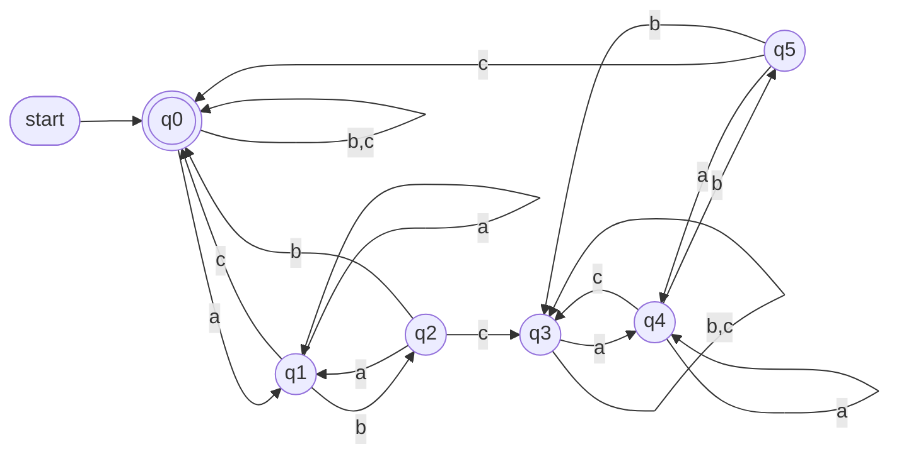

<!-- UGC NET Jun 2025 (26 Jun, Shift 1) · Paper 2 · generated by pyq_extract.py from 2_jun_2025.txt -->

## Q1
In a group of 120 people, 65 eat rice, 45 eat bread, 42 eat curd, 20 eat both rice and bread, 25 eat both rice and curd, 15 eat both bread and curd, and 8 eat all three. How many eat at least one of the three items?

## Q1 - Options
(A) 56
(B) 100
(C) 92
(D) 65

## Q1 - Hint
**Answer:** B
**Topic:** Discrete Maths: Counting, Induction, Lattices & Number Theory
**Source:** UGC NET Jun 2025 (26 Jun, Shift 1) · Paper 2 · Q1

Apply inclusion-exclusion: 65 + 45 + 42 - 20 - 25 - 15 + 8 = 100. The pairwise overlaps were subtracted once too often, so the triple overlap is added back once.

## Q2
In a pack of 42 cards, 3 cards are chosen one after another without replacement. How many ordered selections are possible?

## Q2 - Options
(A) 1722
(B) 1752
(C) 68880
(D) 6880

## Q2 - Hint
**Answer:** C
**Topic:** Probability, Permutation & Combination
**Source:** UGC NET Jun 2025 (26 Jun, Shift 1) · Paper 2 · Q2

Because the cards are chosen successively, order matters. There are 42 choices, then 41, then 40: 42 × 41 × 40 = 68,880.

## Q3
A positive integer is selected uniformly from the integers not exceeding 200. What is the probability that it is divisible by either 2 or 5?

## Q3 - Options
(A) 2/5
(B) 3/5
(C) 4/5
(D) 1/5

## Q3 - Hint
**Answer:** B
**Topic:** Probability, Permutation & Combination
**Source:** UGC NET Jun 2025 (26 Jun, Shift 1) · Paper 2 · Q3

There are 100 multiples of 2 and 40 multiples of 5 up to 200. The 20 multiples of 10 were counted twice, so the favourable count is 100 + 40 - 20 = 120. Thus the probability is 120/200 = 3/5.

## Q4
Consider the Boolean expression A(x, y, z) = x(y'z)'. Which is its complete sum-of-products form?

## Q4 - Options
(A) xyz + x'yz' + x'y'z'
(B) xyz' + x'yz' + x'y'z'
(C) xyz' + xy'z + x'y'z'
(D) xyz + xyz' + xy'z'

## Q4 - Hint
**Answer:** D
**Topic:** K-Map, SOP & Boolean Laws
**Source:** UGC NET Jun 2025 (26 Jun, Shift 1) · Paper 2 · Q4

By De Morgan's law, (y'z)' = y + z'. Hence A = x(y + z') = xy + xz'. Expanding `xy` as `xyz + xyz'` and `xz'` as `xyz' + xy'z'`, then removing the duplicate `xyz'`, gives xyz + xyz' + xy'z'. The other choices introduce minterms with x' or omit one required minterm.

## Q5
Choose the correct statement for a group G.

## Q5 - Options
(A) If (xy)^2 = x^2y^2 for all x, y in G, then G is commutative.
(B) If x^3 = 1 for all x in G, then G is commutative.
(C) If x^5 = 1 for all x in G, then G is commutative.
(D) If G is commutative, a subgroup of G need not be commutative.

## Q5 - Hint
**Answer:** A
**Topic:** Groups, Subgroups & Algebraic Structures
**Source:** UGC NET Jun 2025 (26 Jun, Shift 1) · Paper 2 · Q5

The stated identity gives xyxy = xxyy. Multiplying by x⁻¹ on the left and y⁻¹ on the right yields yx = xy, so G is commutative. The exponent conditions alone do not force commutativity, and every subgroup of an abelian group is abelian.

## Q6
What is the binary equivalent of (A0F)₁₆?

## Q6 - Options
(A) 111000111
(B) 101001111
(C) 101000001111
(D) 111100001010

## Q6 - Hint
**Answer:** C
**Topic:** Combinational/Sequential Circuits, Flip-Flops & Number Systems
**Source:** UGC NET Jun 2025 (26 Jun, Shift 1) · Paper 2 · Q6

Convert each hexadecimal digit to four bits: A = 1010, 0 = 0000, and F = 1111. Concatenating them gives 101000001111.

## Q7
In an I/O operation, what does a write operation do?

## Q7 - Options
(A) Transfers data from an I/O device to memory
(B) Transfers data from memory to an I/O device
(C) Transfers data from a CPU register to memory
(D) Transfers data from a CPU register to an I/O device

## Q7 - Hint
**Answer:** B
**Topic:** Interrupts, DMA, Instruction Cycle & Addressing Modes
**Source:** UGC NET Jun 2025 (26 Jun, Shift 1) · Paper 2 · Q7

A write operation sends data outward from the computer's memory to a peripheral or I/O device. The opposite direction, from a device into memory, is a read operation.

## Q8
The transformation of data from main memory to cache memory is called:

## Q8 - Options
(A) Data exchange
(B) Data transformation
(C) Mapping
(D) Matching

## Q8 - Hint
**Answer:** C
**Topic:** Memory Hierarchy, Cache & Access Time
**Source:** UGC NET Jun 2025 (26 Jun, Shift 1) · Paper 2 · Q8

A cache uses a mapping scheme—such as direct, associative, or set-associative mapping—to determine where a main-memory block is placed in cache.

## Q9
What is the Gray-code equivalent of decimal 8?

## Q9 - Options
(A) 1000
(B) 1100
(C) 1010
(D) 1110

## Q9 - Hint
**Answer:** B
**Topic:** Combinational/Sequential Circuits, Flip-Flops & Number Systems
**Source:** UGC NET Jun 2025 (26 Jun, Shift 1) · Paper 2 · Q9

Decimal 8 is binary 1000. Gray code is found by XORing the binary number with itself shifted right one bit: 1000 XOR 0100 = 1100.

## Q10
What is printed by this C program?

```
int x = 128, y = 110;
do {
  if (x > y) x = x - y;
  else y = y - x;
} while (x != y);
printf("%d", x);
```

## Q10 - Options
(A) 18
(B) 2
(C) 92
(D) 74

## Q10 - Hint
**Answer:** B
**Topic:** Programming Output, Pointers, OOP & Data Types
**Source:** UGC NET Jun 2025 (26 Jun, Shift 1) · Paper 2 · Q10

The loop repeatedly replaces the larger value by the difference, which is Euclid's subtraction algorithm. It ends when x and y both equal gcd(128, 110) = 2, so it prints 2.

## Q11
Which technique is used for clipping?

## Q11 - Options
(A) Stack-based seed
(B) Scan-line seed
(C) Sutherland-Cohen
(D) Inverse scaling

## Q11 - Hint
**Answer:** C
**Topic:** 2D Transformations, Reflection, Projection & Clipping
**Source:** UGC NET Jun 2025 (26 Jun, Shift 1) · Paper 2 · Q11

Cohen-Sutherland is the standard line-clipping algorithm; the option reverses its two names. Seed-fill and scan-line methods are filling techniques, while inverse scaling is a transformation idea.

## Q12
What is printed by this C program?

```
int i, j;
for (i = 1; i < 5; i += 2)
  for (j = 1; j < i; j += 2)
    printf("%d", j);
```

## Q12 - Options
(A) 1
(B) 1 2
(C) 1 3
(D) 1 1 3

## Q12 - Hint
**Answer:** A
**Topic:** Programming Output, Pointers, OOP & Data Types
**Source:** UGC NET Jun 2025 (26 Jun, Shift 1) · Paper 2 · Q12

The outer loop uses i = 1 and then i = 3. At i = 1, j starts at 1 and fails `j < i`, so nothing prints. At i = 3, j = 1 satisfies the test and prints once; incrementing j to 3 ends that inner loop. Hence the only printed value is 1, without spaces because the format string contains none.

## Q13
Which pointer expression refers to the array element `ar[m][n][o]`?

## Q13 - Options
(A) *(*(\*(ar) + m + n) + o)
(B) (*(*(\*ar + m) + n) + o)
(C) (*(*(ar + m) + n) + o)
(D) *(*(\*(ar + m) + n) + o)

## Q13 - Hint
**Answer:** D
**Topic:** Programming Output, Pointers, OOP & Data Types
**Source:** UGC NET Jun 2025 (26 Jun, Shift 1) · Paper 2 · Q13

For a multidimensional array, `ar + m` reaches the mth two-dimensional slice; `*(ar + m) + n` reaches the nth row; and `*(*(ar + m) + n) + o` reaches the oth element. Dereferencing that final address gives the element.

## Q14
Consider relation R with attributes A, B, C, D, and E, and dependencies C → F, E → A, EC → D, and A → B. Which option is a key for R?

## Q14 - Options
(A) CD
(B) EC
(C) AE
(D) AC

## Q14 - Hint
**Answer:** B
**Topic:** Normalization & Functional Dependencies
**Source:** UGC NET Jun 2025 (26 Jun, Shift 1) · Paper 2 · Q14

EC is a key: E determines A and then B, while EC determines D. Thus EC determines every attribute listed in R. The printed dependency C → F names an attribute omitted from the displayed schema, but it does not change which listed attributes EC determines. None of the other choices contains both E and C, so none can derive all of R's attributes.

## Q15
Let T1 have attributes A, B, C, D, and E with dependencies {EB → C, D → E, EA → B}; T2 has attributes A, B, C, and D with dependencies {C → A, A → B, A → D}. Which statement is true?

## Q15 - Options
(A) T1 is in 3NF
(B) T2 is in 3NF
(C) T1 is not in 3NF
(D) T1 is in 2NF

## Q15 - Hint
**Answer:** C
**Topic:** Normalization & Functional Dependencies
**Source:** UGC NET Jun 2025 (26 Jun, Shift 1) · Paper 2 · Q15

For T1, AD is a candidate key: D gives E, then EA gives B, and EB gives C. In the dependency EB → C, EB is not a superkey and C is non-prime, so T1 violates 3NF. T1 is therefore not in 3NF.

## Q16
In a relational database, which statement is correct?

## Q16 - Options
(A) A relation with only two attributes is always in BCNF.
(B) If all attributes of a relation are prime attributes, then the relation is in BCNF.
(C) Every relation has at least one non-prime attribute.
(D) BCNF decomposition preserves functional dependencies.

## Q16 - Hint
**Answer:** A
**Topic:** Normalization & Functional Dependencies
**Source:** UGC NET Jun 2025 (26 Jun, Shift 1) · Paper 2 · Q16

For a two-attribute relation, any nontrivial functional dependency has one attribute determining the other, making that determinant a key. Therefore every nontrivial dependency has a superkey on the left, satisfying BCNF. BCNF decomposition need not preserve every dependency.

## Q17
Consider Employee(eid, eName), Comp(cid, cName), and Own(eid, cid). Which relational-algebra expression returns eid values for people who own every brand?

## Q17 - Options
(A) π\_eid(π\_eid,cid(Own) ÷ π\_cid(Comp))
(B) π\_eid(π\_eid(Own) × π\_cid(Comp))
(C) π\_eid(π\_eid,cid(Own) × π\_cid(Comp))
(D) π\_eid(π\_eid(Own) × (π\_cid,cName(Own) ÷ π\_cid(Comp)))

## Q17 - Hint
**Answer:** A
**Topic:** SQL, Keys & Relational Algebra/Calculus
**Source:** UGC NET Jun 2025 (26 Jun, Shift 1) · Paper 2 · Q17

Division returns the eid values paired in Own with every cid in Comp. Projecting eid and cid from Own before dividing supplies exactly the required dividend relation, and the final projection returns only eids.

## Q18
Using non-preemptive SJF and Round Robin with time quantum 10, which process finishes second last in each schedule?

| Process | Burst time | Arrival time |
|---|---|---|
| P1 | 9 | 0 |
| P2 | 30 | 0 |
| P3 | 4 | 0 |
| P4 | 8 | 2 |
| P5 | 11 | 6 |

## Q18 - Options
(A) SJF: P4; RR: P4
(B) SJF: P5; RR: P4
(C) SJF: P4; RR: P3
(D) SJF: P5; RR: P5

## Q18 - Hint
**Answer:** D
**Topic:** CPU Scheduling (Theory, Numerical, Rate Monotonic)
**Source:** UGC NET Jun 2025 (26 Jun, Shift 1) · Paper 2 · Q18

For non-preemptive SJF the finishing order is P1, P3, P4, P5, P2, so P5 is second last. With RR(10), the completion order is P1, P3, P4, P5, P2; again P5 is second last.

## Q19
Which statement about Pthreads is correct?

## Q19 - Options
(A) It refers to POSIX standard IEEE 1002.1c.
(B) The standard defines an API only for thread creation.
(C) It specifies thread behaviour but not an implementation.
(D) Solaris, Linux, and macOS, except Tru64 UNIX, implement Pthreads.

## Q19 - Hint
**Answer:** C
**Topic:** Process Management, IPC, Semaphores & Threads
**Source:** UGC NET Jun 2025 (26 Jun, Shift 1) · Paper 2 · Q19

Pthreads is an interface specification: it defines the observable thread API and behaviour, while operating systems may implement it differently. It covers much more than creation, including synchronization and thread management. The standard number in option A is not the POSIX Threads designation.

## Q20
On average, 10 processes arrive each second and 20 processes are normally in the queue. What is the average waiting time per process?

## Q20 - Options
(A) 3 seconds
(B) 2 seconds
(C) 18 seconds
(D) 9 seconds

## Q20 - Hint
**Answer:** B
**Topic:** CPU Scheduling (Theory, Numerical, Rate Monotonic)
**Source:** UGC NET Jun 2025 (26 Jun, Shift 1) · Paper 2 · Q20

Little's law gives L = λW. With average queue length L = 20 and arrival rate λ = 10 processes per second, W = 20/10 = 2 seconds.

## Q21
What is the total swap time (swap-in and swap-out) for a 15 MB process at a transfer rate of 30 MB/s, with average latency 12 ms and no head seeks?

## Q21 - Options
(A) 1.024 s
(B) 1.00 s
(C) 0.512 s
(D) 12 s

## Q21 - Hint
**Answer:** A
**Topic:** Memory Management, Page Replacement & Thrashing
**Source:** UGC NET Jun 2025 (26 Jun, Shift 1) · Paper 2 · Q21

Each transfer takes 15/30 = 0.5 s. Swapping in and out takes 1.0 s of transfer time, and two 12 ms latencies add 0.024 s, for 1.024 s total.

## Q22
Which is not a requirements-elicitation technique?

## Q22 - Options
(A) Interviews
(B) The use-case approach
(C) Facilitated Application Specification Technique (FAST)
(D) Data-flow diagram

## Q22 - Hint
**Answer:** D
**Topic:** SDLC Models & Requirements (SRS)
**Source:** UGC NET Jun 2025 (26 Jun, Shift 1) · Paper 2 · Q22

Interviews, use cases, and FAST are techniques for discovering and negotiating requirements. A data-flow diagram models how data moves through a system; it may document requirements but is not itself an elicitation technique.

## Q23
In basic COCOMO, the effort estimate for organic software is:

## Q23 - Options
(A) E = 2.4(KLOC)^1.05 person-months
(B) E = 3.4(KLOC)^1.06 person-months
(C) E = 2.0(KLOC)^1.05 person-months
(D) E = 2.4(KLOC)^1.07 person-months

## Q23 - Hint
**Answer:** A
**Topic:** COCOMO, Project Management & Risk
**Source:** UGC NET Jun 2025 (26 Jun, Shift 1) · Paper 2 · Q23

The basic COCOMO organic-mode effort equation is E = 2.4 × (KLOC)^1.05 person-months. The coefficients and exponents for semi-detached and embedded modes differ.

## Q24
The process used to discover difficult, unknown, and hidden information about an existing software system is called:

## Q24 - Options
(A) Software engineering
(B) Software re-engineering
(C) Reverse engineering
(D) Inverse engineering

## Q24 - Hint
**Answer:** C
**Topic:** SE: Design, UML, Configuration Management & Reuse
**Source:** UGC NET Jun 2025 (26 Jun, Shift 1) · Paper 2 · Q24

Reverse engineering analyzes an existing system to recover its design, specifications, or other knowledge that is not readily visible. Re-engineering is broader and includes modifying or improving the system after such understanding is obtained.

## Q25
Which is not a software characteristic?

## Q25 - Options
(A) Software does not wear out.
(B) Software is flexible.
(C) Software is not manufactured.
(D) Software is always correct.

## Q25 - Hint
**Answer:** D
**Topic:** SDLC Models & Requirements (SRS)
**Source:** UGC NET Jun 2025 (26 Jun, Shift 1) · Paper 2 · Q25

Software can contain defects, so it is not always correct. Unlike physical hardware it does not wear out through use, it can be changed, and it is developed rather than manufactured in the usual physical sense.

## Q26
For infix expression `((A+B)*D)↑(E-F)`, what is its equivalent postfix expression?

## Q26 - Options
(A) A B + D \* E F ↑
(B) A B + D \* - ↑ E F
(C) A B + D E \* F - ↑
(D) A B + D \* E F - ↑

## Q26 - Hint
**Answer:** D
**Topic:** Hashing, Stacks, Queues & Linked Lists
**Source:** UGC NET Jun 2025 (26 Jun, Shift 1) · Paper 2 · Q26

Postfix for the left operand `((A+B)*D)` is `A B + D *`; postfix for `(E-F)` is `E F -`. Appending the exponent operator after the two complete operands gives `A B + D * E F - ↑`.

## Q27
What is the tight asymptotic bound for `T(n) = 2T(n/4) + √n`?

## Q27 - Options
(A) Θ(√n)
(B) Θ(n log n)
(C) Θ(√n log n)
(D) Θ(n log √n)

## Q27 - Hint
**Answer:** C
**Topic:** Time Complexity, Asymptotic Notation & Recurrences
**Source:** UGC NET Jun 2025 (26 Jun, Shift 1) · Paper 2 · Q27

Here a = 2 and b = 4, so n^(log₄2) = √n. Since f(n) is also √n, this is the equal-order case of the Master Theorem, giving Θ(√n log n).

## Q28
Which sequence is a longest common subsequence of `{1, 2, 3, 2, 4, 1, 2}` and `{2, 4, 3, 1, 2, 1}`?

## Q28 - Options
(A) 2, 1, 2, 3
(B) 1, 3, 2, 1
(C) 2, 3, 2, 1
(D) 2, 3, 1, 2, 1

## Q28 - Hint
**Answer:** C
**Topic:** Greedy Algorithms & Dynamic Programming
**Source:** UGC NET Jun 2025 (26 Jun, Shift 1) · Paper 2 · Q28

`2, 3, 2, 1` appears in order in the first sequence at positions 2, 3, 4, 6 and in the second at positions 1, 3, 5, 6. Option D cannot occur in the first sequence because after 2, 3, 1, 2 there is no later 1.

## Q29
Maintaining a graph in memory using its adjacency matrix is called:

## Q29 - Options
(A) Complete representation
(B) Linked representation
(C) Circular representation
(D) Sequential representation

## Q29 - Hint
**Answer:** D
**Topic:** BFS, DFS & Graph Algorithms
**Source:** UGC NET Jun 2025 (26 Jun, Shift 1) · Paper 2 · Q29

An adjacency matrix is a two-dimensional array whose entries are stored in contiguous, indexed locations. That array-based form is the sequential representation; linked representation instead uses adjacency lists.

## Q30
What is printed by this C code?

```
int *i, a = 12, b = 2, c;
c = (a = a + b, b = a / b, a = a * b, b = a - b);
i = &c;
printf("%d", --(*i));
```

## Q30 - Options
(A) 91
(B) 90
(C) 98
(D) 92

## Q30 - Hint
**Answer:** B
**Topic:** Programming Output, Pointers, OOP & Data Types
**Source:** UGC NET Jun 2025 (26 Jun, Shift 1) · Paper 2 · Q30

The displayed code supplies the source's evidently omitted terminating semicolon. The comma expressions execute left to right: a becomes 14, b becomes 7, a becomes 98, and b becomes 91. The assignment sets c to the final expression value 91; `--(*i)` decrements c through its pointer before printing, giving 90. It does not print 91 because the pre-decrement happens before `printf`, and 98 is only the intermediate value of a.

## Q31
Which is the best description of the language accepted by the DFA?



DFA over the alphabet {a, b, c}.

## Q31 - Options
(A) L = (a\* + b\* + c\*)+
(B) L = (a + b + c)*(abc)+(a + b + c)*
(C) The set of strings that start with a, b, or c and end with c
(D) The set of strings having an even count, including zero, of the substring `abc`

## Q31 - Hint
**Answer:** D
**Topic:** Finite Automata, Regular Languages & DFA Minimization
**Source:** UGC NET Jun 2025 (26 Jun, Shift 1) · Paper 2 · Q31

The automaton's states track progress through a possible `abc` and whether a completed occurrence has changed the parity. The initial accepting state represents zero completed occurrences; completing `abc` moves to the opposite-parity group, and completing another returns to the accepting group. Thus it accepts exactly strings with an even number of `abc` occurrences.

## Q32
Which pictured NFA is valid for the given DFA?


Given DFA and four candidate NFA diagrams.

## Q32 - Options
(A) Diagram 1
(B) Diagram 2
(C) Diagram 3
(D) Diagram 4

## Q32 - Hint
**Answer:** D
**Topic:** Finite Automata, Regular Languages & DFA Minimization
**Source:** UGC NET Jun 2025 (26 Jun, Shift 1) · Paper 2 · Q32

A valid NFA must preserve the DFA's accepted language while allowing nondeterministic state choices. Comparing the transition alternatives and accepting states shows that diagram 4 retains the required accepting paths without accepting a string that the DFA rejects; the other diagrams alter an accepting state or omit a required transition alternative.

## Q33
In a stop-and-wait system, line bandwidth is 1 Mbps and round-trip delay is 30 ms. What is the bandwidth-delay product?

## Q33 - Options
(A) 15,000 bits
(B) 20,000 bits
(C) 30,000 bits
(D) 60,000 bits

## Q33 - Hint
**Answer:** C
**Topic:** Propagation Delay, Bit Rate & Channel Throughput
**Source:** UGC NET Jun 2025 (26 Jun, Shift 1) · Paper 2 · Q33

The bandwidth-delay product is the amount of data that can be in flight: 1,000,000 bits/s × 0.030 s = 30,000 bits.

## Q34
`CB84000D001C001C` is a UDP header in hexadecimal. What is the source-port number?

## Q34 - Options
(A) 52100
(B) 13
(C) 28
(D) 52000

## Q34 - Hint
**Answer:** A
**Topic:** TCP/IP, TCP & UDP Protocols and Headers
**Source:** UGC NET Jun 2025 (26 Jun, Shift 1) · Paper 2 · Q34

The first 16 bits of a UDP header are the source port. The first four hexadecimal digits are CB84, and 0xCB84 = 12×4096 + 11×256 + 8×16 + 4 = 52,100.

## Q35
A packet sent by a router or node to the source to inform it of congestion is called a:

## Q35 - Options
(A) Explicit packet
(B) Backpressure packet
(C) Choke packet
(D) Retransmission packet

## Q35 - Hint
**Answer:** C
**Topic:** Flow Control, Switching & Routing Protocols
**Source:** UGC NET Jun 2025 (26 Jun, Shift 1) · Paper 2 · Q35

A choke packet explicitly tells a source to reduce its sending rate because congestion has been detected. Backpressure instead propagates congestion control hop by hop toward the source.

## Q36
Which is not a characteristic of packet switching?

## Q36 - Options
(A) Data is broken into packets.
(B) Each packet may take a different route.
(C) It requires a dedicated path.
(D) It supports dynamic routing.

## Q36 - Hint
**Answer:** C
**Topic:** Flow Control, Switching & Routing Protocols
**Source:** UGC NET Jun 2025 (26 Jun, Shift 1) · Paper 2 · Q36

Packet switching shares network links and routes packets independently, often dynamically. Requiring an exclusive end-to-end path is the defining property of circuit switching, not packet switching.

## Q37
Which is not a valid property of λ-cuts of fuzzy relations R̃ and S̃?

## Q37 - Options
(A) (R̃ ∪ S̃)λ = Rλ ∪ Sλ
(B) (R̃ ∩ S̃)λ = Rλ ∩ Sλ
(C) The λ-cut of the complement of R̃ differs from the complement of Rλ except when λ = 1.
(D) For λ ≤ β with 0 ≤ β ≤ 1, Rβ ⊆ Rλ.

## Q37 - Hint
**Answer:** C
**Topic:** NLP, Bayes Rule, Search, Genetic & Fuzzy Concepts
**Source:** UGC NET Jun 2025 (26 Jun, Shift 1) · Paper 2 · Q37

Union and intersection commute with λ-cuts, and increasing the threshold can only shrink a cut, so Rβ ⊆ Rλ for β ≥ λ. Complement does not have the stated exceptional equality at λ = 1: its cut is governed by the complementary membership threshold, not simply by taking the ordinary complement of Rλ.

## Q38
Which is not a parent-selection technique in genetic-algorithm implementations?

## Q38 - Options
(A) Radial
(B) Tournament
(C) Boltzmann
(D) Rank

## Q38 - Hint
**Answer:** A
**Topic:** NLP, Bayes Rule, Search, Genetic & Fuzzy Concepts
**Source:** UGC NET Jun 2025 (26 Jun, Shift 1) · Paper 2 · Q38

Tournament, rank-based, and Boltzmann selection are ways to choose parents according to fitness. “Radial” is not a standard parent-selection method; it is more commonly associated with radial-basis functions.

## Q39
With η as learning rate and xi as the ith input, which update rule best describes a Kohonen self-organizing map weight wij?

## Q39 - Options
(A) wij(new) = (1 − η)wij(old) + ηxi
(B) wij(new) = ηwij(old) + (1 − η)xi
(C) wij(new) = (1 − η)wij(old) + xi
(D) wij(new) = wij(old) + ηxi

## Q39 - Hint
**Answer:** A
**Topic:** ANN, Perceptron & Types of Machine Learning
**Source:** UGC NET Jun 2025 (26 Jun, Shift 1) · Paper 2 · Q39

A SOM moves a winning neuron's weight vector a fraction η toward the input: w(new) = w(old) + η(x − w(old)). Rearranging gives (1 − η)w(old) + ηx, so the new weight is a convex combination of the old weight and input.

## Q40
After applying samples S1 through S4 in order to a perceptron with initial weights w1 = w2 = 0, learning rate 0.1, no bias, and output 0 when yin = 0, what are the updated weights?

| Sample | x1 | x2 | Target |
|---|---|---|---|
| S1 | 0 | 0 | 0 |
| S2 | 0 | 1 | 1 |
| S3 | 1 | 0 | 1 |
| S4 | 1 | 1 | 1 |

## Q40 - Options
(A) w1 = 0.1, w2 = 0.1
(B) w1 = 0.0, w2 = 0.2
(C) w1 = 0.0, w2 = 0.1
(D) w1 = 0.2, w2 = 0.2

## Q40 - Hint
**Answer:** A
**Topic:** ANN, Perceptron & Types of Machine Learning
**Source:** UGC NET Jun 2025 (26 Jun, Shift 1) · Paper 2 · Q40

S1 has zero inputs and target 0, so it changes nothing. S2 has input (0,1), target 1, and adds 0.1 to w2; S3 similarly adds 0.1 to w1. For S4, yin = 0.2 and the observed output is already 1, matching its target, so no further update occurs.

## Q41
A computer processes an instruction by fetching it, decoding it, calculating its effective address, fetching operands, and executing it. Which sequence is correct?

## Q41 - Options
(A) A, B, C, D, E
(B) B, A, D, A, E
(C) B, C, A, D, E
(D) C, B, A, D, E

## Q41 - Hint
**Answer:** C
**Topic:** Interrupts, DMA, Instruction Cycle & Addressing Modes
**Source:** UGC NET Jun 2025 (26 Jun, Shift 1) · Paper 2 · Q41

The processor must first fetch the instruction and decode it to know its addressing mode. It can then calculate the effective address, fetch the needed operands, and execute the operation. That order is B, C, A, D, E.

## Q42
In an arithmetic pipeline, the operations are compare exponents, align mantissas, add or subtract mantissas, and normalize the result. Which sequence is correct?

## Q42 - Options
(A) D, A, B, C
(B) D, B, A, C
(C) B, C, A, D
(D) B, C, D, A

## Q42 - Hint
**Answer:** A
**Topic:** Pipelining & Amdahl's Law
**Source:** UGC NET Jun 2025 (26 Jun, Shift 1) · Paper 2 · Q42

Floating-point operands must first have their exponents compared so the smaller mantissa can be aligned. After alignment, the mantissas are added or subtracted, and the resulting normalized form is produced last.

## Q43
To input data through a CPU-controlled I/O program, the actions are reading the status register, checking its flag bit, reading the data register, and transferring data to memory. Which sequence is correct?

## Q43 - Options
(A) A, B, C, D
(B) B, A, C, D
(C) C, B, A, D
(D) A, C, B, D

## Q43 - Hint
**Answer:** A
**Topic:** Interrupts, DMA, Instruction Cycle & Addressing Modes
**Source:** UGC NET Jun 2025 (26 Jun, Shift 1) · Paper 2 · Q43

The program first reads the device status, then tests the readiness flag. Only after the flag indicates data is available should it read the data register and transfer that value into memory. Thus the sequence is A, B, C, D.

## Q44
For C operators `&&`, `+=`, `>>`, `>=`, and `?:`, what is the precedence order from higher to lower?

## Q44 - Options
(A) , &gt;=, ?:, +=, &&
(B) , &&, &gt;=, ?:, +=
(C) , &gt;=, &&, ?:, +=
(D) =, &gt;&gt;, &&, +=, ?:

## Q44 - Hint
**Answer:** C
**Topic:** Programming Output, Pointers, OOP & Data Types
**Source:** UGC NET Jun 2025 (26 Jun, Shift 1) · Paper 2 · Q44

C precedence places shift operators above relational operators, relational above logical AND, logical AND above conditional, and conditional above assignment. Therefore the order is `>>`, `>=`, `&&`, `?:`, `+=`.

## Q45
Arrange Linux interrupt-protection levels from increasing priority: user-mode programs, preemptible kernel system-service routines, bottom-half interrupt handlers, and top-half interrupt handlers.

## Q45 - Options
(A) B → A → C → D
(B) C → B → A → D
(C) C → A → B → D
(D) A → D → B → C

## Q45 - Hint
**Answer:** D
**Topic:** OS: Linux, Windows, Security, Virtualization & Distributed
**Source:** UGC NET Jun 2025 (26 Jun, Shift 1) · Paper 2 · Q45

User-mode work is the most preemptible and therefore lowest priority. Preemptible kernel service routines rank above it, bottom halves above ordinary kernel work, and top-half interrupt handlers are highest because they run immediately in interrupt context.

## Q46
Which sequence gives the hierarchy of a layered file system from application level down to I/O control?

## Q46 - Options
(A) A → B → D → C → E
(B) D → E → C → A → B
(C) E → A → B → C → D
(D) E → C → B → A → D

## Q46 - Hint
**Answer:** C
**Topic:** Disk Scheduling, File Systems & RAID
**Source:** UGC NET Jun 2025 (26 Jun, Shift 1) · Paper 2 · Q46

Application programs invoke the logical file system, which manages directories and metadata. It calls the file-organization module, then the basic file system, which finally relies on I/O control for device operations. The sequence is E, A, B, C, D.

## Q47
Arrange stamp coupling, control coupling, external coupling, common coupling, and content coupling from lowest to highest coupling.

## Q47 - Options
(A) E, A, C, B, D
(B) D, B, A, E, C
(C) B, C, D, A, E
(D) C, A, B, D, E

## Q47 - Hint
**Answer:** C
**Topic:** SE: Design, UML, Configuration Management & Reuse
**Source:** UGC NET Jun 2025 (26 Jun, Shift 1) · Paper 2 · Q47

Stamp coupling passes a composite data structure and is relatively weak. Control coupling passes control information; external coupling shares externally imposed formats; common coupling shares global data; and content coupling, where one module relies on another's internals, is strongest. Thus B, C, D, A, E is increasing order.

## Q48
Arrange unit, integration, system, and acceptance testing in their usual software-development order.

## Q48 - Options
(A) B, C, A, D
(B) B, A, C, D
(C) C, B, A, D
(D) C, B, D, A

## Q48 - Hint
**Answer:** B
**Topic:** Software Testing, V&V & Quality (CMM)
**Source:** UGC NET Jun 2025 (26 Jun, Shift 1) · Paper 2 · Q48

Testing starts with individual units, then verifies interactions between integrated units. The complete system is tested next, and acceptance testing follows to confirm that stakeholder requirements are met. The order is B, A, C, D.

## Q49
To construct a Huffman tree, first create leaf nodes, build a priority queue, repeatedly combine the lowest-frequency nodes, and stop when the root is formed. Which sequence is correct?

## Q49 - Options
(A) B, C, A, D
(B) D, B, A, C
(C) B, C, D, A
(D) C, A, B, D

## Q49 - Hint
**Answer:** C
**Topic:** Greedy Algorithms & Dynamic Programming
**Source:** UGC NET Jun 2025 (26 Jun, Shift 1) · Paper 2 · Q49

Huffman coding begins with a leaf for every symbol and places those leaves in a min-priority queue. It repeatedly removes the two least-frequent nodes and combines them until one root remains, giving B, C, D, A.

## Q50
In dynamic programming, the steps are characterizing an optimal solution, recursively defining its value, computing that value bottom-up, and constructing an optimal solution. Which sequence is correct?

## Q50 - Options
(A) B, C, A, D
(B) B, A, C, D
(C) C, B, A, D
(D) C, B, D, A

## Q50 - Hint
**Answer:** D
**Topic:** Greedy Algorithms & Dynamic Programming
**Source:** UGC NET Jun 2025 (26 Jun, Shift 1) · Paper 2 · Q50

First identify the optimal substructure, then write a recurrence for the optimal value. Compute the recurrence bottom-up and finally trace the stored choices to construct an optimal solution. This is C, B, D, A.

## Q51
Arrange LL(0), LR(0), SLR, LALR(1), and LR(1) parsers from least to greatest grammar-handling power.

## Q51 - Options
(A) LL(0) → LR(0) → SLR → LR(1) → LALR(1)
(B) SLR → LR(0) → LL(0) → LR(1) → LALR(1)
(C) LL(0) → LR(0) → SLR → LALR(1) → LR(1)
(D) LR(0) → LL(0) → SLR → LR(1) → LALR(1)

## Q51 - Hint
**Answer:** C
**Topic:** Parsing, FIRST/FOLLOW, Compiler Phases & Three-Address Code
**Source:** UGC NET Jun 2025 (26 Jun, Shift 1) · Paper 2 · Q51

LL(0) has no lookahead and is most restricted. LR(0) adds bottom-up item sets, SLR uses FOLLOW sets to reduce conflicts, LALR(1) merges compatible LR(1) states, and canonical LR(1) retains the most lookahead information. Hence C gives the increasing order.

## Q52
Arrange the steps of accessing a website after a user enters a URL: DNS resolution, HTTP request, URL entry, IP-address acquisition, and webpage display.

## Q52 - Options
(A) B, A, C, E, D
(B) C, B, A, E, D
(C) B, C, D, A, E
(D) C, A, D, B, E

## Q52 - Hint
**Answer:** D
**Topic:** Application Layer & WWW (DNS, Email, HTTP, FTP)
**Source:** UGC NET Jun 2025 (26 Jun, Shift 1) · Paper 2 · Q52

The user first enters the URL. The browser resolves the domain name, obtains an IP address from that resolution, sends the HTTP request to the server, and finally renders the received webpage. The order is C, A, D, B, E.

## Q53
Arrange virtualization steps in a cloud environment: install a hypervisor, create virtual machines, allocate their resources, and run isolated workloads.

## Q53 - Options
(A) B, C, A, D
(B) A, B, C, D
(C) A, C, B, D
(D) B, C, D, A

## Q53 - Hint
**Answer:** B
**Topic:** Cloud, IoT & Mobile/Wireless
**Source:** UGC NET Jun 2025 (26 Jun, Shift 1) · Paper 2 · Q53

A hypervisor must be installed on the physical server before it can create VMs. Resources are then allocated to those VMs, which can subsequently run isolated workloads. The order is A, B, C, D.

## Q54
For knowledge-base design, arrange choosing a task domain, selecting atoms for propositions, axiomatizing the domain, and asking questions about the intended interpretation.

## Q54 - Options
(A) C → A → D → B
(B) C → A → B → D
(C) B → C → A → D
(D) A → C → B → D

## Q54 - Hint
**Answer:** A
**Topic:** AI: Knowledge Representation, Planning & Expert Systems
**Source:** UGC NET Jun 2025 (26 Jun, Shift 1) · Paper 2 · Q54

The task domain sets the scope. The designer then chooses the propositional vocabulary, writes axioms in that vocabulary, and can ask whether the resulting representation has the intended interpretation. This produces C, A, D, B.

## Q55
Arrange these genetic-algorithm actions: calculate population fitness, select parents, apply crossover, and mutate each locus.

## Q55 - Options
(A) A → C → B → D
(B) C → A → D → B
(C) C → A → B → D
(D) A → D → B → C

## Q55 - Hint
**Answer:** B
**Topic:** NLP, Bayes Rule, Search, Genetic & Fuzzy Concepts
**Source:** UGC NET Jun 2025 (26 Jun, Shift 1) · Paper 2 · Q55

Fitness must be computed before fitness-informed parent selection. Selected parents undergo crossover to create offspring, and mutation is then applied probabilistically at loci. The standard order is C, A, D, B.

## Q56
Let P mean “she is intelligent” and Q mean “she is happy.” Which set correctly formalizes: intelligent implies unhappy; neither intelligent nor happy; being not intelligent is necessary for happiness; and not intelligent implies unhappy?

## Q56 - Options
(A) P → ¬Q; P ∧ ¬Q; Q → ¬P; P → ¬Q
(B) P → Q; ¬P ∧ ¬Q; ¬Q → P; ¬P → ¬Q
(C) P → ¬Q; ¬P ∧ ¬Q; Q → ¬P; ¬P → ¬Q
(D) P → ¬Q; P ∧ ¬Q; Q → P; ¬P → ¬Q

## Q56 - Hint
**Answer:** C
**Topic:** Propositional & Predicate Logic
**Source:** UGC NET Jun 2025 (26 Jun, Shift 1) · Paper 2 · Q56

“Neither” means ¬P ∧ ¬Q. “Not intelligent is necessary for happy” makes happiness imply not intelligent, Q → ¬P. The first and fourth implications are P → ¬Q and ¬P → ¬Q respectively, so only option C has all four forms.

## Q57
For positive integers m and n, which statements are correct: n ≠ 1 implies m &lt; mn; a composite k can be written k = mn with 1 &lt; m,n &gt; k; mn = 1 implies m = n = 1; and a composite k can be written k = mn with 1 &lt; m,n &lt; k?

## Q57 - Options
(A) A, C, D only
(B) B, C, D only
(C) A, B only
(D) A, B, C

## Q57 - Hint
**Answer:** A
**Topic:** Discrete Maths: Counting, Induction, Lattices & Number Theory
**Source:** UGC NET Jun 2025 (26 Jun, Shift 1) · Paper 2 · Q57

If n ≠ 1, positivity makes n at least 2, hence m &lt; mn. A product of positive integers can equal 1 only when both are 1. A composite number has proper factors strictly between 1 and k, so D is true; B is impossible because two factors greater than k cannot multiply to k.

## Q58
Which statements are true: write-through updates only cache; write-back updates cache and main memory together; private writable caches create coherence problems; and cache coherence can be solved by a hardware-only scheme?

## Q58 - Options
(A) A and B only
(B) B and C only
(C) C and D only
(D) A, B, and C only

## Q58 - Hint
**Answer:** C
**Topic:** Memory Hierarchy, Cache & Access Time
**Source:** UGC NET Jun 2025 (26 Jun, Shift 1) · Paper 2 · Q58

Write-through updates cache and main memory on each write, so A is false. Write-back normally updates main memory later, on eviction, so B is false. Private writable caches do create coherence issues, and hardware protocols such as snooping or directory mechanisms can solve them; C and D are true.

## Q59
Which gate does not output 1 when both inputs are 0?

## Q59 - Options
(A) NAND and NOR only
(B) NOR and XOR only
(C) XOR and XNOR only
(D) XOR only

## Q59 - Hint
**Answer:** D
**Topic:** Combinational/Sequential Circuits, Flip-Flops & Number Systems
**Source:** UGC NET Jun 2025 (26 Jun, Shift 1) · Paper 2 · Q59

At inputs 0 and 0, NAND outputs 1, NOR outputs 1, and XNOR outputs 1 because the inputs match. XOR alone outputs 0, so it is the only listed gate that does not output 1.

## Q60
*Editorially repaired version of an ambiguous NTA item.* Consider these XML statements:

A. XML has no predefined tag set, and users can define their own tags.<br>
B. XML is used primarily for presentation.<br>
C. XML is case-sensitive.<br>
D. XML supports dynamic data representation.

Which statements are true?

## Q60 - Options
(A) B, C, and D only
(B) A, B, and D only
(C) A, C, and D only
(D) B and D only

## Q60 - Hint
**Answer:** C
**Topic:** Web Programming (HTML, XML, Java, Servlets)
**Source:** UGC NET Jun 2025 (26 Jun, Shift 1) · Paper 2 · Q60

XML has no fixed, predefined vocabulary, so applications may define their own element names. XML names are case-sensitive, and XML can represent data whose values or structure change over time. XML itself is not a presentation language; presentation is normally handled by CSS, XSLT, or another rendering layer. Thus A, C, and D are true.

## Q61
Which pointer operations are legal in C?

## Q61 - Options
(A) A, B, C only
(B) A, B, D only
(C) A and B only
(D) A and E only

## Q61 - Hint
**Answer:** D
**Topic:** Programming Output, Pointers, OOP & Data Types
**Source:** UGC NET Jun 2025 (26 Jun, Shift 1) · Paper 2 · Q61

Adding an integer to a pointer yields another pointer. Subtracting two pointers into the same array yields an integer difference (`ptrdiff_t`). Pointer plus pointer is invalid; pointer minus integer yields a pointer, not a number; and pointer minus pointer does not yield a pointer. Therefore A and E only are legal as stated.

## Q62
Once a process is executing, which events could not occur: issuing I/O then joining the ready queue; creating a child and waiting for it; time-slice expiry then joining the waiting queue; or interrupt-driven removal then joining the waiting queue?

## Q62 - Options
(A) B only
(B) D only
(C) A and C only
(D) A, C, and D only

## Q62 - Hint
**Answer:** D
**Topic:** Process Management, IPC, Semaphores & Threads
**Source:** UGC NET Jun 2025 (26 Jun, Shift 1) · Paper 2 · Q62

An I/O request blocks the process, sending it to waiting rather than ready. Expiry of a time slice preempts it to ready, not waiting. An interrupt can also preempt it to ready; it does not by itself make the process wait. Waiting for a child is a valid blocking event, so A, C, and D are the impossible descriptions.

## Q63
Which statement about spinlock semaphores is correct?

## Q63 - Options
(A) They are busy-waiting semaphores.
(B) They are not useful when locks are held briefly.
(C) Waiting for one may require multiple context switches.
(D) They are often employed on uniprocessor systems.

## Q63 - Hint
**Answer:** A
**Topic:** Process Management, IPC, Semaphores & Threads
**Source:** UGC NET Jun 2025 (26 Jun, Shift 1) · Paper 2 · Q63

A spinlock repeatedly tests a lock while busy waiting. It is useful for very short critical sections because it can avoid sleep-and-wakeup overhead; waiting does not itself cause context switches, and spinning is generally unsuitable on a uniprocessor because the lock holder needs CPU time to run.

## Q64
Which cohesions are better than procedural cohesion?

## Q64 - Options
(A) Functional and communicational only
(B) Functional, sequential, and communicational only
(C) Temporal, communicational, and logical only
(D) Functional, communicational, and logical only

## Q64 - Hint
**Answer:** B
**Topic:** SE: Design, UML, Configuration Management & Reuse
**Source:** UGC NET Jun 2025 (26 Jun, Shift 1) · Paper 2 · Q64

Functional cohesion is strongest, followed by sequential and communicational cohesion; each is tighter than procedural cohesion. Temporal and logical cohesion are weaker because they group work by time or category rather than by direct data-flow or a single focused purpose.

## Q65
Which are McCall quality factors: maintainability, usability, integrity, and functionality?

## Q65 - Options
(A) A and D only
(B) A, B, and D only
(C) C and D only
(D) A, B, and C only

## Q65 - Hint
**Answer:** D
**Topic:** Software Testing, V&V & Quality (CMM)
**Source:** UGC NET Jun 2025 (26 Jun, Shift 1) · Paper 2 · Q65

McCall's quality model includes maintainability, usability, and integrity among its factors. “Functionality” is prominent in later models such as ISO/IEC 25010, but is not one of McCall's named factors.

## Q66
Which algorithms use a greedy strategy: Dijkstra's algorithm, Kruskal's algorithm, Huffman coding, and Bellman-Ford?

## Q66 - Options
(A) A, B, and D only
(B) A, B, and C only
(C) C and D only
(D) A and D only

## Q66 - Hint
**Answer:** B
**Topic:** Greedy Algorithms & Dynamic Programming
**Source:** UGC NET Jun 2025 (26 Jun, Shift 1) · Paper 2 · Q66

Dijkstra greedily fixes the smallest tentative distance, Kruskal greedily adds the cheapest edge that avoids a cycle, and Huffman greedily combines the two least-frequent nodes. Bellman-Ford repeatedly relaxes edges and is not a greedy algorithm.

## Q67
Which trees are height balanced: binary search tree, AVL tree, red-black tree, and B-tree?

## Q67 - Options
(A) A and D only
(B) A, B, and D only
(C) C and D only
(D) B and C only

## Q67 - Hint
**Answer:** C, D
**Topic:** Trees: BST, AVL & Heaps
**Source:** UGC NET Jun 2025 (26 Jun, Shift 1) · Paper 2 · Q67

An ordinary binary-search tree has no balancing guarantee. AVL trees enforce a strict height-balance condition, while red-black trees guarantee logarithmic height through black-height constraints. The term “height balanced” is also used broadly for B-trees because all leaves are at the same level; the supplied options therefore reflect two defensible conventions.

## Q68
Which are controlled-access protocols: reservation, polling, TDMA, token passing, and CSMA/CA?

## Q68 - Options
(A) A and D only
(B) A, B, and D only
(C) C, D, and E only
(D) A, D, and E only

## Q68 - Hint
**Answer:** B
**Topic:** MAC Layer, CSMA/CD, Collision Resolution & Piggybacking
**Source:** UGC NET Jun 2025 (26 Jun, Shift 1) · Paper 2 · Q68

Controlled access coordinates stations so they take turns. Reservation, polling, and token passing are the standard controlled-access methods. TDMA is a channelization technique, while CSMA/CA is contention based.

## Q69
Which are data-encoding schemes: NRZ, Manchester encoding, amplitude modulation, Hamming code, and bipolar AMI?

## Q69 - Options
(A) A, C, and D only
(B) A, B, and D only
(C) C, D, and E only
(D) A, B, and E only

## Q69 - Hint
**Answer:** D
**Topic:** Data Communication: Modulation, Multiplexing, Media & Topologies
**Source:** UGC NET Jun 2025 (26 Jun, Shift 1) · Paper 2 · Q69

NRZ, Manchester, and bipolar AMI are line-encoding schemes. Amplitude modulation is a modulation technique and Hamming code is an error-control code, so neither belongs in the list of data-encoding schemes here.

## Q70
Which statements about agent systems are correct: an agent system comprises an agent and its environment; an agent controller receives percepts and sends commands; actuators are always reliable; and actuators convert stimuli into percepts?

## Q70 - Options
(A) A and B only
(B) B and D only
(C) C and D only
(D) B, C, and D only

## Q70 - Hint
**Answer:** A
**Topic:** AI: Knowledge Representation, Planning & Expert Systems
**Source:** UGC NET Jun 2025 (26 Jun, Shift 1) · Paper 2 · Q70

An agent acts in an environment and its controller maps percepts to actions. Sensors, not actuators, convert environmental stimuli to percepts; actuators execute actions and can be noisy or unreliable. Thus only A and B are correct.

## Q71
Which STRIPS statements are correct: it is feature-centric; world-state features are primitive and derived; an action has preconditions and effects; and it directly defines conditional effects?

## Q71 - Options
(A) A and C only
(B) B and C only
(C) A and D only
(D) B, C, and D only

## Q71 - Hint
**Answer:** B
**Topic:** AI: Knowledge Representation, Planning & Expert Systems
**Source:** UGC NET Jun 2025 (26 Jun, Shift 1) · Paper 2 · Q71

STRIPS represents a state using features or propositions, commonly distinguished as primitive and derived, and describes actions through preconditions and effects. Basic STRIPS effects are unconditional, so it does not directly express conditional effects. Therefore B and C are the correct pair.

## Q72
*Editorially repaired version of an ambiguous NTA item.* Which grammars are context-free but not regular?

| Grammar | Productions |
|---|---|
| A | S → Ab; aS → aA; A → a |
| B | S → Ab; A → Sa; A → a |
| C | S → AS; S → aA; A → a |
| D | S → Ab; S → aA; A → a |
| E | S → Sb; A → Aa; A → ε |

## Q72 - Options
(A) A and B only
(B) C and D only
(C) C only
(D) A, B, D, and E only

## Q72 - Hint
**Answer:** C
**Topic:** Chomsky Hierarchy, Grammars & CNF/GNF
**Source:** UGC NET Jun 2025 (26 Jun, Shift 1) · Paper 2 · Q72

A context-free grammar must have one nonterminal on the left of every production. A is not context-free because it has `aS → aA`. B, D, and E are regular because their productions are consistently linear. C is context-free but not regular because `S → AS` has two nonterminals on its right side. Thus only C qualifies. The source's answer set was repaired to include that result explicitly.

## Q73
The source prints 196 bits for Twofish; that typo is corrected to 256 bits below. Which encryption statements are true: symmetric-key cryptography requires secrecy of the key-generating function above the decrypting function; DES uses a 64-bit block and 56-bit key; Twofish uses a 128-bit block with variable keys up to 256 bits; and RC4 is a stream cipher operating on bits or bytes rather than blocks?

## Q73 - Options
(A) B and C only
(B) A and D only
(C) A and C only
(D) B, C, and D only

## Q73 - Hint
**Answer:** D
**Topic:** Network Security & Cryptography
**Source:** UGC NET Jun 2025 (26 Jun, Shift 1) · Paper 2 · Q73

Symmetric encryption depends on keeping the key secret, not the algorithm or a key-generating function. DES uses a 64-bit block and a 56-bit key; Twofish has a 128-bit block and supports keys up to 256 bits; and RC4 is a stream cipher. Therefore B, C, and D are true. The source's printed 196-bit maximum has been explicitly corrected to 256 bits in this learner-facing version.

## Q74
*Editorially repaired version of an ambiguous NTA item.* In the broad Knowledge Discovery in Databases (KDD) process, consider these statements:

A. Data transformation is involved.<br>
B. An online database can serve as a data source for a data warehouse.<br>
C. Classification is a measure of accuracy.<br>
D. K-means clustering minimizes within-cluster variance.<br>
E. Pattern evaluation identifies knowledge using interestingness measures.

Which statements are true?

## Q74 - Options
(A) A, B, D, and E only
(B) B, D, and E only
(C) A, C, and E only
(D) A, C, and D only

## Q74 - Hint
**Answer:** A
**Topic:** Data Warehousing & Data Mining
**Source:** UGC NET Jun 2025 (26 Jun, Shift 1) · Paper 2 · Q74

Data transformation is a standard KDD step, and online operational databases can provide source data to a warehouse. K-means minimizes within-cluster variance, while pattern evaluation uses interestingness measures. Classification is a predictive task; accuracy is one measure used to evaluate a classifier. Therefore A, B, D, and E are true.

## Q75
Which serializability statements are true: conflict serializability means conflict equivalence to a serial schedule; view serializability means view equivalence to a serial schedule; serial schedules interleave participating transactions; and every conflict-serializable schedule is view-serializable but not conversely?

## Q75 - Options
(A) A, B, C, and D
(B) A, B, and C only
(C) A, B, and D only
(D) B, C, and D only

## Q75 - Hint
**Answer:** C
**Topic:** Transactions, Schedules, Concurrency Control & Indexing
**Source:** UGC NET Jun 2025 (26 Jun, Shift 1) · Paper 2 · Q75

Conflict serializability and view serializability have the stated equivalence definitions. A serial schedule does not interleave transactions; it completes one before another starts. Conflict equivalence implies view equivalence, but some view-serializable schedules are not conflict-serializable, so A, B, and D are true.

## Q76
Match the statements about the Indian team with inverse, converse, contrapositive, and conditional forms.

| List I | List II |
|---|---|
| A. If the Indian team wins, then it is raining | I. Inverse |
| B. If the Indian team does not win, then it is not raining | II. Converse |
| C. If it is raining, then the Indian team wins | III. Contrapositive |
| D. If it is not raining, then the Indian team does not win | IV. Conditional |

## Q76 - Options
(A) A-II, B-I, C-IV, D-III
(B) A-III, B-I, C-II, D-IV
(C) A-II, B-III, C-IV, D-I
(D) A-III, B-II, C-IV, D-I

## Q76 - Hint
**Answer:** C
**Topic:** Propositional & Predicate Logic
**Source:** UGC NET Jun 2025 (26 Jun, Shift 1) · Paper 2 · Q76

Take “if it is raining, the team wins” as the conditional, C-IV. Its converse is “if the team wins, it is raining,” A-II; its contrapositive is “if the team does not win, it is not raining,” B-III; and its inverse is D-I. Hence option C.

## Q77
Match Types 3, 2, 1, and 0 grammars to their production restrictions.

| List I | List II |
|---|---|
| A. Type 3 Grammar | I. V → (V ∪ Σ)\* |
| B. Type 2 Grammar | II. λVβ → λ(V ∪ Σ)\*β, where (λ, β) ∈ (V ∪ Σ)\* |
| C. Type 1 Grammar | III. (V ∪ Σ)\* → (V ∪ Σ)\* |
| D. Type 0 Grammar | IV. V → VΣ \| Σ |

## Q77 - Options
(A) A-II, B-III, C-IV, D-I
(B) A-III, B-I, C-IV, D-II
(C) A-IV, B-I, C-II, D-III
(D) A-III, B-II, C-I, D-IV

## Q77 - Hint
**Answer:** C
**Topic:** Chomsky Hierarchy, Grammars & CNF/GNF
**Source:** UGC NET Jun 2025 (26 Jun, Shift 1) · Paper 2 · Q77

Type 3 grammars use the regular production form V → VΣ or Σ. Type 2 allows a single variable on the left, V → (V ∪ Σ)\*. Type 1 uses noncontracting contextual productions λVβ → λ(V ∪ Σ)*β, and Type 0 has unrestricted productions over (V ∪ Σ)*. This gives A-IV, B-I, C-II, D-III.

## Q78
Match address space, memory space, cache memory, and segmented program with associative mapping, logical address, physical address, and virtual address.

| List I | List II |
|---|---|
| A. Address Space | I. Associative Mapping |
| B. Memory Space | II. Logical address |
| C. Cache Memory | III. Physical address |
| D. Segmented Program | IV. Virtual address |

## Q78 - Options
(A) A-IV, B-III, C-I, D-II
(B) A-I, B-II, C-IV, D-III
(C) A-III, B-IV, C-I, D-II
(D) A-II, B-IV, C-I, D-III

## Q78 - Hint
**Answer:** A
**Topic:** Memory Management, Page Replacement & Thrashing
**Source:** UGC NET Jun 2025 (26 Jun, Shift 1) · Paper 2 · Q78

Address space is the virtual address range visible to a process, whereas memory space is physical memory. Cache memory uses associative mapping, and a segmented program's segment-plus-offset form is a logical address. The matching A-IV, B-III, C-I, D-II is option A.

## Q79
*Editorially repaired version of an NTA-dropped item.* Treat the following descriptions as a one-to-one matching. Which mapping is correct?

| List I | List II |
|---|---|
| A. Overloading | I. An overridden method call is selected at runtime |
| B. Early binding | II. A function call is resolved at compile time |
| C. Method overriding | III. Supports compile-time polymorphism |
| D. Late binding | IV. Supports runtime polymorphism |

## Q79 - Options
(A) A-III, B-II, C-I, D-IV
(B) A-IV, B-II, C-III, D-I
(C) A-III, B-I, C-IV, D-II
(D) A-IV, B-I, C-III, D-II

## Q79 - Hint
**Answer:** A
**Topic:** Programming Output, Pointers, OOP & Data Types
**Source:** UGC NET Jun 2025 (26 Jun, Shift 1) · Paper 2 · Q79

Overloading is compile-time polymorphism, so A maps to III. Early binding resolves a call at compile time, so B maps to II. Method overriding uses runtime dispatch, so C maps to I; late binding enables runtime polymorphism, so D maps to IV. The resulting mapping is A-III, B-II, C-I, D-IV.

## Q80
Match oblique, cavalier, cabinet, and orthographic projection with their defining projection properties.

| List I | List II |
|---|---|
| A. Oblique projection | I. Perpendicular lines are foreshortened |
| B. Cavalier projection | II. Perpendicular lines are not foreshortened |
| C. Cabinet projection | III. Projectors are perpendicular to the plane |
| D. Orthographic projection | IV. Projector angle to plane is not 90° |

## Q80 - Options
(A) A-III, B-II, C-IV, D-I
(B) A-IV, B-II, C-I, D-III
(C) A-III, B-I, C-IV, D-II
(D) A-IV, B-I, C-III, D-II

## Q80 - Hint
**Answer:** B
**Topic:** 2D Transformations, Reflection, Projection & Clipping
**Source:** UGC NET Jun 2025 (26 Jun, Shift 1) · Paper 2 · Q80

Oblique projectors meet the plane at an angle other than 90 degrees. Cavalier projection keeps receding lengths unforeshortened, cabinet projection foreshortens them, and orthographic projection uses projectors perpendicular to the plane. The mapping is A-IV, B-II, C-I, D-III.

## Q81
Match clustered page table, hierarchical page table, segmentation, and inverted page table with their characteristics.

| List I | List II |
|---|---|
| A. Clustered Page Table | I. Generally inappropriate for 64-bit architectures |
| B. Hierarchical Page Table | II. One entry for each real page/frame |
| C. Segmentation | III. Useful for sparse address spaces |
| D. Inverted Page Table | IV. Supports a user view of the system |

## Q81 - Options
(A) A-III, B-IV, C-II, D-I
(B) A-III, B-I, C-IV, D-II
(C) A-II, B-III, C-I, D-IV
(D) A-IV, B-II, C-I, D-III

## Q81 - Hint
**Answer:** B
**Topic:** Memory Management, Page Replacement & Thrashing
**Source:** UGC NET Jun 2025 (26 Jun, Shift 1) · Paper 2 · Q81

Clustered page tables are useful for sparse address spaces. Large hierarchical page tables are generally inappropriate for 64-bit address spaces, segmentation supports the user's logical view, and an inverted page table has one entry per physical frame. The mapping is A-III, B-I, C-IV, D-II.

## Q82
Match RAID levels 2, 3, 5, and 6 with their organizations.

| List I | List II |
|---|---|
| A. RAID Level 2 | I. Block-interleaved distributed parity |
| B. RAID Level 3 | II. P+Q redundancy scheme |
| C. RAID Level 5 | III. Bit-interleaved parity |
| D. RAID Level 6 | IV. Memory-style error-correcting code organization |

## Q82 - Options
(A) A-IV, B-III, C-I, D-II
(B) A-III, B-IV, C-I, D-II
(C) A-I, B-III, C-IV, D-II
(D) A-II, B-IV, C-I, D-III

## Q82 - Hint
**Answer:** A
**Topic:** Disk Scheduling, File Systems & RAID
**Source:** UGC NET Jun 2025 (26 Jun, Shift 1) · Paper 2 · Q82

RAID 2 uses memory-style error-correcting code organization, RAID 3 uses bit-interleaved parity, RAID 5 uses distributed block-interleaved parity, and RAID 6 is P+Q dual-parity redundancy. Thus A-IV, B-III, C-I, D-II.

## Q83
Match reliability, efficiency, maintainability, and portability with their software-quality descriptions.

| Characteristic | Description |
|---|---|
| A. Reliability | I. Transfer between environments |
| B. Efficiency | II. Sustained performance over time |
| C. Maintainability | III. Performance relative to resources |
| D. Portability | IV. Effort needed for modification |

## Q83 - Options
(A) A-II, B-III, C-I, D-IV
(B) A-II, B-III, C-IV, D-I
(C) A-III, B-II, C-I, D-IV
(D) A-IV, B-II, C-I, D-III

## Q83 - Hint
**Answer:** B
**Topic:** Software Testing, V&V & Quality (CMM)
**Source:** UGC NET Jun 2025 (26 Jun, Shift 1) · Paper 2 · Q83

Reliability is sustained performance under stated conditions and time; efficiency relates performance to resources; maintainability is the effort to modify software; and portability is transfer between environments. The mapping is A-II, B-III, C-IV, D-I.

## Q84
Match equivalence partitioning, boundary-value analysis, cyclomatic complexity, and decision-table testing with their testing focus.

| Technique | Focus |
|---|---|
| A. Equivalence Partitioning | I. Independent code paths |
| B. Boundary Value Analysis | II. Valid/invalid input sets |
| C. Cyclomatic Complexity | III. Input-range limits |
| D. Decision Table Testing | IV. Action combinations and conditions |

## Q84 - Options
(A) A-II, B-III, C-I, D-IV
(B) A-II, B-III, C-IV, D-I
(C) A-III, B-II, C-I, D-IV
(D) A-IV, B-II, C-I, D-III

## Q84 - Hint
**Answer:** A
**Topic:** Software Testing, V&V & Quality (CMM)
**Source:** UGC NET Jun 2025 (26 Jun, Shift 1) · Paper 2 · Q84

Equivalence partitioning divides inputs into valid and invalid classes; boundary-value analysis tests input limits; cyclomatic complexity measures independent code paths; and decision tables test action combinations under varying conditions. Therefore A-II, B-III, C-I, D-IV.

## Q85
Match circular queue, priority queue, deque, and simple queue with their common applications.

| List I | List II |
|---|---|
| A. Circular Queue | I. Print Queue |
| B. Priority Queue | II. CPU Scheduling |
| C. Double Ended Queue | III. Dijkstra algorithm |
| D. Simple Queue | IV. Palindrome checking |

## Q85 - Options
(A) A-II, B-III, C-I, D-IV
(B) A-II, B-III, C-IV, D-I
(C) A-III, B-II, C-I, D-IV
(D) A-IV, B-II, C-I, D-III

## Q85 - Hint
**Answer:** B
**Topic:** Hashing, Stacks, Queues & Linked Lists
**Source:** UGC NET Jun 2025 (26 Jun, Shift 1) · Paper 2 · Q85

A circular queue supports round-robin CPU scheduling, a priority queue supports Dijkstra's algorithm, a deque can test palindromes by removing from both ends, and a simple FIFO queue serves a print queue. The mapping is A-II, B-III, C-IV, D-I.

## Q86
Match chaining, linear probing, quadratic probing, and double hashing with their collision-handling strategies.

| Method | Strategy |
|---|---|
| A. Chaining | I. Check next slot |
| B. Linear Probing | II. Use second hash function |
| C. Quadratic Probing | III. Linked list at index |
| D. Double Hashing | IV. Quadratic step |

## Q86 - Options
(A) A-II, B-III, C-I, D-IV
(B) A-II, B-III, C-IV, D-I
(C) A-III, B-I, C-IV, D-II
(D) A-IV, B-II, C-I, D-III

## Q86 - Hint
**Answer:** C
**Topic:** Hashing, Stacks, Queues & Linked Lists
**Source:** UGC NET Jun 2025 (26 Jun, Shift 1) · Paper 2 · Q86

Chaining keeps a linked list at an index; linear probing checks the next slot; quadratic probing skips by a quadratic step; and double hashing uses a second hash function. The mapping is A-III, B-I, C-IV, D-II.

## Q87
Match count-to-infinity, IEEE 802.16, IEEE 802.15, and AODV with their networking associations.

| List I | List II |
|---|---|
| A. Count-to-infinity problem | I. Mobile Adhoc Networks |
| B. IEEE 802.16 | II. Distance-vector routing |
| C. IEEE 802.15 | III. WiMAX |
| D. AODV | IV. Bluetooth |

## Q87 - Options
(A) A-II, B-III, C-I, D-IV
(B) A-II, B-III, C-IV, D-I
(C) A-II, B-IV, C-III, D-I
(D) A-IV, B-III, C-I, D-II

## Q87 - Hint
**Answer:** B
**Topic:** Cloud, IoT & Mobile/Wireless
**Source:** UGC NET Jun 2025 (26 Jun, Shift 1) · Paper 2 · Q87

Count-to-infinity is a distance-vector-routing problem. IEEE 802.16 is WiMAX, IEEE 802.15 includes Bluetooth personal-area networking, and AODV is used in mobile ad hoc networks. The mapping is A-II, B-III, C-IV, D-I.

## Q88
Match digital signature, hash function, AES, and RSA with their security roles.

| List I | List II |
|---|---|
| A. Digital Signature | I. Asymmetric encryption algorithm |
| B. Hash Function | II. Confirms authenticity and integrity |
| C. AES | III. Produces a fixed-size digest |
| D. RSA | IV. Symmetric encryption algorithm |

## Q88 - Options
(A) A-II, B-III, C-I, D-IV
(B) A-II, B-III, C-IV, D-I
(C) A-III, B-II, C-I, D-IV
(D) A-IV, B-II, C-I, D-III

## Q88 - Hint
**Answer:** B
**Topic:** Network Security & Cryptography
**Source:** UGC NET Jun 2025 (26 Jun, Shift 1) · Paper 2 · Q88

A digital signature confirms authenticity and integrity; a hash function produces a fixed-size digest; AES is a symmetric encryption algorithm; and RSA is asymmetric. The matching is A-II, B-III, C-IV, D-I.

## Q89
Match fuzzy-set intersection, bounded sum, bounded difference, and algebraic sum with their membership functions.

| Operation | Membership function |
|---|---|
| A. Intersection | I. μA(x) + μB(x) − μA(x)μB(x) |
| B. Bounded Sum | II. max(0, μA(x) − μB(x)) |
| C. Bounded Difference | III. min(1, μA(x) + μB(x)) |
| D. Algebraic Sum | IV. min(μA(x), μB(x)) |

## Q89 - Options
(A) A-III, B-I, C-II, D-IV
(B) A-III, B-II, C-IV, D-I
(C) A-IV, B-III, C-II, D-I
(D) A-II, B-I, C-III, D-IV

## Q89 - Hint
**Answer:** C
**Topic:** NLP, Bayes Rule, Search, Genetic & Fuzzy Concepts
**Source:** UGC NET Jun 2025 (26 Jun, Shift 1) · Paper 2 · Q89

Intersection takes the smaller membership, min(μA, μB). Bounded sum caps ordinary addition at 1, while bounded difference floors subtraction at 0. Algebraic sum is the probabilistic-style formula μA + μB − μAμB, not simple capped addition. Therefore A-IV, B-III, C-II, D-I.

## Q90
Match worst individual, best individual, sum of fitness, and median fitness termination criteria with their convergence descriptions.

| Criterion | Description |
|---|---|
| A. Worst Individual | I. At least half the individuals are at or above convergence value |
| B. Best Individual | II. Virtually all individuals are within a fitness range |
| C. Sum of Fitness | III. Entire population meets a minimum standard |
| D. Median Fitness | IV. At least one best solution / faster convergence |

## Q90 - Options
(A) A-III, B-IV, C-II, D-I
(B) A-IV, B-III, C-I, D-II
(C) A-II, B-I, C-III, D-IV
(D) A-II, B-III, C-IV, D-I

## Q90 - Hint
**Answer:** A
**Topic:** NLP, Bayes Rule, Search, Genetic & Fuzzy Concepts
**Source:** UGC NET Jun 2025 (26 Jun, Shift 1) · Paper 2 · Q90

A worst-individual threshold ensures the entire population meets a minimum standard. A best-individual criterion guarantees at least one best solution, sum of fitness constrains the population to a fitness range, and median fitness means at least half the population is at or above the convergence value. Thus A-III, B-IV, C-II, D-I.

## Q91
Which high-level program corresponds to the displayed three-address code?


```text
100: t1 = y+2
101: initial = x/t1
102: limit = 10
103: if i>j goto 105
104: goto 111
105: if num > b goto 107
106: goto 111
107: num = limit-1
108: b = y+2
109: i = i - num
110: goto 103
111: j = i - num
112: k = j+b
```

Three-address code and its four high-level-code alternatives.

## Q91 - Options
(A) Source code option 1
(B) Source code option 2
(C) Source code option 3
(D) `init = x/(y+2); limit = 10; while (i > j && num > b) { num = limit-1; b = y+2; i = i-num; } j = i-num; k = j+b;`

## Q91 - Hint
**Answer:** D
**Topic:** Parsing, FIRST/FOLLOW, Compiler Phases & Three-Address Code
**Source:** UGC NET Jun 2025 (26 Jun, Shift 1) · Paper 2 · Q91

The two conditional jumps send execution to the loop body only when both `i > j` and `num > b` hold. The loop body recomputes `num`, `b`, and `i`, then jumps back to the first condition; on either failed condition it computes `j` and `k`. That control flow is the `while` form in option D.

## Q92
What are the leaders for this three-address code?

```
100: t1 = y + 2
101: initial = x / t1
102: limit = 10
103: if i > j goto 105
104: goto 111
105: if num > b goto 107
106: goto 111
107: num = limit - 1
108: b = y + 2
109: i = i - num
110: goto 103
111: j = i - num
112: k = j + b
```

## Q92 - Options
(A) 100, 102, 103, 104, 105, 107, 110
(B) 100, 103, 105, 107, 111, 112
(C) 100, 103, 105, 106, 107, 111
(D) 100, 103, 104, 105, 106, 107, 111

## Q92 - Hint
**Answer:** D
**Topic:** Compilers: Semantic Analysis, Run-time & Optimization
**Source:** UGC NET Jun 2025 (26 Jun, Shift 1) · Paper 2 · Q92

The first statement is a leader. Every jump target—103, 105, 107, and 111—is a leader, and each statement immediately following a conditional jump is also a leader: 104 and 106. This gives 100, 103, 104, 105, 106, 107, and 111.

## Q93
Which displayed flow graph is correct for the given three-address code?


Four adjacency-matrix flow-graph alternatives for the three-address code.

## Q93 - Options
(A) Adjacency-matrix option 1
(B) Adjacency-matrix option 2
(C) Adjacency-matrix option 3
(D) Adjacency-matrix option 4

## Q93 - Hint
**Answer:** A
**Topic:** Compilers: Semantic Analysis, Run-time & Optimization
**Source:** UGC NET Jun 2025 (26 Jun, Shift 1) · Paper 2 · Q93

Partitioning at the leaders yields blocks for initialization, both tests and fall-throughs, the loop body, and the exit. The graph must have the two test branches, the loop-back edge from the body to the first test, and both failed-condition edges to the exit; only option A has that structure.

## Q94
In the flow graph for the given three-address code, which blocks are dominated by Block 3 and Block 5?

## Q94 - Options
(A) Block 3: 3; Block 5: 5
(B) Block 3: 3, 4, 5, 6; Block 5: 5, 6
(C) Block 3: 3, 7; Block 5: 5, 7
(D) Block 3: 3, 4, 7; Block 5: 5, 6, 7

## Q94 - Hint
**Answer:** A
**Topic:** Compilers: Semantic Analysis, Run-time & Optimization
**Source:** UGC NET Jun 2025 (26 Jun, Shift 1) · Paper 2 · Q94

A block dominates another only when every path from the entry to that block passes through it. The branch structure allows the exit to be reached through paths that bypass each of the named decision blocks, so neither dominates another distinct block. Each block dominates itself, giving option A.

## Q95
*Editorially repaired version of an NTA-dropped item.* Consider this three-address code. Assume `y` is not reassigned between lines 100 and 108. Which single change is a semantics-preserving common-subexpression elimination?

```
100: t1 = y + 2
101: initial = x / t1
102: limit = 10
103: if i > j goto 105
104: goto 111
105: if num > b goto 107
106: goto 111
107: num = limit - 1
108: b = y + 2
109: i = i - num
110: goto 103
111: j = i - num
112: k = j + b
```

## Q95 - Options
(A) Replace only line 108 with `b = t1`.
(B) Move `num = limit - 1` before the test at line 105.
(C) Replace lines 111–112 with `k = i + b`.
(D) Replace line 109 with `i = i - limit - 1`.

## Q95 - Hint
**Answer:** A
**Topic:** Compilers: Semantic Analysis, Run-time & Optimization
**Source:** UGC NET Jun 2025 (26 Jun, Shift 1) · Paper 2 · Q95

Line 100 already computes `y + 2` into `t1`, and the stated assumption ensures that value is still valid at line 108. Replacing `b = y + 2` with `b = t1` therefore eliminates a repeated computation without changing the program. Moving the assignment to `num` changes the value tested at line 105; `k = i + b` omits the subtraction of `num`; and `i - limit - 1` is not equal to `i - (limit - 1)`.

## Q96
Using FCFS disk scheduling, what is the total head movement for request queue 45, 81, 185, 33, 175, 99, 150, 77 with initial head location 58?

## Q96 - Options
(A) 536
(B) 594
(C) 647
(D) 700

## Q96 - Hint
**Answer:** C
**Topic:** Disk Scheduling, File Systems & RAID
**Source:** UGC NET Jun 2025 (26 Jun, Shift 1) · Paper 2 · Q96

FCFS visits requests in the given order rather than choosing a nearby request. The movements are 13, 36, 104, 152, 142, 76, 51, and 73 cylinders. Their sum is 647 cylinders; the smaller alternatives would require reordering the queue, which FCFS never does.

## Q97
Using SSTF disk scheduling, what is the total head movement for request queue 45, 81, 185, 33, 175, 99, 150, 77 with initial head location 58?

## Q97 - Options
(A) 160
(B) 124
(C) 177
(D) 240

## Q97 - Hint
**Answer:** C
**Topic:** Disk Scheduling, File Systems & RAID
**Source:** UGC NET Jun 2025 (26 Jun, Shift 1) · Paper 2 · Q97

SSTF chooses the nearest pending request: 58 → 45 → 33 → 77 → 81 → 99 → 150 → 175 → 185. The movements are 13 + 12 + 44 + 4 + 18 + 51 + 25 + 10 = 177.

## Q98
For SCAN moving left from initial head location 58, what is the second request processed for queue 45, 81, 185, 33, 175, 99, 150, 77?

## Q98 - Options
(A) 81
(B) 45
(C) 33
(D) 175

## Q98 - Hint
**Answer:** C
**Topic:** Disk Scheduling, File Systems & RAID
**Source:** UGC NET Jun 2025 (26 Jun, Shift 1) · Paper 2 · Q98

Moving left, SCAN serves the requests below 58 in descending proximity: 45 first and then 33. Thus the second processed request is 33.

## Q99
For C-SCAN moving right from initial head location 58, what is the total head movement for queue 45, 81, 185, 33, 175, 99, 150, 77?

## Q99 - Options
(A) 327
(B) 307
(C) 525
(D) 385

## Q99 - Hint
**Answer:** D
**Topic:** Disk Scheduling, File Systems & RAID
**Source:** UGC NET Jun 2025 (26 Jun, Shift 1) · Paper 2 · Q99

The head services 77, 81, 99, 150, 175, and 185 while moving right, continues to the end cylinder 199, wraps to 0, then services 33 and 45. The movement is 127 to cylinder 185, then 14 to 199, 199 for the wrap, and 45 after wrapping: 385 cylinders.

## Q100
For C-LOOK moving right from initial head location 58, what is the second request processed for queue 45, 81, 185, 33, 175, 99, 150, 77?

## Q100 - Options
(A) 81
(B) 45
(C) 77
(D) 33

## Q100 - Hint
**Answer:** A
**Topic:** Disk Scheduling, File Systems & RAID
**Source:** UGC NET Jun 2025 (26 Jun, Shift 1) · Paper 2 · Q100

C-LOOK services requests in the current direction only as far as the last requested cylinder. Moving right from 58, it processes 77 first and 81 second, so the second request is 81.
