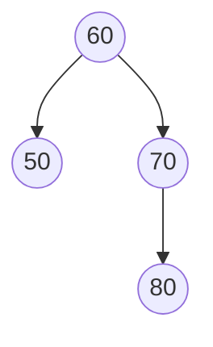

<!-- UGC NET Jun 2026 (22 Jun, Shift 2) · Paper 2 · generated by pyq_extract.py from 0_jun_2026.txt -->

## Q1
Match List-I with List-II.

| List-I | List-II |
|---|---|
| A. Pivot point B. Fixed point C. Mirror image D. Distortion | I. Reflection II. Shear III. Rotation IV. Scaling |

## Q1 - Options
(A) A-III, B-IV, C-I, D-II
(B) A-III, B-IV, C-II, D-I
(C) A-IV, B-III, C-II, D-I
(D) A-I, B-II, C-III, D-IV

## Q1 - Hint
**Answer:** A
**Topic:** 2D Transformations, Reflection, Projection & Clipping
**Source:** UGC NET Jun 2026 (22 Jun, Shift 2) · Paper 2 · Q1

A pivot point remains fixed during rotation, a fixed point is associated with scaling, a mirror image is produced by reflection, and shear produces distortion. Therefore the matching is A-III, B-IV, C-I, D-II.

## Q2
How many edges are there in a graph with 10 vertices, each of degree six?

## Q2 - Options
(A) 60
(B) 45
(C) 20
(D) 30

## Q2 - Hint
**Answer:** D
**Topic:** Graph Theory
**Source:** UGC NET Jun 2026 (22 Jun, Shift 2) · Paper 2 · Q2

By the handshaking lemma, the sum of degrees equals twice the number of edges. The degree sum is 10 × 6 = 60, so the graph has 60/2 = 30 edges. Taking 60 itself would confuse the degree sum with the edge count.

## Q3
Which of the following have true value when the universe of discourse is all integers?

A. ∃n (2n = 3n) 
B. ∃n (n² &gt; n) 
C. ∀n (2n &gt; n) 
D. ∃n (n² = 2) 
E. ∀x∀y ∃z (xy = z)

## Q3 - Options
(A) B, C and E only
(B) A, B and E only
(C) A, B, C and D only
(D) B, C, D and E only

## Q3 - Hint
**Answer:** B
**Topic:** Propositional & Predicate Logic
**Source:** UGC NET Jun 2026 (22 Jun, Shift 2) · Paper 2 · Q3

A is true at n = 0, and B is true, for example at n = 2. C fails at negative integers, D is false because √2 is not an integer, and E is true because the product of any two integers is an integer. Hence A, B and E are true.

## Q4
Arrange the following in the correct order in the context of the OSI model, from bottom to top.

A. Network layer 
B. Physical layer 
C. Presentation layer 
D. Data link layer 
E. Application layer

## Q4 - Options
(A) D, A, C, B, E
(B) A, C, E, B, D
(C) B, D, A, C, E
(D) C, A, B, E, D

## Q4 - Hint
**Answer:** C
**Topic:** OSI Model & Layer Responsibilities
**Source:** UGC NET Jun 2026 (22 Jun, Shift 2) · Paper 2 · Q4

The OSI stack rises from Physical to Data Link to Network to Presentation to Application. Replacing these with the supplied letters gives B, D, A, C, E.

## Q5
Which topology requires a central controller or a hub?

## Q5 - Options
(A) Bus
(B) Star
(C) Mesh
(D) Ring

## Q5 - Hint
**Answer:** B
**Topic:** Data Communication: Modulation, Multiplexing, Media & Topologies
**Source:** UGC NET Jun 2026 (22 Jun, Shift 2) · Paper 2 · Q5

A star topology connects every device to a central hub or switch. Bus and ring topologies use a shared backbone or loop, while a mesh uses multiple direct links.

## Q6
Match List-I with List-II.

| List-I | List-II |
|---|---|
| A. Wait-for graph B. Precedence graph C. Rigorous 2PL D. Strict 2PL | I. Holds all locks until it commits II. Holds write-locks until it commits III. Used to check deadlocks IV. Used to check serializability |

## Q6 - Options
(A) A-III, B-IV, C-I, D-II
(B) A-III, B-IV, C-II, D-I
(C) A-IV, B-I, C-II, D-III
(D) A-IV, B-III, C-II, D-I

## Q6 - Hint
**Answer:** B
**Topic:** Transactions, Schedules, Concurrency Control & Indexing
**Source:** UGC NET Jun 2026 (22 Jun, Shift 2) · Paper 2 · Q6

A wait-for graph is used to detect deadlocks, and a precedence graph is used to test serializability. Rigorous 2PL retains all locks until commit, whereas strict 2PL retains write locks until commit.

## Q7
Match List-I with List-II.

| List-I: SMTP response code | List-II: Description |
|---|---|
| A. 214 B. 421 C. 220 D. 554 | I. Service ready II. Transaction failed III. Help message IV. Service not available |

## Q7 - Options
(A) A-III, B-IV, C-I, D-II
(B) A-IV, B-III, C-I, D-II
(C) A-IV, B-I, C-III, D-II
(D) A-II, B-I, C-IV, D-III

## Q7 - Hint
**Answer:** A
**Topic:** Application Layer & WWW (DNS, Email, HTTP, FTP)
**Source:** UGC NET Jun 2026 (22 Jun, Shift 2) · Paper 2 · Q7

SMTP code 214 is a help message, 421 means service not available, 220 means service ready, and 554 indicates a transaction failed. These pairings produce A-III, B-IV, C-I, D-II.

## Q8
Identify the incorrect statements about protocols used in the TCP/IP protocol suite.

A. IP is a reliable connectionless protocol. 
B. ARP finds a node's physical address from its logical address. 
C. ICMP sends notification of datagram problems to the recipient of the message. 
D. IGMP facilitates simultaneous transmission of a message to a group of recipients.

## Q8 - Options
(A) B and D only
(B) D only
(C) A and C only
(D) A, C and D only

## Q8 - Hint
**Answer:** C
**Topic:** TCP/IP, TCP & UDP Protocols and Headers
**Source:** UGC NET Jun 2026 (22 Jun, Shift 2) · Paper 2 · Q8

IP is connectionless but does not provide reliable delivery, so A is incorrect. ICMP reports errors to the sender/source, not the recipient, so C is incorrect. ARP and IGMP are correctly described.

## Q9
Which technology enables the creation of virtual servers in a cloud-computing environment?

## Q9 - Options
(A) DNS server
(B) Hypervisor
(C) Firewall
(D) Load balancer

## Q9 - Hint
**Answer:** B
**Topic:** Cloud, IoT & Mobile/Wireless
**Source:** UGC NET Jun 2026 (22 Jun, Shift 2) · Paper 2 · Q9

A hypervisor abstracts physical hardware so that several isolated virtual machines can run on a host. DNS, firewalls, and load balancers serve different network or traffic-management roles.

## Q10
Which document outlines the functional and non-functional requirements of a software system?

## Q10 - Options
(A) SRS document
(B) Design document
(C) Test plan
(D) User manual

## Q10 - Hint
**Answer:** A
**Topic:** SDLC Models & Requirements (SRS)
**Source:** UGC NET Jun 2026 (22 Jun, Shift 2) · Paper 2 · Q10

A Software Requirements Specification defines what the system must do and the quality constraints it must meet. Design documents describe implementation choices, while test plans and manuals serve later purposes.

## Q11
What does Amdahl's Law describe in the context of parallel processing?

## Q11 - Options
(A) Maximum speedup achievable, considering serial and parallel portions of a program
(B) Efficiency of message passing in a distributed-memory system
(C) Computational efficiency of a parallel algorithm
(D) Reliability of a fault-tolerant system

## Q11 - Hint
**Answer:** A
**Topic:** Pipelining & Amdahl's Law
**Source:** UGC NET Jun 2026 (22 Jun, Shift 2) · Paper 2 · Q11

Amdahl's Law bounds the speedup obtainable by parallelisation using the fraction that remains serial. Even infinitely fast parallel work cannot remove the serial bottleneck.

## Q12
Arrange the following in terms of capacity from smallest to largest.

A. L3 cache 
B. L1 cache 
C. CPU register 
D. L2 cache

## Q12 - Options
(A) C, D, B, A
(B) C, A, B, D
(C) C, B, D, A
(D) A, C, D, B

## Q12 - Hint
**Answer:** C
**Topic:** Memory Hierarchy, Cache & Access Time
**Source:** UGC NET Jun 2026 (22 Jun, Shift 2) · Paper 2 · Q12

Registers are the smallest storage locations, followed by L1 cache, then L2 cache, and then the larger L3 cache. Thus the increasing-capacity sequence is C, B, D, A.

## Q13
Let ⟨H₁, \*⟩ and ⟨H₂, \*⟩ be subgroups of the group ⟨G, \*⟩. Which statement is false?

## Q13 - Options
(A) H₁H₂ = {h₁ \* h₂ : h₁ ∈ H₁ and h₂ ∈ H₂} is a subgroup.
(B) H₁H₂ is a normal subgroup when H₁ and H₂ are normal subgroups.
(C) ⟨H₁ ∩ H₂, \*⟩ is a subgroup.
(D) The set difference H₁ − H₂ is a subgroup.

## Q13 - Hint
**Answer:** A
**Topic:** Groups, Subgroups & Algebraic Structures
**Source:** UGC NET Jun 2026 (22 Jun, Shift 2) · Paper 2 · Q13

The supplied source confirms option A as the false statement. The product set H₁H₂ need not be a subgroup unless additional conditions, such as normality of one factor, hold. Intersections of subgroups are always subgroups.

## Q14
Which field deals with interaction between computers and humans using natural language?

## Q14 - Options
(A) PROLOG
(B) ELIZA
(C) NLP
(D) LISP

## Q14 - Hint
**Answer:** C
**Topic:** NLP, Bayes Rule, Search, Genetic & Fuzzy Concepts
**Source:** UGC NET Jun 2026 (22 Jun, Shift 2) · Paper 2 · Q14

Natural Language Processing (NLP) is the AI field concerned with computer processing and generation of human language. PROLOG and LISP are programming languages, while ELIZA is an early NLP-style program rather than the name of the field.

## Q15
In rate-monotonic scheduling, a task has a period of 80 ms and an execution time of 55 ms. What are its processor utilisation and task rate?

## Q15 - Options
(A) 0.69, 12.5 Hz
(B) 0.58, 12.3 Hz
(C) 0.48, 11.4 Hz
(D) 0.38, 10.5 Hz

## Q15 - Hint
**Answer:** A
**Topic:** CPU Scheduling (Theory, Numerical, Rate Monotonic)
**Source:** UGC NET Jun 2026 (22 Jun, Shift 2) · Paper 2 · Q15

Utilisation is execution time divided by period: 55/80 = 0.6875, approximately 0.69. The task rate is 1/0.08 seconds = 12.5 Hz. The other rates do not correspond to an 80 ms period.

## Q16
What is the correct sequence of the database-design process?

A. Create conceptual schema 
B. Data model mapping 
C. Requirements collection and analysis 
D. Physical design

## Q16 - Options
(A) C, A, B, D
(B) C, B, A, D
(C) A, B, C, D
(D) A, C, B, D

## Q16 - Hint
**Answer:** A
**Topic:** ER Model & Database Design
**Source:** UGC NET Jun 2026 (22 Jun, Shift 2) · Paper 2 · Q16

Database design starts by collecting and analysing requirements. It then develops a conceptual schema, maps that conceptual model to the selected data model, and finally performs physical design. Therefore the order is C, A, B, D.

## Q17
Choose the correct bottom-to-top order in the OSI model.

A. Transforming datagrams into frames for transmission 
B. Transmission of bits over a communication channel 
C. Handling the user interface 
D. Control and monitoring of the subnet 
E. Transmission using a connection-oriented or connectionless protocol

## Q17 - Options
(A) A, B, C, D, E
(B) B, C, D, E, A
(C) B, A, D, E, C
(D) A, B, D, E, C

## Q17 - Hint
**Answer:** C
**Topic:** OSI Model & Layer Responsibilities
**Source:** UGC NET Jun 2026 (22 Jun, Shift 2) · Paper 2 · Q17

Physical-layer work is B, data-link framing is A, network-layer subnet control is D, transport-layer service is E, and user-facing handling is C. This gives B, A, D, E, C.

## Q18
Given Pred(x) = x − 1 and T(x, y + 1) = Pred(T(x, y)), with T(x, 0) = x, which operation is a candidate for T?

## Q18 - Options
(A) Subtraction operation
(B) Addition operation
(C) Multiplication operation
(D) Division operation

## Q18 - Hint
**Answer:** A
**Topic:** Turing Machines, Decidability & NP-Completeness
**Source:** UGC NET Jun 2026 (22 Jun, Shift 2) · Paper 2 · Q18

The recurrence applies the predecessor operation once for every increment of y. Thus T(x, y) = x − y, which is subtraction; addition would instead require a successor operation.

## Q19
For relation schema r(M, Y, P, MP, C), the functional dependencies are M → MP, {M, Y} → P, and MP → C. Which is a key?

## Q19 - Options
(A) M
(B) {M, Y}
(C) {M, C}
(D) MP

## Q19 - Hint
**Answer:** B
**Topic:** Normalization & Functional Dependencies
**Source:** UGC NET Jun 2026 (22 Jun, Shift 2) · Paper 2 · Q19

From M, we obtain MP and then C, but not Y or P. Adding Y allows {M, Y} → P, so the closure of {M, Y} contains every attribute. Neither M nor MP supplies Y and P, making {M, Y} the key.

## Q20
Which item is a problem in piggybacking acknowledgement frames?

A. There is no need to send separate acknowledgement frames. 
B. It requires more bandwidth. 
C. The data-link layer must decide how long to wait for a packet to which the acknowledgement can be attached. 
D. The number of acknowledgement frames decreases.

## Q20 - Options
(A) A and D only
(B) B only
(C) B and C only
(D) C only

## Q20 - Hint
**Answer:** D
**Topic:** MAC Layer, CSMA/CD, Collision Resolution & Piggybacking
**Source:** UGC NET Jun 2026 (22 Jun, Shift 2) · Paper 2 · Q20

Piggybacking reduces separate acknowledgement frames and saves bandwidth, so A and D are benefits and B is false. Its drawback is deciding how long to delay an acknowledgement while waiting for outgoing data; that is C only.

## Q21
What is the maximum number of nodes that can be inserted in the AVL tree without changing its height?

AVL tree with nodes 60, 50, 70, and 80.

## Q21 - Options
(A) 2
(B) 4
(C) 3
(D) 5

## Q21 - Hint
**Answer:** C
**Topic:** Trees: BST, AVL & Heaps
**Source:** UGC NET Jun 2026 (22 Jun, Shift 2) · Paper 2 · Q21

The displayed tree has height 2 and currently contains 4 nodes. A binary tree of height 2 can contain at most 2³ − 1 = 7 nodes, so 7 − 4 = 3 additional nodes can be inserted without increasing its height.

## Q22
Each relation is defined on {1, 2, 3, 4}. Match List-I with List-II.

| List-I: Relation | List-II: Relation type |
|---|---|
| A. {(2,2), (2,3), (2,4), (3,2), (3,3), (3,4)} B. {(2,4), (4,2)} C. {(1,2), (2,3), (3,4)} D. {(1,3), (1,4), (2,3), (2,4), (3,1), (3,4)} | I. Antisymmetric II. Only transitive III. Only symmetric IV. Neither symmetric nor transitive |

## Q22 - Options
(A) A-II, B-III, C-I, D-IV
(B) A-II, B-III, C-IV, D-I
(C) A-IV, B-III, C-I, D-II
(D) A-I, B-III, C-IV, D-II

## Q22 - Hint
**Answer:** A
**Topic:** Sets, Relations & Power Set
**Source:** UGC NET Jun 2026 (22 Jun, Shift 2) · Paper 2 · Q22

A is transitive: its chained pairs such as (2,3) and (3,4) require (2,4), which is present, but it is not symmetric. B contains both (2,4) and (4,2), making it only symmetric. C has no reversed distinct pair, so it is antisymmetric, while D has neither property. Hence A-II, B-III, C-I, D-IV is the required match.

## Q23
Match List-I with List-II.

| List-I | List-II |
|---|---|
| A. Macros B. Assembler C. Loader D. Compiler | I. Converts high-level code to object (machine) code II. Used for code expansion III. Used to translate assembly-language code to object code IV. Used to allocate memory and relocate a program in memory |

## Q23 - Options
(A) A-IV, B-III, C-I, D-II
(B) A-II, B-III, C-I, D-IV
(C) A-II, B-III, C-IV, D-I
(D) A-IV, B-I, C-III, D-II

## Q23 - Hint
**Answer:** C
**Topic:** System Software (Assemblers, Loaders, Linkers, Macros)
**Source:** UGC NET Jun 2026 (22 Jun, Shift 2) · Paper 2 · Q23

A macro is used for code expansion, an assembler translates assembly language to object code, a loader allocates memory and relocates a program, and a compiler translates high-level code. Therefore A-II, B-III, C-IV, D-I is correct.

## Q24
How many solutions does x + y + z = 11 have, where x, y, and z are non-negative integers?

## Q24 - Options
(A) 33
(B) 66
(C) 68
(D) 78

## Q24 - Hint
**Answer:** D
**Topic:** Probability, Permutation & Combination
**Source:** UGC NET Jun 2026 (22 Jun, Shift 2) · Paper 2 · Q24

By stars and bars, the number of non-negative solutions to x + y + z = 11 is C(11 + 3 − 1, 3 − 1) = C(13, 2) = 78. This counts every allocation of 11 identical units among the three variables.

## Q25
Out of 32 people, 30 save paper and 14 save plastic bottles. If every person saves paper, plastic bottles, or both, how many save both?

## Q25 - Options
(A) 12
(B) 14
(C) 16
(D) 18

## Q25 - Hint
**Answer:** A
**Topic:** Sets, Relations & Power Set
**Source:** UGC NET Jun 2026 (22 Jun, Shift 2) · Paper 2 · Q25

Use inclusion–exclusion: \|paper ∩ plastic\| = \|paper\| + \|plastic\| − \|paper ∪ plastic\| = 30 + 14 − 32 = 12. Adding the two group totals without subtracting the overlap would double-count those 12 people.

## Q26
Arrange these language families from specialization to generalization.

A. All regular languages 
B. All Turing-acceptable languages 
C. All Turing-decidable languages 
D. All context-free languages

## Q26 - Options
(A) A, B, C, D
(B) A, C, B, D
(C) A, D, C, B
(D) A, D, B, C

## Q26 - Hint
**Answer:** C
**Topic:** Chomsky Hierarchy, Grammars & CNF/GNF
**Source:** UGC NET Jun 2026 (22 Jun, Shift 2) · Paper 2 · Q26

Every regular language is context-free; every context-free language is decidable; and every decidable language is Turing-acceptable (recursively enumerable). The inclusions therefore grow as A, D, C, B.

## Q27
What is the maximum Hamming distance among all pairs of the following binary codes?

| Code | Binary value |
|---|---|
| C₁ | 00000 |
| C₂ | 01011 |
| C₃ | 10101 |

## Q27 - Options
(A) 2
(B) 3
(C) 4
(D) 5

## Q27 - Hint
**Answer:** C
**Topic:** Hamming Code, Error Detection & Bit Stuffing
**Source:** UGC NET Jun 2026 (22 Jun, Shift 2) · Paper 2 · Q27

C₁ and C₂ differ in three positions, C₁ and C₃ differ in three positions, while C₂ = 01011 and C₃ = 10101 differ in four positions. Thus the maximum pairwise Hamming distance is 4.

## Q28
Which is not a concern during the management of a software project?

## Q28 - Options
(A) Project/product information
(B) Product quality
(C) Time
(D) Money

## Q28 - Hint
**Answer:** B
**Topic:** COCOMO, Project Management & Risk
**Source:** UGC NET Jun 2026 (22 Jun, Shift 2) · Paper 2 · Q28

The project-management concerns in this classification are information, time, and money. Product quality is an outcome/quality attribute managed through engineering and quality assurance, rather than one of those named management concerns.

## Q29
Which relational-algebra expression is equivalent to the SQL query SELECT X FROM B WHERE Y?

## Q29 - Options
(A) σᵧ(πₓ(B))
(B) πᵧ(σₓ(B))
(C) σₓ(πₓ(B))
(D) πₓ(σᵧ(B))

## Q29 - Hint
**Answer:** D
**Topic:** SQL, Keys & Relational Algebra/Calculus
**Source:** UGC NET Jun 2026 (22 Jun, Shift 2) · Paper 2 · Q29

The WHERE predicate is applied first, so σᵧ selects from relation B. The SELECT list is then applied, so πₓ projects attribute X. Reversing that order can discard the attribute needed by the selection.

## Q30
Which of the following are true?

A. A database may have only one primary key. 
B. Every key is a candidate key. 
C. There can be multiple candidate keys. 
D. There can be more than one superkey. 
E. Every candidate key is a primary key.

## Q30 - Options
(A) A, C, D only
(B) A, D, E only
(C) B, C, D only
(D) B, D, E only

## Q30 - Hint
**Answer:** A
**Topic:** SQL, Keys & Relational Algebra/Calculus
**Source:** UGC NET Jun 2026 (22 Jun, Shift 2) · Paper 2 · Q30

A relation design chooses one candidate key as its primary key, but may have several candidate keys and many superkeys. A superkey need not be minimal, so B is false; only the selected candidate key is primary, so E is false.

## Q31
Match List-I with List-II.

| List-I | List-II |
|---|---|
| A. Commutative law B. Distributive law C. De Morgan law D. Absorption law | I. P ∧ (Q ∨ R) ≡ (P ∧ Q) ∨ (P ∧ R) II. P ∧ (P ∨ Q) ≡ P III. P ∧ Q ≡ Q ∧ P IV. ¬(P ∨ Q) ≡ ¬P ∧ ¬Q |

## Q31 - Options
(A) A-III, B-IV, C-II, D-I
(B) A-II, B-I, C-IV, D-III
(C) A-III, B-I, C-IV, D-II
(D) A-IV, B-II, C-III, D-I

## Q31 - Hint
**Answer:** C
**Topic:** Propositional & Predicate Logic
**Source:** UGC NET Jun 2026 (22 Jun, Shift 2) · Paper 2 · Q31

Commutativity is P ∧ Q ≡ Q ∧ P (III). Distribution is P ∧ (Q ∨ R) ≡ (P ∧ Q) ∨ (P ∧ R) (I), De Morgan's law is ¬(P ∨ Q) ≡ ¬P ∧ ¬Q (IV), and absorption is P ∧ (P ∨ Q) ≡ P (II). Thus the apparently similar formulas in I and II must not be swapped: I expands a conjunction while II removes a redundant disjunction.

## Q32
Match List-I with List-II.

| List-I | List-II |
|---|---|
| A. Merge sort B. Binary search C. Quick sort D. Search in an unsorted array | I. n² II. n log n III. n IV. log n |

## Q32 - Options
(A) A-I, B-IV, C-II, D-III
(B) A-I, B-II, C-III, D-IV
(C) A-II, B-I, C-III, D-IV
(D) A-II, B-IV, C-I, D-III

## Q32 - Hint
**Answer:** D
**Topic:** Sorting Algorithms & Sorting Complexity
**Source:** UGC NET Jun 2026 (22 Jun, Shift 2) · Paper 2 · Q32

Merge sort has O(n log n) complexity, binary search has O(log n), quicksort has O(n²) in the worst case, and searching an unsorted array has O(n). This produces A-II, B-IV, C-I, D-III.

## Q33
Which of the following statements is incorrect?

## Q33 - Options
(A) For a context-free grammar G and string x, membership x ∈ L(G) can be decided in polynomial time.
(B) If L is context-free, then its complement is also context-free.
(C) The language {aⁿbᵐcᵖ : m, n, p ≥ 0, m ≠ n or m ≠ p} is not deterministic context-free.
(D) The class of deterministic context-free languages is closed under intersection.

## Q33 - Hint
**Answer:** B
**Topic:** CFL, PDA, Pumping Lemma & Closure Properties
**Source:** UGC NET Jun 2026 (22 Jun, Shift 2) · Paper 2 · Q33

The supplied source confirms option B as the intended incorrect statement: context-free languages are not closed under complement. The paper designates B as the single answer for this MCQ.

## Q34
For sending input I₆ to the output line of an 8×1 multiplexer, which selection-line combination is required?

## Q34 - Options
(A) 001
(B) 100
(C) 110
(D) 111

## Q34 - Hint
**Answer:** C
**Topic:** Combinational/Sequential Circuits, Flip-Flops & Number Systems
**Source:** UGC NET Jun 2026 (22 Jun, Shift 2) · Paper 2 · Q34

An 8-to-1 multiplexer uses three select bits to encode the input index in binary. Since 6 in binary is 110, the select lines S₂S₁S₀ must be 110; 111 would instead select I₇.

## Q35
Arrange these C++ data types in non-decreasing order of representation length.

A. char 
B. int 
C. float 
D. double

## Q35 - Options
(A) B, A, C, D
(B) A, B, D, C
(C) D, C, B, A
(D) A, B, C, D

## Q35 - Hint
**Answer:** D
**Topic:** Programming Output, Pointers, OOP & Data Types
**Source:** UGC NET Jun 2026 (22 Jun, Shift 2) · Paper 2 · Q35

A char uses the least storage, followed by int; float is normally smaller than double. Hence the non-decreasing order is char, int, float, double: A, B, C, D.

## Q36
The number of leaf nodes in a full 4-ary rooted tree with n nodes is:

## Q36 - Options
(A) n/2
(B) (2n − 1)/4
(C) (n + 1)/4
(D) (3n + 1)/4

## Q36 - Hint
**Answer:** D
**Topic:** Graph Theory
**Source:** UGC NET Jun 2026 (22 Jun, Shift 2) · Paper 2 · Q36

If I is the number of internal nodes, a full 4-ary tree has n = 4I + 1. Its leaves are L = n − I = 3I + 1 = (3n + 1)/4. The other formulas do not satisfy this relation for a full 4-ary tree.

## Q37
Match List-I with List-II.

| List-I: Process model | List-II: Characteristic |
|---|---|
| A. Classical waterfall model B. Prototype model C. Evolutionary model D. Spiral model | I. Risk analysis II. Large problem with incremental delivery III. Clear requirements IV. Requirements are not well understood |

## Q37 - Options
(A) A-I, B-III, C-II, D-IV
(B) A-III, B-IV, C-II, D-I
(C) A-II, B-III, C-IV, D-I
(D) A-IV, B-I, C-III, D-II

## Q37 - Hint
**Answer:** B
**Topic:** SDLC Models & Requirements (SRS)
**Source:** UGC NET Jun 2026 (22 Jun, Shift 2) · Paper 2 · Q37

The classical waterfall model assumes clear requirements. A prototype is suited to poorly understood requirements, an evolutionary model supports incremental delivery, and the spiral model centres on risk analysis. Thus the matching is A-III, B-IV, C-II, D-I.

## Q38
Match List-I with List-II.

| List-I | List-II |
|---|---|
| A. Latency B. Delay C. Throughput D. Interrupt | I. Number of tasks completed in a given time period II. Causes the current activity to be deferred III. Time elapsed before next activity starts IV. Time to complete a single task |

## Q38 - Options
(A) A-I, B-III, C-II, D-IV
(B) A-III, B-IV, C-I, D-II
(C) A-IV, B-II, C-III, D-I
(D) A-IV, B-III, C-I, D-II

## Q38 - Hint
**Answer:** D
**Topic:** COA: Arithmetic, Microprogramming, I/O & Multiprocessors
**Source:** UGC NET Jun 2026 (22 Jun, Shift 2) · Paper 2 · Q38

Latency is the time to complete one task, delay is the time before the next activity starts, throughput is the number of tasks completed per time period, and an interrupt defers the current activity. This gives A-IV, B-III, C-I, D-II.

## Q39
Match List-I with List-II.

| List-I | List-II |
|---|---|
| A. long signed int B. double C. long double D. unsigned character | I. %lf II. %Lf III. %c IV. %ld |

## Q39 - Options
(A) A-II, B-I, C-IV, D-III
(B) A-IV, B-I, C-II, D-III
(C) A-III, B-I, C-II, D-IV
(D) A-I, B-II, C-IV, D-III

## Q39 - Hint
**Answer:** B
**Topic:** Programming Output, Pointers, OOP & Data Types
**Source:** UGC NET Jun 2026 (22 Jun, Shift 2) · Paper 2 · Q39

A long signed int uses %ld, double uses %lf, long double uses %Lf, and an unsigned character is read or printed with %c. Hence the matching is A-IV, B-I, C-II, D-III.

## Q40
Match List-I with List-II.

| List-I: Language | List-II: Type |
|---|---|
| A. L₁ = {aⁿbᵐ \| n, m ≥ 0} B. L₂ = {aⁿbᵐ \| n = m ≥ 0} C. L₃ = {aⁿbⁿcⁿdⁿeⁿ \| n ≥ 1} D. L₄ = {aⁿbᵐcᵐdⁿe² \| n, m ≥ 0} | I. Unrestricted II. Context sensitive III. Regular IV. Context free |

## Q40 - Options
(A) A-III, B-I, C-II, D-IV
(B) A-III, B-IV, C-I, D-II
(C) A-III, B-II, C-IV, D-I
(D) A-II, B-III, C-IV, D-I

## Q40 - Hint
**Answer:** B
**Topic:** Chomsky Hierarchy, Grammars & CNF/GNF
**Source:** UGC NET Jun 2026 (22 Jun, Shift 2) · Paper 2 · Q40

The supplied source annotation designates option B, A-III, B-IV, C-I, D-II, as the intended key. The language definitions are retained exactly as printed so learners can compare the paper's classification convention with the formal language hierarchy.

## Q41
The term "double buffered" is used in which of the following?

## Q41 - Options
(A) Synchronous communication interface
(B) Asynchronous communication interface
(C) Addressing mode
(D) Serial communication

## Q41 - Hint
**Answer:** B
**Topic:** COA: Arithmetic, Microprogramming, I/O & Multiprocessors
**Source:** UGC NET Jun 2026 (22 Jun, Shift 2) · Paper 2 · Q41

Double buffering permits one buffer to be filled while another is consumed, helping asynchronous producer and consumer rates operate smoothly. It is not an addressing mode, and serial communication by itself does not define double buffering.

## Q42
To define the relationship between two entity sets, which operation can be used?

## Q42 - Options
(A) Concatenation
(B) Addition
(C) Cartesian product
(D) Union

## Q42 - Hint
**Answer:** C
**Topic:** ER Model & Database Design
**Source:** UGC NET Jun 2026 (22 Jun, Shift 2) · Paper 2 · Q42

A relationship set is formally a subset of the Cartesian product of participating entity sets. Concatenation, addition, and union do not construct tuples across the two sets in this way.

## Q43
What is the output of this C program?

#include &lt;stdio.h&gt; 
int main() { int i; 
for (i = 0; i++ &lt; 10;) 
printf("%d", i++); 
return 0; 
}

## Q43 - Options
(A) 0123456789
(B) 12345678
(C) 13579
(D) 2468

## Q43 - Hint
**Answer:** C
**Topic:** Programming Output, Pointers, OOP & Data Types
**Source:** UGC NET Jun 2026 (22 Jun, Shift 2) · Paper 2 · Q43

Each loop test increments i once, and printf prints i before incrementing it again. The printed values are therefore 1, 3, 5, 7, and 9; the next condition sees 10 and terminates the loop.

## Q44
For disk tracks numbered 0–49, the head starts at 15 and requests arrive for 4, 40, 11, 35, 7, and 14. Order these algorithms by total head movement in ascending order, assuming initial movement toward higher-numbered tracks when required.

A. FCFS 
B. LOOK 
C. SSTF 
D. SCAN

## Q44 - Options
(A) C, B, D, A
(B) B, A, C, D
(C) C, D, B, A
(D) D, B, C, A

## Q44 - Hint
**Answer:** A
**Topic:** Disk Scheduling, File Systems & RAID
**Source:** UGC NET Jun 2026 (22 Jun, Shift 2) · Paper 2 · Q44

SSTF travels 47 tracks, LOOK travels 61, SCAN travels 79, and FCFS travels 135. Thus the ascending order is SSTF, LOOK, SCAN, FCFS: C, B, D, A.

## Q45
For the primal program max cᵀx subject to Ax ≤ b, which stated dual program is true?

## Q45 - Options
(A) min bᵀy subject to Aᵀy ≤ c, y ≥ 0
(B) min bᵀy subject to Aᵀy ≥ c, y ≥ 0
(C) min bᵀy subject to Aᵀy = c, y ≥ 0
(D) max bᵀy subject to Aᵀy = c

## Q45 - Hint
**Answer:** C
**Topic:** Linear Programming & Transportation Problem
**Source:** UGC NET Jun 2026 (22 Jun, Shift 2) · Paper 2 · Q45

The paper uses the equality-form dual: minimise bᵀy subject to Aᵀy = c and y ≥ 0. Under that convention, option C is the stated dual program.

## Q46
Choose the right sequence of stages for data transmission using CSMA/CD.

A. If the channel is clear, the sender sends data. 
B. The sender senses the channel for activity. 
C. The sender waits for a random back-off time before retransmitting. 
D. Collision detection occurs if two devices transmit at the same time.

## Q46 - Options
(A) A, B, D, C
(B) B, A, D, C
(C) B, A, C, D
(D) C, B, A, D

## Q46 - Hint
**Answer:** B
**Topic:** MAC Layer, CSMA/CD, Collision Resolution & Piggybacking
**Source:** UGC NET Jun 2026 (22 Jun, Shift 2) · Paper 2 · Q46

CSMA/CD first senses the medium, then transmits if it is idle. A collision may be detected during transmission, after which a random back-off precedes retransmission. This is B, A, D, C.

## Q47
Arrange these numbers in ascending order by the number of distinct prime factors.

A. 729 
B. 1001 
C. 1111 
D. 420

## Q47 - Options
(A) A, C, B, D
(B) D, A, B, C
(C) A, B, C, D
(D) D, A, C, B

## Q47 - Hint
**Answer:** A
**Topic:** Discrete Maths: Counting, Induction, Lattices & Number Theory
**Source:** UGC NET Jun 2026 (22 Jun, Shift 2) · Paper 2 · Q47

Factor each number and count unique primes, not repeated powers: 729 = 3⁶ has 1; 1111 = 11 × 101 has 2; 1001 = 7 × 11 × 13 has 3; and 420 = 2² × 3 × 5 × 7 has 4. Sorting those counts from 1 to 4 gives A, C, B, D.

## Q48
A problem of size n requires n² bit operations. What is the largest instance that can be solved in one second if each bit operation takes 10⁻⁹ second?

## Q48 - Options
(A) 10⁹
(B) 3.16 × 10⁴
(C) 3.96 × 10⁷
(D) 2 × 10⁹

## Q48 - Hint
**Answer:** B
**Topic:** Time Complexity, Asymptotic Notation & Recurrences
**Source:** UGC NET Jun 2026 (22 Jun, Shift 2) · Paper 2 · Q48

One second permits 10⁹ operations. Solving n² = 10⁹ gives n = √10⁹ ≈ 3.16 × 10⁴. The larger choices confuse the operation budget with the square root of that budget.

## Q49
Match List-I with List-II.

| List-I | List-II |
|---|---|
| A. Disk scheduling B. Batch processing C. Time sharing D. Interrupt processing | I. Round robin II. SCAN III. LIFO IV. FIFO |

## Q49 - Options
(A) A-III, B-IV, C-II, D-I
(B) A-IV, B-III, C-II, D-I
(C) A-II, B-IV, C-I, D-III
(D) A-II, B-I, C-IV, D-III

## Q49 - Hint
**Answer:** C
**Topic:** CPU Scheduling (Theory, Numerical, Rate Monotonic)
**Source:** UGC NET Jun 2026 (22 Jun, Shift 2) · Paper 2 · Q49

Disk scheduling uses SCAN, batch processing is handled in FIFO order, time sharing uses round robin, and interrupt processing uses LIFO nesting. Therefore the match is A-II, B-IV, C-I, D-III.

## Q50
Classifying email as spam, labeling web pages by context, and voice recognition are examples of which approach?

## Q50 - Options
(A) Reinforcement learning
(B) Shortest-path algorithm
(C) Supervised learning
(D) Unsupervised learning

## Q50 - Hint
**Answer:** C
**Topic:** ANN, Perceptron & Types of Machine Learning
**Source:** UGC NET Jun 2026 (22 Jun, Shift 2) · Paper 2 · Q50

These tasks learn from examples with known labels, such as spam/not spam or a known spoken word. That is supervised learning; unsupervised learning has no target labels, while reinforcement learning optimises rewards through interaction.

## Q51
Match List-I with List-II.

A. Stack 
B. Queue 
C. Linked list 
D. Binary search tree

| List-I | List-II |
|---|---|
| A. Stack B. Queue C. Linked list D. Binary search tree | I. FIFO II. LIFO III. Ordered children IV. Sequentially linked dynamic nodes |

## Q51 - Options
(A) A-IV, B-I, C-II, D-III
(B) A-II, B-I, C-IV, D-III
(C) A-III, B-IV, C-I, D-II
(D) A-II, B-I, C-III, D-IV

## Q51 - Hint
**Answer:** B
**Topic:** Hashing, Stacks, Queues & Linked Lists
**Source:** UGC NET Jun 2026 (22 Jun, Shift 2) · Paper 2 · Q51

A stack follows LIFO (II), a queue follows FIFO (I), a linked list has dynamically sized sequentially linked nodes (IV), and a binary search tree has ordered child nodes (III). Hence A-II, B-I, C-IV, D-III.

## Q52
The combination of selection lines for sending input I₁₄ to the output in the shown 64 × 1 multiplexer is:

64 × 1 multiplexer selection-line diagram.

## Q52 - Options
(A) 001111
(B) 110000
(C) 111100
(D) 001110

## Q52 - Hint
**Answer:** D
**Topic:** Combinational/Sequential Circuits, Flip-Flops & Number Systems
**Source:** UGC NET Jun 2026 (22 Jun, Shift 2) · Paper 2 · Q52

A 64-to-1 multiplexer needs six selection bits. The binary representation of input index 14 is 001110, so S₅…S₀ must be 001110; the other choices represent input indices 15, 48, and 60.

## Q53
Match List-I with List-II.

| List-I | List-II |
|---|---|
| A. SMTP | I. Network layer |
| B. UDP | II. Transport layer |
| C. Ethernet | III. Application layer |
| D. IP | IV. Data-link layer |

## Q53 - Options
(A) A-I, B-II, C-III, D-IV
(B) A-III, B-II, C-IV, D-I
(C) A-II, B-II, C-IV, D-I
(D) A-I, B-III, C-IV, D-II

## Q53 - Hint
**Answer:** B
**Topic:** OSI Model & Layer Responsibilities
**Source:** UGC NET Jun 2026 (22 Jun, Shift 2) · Paper 2 · Q53

SMTP is an application-layer protocol, UDP is transport-layer, Ethernet is data-link-layer, and IP is network-layer. Thus the match is A-III, B-II, C-IV, D-I.

## Q54
For the shown neural network, what are the net input yᵢₙ and final threshold output y?

Neural-network inputs, weights, bias, and threshold function.

## Q54 - Options
(A) yᵢₙ = 2.03, y = 1
(B) yᵢₙ = 1.53, y = 1
(C) yᵢₙ = 1.07, y = 1
(D) yᵢₙ = 0.57, y = 0

## Q54 - Hint
**Answer:** C
**Topic:** ANN, Perceptron & Types of Machine Learning
**Source:** UGC NET Jun 2026 (22 Jun, Shift 2) · Paper 2 · Q54

Using the diagram values, yᵢₙ = (0.5×0.5) + (0.6×−0.8) + (0.8×1) + 0.5 = 1.07. Since the threshold function returns 1 for an input at least 1, y = 1; the alternatives use an incorrect sign, omit a term, or put the total below the threshold.

## Q55
Match List-I with List-II.

A. FDM 
B. Digital circuits 
C. A two-variable function 
D. J-K flip-flop

| List-I | List-II |
|---|---|
| A. FDM B. Digital circuits C. Two-variable function D. J-K flip-flop | I. Four minterms II. Frequency Division Multiplexing III. Universal flip-flop IV. Combinational or sequential |

## Q55 - Options
(A) A-II, B-I, C-IV, D-III
(B) A-II, B-IV, C-I, D-III
(C) A-II, B-III, C-I, D-IV
(D) A-II, B-I, C-III, D-IV

## Q55 - Hint
**Answer:** B
**Topic:** Combinational/Sequential Circuits, Flip-Flops & Number Systems
**Source:** UGC NET Jun 2026 (22 Jun, Shift 2) · Paper 2 · Q55

FDM means frequency-division multiplexing (II). Digital circuits may be combinational or sequential (IV), a two-variable Boolean function has four minterms (I), and the J-K flip-flop is universal (III).

## Q56
The number of pixel columns divided by the number of scan lines displayed by a system is called:

## Q56 - Options
(A) Pixmap
(B) Bitmap
(C) Aspect ratio
(D) Depth

## Q56 - Hint
**Answer:** C
**Topic:** Computer Graphics: Display, Algorithms & 3D
**Source:** UGC NET Jun 2026 (22 Jun, Shift 2) · Paper 2 · Q56

Aspect ratio is the ratio of horizontal pixels (or columns) to vertical scan lines. A bitmap/pixmap is an image representation, while depth refers to bits per pixel.

## Q57
Which is not part of the general activation record of a procedure?

## Q57 - Options
(A) Local data
(B) Global data
(C) Access link
(D) Temporaries

## Q57 - Hint
**Answer:** B
**Topic:** Compilers: Semantic Analysis, Run-time & Optimization
**Source:** UGC NET Jun 2026 (22 Jun, Shift 2) · Paper 2 · Q57

An activation record stores data associated with one invocation: local variables, temporary values, and links for non-local access. Global data has program-wide lifetime and is not stored in each procedure activation record.

## Q58
The number of vertices of odd degree in any graph is:

## Q58 - Options
(A) Odd
(B) Even
(C) n − e
(D) Prime

## Q58 - Hint
**Answer:** B
**Topic:** Graph Theory
**Source:** UGC NET Jun 2026 (22 Jun, Shift 2) · Paper 2 · Q58

By the handshaking lemma, the sum of all vertex degrees equals 2e and is even. An even sum can contain only an even number of odd summands, so odd-degree vertices occur in pairs.

## Q59
Match List-I with List-II.

A. Waterfall model 
B. Agile methodology 
C. Test-driven development 
D. Continuous integration

| List-I | List-II |
|---|---|
| A. Waterfall B. Agile C. TDD D. CI | I. Collaboration/release feedback II. Automated integration III. Fixed sequential steps IV. Tests before code |

## Q59 - Options
(A) A-III, B-I, C-II, D-IV
(B) A-II, B-I, C-IV, D-II
(C) A-I, B-III, C-II, D-IV
(D) A-III, B-I, C-IV, D-II

## Q59 - Hint
**Answer:** D
**Topic:** SDLC Models & Requirements (SRS)
**Source:** UGC NET Jun 2026 (22 Jun, Shift 2) · Paper 2 · Q59

Waterfall is sequential fixed stages (III), Agile uses iterative collaboration and feedback (I), TDD writes tests before implementation (IV), and continuous integration uses frequent integration and automated testing (II).

## Q60
In the worst case, the smallest number of comparisons required by a comparison-based sorting algorithm is:

## Q60 - Options
(A) ⌈log n⌉
(B) ⌈log₂(n!)⌉
(C) ⌈log n(n − 1)⌉
(D) n

## Q60 - Hint
**Answer:** B
**Topic:** Sorting Algorithms & Sorting Complexity
**Source:** UGC NET Jun 2026 (22 Jun, Shift 2) · Paper 2 · Q60

A comparison sort must distinguish among n! possible input orders. Its decision tree therefore needs at least n! leaves, so its worst-case height is at least ⌈log₂(n!)⌉ comparisons.

## Q61
A single bit travels at 3 × 10⁸ m/s through a 12,000 km fibre-optic cable. What is its one-way propagation delay?

## Q61 - Options
(A) 20 ms
(B) 5 ms
(C) 50 ms
(D) 40 ms

## Q61 - Hint
**Answer:** D
**Topic:** Propagation Delay, Bit Rate & Channel Throughput
**Source:** UGC NET Jun 2026 (22 Jun, Shift 2) · Paper 2 · Q61

Convert 12,000 km to 1.2 × 10⁷ m. Divide distance by the stated speed: (1.2 × 10⁷)/(3 × 10⁸) = 0.04 seconds. Multiplying by 1,000 converts this to 40 ms, so option D is correct; 20 ms and 5 ms result from incorrect unit conversion or arithmetic.

## Q62
Which statements about UDP are true?

A. It is called Uniform Data Protocol. 
B. It is called User Datagram Protocol. 
C. It belongs to the Transport layer. 
D. It belongs to the Network layer.

## Q62 - Options
(A) A and C only
(B) B and C only
(C) A and D only
(D) B and D only

## Q62 - Hint
**Answer:** B
**Topic:** TCP/IP, TCP & UDP Protocols and Headers
**Source:** UGC NET Jun 2026 (22 Jun, Shift 2) · Paper 2 · Q62

UDP expands to User Datagram Protocol and operates at the transport layer. IP is a network-layer protocol; “Uniform Data Protocol” is not UDP’s expansion.

## Q63
Match the equivalent propositions in List-I and List-II.

| List-I | List-II |
|---|---|
| A. P → (Q → P) B. P → (Q ∨ R) C. (P → Q) ∧ (R → Q) D. ¬(P ⇔ Q) | I. (P ∨ Q) ∧ ¬(P ∧ Q) II. (P ∨ R) → Q III. (P → Q) ∨ (P → R) IV. ¬P → (P → Q) |

## Q63 - Options
(A) A-IV, B-II, C-III, D-I
(B) A-IV, B-III, C-II, D-I
(C) A-I, B-II, C-III, D-IV
(D) A-I, B-III, C-II, D-IV

## Q63 - Hint
**Answer:** B
**Topic:** Propositional & Predicate Logic
**Source:** UGC NET Jun 2026 (22 Jun, Shift 2) · Paper 2 · Q63

For A, Q → P is ¬Q ∨ P, so P → (Q → P) is ¬P ∨ ¬Q ∨ P, a tautology; IV is also a tautology. For B, P → (Q ∨ R) becomes ¬P ∨ Q ∨ R, exactly III. Applying (X→Q) = ¬X∨Q to C gives (¬P∨Q)∧(¬R∨Q) = ¬(P∨R)∨Q, which is II. Finally ¬(P⇔Q) is true exactly when one, but not both, of P and Q is true, which is I.

## Q64
Which is not a characteristic of linked-list file allocation?

## Q64 - Options
(A) No space is lost to external disk fragmentation, apart from possible internal fragmentation in the final block
(B) Reading files or random access is very fast
(C) The data portion of a block is reduced because a pointer occupies some bytes
(D) The disadvantages can be mitigated with a main-memory File Allocation Table (FAT)

## Q64 - Hint
**Answer:** B
**Topic:** Disk Scheduling, File Systems & RAID
**Source:** UGC NET Jun 2026 (22 Jun, Shift 2) · Paper 2 · Q64

Linked allocation follows pointers one block at a time, so direct/random access is slow. It avoids external fragmentation, reserves pointer space in each block, and FAT can retain the links in memory to improve traversal.

## Q65
A safe expression in relational calculus is guaranteed to yield:

## Q65 - Options
(A) A finite number of tuples
(B) A finite number of attributes
(C) A finite number of null values
(D) A finite number of indices

## Q65 - Hint
**Answer:** A
**Topic:** SQL, Keys & Relational Algebra/Calculus
**Source:** UGC NET Jun 2026 (22 Jun, Shift 2) · Paper 2 · Q65

Safety (range restriction) ensures that query variables range over values drawn from the finite database domain. This prevents an expression from describing infinitely many result tuples.

## Q66
A doctor knows P(s \| m) = 0.70, P(m) = 1/50,000, and P(s) = 0.01, where s is a stiff neck and m is meningitis. Compute P(m \| s).

## Q66 - Options
(A) 0.014
(B) 0.0014
(C) 0.14
(D) 0.00014

## Q66 - Hint
**Answer:** B
**Topic:** NLP, Bayes Rule, Search, Genetic & Fuzzy Concepts
**Source:** UGC NET Jun 2026 (22 Jun, Shift 2) · Paper 2 · Q66

Bayes’ rule gives P(m \| s) = P(s \| m)P(m)/P(s) = 0.70 × (1/50,000) / 0.01 = 0.0014. The disease remains unlikely even after observing the symptom because its prior probability is very small.

## Q67
Let P denote power set and ∅ the empty set. Arrange in non-decreasing cardinality:

A. P({a,b,{a,b}}) 
B. P({∅,a,{a},{{a}}}) 
C. P(P(∅)) 
D. P(P({a})) 
E. P({{a,b},c})

## Q67 - Options
(A) C, D, A, B, E
(B) D, C, E, A, B
(C) C, D, E, A, B
(D) D, C, B, A, E

## Q67 - Hint
**Answer:** C
**Topic:** Sets, Relations & Power Set
**Source:** UGC NET Jun 2026 (22 Jun, Shift 2) · Paper 2 · Q67

P(∅) has one member, so C = P(P(∅)) has 2 members. P({a}) has 2 members, so D has 4; E also has two underlying elements and has 4. A has three underlying elements and therefore 8 members, while B has four and therefore 16. Thus C, D, E, A, B is the listed non-decreasing order.

## Q68
What is the height of the binary search tree formed by inserting 40, 60, 50, 37, 52, 15, 8, 22 in that order?

## Q68 - Options
(A) 4
(B) 3
(C) 2
(D) 1

## Q68 - Hint
**Answer:** B
**Topic:** Trees: BST, AVL & Heaps
**Source:** UGC NET Jun 2026 (22 Jun, Shift 2) · Paper 2 · Q68

The longest root-to-leaf path is 40 → 37 → 15 → 8 (or 40 → 60 → 50 → 52). It has three edges, so under the usual edge-height definition the tree height is 3.

## Q69
Let R = {(1,2),(3,4),(2,2)} and S = {(4,2),(2,5),(3,1),(1,3)}. What is R ∘ S?

## Q69 - Options
(A) {(4,2),(3,2),(2,5)}
(B) {(1,5),(3,2),(2,5)}
(C) {(3,1),(2,5)}
(D) {(2,5),(3,1),(2,3),(3,3)}

## Q69 - Hint
**Answer:** B
**Topic:** Sets, Relations & Power Set
**Source:** UGC NET Jun 2026 (22 Jun, Shift 2) · Paper 2 · Q69

Using the paper's stated composition convention, the resulting relation is {(1,5),(3,2),(2,5)}, which is option B. This convention fixes the order in which the two relation mappings are composed for this question.

## Q70
Which option is the minimized DFA equivalent to the DFA shown?

Original DFA and the four proposed minimized automata.

## Q70 - Options
(A) Option 1
(B) Option 2
(C) Option 3
(D) Option 4

## Q70 - Hint
**Answer:** A
**Topic:** Finite Automata, Regular Languages & DFA Minimization
**Source:** UGC NET Jun 2026 (22 Jun, Shift 2) · Paper 2 · Q70

The accepting state q4 is distinct. The remaining non-accepting states partition into two equivalent behaviours, producing the three-state DFA shown in option 1: an initial state A, state B with a 0 loop, and accepting state C reached on 1.

## Q71
For the reference string 7,0,1,2,0,3,0,4,2,3,0,3,2,1,2,0,1,7,0,1 with three frames, what is the hit ratio under optimal page replacement?

## Q71 - Options
(A) 11/20
(B) 10/20
(C) 9/20
(D) 12/20

## Q71 - Hint
**Answer:** A
**Topic:** Memory Management, Page Replacement & Thrashing
**Source:** UGC NET Jun 2026 (22 Jun, Shift 2) · Paper 2 · Q71

Simulating OPT gives 11 hits in the 20 references. On each miss with full frames, OPT replaces the resident page whose next use is farthest in the future (or never occurs again), so the hit ratio is 11/20.

## Q72
Average main-memory access time is 130 ns, cache access time is 100 ns, and the cache hit ratio is 75%. What is the average time to access a word?

## Q72 - Options
(A) 130 ns
(B) 150 ns
(C) 132.5 ns
(D) 107.5 ns

## Q72 - Hint
**Answer:** D
**Topic:** Memory Hierarchy, Cache & Access Time
**Source:** UGC NET Jun 2026 (22 Jun, Shift 2) · Paper 2 · Q72

Separate the accesses into 75 cache hits and 25 misses per 100 references. Those contribute 75 × 100 ns and 25 × 130 ns respectively, totalling 10,750 ns; dividing by 100 gives 107.5 ns. The other answers omit the hit ratio or reverse the two access times.

## Q73
Which IC family has the lowest power consumption?

## Q73 - Options
(A) ECL
(B) MOS
(C) TTL
(D) CMOS

## Q73 - Hint
**Answer:** D
**Topic:** Combinational/Sequential Circuits, Flip-Flops & Number Systems
**Source:** UGC NET Jun 2026 (22 Jun, Shift 2) · Paper 2 · Q73

CMOS has very low static power consumption because its complementary transistor pair ideally draws significant current only while switching. ECL and TTL consume substantially more steady power.

## Q74
How will the shown min-heap appear after inserting key 32?

Original min-heap and the four candidate heaps after insertion.

## Q74 - Options
(A) Option 1
(B) Option 2
(C) Option 3
(D) Option 4

## Q74 - Hint
**Answer:** C
**Topic:** Trees: BST, AVL & Heaps
**Source:** UGC NET Jun 2026 (22 Jun, Shift 2) · Paper 2 · Q74

The new key is first placed at the next open leaf, as the left child of 40. Since 32 &lt; 40, it swaps once with 40; it then stops because 32 &gt; its new parent 10. This is exactly the heap shown in option 3.

## Q75
What is the maximum bit rate of a noiseless channel with bandwidth 2 kHz transmitting a signal with 8 levels?

## Q75 - Options
(A) 12000 bps
(B) 16000 bps
(C) 4000 bps
(D) 32000 bps

## Q75 - Hint
**Answer:** A
**Topic:** Propagation Delay, Bit Rate & Channel Throughput
**Source:** UGC NET Jun 2026 (22 Jun, Shift 2) · Paper 2 · Q75

By the Nyquist formula, maximum bit rate = 2B log₂L = 2 × 2000 × log₂8 = 4000 × 3 = 12,000 bps. Using 8 directly rather than log₂8 produces the larger distractors.

## Q76
Which of the following is not an interprocess communication mechanism in UNIX?

## Q76 - Options
(A) Pipes
(B) Messages
(C) Shared memory
(D) Semaphore

## Q76 - Hint
**Answer:** D
**Topic:** Process Management, IPC, Semaphores & Threads
**Source:** UGC NET Jun 2026 (22 Jun, Shift 2) · Paper 2 · Q76

Pipes, message queues, and shared memory transfer information between processes. A semaphore is principally a synchronization primitive: it coordinates access rather than carrying a message payload.

## Q77
Which statements about C++ constructors are correct?

A. They have the same name as the class. 
B. They can return values. 
C. They are called automatically when an object is created. 
D. They can be overloaded. 
E. They can be inherited.

## Q77 - Options
(A) A, B, C and D only
(B) A, C and D only
(C) B, C and D only
(D) C, D and E only

## Q77 - Hint
**Answer:** B
**Topic:** Programming Output, Pointers, OOP & Data Types
**Source:** UGC NET Jun 2026 (22 Jun, Shift 2) · Paper 2 · Q77

A constructor is named for its class, is invoked on object creation, and may be overloaded. It has no return type or return value, and constructors are not inherited, so A, C, and D are the correct statements.

## Q78
A tree is:

A. a circuitless connected graph 
B. a connected graph of n vertices with (n − 1) edges 
C. a circuitless graph of n vertices with (n − 1) edges 
D. a minimally connected graph

## Q78 - Options
(A) A, B and C only
(B) B, C and D only
(C) A, B, C and D
(D) A and B only

## Q78 - Hint
**Answer:** C
**Topic:** Graph Theory
**Source:** UGC NET Jun 2026 (22 Jun, Shift 2) · Paper 2 · Q78

These are equivalent characterisations of a finite tree. A connected acyclic graph has n − 1 edges; an acyclic graph with n − 1 edges is connected; and every edge is necessary for connectivity, which is minimal connectedness.

## Q79
If f(n) = θ(g(n)) and g(n) = O(h(n)), which statement is true?

## Q79 - Options
(A) f(n) = O(h(n))
(B) f(n) = θ(h(n))
(C) h(n) = O(f(n))
(D) h(n) = θ(f(n))

## Q79 - Hint
**Answer:** A
**Topic:** Time Complexity, Asymptotic Notation & Recurrences
**Source:** UGC NET Jun 2026 (22 Jun, Shift 2) · Paper 2 · Q79

f(n) = θ(g(n)) implies f(n) = O(g(n)). Combining this with g(n) = O(h(n)) and transitivity of big-O gives f(n) = O(h(n)). The information does not establish a reverse bound, so the theta claims need not hold.

## Q80
What is z after this C code executes?

x = 16; 
y = 4; 
z = x &gt;&gt; y;

## Q80 - Options
(A) 5
(B) 4
(C) 2
(D) 1

## Q80 - Hint
**Answer:** D
**Topic:** Programming Output, Pointers, OOP & Data Types
**Source:** UGC NET Jun 2026 (22 Jun, Shift 2) · Paper 2 · Q80

Right shifting a positive integer by four places divides it by 2⁴. Thus 16 &gt;&gt; 4 equals 16 / 16 = 1; the other answers correspond to fewer shifts or a different operation.

## Q81
Simplify F(A,B,C,D) = Σm(3,6,7,11,12,13,14,15) using a four-variable Karnaugh map.

## Q81 - Options
(A) ĀB + B̄C + C̄D
(B) ĀB + C̄D + AB̄
(C) AB + BC + CD
(D) CD + AC̄ + BD

## Q81 - Hint
**Answer:** C
**Topic:** K-Map, SOP & Boolean Laws
**Source:** UGC NET Jun 2026 (22 Jun, Shift 2) · Paper 2 · Q81

The four adjacent cells m12, m13, m14, and m15 form the product AB. The cells m6, m7, m14, and m15 form BC. The cells m3, m7, m11, and m15 form CD. Evaluating AB + BC + CD therefore yields true precisely for 3, 6, 7, 11, 12, 13, 14, and 15. For example, m3 is covered by CD, m6 by BC, and m12 by AB; no product term turns on a minterm outside the stated set. Hence option C is the minimal correct form.

## Q82
Which additional property must a group (G, \*) satisfy to be an abelian group?

## Q82 - Options
(A) Commutative
(B) Identity
(C) Inverse
(D) Associativity

## Q82 - Hint
**Answer:** A
**Topic:** Groups, Subgroups & Algebraic Structures
**Source:** UGC NET Jun 2026 (22 Jun, Shift 2) · Paper 2 · Q82

A group already has an associative operation, an identity, and inverses. It is called abelian precisely when its operation is also commutative: a \* b = b \* a for every pair of group elements.

## Q83
The shown transformation is a reflection about which axis?

Original and reflected triangle positions about the vertical axis.

## Q83 - Options
(A) A and D only
(B) A and C only
(C) B and C only
(D) B and D only

## Q83 - Hint
**Answer:** C
**Topic:** 2D Transformations, Reflection, Projection & Clipping
**Source:** UGC NET Jun 2026 (22 Jun, Shift 2) · Paper 2 · Q83

The object moves from the left side of the vertical axis to the right side while retaining its vertical coordinates and reversing left/right orientation. Thus it is a reflection about the y-axis, equivalently the line x = 0. Statements B and C describe the same reflection.

## Q84
What is memory interleaving?

## Q84 - Options
(A) Layering memory stacks one above another
(B) A hierarchy of different memory types
(C) Dividing memory into modules so the CPU can access multiple modules simultaneously
(D) Combining different memory types

## Q84 - Hint
**Answer:** C
**Topic:** Memory Hierarchy, Cache & Access Time
**Source:** UGC NET Jun 2026 (22 Jun, Shift 2) · Paper 2 · Q84

Interleaved memory distributes consecutive addresses across independent memory modules. While one module completes an access, another can begin the next, improving throughput through overlapping accesses.

## Q85
Match List-I with List-II.

A. Planar graph 
B. Bipartite graph 
C. PERT 
D. CPM

| List-I | List-II |
|---|---|
| A. Planar graph B. Bipartite graph C. PERT D. CPM | I. Probabilistic model II. Deterministic model III. 4-colourable IV. 2-colourable |

## Q85 - Options
(A) A-II, B-IV, C-I, D-III
(B) A-III, B-IV, C-I, D-II
(C) A-II, B-IV, C-I, D-III
(D) A-III, B-IV, C-II, D-I

## Q85 - Hint
**Answer:** B
**Topic:** Graph Theory
**Source:** UGC NET Jun 2026 (22 Jun, Shift 2) · Paper 2 · Q85

A planar graph is four-colourable (III), a bipartite graph is two-colourable (IV), PERT is probabilistic (I), and CPM is deterministic (II). This gives A-III, B-IV, C-I, D-II.

## Q86
Match List-I with List-II.

A. Data-link layer 
B. Network layer 
C. Transport layer 
D. Presentation layer

| List-I | List-II |
|---|---|
| A. Data-link B. Network C. Transport D. Presentation | I. Encryption II. Connection control III. Routing IV. Framing |

## Q86 - Options
(A) A-IV, B-III, C-I, D-II
(B) A-III, B-IV, C-II, D-I
(C) A-IV, B-II, C-III, D-I
(D) A-IV, B-III, C-II, D-I

## Q86 - Hint
**Answer:** D
**Topic:** OSI Model & Layer Responsibilities
**Source:** UGC NET Jun 2026 (22 Jun, Shift 2) · Paper 2 · Q86

The data-link layer performs framing (IV), the network layer performs routing (III), the transport layer provides connection control (II), and the presentation layer handles encryption/representation (I).

## Q87
A BST is formed by inserting Mathematics, Physics, Geography, Zoology, Metrology, Geology, Psychology, and Chemistry in dictionary order. Arrange these words in increasing order of their tree level:

A. Mathematics 
B. Zoology 
C. Psychology 
D. Physics

## Q87 - Options
(A) A, D, C, B
(B) A, C, D, B
(C) A, D, B, C
(D) C, B, D, A

## Q87 - Hint
**Answer:** C
**Topic:** Trees: BST, AVL & Heaps
**Source:** UGC NET Jun 2026 (22 Jun, Shift 2) · Paper 2 · Q87

Mathematics is the root (level 0). Physics is its right child (level 1). Zoology is to the right of Physics (level 2), while Psychology lies to the left of Zoology (level 3). Thus the required increasing-level order is A, D, B, C.

## Q88
In open addressing, how are collisions typically resolved?

## Q88 - Options
(A) By probing to find the next available table slot
(B) By creating a linked list at the collision point
(C) By rehashing the entire table
(D) By storing colliding elements in a separate array

## Q88 - Hint
**Answer:** A
**Topic:** Hashing, Stacks, Queues & Linked Lists
**Source:** UGC NET Jun 2026 (22 Jun, Shift 2) · Paper 2 · Q88

Open addressing stores every key in the hash table itself. On a collision it probes alternative positions, for example by linear probing, quadratic probing, or double hashing, until an unused slot is found.

## Q89
If L₁ is a regular language and L₂ is a context-free language, which statement is correct?

## Q89 - Options
(A) Any subset of L₁ ∪ L₂ is context-free
(B) L₁ ∩ L₂ is context-free
(C) L₁ / L₂ is regular
(D) L₁ ∩ L₂ is accepted by a deterministic pushdown automaton

## Q89 - Hint
**Answer:** B
**Topic:** CFL, PDA, Pumping Lemma & Closure Properties
**Source:** UGC NET Jun 2026 (22 Jun, Shift 2) · Paper 2 · Q89

Context-free languages are closed under intersection with regular languages. Construct a product of a pushdown automaton for L₂ and a finite automaton for L₁ to recognise L₁ ∩ L₂. CFLs are not closed under arbitrary subsets or intersection with another CFL, and the resulting CFL need not be deterministic.

## Q90
Which statement may be false for a decision problem X ∈ NP?

## Q90 - Options
(A) X can be solved in nondeterministic polynomial time
(B) X can be solved in exponential time
(C) X can be solved in polynomial space
(D) X can be solved in deterministic polynomial time

## Q90 - Hint
**Answer:** D
**Topic:** Turing Machines, Decidability & NP-Completeness
**Source:** UGC NET Jun 2026 (22 Jun, Shift 2) · Paper 2 · Q90

Membership in NP guarantees a nondeterministic polynomial-time algorithm. Such a computation can be simulated deterministically in exponential time and therefore uses at most polynomial space for a bounded path, but whether every NP problem has a deterministic polynomial-time algorithm is exactly the unresolved P versus NP question.

## Q91
A program takes 100 man-days to write in FORTRAN. Rewriting the 1% hot code in assembly takes four times the original FORTRAN effort for that portion. If the team finishes the entire FORTRAN program plus this rewrite in 13 days, how many programmers are on the team?

## Q91 - Options
(A) 13 programmers
(B) 10 programmers
(C) 8 programmers
(D) 100/13 programmers

## Q91 - Hint
**Answer:** C
**Topic:** COCOMO, Project Management & Risk
**Source:** UGC NET Jun 2026 (22 Jun, Shift 2) · Paper 2 · Q91

Writing the full FORTRAN program costs 100 man-days. Rewriting 1% costs 4 × 1 = 4 further man-days, for a total of 104 man-days. Dividing 104 by 13 calendar days gives 8 programmers.

## Q92
In the given program, 1% of the code accounts for 50% of execution time. What percentage decrease in execution time results from rewriting that 1% in assembly language, which runs five times faster?

## Q92 - Options
(A) 20%
(B) 32%
(C) 40%
(D) 60%

## Q92 - Hint
**Answer:** C
**Topic:** Pipelining & Amdahl's Law
**Source:** UGC NET Jun 2026 (22 Jun, Shift 2) · Paper 2 · Q92

Treat the original runtime as 100 units. The unchanged 99% of code takes 50 units; the hot 1% originally takes 50 but after a 5× speedup takes 10. The new total is 60, so the reduction is 100 − 60 = 40%.

## Q93
If 99% of the program is written in FORTRAN and 1% directly in assembly, what is the percentage increase in programming time compared with writing all FORTRAN first and then rewriting the 1% in assembly?

## Q93 - Options
(A) 10%
(B) 5%
(C) 13%
(D) 8%

## Q93 - Hint
**Answer:** B
**Topic:** COCOMO, Project Management & Risk
**Source:** UGC NET Jun 2026 (22 Jun, Shift 2) · Paper 2 · Q93

Writing 99% in FORTRAN costs 99 man-days and writing 1% directly in assembly costs 10 man-days, totalling 109. The alternative costs 100 + 4 = 104 man-days. The increase is (109 − 104)/104 × 100 ≈ 4.81%, which rounds to 5%.

## Q94
How many days will two programmers take to write the whole program in FORTRAN and then rewrite the 1% hot code in assembly language?

## Q94 - Options
(A) 52
(B) 53
(C) 54
(D) 55

## Q94 - Hint
**Answer:** A
**Topic:** COCOMO, Project Management & Risk
**Source:** UGC NET Jun 2026 (22 Jun, Shift 2) · Paper 2 · Q94

The complete FORTRAN version costs 100 man-days. Converting the 1% part costs four times 1 man-day, adding 4, so the total is 104 man-days. Two programmers complete 104/2 = 52 days of work.

## Q95
If 99% of the program is written in FORTRAN and 1% in assembly, what is the percentage increase in execution time compared with writing the whole program in FORTRAN and then rewriting the 1% in assembly?

## Q95 - Options
(A) 0.9%
(B) 1%
(C) 0.1%
(D) 0%

## Q95 - Hint
**Answer:** D
**Topic:** Pipelining & Amdahl's Law
**Source:** UGC NET Jun 2026 (22 Jun, Shift 2) · Paper 2 · Q95

Both alternatives execute the same final language mix: 99% FORTRAN and the same 1% hot code in assembly. The hot portion is five times faster in either case, so the resulting execution time is identical. Therefore the increase is 0%.

## Q96
For the grammar S → AB; B → +AB \| ε; A → CD; D → \*CD \| ε; C → [S] \| x, find FOLLOW(A) and FOLLOW(C).

## Q96 - Options
(A) FOLLOW(A) = {], $}; FOLLOW(C) = {+, ], $}
(B) FOLLOW(A) = {+, ], $}; FOLLOW(C) = {\*, +, ], $}
(C) FOLLOW(A) = {*, $, [}; FOLLOW(C) = {*, [, $}
(D) FOLLOW(A) = {\*, ], $}; FOLLOW(C) = {+, ], $}

## Q96 - Hint
**Answer:** B
**Topic:** Parsing, FIRST/FOLLOW, Compiler Phases & Three-Address Code
**Source:** UGC NET Jun 2026 (22 Jun, Shift 2) · Paper 2 · Q96

In S → AB, FIRST(B) contributes + to FOLLOW(A), and because B can derive ε, FOLLOW(S) = {], $} also contributes. In A → CD, FIRST(D) contributes \* to FOLLOW(C); D can derive ε, so FOLLOW(A) also contributes +, ], and $. Therefore FOLLOW(A) = {+, ], $} and FOLLOW(C) = {\*, +, ], $}.

## Q97
For the grammar S → AB; B → +AB \| ε; A → CD; D → \*CD \| ε; C → [S] \| x, identify the correct statement.

## Q97 - Options
(A) The grammar is left recursive
(B) The grammar needs left factorization
(C) [[x\*x]+x] is a valid sentence of the grammar
(D) The grammar has an SLR(0) parser

## Q97 - Hint
**Answer:** C
**Topic:** Parsing, FIRST/FOLLOW, Compiler Phases & Three-Address Code
**Source:** UGC NET Jun 2026 (22 Jun, Shift 2) · Paper 2 · Q97

The grammar generates expressions made from x and bracketed S expressions, with D adding repeated multiplication and B adding repeated addition. Thus [[x\*x]+x] derives through C → [S], S → AB, and the recursive B/D productions. It is neither left recursive nor left-factored, and “SLR(0)” is not a parser class.

## Q98
For the grammar S → AB; B → +AB \| ε; A → CD; D → \*CD \| ε; C → [S] \| x, how many non-blank LL(1) table entries occur in the B and D rows?

## Q98 - Options
(A) B = 3; D = 4
(B) B = 6; D = 5
(C) B = 2; D = 3
(D) B = 1; D = 2

## Q98 - Hint
**Answer:** A
**Topic:** Parsing, FIRST/FOLLOW, Compiler Phases & Three-Address Code
**Source:** UGC NET Jun 2026 (22 Jun, Shift 2) · Paper 2 · Q98

For B → +AB, FIRST is {+}, so M[B,+] is one non-blank entry. Because B → ε, put that production under every symbol in FOLLOW(B) = {], $}, yielding two more entries and B = 3. Likewise D → *CD gives M[D,*], while D → ε is entered for FOLLOW(D) = {+, ], $}; that is one plus three, so D = 4.

## Q99
For the grammar S → AB; B → +AB \| ε; A → CD; D → \*CD \| ε; C → [S] \| x, find FIRST(S) and FIRST(D).

## Q99 - Options
(A) FIRST(S) = {+, [, x}; FIRST(D) = {+, \*}
(B) FIRST(S) = {[, ], x}; FIRST(D) = {+, ε}
(C) FIRST(S) = {[, x}; FIRST(D) = {\*, ε}
(D) FIRST(S) = {[, x, ε}; FIRST(D) = {\*, ε}

## Q99 - Hint
**Answer:** C
**Topic:** Parsing, FIRST/FOLLOW, Compiler Phases & Three-Address Code
**Source:** UGC NET Jun 2026 (22 Jun, Shift 2) · Paper 2 · Q99

S begins with A, A begins with C, and C begins only with [ or x, so FIRST(S) = {[, x}. D directly derives *CD or ε, hence FIRST(D) = {*, ε}.

## Q100
For the augmented grammar S′ → S; S → AB; B → +AB \| ε; A → CD; D → \*CD \| ε; C → [S] \| x, how many productions are in the I₁ state of the canonical LR(0) set?

## Q100 - Options
(A) 1
(B) 2
(C) 4
(D) 6

## Q100 - Hint
**Answer:** A
**Topic:** Parsing, FIRST/FOLLOW, Compiler Phases & Three-Address Code
**Source:** UGC NET Jun 2026 (22 Jun, Shift 2) · Paper 2 · Q100

I₀ contains S′ → ·S together with the closure productions for S, A, and C. Taking GOTO(I₀, S) produces I₁ = {S′ → S·}; the dot is at the end, so no closure expansion is added. Thus I₁ has exactly one item/production.
