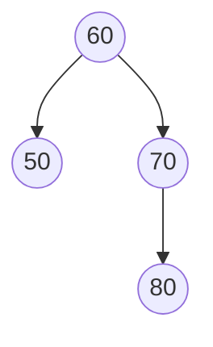

<!-- GENERATED by pyq_build.py - ★ T1 · Trees: BST, AVL & Heaps - do not hand-edit, rebuild instead -->

## Q1
What is the maximum number of nodes that can be inserted in the AVL tree without changing its height?

AVL tree with nodes 60, 50, 70, and 80.

## Q1 - Options
(A) 2
(B) 4
(C) 3
(D) 5

## Q1 - Hint
**Answer:** C
**Topic:** Trees: BST, AVL & Heaps
**Source:** UGC NET Jun 2026 (22 Jun, Shift 2) · Paper 2 · Q21

The displayed tree has height 2 and currently contains 4 nodes. A binary tree of height 2 can contain at most 2³ − 1 = 7 nodes, so 7 − 4 = 3 additional nodes can be inserted without increasing its height.

## Q2
What is the height of the binary search tree formed by inserting 40, 60, 50, 37, 52, 15, 8, 22 in that order?

## Q2 - Options
(A) 4
(B) 3
(C) 2
(D) 1

## Q2 - Hint
**Answer:** B
**Topic:** Trees: BST, AVL & Heaps
**Source:** UGC NET Jun 2026 (22 Jun, Shift 2) · Paper 2 · Q68

The longest root-to-leaf path is 40 → 37 → 15 → 8 (or 40 → 60 → 50 → 52). It has three edges, so under the usual edge-height definition the tree height is 3.

## Q3
How will the shown min-heap appear after inserting key 32?

Original min-heap and the four candidate heaps after insertion.

## Q3 - Options
(A) Option 1
(B) Option 2
(C) Option 3
(D) Option 4

## Q3 - Hint
**Answer:** C
**Topic:** Trees: BST, AVL & Heaps
**Source:** UGC NET Jun 2026 (22 Jun, Shift 2) · Paper 2 · Q74

The new key is first placed at the next open leaf, as the left child of 40. Since 32 &lt; 40, it swaps once with 40; it then stops because 32 &gt; its new parent 10. This is exactly the heap shown in option 3.

## Q4
A BST is formed by inserting Mathematics, Physics, Geography, Zoology, Metrology, Geology, Psychology, and Chemistry in dictionary order. Arrange these words in increasing order of their tree level:

A. Mathematics 
B. Zoology 
C. Psychology 
D. Physics

## Q4 - Options
(A) A, D, C, B
(B) A, C, D, B
(C) A, D, B, C
(D) C, B, D, A

## Q4 - Hint
**Answer:** C
**Topic:** Trees: BST, AVL & Heaps
**Source:** UGC NET Jun 2026 (22 Jun, Shift 2) · Paper 2 · Q87

Mathematics is the root (level 0). Physics is its right child (level 1). Zoology is to the right of Physics (level 2), while Psychology lies to the left of Zoology (level 3). Thus the required increasing-level order is A, D, B, C.

## Q5
The inorder and preorder traversal of a binary tree are d, b, e, a, f, c, g and a, b, d, e, c, f, g respectively. The postorder traversal of the binary tree is

## Q5 - Options
(A) d, e, b, f, g, c, a
(B) e, d, b, g, f, c, a
(C) e, d, b, f, g, c, a
(D) d, e, f, g, b, c, a

## Q5 - Hint
**Answer:** A
**Topic:** Trees: BST, AVL & Heaps
**Source:** UGC NET Jan 2026 (2 Jan, Shift 1) · Paper 2 · Q8

The first element of a preorder sequence is always the tree's root, so a is the root, and its position in the inorder sequence splits the tree into a left subtree {d, b, e} and a right subtree {f, c, g}.

Within the left subtree, preorder b, d, e makes b the root, and inorder d, b, e places d as its left child and e as its right child.

Within the right subtree, preorder c, f, g makes c the root, and inorder f, c, g places f as its left child and g as its right child.

Postorder visits left, then right, then the root at every level, giving d, e, b for the left subtree, f, g, c for the right subtree, and a last, so the full sequence is d, e, b, f, g, c, a.

## Q6
Consider a B⁺ tree in which the maximum number of keys in a node is 5. What is the minimum number of keys in any non-root node?

## Q6 - Options
(A) 1
(B) 2
(C) 3
(D) 4

## Q6 - Hint
**Answer:** B
**Topic:** Trees: BST, AVL & Heaps
**Source:** UGC NET Jan 2026 (2 Jan, Shift 1) · Paper 2 · Q89

In a B⁺ tree, the maximum number of keys per node equals the order n minus 1, so a maximum of 5 keys gives n - 1 = 5, meaning order n = 6.

Minimum keys in a non-root node = ⌈n/2⌉ - 1 = ⌈6/2⌉ - 1 = 3 - 1 = 2

Every non-root node must therefore hold at least 2 keys to keep the tree at least half full.

## Q7
Which trees are height balanced: binary search tree, AVL tree, red-black tree, and B-tree?

## Q7 - Options
(A) A and D only
(B) A, B, and D only
(C) C and D only
(D) B and C only

## Q7 - Hint
**Answer:** C, D
**Topic:** Trees: BST, AVL & Heaps
**Source:** UGC NET Jun 2025 (26 Jun, Shift 1) · Paper 2 · Q67

An ordinary binary-search tree has no balancing guarantee. AVL trees enforce a strict height-balance condition, while red-black trees guarantee logarithmic height through black-height constraints. The term “height balanced” is also used broadly for B-trees because all leaves are at the same level; the supplied options therefore reflect two defensible conventions.

## Q8
Which descriptions are true?

A. Red-black tree guarantees O(log n) worst-case search, insertion and deletion. 
B. Trie supports efficient prefix-based searches. 
C. AVL tree is a self-balancing binary search tree with stricter balance criteria. 
D. B-tree supports efficient disk-based search, insertion and deletion.

## Q8 - Options
(A) A and B only
(B) C and D only
(C) B only
(D) A, B and D only

## Q8 - Hint
**Answer:** D
**Topic:** Trees: BST, AVL & Heaps
**Source:** UGC NET Jan 2025 (6 Jan, Shift 1) · Paper 2 · Q21

The official final answer key marks this item as dropped. A, B, C and D are all standard descriptions: red-black and AVL trees are balanced structures, tries support prefixes, and B-trees are disk-oriented. Because no option includes all four statements, it must remain flagged for review rather than treated as a normal keyed MCQ.

## Q9
Considering the binary tree shown, what will be the inorder traversal?

| Node | Left child | Right child |
|---|---|---|
| A | B | C |
| C | D | E |
| E | — | F |
| F | G | H |

## Q9 - Options
(A) B A D C E G F H
(B) G H F E D C B A
(C) B A C D E G F H
(D) G H F D E B C A

## Q9 - Hint
**Answer:** A
**Topic:** Trees: BST, AVL & Heaps
**Source:** UGC NET Jan 2025 (6 Jan, Shift 1) · Paper 2 · Q51

Inorder traversal visits left subtree, root, then right subtree. Starting at A gives B, A, D, C, E, G, F, H. The correct option follows from the stated definition or calculation; the other options omit a necessary condition or describe a different concept.

## Q10
Arrange the steps of inorder traversal of a binary tree.

A. Visit the left subtree. 
B. Visit the root node. 
C. Visit the right subtree. 
D. Start traversing by visiting nodes in the rooted tree. 
E. Repeat the above three steps.

## Q10 - Options
(A) A, B, C, D, E
(B) E, A, B, C, D
(C) D, A, B, C, E
(D) D, A, E, B, C

## Q10 - Hint
**Answer:** C
**Topic:** Trees: BST, AVL & Heaps
**Source:** UGC NET Jan 2025 (6 Jan, Shift 1) · Paper 2 · Q77

Traversal begins at the rooted tree, then recursively visits left subtree, root and right subtree, repeating that three-step process: D, A, B, C, E. The correct option follows from the stated definition or calculation; the other options omit a necessary condition or describe a different concept.

## Q11
\_\_\_\_\_\_\_\_\_\_\_is a Self Balancing binary search tree, where the path from the root to the furthest leaf is no more than twice as long as the path from the root to nearest leaf.

## Q11 - Options
(A) Expression tree
(B) Game tree
(C) Red-Black tree
(D) Threaded tree

## Q11 - Hint
**Answer:** C
**Topic:** Trees: BST, AVL & Heaps
**Source:** UGC NET Aug 2024 (23 Aug, Shift 1) · Paper 2 · Q60

A red-black tree is the self-balancing binary search tree whose colouring rules guarantee that the longest root-to-leaf path is at most twice the shortest, keeping search, insertion and deletion at O(log n). Expression, game and threaded trees carry no such balance guarantee. Option C is correct.

## Q12
Which of the following is TRUE ?

## Q12 - Options
(A) The cost of searching an AVL tree is @ (log n) but that of binary search is 0(n)
(B) The cost of searching an AVL tree in @ (log n) but that of complete binary tree is @ (n log n)
(C) The cost of searching a binary tree is O(log n) but that of AVL tree is @ (n)
(D) The cost of searching an AVL tree is @ (n log n) but that of binary search tree is 0(n)

## Q12 - Hint
**Answer:** A
**Topic:** Trees: BST, AVL & Heaps
**Source:** UGC NET Dec 2023 (7 Dec, Shift 2) · Paper 2 · Q3

The key idea is stated in the problem: Which of the following is TRUE ?. The correct answer is A: The cost of searching an AVL tree is @ (log n) but that of binary search is 0(n). It follows the governing definition, algorithm, or calculation in this data structures and algorithms item; the other choices fail to satisfy one or more stated conditions.

## Q13
2-3-4 trees are B - trees of order 4. They are isometric of trees.

## Q13 - Options
(A) AVL
(B) AA
(C) 2-3
(D) Red-Black

## Q13 - Hint
**Answer:** D
**Topic:** Trees: BST, AVL & Heaps
**Source:** UGC NET Dec 2023 (7 Dec, Shift 2) · Paper 2 · Q28

The key idea is stated in the problem: 2-3-4 trees are B - trees of order 4. They are isometric of trees.. The correct answer is D: Red-Black. It follows the governing definition, algorithm, or calculation in this data structures and algorithms item; the other choices fail to satisfy one or more stated conditions.

## Q14
Assertion (A): The AVL trees are more balanced as compared to Red-Black trees, but they may cause more rotations during insertion and deletion. 
Reason (R): A Red-Black tree with n nodes has height that is greater than 2 log₂(n+1), and the AVL tree with n nodes has height less than log\_Φ(√5(n+2)) − 2, where Φ is the golden ratio.

## Q14 - Options
(A) Both A and R are correct and R is the correct explanation of A
(B) Both A and R are correct and R is NOT the correct explanation of A
(C) A is true but R is false
(D) A is false but R is true

## Q14 - Hint
**Answer:** C
**Topic:** Trees: BST, AVL & Heaps
**Source:** UGC NET Jun 2023 (17 Jun, Shift 1) · Paper 2 · Q31

Assertion A is a well-known structural fact. AVL trees enforce a strict balance condition, where subtree heights differ by at most 1, which keeps them shorter than Red-Black trees but forces more rebalancing rotations on insertion and deletion, since even a small imbalance must be corrected immediately. Red-Black trees allow more slack in their balance condition, which needs fewer rotations to restore. So Assertion A is true.

Reason R states its height bounds incorrectly for the Red-Black tree. The standard bound is that a Red-Black tree with n nodes has height at most 2 log₂(n+1) — an upper bound, not a lower bound as R claims with "greater than". The AVL height bound given, height &lt; log\_Φ(√5(n+2)) − 2, is the correct classical formula, but because the Red-Black bound in R is stated backwards, R as a whole is false.

So A is true but R is false.

## Q15
A B-tree used as an index for a large database table has four levels including the root node. If a new key is inserted into this index, what is the maximum number of nodes that could be newly created in the process?

## Q15 - Options
(A) 5
(B) 4
(C) 3
(D) 2

## Q15 - Hint
**Answer:** A
**Topic:** Trees: BST, AVL & Heaps
**Source:** UGC NET Jun 2023 (17 Jun, Shift 1) · Paper 2 · Q88

A B-tree insertion that overflows a leaf can cascade upward: the leaf splits and promotes a key to its parent, the parent may then overflow and split too, and this can continue level by level up to the root. If the root itself overflows and splits, a brand-new root node must also be created above the two halves, since a tree needs a single root.

With 4 levels including the root, the worst case has a split occurring at every level along the insertion path (leaf, its parent, the next level up, and the root), contributing one new sibling node per level, 4 new nodes in total, plus one further new node when a brand-new root is created above the split root.

Total new nodes = 4 (one per level's split) + 1 (new root) = 5.

So the maximum number of newly created nodes is 5.
