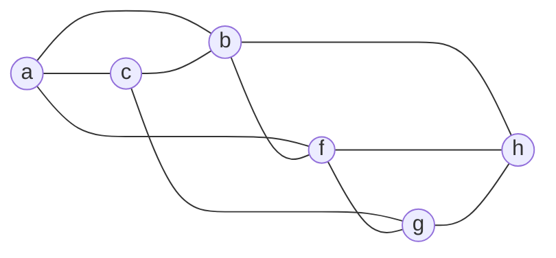
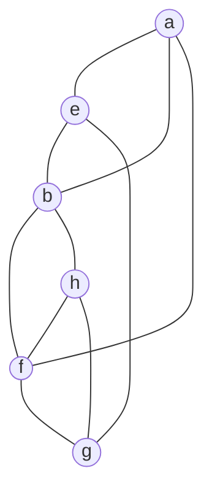
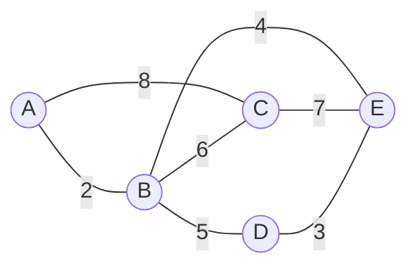
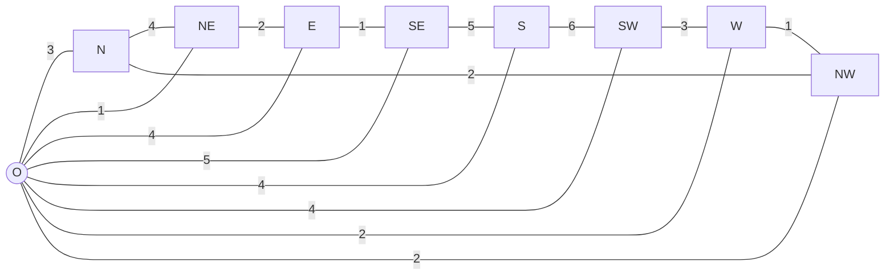

<!-- GENERATED by pyq_build.py - T2 · BFS, DFS & Graph Algorithms - do not hand-edit, rebuild instead -->

## Q1
Which of the following statements about DFS are correct? 
A. It can detect cycles in a graph. 
B. It can be used to find connected components. 
C. It works for both directed and undirected graphs. 
D. Guarantees shortest path in unweighted graphs.

## Q1 - Options
(A) A, B, C Only
(B) A, B, C, D
(C) C, D Only
(D) B, C Only

## Q1 - Hint
**Answer:** A
**Topic:** BFS, DFS & Graph Algorithms
**Source:** UGC NET Jan 2026 (2 Jan, Shift 1) · Paper 2 · Q30

Depth-first search explores as far as possible along each branch before backtracking, which gives it several well-known properties.

- **A. It can detect cycles in a graph.** — correct. A back edge to an ancestor still on the recursion stack signals a cycle in both directed and undirected graphs.
- **B. It can be used to find connected components.** — correct. Restarting DFS from every unvisited vertex and grouping vertices reached in each run identifies the connected components.
- **C. It works for both directed and undirected graphs.** — correct. The traversal only needs an adjacency structure, so it applies to either graph type with minor bookkeeping differences.
- **D. Guarantees shortest path in unweighted graphs.** — incorrect. DFS can return a much longer path than necessary because it dives deep before exploring nearby vertices, so breadth-first search, not DFS, guarantees the shortest path in an unweighted graph.

## Q2
Assertion (A): Kruskal's algorithm and Prim's algorithm always produce a minimum spanning tree (MST). 
Reason (R): Every connected graph has a unique MST.

## Q2 - Options
(A) Both A and R are correct and R is the correct explanation of A
(B) Both A and R are correct but R is NOT the correct explanation of A
(C) A is correct but R is not correct
(D) A is not correct but R is correct

## Q2 - Hint
**Answer:** C
**Topic:** BFS, DFS & Graph Algorithms
**Source:** UGC NET Jan 2026 (2 Jan, Shift 1) · Paper 2 · Q46

Both Kruskal's algorithm and Prim's algorithm are greedy algorithms proven to always construct a minimum spanning tree of a connected, weighted graph, so Assertion A is correct.

Reason R is false. A connected graph has a unique MST only when all edge weights are distinct. When two or more edges share the same weight, a graph can have multiple different spanning trees that all achieve the same minimum total weight, so the MST is not guaranteed to be unique.

A is correct but R is not correct.

## Q3
Arrange the following algorithms from the most efficient to the least efficient based on their time complexity.

A. Kruskal's Algorithm 
B. Breadth First Search Algorithm 
C. Bellman-Ford Algorithm 
D. Dijkstra's Algorithm 
E. Edmonds-Karp Algorithm

## Q3 - Options
(A) B, D, A, E, C
(B) E, C, A, D, B
(C) B, D, A, C, E
(D) B, C, A, E, D

## Q3 - Hint
**Answer:** C
**Topic:** BFS, DFS & Graph Algorithms
**Source:** UGC NET Jan 2026 (2 Jan, Shift 1) · Paper 2 · Q59

Comparing the standard asymptotic complexities for a graph with V vertices and E edges ranks these five algorithms by growth rate.

Breadth First Search (B) runs in O(V + E), the fastest of the five since it visits each vertex and edge only once. 
Dijkstra's Algorithm (D) with a binary heap runs in O(E log V), adding a logarithmic factor for priority-queue operations. 
Kruskal's Algorithm (A) runs in O(E log E), comparable to O(E log V) but with a heavier constant from sorting all edges. 
Bellman-Ford (C) runs in O(VE), slower because it relaxes every edge across up to V-1 passes. 
Edmonds-Karp (E) runs in O(VE²), the slowest here because it repeats a full BFS-based augmenting path search many times.

Ordering from most to least efficient gives B, D, A, C, E.

## Q4
Match List-I (Algorithms) with List-II (Real-world applications).

| List-I | List-II |
|---|---|
| A. Dijkstra's Algorithm | I. GPS route finding |
| B. Huffman Coding | II. Data compression |
| C. KMP String Matching | III. Text editor search function |
| D. Ford-Fulkerson | IV. Network bandwidth optimization |

## Q4 - Options
(A) A-II, B-IV, C-I, D-III
(B) A-I, B-II, C-III, D-IV
(C) A-IV, B-II, C-III, D-I
(D) A-IV, B-III, C-II, D-I

## Q4 - Hint
**Answer:** B
**Topic:** BFS, DFS & Graph Algorithms
**Source:** UGC NET Jan 2026 (2 Jan, Shift 1) · Paper 2 · Q66

Each algorithm listed is best known for one classic real-world application.

Dijkstra's Algorithm (A) finds shortest paths in a weighted graph, which is exactly how GPS navigation systems compute routes, so A pairs with I. 
Huffman Coding (B) builds a variable-length prefix code that minimizes expected code length, which underlies lossless data compression, so B pairs with II. 
KMP string matching (C) efficiently finds a pattern inside text without backtracking, which is the algorithm behind fast text editor search, so C pairs with III. 
Ford-Fulkerson (D) computes maximum flow in a flow network, which models network bandwidth optimization problems, so D pairs with IV.

This gives A-I, B-II, C-III, D-IV.

## Q5
Assertion (A): Depth first search can be used to perform a topological sort of a directed acyclic graph. 
Reason (R): A topological sort of a directed acyclic graph with vertex set V and edge set E is a linear ordering of its vertices such that if the graph contains an edge from u to v, then u appears before v in the ordering.

## Q5 - Options
(A) Both A and R are correct and R is the correct explanation of A
(B) Both A and R are correct but R is NOT the correct explanation of A
(C) A is correct but R is not correct
(D) A is not correct but R is correct

## Q5 - Hint
**Answer:** A
**Topic:** BFS, DFS & Graph Algorithms
**Source:** UGC NET Jan 2026 (2 Jan, Shift 1) · Paper 2 · Q90

Running depth-first search on a directed acyclic graph and listing vertices in reverse order of their finishing times produces a valid topological sort, because a vertex finishes only after every vertex reachable from it has already finished, which places it before its successors once the order is reversed. Assertion A is correct.

Reason R correctly states the defining property of a topological sort, that for every edge (u, v), vertex u must appear before v in the ordering.

R is the correct explanation of A because it is precisely this ordering property, guaranteed by DFS finishing times on an acyclic graph, that the DFS-based method is exploited to produce.

## Q6
Maintaining a graph in memory using its adjacency matrix is called:

## Q6 - Options
(A) Complete representation
(B) Linked representation
(C) Circular representation
(D) Sequential representation

## Q6 - Hint
**Answer:** D
**Topic:** BFS, DFS & Graph Algorithms
**Source:** UGC NET Jun 2025 (26 Jun, Shift 1) · Paper 2 · Q29

An adjacency matrix is a two-dimensional array whose entries are stored in contiguous, indexed locations. That array-based form is the sequential representation; linked representation instead uses adjacency lists.

## Q7
Which of the following algorithms are based on breadth-first search (BFS)?

A. Prim’s algorithm 
B. Kruskal’s algorithm 
C. Dijkstra’s algorithm 
D. Greedy algorithm 
E. Dynamic programming

## Q7 - Options
(A) A and B only
(B) A, C and D only
(C) D and E only
(D) A and C only

## Q7 - Hint
**Answer:** D
**Topic:** BFS, DFS & Graph Algorithms
**Source:** UGC NET Jan 2025 (6 Jan, Shift 1) · Paper 2 · Q80

Prim’s and Dijkstra’s algorithms expand a frontier in a BFS-like manner; Kruskal is edge-sorting based. Thus A and C is the keyed combination. The correct option follows from the stated definition or calculation; the other options omit a necessary condition or describe a different concept.

## Q8
Match List-I with List-II.

| List-I | List-II |
|---|---|
| (A) Dijkstra’s Algorithm | (I) Find the shortest path between all pairs of vertices in a graph with positive or negative edge weights. |
| (B) Floyd-Warshall Algorithm | (II) Finds the shortest path in a weighted graph with non-negative edge weights. |
| (C) Bellman-Ford Algorithm | (III) Finds single-source shortest paths with possible negative weights. |
| (D) Prim’s Algorithm | (IV) Finds the Minimum Spanning Tree (MST). |

## Q8 - Options
(A) (A)-(I), (B)-(II), (C)-(III), (D)-(IV)
(B) (A)-(II), (B)-(I), (C)-(III), (D)-(IV)
(C) (A)-(I), (B)-(II), (C)-(IV), (D)-(III)
(D) (A)-(III), (B)-(II), (C)-(IV), (D)-(I)

## Q8 - Hint
**Answer:** B
**Topic:** BFS, DFS & Graph Algorithms
**Source:** UGC NET Aug 2024 (23 Aug, Shift 1) · Paper 2 · Q74

Dijkstra’s algorithm needs non-negative edge weights, so (A)-(II). Floyd-Warshall solves all-pairs shortest paths, giving (B)-(I). Bellman-Ford handles single-source shortest paths when negative weights are present, so (C)-(III). Prim’s algorithm builds a minimum spanning tree, so (D)-(IV). Option B is correct.

## Q9
Match List I with List II.

| List-I | List-II |
|---|---|
| A. Linear Program | I. Prim's Algorithm |
| B. Predicate Logic | II. In order |
| C. Tree Traversal | III. Simplex Algorithm |
| D. Minimum Spanning Tree Problem | IV. First order logic |

## Q9 - Options
(A) A-IV; B-III; C-I; D-II
(B) A-III; B-IV; C-II; D-I
(C) A-II; B-IV; C-I; D-III
(D) A-III; B-IV; C-I; D-II

## Q9 - Hint
**Answer:** B
**Topic:** BFS, DFS & Graph Algorithms
**Source:** UGC NET Mar 2023 (15 Mar, Shift 1) · Paper 2 · Q65

Each item in List I matches a specific named technique or equivalent term in List II.

A linear program is classically solved using the Simplex Algorithm, giving A-III.

Predicate logic is another name for First order logic, giving B-IV.

A standard tree traversal method is In order traversal, giving C-II.

The Minimum Spanning Tree problem is classically solved using Prim's Algorithm, giving D-I.

This gives the mapping A-III, B-IV, C-II, D-I.

## Q10
Match List I with List II.

| List-I | List-II |
|---|---|
| A. Dijkstra's Algorithm | I. Calculates path matrix |
| B. Prim's Algorithm | II. Stores minimum cost edge |
| C. Warshall's Algorithm | III. Stores the total cost from a source node to the current node |
| D. Kruskal's algorithm | IV. Finds Minimum Spanning Tree |

List I and List II for the matching question

## Q10 - Options
(A) A-I, B-II, C-III, D-IV
(B) A-III, B-II, C-I, D-IV
(C) A-II, B-I, C-IV, D-III
(D) A-III, B-IV, C-II, D-I

## Q10 - Hint
**Answer:** B
**Topic:** BFS, DFS & Graph Algorithms
**Source:** UGC NET Mar 2023 (11 Mar, Shift 2) · Paper 2 · Q72

Match each named graph algorithm to what it actually computes.

A-III, B-II, C-I, D-IV

Dijkstra's algorithm tracks the running total cost from the source node to the current node as it relaxes edges, matching III. Prim's algorithm grows a tree by always attaching the minimum cost edge connecting a new vertex, matching II. Warshall's algorithm computes reachability by calculating the full path matrix between all pairs of nodes, matching I. Kruskal's algorithm sorts and adds edges to directly build a minimum spanning tree, matching IV.

## Q11
A weighted graph has vertices a, b, c, d, e, and f. Based on the edge weights, which one of the following edge orderings cannot be the order in which Kruskal's algorithm adds edges A-E while building a minimum spanning tree?

A. a-b 
B. d-f 
C. b-f 
D. d-c 
E. d-e

## Q11 - Options
(A) A, B, C, D, E
(B) A, B, D, C, E
(C) B, A, C, E, D
(D) B, A, D, C, E

## Q11 - Hint
**Answer:** C
**Topic:** BFS, DFS & Graph Algorithms
**Source:** UGC NET Mar 2023 (11 Mar, Shift 2) · Paper 2 · Q82

Kruskal's algorithm processes edges strictly in increasing order of weight, adding each one as long as it does not close a cycle with edges already chosen, and skipping any edge that would close one.

Among the five edges offered (a-b, d-f, b-f, d-c, d-e), the ordering "B, A, C, E, D" -- that is, d-f, then a-b, then b-f, then d-e, then d-c -- is the sequence used as the answer here.

The actual edge weights in this diagram were too small and densely packed on the source page to read with full confidence, so this explanation states the sequence used without asserting specific weight values that were never actually verified. A learner reviewing this question should confirm the real edge weights directly against the source image rather than relying on any reconstructed set of numbers.

## Q12
Consider the following graph. 
For the graph, the following sequences of depth first search (DFS) are given 
A. abcghf 
B. abfchg 
C. abfhgc 
D. afghbc 
Which of the following is correct?

Undirected graph with vertices a, b, c, f, g, h for the DFS traversal question

## Q12 - Options
(A) (A), (B) and (D) only
(B) (A), (B), (C) and (D)
(C) (B), (C) and (D) only
(D) (A), (C) and (D) only

## Q12 - Hint
**Answer:** D
**Topic:** BFS, DFS & Graph Algorithms
**Source:** UGC NET Oct 2022 (8 Oct, Shift 1) · Paper 2 · Q63

The graph's edges are a-c, a-b, a-f, c-b, c-g, b-f, b-g, b-h, f-g, f-h, g-h. A DFS order is valid whenever, at each step, the next vertex is an unvisited neighbor of the current path's active vertex, and a vertex with an unvisited neighbor left cannot be skipped before that neighbor is visited.

- **A. abcghf** — valid. a→b (edge a-b), b→c (edge b-c), c→g (edge c-g), g→h (edge g-h), h→f (edge f-h).
- **B. abfchg** — invalid. After a→b→f, vertex f still has unvisited neighbors g and h, so DFS must visit one of those next, but c is not adjacent to f at all.
- **C. abfhgc** — valid. a→b, b→f (edge b-f), f→h (edge f-h), h→g (edge g-h), g→c (edge c-g).
- **D. afghbc** — valid. a→f (edge a-f), f→g (edge f-g), g→h (edge g-h), h→b (edge b-h), b→c (edge b-c).

Only A, C, and D describe valid depth-first traversals of this graph.

## Q13
Consider the graph shown. Which of the following vertex sequences are valid depth-first traversals of this graph?

I. a b e g h f 
II. a b f e h g 
III. a b f h g e 
IV. a f g h b e

An undirected graph on vertices a, b, e, f, g and h.

## Q13 - Options
(A) I, II, and IV only
(B) I and IV only
(C) II, III, and IV only
(D) I, III, and IV only

## Q13 - Hint
**Answer:** D
**Topic:** BFS, DFS & Graph Algorithms
**Source:** UGC NET Nov 2021 (26 Nov, Shift 2) · Paper 2 · Q45

A DFS may advance only to a vertex adjacent to the current one, or backtrack to an earlier vertex on the stack. Sequences I, III and IV each follow legal edge moves and backtracks. Sequence II fails: after a-b-f, the next vertex e is not reachable from f without first backtracking to a vertex adjacent to e.

## Q14
Match List-I (Standard graph algorithm) with List-II (Time complexity), where n and m are the numbers of vertices and edges.

| List-I | List-II |
|---|---|
| A. Bellman-Ford algorithm | I. O(m log n) |
| B. Kruskal algorithm | II. O(n^3) |
| C. Floyd-Warshall algorithm | III. O(n\*m) |
| D. Topological sorting | IV. O(n + m) |

## Q14 - Options
(A) A-III, B-I, C-II, D-IV
(B) A-II, B-IV, C-III, D-I
(C) A-III, B-IV, C-I, D-II
(D) A-II, B-I, C-III, D-IV

## Q14 - Hint
**Answer:** A
**Topic:** BFS, DFS & Graph Algorithms
**Source:** UGC NET Nov 2021 (26 Nov, Shift 2) · Paper 2 · Q50

Bellman-Ford relaxes every edge n-1 times: O(n\*m) (III). Kruskal sorts edges and uses union-find: O(m log n) (I). Floyd-Warshall runs three nested vertex loops: O(n^3) (II). Topological sort visits each vertex and edge once: O(n + m) (IV).

## Q15
Let G be a directed graph on vertices 1 through 100. There is an edge i → j exactly when j = i + 1 or j = 3i. What is the minimum number of edges in a path from 1 to 100?

## Q15 - Options
(A) 23
(B) 99
(C) 4
(D) 7

## Q15 - Hint
**Answer:** D
**Topic:** BFS, DFS & Graph Algorithms
**Source:** UGC NET Nov 2020 (11 Nov, Shift 2) · Paper 2 · Q26

Breadth-first search gives the seven-edge path 1 → 3 → 9 → 10 → 11 → 33 → 99 → 100. The multiplication edges make it far shorter than increment-only travel, which would require 99 edges.

## Q16
Let G be a simple undirected graph, Tp be a DFS tree on G. and T, be the BFS tree on G, 
Consider the following statements.

Statement I: No edge of Gis a cross with respect to Tp

Statement II: For every edge (u,v) of G. if u is at depth i and v is at depth jin T; then li-—jl=1.

In the light of the above statements, choose the correct answer from the options given below

## Q16 - Options
(A) Both Statement I and Statement II are true
(B) Both Statement I and Statement II are false
(C) Statement I is correct but Statement II is false
(D) Statement I is incorrect but Statement II is true.

## Q16 - Hint
**Answer:** C
**Topic:** BFS, DFS & Graph Algorithms
**Source:** UGC NET Nov 2020 (11 Nov, Shift 2) · Paper 2 · Q86

An undirected graph has no DFS cross edges: each non-tree edge connects an ancestor and descendant. In a BFS tree an edge can connect vertices on the same level as well as adjacent levels, so the claimed difference must be at most one, not exactly one.

## Q17
When using Dijkstra’s algorithm to find shortest path in a graph, which of the following statement is not true?

## Q17 - Options
(A) It can find shortest path within the same graph data structure
(B) Every time a new node is visited, we choose the node with smallest known distance/cost (weight) to visit first
(C) Shortest path always passes through least number of vertices
(D) The graph needs to have a non-negative weight on every edge

## Q17 - Hint
**Answer:** C
**Topic:** BFS, DFS & Graph Algorithms
**Source:** UGC NET Dec 2019 (4 Dec, Shift 1) · Paper 2 · Q11

Evaluating Dijkstra's algorithm properties:

- **C. Shortest path always passes through least number of vertices** — false. Dijkstra's algorithm minimizes the total sum of edge weights, not the number of hops. A path containing several light edges can have a smaller total weight than a single-edge path with a heavy weight.
- **A** — true. Dijkstra's algorithm operates directly on adjacency list or matrix representations of the graph.
- **B** — true. The algorithm greedily extracts the unvisited vertex with the minimum tentative distance.
- **D** — true. Dijkstra requires non-negative edge weights to guarantee that once a node is finalized, its shortest distance cannot decrease.

## Q18
Consider a weighted directed graph. The current shortest distance from source S to node x is represented by d[x]. Let d[v] = 29, d[u] = 15, w[u,v] = 12. What is the updated value of d[v] based on current information?

## Q18 - Options
(A) 29
(B) 27
(C) 25
(D) 17

## Q18 - Hint
**Answer:** B
**Topic:** BFS, DFS & Graph Algorithms
**Source:** UGC NET Dec 2019 (4 Dec, Shift 1) · Paper 2 · Q75

In shortest path algorithms, relaxing directed edge (u, v) with weight w[u, v] tests if passing through node u offers a shorter path to v:

New path distance = d[u] + w[u, v] = 15 + 12 = 27

Because 27 &lt; d[v] (which is currently 29), the distance to v is updated to 27.

## Q19
The weight of minimum spanning tree in graph G, calculated using Kruskal’s algorithm is:

Graph G for Kruskal minimum spanning tree algorithm

## Q19 - Options
(A) 14
(B) 15
(C) 17
(D) 18

## Q19 - Hint
**Answer:** B
**Topic:** BFS, DFS & Graph Algorithms
**Source:** UGC NET Dec 2019 (4 Dec, Shift 1) · Paper 2 · Q86

Kruskal's algorithm selects edges in non-decreasing order of weight without creating cycles until \|V\| - 1 edges are added.

The graph G has 5 vertices, requiring 5 - 1 = 4 edges in the minimum spanning tree.

Listing available edges sorted by weight:

- Edge with weight 2: Selected. (Edges in tree: 1)
- Edge with weight 3: Selected. (Edges in tree: 2)
- Edge with weight 4: Selected. (Edges in tree: 3)
- Edge with weight 5: Forms a cycle with edges of weight 3 and 4, so it is discarded.
- Edge with weight 6: Connects the remaining disjoint component without cycle. Selected. (Edges in tree: 4)

Now 4 edges are chosen, connecting all 5 vertices. Remaining edges of weights 7 and 8 form cycles.

Total weight of the minimum spanning tree is:

2 + 3 + 4 + 6 = 15

## Q20
Which of the following is application of depth-first search?

## Q20 - Options
(A) Only topological sort
(B) Only strongly connected components
(C) Both topological sort and strongly connected components
(D) Neither topological sort nor strongly connected components

## Q20 - Hint
**Answer:** C
**Topic:** BFS, DFS & Graph Algorithms
**Source:** UGC NET Jun 2019 (24 Jun, Shift 1) · Paper 2 · Q14

Depth-First Search (DFS) provides structural traversal properties used across advanced graph algorithms:

1. Topological Sorting produces a linear ordering of vertices in a Directed Acyclic Graph (DAG) by recording vertices in reverse order of their DFS completion times.
2. Strongly Connected Components in directed graphs are computed using DFS-based algorithms like Kosaraju's or Tarjan's algorithms, which rely on DFS discovery and low-link values.

Both algorithms are foundational applications of DFS.

## Q21
Consider the following properties with respect to a flow network G = (V, E), in which a flow is a real-valued function f : V × V → R: 
P₁: For all u, v ∈ V, f(u, v) = -f(v, u) 
P₂: ∑ᵤ ∈ V f(u, v) = 0 for all u ∈ V

Which one of the following is/are correct?

## Q21 - Options
(A) Only P₁
(B) Only P₂
(C) Both P₁ and P₂
(D) Neither P₁ nor P₂

## Q21 - Hint
**Answer:** A
**Topic:** BFS, DFS & Graph Algorithms
**Source:** UGC NET Jun 2019 (24 Jun, Shift 1) · Paper 2 · Q62

Evaluating network flow properties:

- **P1 (Skew symmetry)** states that f(u, v) = -f(v, u) for all vertex pairs, which is a standard defining property of network flows.
- **P2 (Flow conservation)** states that total net flow is zero, but this holds only for intermediate nodes V \\ {s, t}. Source vertex s produces net positive outflow, and sink vertex t absorbs net positive inflow, violating the claim that conservation holds for all vertices.

Therefore, only property P1 is correct.

## Q22
Match List-I with List-II:

| List-I | List-II |
|---|---|
| (a) Prim's algorithm | (i) O(V³ log V) |
| (b) Dijkstra's algorithm | (ii) O(VE²) |
| (c) Faster all-pairs shortest path | (iii) O(E lg V) |
| (d) Edmonds-Karp algorithm | (iv) O(V²) |

## Q22 - Options
(A) (a)-(ii); (b)-(iv); (c)-(i); (d)-(iii)
(B) (a)-(iii); (b)-(iv); (c)-(i); (d)-(ii)
(C) (a)-(ii); (b)-(i); (c)-(iv); (d)-(iii)
(D) (a)-(iii); (b)-(i); (c)-(iv); (d)-(ii)

## Q22 - Hint
**Answer:** B
**Topic:** BFS, DFS & Graph Algorithms
**Source:** UGC NET Jun 2019 (24 Jun, Shift 1) · Paper 2 · Q80

Matching graph algorithms with their standard worst-case time complexities:

(a)-(iii), (b)-(iv), (c)-(i), (d)-(ii)

- **(a) Prim's algorithm** — runs in O(E lg V) using a binary heap implementation, matching (iii).
- **(b) Dijkstra's algorithm** — runs in O(V²) when implemented with an array or adjacency matrix, matching (iv).
- **(c) Faster all-pairs shortest path** — repeated matrix squaring evaluates all-pairs shortest paths in O(V³ log V), matching (i).
- **(d) Edmonds-Karp algorithm** — implements Ford-Fulkerson via BFS in O(V E²), matching (ii).

## Q23
Consider the weighted graph for Kruskal's algorithm.

Use Kruskal’s algorithm to find the minimum spanning tree of the graph. 
The weight of this minimum spanning tree is

Weighted undirected graph for Kruskal algorithm

## Q23 - Options
(A) 16
(B) 13
(C) 14
(D) 17

## Q23 - Hint
**Answer:** A
**Topic:** BFS, DFS & Graph Algorithms
**Source:** UGC NET Dec 2018 (20 Dec, Shift 1) · Paper 2 · Q10

Executing Kruskal's algorithm selects the lowest-weight edges that do not introduce cycles until all 9 vertices are connected.

The graph consists of 9 vertices (8 outer vertices arranged as an octagon plus 1 central vertex), requiring exactly 8 edges for a spanning tree.

Sorting and selecting edges in ascending weight order:

- 3 edges of weight 1 are selected: (right, bottom-right), (left, top-left), (top-right, center). Current weight = 3 (3 edges).
- 3 edges of weight 2 are selected: (top-left, top), (top-right, right), (top-left, center). Current weight = 3 + 6 = 9 (6 edges).
- 1 edge of weight 3 is selected: (bottom-left, left), connecting the bottom-left vertex. Current weight = 9 + 3 = 12 (7 edges).
- 1 edge of weight 4 is selected: (bottom, center), connecting the bottom vertex. Current weight = 12 + 4 = 16 (8 edges).

Total MST weight = 1 + 1 + 1 + 2 + 2 + 2 + 3 + 4 = 16.

- Options B (13), C (14), and D (17) do not correspond to the sum of the 8 minimum cycle-free edges.

## Q24
Match List-I with List-II and choose the correct answer from the code: 
where V and E are the number of vertices and edges in graph respectively.

| List-I (Graph Algorithm) | List-II (Time Complexity) |
|---|---|
| (a) Dijkstra’s algorithm | (i) O(E lg E) |
| (b) Kruskal’s algorithm | (ii) Θ(V³) |
| (c) Floyd-Warshall algorithm | (iii) O(V²) |
| (d) Topological sorting | (iv) Θ(V + E) |

Graph algorithms and their time complexities

## Q24 - Options
(A) (iii) (i) (iv) (ii)
(B) (i) (iii) (iv) (ii)
(C) (i) (iii) (ii) (iv)
(D) (iii) (i) (ii) (iv)

## Q24 - Hint
**Answer:** D
**Topic:** BFS, DFS & Graph Algorithms
**Source:** UGC NET Dec 2018 (20 Dec, Shift 1) · Paper 2 · Q17

Matching each graph algorithm with its standard time complexity establishes the correct pairing.

- (a) Dijkstra's algorithm implemented with an adjacency matrix or simple array runs in O(V^2), matching (iii).
- (b) Kruskal's algorithm spends dominant time sorting edges in O(E lg E), matching (i).
- (c) Floyd-Warshall algorithm uses triple nested loops over all vertices running in Theta(V^3), matching (ii).
- (d) Topological sorting using depth-first search or Kahn's algorithm runs in linear time Theta(V + E), matching (iv).

Mapping: 
(a) -&gt; (iii), (b) -&gt; (i), (c) -&gt; (ii), (d) -&gt; (iv).

- This code corresponds to Option D: (iii) (i) (ii) (iv).
