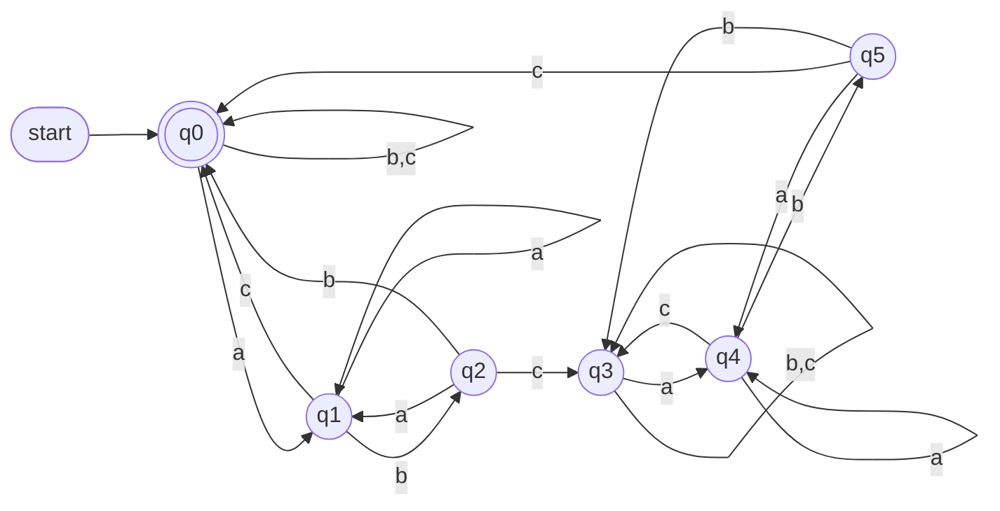

<!-- GENERATED by pyq_build.py - ★ T1 · Finite Automata, Regular Languages & DFA Minimization - do not hand-edit, rebuild instead -->

## Q1
Which option is the minimized DFA equivalent to the DFA shown?

Original DFA and the four proposed minimized automata.

## Q1 - Options
(A) Option 1
(B) Option 2
(C) Option 3
(D) Option 4

## Q1 - Hint
**Answer:** A
**Topic:** Finite Automata, Regular Languages & DFA Minimization
**Source:** UGC NET Jun 2026 (22 Jun, Shift 2) · Paper 2 · Q70

The accepting state q4 is distinct. The remaining non-accepting states partition into two equivalent behaviours, producing the three-state DFA shown in option 1: an initial state A, state B with a 0 loop, and accepting state C reached on 1.

## Q2
Given below are two statements: one is labelled as Assertion A and the other is labelled as Reason R

Assertion (A): If L is regular, then its compliment L' is necessarily regular. 
Reason (R): Complement of a language can be obtained by swapping final and non-final states in a DFA.

## Q2 - Options
(A) Both A and R are correct and R is the correct explanation of A
(B) Both A and R are correct but R is NOT the correct explanation of A
(C) A is correct but R is not correct
(D) A is not correct but R is correct

## Q2 - Hint
**Answer:** A
**Topic:** Finite Automata, Regular Languages & DFA Minimization
**Source:** UGC NET Jan 2026 (2 Jan, Shift 1) · Paper 2 · Q3

Regular languages are closed under complement. Given a DFA for L, swapping every accepting state to non-accepting and vice versa produces a DFA that accepts exactly the strings L rejects, which is the complement of L. Since a DFA always exists for any regular language, this complement is itself regular, so Assertion A holds.

Reason R states this construction correctly and restricts it to a DFA, where the swap works precisely because the DFA is deterministic and total, so every string reaches exactly one state. This construction is the actual reason A is true, so R correctly explains A.

## Q3
If r₁ and r₂ are regular expressions, then which of the following are correct? 
A. L(r₁ + r₂) = L(r₁) ∪ L(r₂) 
B. L(r₁ · r₂) = L(r₁)L(r₂) 
C. L((r₁)) = L(r₁) 
D. L(r₁\*) = (L(r₁))\*

## Q3 - Options
(A) A & B Only
(B) B, C & D Only
(C) A, C & D Only
(D) A, B, C & D

## Q3 - Hint
**Answer:** D
**Topic:** Finite Automata, Regular Languages & DFA Minimization
**Source:** UGC NET Jan 2026 (2 Jan, Shift 1) · Paper 2 · Q41

Each statement is a direct restatement of how regular expression operators map to language operations.

- **A.** The union operator + between two regular expressions produces the union of the two languages, so L(r₁ + r₂) = L(r₁) ∪ L(r₂) holds by definition.
- **B.** Concatenating two regular expressions produces the concatenation of their languages, so L(r₁ · r₂) = L(r₁)L(r₂) holds by definition.
- **C.** Parentheses only group a regular expression for precedence and do not change what it denotes, so L((r₁)) = L(r₁) holds trivially.
- **D.** The Kleene star operator on a regular expression produces the Kleene closure of its language, so L(r₁\*) = (L(r₁))\* holds by definition.

All four statements correctly describe how regular expression syntax corresponds to language operations, so all of A, B, C and D are correct.

## Q4
Let P and Q be two regular expressions over Σ. If P does not contain ε, then the equation in R namely, R = Q + RP has a unique solution given by:

## Q4 - Options
(A) R = Q\* P\*
(B) R = Q P\*
(C) R = P Q\*
(D) R = Q\* + P\*R

## Q4 - Hint
**Answer:** B
**Topic:** Finite Automata, Regular Languages & DFA Minimization
**Source:** UGC NET Jan 2026 (2 Jan, Shift 1) · Paper 2 · Q54

This equation is the standard form covered by Arden's theorem for solving language equations built from regular expressions.

Arden's theorem states that when P does not contain ε, the equation R = Q + RP has the unique solution R = QP\*.

Substituting QP\* back into the right-hand side confirms it: Q + (QP\*)P = Q + QP\*P, which reduces to the same closed form, verifying the solution.

So the unique solution is R = QP\*.

## Q5
Which is the best description of the language accepted by the DFA?

DFA over the alphabet {a, b, c}.

## Q5 - Options
(A) L = (a\* + b\* + c\*)+
(B) L = (a + b + c)*(abc)+(a + b + c)*
(C) The set of strings that start with a, b, or c and end with c
(D) The set of strings having an even count, including zero, of the substring `abc`

## Q5 - Hint
**Answer:** D
**Topic:** Finite Automata, Regular Languages & DFA Minimization
**Source:** UGC NET Jun 2025 (26 Jun, Shift 1) · Paper 2 · Q31

The automaton's states track progress through a possible `abc` and whether a completed occurrence has changed the parity. The initial accepting state represents zero completed occurrences; completing `abc` moves to the opposite-parity group, and completing another returns to the accepting group. Thus it accepts exactly strings with an even number of `abc` occurrences.

## Q6
Which pictured NFA is valid for the given DFA?

Given DFA and four candidate NFA diagrams.

## Q6 - Options
(A) Diagram 1
(B) Diagram 2
(C) Diagram 3
(D) Diagram 4

## Q6 - Hint
**Answer:** D
**Topic:** Finite Automata, Regular Languages & DFA Minimization
**Source:** UGC NET Jun 2025 (26 Jun, Shift 1) · Paper 2 · Q32

A valid NFA must preserve the DFA's accepted language while allowing nondeterministic state choices. Comparing the transition alternatives and accepting states shows that diagram 4 retains the required accepting paths without accepting a string that the DFA rejects; the other diagrams alter an accepting state or omit a required transition alternative.

## Q7
For the automaton described in the accompanying comprehension passage, which displayed diagram represents the minimum-state DFA?

```mermaid
flowchart TB
  subgraph o1["Option 1"]
    direction LR
    o1s1(("1"))
    o1s2(("2"))
    o1s3(("3"))
    o1s4(((" 4 ")))
    o1s5(((" 5 ")))
    o1in(( )) --> o1s1
    o1s1 -->|"a"| o1s1
    o1s1 -->|"a"| o1s2
    o1s2 -->|"a"| o1s2
    o1s2 -->|"a"| o1s3
    o1s3 -->|"b"| o1s2
    o1s3 -->|"b"| o1s4
    o1s4 -->|"a"| o1s4
    o1s4 -->|"b"| o1s5
    o1s5 -->|"a"| o1s4
  end
  subgraph o2["Option 2"]
    direction LR
    o2s1(("1"))
    o2s2(("2"))
    o2s3(("3"))
    o2s4(((" 4 ")))
    o2in(( )) --> o2s1
    o2s1 -->|"b"| o2s1
    o2s1 -->|"a"| o2s2
    o2s2 -->|"a"| o2s2
    o2s2 -->|"a"| o2s3
    o2s3 -->|"b"| o2s2
    o2s3 -->|"b"| o2s4
    o2s4 -->|"a,b"| o2s4
  end
  subgraph o3["Option 3"]
    direction LR
    o3s1(("1"))
    o3s2(("2"))
    o3s3(("3"))
    o3s4(((" 4 ")))
    o3s5(((" 5 ")))
    o3s6(((" 6 ")))
    o3in(( )) --> o3s1
    o3s1 -->|"a"| o3s2
    o3s2 -->|"a"| o3s2
    o3s2 -->|"b"| o3s3
    o3s3 -->|"a"| o3s2
    o3s3 -->|"b"| o3s4
    o3s4 -->|"b"| o3s4
    o3s4 -->|"a"| o3s5
    o3s5 -->|"a"| o3s5
    o3s5 -->|"b"| o3s6
    o3s6 -->|"a"| o3s6
    o3s6 -->|"a"| o3s5
  end
  subgraph o4["Option 4"]
    direction LR
    o4s1(("1"))
    o4s2(("2"))
    o4s3(("3"))
    o4s4(((" 4 ")))
    o4in(( )) --> o4s1
    o4s1 -->|"a,b"| o4s1
    o4s1 -->|"a"| o4s2
    o4s2 -->|"b"| o4s3
    o4s3 -->|"b"| o4s4
    o4s4 -->|"a,b"| o4s4
  end
```

DFA options 1-4 for Question 141

## Q7 - Options
(A) DFA diagram 1
(B) DFA diagram 2
(C) DFA diagram 3
(D) DFA diagram 4

## Q7 - Hint
**Answer:** D
**Topic:** Finite Automata, Regular Languages & DFA Minimization
**Source:** UGC NET Jan 2025 (6 Jan, Shift 1) · Paper 2 · Q91

The official final answer key marks this question as dropped, so no displayed DFA should be treated as a reliable scored answer. The source diagrams are attached for review and preservation of the original question.

## Q8
For the automaton in the preceding comprehension passage, which displayed diagram is correct?

```mermaid
flowchart TB
  subgraph o1["Option 1"]
    direction LR
    o1s1(("1"))
    o1s2(("2"))
    o1s3(("3"))
    o1s4(((" 4 ")))
    o1in(( )) --> o1s1
    o1s1 -->|"a,b"| o1s1
    o1s1 -->|"a"| o1s2
    o1s2 -->|"b"| o1s3
    o1s3 -->|"b"| o1s4
  end
  subgraph o2["Option 2"]
    direction LR
    o2s1(("1"))
    o2s2(("2"))
    o2s3(("3"))
    o2s4(((" 4 ")))
    o2in(( )) --> o2s1
    o2s1 -->|"a"| o2s2
    o2s2 -->|"b"| o2s3
    o2s3 -->|"b"| o2s4
    o2s4 -->|"a,b"| o2s4
  end
  subgraph o3["Option 3"]
    direction LR
    o3s1(("1"))
    o3s2(("2"))
    o3s3(("3"))
    o3s4(((" 4 ")))
    o3in(( )) --> o3s1
    o3s1 -->|"a,b"| o3s1
    o3s1 -->|"a"| o3s2
    o3s2 -->|"b"| o3s3
    o3s3 -->|"b"| o3s4
    o3s4 -->|"a,b"| o3s4
  end
  subgraph o4["Option 4"]
    direction LR
    o4s1(((" 1 ")))
    o4s2(("2"))
    o4s3(("3"))
    o4in(( )) --> o4s1
    o4s1 -->|"a,b"| o4s1
    o4s1 -->|"a"| o4s2
    o4s2 -->|"b"| o4s3
    o4s3 -->|"b"| o4s1
  end
```

DFA options 1-4 for Question 142

## Q8 - Options
(A) DFA diagram 1
(B) DFA diagram 2
(C) DFA diagram 3
(D) DFA diagram 4

## Q8 - Hint
**Answer:** C
**Topic:** Finite Automata, Regular Languages & DFA Minimization
**Source:** UGC NET Jan 2025 (6 Jan, Shift 1) · Paper 2 · Q92

The official final answer key selects diagram 3. It has the required transition path to the accepting state and the loops needed to preserve acceptance after the target pattern has been recognized.

## Q9
For the preceding automaton passage, which displayed DFA represents the language accepted by the machine?

```mermaid
flowchart TB
  subgraph o1["Option 1"]
    direction LR
    o1s1(("1"))
    o1s2(("2"))
    o1s3(("3"))
    o1s4(((" 4 ")))
    o1in(( )) --> o1s1
    o1s1 -->|"a,b"| o1s1
    o1s1 -->|"a"| o1s2
    o1s2 -->|"b"| o1s3
    o1s3 -->|"b"| o1s4
    o1s4 -->|"a,b"| o1s4
  end
  subgraph o2["Option 2"]
    direction LR
    o2s1(("1"))
    o2s2(("2"))
    o2s3(("3"))
    o2s4(((" 4 ")))
    o2in(( )) --> o2s1
    o2s1 -->|"b"| o2s1
    o2s1 -->|"a"| o2s2
    o2s2 -->|"a"| o2s2
    o2s2 -->|"b"| o2s3
    o2s3 -->|"b"| o2s4
    o2s4 -->|"a,b"| o2s4
  end
  subgraph o3["Option 3"]
    direction LR
    o3s1(("1"))
    o3s2(("2"))
    o3s3(("3"))
    o3s4(((" 4 ")))
    o3s5(((" 5 ")))
    o3s6(((" 6 ")))
    o3in(( )) --> o3s1
    o3s1 -->|"b"| o3s1
    o3s1 -->|"a"| o3s2
    o3s2 -->|"a"| o3s2
    o3s2 -->|"b"| o3s3
    o3s3 -->|"a"| o3s2
    o3s3 -->|"b"| o3s4
    o3s4 -->|"b"| o3s4
    o3s4 -->|"a"| o3s5
    o3s5 -->|"a"| o3s5
    o3s5 -->|"b"| o3s6
    o3s6 -->|"a"| o3s5
    o3s6 -->|"b"| o3s4
  end
  subgraph o4["Option 4"]
    direction LR
    o4s1(("1"))
    o4s2(("2"))
    o4s3(("3"))
    o4s4(((" 4 ")))
    o4s5(((" 5 ")))
    o4s6(((" 6 ")))
    o4in(( )) --> o4s1
    o4s1 -->|"a"| o4s1
    o4s1 -->|"b"| o4s2
    o4s2 -->|"a"| o4s2
    o4s2 -->|"b"| o4s3
    o4s3 -->|"a"| o4s2
    o4s3 -->|"b"| o4s4
    o4s4 -->|"a"| o4s4
    o4s4 -->|"b"| o4s5
    o4s5 -->|"b"| o4s5
    o4s5 -->|"a"| o4s6
    o4s6 -->|"b"| o4s5
  end
```

DFA options 1-4 for Question 143

## Q9 - Options
(A) DFA diagram 1
(B) DFA diagram 2
(C) DFA diagram 3
(D) DFA diagram 4

## Q9 - Hint
**Answer:** C
**Topic:** Finite Automata, Regular Languages & DFA Minimization
**Source:** UGC NET Jan 2025 (6 Jan, Shift 1) · Paper 2 · Q93

The official final answer key selects diagram 3. Its transitions track the required substring while allowing arbitrary symbols before and after it, matching the language described in the passage.

## Q10
For the automaton described in the comprehension passage, which regular expression represents its accepted language?

## Q10 - Options
(A) (a+b)\*aab
(B) aba(a+b)\*
(C) b(a+b)\*b(a+b)*a(a+b)*
(D) (a+b)*abb(a+b)*

## Q10 - Hint
**Answer:** D
**Topic:** Finite Automata, Regular Languages & DFA Minimization
**Source:** UGC NET Jan 2025 (6 Jan, Shift 1) · Paper 2 · Q94

The official final key selects `(a+b)*abb(a+b)*`, i.e. all strings over {a,b} containing `abb` as a substring. The correct option follows from the stated definition or calculation; the other options omit a necessary condition or describe a different concept.

## Q11
Which of the following properties correctly describe a Regular Grammar ? 
A. All production rules are of the form A→xB or 
A→x, where A and B are non terminal symbols and x is a terminal symbol. 
B. Regular grammars are more powerful than context-free grammars and can express any type of language. 
C. There is a direct correspondence between regular grammar and finite automata. 
D. Regular grammars can generate languages that are not recognised by any type of automata.

## Q11 - Options
(A) (A) and (B) Only
(B) (B) and (C) Only
(C) (C) and (D) Only
(D) (A) and (C) Only

## Q11 - Hint
**Answer:** D
**Topic:** Finite Automata, Regular Languages & DFA Minimization
**Source:** UGC NET Aug 2024 (23 Aug, Shift 1) · Paper 2 · Q20

(A) is true: right-linear rules of the form A → xB or A → x define a regular grammar. (C) is true: every regular grammar has an equivalent finite automaton and vice versa. (B) is false — regular grammars are strictly weaker than context-free ones. (D) is false — the languages they generate are exactly those finite automata accept. Only (A) and (C), so option D.

## Q12
Which of the following languages can be recognized by a Non-Deterministic Finite Automaton (NFA) but cannot be recognized by a Deterministic Finite Automaton (DFA)?

A. L₁ = {w ∈ {0,1}\* \| the length of w is even} 
B. L₂ = {w ∈ {0,1}\* \| the length of w is odd} 
C. L₃ = {w ∈ {0,1}\* \| all 0s precede all 1s in w} 
D. L₄ = {w ∈ {0,1}\* \| w contains an equal number of 0s and 1s} 
E. L₅ = {w ∈ {0,1}\* \| all 1s precede all 0s in w}

## Q12 - Options
(A) (A) and (B) only
(B) (B) and (C) only
(C) (C) and (D) only
(D) None of the above

## Q12 - Hint
**Answer:** D
**Topic:** Finite Automata, Regular Languages & DFA Minimization
**Source:** UGC NET Aug 2024 (23 Aug, Shift 1) · Paper 2 · Q65

NFAs and DFAs recognize exactly the same regular languages. L₁, L₂, L₃, and L₅ are regular and recognized by both, while L₄ is non-regular and recognized by neither. Therefore option D is correct.

## Q13
Let L={ab, aa, baa}. Which of the following strings are not in L\*.

## Q13 - Options
(A) abaabaaabaa
(B) aaaabaaaa
(C) baaaaabaaaab
(D) baaaaabaa

## Q13 - Hint
**Answer:** C
**Topic:** Finite Automata, Regular Languages & DFA Minimization
**Source:** UGC NET Dec 2023 (7 Dec, Shift 2) · Paper 2 · Q21

The key idea is stated in the problem: Let L={ab, aa, baa}. Which of the following strings are not in L\*.. The correct answer is C: baaaaabaaaab. It follows the governing definition, algorithm, or calculation in this theory of computation and compilers item; the other choices fail to satisfy one or more stated conditions.

## Q14
Let A={a, b} and L=A\*. Let x={a"b", n&gt;0}. The languages L U X and X are respectively :

## Q14 - Options
(A) Not regular, Regular
(B) Regular, Regular
(C) Regular, Not regular
(D) Not Regular, Not Regular

## Q14 - Hint
**Answer:** C
**Topic:** Finite Automata, Regular Languages & DFA Minimization
**Source:** UGC NET Dec 2023 (7 Dec, Shift 2) · Paper 2 · Q22

The key idea is stated in the problem: Let A={a, b} and L=A\*. Let x={a"b", n&gt;0}. The languages L U X and X are respectively :. The correct answer is C: Regular, Not regular. It follows the governing definition, algorithm, or calculation in this theory of computation and compilers item; the other choices fail to satisfy one or more stated conditions.

## Q15
The sum of minimum and maximum number of final states for a Deterministic Finite Automata (DFA) having 'P" state is equal to : () Pp

## Q15 - Options
(A) p
(B) p-1
(C) p+1
(D) p+2

## Q15 - Hint
**Answer:** C
**Topic:** Finite Automata, Regular Languages & DFA Minimization
**Source:** UGC NET Dec 2023 (7 Dec, Shift 2) · Paper 2 · Q31

The key idea is stated in the problem: The sum of minimum and maximum number of final states for a Deterministic Finite Automata (DFA) having 'P" state is equal to : () Pp. The correct answer is C: p+1. It follows the governing definition, algorithm, or calculation in this theory of computation and compilers item; the other choices fail to satisfy one or more stated conditions.

## Q16
Which of the statement is/are CORRECT ? 
A. Moore and Mealy machines are finite state machines with output capabilities. 
B. Any given Moore machine has an equivalent Mealy machine. 
C. Any given Mealy machine has an equivalent Moore machine. 
D. Moore machine is not a finite state machine. Choose the correct answer from the options given below :

## Q16 - Options
(A) (A) and (B) Only
(B) (A), (B) and (©) Only
(C) (B) and (D) Only
(D) (A), (B) and (D) Only

## Q16 - Hint
**Answer:** B
**Topic:** Finite Automata, Regular Languages & DFA Minimization
**Source:** UGC NET Dec 2023 (7 Dec, Shift 2) · Paper 2 · Q55

The key idea is stated in the problem: Which of the statement is/are CORRECT ? 
A. Moore and Mealy machines are finite state machines with output capabilities. 
B. Any given Moore machine has an equivalent Mealy machine. 
C. Any given Mealy machine has an equivalent Moore machine. 
D. Moore machine. The correct answer is B: (A), (B) and (©) Only. It follows the governing definition, algorithm, or calculation in this theory of computation and compilers item; the other choices fail to satisfy one or more stated conditions.

## Q17
Consider the finite automaton F1 shown, which accepts a language L over its input alphabet. C is the start state and E (double circle) is the only accepting state. The transitions are: C to S, S to E, and C to E directly (three forward edges), together with S back to C and E back to S (two backward edges). Let F2 be the finite automaton obtained by reversal of F1 (reverse every transition and swap the roles of the start and accepting states). Then which of the following is correct?

## Q17 - Options
(A) L(F1) ≠ L(F2)
(B) L(F1) = L(F2)
(C) L(F1) ≤ L(F2)
(D) L(F1) ≥ L(F2)

## Q17 - Hint
**Answer:** B
**Topic:** Finite Automata, Regular Languages & DFA Minimization
**Source:** UGC NET Jun 2023 (17 Jun, Shift 1) · Paper 2 · Q51

Reversing an automaton means reversing every transition's direction and swapping the roles of the start and accepting states. F1 has five directed edges: C→S, S→E, C→E, S→C, and E→S.

Reversing each edge gives: S→C, E→S, E→C, C→S, and S→E. Four of these five reversed edges (S→C, E→S, C→S, S→E) already exist in F1's own edge set. Only one edge changes: F1's direct C→E shortcut becomes E→C in the reversal.

The diagram carries no distinct input-symbol labels on its transitions, so each edge represents a move on the same single input symbol. A finite automaton whose transitions are all labelled with one repeated symbol accepts a language made only of strings like a, aa, aaa, and so on, a language fully determined by string length rather than symbol pattern. Every string built from one repeated symbol reads the same forwards and backwards, so it is automatically its own reverse.

Because reversing an automaton produces the reverse of its language, and a single-symbol language is always equal to its own reverse, L(F2) must equal L(F1) here regardless of the one edge whose direction flips. The near-total edge overlap between F1 and its reversal reinforces the same conclusion structurally, but the single-symbol argument holds even without relying on that overlap.

- **A. L(F1) ≠ L(F2)** — would hold for a language over a multi-symbol alphabet that is not itself reversal-closed, but not here.
- **B. L(F1) = L(F2)** — correct. A single-symbol automaton's language is always closed under reversal.
- **C. L(F1) ≤ L(F2)** — not a valid set-theoretic comparison between two languages.
- **D. L(F1) ≥ L(F2)** — not a valid set-theoretic comparison between two languages.

## Q18
What is the minimum and maximum number of initial, dead, unreachable and final states in a valid 'n' state finite automaton, where the language accepted is not 'Φ'?

## Q18 - Options
(A) Minimum: 1,1,1,1; Maximum: 1, (n-1), (n-1), n
(B) Minimum: 1,0,0,0; Maximum: 1, (n-1), (n-1), n
(C) Minimum: 1,0,0,n; Maximum: 1, n, (n-1), (n-1)
(D) Minimum: 1,0,0,1; Maximum: 1, (n-1), (n-1), n

## Q18 - Hint
**Answer:** D
**Topic:** Finite Automata, Regular Languages & DFA Minimization
**Source:** UGC NET Mar 2023 (15 Mar, Shift 1) · Paper 2 · Q32

A deterministic finite automaton always has exactly one initial state, so both its minimum and maximum are 1 regardless of the language accepted.

Since the language is not empty, at least one state must be a final (accepting) state, giving a minimum of 1 for final states, while at most every one of the n states could be made accepting, giving a maximum of n.

Dead states (states from which no accepting state is reachable) and unreachable states (states never reached from the start state) are not required at all in a valid automaton, so their minimum is 0 in both cases, while at most n-1 of the n states could be dead or unreachable respectively, since at least one state must remain productive and reachable to accept the non-empty language.

This gives Minimum: 1,0,0,1 and Maximum: 1,(n-1),(n-1),n, matching option D.
