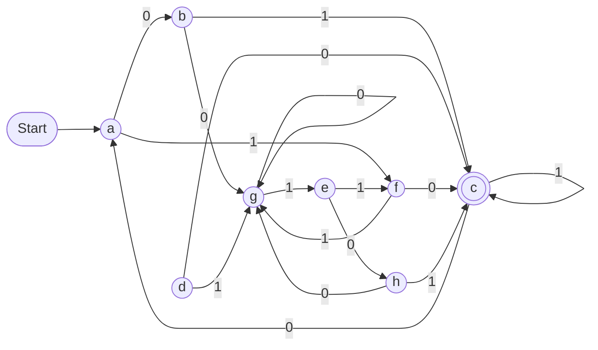
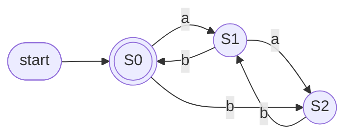

<!-- GENERATED by pyq_build.py - ★ T1 · Finite Automata, Regular Languages & DFA Minimization - do not hand-edit, rebuild instead -->

## Q1
Which of the following Finite Automata, recognizes the language L={a,b}\* ?

A. M=({q0}, {a,b}, δ, q0, {q0}) where q0 transitions to {q0} on both a and b. 
B. M=({q0,q1}, {a,b}, δ, q0, {q0,q1}) where q0 transitions to {q0,q1} on both a and b, and q1 transitions to {q1} on both a and b. 
C. M=({q0,q1}, {a,b}, δ, q0, {q0,q1}) where q0 transitions to {q0,q1} on a and to {q0} on b, and q1 has no transition on a and transitions to {q1} on b. 
D. M=({q0,q1,q2}, {a,b}, δ, q0, {q0}) where q0 transitions to {q0} on both a and b, q1 transitions to {q2} on a and has no transition on b, and q2 transitions to {q0} on a and to {q2} on b.

## Q1 - Options
(A) A and B
(B) A and D
(C) A, B and C
(D) A, B, C and D

## Q1 - Hint
**Answer:** D
**Topic:** Finite Automata, Regular Languages & DFA Minimization
**Source:** UGC NET Mar 2023 (15 Mar, Shift 1) · Paper 2 · Q58

Checking each automaton's reachable accepting behavior against every possible input shows all four actually accept every string over {a,b}.

Automaton A is a single accepting state that self-loops on both symbols, so it trivially accepts every string, including the empty string.

Automaton B has both states accepting, and since every transition from either state lands only in accepting states, every string ends in an accepting state regardless of path taken.

Automaton C is an NFA where q0 always has a self-path back to itself, on b directly, and on a as one of two nondeterministic choices, so for any string there is always an all-q0 path ending in the accepting state q0, meaning every string is accepted even though q1's transition on a is undefined.

Automaton D's start state q0 only self-loops on both symbols, so q1 and q2 are never actually reachable from the start state, making this automaton behave identically to automaton A on every input, accepting everything.

Since all four automata accept every string over {a,b}, the correct option is A, B, C and D.

## Q2
The precedence of regular expression operators from lowest to highest precedence is:

## Q2 - Options
(A) Star, Concatenation, Union
(B) Union, Star, Concatenation
(C) Union, Concatenation, Star
(D) Star, Union, Concatenation

## Q2 - Hint
**Answer:** C
**Topic:** Finite Automata, Regular Languages & DFA Minimization
**Source:** UGC NET Mar 2023 (15 Mar, Shift 1) · Paper 2 · Q82

Regular expression operators bind in a fixed order, from loosest to tightest: union (alternation) has the lowest precedence, concatenation binds tighter than union, and Kleene star binds the tightest of all, applying only to the immediately preceding symbol or group.

This ordering is why an expression like ab\*+c is parsed as a(b\*) union c rather than grouping the union or concatenation more loosely, confirming the lowest-to-highest order is union, concatenation, star.

## Q3
In the ε-NFA, M = ({q0, q1, q2, q3}, {a}, δ, q0, {q3}), where 'δ' is given by q0 moving to q1 on ε, q1 moving to q2 on ε, and q2 moving to both q2 and q3 on 'a', what is the minimum length of string to reach the final state?

| State | ε | a |
|---|---|---|
| q0 | {q1} | {} |
| q1 | {q2} | {} |
| q2 | {} | {q2,q3} |
| q3 | {} | {} |

Transition table for the ε-NFA

## Q3 - Options
(A) 0
(B) 1
(C) 2
(D) 3

## Q3 - Hint
**Answer:** B
**Topic:** Finite Automata, Regular Languages & DFA Minimization
**Source:** UGC NET Mar 2023 (11 Mar, Shift 2) · Paper 2 · Q32

Trace the epsilon-closure of the start state first, because epsilon moves consume no input.

From q0, the epsilon-closure reaches q1 and then q2 without consuming any symbol. The only way to reach the accepting state q3 is the transition from q2 on input 'a', so at least one 'a' is required.

A single 'a' takes the machine from q0, through the epsilon-closure to q2, then directly to q3, so the minimum string length to reach the final state is 1.

## Q4
Which of the following is (are) correct about the regular expression aa*bb*cc*dd*

A. The language represented by the regular expression consists of strings of the form aⁱbʲcᵏdˡ, where i, j, k and l are each at least 1. 
B. The expression requires the number of a's to be equal to the number of b's. 
C. The expression requires the number of c's to be equal to the number of d's.

Choose the correct answer from the options given below:

## Q4 - Options
(A) Only A is correct
(B) Only B is correct
(C) Both A and B are correct
(D) All the three A, B and C are correct

## Q4 - Hint
**Answer:** A
**Topic:** Finite Automata, Regular Languages & DFA Minimization
**Source:** UGC NET Mar 2023 (11 Mar, Shift 2) · Paper 2 · Q58

Read the regular expression group by group, because each letter's star applies only within its own block.

`a` followed by `a*` guarantees at least one a with any number more, and the same pattern repeats independently for b, c, and d, so the language is exactly strings with one or more of each letter in that fixed order, matching statement A.

Each group's count is controlled by its own independent star, so there is no requirement linking the count of a's to b's, or c's to d's. For example a^5b^2c^1d^1 is a valid string in this language despite having 5 a's and only 2 b's, which makes statement B false, and the same reasoning makes statement C false.

The official answer key for this exact sitting marks a different option than this analysis supports. The regular-expression reasoning above is a direct mechanical consequence of independent Kleene stars and does not depend on interpretation, so this conflict is noted for a human to weigh against the official key rather than silently resolved either way.

## Q5
Which of the following are correct on regular expressions?

A. Φ + L = L + Φ = L 
B. εL = Lε = L 
C. ΦL = LΦ = Φ 
D. ΦL = LΦ = L

Choose the correct answer from the options given below:

## Q5 - Options
(A) A, B and D only
(B) A, B and C only
(C) B and D only
(D) A and D only

## Q5 - Hint
**Answer:** B
**Topic:** Finite Automata, Regular Languages & DFA Minimization
**Source:** UGC NET Mar 2023 (11 Mar, Shift 2) · Paper 2 · Q60

These identities follow from what the empty language Φ and the empty string ε each do under union and concatenation.

- **A. Φ + L = L + Φ = L** — true. Φ is the identity element for union, adding no new strings.
- **B. εL = Lε = L** — true. ε is the identity element for concatenation, contributing nothing to any string.
- **C. ΦL = LΦ = Φ** — true. Concatenating with the empty language, which contains no strings, produces no strings at all.
- **D. ΦL = LΦ = L** — false, this directly contradicts C, since concatenating with Φ yields Φ, not L.

A, B, and C are correct.

## Q6
Consider the language L = {aⁿbᵐ : n ≥ 4, m ≤ 3}. Which of the following regular expression represents language L?

## Q6 - Options
(A) aaaa\*(λ + b + bb + bbb)
(B) aaaaa\*(b + bb + bbb)
(C) aaaaa\*(λ + b + bb + bbb)
(D) aaaa\*(b + bb + bbb)

## Q6 - Hint
**Answer:** C
**Topic:** Finite Automata, Regular Languages & DFA Minimization
**Source:** UGC NET Oct 2022 (8 Oct, Shift 1) · Paper 2 · Q14

The a-part must represent n ≥ 4 a's, and the b-part must represent 0 to 3 b's.

aaaaa\* is four fixed a's followed by a-star on the fifth, so it matches a⁴, a⁵, a⁶, ... which is exactly n ≥ 4. aaaa\* only fixes three a's before the star, matching n ≥ 3, which is one too few.

(λ + b + bb + bbb) covers m = 0, 1, 2, and 3. Dropping the λ term, as in (b + bb + bbb), would exclude the valid case m = 0.

Only aaaaa\*(λ + b + bb + bbb) gets both the a-count and the full 0–3 range of b's correct.

## Q7
Consider L = {ab, aa, baa}. Which of the following string is NOT in L\*?

## Q7 - Options
(A) baaaaabaaaaa
(B) abaabaaabaa
(C) aaaabaaaa
(D) baaaaabaa

## Q7 - Hint
**Answer:** A
**Topic:** Finite Automata, Regular Languages & DFA Minimization
**Source:** UGC NET Oct 2022 (8 Oct, Shift 1) · Paper 2 · Q15

Try to tile each string using only the blocks ab, aa, and baa.

For baaaaabaaaaa, since only baa starts with b, the first block is forced to be baa, leaving aaabaaaaa. The next block must be aa (positions 4–5), leaving abaaaaa, whose only fit is ab (positions 6–7), leaving a plain run of 5 a's. A run of a's can only be tiled by aa blocks, and 5 is odd, so this string cannot be fully tiled and is not in L\*.

By contrast, baaaaabaa splits cleanly as baa + aa + ab + aa, abaabaaabaa splits as ab + aa + baa + ab + aa, and aaaabaaaa splits as aa + aa + baa + aa, so B, C, and D are all in L\*.

## Q8
Which of the following languages are NOT regular?

A. L = { (01)^n 0^k : n &gt; k, k &gt;= 0 } 
B. L = { c^n b^k a^(n+k) : n &gt;= 0, k &gt;= 0 } 
C. L = { 0^n 1^k : n is not equal to k }

Choose the correct answer from the options given below:

## Q8 - Options
(A) A and B only
(B) A and C only
(C) B and C only
(D) A, B and C

## Q8 - Hint
**Answer:** D
**Topic:** Finite Automata, Regular Languages & DFA Minimization
**Source:** UGC NET Nov 2021 (26 Nov, Shift 2) · Paper 2 · Q31

Each language needs an unbounded comparison of counts that a finite automaton cannot perform. A compares the number of (01) blocks with the number of trailing 0s (n &gt; k). B forces the number of a-symbols to equal the sum of the c and b counts. C forces the number of 0s to differ from the number of 1s (its complement 0^n 1^n is the classic non-regular language). All three are non-regular by the pumping lemma.

## Q9
What is the minimum number of states in the finite automaton equivalent to the transition diagram shown?

State transition diagram of a finite automaton over input alphabet {0, 1} with start state a and accepting state c.

## Q9 - Options
(A) 3
(B) 4
(C) 5
(D) 6

## Q9 - Hint
**Answer:** C
**Topic:** Finite Automata, Regular Languages & DFA Minimization
**Source:** UGC NET Nov 2021 (26 Nov, Shift 2) · Paper 2 · Q35

Remove the unreachable/dead state, then apply state minimization by repeatedly splitting groups whose members move to different groups on some input. The reachable states collapse into 5 equivalence classes, so the minimal DFA has 5 states.

## Q10
Find a regular expression for the language accepted by the automaton shown.

A three-state finite automaton over {a, b} whose leftmost state is both the start state and the only accepting state.

## Q10 - Options
(A) (aa\*(a + b)ab)\*
(B) (a + b)ab(ab + bb + aa\*(a + b)ab)\*
(C) a*ab(ab + bb + aa*(a + b)ab)\*
(D) a\*(a + b)ab(ab + bb + aa\*(a + b)ab)\*

## Q10 - Hint
**Answer:** B
**Topic:** Finite Automata, Regular Languages & DFA Minimization
**Source:** UGC NET Nov 2021 (26 Nov, Shift 2) · Paper 2 · Q36

Trace the paths that begin and end at the start state, since it is also the only accepting state. The machine must first consume a single symbol (a + b) and then the pair ab to return to the accepting state, so every accepted string starts with (a + b)ab. After that it can repeat any loop back to the accepting state, namely ab, bb, or the longer detour aa\*(a + b)ab. Putting the mandatory prefix before the starred set of loops gives (a + b)ab(ab + bb + aa\*(a + b)ab)\*.

## Q11
Let L₁ and L₂ over Σ = {a, b} be represented by (a\* + b)\* and (a + b)\* respectively. Which statement is true?

## Q11 - Options
(A) L₁ ⊂ L₂
(B) L₂ ⊂ L₁
(C) L₁ = L₂
(D) L₁ ∩ L₂ = ∅

## Q11 - Hint
**Answer:** C
**Topic:** Finite Automata, Regular Languages & DFA Minimization
**Source:** UGC NET Nov 2020 (11 Nov, Shift 2) · Paper 2 · Q28

The inner expression a\* + b can generate either any run of a characters or a single b. Repeating it with the outer star generates every string over {a, b}, exactly as (a + b)\* does. Therefore L₁ = L₂; neither language excludes a mixed a/b string.

## Q12
Consider the languages

L₁ = {aᶻ \| z is an integer}, 
L₂ = {a²ᶻ \| z &gt; 0}, and 
L₃ = {ww \| w ∈ {a,b}\*}.

Which are regular?

## Q12 - Options
(A) L₁ and L₂ only
(B) L₁ and L₃ only
(C) L₂ only
(D) L₃ only

## Q12 - Hint
**Answer:** A
**Topic:** Finite Automata, Regular Languages & DFA Minimization
**Source:** UGC NET Nov 2020 (11 Nov, Shift 2) · Paper 2 · Q56

The first two languages are unary languages described by simple length patterns and are regular. The copy language {ww} requires matching an arbitrary string with itself, which is not regular.

## Q13
Consider Σ = {w, x} and T = {x, y, z}. Define homomorphism h by:

h(x) = xzy h(w) = zxyy

If L is the regular language denoted by r = (w + x\*)(ww)\*, then the regular language h(L) is given by:

## Q13 - Options
(A) (zxyy + xzy)(zxyy)
(B) (zxyy + (xzy)*)(zxyyzxyy)*
(C) (zxyy + xzy)(zxyy)\*
(D) (zxyy + (xzy)\*)(zxyyzxyy)

## Q13 - Hint
**Answer:** B
**Topic:** Finite Automata, Regular Languages & DFA Minimization
**Source:** UGC NET Dec 2019 (4 Dec, Shift 1) · Paper 2 · Q77

A string homomorphism h applied to a regular expression substitutes each symbol with its mapped string image while preserving concatenation, union, and Kleene star operators.

Applying the mapping rules:

h(w) = zxyy h(x) = xzy

Substituting into r = (w + x\*)(ww)\* yields:

h(r) = (h(w) + (h(x))*)(h(w)h(w))* = (zxyy + (xzy)*)(zxyyzxyy)*

This expression matches option B.

## Q14
How many states are there in a minimum state automata equivalent to regular expression given below? 
Regular expression is a\*b(a+b)

## Q14 - Options
(A) 1
(B) 2
(C) 3
(D) 4

## Q14 - Hint
**Answer:** D
**Topic:** Finite Automata, Regular Languages & DFA Minimization
**Source:** UGC NET Jun 2019 (24 Jun, Shift 1) · Paper 2 · Q16

The regular expression a\*b(a+b) describes all strings over {a, b} containing zero or more a's followed by exactly one b and then exactly one further symbol.

Analyzing the Myhill-Nerode equivalence classes for this language reveals 4 distinct states:

1. State q0 (start) — reads any number of a's and transitions on b to q1.
2. State q1 — has consumed a\*b and transitions on a or b to final state q2.
3. State q2 (accepting) — has accepted a\*b(a+b) — any further input transitions to the dead state q3.
4. State q3 (dead state) — sinks all subsequent symbols since no string in the language can exceed length \|a\*b\| + 1.

A fully specified minimum state DFA requires exactly 4 states.

## Q15
Let r = a(a + b)*, s = aa*b and t = a\*b be three regular expressions. Consider the following :

(i) L(s) ⊆ L(r) and L(s) ⊆ L(t) 
(ii) L(r) ⊆ L(S) and L(S) ⊆ L(t)

Choose the correct answer from the code given below : 
Code :

## Q15 - Options
(A) Neither (i) nor (ii) is correct.
(B) Only (ii) is correct.
(C) Both (i) and (ii) are correct.
(D) Only (i) is correct.

## Q15 - Hint
**Answer:** D
**Topic:** Finite Automata, Regular Languages & DFA Minimization
**Source:** UGC NET Dec 2018 (20 Dec, Shift 1) · Paper 2 · Q32

Analyzing the language generated by each regular expression validates the subset relations in statement (i).

- L(r) = a(a + b)\* generates all non-empty strings starting with 'a'.
- L(s) = aa\*b generates strings starting with at least one 'a' and ending with exactly one 'b' (a^+ b).
- L(t) = a\*b generates strings having zero or more 'a's followed by exactly one 'b'.

Evaluating statement (i):

1. Every string in L(s) starts with 'a', so L(s) ⊆ L(r) holds.
2. Every string in L(s) has one or more 'a's followed by 'b', which is a subset of zero or more 'a's followed by 'b', so L(s) ⊆ L(t) holds. 
    Thus, statement (i) is completely correct.

Evaluating statement (ii):

- Strings such as 'a' or 'ab' belong to L(r) but 'a' does not end with 'b', so L(r) is not a subset of L(s).
- Therefore, only statement (i) is correct (Option D).

## Q16
Consider the following two languages :

L1 = {x \| for some y with \|y\| = 2\|x\|, xy ∈ L and L is regular language} 
L2 = {x \| for some y such that \|x\| = \|y\|, xy ∈ L and L is regular language}

Which one of the following is correct ? 
Code :

## Q16 - Options
(A) Both L1 and L2 are regular language
(B) Only L1 is regular language
(C) Only L2 is regular language
(D) Both L1 and L2 are not regular language

## Q16 - Hint
**Answer:** A
**Topic:** Finite Automata, Regular Languages & DFA Minimization
**Source:** UGC NET Dec 2018 (20 Dec, Shift 1) · Paper 2 · Q39

Regular languages are closed under length-proportional prefix truncation operations such as Half(L) and Third(L).

- Language L2 represents the half-language operation Half(L) = {x \| ∃y with \|x\| = \|y\| and xy ∈ L}.
- Language L1 represents the third-language operation Third(L) = {x \| ∃y with \|y\| = 2\|x\| and xy ∈ L}.
- Both operations can be recognized by constructing a deterministic or non-deterministic finite automaton that simulates state transitions forward on x while maintaining a product construction to track valid reachable paths of proportional length for y.
- Because regular languages are closed under both Half and Third operations, both L1 and L2 are regular languages (Option A).

## Q17
Consider the language L given by L = {2^n k \| k &gt; 0, and n is non-negative integer number}. The minimum number of states of finite automaton which accepts the language L is

## Q17 - Options
(A) n + 1
(B) 2n
(C) n(n + 1)/2
(D) n

## Q17 - Hint
**Answer:** A
**Topic:** Finite Automata, Regular Languages & DFA Minimization
**Source:** UGC NET Dec 2018 (20 Dec, Shift 1) · Paper 2 · Q60

Constructing a minimal deterministic finite automaton for strings divisible by 2^n requires tracking n consecutive trailing binary zeroes.

- For any fixed non-negative integer n, a binary number represents 2^n \* k (with k &gt; 0) if and only if its binary representation contains at least one '1' and ends with at least n zeroes.
- The automaton must distinguish each prefix having 0, 1, 2, ..., n trailing zeroes.
- State 0 represents having seen a '1' with 0 trailing zeroes.
- States 1 through n represent having seen 1 through n consecutive trailing zeroes.
- Once n trailing zeroes are seen, the DFA reaches the accepting state.
- Thus, the minimal DFA requires exactly n + 1 states (Option A).
