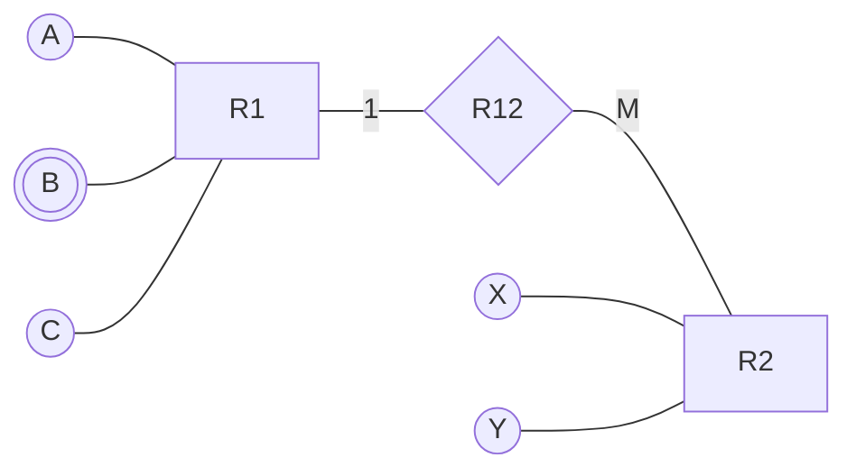

<!-- GENERATED by pyq_build.py - T3 · ER Model & Database Design - do not hand-edit, rebuild instead -->

## Q1
What is the correct sequence of the database-design process?

A. Create conceptual schema 
B. Data model mapping 
C. Requirements collection and analysis 
D. Physical design

## Q1 - Options
(A) C, A, B, D
(B) C, B, A, D
(C) A, B, C, D
(D) A, C, B, D

## Q1 - Hint
**Answer:** A
**Topic:** ER Model & Database Design
**Source:** UGC NET Jun 2026 (22 Jun, Shift 2) · Paper 2 · Q16

Database design starts by collecting and analysing requirements. It then develops a conceptual schema, maps that conceptual model to the selected data model, and finally performs physical design. Therefore the order is C, A, B, D.

## Q2
To define the relationship between two entity sets, which operation can be used?

## Q2 - Options
(A) Concatenation
(B) Addition
(C) Cartesian product
(D) Union

## Q2 - Hint
**Answer:** C
**Topic:** ER Model & Database Design
**Source:** UGC NET Jun 2026 (22 Jun, Shift 2) · Paper 2 · Q42

A relationship set is formally a subset of the Cartesian product of participating entity sets. Concatenation, addition, and union do not construct tuples across the two sets in this way.

## Q3
Specialization process does not allow

## Q3 - Options
(A) defining a set of subclasses of an entity type
(B) establishing additional specific attributes with each subclass
(C) defining a generalized entity type from the given entity types
(D) establishing additional specific relationship types between each subclass and other entity types or other subclasses

## Q3 - Hint
**Answer:** C
**Topic:** ER Model & Database Design
**Source:** UGC NET Jan 2026 (2 Jan, Shift 1) · Paper 2 · Q47

Specialization is a top-down process that starts from one entity type and breaks it into more specific subclasses, each of which can be given its own extra attributes and relationships, which is exactly what options A, B and D describe.

Defining a single generalized entity type from a set of given entity types is the reverse, bottom-up process, known as generalization, not specialization.

So specialization does not allow defining a generalized entity type from the given entity types.

## Q4
What is the correct sequence of phases of database design?

A. Physical design 
B. Conceptual design 
C. Logical design 
D. Requirement collection and analysis

## Q4 - Options
(A) D, A, B, C
(B) D, B, C, A
(C) D, B, A, C
(D) D, A, C, B

## Q4 - Hint
**Answer:** B
**Topic:** ER Model & Database Design
**Source:** UGC NET Jan 2025 (6 Jan, Shift 1) · Paper 2 · Q27

Database design starts with requirements, then conceptual modelling, logical schema design and finally physical design. This produces D, B, C, A. The correct option follows from the stated definition or calculation; the other options omit a necessary condition or describe a different concept.

## Q5
Arrange the following phases of database design in the correct order : 
A. Physical Design 
B. Conceptual Design 
C. Logical Design 
D. Requirement Analysis

## Q5 - Options
(A) (B), (D), (A), (C)
(B) (C), (A), (B), (D)
(C) (D), (B), (C), (A)
(D) (A), (D), (C), (B)

## Q5 - Hint
**Answer:** C
**Topic:** ER Model & Database Design
**Source:** UGC NET Aug 2024 (23 Aug, Shift 1) · Paper 2 · Q67

Database design proceeds: requirement analysis (D), conceptual design (B) producing an ER model, logical design (C) mapping that model to relations, then physical design (A) choosing storage structures and indexes. That order is option C.

## Q6
Given the basic ER diagram and relational model, which of the following is incorrect?

## Q6 - Options
(A) An attribute of an entity can have more than one value
(B) An attribute of an entity can be composite
(C) In a row of relational table, an attribute can have more than one value
(D) In a row of a relational table, an attribute can have exactly one value or a NULL value

## Q6 - Hint
**Answer:** C
**Topic:** ER Model & Database Design
**Source:** UGC NET Jun 2023 (17 Jun, Shift 1) · Paper 2 · Q34

The ER model and the relational model make different promises about attribute values.

At the ER (conceptual) level, an entity's attribute can be multivalued (Option A) or composite, made up of sub-parts (Option B) — both are standard, correct ER constructs.

The relational model, however, requires every attribute value in a row to be atomic under first normal form (1NF). A single cell cannot hold more than one value, so Option C is incorrect — this is the statement the question asks you to identify.

Option D correctly reflects 1NF: a relational attribute holds exactly one atomic value, or NULL if the value is unknown or missing.

## Q7
Consider the following statements: 
Statement I: Composite attributes cannot be divided into smaller subparts. 
Statement II: Complex attribute is formed by nesting composite attributes and multi-valued attributes in an arbitrary way. 
Statement III: A derived attribute is an attribute whose values are computed from other attribute. 
Which of the following is correct?

## Q7 - Options
(A) Statement I, Statement II and Statement III are true
(B) Statement I true and Statement II, Statement III false
(C) Statement I, Statement II true and Statement III false
(D) Statement I false and Statement II, Statement III true

## Q7 - Hint
**Answer:** D
**Topic:** ER Model & Database Design
**Source:** UGC NET Oct 2022 (8 Oct, Shift 1) · Paper 2 · Q79

Statement I is false. It describes a simple (atomic) attribute, not a composite one. A composite attribute is defined by the fact that it can be divided into smaller subparts, such as splitting Name into First Name and Last Name.

Statement II is true. Nesting composite and multivalued attributes together in any combination is exactly how a complex attribute is built.

Statement III is true. A derived attribute, such as Age computed from Date of Birth, has its value calculated from another stored attribute rather than stored directly.

## Q8
A part is either manufactured in-house, purchased from an external supplier, or both. A batchnumber is kept for manufactured parts and a supplier name for purchased parts. Which constraints must be modelled for this class/subclass structure?

## Q8 - Options
(A) Total specialization and overlapping constraints
(B) Disjoint constraint only
(C) Partial participation
(D) Partial participation and disjoint constraints

## Q8 - Hint
**Answer:** A
**Topic:** ER Model & Database Design
**Source:** UGC NET Nov 2021 (26 Nov, Shift 2) · Paper 2 · Q68

Every part is manufactured or purchased (or both), so every superclass entity belongs to at least one subclass - total specialization. A part can be both manufactured and purchased, so the subclasses can overlap - the overlapping constraint (not disjoint).

## Q9
Find the minimum number of tables required for converting the entity relationship diagram into a relational database.

Entity-Relationship diagram with entities R1 and R2 connected by relationship R12

## Q9 - Options
(A) 2
(B) 4
(C) 3
(D) 5

## Q9 - Hint
**Answer:** C
**Topic:** ER Model & Database Design
**Source:** UGC NET Dec 2019 (4 Dec, Shift 1) · Paper 2 · Q13

Converting the entity-relationship components into relational tables:

1. Entity R1 contains attributes A, B, and C, where B is a multivalued attribute (represented by a double oval). Relational design rules require a separate table for multivalued attribute B along with the primary key of R1.
2. Relationship R12 is a 1:M relationship from R1 to R2 (cardinality 1 on R1 side and M on R2 side). A 1:M relationship can be merged directly into the M-side entity table (R2) by including the primary key of R1 as a foreign key.
3. Base table for entity R1 with its atomic attributes A and C.

This yields exactly 3 tables:

- Table for R1 (A, C)
- Table for multivalued attribute B (Key(R1), B)
- Table for R2 merged with relationship R12 (X, Y, FK_R1)
