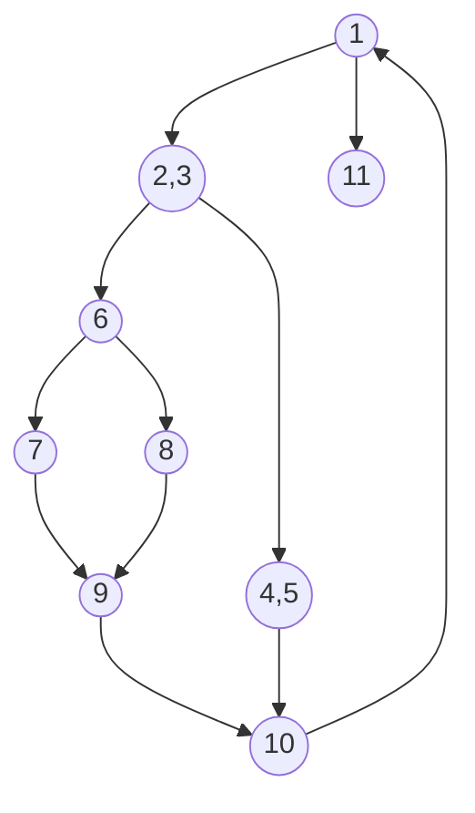

<!-- GENERATED by pyq_build.py - T1 · Software Testing, V&V & Quality (CMM) - do not hand-edit, rebuild instead -->

## Q1
Fault base testing technique is

## Q1 - Options
(A) Unit testing
(B) Beta testing
(C) Stress testing
(D) Mutation testing

## Q1 - Hint
**Answer:** D
**Topic:** Software Testing, V&V & Quality (CMM)
**Source:** UGC NET Oct 2022 (8 Oct, Shift 1) · Paper 2 · Q27

Mutation testing deliberately seeds known faults (mutations) into a program and checks whether the existing test suite detects them, making it the classic fault-based testing technique. Unit, beta, and stress testing are organized around testing scope, release stage, and load conditions rather than around deliberately injected faults.

## Q2
Alpha and Beta testing are forms of

## Q2 - Options
(A) White – Box Testing
(B) Black – Box Testing
(C) Acceptance Testing
(D) System Testing

## Q2 - Hint
**Answer:** C
**Topic:** Software Testing, V&V & Quality (CMM)
**Source:** UGC NET Oct 2022 (8 Oct, Shift 1) · Paper 2 · Q28

Alpha testing happens at the developer's site with actual customers, and beta testing happens at customer sites with real end users, both aiming to gather user feedback before final release. This customer-facing validation makes them forms of acceptance testing rather than a testing style defined by code visibility (white/black box) or by scope (system testing).

## Q3
In software testing, beta testing is the testing performed by \_\_\_\_\_\_.

## Q3 - Options
(A) potential customers at the developer's location
(B) potential customers at their own locations
(C) product developers at the customer's location
(D) product developers at their own locations

## Q3 - Hint
**Answer:** B
**Topic:** Software Testing, V&V & Quality (CMM)
**Source:** UGC NET Nov 2021 (26 Nov, Shift 2) · Paper 2 · Q11

Beta testing is done by real or potential users in their own environment, outside the developer's site, after alpha testing. Testing by customers at the developer's site is alpha testing.

## Q4
A system has 99.99% uptime and a mean-time-between-failure (MTBF) of 1 day. How quickly must the system repair itself to meet this availability goal?

## Q4 - Options
(A) ~9 seconds
(B) ~10 seconds
(C) ~11 seconds
(D) ~12 seconds

## Q4 - Hint
**Answer:** A
**Topic:** Software Testing, V&V & Quality (CMM)
**Source:** UGC NET Nov 2021 (26 Nov, Shift 2) · Paper 2 · Q15

Availability = MTBF / (MTBF + MTTR). With A = 0.9999 and MTBF = 86,400 s, the repair time MTTR = MTBF x (1 - A) = 86,400 x 0.0001 = 8.64 s, i.e. about 9 seconds.

## Q5
Identify the correct order (lower to higher) of the five levels of the Capability Maturity Model used to measure the maturity of an organisation's software process.

A. Defined<br>
B. Optimizing<br>
C. Initial<br>
D. Managed<br>
E. Repeatable

Choose the correct answer from the options given below:

## Q5 - Options
(A) C, A, E, D, B
(B) C, E, A, B, D
(C) C, B, D, E, A
(D) C, E, A, D, B

## Q5 - Hint
**Answer:** D
**Topic:** Software Testing, V&V & Quality (CMM)
**Source:** UGC NET Nov 2021 (26 Nov, Shift 2) · Paper 2 · Q18

The Capability Maturity Model rises through five stages: Initial (ad hoc, chaotic process), Repeatable (basic project management established), Defined (process documented and standardised across the organisation), Managed (process quantitatively measured and controlled), and Optimizing (continuous, data-driven process improvement). Mapping the given letters, the increasing order is Initial C, Repeatable E, Defined A, Managed D, Optimizing B.

## Q6
Assertion (A): Software developers do not do exhaustive software testing in practice.<br>
Reason (R): Even for small inputs, exhaustive testing is too computationally intensive (takes too long) to run all the tests.

In light of the above statements, choose the correct answer from the options given below:

## Q6 - Options
(A) Both A and R are true and R is the correct explanation of A
(B) Both A and R are true but R is NOT the correct explanation of A
(C) A is true but R is false
(D) A is false but R is true

## Q6 - Hint
**Answer:** A
**Topic:** Software Testing, V&V & Quality (CMM)
**Source:** UGC NET Nov 2021 (26 Nov, Shift 2) · Paper 2 · Q20

Exhaustive testing (trying every input/path) is practically impossible because the input space grows combinatorially, so testers sample instead (A true). That combinatorial blow-up is exactly why exhaustive testing is infeasible, so R is true and correctly explains A.

## Q7
Software reliability may be described with respect to<br>
A. execution time,<br>
B. calendar time, and<br>
C. clock time.

## Q7 - Options
(A) (A) and (B) only
(B) (B) and (C) only
(C) (A), (B), and (C)
(D) (A) and (C) only

## Q7 - Hint
**Answer:** C
**Topic:** Software Testing, V&V & Quality (CMM)
**Source:** UGC NET Nov 2020 (11 Nov, Shift 2) · Paper 2 · Q49

Reliability growth and failure intensity can be modelled against CPU/execution time, elapsed calendar time, or operational clock time. The appropriate time base depends on the system and measurement model.

## Q8
Which are behavioural (black-box) testing techniques?<br>
A. Equivalence partitioning<br>
B. Graph-based testing<br>
C. Boundary-value analysis<br>
D. Data-flow testing<br>
E. Loop testing

## Q8 - Options
(A) (B) and (D) only
(B) (A), (B), and (C) only
(C) (D) and (E) only
(D) (A), (C), and (E) only

## Q8 - Hint
**Answer:** B
**Topic:** Software Testing, V&V & Quality (CMM)
**Source:** UGC NET Nov 2020 (11 Nov, Shift 2) · Paper 2 · Q51

Equivalence classes, boundary values, and graph-based tests derive tests from externally visible requirements or behaviour. Data-flow and loop testing require knowledge of program structure and are white-box techniques.

## Q9
Match List I with List IT

With reference to CMM developed by Software Engineering Institute (SEI)

List I List IT<br>
A. INITIAL () Process measurement<br>
B. REPEATABLE (Il) Process definition<br>
C. DEFINED (ID Project management<br>
D. MANAGED (Iv) ADHOC

| List I | List II |
|---|---|
| Items are listed in the question stem. | Match each item to its stated description or complexity. |

## Q9 - Options
(A) AIT, B-IV, C-II. D-I
(B) A-IV, B-IIl. C-I, D-II
(C) A-IV, B-III, C-IL, D-I
(D) ALIII, B-IV, C-I, D-II

## Q9 - Hint
**Answer:** C
**Topic:** Software Testing, V&V & Quality (CMM)
**Source:** UGC NET Nov 2020 (11 Nov, Shift 2) · Paper 2 · Q68

CMM progresses from ad-hoc initial practice to repeatable project management, defined processes, and measured/managed processes. Option C matches those maturity descriptions.

## Q10
According to the ISO-9126 Standard Quality Model, match the attributes in List-I with their definitions in List-II.

| List-I | List-II |
|---|---|
| (a) Functionality | (i) Relationship between level of performance and amount of resources |
| (b) Reliability | (ii) Characteristics related with achievement of purpose |
| (c) Efficiency | (iii) Effort needed to make for improvement |
| (d) Maintainability | (iv) Capability of software to maintain performance of software |

## Q10 - Options
(A) (a)-(i), (b)-(ii), (c)-(iii), (d)-(iv)
(B) (a)-(ii), (b)-(i), (c)-(iv), (d)-(iii)
(C) (a)-(ii), (b)-(iv), (c)-(i), (d)-(iii)
(D) (a)-(i), (b)-(ii), (c)-(iv), (d)-(iii)

## Q10 - Hint
**Answer:** C
**Topic:** Software Testing, V&V & Quality (CMM)
**Source:** UGC NET Dec 2019 (4 Dec, Shift 1) · Paper 2 · Q20

Matching ISO/IEC 9126 software quality characteristics with their definitions:

- **(a) Functionality** maps to **(ii)**. Attributes related to functions satisfying stated or implied needs (achievement of purpose).
- **(b) Reliability** maps to **(iv)**. Capability of software to maintain its level of performance under stated conditions for a stated period of time.
- **(c) Efficiency** maps to **(i)**. Relationship between the level of performance of the software and the amount of resources used.
- **(d) Maintainability** maps to **(iii)**. Effort needed to make specified modifications and improvements.

The matching combination is (a)-(ii), (b)-(iv), (c)-(i), (d)-(iii).

## Q11
Answer the question based on flow graph F with entry node (1) and exit node (11).

How many regions are there in flowgraph F?



Flowgraph F control flow diagram

## Q11 - Options
(A) 2
(B) 3
(C) 4
(D) 5

## Q11 - Hint
**Answer:** C
**Topic:** Software Testing, V&V & Quality (CMM)
**Source:** UGC NET Dec 2019 (4 Dec, Shift 1) · Paper 2 · Q91

In McCabe's cyclomatic complexity theory, regions in a planar control flow graph are areas bounded by nodes and directed edges, including the unbounded exterior region.

The flowgraph contains 3 enclosed internal regions plus 1 unbounded outer region, totaling 4 regions.

The number of regions also matches the cyclomatic complexity V(G) = P + 1 = 3 + 1 = 4, confirming there are 4 regions.

## Q12
Answer the question based on flow graph F with entry node (1) and exit node (11).

How many nodes are there in the longest independent path?


Flowgraph F control flow diagram

## Q12 - Options
(A) 6
(B) 7
(C) 8
(D) 9

## Q12 - Hint
**Answer:** C
**Topic:** Software Testing, V&V & Quality (CMM)
**Source:** UGC NET Dec 2019 (4 Dec, Shift 1) · Paper 2 · Q92

An independent path is a path through the control flow graph that introduces at least one edge not traversed in previous basis paths.

Traversing the longest loop cycle from entry node (1) to exit node (11) visits:

1 -&gt; (2, 3) -&gt; 6 -&gt; 7 -&gt; 9 -&gt; 10 -&gt; 1 -&gt; 11

Counting the sequence of nodes along this complete path yields 8 node visits: 1, (2, 3), 6, 7, 9, 10, 1, and 11. The alternative branch traversing node 8 instead of 7 similarly contains 8 node visits. Therefore, the longest independent path contains 8 nodes.

## Q13
Answer the question based on flow graph F with entry node (1) and exit node (11).

How many predicate nodes are there and what are their names?


Flowgraph F control flow diagram

## Q13 - Options
(A) Three : (1, (2, 3), 6)
(B) Three : (1, 4, 6)
(C) Four : ((2, 3), 6, 10, 11)
(D) Four : ((2, 3), 6, 9, 10)

## Q13 - Hint
**Answer:** A
**Topic:** Software Testing, V&V & Quality (CMM)
**Source:** UGC NET Dec 2019 (4 Dec, Shift 1) · Paper 2 · Q93

A predicate node in a control flow graph is any decision point with an out-degree of two or greater.

Examining each node's outgoing edges:

- Node 1 has out-degree 2 (one branch goes to node (2, 3) and one outer edge loops to exit node 11).
- Node (2, 3) has out-degree 2 (branching to node 6 and node (4, 5)).
- Node 6 has out-degree 2 (branching to node 7 and node 8).
- All other nodes have out-degree 1 or 0.

Thus, there are exactly three predicate nodes: (1, (2, 3), 6).

## Q14
Answer the question based on flow graph F with entry node (1) and exit node (11).

What is the cyclomatic complexity of flowgraph F?


Flowgraph F control flow diagram

## Q14 - Options
(A) 2
(B) 3
(C) 4
(D) 5

## Q14 - Hint
**Answer:** C
**Topic:** Software Testing, V&V & Quality (CMM)
**Source:** UGC NET Dec 2019 (4 Dec, Shift 1) · Paper 2 · Q94

Cyclomatic complexity V(G) is computed using the number of predicate nodes P:

V(G) = P + 1

As established, there are P = 3 predicate nodes: 1, (2, 3), and 6. Substituting yields:

V(G) = 3 + 1 = 4

Equivalently, using the number of regions in the planar graph, there are 4 regions. Hence, the cyclomatic complexity is 4.

## Q15
Answer the question based on flow graph F with entry node (1) and exit node (11).

How many nodes are there in flowgraph F?


Flowgraph F control flow diagram

## Q15 - Options
(A) 9
(B) 10
(C) 11
(D) 12

## Q15 - Hint
**Answer:** A
**Topic:** Software Testing, V&V & Quality (CMM)
**Source:** UGC NET Dec 2019 (4 Dec, Shift 1) · Paper 2 · Q95

Counting each distinct node circle represented in the control flow graph:

1. Node 1
2. Combined node (2, 3)
3. Combined node (4, 5)
4. Node 6
5. Node 7
6. Node 8
7. Node 9
8. Node 10
9. Node 11

This gives a total of 9 nodes in flowgraph F.

## Q16
In the context of software testing, which of the following statements is/are NOT correct?

P: A minimal test set that achieves 100% path coverage will also achieve 100% statement coverage.<br>
Q: A minimal test set that achieves 100% path coverage will generally detect more faults than one that achieves 100% statement coverage.<br>
R: A minimal test set that achieves 100% statement coverage will generally detect more faults than one that achieves 100% branch coverage.

## Q16 - Options
(A) R only
(B) Q only
(C) P and Q only
(D) Q and R only

## Q16 - Hint
**Answer:** A
**Topic:** Software Testing, V&V & Quality (CMM)
**Source:** UGC NET Jun 2019 (24 Jun, Shift 1) · Paper 2 · Q30

Evaluating the structural test coverage hierarchy:

- **P** is correct because Path Coverage subsumes Branch Coverage and Statement Coverage. Exercising all paths guarantees executing all statements.
- **Q** is correct because path testing explores execution sequences and variable interactions that simple statement execution misses.
- **R** is NOT correct because statement coverage is strictly weaker than branch coverage. Branch coverage tests both true and false decision outcomes, detecting more faults than statement coverage.

Only statement R is incorrect.

## Q17
Software validation mainly checks for inconsistencies between

## Q17 - Options
(A) use cases and user requirements
(B) implementation and system design blueprints
(C) detailed specifications and user requirements
(D) functional specifications and use cases

## Q17 - Hint
**Answer:** C
**Topic:** Software Testing, V&V & Quality (CMM)
**Source:** UGC NET Jun 2019 (24 Jun, Shift 1) · Paper 2 · Q50

Software validation ensures that the software product satisfies its intended use and user expectations:

While verification checks consistency between implementation and technical design blueprints ("building the product right"), validation evaluates the system against the customer's actual operational needs ("building the right product").

It primarily uncovers inconsistencies and gaps between detailed system specifications and genuine user requirements.

## Q18
Consider the following method :

```
int f (int m, int n, boolean x, boolean y)
{
 int res = 0;
 if (m < 0) {res = n – m;}
 else if (x || y) {
 res = –1;
 if (n == m) {res = 1;}
 }
 else {res = n;}
 return res;
}/* end of */
```

If P is the minimum number of tests to achieve full statement coverage for f(), and Q is the minimum number of tests to achieve full branch coverage for f(), then (P, Q) =

## Q18 - Options
(A) (3, 2)
(B) (2, 3)
(C) (4, 3)
(D) (3, 4)

## Q18 - Hint
**Answer:** D
**Topic:** Software Testing, V&V & Quality (CMM)
**Source:** UGC NET Dec 2018 (20 Dec, Shift 1) · Paper 2 · Q58

Achieving full statement coverage requires 3 test cases, while full branch coverage requires 4 test cases.

For Statement Coverage (P):

1. Test 1: m = -1, n = 0 covers statement `res = n - m`.
2. Test 2: m = 2, n = 2, x = true covers statements `res = -1` and `res = 1`.
3. Test 3: m = 2, n = 0, x = false, y = false covers statement `res = n`.<br>
    Hence, P = 3.

For Branch Coverage (Q):<br>
There are three decision points with 6 branch outcomes:

1. m &lt; 0 (True branch: test with m &lt; 0)
2. m &lt; 0 (False branch) leading to else if (x \|\| y)
3. (x \|\| y) True branch with n == m True (covers True branch of inner if)
4. (x \|\| y) True branch with n != m False (covers False branch of inner if)
5. (x \|\| y) False branch leading to else block<br>
    Covering all true and false branch paths requires a minimum of 4 distinct test inputs.<br>
    Hence, (P, Q) = (3, 4) (Option D).

## Q19
A legacy software system has 940 modules. The latest release required that 90 of these modules be changed. In addition, 40 new modules were added and 12 old modules were removed. Compute the software maturity index for the system.

## Q19 - Options
(A) 0·849
(B) 0·923
(C) 0·725
(D) 0·524

## Q19 - Hint
**Answer:** A
**Topic:** Software Testing, V&V & Quality (CMM)
**Source:** UGC NET Dec 2018 (20 Dec, Shift 1) · Paper 2 · Q92

The Software Maturity Index (SMI) computed using the standard IEEE metric formula evaluates to approximately 0.849.

SMI = [M_T - (F_c + F_a + F_d)] / M_T where:<br>
M_T = total number of modules = 940<br>
F_c = number of changed modules = 90<br>
F_a = number of added modules = 40<br>
F_d = number of deleted modules = 12

Total modified components = F_c + F_a + F_d = 90 + 40 + 12 = 142.

SMI = (940 - 142) / 940<br>
SMI = 798 / 940 = 0.848936...

Rounding to three decimal places gives 0.849 (Option A).
