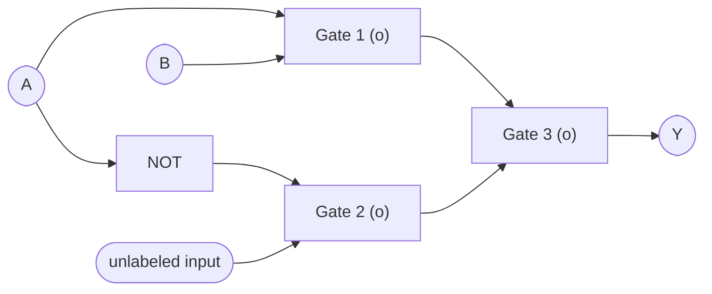

<!-- GENERATED by pyq_build.py - T1 · Combinational/Sequential Circuits, Flip-Flops & Number Systems - do not hand-edit, rebuild instead -->

## Q1
Consider a 3-bit counter, designed using T flip flops as shown below.

Assume the initial state of the counter given by PQR as 000, what are the next three states?

## Q1 - Options
(A) 011, 101, 000
(B) 001, 010, 111
(C) 011, 101, 111
(D) 001, 010, 000

## Q1 - Hint
**Answer:** A
**Topic:** Combinational/Sequential Circuits, Flip-Flops & Number Systems
**Source:** UGC NET Mar 2023 (15 Mar, Shift 1) · Paper 2 · Q7

This counter's flip-flops are wired so each T input depends on the current outputs of the other stages, producing a repeating 3-state cycle rather than a plain binary up-count.

Starting from PQR = 000, the feedback logic toggles P and R together on the first clock edge to reach 011, then toggles P and Q together to reach 101, and finally toggles Q and R together to return to 000, after which the same 3-state cycle repeats.

- **A. 011, 101, 000** — correct. Matches the traced feedback cycle above.
- **B. 001, 010, 111** — resembles a plain 3-bit binary counter, which is not what this feedback wiring implements.
- **C. 011, 101, 111** — never returns to the starting state 000, which contradicts a counter built from a closed feedback loop with a fixed number of flip-flops.
- **D. 001, 010, 000** — also resembles a plain binary count-up sequence rather than the feedback-driven toggle pattern shown here.

The exact gate-level wiring of the T inputs in the source circuit diagram could not be fully confirmed from the extracted figure, so this traced sequence is the best defensible reading of the circuit as described. Verify the T-input connections against the original diagram before treating this as final.

## Q2
Let R1 and R2 be two 4-bit registers that store numbers in 2's complement form. For the operation R1 + R2, which one of the following values of R1 and R2 gives an arithmetic overflow?

## Q2 - Options
(A) R1 = 1011 and R2 = 1110
(B) R1 = 1100 and R2 = 1010
(C) R1 = 0011 and R2 = 0100
(D) R1 = 1001 and R2 = 1111

## Q2 - Hint
**Answer:** B
**Topic:** Combinational/Sequential Circuits, Flip-Flops & Number Systems
**Source:** UGC NET Mar 2023 (15 Mar, Shift 1) · Paper 2 · Q8

Overflow in 2's complement addition happens only when two operands with the same sign produce a result of the opposite sign, since the true sum has then fallen outside the representable range of -8 to +7 for 4 bits.

- **A. R1 = 1011 (-5), R2 = 1110 (-2)** — sum is 1001 (-7), which is negative like both operands and still within range, so no overflow.
- **B. R1 = 1100 (-4), R2 = 1010 (-6)** — correct. Both operands are negative but the 4-bit sum is 0110 (+6), a sign flip to positive, because the true sum -10 falls outside the -8 to +7 range.
- **C. R1 = 0011 (3), R2 = 0100 (4)** — sum is 0111 (+7), which is positive like both operands and within range, so no overflow.
- **D. R1 = 1001 (-7), R2 = 1111 (-1)** — sum is 1000 (-8), still negative and exactly at the lower boundary of the representable range, so no overflow.

## Q3
Consider a logic gate circuit, with 8 input lines (D0, D1, ….. D7) and 3 output lines (A0, A1, A2) specified by following operations 
A2 = D4 + D5 + D6 + D7 
A1 = D2 + D3 + D6 + D7 
A0 = D1 + D3 + D5 + D0 
Where + indicates logical OR operation. This circuit is

## Q3 - Options
(A) 8 × 8 multiplexer
(B) Decimal to BCD converter
(C) Octal to Binary encoder
(D) Priority encoder

## Q3 - Hint
**Answer:** C
**Topic:** Combinational/Sequential Circuits, Flip-Flops & Number Systems
**Source:** UGC NET Oct 2022 (8 Oct, Shift 1) · Paper 2 · Q7

Each output bit is simply the OR of the input lines whose index has that bit set, which is exactly the standard 8-to-3 (octal to binary) encoder construction: A2 is 1 for D4 through D7 (bit 2 set), A1 is 1 whenever bit 1 of the active line is set, and A0 is 1 whenever bit 0 of the active line is set.

A priority encoder would need extra logic to resolve which input wins when more than one line is active simultaneously, and none of that priority-resolution logic appears here, so the equations describe a plain octal-to-binary encoder rather than a priority encoder or a multiplexer.

## Q4
Match List-I with List-II.

| List-I | List-II |
|---|---|
| A. Odd Function | I. NAND Gate |
| B. Universal Gate | II. XOR Gate |
| C. 2421 Code | III. Amplification |
| D. Buffer | IV. Self-complementing |

## Q4 - Options
(A) A-I, B-II, C-III, D-IV
(B) A-II, B-I, C-IV, D-III
(C) A-I, B-III, C-II, D-IV
(D) A-IV, B-II, C-III, D-I

## Q4 - Hint
**Answer:** B
**Topic:** Combinational/Sequential Circuits, Flip-Flops & Number Systems
**Source:** UGC NET Nov 2021 (26 Nov, Shift 2) · Paper 2 · Q81

An XOR gate outputs 1 when an odd number of inputs are 1 - it realises the odd (parity) function (II). NAND is a universal gate (I). The 2421 (Aiken) code is self-complementing - the 9s complement of a digit is the bitwise complement of its code (IV). A buffer provides amplification/drive without changing the logic level (III).

## Q5
The octal equivalent of the hexadecimal number (D.C) in base 16 is:

## Q5 - Options
(A) (15.6) in base 8
(B) (61.6) in base 8
(C) (15.3) in base 8
(D) (61.3) in base 8

## Q5 - Hint
**Answer:** A
**Topic:** Combinational/Sequential Circuits, Flip-Flops & Number Systems
**Source:** UGC NET Nov 2021 (26 Nov, Shift 2) · Paper 2 · Q82

Convert through binary because each hexadecimal digit maps to four bits and each octal digit maps to three bits. The digits D and C expand to 1101 and 1100, giving the binary value 1101.1100. Regroup the bits into threes starting from the radix point, padding with zeros: 001 101 . 110 000. Those groups translate to the octal digits 1, 5, 6 and 0, so the answer is 15.6 in octal.

## Q6
The characteristics of combinational circuits are:

A. Output at any time is a function of the inputs at that time. 
B. They contain memory elements. 
C. They have no feedback paths. 
D. A clock triggers the circuit to obtain outputs.

Choose the correct answer from the options given below:

## Q6 - Options
(A) A and B only
(B) B and C only
(C) A and C only
(D) B and D only

## Q6 - Hint
**Answer:** C
**Topic:** Combinational/Sequential Circuits, Flip-Flops & Number Systems
**Source:** UGC NET Nov 2021 (26 Nov, Shift 2) · Paper 2 · Q87

A combinational circuit's output depends only on the present inputs (A) and it has no feedback (C). Memory elements (B) and clocking (D) characterise sequential circuits.

## Q7
What is the radix of the numbers if the solution to x² − 10x + 26 = 0 is x = 4 and x = 7?

## Q7 - Options
(A) 8
(B) 9
(C) 10
(D) 11

## Q7 - Hint
**Answer:** D
**Topic:** Combinational/Sequential Circuits, Flip-Flops & Number Systems
**Source:** UGC NET Nov 2020 (11 Nov, Shift 2) · Paper 2 · Q8

By Vieta’s rule, the sum of the roots is the value represented by 10 in that radix. Since 4 + 7 = 11 in decimal, 10 in the unknown base is 11, so the base is 11.

## Q8
Which of the following binary codes for decimal digits are self complementing?

A. 8421 code 
B. 2421 code 
C. excess-3 code 
D. excess-3 gray code

Choose the correct option:

## Q8 - Options
(A) A and B
(B) B and C
(C) C and D
(D) D and A

## Q8 - Hint
**Answer:** B
**Topic:** Combinational/Sequential Circuits, Flip-Flops & Number Systems
**Source:** UGC NET Dec 2019 (4 Dec, Shift 1) · Paper 2 · Q8

A decimal code is self-complementing if the bitwise 1s complement of code(d) produces code(9 - d) for all decimal digits d:

- **A. 8421 code** — not self-complementing. Sum of weights is 8 + 4 + 2 + 1 = 15, not 9.
- **B. 2421 code** — self-complementing. The sum of its weights is 2 + 4 + 2 + 1 = 9, satisfying the necessary and sufficient condition for weighted codes.
- **C. excess-3 code** — self-complementing. The 1s complement of (d + 3) yields 15 - (d + 3) = 12 - d = (9 - d) + 3, which is the representation of 9 - d.
- **D. excess-3 gray code** — not self-complementing.

Thus, only B and C are self-complementing.

## Q9
Given following equation: 
(142)ᵦ + (112)ᵦ₋₂ = (75)₈, find base b.

## Q9 - Options
(A) 3
(B) 6
(C) 7
(D) 5

## Q9 - Hint
**Answer:** D
**Topic:** Combinational/Sequential Circuits, Flip-Flops & Number Systems
**Source:** UGC NET Dec 2019 (4 Dec, Shift 1) · Paper 2 · Q36

Convert both sides of the equation to decimal representation:

1. Right-hand side in octal: 
   (75)₈ = 7 × 8 + 5 = 61
2. Left-hand side in bases b and b - 2: 
   (142)ᵦ = b² + 4b + 2 
   (112)ᵦ₋₂ = (b - 2)² + (b - 2) + 2 = (b² - 4b + 4) + b = b² - 3b + 4

Summing the expressions: 
(b² + 4b + 2) + (b² - 3b + 4) = 2b² + b + 6

Equating to 61: 
2b² + b + 6 = 61 
2b² + b - 55 = 0 
(2b + 11)(b - 5) = 0

Because a number base must be a positive integer, b = 5.

## Q10
What will be the number of states when a MOD-2 counter is followed by a MOD-5 counter?

## Q10 - Options
(A) 5
(B) 10
(C) 15
(D) 20

## Q10 - Hint
**Answer:** B
**Topic:** Combinational/Sequential Circuits, Flip-Flops & Number Systems
**Source:** UGC NET Jun 2019 (24 Jun, Shift 1) · Paper 2 · Q8

When two synchronous or asynchronous counters are cascaded in series, the overall modulus of the composite counter is the product of their individual moduli.

Here, the modulus equals: 
Modulus = M1 \* M2 = 2 \* 5 = 10.

A counter of modulus N passes through exactly N unique states before recycling back to its initial count.

## Q11
Consider the equation (146)ᵦ + (313)ᵦ₋₂ = (246)₈. Which of the following is the value of b?

## Q11 - Options
(A) 8
(B) 7
(C) 10
(D) 16

## Q11 - Hint
**Answer:** B
**Topic:** Combinational/Sequential Circuits, Flip-Flops & Number Systems
**Source:** UGC NET Jun 2019 (24 Jun, Shift 1) · Paper 2 · Q73

Converting each positional representation into decimal:

1. Right-hand side: 
   (246)8 = 2 \* 8^2 + 4 \* 8 + 6 = 128 + 32 + 6 = 166.
2. Left-hand side terms: 
   (146)b = b^2 + 4b + 6 
   (313)b-2 = 3(b - 2)^2 + 1(b - 2) + 3 = 3(b^2 - 4b + 4) + b + 1 = 3b^2 - 11b + 13.
3. Equating sum to 166: 
   (b^2 + 4b + 6) + (3b^2 - 11b + 13) = 166 
   4b^2 - 7b + 19 = 166 
   4b^2 - 7b - 147 = 0.

Testing b = 7: 
4(49) - 7(7) - 147 = 196 - 49 - 147 = 0. 
Thus, b = 7.

## Q12
Find the boolean expression for the logic circuit shown in the diagram : 
(1-NAND gate, 2-NOR gate, 3-NOR gate)

Logic circuit with NAND and NOR gates

## Q12 - Options
(A) A B̅
(B) Ā B
(C) AB
(D) A̅B̅

## Q12 - Hint
**Answer:** C
**Topic:** Combinational/Sequential Circuits, Flip-Flops & Number Systems
**Source:** UGC NET Dec 2018 (20 Dec, Shift 1) · Paper 2 · Q15

Analyzing the output of each gate progressively simplifies the circuit to the logical product AB.

1. Gate 1 is a NAND gate with inputs A and B: 
   Output_1 = (A \* B)' = A' + B'
2. Gate 2 is a NOR gate with inputs A' (inverted A) and B: 
   Output_2 = (A' + B)' = A \* B'
3. Gate 3 is a NOR gate combining Output_1 and Output_2: 
   Y = (Output_1 + Output_2)' 
   Y = ((A \* B)' + A \* B')' 
   Applying De Morgan's theorem: 
   Y = (A \* B) \* (A \* B')' 
   Y = (A \* B) \* (A' + B) 
   Y = (A \* B \* A') + (A \* B \* B) = 0 + AB = AB.

- Therefore, the output expression is AB (Option C).

## Q13
Which of the following statements are true ?

(i) Every logic network is equivalent to one using just NAND gates or just NOR gates. 
(ii) Boolean expressions and logic networks correspond to labelled acyclic digraphs. 
(iii) No two Boolean algebras with n atoms are isomorphic. 
(iv) Non-zero elements of finite Boolean algebras are not uniquely expressible as joins of atoms.

Choose the correct answer from the code given below : 
Code :

## Q13 - Options
(A) (ii), (iii) and (iv) only
(B) (i) and (ii) only
(C) (i) and (iv) only
(D) (i), (ii) and (iii) only

## Q13 - Hint
**Answer:** B
**Topic:** Combinational/Sequential Circuits, Flip-Flops & Number Systems
**Source:** UGC NET Dec 2018 (20 Dec, Shift 1) · Paper 2 · Q25

Statements (i) and (ii) are fundamental theorems in Boolean algebra and switching theory.

- Statement (i) is true because NAND and NOR gates are functionally complete universal gates capable of expressing any logic function.
- Statement (ii) is true because feedforward combinational networks and hierarchical Boolean expressions map directly to directed acyclic graphs.
- Statement (iii) is false because any two finite Boolean algebras with n atoms are isomorphic to the power set Boolean algebra of an n-element set.
- Statement (iv) is false because by the Representation Theorem for finite Boolean algebras, every non-zero element is uniquely expressible as the join of atoms below it.
- Hence, only (i) and (ii) are true (Option B).

## Q14
The decimal floating point number –40.1 represented using IEEE–754 32-bit representation and written in hexadecimal form is

## Q14 - Options
(A) 0xC2006666
(B) 0xC2206666
(C) 0xC2206000
(D) 0xC2006000

## Q14 - Hint
**Answer:** B
**Topic:** Combinational/Sequential Circuits, Flip-Flops & Number Systems
**Source:** UGC NET Dec 2018 (20 Dec, Shift 1) · Paper 2 · Q47

Converting -40.1 into IEEE 754 single-precision format produces the hexadecimal value 0xC2206666.

1. Sign bit S: 
   The number is negative, so S = 1.
2. Binary conversion: 
   40 = 101000 in binary. 
   0.1 = 0.0001100110011... in binary (repeating pattern 0011). 
   40.1 = 101000.0001100110011... 
   Normalized scientific notation = 1.01000000110011001100110 \* 2^5.
3. Biased exponent E: 
   E = 5 + 127 = 132 = 10000100 in binary.
4. Mantissa M (23 bits): 
   01000000110011001100110.
5. Combining S, E, and M: 
   [1] [1000 0100] [010 0000 0110 0110 0110 0110] 
   Grouped into 4-bit nibbles: 
   1100 -&gt; C 
   0010 -&gt; 2 
   0010 -&gt; 2 
   0000 -&gt; 0 
   0110 -&gt; 6 
   0110 -&gt; 6 
   0110 -&gt; 6 
   0110 -&gt; 6 
   Hexadecimal representation = 0xC2206666 (Option B).

## Q15
In computers, subtraction is generally carried out by

## Q15 - Options
(A) 2’s complement
(B) 1’s complement
(C) 10’s complement
(D) 9’s complement

## Q15 - Hint
**Answer:** A
**Topic:** Combinational/Sequential Circuits, Flip-Flops & Number Systems
**Source:** UGC NET Dec 2018 (20 Dec, Shift 1) · Paper 2 · Q94

Digital computers carry out subtraction using 2's complement arithmetic to reuse the standard adder circuit without additional hardware.

- Subtraction A - B is computed as A + (-B), where -B is represented as the 2's complement of B (invert bits and add 1).
- 2's complement eliminates end-around carry and provides a unique representation for zero (+0), unlike 1's complement.
- Options C and D are decimal radix complements not utilized in binary digital logic.
