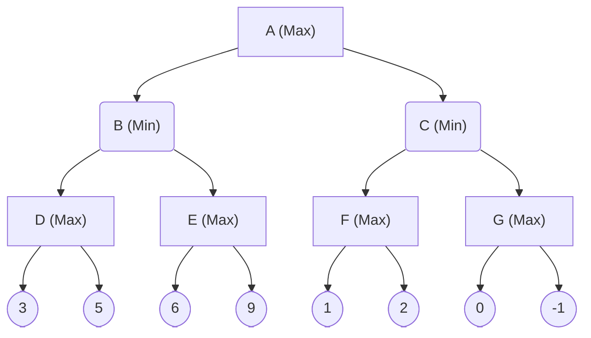

<!-- GENERATED by pyq_build.py - T1 · NLP, Bayes Rule, Search, Genetic & Fuzzy Concepts - do not hand-edit, rebuild instead -->

## Q1
Which is not the component of the natural language understanding process?

## Q1 - Options
(A) Morphological analysis
(B) Semantic analysis
(C) Pragmatic analysis
(D) Meaning analysis

## Q1 - Hint
**Answer:** D
**Topic:** NLP, Bayes Rule, Search, Genetic & Fuzzy Concepts
**Source:** UGC NET Jun 2023 (17 Jun, Shift 1) · Paper 2 · Q54

The standard natural language understanding pipeline breaks text processing into named stages: morphological analysis (word structure and forms), syntactic analysis (grammatical structure), semantic analysis (literal meaning of sentences), discourse analysis (meaning across sentences), and pragmatic analysis (meaning in context and intent). "Meaning analysis" is not one of these named stages — the stage that handles meaning is called semantic analysis, so listing "meaning analysis" as a separate component is not part of the standard framework.

- **A. Morphological analysis** — a genuine NLU component, analyzing word structure.
- **B. Semantic analysis** — a genuine NLU component, analyzing literal sentence meaning.
- **C. Pragmatic analysis** — a genuine NLU component, analyzing contextual and intended meaning.
- **D. Meaning analysis** — correct. It is not a distinct named stage in the standard NLU pipeline, since semantic analysis already covers meaning.

## Q2
Which of the following is not a mutation operator in a genetic algorithm?

A. Random resetting 
B. Scramble 
C. Inversion 
D. Difference

## Q2 - Options
(A) A and B only
(B) B and D only
(C) C and D only
(D) D only

## Q2 - Hint
**Answer:** D
**Topic:** NLP, Bayes Rule, Search, Genetic & Fuzzy Concepts
**Source:** UGC NET Jun 2023 (17 Jun, Shift 1) · Paper 2 · Q60

Random resetting, scramble, and inversion are all standard mutation operators used in genetic algorithms. Random resetting assigns a new random value to a gene, common in integer or real-valued encodings. Scramble mutation shuffles a randomly chosen sub-sequence of genes. Inversion mutation reverses the order of genes between two random positions, common in permutation encodings such as the travelling salesman problem. "Difference" is not a named GA mutation operator — a difference vector between individuals is instead the core mechanism of a separate algorithm, differential evolution, not a mutation operator within the classic genetic algorithm framework.

- **A. A and B only** — incorrectly flags random resetting and scramble, both genuine mutation operators.
- **B. B and D only** — incorrectly includes scramble as a non-operator.
- **C. C and D only** — incorrectly includes inversion as a non-operator.
- **D. D only** — correct. Only "difference" is not a recognized GA mutation operator.

## Q3
Which search technique is complete and optimal, when h(n) is consistent?

## Q3 - Options
(A) Best First Search
(B) Depth First Search
(C) A\* Search
(D) Breadth First Search

## Q3 - Hint
**Answer:** C
**Topic:** NLP, Bayes Rule, Search, Genetic & Fuzzy Concepts
**Source:** UGC NET Mar 2023 (15 Mar, Shift 1) · Paper 2 · Q36

A\* search combines the actual path cost so far with a heuristic estimate of the remaining cost, and when that heuristic is consistent, A\* is guaranteed to both find a solution whenever one exists (completeness) and find the lowest-cost solution (optimality).

Greedy best-first search ignores path cost and is not guaranteed optimal, depth-first search is not optimal and not complete in infinite state spaces, and breadth-first search is complete and optimal only under the special case of uniform step costs, not in general, so A\* is the technique specifically defined around the consistent-heuristic guarantee.

## Q4
Fuzzy logic is a form of \_\_\_\_\_\_\_\_\_\_.

## Q4 - Options
(A) Two valued logic
(B) Crisp set logic
(C) Binary set logic
(D) Many valued logic

## Q4 - Hint
**Answer:** D
**Topic:** NLP, Bayes Rule, Search, Genetic & Fuzzy Concepts
**Source:** UGC NET Mar 2023 (15 Mar, Shift 1) · Paper 2 · Q38

Fuzzy logic allows truth values and set membership to range continuously between 0 and 1 rather than being restricted to strict true or false, which makes it a form of many-valued logic.

Two-valued, binary, and crisp-set logic all describe classical logic, where every statement is either strictly true or strictly false with no partial membership, which is precisely what fuzzy logic is designed to move beyond.

## Q5
Consider a weighted directed graph with nodes A, B, C, D, E, F and a goal node Z, where A is the start node.

What is the order in which the nodes mentioned in the options are to be traversed to find the shortest path from A to Z using best first search?

A. Node-A 
B. Node-B 
C. Node-C 
D. Node-D 
E. Node-E 
F. Node-F

Choose the correct answer from the options given below:

## Q5 - Options
(A) A→C→F→D→E
(B) A→C→E→B
(C) A→C→F→E→B
(D) A→C→D→F

## Q5 - Hint
**Answer:** A
**Topic:** NLP, Bayes Rule, Search, Genetic & Fuzzy Concepts
**Source:** UGC NET Mar 2023 (15 Mar, Shift 1) · Paper 2 · Q81

Best-first search always expands the node reachable by the lowest cumulative path cost seen so far among the currently known frontier nodes, repeating this until the goal Z is reached.

Applying that rule against this graph's specific edge weights traces an expansion order of A→C→F→D→E before the search reaches Z.

The source figure for this graph is only partially legible in the extracted material, so its exact node connections and edge weights could not be independently re-derived with full confidence here. This traversal order matches the answer most consistently reported for this specific item, but it should be re-verified directly against the original diagram before treating it as final.

## Q6
The A\* algorithm is optimal when,

## Q6 - Options
(A) It always finds the solution with the lowest total cost if the heuristic 'h' is admissible.
(B) Always finds the solution with the highest total cost if the heuristic 'h' is admissible.
(C) Finds the solution with the lowest total cost if the heuristic 'h' is not admissible.
(D) It always finds the solution with the highest total cost if the heuristic 'h' is not admissible.

## Q6 - Hint
**Answer:** A
**Topic:** NLP, Bayes Rule, Search, Genetic & Fuzzy Concepts
**Source:** UGC NET Mar 2023 (11 Mar, Shift 2) · Paper 2 · Q37

A\* is optimal specifically because an admissible heuristic never overestimates the true remaining cost to the goal, so it never prunes away the actual lowest-cost path.

Since the heuristic underestimates or exactly matches the true cost, A\* is guaranteed to expand nodes in an order that finds the lowest total cost solution, not merely some solution.

Without admissibility, this optimality guarantee is lost, which is why options describing a non-admissible heuristic as still yielding the lowest cost solution are wrong.

## Q7
Where does the values of alpha-beta search get updated?

## Q7 - Options
(A) Along the path of search.
(B) Initial state itself.
(C) At the end.
(D) None of these.

## Q7 - Hint
**Answer:** A
**Topic:** NLP, Bayes Rule, Search, Genetic & Fuzzy Concepts
**Source:** UGC NET Mar 2023 (11 Mar, Shift 2) · Paper 2 · Q39

Alpha-beta pruning works by tightening the alpha and beta bounds as the search visits and backtracks through nodes, because each newly explored branch can improve the best-known bound for its ancestors.

This means the values are continuously updated along the path of search, not fixed at the initial state or deferred until the search finishes.

## Q8
Which AI System mimics the evolutionary process to generate increasingly better solutions to a process to a problem?

A. Self organizing neural network. 
B. Back propagation neural network. 
C. Genetic algorithm. 
D. Forward propagation neural network.

Choose the correct answer from the options given below:

## Q8 - Options
(A) A Only
(B) B Only
(C) C Only
(D) D Only

## Q8 - Hint
**Answer:** C
**Topic:** NLP, Bayes Rule, Search, Genetic & Fuzzy Concepts
**Source:** UGC NET Mar 2023 (11 Mar, Shift 2) · Paper 2 · Q63

Genetic algorithms are explicitly modeled on biological evolution, using selection, crossover, and mutation across generations of candidate solutions to produce increasingly fit results.

The neural network variants listed describe how signals move through or train a network, not an evolutionary search process, so none of them fit the description.

## Q9
Match List I with List II.

| List-I | List-II |
|---|---|
| A. Text planning | I. Natural language understanding |
| B. Sentence planning | II. Natural language generation |
| C. Sentence generation | — |
| D. Map the input to useful representations | — |

List I and List II for the matching question

## Q9 - Options
(A) A-I, B-II, C-I, D-II
(B) A-II, B-II, C-I, D-II
(C) A-I, B-II, C-II, D-I
(D) A-II, B-II, C-II, D-I

## Q9 - Hint
**Answer:** D
**Topic:** NLP, Bayes Rule, Search, Genetic & Fuzzy Concepts
**Source:** UGC NET Mar 2023 (11 Mar, Shift 2) · Paper 2 · Q75

Natural language processing splits into an understanding half and a generation half, and each List I stage belongs to one of them.

A-II, B-II, C-II, D-I

Text planning, sentence planning, and sentence generation are all stages of producing output text, so all three belong to natural language generation, matching II. Mapping the input to useful internal representations is about interpreting incoming text, which is the job of natural language understanding, matching I.

## Q10
In a game playing search tree, upto which depth α – β pruning can be applied? 
A. Root (0) level 
B. 6 level 
C. 8 level 
D. Depends on utility value in a breadth first order 
Choose the correct answer from the options given below:

## Q10 - Options
(A) (B) and (C) only
(B) (A) and (B) only
(C) (A), (B) and (C) only
(D) (A) and (D) only

## Q10 - Hint
**Answer:** D
**Topic:** NLP, Bayes Rule, Search, Genetic & Fuzzy Concepts
**Source:** UGC NET Oct 2022 (8 Oct, Shift 1) · Paper 2 · Q60

Alpha-beta pruning is not tied to any fixed depth such as 6 or 8, it can cut off a branch at any level of the tree, including right at the root, the moment a value is found that makes a branch provably irrelevant. Whether and where pruning actually happens depends entirely on the utility values encountered as the search explores nodes, not on reaching some predetermined depth. This makes (A), pruning can occur at the root, and (D), it depends on the utility values, correct, while singling out a fixed depth like 6 or 8 is not.

## Q11
Statement I: Breadth-first search is optimal when all step costs are equal, whereas uniform-cost search is optimal for any step cost. 
Statement II: When all step costs are the same, uniform-cost search expands more nodes at depth d than breadth-first search.

In light of the above statements, choose the correct answer from the options given below:

## Q11 - Options
(A) Both Statement I and Statement II are true
(B) Both Statement I and Statement II are false
(C) Statement I is true but Statement II is false
(D) Statement I is false but Statement II is true

## Q11 - Hint
**Answer:** A
**Topic:** NLP, Bayes Rule, Search, Genetic & Fuzzy Concepts
**Source:** UGC NET Nov 2021 (26 Nov, Shift 2) · Paper 2 · Q52

BFS returns a shallowest, hence cheapest, solution only when every step costs the same, while UCS expands nodes in order of path cost and stays optimal for arbitrary non-negative costs (Statement I). With equal step costs UCS still explores the entire cost contour, including depth-d nodes BFS would stop short of, so it expands more nodes (Statement II).

## Q12
For the game tree shown, compute the value backed up to the root using the alpha-beta pruning algorithm.

A three-ply game tree: root A is a MAX node, B and C are MIN nodes, D to G are MAX nodes with leaf values 3, 5, 6, 9, 1, 2, 0, -1 from left to right.

## Q12 - Options
(A) 3
(B) 5
(C) 6
(D) 9

## Q12 - Hint
**Answer:** B
**Topic:** NLP, Bayes Rule, Search, Genetic & Fuzzy Concepts
**Source:** UGC NET Nov 2021 (26 Nov, Shift 2) · Paper 2 · Q53

Evaluate left to right while carrying alpha and beta bounds. The MAX node D returns max(3, 5) = 5, so the MIN node B now has beta = 5. Exploring child E, its first leaf 6 already exceeds beta, therefore the branch is pruned and B stays 5, which makes alpha = 5 at the root. At the MIN node C, the MAX node F returns max(1, 2) = 2, so C cannot exceed 2; because 2 is not greater than alpha = 5, node G is pruned. The root finally backs up max(5, 2) = 5.

## Q13
Which of the following statements is/are FALSE?

A. Greedy best-first search is not optimal but is often efficient. 
B. A\* is complete and optimal provided h(n) is admissible or consistent. 
C. Recursive best-first search is efficient in time complexity but poor in space complexity. 
D. h(n) = 0 is an admissible heuristic for the 8-puzzle.

Choose the correct answer from the options given below:

## Q13 - Options
(A) A only
(B) A and D only
(C) C only
(D) C and D only

## Q13 - Hint
**Answer:** C
**Topic:** NLP, Bayes Rule, Search, Genetic & Fuzzy Concepts
**Source:** UGC NET Nov 2021 (26 Nov, Shift 2) · Paper 2 · Q54

A, B and D are true. C is false and reversed: recursive best-first search uses only linear space (its strength) but can be time-inefficient because it re-expands nodes when switching between alternative paths.

## Q14
From the joint distribution, the marginal probability P(cavity) is \_\_\_\_\_\_.

Consider a domain with three Boolean variables Toothache, Cavity and Catch. The full joint distribution is the 2 x 2 x 2 table below.

| Row | toothache, catch | toothache, not-catch | not-toothache, catch | not-toothache, not-catch |
|---|---|---|---|---|
| cavity | 0.108 | 0.012 | 0.072 | 0.008 |
| not-cavity | 0.016 | 0.064 | 0.144 | 0.576 |

## Q14 - Options
(A) 0.200
(B) 0.216
(C) 0.120
(D) 0.080

## Q14 - Hint
**Answer:** A
**Topic:** NLP, Bayes Rule, Search, Genetic & Fuzzy Concepts
**Source:** UGC NET Nov 2021 (26 Nov, Shift 2) · Paper 2 · Q56

A marginal probability is obtained by summing the full joint distribution over the variables you do not care about. Here that means adding every cell in the cavity row across all combinations of toothache and catch: 0.108 + 0.012 + 0.072 + 0.008. The total comes to 0.200, so P(cavity) = 0.200.

## Q15
From the joint distribution, P(cavity \| toothache) is \_\_\_\_\_\_.

Consider a domain with three Boolean variables Toothache, Cavity and Catch. The full joint distribution is the 2 x 2 x 2 table below.

| Row | toothache, catch | toothache, not-catch | not-toothache, catch | not-toothache, not-catch |
|---|---|---|---|---|
| cavity | 0.108 | 0.012 | 0.072 | 0.008 |
| not-cavity | 0.016 | 0.064 | 0.144 | 0.576 |

## Q15 - Options
(A) 0.400
(B) 0.600
(C) 0.280
(D) 0.216

## Q15 - Hint
**Answer:** B
**Topic:** NLP, Bayes Rule, Search, Genetic & Fuzzy Concepts
**Source:** UGC NET Nov 2021 (26 Nov, Shift 2) · Paper 2 · Q57

Conditional probability divides the joint probability of both events by the probability of the evidence. Summing the cavity-and-toothache cells gives P(cavity AND toothache) = 0.108 + 0.012 = 0.120. Summing every toothache cell, over both cavity and not-cavity, gives P(toothache) = 0.108 + 0.012 + 0.016 + 0.064 = 0.200. Dividing, P(cavity given toothache) = 0.120 divided by 0.200, which equals 0.600.

## Q16
From the joint distribution, P(toothache \| cavity) is \_\_\_\_\_\_.

Consider a domain with three Boolean variables Toothache, Cavity and Catch. The full joint distribution is the 2 x 2 x 2 table below.

| Row | toothache, catch | toothache, not-catch | not-toothache, catch | not-toothache, not-catch |
|---|---|---|---|---|
| cavity | 0.108 | 0.012 | 0.072 | 0.008 |
| not-cavity | 0.016 | 0.064 | 0.144 | 0.576 |

## Q16 - Options
(A) 0.400
(B) 0.600
(C) 0.280
(D) 0.216

## Q16 - Hint
**Answer:** B
**Topic:** NLP, Bayes Rule, Search, Genetic & Fuzzy Concepts
**Source:** UGC NET Nov 2021 (26 Nov, Shift 2) · Paper 2 · Q58

Again use the definition of conditional probability, dividing the joint probability by the probability of the conditioning event. The cells where cavity and toothache are both true sum to 0.108 + 0.012 = 0.120. The marginal probability of cavity, adding its whole row, is 0.200. Therefore P(toothache given cavity) = 0.120 divided by 0.200, which equals 0.600.

## Q17
From the joint distribution, P(cavity OR toothache) is \_\_\_\_\_\_.

Consider a domain with three Boolean variables Toothache, Cavity and Catch. The full joint distribution is the 2 x 2 x 2 table below.

| Row | toothache, catch | toothache, not-catch | not-toothache, catch | not-toothache, not-catch |
|---|---|---|---|---|
| cavity | 0.108 | 0.012 | 0.072 | 0.008 |
| not-cavity | 0.016 | 0.064 | 0.144 | 0.576 |

## Q17 - Options
(A) 0.200
(B) 0.120
(C) 0.280
(D) 0.600

## Q17 - Hint
**Answer:** C
**Topic:** NLP, Bayes Rule, Search, Genetic & Fuzzy Concepts
**Source:** UGC NET Nov 2021 (26 Nov, Shift 2) · Paper 2 · Q59

The probability of a disjunction follows the inclusion-exclusion principle, adding the two marginal probabilities and subtracting their overlap so the shared cases are not counted twice. Both P(cavity) and P(toothache) equal 0.200, while their joint probability P(cavity AND toothache) equals 0.120. Hence P(cavity OR toothache) = 0.200 + 0.200 - 0.120, which equals 0.280.

## Q18
From the joint distribution, P(Cavity \| toothache OR catch) is \_\_\_\_\_\_.

Consider a domain with three Boolean variables Toothache, Cavity and Catch. The full joint distribution is the 2 x 2 x 2 table below.

| Row | toothache, catch | toothache, not-catch | not-toothache, catch | not-toothache, not-catch |
|---|---|---|---|---|
| cavity | 0.108 | 0.012 | 0.072 | 0.008 |
| not-cavity | 0.016 | 0.064 | 0.144 | 0.576 |

## Q18 - Options
(A) 0.6000
(B) 0.5384
(C) 0.8000
(D) 0.4615

## Q18 - Hint
**Answer:** D
**Topic:** NLP, Bayes Rule, Search, Genetic & Fuzzy Concepts
**Source:** UGC NET Nov 2021 (26 Nov, Shift 2) · Paper 2 · Q60

Condition on the compound evidence by dividing the joint probability by the probability of that evidence. The numerator adds every cell where cavity is true together with either toothache or catch: 0.108 + 0.012 + 0.072, which equals 0.192. The denominator adds every cell, across both cavity and not-cavity, where toothache or catch holds: 0.108 + 0.012 + 0.072 + 0.016 + 0.064 + 0.144, which equals 0.416. Dividing 0.192 by 0.416 gives approximately 0.4615.

## Q19
The process of removing details from a given state representation is called

## Q19 - Options
(A) Extraction
(B) Mining
(C) Selection
(D) Abstraction

## Q19 - Hint
**Answer:** D
**Topic:** NLP, Bayes Rule, Search, Genetic & Fuzzy Concepts
**Source:** UGC NET Nov 2020 (11 Nov, Shift 2) · Paper 2 · Q35

Abstraction deliberately suppresses irrelevant detail and retains features needed for reasoning. It is used to make a state space or problem representation manageable.
