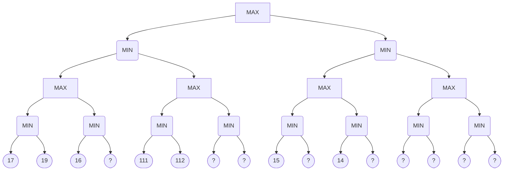
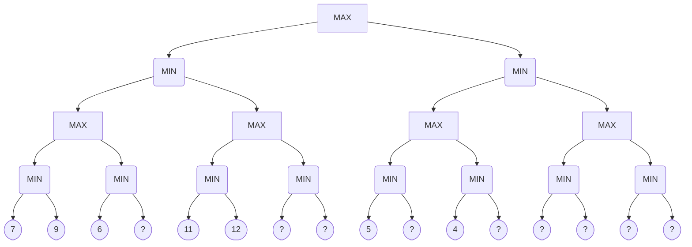
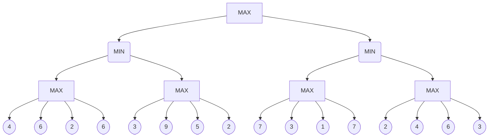

<!-- GENERATED by pyq_build.py - T1 · NLP, Bayes Rule, Search, Genetic & Fuzzy Concepts - do not hand-edit, rebuild instead -->

## Q1
Which statement is NOT true of problem solving in artificial intelligence?

## Q1 - Options
(A) It implements heuristic search techniques.
(B) Solution steps are not explicit.
(C) Knowledge is imprecise.
(D) It works on or implements a repetition mechanism.

## Q1 - Hint
**Answer:** D
**Topic:** NLP, Bayes Rule, Search, Genetic & Fuzzy Concepts
**Source:** UGC NET Nov 2020 (11 Nov, Shift 2) · Paper 2 · Q36

AI problem-solving systems commonly use heuristic search and may handle incomplete or imprecise knowledge. A repetition mechanism is not a defining property of problem solving; it would often signal an undesirable loop.

## Q2
Let the population of chromosomes in genetic algorithm is represented in terms of binary number. The strength of fitness of a chromosome in decimal form, x, is given by:

S f(x) = f(x) / Σ f(x), where f(x) = x²

The population is given by P where: 
P = {(01101), (11000), (01000), (10011)}

The strength of fitness of chromosome (11000) is:

## Q2 - Options
(A) 24
(B) 576
(C) 14.4
(D) 49.2

## Q2 - Hint
**Answer:** D
**Topic:** NLP, Bayes Rule, Search, Genetic & Fuzzy Concepts
**Source:** UGC NET Dec 2019 (4 Dec, Shift 1) · Paper 2 · Q6

Convert binary chromosomes to decimal values:

- 01101 = 13
- 11000 = 24
- 01000 = 8
- 10011 = 19

Calculate fitness f(x) = x² for each chromosome:

- f(13) = 13² = 169
- f(24) = 24² = 576
- f(8) = 8² = 64
- f(19) = 19² = 361

Total population fitness: 
Σ f(x) = 169 + 576 + 64 + 361 = 1170

Strength of fitness of chromosome (11000): 
S f(24) = 576 / 1170 ≈ 0.4923

Expressed as a percentage, this equals 49.2%.

## Q3
A fuzzy conjunction operators, t(x,y), and a fuzzy disjunction operator, s(x,y), form a pair if they satisfy: 
t(x,y) = 1 - s(1-x, 1-y)

If t(x,y) = xy/(x+y-xy) then s(x,y) is given by:

## Q3 - Options
(A) (x+y)/(1-xy)
(B) (x+y-2xy)/(1-xy)
(C) (x+y-xy)/(1-xy)
(D) (x+y-xy)/(1+xy)

## Q3 - Hint
**Answer:** B
**Topic:** NLP, Bayes Rule, Search, Genetic & Fuzzy Concepts
**Source:** UGC NET Dec 2019 (4 Dec, Shift 1) · Paper 2 · Q7

By De Morgan duality for fuzzy norms: 
s(x, y) = 1 - t(1 - x, 1 - y)

Let a = 1 - x and b = 1 - y. Then: 
t(a, b) = ab / (a + b - ab)

Compute numerator and denominator: 
ab = (1 - x)(1 - y) = 1 - x - y + xy a + b - ab = (1 - x) + (1 - y) - (1 - x - y + xy) = 1 - xy

Therefore: 
t(1 - x, 1 - y) = (1 - x - y + xy) / (1 - xy)

Now calculate s(x, y): 
s(x, y) = 1 - (1 - x - y + xy) / (1 - xy) = ((1 - xy) - (1 - x - y + xy)) / (1 - xy) = (x + y - 2xy) / (1 - xy)

## Q4
The order of schema ?10?101? and ???0??1 are \_\_\_\_\_\_\_\_\_\_ and \_\_\_\_\_\_\_\_\_\_ respectively.

## Q4 - Options
(A) 5, 3
(B) 5, 2
(C) 7, 5
(D) 8, 7

## Q4 - Hint
**Answer:** B
**Topic:** NLP, Bayes Rule, Search, Genetic & Fuzzy Concepts
**Source:** UGC NET Dec 2019 (4 Dec, Shift 1) · Paper 2 · Q23

In Holland's Schema Theorem for genetic algorithms, the order of a schema o(H) is defined as the number of fixed positions (bits that are explicitly 0 or 1, excluding wildcard ? symbols):

- In schema ?10?101?, the fixed positions are bit 2 (1), bit 3 (0), bit 5 (1), bit 6 (0), and bit 7 (1). Counting these yields 5 fixed positions, so order = 5.
- In schema ???0??1, the fixed positions are bit 4 (0) and bit 7 (1). Counting these yields 2 fixed positions, so order = 2.

Thus the orders are 5 and 2 respectively.

## Q5
Consider the game tree. Here ○ and □ represent MIN and MAX nodes respectively. The value of the root node of the game tree is:

Game tree with alternating MAX and MIN levels

## Q5 - Options
(A) 14
(B) 17
(C) 111
(D) 112

## Q5 - Hint
**Answer:** B
**Topic:** NLP, Bayes Rule, Search, Genetic & Fuzzy Concepts
**Source:** UGC NET Dec 2019 (4 Dec, Shift 1) · Paper 2 · Q53

Evaluating the minimax tree from leaf level up to the root:

1. Lowest MIN level (circles above leaf squares):

- First MIN node selects min(17, 19) = 17.
- Second MIN node receives 16.
- Third MIN node selects min(111, 112) = 111.
- Fifth MIN node receives 15.
- Sixth MIN node receives 14.

1. Intermediate MAX level (squares above circles):

- Left subtree first MAX node selects max(17, 16) = 17.
- Left subtree second MAX node receives 111.
- Right subtree first MAX node receives 15.
- Right subtree second MAX node receives 14.

1. MIN level below root:

- Left branch chooses min(17, 111) = 17.
- Right branch chooses min(15, 14) = 14.

1. Root MAX node: 
    Selects max(17, 14) = 17.

## Q6
Consider the following:

(a) Trapping at local maxima 
(b) Reaching a plateau 
(c) Traversal along the ridge

Which of the following option represents shortcomings of the hill climbing algorithm?

## Q6 - Options
(A) (a) and (b) only
(B) (a) and (c) only
(C) (b) and (c) only
(D) (a), (b) and (c)

## Q6 - Hint
**Answer:** D
**Topic:** NLP, Bayes Rule, Search, Genetic & Fuzzy Concepts
**Source:** UGC NET Dec 2019 (4 Dec, Shift 1) · Paper 2 · Q80

Classic hill climbing search is a local greedy search that suffers from three well-documented topographical hazards.

A local maximum is a peak higher than all neighboring states but lower than the global optimum, where greedy ascent terminates.

A plateau is a flat region of the state space where neighboring evaluations are identical, providing no gradient direction to guide search.

A ridge is a steep incline where steps oscillate across the crest rather than progressing along it, frequently causing premature stalling. Hence, (a), (b), and (c) all represent shortcomings of hill climbing.

## Q7
Consider the following models:

M₁: Mamdani model 
M₂: Takagi-Sugeno-Kang model 
M₃: Kosko’s additive model (SAM)

Which of the following option contains examples of additive rule model?

## Q7 - Options
(A) Only M₁ and M₂
(B) Only M₂ and M₃
(C) Only M₁ and M₃
(D) M₁, M₂ and M₃

## Q7 - Hint
**Answer:** B
**Topic:** NLP, Bayes Rule, Search, Genetic & Fuzzy Concepts
**Source:** UGC NET Dec 2019 (4 Dec, Shift 1) · Paper 2 · Q87

In fuzzy systems, additive rule models compute the combined system output by directly summing individual rule contributions rather than performing a geometric union over output fuzzy set profiles.

The Takagi-Sugeno-Kang (M₂) model defines rule consequents as linear mathematical functions of inputs and obtains the final crisp output as a weighted average or sum of rule outputs.

Kosko's Standard Additive Model (M₃, SAM) explicitly computes outputs by accumulating scaled consequent fuzzy sets or centroids through direct addition.

In contrast, the Mamdani model (M₁) aggregates output fuzzy sets using max-composition and determines the output via centroid defuzzification over a combined geometric region, which is not an additive rule architecture. Thus, only M₂ and M₃ are additive rule models.

## Q8
Match List-I with List-II:

| List-I | List-II |
|---|---|
| (a) Greedy best-first | (i) Minimal cost (p) + h(p) |
| (b) Lowest cost-first | (ii) Minimal h(p) |
| (c) A\* algorithm | (iii) Minimal cost (p) |

## Q8 - Options
(A) (a)-(i); (b)-(ii); (c)-(iii)
(B) (a)-(iii); (b)-(ii); (c)-(i)
(C) (a)-(i); (b)-(iii); (c)-(ii)
(D) (a)-(ii); (b)-(iii); (c)-(i)

## Q8 - Hint
**Answer:** D
**Topic:** NLP, Bayes Rule, Search, Genetic & Fuzzy Concepts
**Source:** UGC NET Jun 2019 (24 Jun, Shift 1) · Paper 2 · Q13

Evaluation functions in informed search algorithms determine which path p is expanded first:

(a)-(ii), (b)-(iii), (c)-(i)

- **(a) Greedy best-first** — expands nodes solely based on the estimated distance to goal, minimizing h(p).
- **(b) Lowest cost-first** — expands paths solely based on the accumulated path cost so far, minimizing cost(p).
- **(c) A* algorithm*\* — balances actual path cost and estimated heuristic cost, minimizing cost(p) + h(p).

## Q9
Consider the following: 
(a) Evolution 
(b) Selection 
(c) Reproduction 
(d) Mutation

Which of the following are found in genetic algorithms?

## Q9 - Options
(A) (b), (c) and (d) only
(B) (b) and (d) only
(C) (a), (b), (c) and (d)
(D) (a), (b) and (d) only

## Q9 - Hint
**Answer:** C
**Topic:** NLP, Bayes Rule, Search, Genetic & Fuzzy Concepts
**Source:** UGC NET Jun 2019 (24 Jun, Shift 1) · Paper 2 · Q39

Genetic algorithms model Darwinian natural evolution to solve complex optimization problems:

- **(a) Evolution** — represents the generational adaptation of candidate solution populations.
- **(b) Selection** — identifies the fittest chromosomes to survive and mate.
- **(c) Reproduction (Crossover)** — recombines genetic material between pairs of parents to create offspring.
- **(d) Mutation** — introduces stochastic perturbations in alleles to preserve population diversity.

All four components are integral to genetic algorithms.

## Q10
Consider the game tree given below: 
Here ○ and □ represents MIN and MAX nodes respectively. 
The value of the root node of the game tree is

Game tree with alternating MIN and MAX nodes

## Q10 - Options
(A) 4
(B) 7
(C) 11
(D) 12

## Q10 - Hint
**Answer:** B
**Topic:** NLP, Bayes Rule, Search, Genetic & Fuzzy Concepts
**Source:** UGC NET Jun 2019 (24 Jun, Shift 1) · Paper 2 · Q42

Evaluating the minimax tree from bottom to top:

1. At the lowest MIN level, each circular node selects the minimum of its square leaf children: 
   First branch: min(7, 9) = 7 
   Second branch: value 6 
   Third branch: min(11, 12) = 11
2. At the next level up (MAX), square nodes take the maximum of their child MIN nodes: 
   Left subtree: max(7, 6) = 7 
   Middle subtree: max(11, ...) = 11
3. At the MIN level below the root, the left branch takes min(7, 11) = 7.
4. At the root (MAX), comparing the subtrees evaluates to 7.

## Q11
A fuzzy conjunction operator denoted as t(x, y) and a fuzzy disjunction operator denoted as s(x, y) form a dual pair if they satisfy the condition:

## Q11 - Options
(A) t(x, y) = 1 - s(x, y)
(B) t(x, y) = s(1-x, 1-y)
(C) t(x, y) = 1 - s(1-x, 1-y)
(D) t(x, y) = s(1+x, 1+y)

## Q11 - Hint
**Answer:** C
**Topic:** NLP, Bayes Rule, Search, Genetic & Fuzzy Concepts
**Source:** UGC NET Jun 2019 (24 Jun, Shift 1) · Paper 2 · Q46

In fuzzy set theory, t-norms (fuzzy conjunction) and s-norms (fuzzy disjunction) form dual pairs under generalized De Morgan's laws with respect to the standard fuzzy complement c(a) = 1 - a.

The duality relation is defined as: 
c(t(x, y)) = s(c(x), c(y)) 
1 - t(x, y) = s(1 - x, 1 - y) 
t(x, y) = 1 - s(1 - x, 1 - y).

## Q12
Consider the following methods: 
M₁: Mean of maximum 
M₂: Centre of area 
M₃: Height method

Which of the following is/are defuzzification method(s)?

## Q12 - Options
(A) Only M₁
(B) Only M₁ and M₂
(C) Only M₂ and M₃
(D) M₁, M₂ and M₃

## Q12 - Hint
**Answer:** D
**Topic:** NLP, Bayes Rule, Search, Genetic & Fuzzy Concepts
**Source:** UGC NET Jun 2019 (24 Jun, Shift 1) · Paper 2 · Q83

Defuzzification converts fuzzy membership sets produced by inference engines into crisp numerical values:

- **M1 (Mean of Maximum, MOM)** calculates the average of all domain values that reach peak membership grade.
- **M2 (Centre of Area, COA / Centroid)** calculates the geometric center of gravity across the aggregate membership curve.
- **M3 (Height method)** evaluates crisp outputs by weighting the peak heights and center locations of individual fuzzy subsets.

All three are recognized defuzzification techniques.

## Q13
Let Aα₀ denotes the α-cut of a fuzzy set A at α₀. If α₁ &lt; α₂, then

## Q13 - Options
(A) Aα₁ ⊇ Aα₂
(B) Aα₁ ⊃ Aα₂
(C) Aα₁ ⊆ Aα₂
(D) Aα₁ ⊂ Aα₂

## Q13 - Hint
**Answer:** A
**Topic:** NLP, Bayes Rule, Search, Genetic & Fuzzy Concepts
**Source:** UGC NET Jun 2019 (24 Jun, Shift 1) · Paper 2 · Q85

In fuzzy set theory, the alpha-cut A_alpha consists of all elements whose membership degree is at least alpha: 
A_alpha = { x ∈ X \| μ\_A(x) &gt;= alpha }.

When alpha1 &lt; alpha2: 
Any element whose membership grade satisfies μ\_A(x) &gt;= alpha2 automatically satisfies μ\_A(x) &gt;= alpha1. 
Every element in A_alpha2 is therefore contained in A_alpha1.

This establishes the superset inclusion relation A_alpha1 ⊇ A_alpha2.

## Q14
Consider the following statements :

S1 : A heuristic is admissible if it never overestimates the cost to reach the goal. 
S2 : A heuristic is monotonous if it follows triangle inequality property.

Which one of the following is true referencing the above statements ? 
Choose the correct answer from the code given below : 
Code :

## Q14 - Options
(A) Neither of the statements S1 and S2 are true.
(B) Statement S1 is false but statement S2 is true.
(C) Statement S1 is true but statement S2 is false.
(D) Both the statements S1 and S2 are true.

## Q14 - Hint
**Answer:** D
**Topic:** NLP, Bayes Rule, Search, Genetic & Fuzzy Concepts
**Source:** UGC NET Dec 2018 (20 Dec, Shift 1) · Paper 2 · Q8

Both statements define core properties of heuristic functions used in informed search algorithms like A\*.

- Statement S1 is true because an admissible heuristic satisfies h(n) &lt;= h\*(n) for all nodes n, guaranteeing optimality.
- Statement S2 is true because monotonicity (consistency) requires h(n) &lt;= c(n, a, n') + h(n'), which is the triangle inequality in state space.
- Because both definitions are standard in artificial intelligence, Option D is the correct choice.

## Q15
Match List-I with List-II and choose the correct answer from the code:

| List-I | List-II |
|---|---|
| (a) Greedy Best-First Search | (i) Selects a node for expansion if optimal path to that node has been found. |
| (b) A\* Search | (ii) Avoids substantial overhead associated with keeping the sorted queue of nodes. |
| (c) Recursive Best-First Search | (iii) Suffers from excessive node generation. |
| (d) Iterative-deepening A\* Search | (iv) Time complexity depends on the quality of heuristic. |

Informed search algorithms and their characteristics

## Q15 - Options
(A) (iv) (i) (ii) (iii)
(B) (i) (iv) (iii) (ii)
(C) (iv) (iii) (ii) (i)
(D) (i) (ii) (iii) (iv)

## Q15 - Hint
**Answer:** B
**Topic:** NLP, Bayes Rule, Search, Genetic & Fuzzy Concepts
**Source:** UGC NET Dec 2018 (20 Dec, Shift 1) · Paper 2 · Q70

Matching informed search algorithms with their core operational characteristics establishes the correct pairings.

- (a) Greedy Best-First Search selects nodes for expansion solely based on heuristic evaluation h(n) estimating proximity to the goal, matching (i).
- (b) A\* Search incorporates both path cost g(n) and heuristic h(n), and its time complexity depends directly on the accuracy and quality of the heuristic function, matching (iv).
- (c) Recursive Best-First Search (RBFS) operates in linear memory but repeatedly forgets and regenerates subtrees when backing up, suffering from excessive node generation, matching (iii).
- (d) Iterative-deepening A\* Search (IDA\*) conducts successive depth-first searches bounded by f-cost cutoffs, avoiding the substantial overhead of maintaining an open sorted priority queue, matching (ii).

Mapping: 
(a) -&gt; (i), (b) -&gt; (iv), (c) -&gt; (iii), (d) -&gt; (ii).

- This code matches Option B: (i) (iv) (iii) (ii).

## Q16
Consider the following statements related to AND-OR Search algorithm.

S1 : A solution is a subtree that has a goal node at every leaf. 
S2 : OR nodes are analogous to the branching in a deterministic environment. 
S3 : AND nodes are analogous to the branching in a non-deterministic environment.

Which one of the following is true referencing the above statements ? 
Choose the correct answer from the code given below : 
Code :

## Q16 - Options
(A) S1 – True, S2 – True, S3 – True
(B) S1 – False, S2 – True, S3 – True
(C) S1 – False, S2 – True, S3 – False
(D) S1 – True, S2 – True, S3 – False

## Q16 - Hint
**Answer:** A
**Topic:** NLP, Bayes Rule, Search, Genetic & Fuzzy Concepts
**Source:** UGC NET Dec 2018 (20 Dec, Shift 1) · Paper 2 · Q75

All three statements are formal definitions of AND-OR search trees used for problem solving in nondeterministic environments.

- Statement S1 is true because an AND-OR search solution is a conditional subtree where every leaf corresponds to a goal state.
- Statement S2 is true because OR nodes represent the agent's alternative action choices, which corresponds to ordinary branching in a deterministic environment.
- Statement S3 is true because AND nodes represent the environment's nondeterministic outcomes for a selected action, requiring the agent to have a contingency plan for every branch.
- Therefore, all three statements S1, S2, and S3 are true (Option A).

## Q17
Consider the following terminology and match List-I with List-II and choose the correct answer from the code:

b = branching factor d = depth of the shallowest solution m = Maximum depth of the search tree l = depth limit

| List-I (Algorithms) | List-II (Space Complexity) |
|---|---|
| (a) BFS search | (i) O(bd) |
| (b) DFS search | (ii) O(b^d) |
| (c) Depth-limited search | (iii) O(bm) |
| (d) Iterative deepening search | (iv) O(bl) |

Search algorithms and their space complexities

## Q17 - Options
(A) (ii) (iii) (iv) (i)
(B) (i) (iii) (iv) (ii)
(C) (iii) (ii) (iv) (i)
(D) (i) (iii) (iv) (ii)

## Q17 - Hint
**Answer:** A
**Topic:** NLP, Bayes Rule, Search, Genetic & Fuzzy Concepts
**Source:** UGC NET Dec 2018 (20 Dec, Shift 1) · Paper 2 · Q87

Matching search algorithms with their theoretical worst-case space complexities gives the standard artificial intelligence bounds.

- (a) Breadth-First Search (BFS) stores every node in the frontier at depth d, requiring exponential space O(b^d), matching (ii).
- (b) Depth-First Search (DFS) stores only the single active branch down to maximum depth m, requiring linear space O(bm), matching (iii).
- (c) Depth-limited search is bounded by depth cutoff l, consuming linear space O(bl), matching (iv).
- (d) Iterative deepening search (IDS) retains only a single branch down to current depth d, consuming linear space O(bd), matching (i).

Mapping: 
(a) -&gt; (ii), (b) -&gt; (iii), (c) -&gt; (iv), (d) -&gt; (i).

- This code corresponds to Option A: (ii) (iii) (iv) (i).

## Q18
Consider the minimax game tree search shown in the diagram.

What will be the value propagated at the root ?

Minimax game tree search with alternating levels

## Q18 - Options
(A) 4
(B) 5
(C) 6
(D) 3

## Q18 - Hint
**Answer:** C
**Topic:** NLP, Bayes Rule, Search, Genetic & Fuzzy Concepts
**Source:** UGC NET Dec 2018 (20 Dec, Shift 1) · Paper 2 · Q88

Evaluating the game tree bottom-up with alternating MAX and MIN choices yields a root value of 6.

1. Level 3 (lowest MAX nodes above leaves):

- Subtree 1 leaves: 4, 6, 2, 6 -&gt; max(4, 6, 2, 6) = 6
- Subtree 2 leaves: 3, 9, 5, 2 -&gt; max(3, 9, 5, 2) = 9
- Subtree 3 leaves: 7, 3, 1, 7 -&gt; max(7, 3, 1, 7) = 7
- Subtree 4 leaves: 2, 4, 6, 3 -&gt; max(2, 4, 6, 3) = 6

1. Level 2 (intermediate MIN nodes):

- Left MIN node chooses between Subtrees 1 and 2: min(6, 9) = 6
- Right MIN node chooses between Subtrees 3 and 4: min(7, 6) = 6

1. Level 1 (root MAX node):

- Root MAX chooses between left and right MIN nodes: max(6, 6) = 6.
- Therefore, the value propagated at the root is 6 (Option C).

## Q19
A full joint distribution for the Toothache, Cavity and Catch is given in the table:

|   | Toothache Catch | Toothache ¬Catch | ¬Toothache Catch | ¬Toothache ¬Catch |
|---|---|---|---|---|
| **Cavity** | 0·108 | 0·012 | 0·072 | 0·008 |
| **¬Cavity** | 0·016 | 0·064 | 0·144 | 0·576 |

What is the probability of Cavity, given evidence of Toothache?

## Q19 - Options
(A) &lt;0·2, 0·8&gt;
(B) &lt;0·6, 0·8&gt;
(C) &lt;0·6, 0·4&gt;
(D) &lt;0·4, 0·8&gt;

## Q19 - Hint
**Answer:** C
**Topic:** NLP, Bayes Rule, Search, Genetic & Fuzzy Concepts
**Source:** UGC NET Dec 2018 (20 Dec, Shift 1) · Paper 2 · Q99

Conditioning on the evidence of Toothache and normalizing across Cavity states produces distribution &lt;0.6, 0.4&gt;.

From the joint probability table, summing under the condition Toothache = true:

1. For Cavity = true: 
   P(Cavity ∧ Toothache) = P(Cavity, Toothache, Catch) + P(Cavity, Toothache, ¬Catch) 
   = 0.108 + 0.012 = 0.120.
2. For Cavity = false (¬Cavity): 
   P(¬Cavity ∧ Toothache) = P(¬Cavity, Toothache, Catch) + P(¬Cavity, Toothache, ¬Catch) 
   = 0.016 + 0.064 = 0.080.
3. Total marginal probability P(Toothache): 
   P(Toothache) = 0.120 + 0.080 = 0.200.
4. Normalizing the conditional probabilities: 
   P(Cavity \| Toothache) = 0.120 / 0.200 = 0.6. 
   P(¬Cavity \| Toothache) = 0.080 / 0.200 = 0.4.

- The conditional probability distribution vector is &lt;0.6, 0.4&gt; (Option C).
