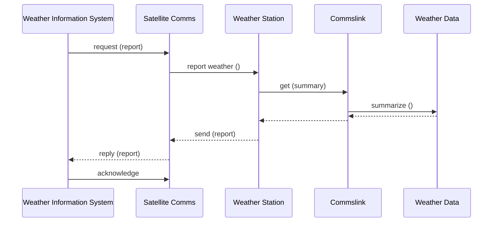

<!-- GENERATED by pyq_build.py - T1 · SE: Design, UML, Configuration Management & Reuse - do not hand-edit, rebuild instead -->

## Q1
Modules X and Y operate on the same input and output, then the cohesion is

## Q1 - Options
(A) Logical cohesion
(B) Sequential cohesion
(C) Procedural cohesion
(D) Communicational cohesion

## Q1 - Hint
**Answer:** D
**Topic:** SE: Design, UML, Configuration Management & Reuse
**Source:** UGC NET Oct 2022 (8 Oct, Shift 1) · Paper 2 · Q34

Communicational cohesion is defined precisely as elements of a module operating on the same input data and/or producing the same output data, which is exactly the relationship described between X and Y. Sequential cohesion instead requires the output of one element to feed directly into the next, and procedural cohesion requires elements to follow a specific execution order without necessarily sharing data.

## Q2
Match List I with List II regarding software design concepts.

| List-I | List-II |
|---|---|
| A. Localization | I. Encapsulation |
| B. Packaging or binding of a collection of items | II. Abstraction |
| C. Mechanism that enables designer to focus on essential details of a program component | III. Characteristic of software that indicates the manner in which information is concentrated in program |
| D. Information hiding | IV. Suppressing the operational details of a program component |

## Q2 - Options
(A) (A)-(I), (B)-(II), (C)-(III), (D)-(IV)
(B) (A)-(II), (B)-(I), (C)-(III), (D)-(IV)
(C) (A)-(III), (B)-(I), (C)-(II), (D)-(IV)
(D) (A)-(III), (B)-(I), (C)-(IV), (D)-(II)

## Q2 - Hint
**Answer:** C
**Topic:** SE: Design, UML, Configuration Management & Reuse
**Source:** UGC NET Oct 2022 (8 Oct, Shift 1) · Paper 2 · Q67

Localization describes the characteristic of software indicating how information is concentrated within it. 
Packaging or binding a collection of items together is the definition of encapsulation. 
A mechanism that lets a designer focus on essential details while ignoring lower-level ones is abstraction. 
Information hiding is precisely the suppression of a component's operational details from the rest of the system.

Matching gives A-III, B-I, C-II, D-IV.

## Q3
A top down approach to programming calls for : 
Statement I: Working from the general to the specific. 
Statement II: Postpone the minor decisions. 
Statement III: A systematic approach. 
Statement IV: Intermediate coding of the problem. 
Which of the following is true?

## Q3 - Options
(A) Statement I only
(B) Statement I and Statement II only
(C) Statement I, Statement II and Statement III only
(D) Statement I, Statement II and Statement IV only

## Q3 - Hint
**Answer:** C
**Topic:** SE: Design, UML, Configuration Management & Reuse
**Source:** UGC NET Oct 2022 (8 Oct, Shift 1) · Paper 2 · Q80

Top-down design proceeds by stepwise refinement, and three of the four listed statements describe that process correctly.

- **Statement I. Working from the general to the specific.** — true. This is the core idea of stepwise refinement: start from the overall structure and progressively add detail.
- **Statement II. Postpone the minor decisions.** — true. Implementation-level details are deferred until the higher-level structure is settled.
- **Statement III. A systematic approach.** — true. Refinement proceeds through an orderly sequence of steps rather than ad hoc changes.
- **Statement IV. Intermediate coding of the problem.** — false. Top-down design defers coding until the structure is fully refined, and there is no recognized stage called intermediate coding.

Statements I, II, and III together describe top-down design, so option C is correct.

## Q4
In the MVC architectural pattern, the View component is responsible for:

## Q4 - Options
(A) User interface
(B) Security of the system
(C) Business logic and domain objects
(D) Translating between user interface actions/events and operations on the domain objects

## Q4 - Hint
**Answer:** A
**Topic:** SE: Design, UML, Configuration Management & Reuse
**Source:** UGC NET Nov 2021 (26 Nov, Shift 2) · Paper 2 · Q12

In Model-View-Controller the View handles presentation and user-interface rendering. Business logic and domain data belong to the Model, and translating user actions into Model operations is the Controller.

## Q5
In Software Configuration Management (SCM), which kinds of files should be committed to the source control repository?

A. Code files 
B. Documentation files 
C. Output files 
D. Automatically generated files that are required for the system to be used

Choose the correct answer from the options given below:

## Q5 - Options
(A) A and B only
(B) B and C only
(C) C and D only
(D) D and A only

## Q5 - Hint
**Answer:** A
**Topic:** SE: Design, UML, Configuration Management & Reuse
**Source:** UGC NET Nov 2021 (26 Nov, Shift 2) · Paper 2 · Q16

Hand-authored source artefacts - code (A) and documentation (B) - belong in version control. Build outputs (C) and generated files (D) should not be committed because they are reproducible from the sources and only add merge noise and staleness.

## Q6
Which UML diagram has a static view?

## Q6 - Options
(A) Collaboration diagram
(B) Use-case diagram
(C) State-chart diagram
(D) Activity diagram

## Q6 - Hint
**Answer:** B
**Topic:** SE: Design, UML, Configuration Management & Reuse
**Source:** UGC NET Nov 2020 (11 Nov, Shift 2) · Paper 2 · Q19

Use-case diagrams describe the actors and required system functionality without modelling a time-ordered execution. Collaboration, state-chart, and activity diagrams are behavioural or interaction views.

## Q7
Modifying software by restructuring is called

## Q7 - Options
(A) Adaptive maintenance
(B) Corrective maintenance
(C) Perfective maintenance
(D) Preventive maintenance

## Q7 - Hint
**Answer:** C
**Topic:** SE: Design, UML, Configuration Management & Reuse
**Source:** UGC NET Nov 2020 (11 Nov, Shift 2) · Paper 2 · Q20

Perfective maintenance improves internal design, maintainability, efficiency, or other quality attributes after delivery; restructuring is a typical perfective change. Corrective maintenance fixes faults, while adaptive maintenance responds to a changed environment.

## Q8
To create an object-behavioural model, an analyst 
A. evaluates use cases, 
B. builds a state-transition diagram, 
C. reviews the model for accuracy and consistency, and 
D. identifies events that do not drive an interaction sequence.

## Q8 - Options
(A) (A), (B), and (C) only
(B) (A), (B), and (D) only
(C) (B), (C), and (D) only
(D) (A), (C), and (D) only

## Q8 - Hint
**Answer:** A
**Topic:** SE: Design, UML, Configuration Management & Reuse
**Source:** UGC NET Nov 2020 (11 Nov, Shift 2) · Paper 2 · Q50

Use cases reveal the events and object responses, then state transitions model behaviour and the result is reviewed. Events that do not drive an interaction sequence are not part of that normal modelling step.

## Q9
The sequence diagram for the Weather Information System takes place when an external system requests the summarized data from the weather station. The increasing order of lifeline for the objects in the system are:

UML sequence diagram for the Weather Information System

## Q9 - Options
(A) Sat comms → Weather station → Comms link → Weather data
(B) Sat comms → Comms link → Weather station → Weather data
(C) Weather data → Comms link → Weather station → Sat Comms
(D) Weather data → Weather station → Comms link → Sat Comms

## Q9 - Hint
**Answer:** C, D
**Topic:** SE: Design, UML, Configuration Management & Reuse
**Source:** UGC NET Dec 2019 (4 Dec, Shift 1) · Paper 2 · Q68

Analyzing object lifeline active durations in the sequence diagram:

- Weather Data has the shortest active execution bar, active only while running Summarize().
- Commslink is active next, invoking and receiving results from Weather Data.
- Weather Station has a broader activation window coordinating reports.
- Sat Comms maintains the longest activation span across request, transmission, and acknowledgement.

NTA marked this question as dropped / awarded marks to all candidates due to phrasing ambiguity regarding vertical dotted line versus execution activation box length. In increasing order of activation duration, Weather Data has the shortest active duration while Sat Comms has the longest.

## Q10
In a system for a restaurant, the main scenario for placing order is given below:

(a) Customer reads menu 
(b) Customer places order 
(c) Order is sent to kitchen for preparation 
(d) Ordered items are served 
(e) Customer requests for a bill for the order 
(f) Bill is prepared for this order 
(g) Customer is given the bill 
(h) Customer pays the bill

A sequence diagram for the scenario will have atleast how many objects among whom the messages will be exchanged?

## Q10 - Options
(A) 3
(B) 4
(C) 5
(D) 6

## Q10 - Hint
**Answer:** C
**Topic:** SE: Design, UML, Configuration Management & Reuse
**Source:** UGC NET Dec 2019 (4 Dec, Shift 1) · Paper 2 · Q88

In object-oriented software engineering, actors and system entities that exchange distinct responsibilities in this scenario form lifelines in the sequence diagram.

The scenario encompasses five collaborating entities:

1. Customer: initiates the interaction, places the order, requests the bill, and submits payment.
2. Waiter or Order Taker: receives the customer order and transfers it to the preparation area.
3. Kitchen or Chef: prepares the ordered items.
4. Serving Person: delivers the completed food items to the customer.
5. Cashier or Billing System: prepares the invoice and collects payment.

Therefore, at least 5 interacting objects are required to model this communication sequence.

## Q11
Software products need adaptive maintenance for which of the following reasons?

## Q11 - Options
(A) To rectify bugs observed while the system is in use
(B) When the customers need the product to run on new platforms
(C) To support the new features that users want it to support
(D) To overcome wear and tear caused by the repeated use of the software

## Q11 - Hint
**Answer:** B
**Topic:** SE: Design, UML, Configuration Management & Reuse
**Source:** UGC NET Jun 2019 (24 Jun, Shift 1) · Paper 2 · Q7

Software maintenance is categorized into four standard types based on the triggering cause:

- **A. Corrective maintenance** — rectifies latent faults and bugs discovered during production use.
- **B. Adaptive maintenance** — modifies software to accommodate changes in its external operating environment, such as new operating systems, hardware platforms, or external libraries.
- **C. Perfective maintenance** — enhances software by adding new functional requirements requested by users.
- **D. Physical wear and tear** — does not apply to software artifacts, which do not deteriorate mechanically.

## Q12
The M components in MVC are responsible for

## Q12 - Options
(A) user interface
(B) security of the system
(C) business logic and domain objects
(D) translating between user interface actions/events and operations on the domain objects

## Q12 - Hint
**Answer:** C
**Topic:** SE: Design, UML, Configuration Management & Reuse
**Source:** UGC NET Jun 2019 (24 Jun, Shift 1) · Paper 2 · Q35

In Model-View-Controller (MVC) software architecture, duties are divided into three distinct roles:

- **Model (M)** — encapsulates domain data objects, persistence rules, and core business logic.
- **View (V)** — renders presentation elements and manages user interface displays.
- **Controller (C)** — processes user input events and directs interactions between Model and View.

## Q13
Which of the following statements is/are true?

P: In software engineering, defects that are discovered earlier are more expensive to fix. 
Q: A software design is said to be a good design, if the components are strongly cohesive and weakly coupled.

Select the correct answer from the options given below:

## Q13 - Options
(A) P only
(B) Q only
(C) P and Q
(D) Neither P nor Q

## Q13 - Hint
**Answer:** B
**Topic:** SE: Design, UML, Configuration Management & Reuse
**Source:** UGC NET Jun 2019 (24 Jun, Shift 1) · Paper 2 · Q37

Evaluating software engineering principles:

- **P** is false because the cost of fixing software defects escalates exponentially in later stages (Boehm's cost of change curve). Defects caught during requirements or design are much cheaper to resolve than defects found during post-release deployment.
- **Q** is true because high cohesion (modules have single, focused responsibilities) and weak/loose coupling (modules maintain minimal interdependencies) are standard hallmarks of modular, maintainable software design.

## Q14
Software reuse is

## Q14 - Options
(A) the process of analysing software with the objective of recovering its design and specification
(B) the process of using existing software artifacts and knowledge to build new software
(C) concerned with reimplementing legacy system to make them more maintainable
(D) the process of analysing software to create a representation of a higher level of abstraction and breaking software down into its parts to see how it works

## Q14 - Hint
**Answer:** B
**Topic:** SE: Design, UML, Configuration Management & Reuse
**Source:** UGC NET Jun 2019 (24 Jun, Shift 1) · Paper 2 · Q75

Software reuse is the software engineering discipline of building new applications using pre-existing software assets, components, architectures, and design patterns rather than constructing everything from scratch.

- **A and D** describe reverse engineering.
- **C** describes software re-engineering / refactoring.

## Q15
Which of the following terms best describes Git?

## Q15 - Options
(A) Issue Tracking System
(B) Integrated Development Environment
(C) Distributed Version Control System
(D) Web-based Repository Hosting Service

## Q15 - Hint
**Answer:** C
**Topic:** SE: Design, UML, Configuration Management & Reuse
**Source:** UGC NET Jun 2019 (24 Jun, Shift 1) · Paper 2 · Q100

Git is a Distributed Version Control System (DVCS) designed to record and manage changes across file trees over time:

- **A. Issue tracking systems** — track bug reports and tasks (e.g. Jira).
- **B. Integrated development environments** — provide code authoring and debugging tools (e.g. VS Code).
- **C. Distributed Version Control System** — allows developers to maintain complete local clones of repositories and collaborate without mandatory central connection.
- **D. Hosting services** — provide remote cloud repositories (e.g. GitHub).

## Q16
Software coupling involves dependencies among pieces of software called modules. Which of the following are correct statements with respect to module coupling ?

P : Common coupling occurs when two modules share the same global data. 
Q : Control coupling occurs when modules share a composite data structure and use only parts of it. 
R : Content coupling occurs when one module modifies or relies on the internal working of another module.

Choose the correct answer from the code given below : 
Code :

## Q16 - Options
(A) P and Q only
(B) Q and R only
(C) All of P, Q and R
(D) P and R only

## Q16 - Hint
**Answer:** D
**Topic:** SE: Design, UML, Configuration Management & Reuse
**Source:** UGC NET Dec 2018 (20 Dec, Shift 1) · Paper 2 · Q26

Statements P and R correctly identify common coupling and content coupling in modular software design.

- Statement P is true because common coupling occurs when two or more modules read or write to the same global data area.
- Statement Q is false because sharing a composite data structure and using only portions of it defines stamp coupling. Control coupling occurs when one module controls the flow of another by passing control information or flags.
- Statement R is true because content coupling (the worst form of coupling) occurs when one module modifies or depends directly on the internal implementation of another module.
- Hence, statements P and R only are correct (Option D).

## Q17
Software products need perfective maintenance for which of the following reasons ?

## Q17 - Options
(A) To overcome wear and tear caused by the repeated use of the software.
(B) To rectify bugs observed while the system is in use.
(C) When the customers need the product to run on new platforms.
(D) To support the new features that users want it to support.

## Q17 - Hint
**Answer:** D
**Topic:** SE: Design, UML, Configuration Management & Reuse
**Source:** UGC NET Dec 2018 (20 Dec, Shift 1) · Paper 2 · Q30

Perfective maintenance enhances existing software by implementing new user requirements, features, or performance improvements.

- Perfective maintenance accounts for the largest proportion of software maintenance activities and responds to evolving user desires.
- Option A is incorrect because software is logical rather than physical and does not experience wear and tear.
- Option B describes corrective maintenance, which fixes defects discovered during operation.
- Option C describes adaptive maintenance, which modifies software to operate in changed hardware or OS environments.

## Q18
Which of the following statements is/are true ?

P : Software Reengineering is preferable for software products having high failure rates, having poor design and/or having poor code structure. 
Q : Software Reverse Engineering is the process of analyzing software with the objective of recovering its design and requirements specification.

Choose the correct answer from the code given below : 
Code :

## Q18 - Options
(A) Both P and Q
(B) Neither P nor Q
(C) P only
(D) Q only

## Q18 - Hint
**Answer:** A
**Topic:** SE: Design, UML, Configuration Management & Reuse
**Source:** UGC NET Dec 2018 (20 Dec, Shift 1) · Paper 2 · Q35

Both statements define established engineering practices for maintaining and evolving legacy software systems.

- Statement P is true because software reengineering restructures legacy applications with high maintenance costs, poor architectural design, and frequent failures to improve reliability and maintainability.
- Statement Q is true because reverse engineering analyzes an existing software product to extract high-level architectural models, design specifications, and requirements without altering functionality.
- Therefore, both statements P and Q are true (Option A).

## Q19
Match each UML diagram in List-I to its appropriate description in List-II and choose the correct answer from the code:

| List-I | List-II |
|---|---|
| (a) State Diagram | (i) Describes how the external entities (people, devices) can interact with the system. |
| (b) Use-Case Diagram | (ii) Used to describe the static or structural view of a system. |
| (c) Class Diagram | (iii) Used to show the flow of a business process, the steps of a use-case or the logic of an object behaviour. |
| (d) Activity Diagram | (iv) to the dynamic behaviour of objects and could also be used to describe the entire system behaviour. |

UML diagrams and descriptions

## Q19 - Options
(A) (iv) (ii) (i) (iii)
(B) (iv) (i) (ii) (iii)
(C) (i) (iv) (iii) (ii)
(D) (i) (iv) (ii) (iii)

## Q19 - Hint
**Answer:** B
**Topic:** SE: Design, UML, Configuration Management & Reuse
**Source:** UGC NET Dec 2018 (20 Dec, Shift 1) · Paper 2 · Q52

Matching each UML modeling diagram with its functional purpose gives the standard structural and behavioral associations.

- (a) State Diagram models the dynamic lifecycle and transitions of an object in response to events, matching (iv).
- (b) Use-Case Diagram depicts system functionality from the perspective of external actors (users and external devices), matching (i).
- (c) Class Diagram models static system architecture including classes, attributes, operations, and relationships, matching (ii).
- (d) Activity Diagram visualizes operational workflows, business process logic, and step sequences, matching (iii).

Mapping: 
(a) -&gt; (iv), (b) -&gt; (i), (c) -&gt; (ii), (d) -&gt; (iii).

- This code matches Option B: (iv) (i) (ii) (iii).
